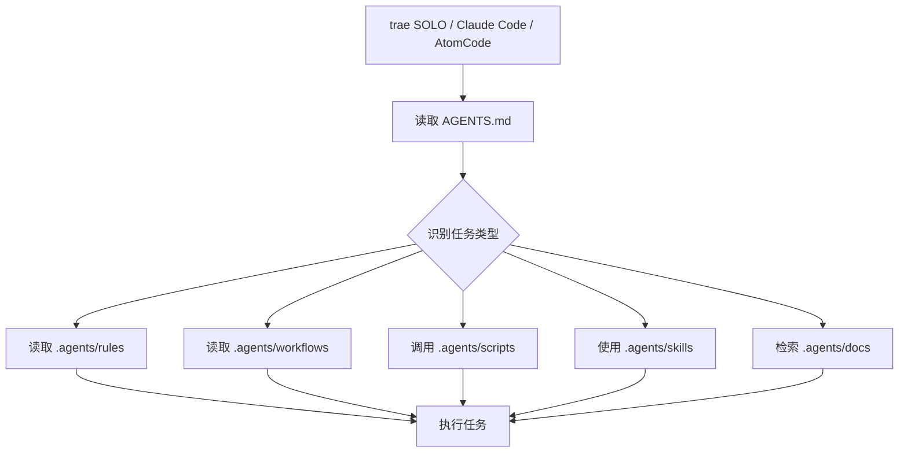
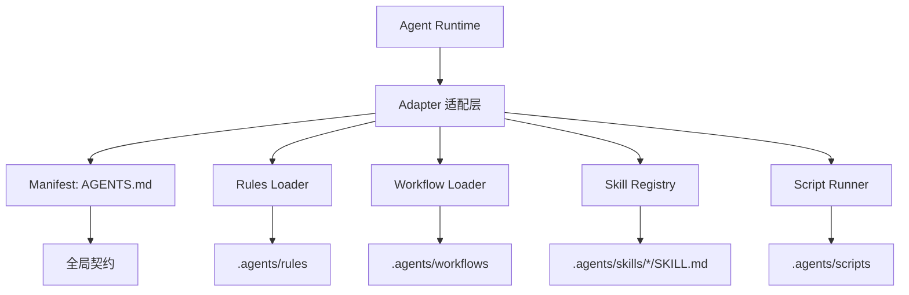
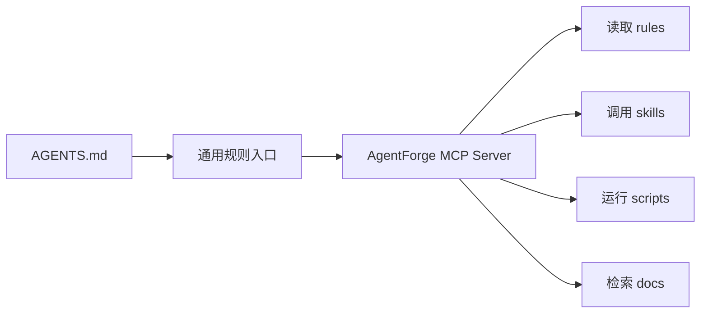

# AgentForge 作为智能体外挂能力包

## 目标

说明 trae SOLO、Claude Code、AtomCode 等智能体如何把本项目作为外挂能力包、项目级插件或上下文增强层使用。

本文面向 AI 智能体和项目维护者，重点回答：外部智能体进入 AgentForge 后应该读取什么、如何路由上下文、如何调用规则、工作流、技能、脚本与知识资产。

## 核心结论

AgentForge 可以作为项目级 AI 智能体外挂系统使用：

- 以 `AGENTS.md` 作为 Manifest 和最高优先级入口。
- 以 `.agents/` 作为能力容器。
- 以 `.agents/rules/` 提供高频执行规则。
- 以 `.agents/workflows/` 提供流程化任务指南。
- 以 `.agents/skills/` 提供可迁移技能。
- 以 `.agents/scripts/` 提供自动化校验和辅助脚本。
- 以 `.agents/docs/` 提供 AI 专属知识库和长期沉淀。



## 入口文件

### `AGENTS.md`

`AGENTS.md` 是所有智能体进入本项目后的最高优先级契约，承担以下职责：

- 定义全局沟通语言。
- 定义上下文读取策略。
- 定义任务类型到规则文件的路由。
- 定义文档边界和产物位置。
- 定义工具链初始化和检查入口。
- 保留项目哲学驱动、极简原则和 Mermaid 优先等核心约束。

外部智能体应先读取 `AGENTS.md`，再根据任务类型按需读取 `.agents/` 下的专题资产。

### `.agents/README.md`

`.agents/README.md` 是 `.agents/` 目录的说明入口，用于理解规则、工作流、技能、脚本和知识资产的组织方式。

## 目录能力映射

| 目录 | 外挂能力 | 使用场景 |
|---|---|---|
| `.agents/rules/` | 规则外挂 | Python、前端、后端、文档、上下文节省、技能开发等任务 |
| `.agents/workflows/` | 工作流外挂 | PR Review、流程化执行、审查闭环 |
| `.agents/skills/` | 技能外挂 | 可迁移、可评测、可打包的智能体技能 |
| `.agents/scripts/` | 工具外挂 | 环境检查、兼容性检查、专项自动化校验 |
| `.agents/docs/` | 知识外挂 | 架构理解、历史设计、故障模式、参考资料 |
| `.agents/templates/` | 模板外挂 | 技能、文档或标准结构复用 |

## trae SOLO 使用方式

trae SOLO 适合把 AgentForge 作为工作区级智能体能力包使用。

推荐流程：

1. 打开 AgentForge 工作区。
2. 先读取 `AGENTS.md`。
3. 根据用户任务类型读取对应规则。
4. 需要自动化验证时，优先检查 `.agents/scripts/` 和 `mise.toml`。
5. 任务完成后按文档治理规则归档长期沉淀。

推荐会话提示：

```text
请把本项目作为智能体外挂能力包使用。先读取 AGENTS.md，之后根据任务类型按需读取 .agents/ 下的 rules、workflows、skills、scripts 和 docs，不要一次性加载全部上下文。
```

## Claude Code 使用方式

Claude Code 可以通过两种方式接入。

### 方式一：直接读取 `AGENTS.md`

在会话开始时要求 Claude Code 读取 `AGENTS.md`：

```text
请先读取 AGENTS.md，并把它作为本项目最高优先级的智能体运行契约。之后所有任务按 AGENTS.md 中的上下文路由执行。
```

### 方式二：使用 `CLAUDE.md` 适配层

如果需要 Claude Code 自动识别，可创建很薄的 `CLAUDE.md` 适配层，只负责转发到 `AGENTS.md`：

```markdown
# Claude Code Entry

请先读取并遵循 `AGENTS.md`。
`AGENTS.md` 是本项目 AI 智能体的最高优先级入口。
执行具体任务时，按其中的上下文路由读取 `.agents/` 下相关规则、工作流、技能、脚本与知识文档。
```

该方式适合需要长期兼容 Claude Code 默认项目入口的场景。

## AtomCode 使用方式

AtomCode 如果支持项目规则、自定义上下文或 Agent Profile，可将 `AGENTS.md` 配置为项目入口。

推荐配置提示：

```text
本项目的智能体入口是 AGENTS.md。你必须先读取 AGENTS.md，再根据任务类型按需读取 .agents/rules、.agents/workflows、.agents/skills、.agents/scripts、.agents/docs。不要一次性加载所有文件。
```

如果 AtomCode 支持 MCP 或工具插件，可进一步把 `.agents/scripts/` 包装为工具，把 `.agents/skills/` 包装为可调用技能。

## 接入层级

### Level 1：规则外挂

最低成本接入方式：只读取 `AGENTS.md` 和 `.agents/README.md`。

适合：

- trae SOLO
- Claude Code
- AtomCode
- Cursor
- Windsurf
- 通用代码智能体

获得能力：

- 统一项目规则。
- 统一语言风格。
- 统一文档边界。
- 统一任务路由。

### Level 2：工作流外挂

进一步读取 `.agents/rules/`、`.agents/workflows/` 和必要的 `.agents/docs/`。

适合：

- 代码审查。
- 文档迁移。
- Python 升级。
- 技能开发。
- 兼容性检查。
- 知识库建设。

获得能力：

- 按项目沉淀方法论执行任务。
- 减少自由发挥和上下文漂移。
- 形成规划、执行、验证闭环。

### Level 3：插件化技能外挂

最高级接入方式：把 `.agents/skills/` 下的技能注册到智能体运行时或 MCP Server。

可包装为：

| 目标平台 | 包装方式 |
|---|---|
| Claude Code | 项目规则加脚本调用 |
| trae SOLO | 工作区技能或项目技能目录 |
| AtomCode | 自定义 Agent skill |
| MCP | 将技能暴露为 MCP tool |
| CLI | 通过 Python 或 Node 命令行调用 |
| 多智能体系统 | 每个 skill 作为独立能力单元 |

## 最小接入协议

任意智能体接入 AgentForge 时，可使用以下协议：

```text
你现在在 AgentForge 项目中工作。

1. 首先读取 AGENTS.md，它是最高优先级的智能体契约。
2. 不要一次性加载所有上下文。
3. 根据任务类型按需读取 .agents/ 下的规则：
   - Python 任务读取 .agents/rules/python.md
   - 文档任务读取 .agents/rules/documentation.md
   - 技能任务读取 .agents/rules/skills.md
   - 前端任务读取 .agents/rules/frontend.md
   - 后端任务读取 .agents/rules/backend.md
   - PR Review 读取 .agents/workflows/pr-review.md
4. 需要自动化检查时，优先检查 .agents/scripts/ 和 mise.toml。
5. 任务中间产物不要污染根目录。
6. 使用中文与用户沟通。
```

## 工程化插件架构

如果要将 AgentForge 抽象成更正式的智能体插件系统，可设计为：



可抽象出以下接口：

| 接口 | 作用 |
|---|---|
| `load_manifest()` | 读取 `AGENTS.md` |
| `route_task(task)` | 判断任务类型并选择规则 |
| `load_rule(name)` | 读取 `.agents/rules/*.md` |
| `load_skill(name)` | 读取 `.agents/skills/*/SKILL.md` |
| `run_script(name)` | 调用 `.agents/scripts/*.py` 或 `mise` 命令 |

## 推荐演进方向

### 方案 A：增加 `CLAUDE.md` 适配层

用于兼容 Claude Code 默认入口。该文件应保持极薄，只转发到 `AGENTS.md`，避免形成双入口规则漂移。

### 方案 B：增加通用 Manifest

可新增通用智能体插件 Manifest，例如：

```json
{
  "name": "agentforge",
  "entry": "AGENTS.md",
  "rules_dir": ".agents/rules",
  "workflows_dir": ".agents/workflows",
  "skills_dir": ".agents/skills",
  "scripts_dir": ".agents/scripts",
  "docs_dir": ".agents/docs",
  "language": "zh-CN"
}
```

### 方案 C：增加 MCP Server

将 `.agents/skills/` 和 `.agents/scripts/` 暴露为 MCP 工具，使 Claude Desktop、Claude Code、trae SOLO、AtomCode 等通过统一协议调用。



## 维护原则

- `AGENTS.md` 只保留最高优先级契约和任务路由。
- 平台适配层应尽量薄，避免重复定义核心规则。
- `.agents/` 继续作为智能体资产的唯一主要容器。
- 新增长期知识应按 `.agents/docs/README.md` 的目录地图归档。
- 新增技能应遵循 `.agents/rules/skills.md` 和 `.agents/templates/SKILL.md`。
- 新增脚本应优先放入 `.agents/scripts/`。

## Search Keywords

AgentForge, agent plugin, 智能体外挂, 智能体插件, trae SOLO, Claude Code, AtomCode, AGENTS.md, `.agents`, skill registry, workflow loader, MCP Server, agent runtime, 项目级智能体能力包

## Trigger Phrases

- 智能体如何使用本项目作为外挂神器？
- Claude Code 如何接入 AgentForge？
- trae SOLO 如何读取本项目规则？
- AtomCode 如何使用 `.agents/`？
- 如何把 AgentForge 做成 MCP 插件？
- 如何把 `.agents/skills/` 注册成智能体技能？
- 本项目的智能体 Manifest 在哪里？
