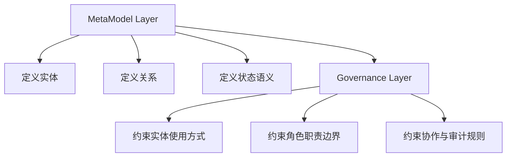
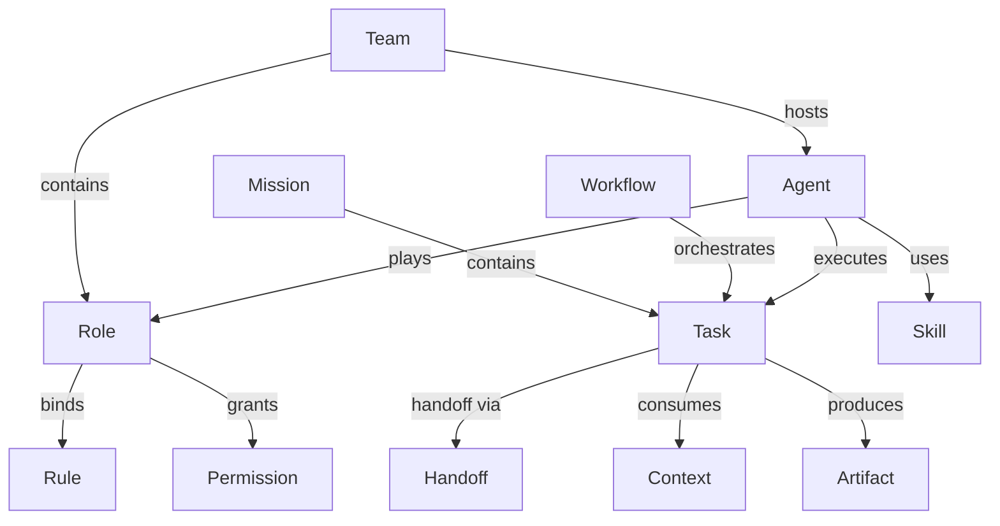

# Agent Collaboration Metamodel

本页是 AgentForge 协作元模型的稳定参考入口。

## 1. 定位

协作元模型定义了多 team、多角色、多智能体协作的统一语义边界。它不绑定具体实现，是跨项目可迁移的概念内核。

## 2. 双层结构

### MetaModel Layer

回答"是什么"：定义有哪些实体、实体之间允许建立什么关系、各类状态的最小语义、概念之间的边界。

- `Team` 是治理边界，不是聊天群组
- `Role` 是职责模板，不是权限集合的别名
- `Agent` 是执行主体，不等于某个具体模型实例
- `Workflow` 是协作协议，不是脚本文件路径
- `Memory` 是长期可复用知识，不等于上下文窗口
- `Context` 是任务执行时被消费的工作集

### Governance Layer

回答"应该怎么做"：哪些关系是必须的、哪些路径是推荐的、哪些行为是禁止的、关键动作如何被追踪与审计。

- `Agent` 必须通过 `Role` 进入规范性协作体系
- 跨 team 协作优先通过显式 `Handoff`
- 高权限能力不能绕开角色与规则体系直接使用

## 3. 五大领域

| 领域 | 职责 | 核心实体 |
|---|---|---|
| Organization | 组织边界、成员关系、职责模板 | `Team`, `Role`, `Agent` |
| Execution | 目标容器、任务分派、流程编排、交接 | `Mission`, `Task`, `Workflow`, `Handoff` |
| Knowledge | 规则、能力、记忆、上下文、产物 | `Memory`, `Context`, `Rule`, `Skill`, `Artifact` |
| Governance | 权限、策略、约束、治理边界 | `Policy`, `Permission` |
| Runtime State | 运行态会话与最小状态壳 | `Session` |

## 4. 核心实体

首版收敛 15 个核心实体：

| 实体 | 领域 | 语义 |
|---|---|---|
| `Team` | Organization | 治理边界与组织容器 |
| `Role` | Organization | 职责模板 |
| `Agent` | Organization | 执行主体 |
| `Mission` | Execution | 可分解的协作目标 |
| `Task` | Execution | 最小可分派工作单元 |
| `Workflow` | Execution | 任务协作协议 |
| `Handoff` | Execution | 显式交接对象 |
| `Memory` | Knowledge | 长期可复用认知资产 |
| `Context` | Knowledge | 任务执行时的工作集 |
| `Rule` | Knowledge | 行为约束与规范 |
| `Skill` | Knowledge | 可调用能力单元 |
| `Artifact` | Knowledge | 任务输出物 |
| `Policy` | Governance | 治理策略 |
| `Permission` | Governance | 访问与操作授权 |
| `Session` | Runtime State | 运行态上下文壳体 |

## 5. 关键关系

### 组织关系

- `Team` 包含 `Role`
- `Team` 承载 `Agent`
- `Agent` 扮演 `Role`
- 一个 `Agent` 可扮演多个 `Role`，单次 `Session` 建议指定主角色

### 执行关系

- `Mission` 包含多个 `Task`
- `Workflow` 编排 `Task`
- `Agent` 执行 `Task`
- `Task` 通过显式 `Handoff` 交接
- `Review` 首版不作为一级实体，先作为 `Task` 或 `Workflow` 的动作语义

### 知识关系

- `Rule` 可绑定到 `Team`、`Role`、`Workflow`
- `Skill` 可绑定到 `Role`、`Agent`
- `Memory` 可属于 `Team`、`Agent`、`Mission`
- `Context` 是任务执行时被消费的知识切片
- `Artifact` 是任务输出物，也是知识回流和审计输入

## 6. 约束

### 强约束

- `Agent` 不能脱离 `Role` 直接进入规范性协作体系
- `Task` 必须归属于某个 `Mission` 或更高层目标容器
- `Workflow` 不拥有知识，只编排执行
- `Permission` 不直接赋给 `Task`，而应赋给 `Role` 或 `Agent`
- `Handoff` 必须是显式对象，至少包含来源、目标、交接内容和状态

### 弱约束

- `Team` 是否必须拥有多个 `Role` 可由具体项目裁剪
- `Agent` 是否允许跨 `Team` 协作由治理层决定
- `Memory` 是否持久化及如何检索属于实现层
- `Skill` 是工具能力还是复合工作流单元，首版不强制限定实现形态

## 7. 目录映射

| 当前位置 | 协作模型定位 | 说明 |
|---|---|---|
| `AGENTS.md` | Governance Layer 总入口 | 全局治理契约、任务路由与协作边界。 |
| `.agents/rules/` | Governance Layer 规则实现 | 对 Role、Workflow、知识访问等对象的约束。 |
| `.agents/workflows/role-review/` | Execution 域协作协议实例 | 首条多角色协作工作流，覆盖角色审批四道门禁。 |
| `.agents/workflows/` | Execution 域协作协议实例 | 围绕任务执行的流程化编排说明。 |
| `.agents/skills/` | Knowledge 域能力资产 | 可被 Role 或 Agent 使用的能力单元。 |
| `.agents/roles/` | Organization 域实例承载 | 首字母义实例目录，当前试点 Role 实例。 |
| `.agents/docs/` | Knowledge 域长期知识层 | 规则、参考、洞见、spec、复盘等知识资产。 |
| `.trae/` | Runtime State 任务期工作台 | Session、草稿、执行中上下文与临时产物。 |

## 8. 目录演进

当前阶段：第一批试点目录 `.agents/roles/`。

演进规划：
1. `.agents/roles/` — 第一批试点
2. `.agents/teams/` — 后续评估
3. `.agents/agents/` — 最晚引入

演进约束：目录属于实例承载层，不是元模型本身；即使不创建这些目录，元模型依然成立。
