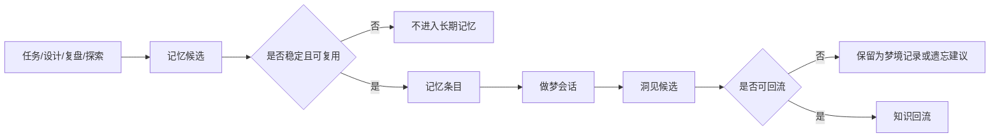

# Agent Memory Dream Protocol

## Search Keywords

- 主关键词：记忆协议、做梦协议、智能体记忆、智能体做梦、洞见回流、知识遗忘
- 英文术语：agent memory, dream session, insight feedback, knowledge forgetting, memory protocol
- 常见别名：记忆做梦协议、认知回流协议、智能体认知循环
- 错误短语：保存所有聊天记录、无限上下文、随机发散

## Goal

定义 AgentForge 中“记忆、做梦”的概念性知识协议，使智能体能够从任务、设计、复盘和探索中提取稳定知识，通过做梦式重组发现洞见，并将洞见回流到规则、模板、参考页或复盘档案。

## Relevance In AgentForge

- 关联模块：`.agents/docs/templates/`、`.agents/docs/references/`、`.agents/docs/superpowers/specs/`、`.agents/docs/superpowers/retrospectives/`
- 常见触发场景：任务后沉淀稳定经验、复盘后归纳模式、多个规则出现张力、用户要求做梦式归纳
- 优先检查文件：`.agents/docs/superpowers/specs/2026-05-24-agent-memory-dream-protocol-design.md`

## Trigger Phrases

- 这件事值得记忆吗
- 把这些经验做梦一下
- 从这些复盘里找隐藏模式
- 哪些规则可以删掉或合并
- 这些经验应该回流到哪里
- 提炼长期记忆
- 形成洞见并更新知识资产

## Core Concepts

- `记忆 Memory`：未来能降低理解成本或决策成本的稳定知识。
- `做梦 Dream`：对多条记忆进行非线性重组，发现隐藏关系、冲突、重复模式和演化方向。
- `洞见 Insight`：做梦之后产生的可判断、可验证、可回流结论。
- `遗忘 Forgetting`：主动删除、合并、降级或标记过期信息，防止知识库膨胀。

核心心法：

> 记忆负责“存真”，做梦负责“通变”，洞见负责“落地”，遗忘负责“归简”。

## Core Flow

## Required Inputs

### 记忆候选输入

- 信息片段
- 来源任务或文档
- 适用范围
- 复用理由
- 稳定性判断
- 过期条件

### 做梦会话输入

- 做梦主题
- 触发原因
- 输入记忆列表
- 重组问题
- 当前规则、模板或参考页的相关约束

## Required Outputs

### 记忆条目输出

- 标题
- 类型：事实 / 原则 / 经验 / 约束 / 反例
- 适用范围
- 内容
- 来源
- 过期条件
- 回流建议

### 做梦会话输出

- 发现的模式
- 发现的冲突
- 可遗忘内容
- 洞见候选
- 回流建议
- 下一步动作

## Gate Rules

- 不稳定的信息不能直接进入长期记忆。
- 当前任务进度不能作为长期记忆。
- 没有输入记忆，不触发正式做梦会话。
- 做梦输出不能只停留在摘要，必须包含模式、冲突、遗忘建议、演化建议或回流动作中的至少一类。
- 洞见不能自动修改规则，必须先判断回流位置。
- 没有过期条件的记忆应谨慎进入长期资产。

## Memory Candidate Triggers

适合提取记忆候选：

- 完成一次设计 spec
- 完成一次实施计划
- 完成一次问题修复并发现复用经验
- 完成一次复盘并得到稳定教训
- 用户明确表达长期偏好或项目原则

不适合提取记忆：

- 当前任务进度
- 一次性路径
- 临时命令输出
- 调试噪音
- 未验证猜测

## Dream Triggers

适合触发做梦：

- 同一主题积累多条记忆
- 多次复盘出现相似问题
- 不同规则、模板或经验之间出现张力
- 项目准备进入新阶段
- 用户明确提出“做梦、归纳、找隐藏模式、提炼下一步、看看哪些规则可以删掉或合并”

## Feedback Mapping

| 洞见类型 | 回流位置 |
|---|---|
| 高频执行规则 | `.agents/rules/` |
| 稳定参考知识 | `.agents/docs/references/` |
| 可复用流程 | `.agents/workflows/` |
| 可复用模板 | `.agents/docs/templates/` |
| 阶段性设计 | `.agents/docs/superpowers/specs/` |
| 复盘经验 | `.agents/docs/superpowers/retrospectives/` |

## Related Files

- [`../templates/agent-memory-entry-template.md`](../templates/agent-memory-entry-template.md)
- [`../templates/agent-dream-session-template.md`](../templates/agent-dream-session-template.md)
- [`../superpowers/specs/2026-05-24-agent-memory-dream-protocol-design.md`](../superpowers/specs/2026-05-24-agent-memory-dream-protocol-design.md)
- [`knowledge-driven-exploration-protocol.md`](knowledge-driven-exploration-protocol.md)

## Sources

- 设计来源：`.agents/docs/superpowers/specs/2026-05-24-agent-memory-dream-protocol-design.md`
- 版本：2026-05-24
- 抓取时间：不适用
