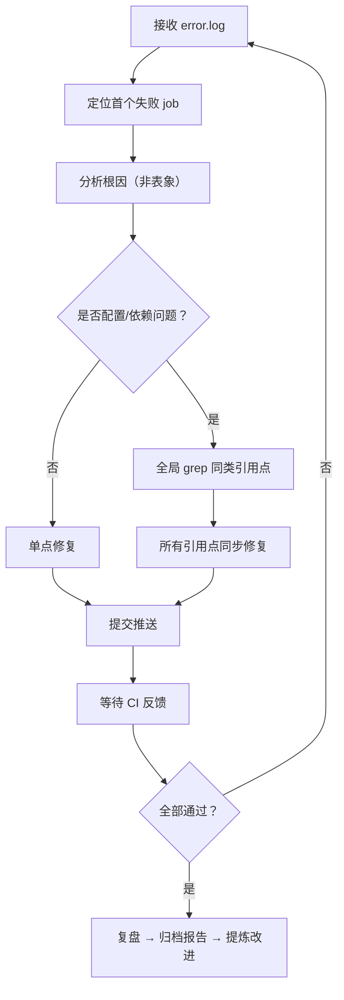

# CI 故障排查与维护指南

本文档沉淀 AgentForge 项目 CI 流水线维护中的常见问题、根因模式与修复策略。面向 AI 智能体在 CI 故障时的快速定位与修复。

## 1. uv 依赖管理

### 核心概念

`pyproject.toml` 中两套独立的依赖分组机制：

| 机制 | 定义位置 | 安装方式 | 适用场景 |
|------|---------|---------|---------|
| `[dependency-groups]` | pyproject.toml | `uv sync --group <name>` | 开发/测试/文档等环境分组 |
| `[project.optional-dependencies]` | pyproject.toml | `uv sync --extra <name>` | 可选功能模块（如 github-app） |

**关键规则**：`--group` 和 `--extra` 互不包含。当测试依赖可选模块中的包时，必须同时指定：

```bash
uv sync --group test --extra github-app
```

### 引用点检查清单

当修改依赖安装命令时，必须全局检查以下位置是否同步：

- [ ] `mise.toml` → `[tasks.install-test-deps]`
- [ ] `Containerfile.test` → `RUN uv sync ...`
- [ ] `.agents/scripts/sync-test-deps.sh`（共享脚本，如有）

修改后执行 `grep "uv sync --group test" -r .` 确认无遗漏。

### 常见故障模式

| 症状 | 根因 | 修复 |
|------|------|------|
| `ModuleNotFoundError: No module named 'httpx'` | `uv sync --group test` 未加 `--extra github-app` | 在所有引用点添加 `--extra github-app` |
| 仅 macOS/容器环境失败 | Dockerfile 中 `RUN uv sync` 遗漏 extras | 同步修复 `Containerfile.test` |

---

## 2. CJK PDF 测试策略

### 问题背景

fpdf2（v2.8.7）用 `add_font()` 加载 CJK TTF 字体生成的 PDF，pdfplumber 无法可靠提取 CJK 文本——`extract_text()` 返回乱码。

### 决策原则

测试的目标是**验证业务逻辑**（markdown 生成质量、章节识别），而非验证 PDF 库的 CJK 兼容性。因此，当 PDF 提取不可靠时，应绕过 PDF 生成/提取管线，直接注入测试数据。

### 修复模式

```python
# conftest.py — 注入预生成的元数据和原始文本
@pytest.fixture
def sample_meta_json(output_dir: Path) -> Path:
    """直接生成 pdf_page_meta.json，绕过 PDF 提取管线。"""
    meta = {
        "total_pages": 3,
        "headings": [
            {"page": 1, "level": "pian", "title": "德经", ...},
            ...
        ],
    }
    ...

@pytest.fixture
def sample_raw_text(output_dir: Path) -> Path:
    """直接生成 pdf_raw_text.txt，绕过 fpdf2+pdfplumber CJK 兼容问题。"""
    ...
```

### 注意事项

- 保留 `pdf_extract.py` 的独立测试（验证提取逻辑本身）
- 仅在 convert/integration 测试中注入数据
- 测试用 fixture 数据应与真实 PDF 结构一致

---

## 3. GitHub Actions 维护

### Runner 版本管理

**原则**：使用具体版本号而非 `-latest` 标签。

| ❌ 避免 | ✅ 推荐 |
|---------|---------|
| `windows-latest` | `windows-2025` |
| `ubuntu-latest` | `ubuntu-24.04` |

原因：GitHub 会提前约一个月通知 `-latest` 标签重定向，届时 CI 可能因镜像变更出现兼容性问题。

### Action 版本升级

升级第三方 Action 后必须校验参数兼容性：

| Action | 版本变更 | 参数变更 |
|--------|---------|---------|
| `codecov/codecov-action` | v4 → v5 | `file` → `files` |
| `actions/upload-artifact` | v4 → v6 | 无 breaking |

升级后检查 CI 输出的 `Unexpected input(s)` 警告。

### Node.js 弃用

当 CI 输出 `Node.js 20 is deprecated` 时：

1. 定位引用该 Node 版本的 Action
2. 升级到最新版本（通常支持 Node.js 24）
3. 如警告来自上游 Action 的内部依赖（如 `actions/github-script`），无法在本项目修复——仅为通知

---

## 4. 代码格式

### ruff format 预检

pre-commit hook `ruff-format`（`.pre-commit-config.yaml`）已配置。每次修改 `.py` 文件后，提交前应运行：

```bash
ruff format <modified_files>
```

或完整运行：

```bash
pre-commit run ruff-format --all-files
```

### 常见故障

| 症状 | 根因 | 修复 |
|------|------|------|
| CI lint 失败，ruff format 修改了文件 | 修改后未本地运行 ruff format | 本地格式化后重新提交 |

---

## 5. CI 故障修复闭环

当收到 CI 失败通知时，按以下流程推进：



**核心原则**：
1. 每次提交只解决一个根因（便于 revert）
2. 修复后全局 grep 同类引用点
3. 升级第三方 Action 后校验参数兼容性
4. CI 链式故障需逐轮推进——每次 error.log 只暴露首个失败 job

---

## 6. 参考文件索引

| 文件 | 用途 |
|------|------|
| `.github/workflows/ci.yml` | CI 主流水线 |
| `mise.toml` | mise 任务定义（含 install-test-deps） |
| `Containerfile.test` | Docker 容器化测试环境 |
| `.agents/scripts/sync-test-deps.sh` | CI 测试依赖统一安装脚本 |
| `.pre-commit-config.yaml` | pre-commit hooks 配置 |
| `pyproject.toml` | 依赖分组定义 |
| `.agents/docs/superpowers/retrospectives/` | 历史复盘报告 |
