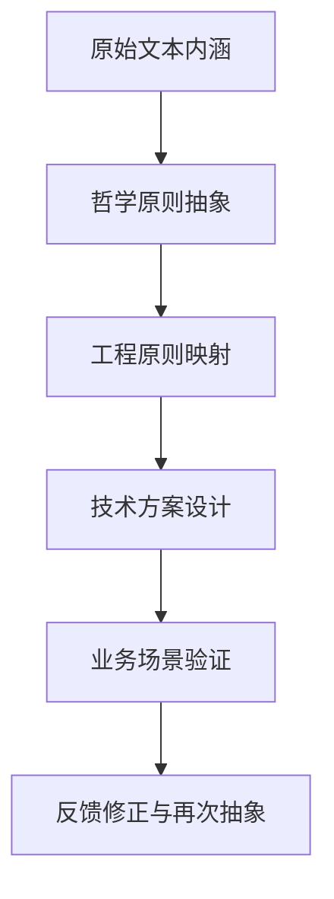

# Dao Tech Foundation

## Search Keywords

- 主关键词：大道至简、道德经、马王堆帛书、哲学驱动、技术实施方案
- 英文术语：Tao Te Ching, Mawangdui Silk Manuscripts, minimalist design, philosophy-driven engineering
- 常见别名：道家技术观、道法自然设计、极简哲学底座、哲学到技术映射
- 错误短语：无

## Goal

说明本项目如何以马王堆帛书版《道德经》的原始文本内涵为研究基底，将“极致简约、大道至简”与“反者道之动，弱者道之用”的哲学思想转化为可执行的工程原则、技术方案与业务落地路径。

## Relevance In AgentForge

- 关联模块：`AGENTS.md`、`.agents/docs/`、`.agents/workflows/`、`.agents/skills/`
- 常见触发场景：制定长期路线、撰写技术方案、设计新技能、抽象业务能力、评估实现复杂度
- 优先检查文件：`AGENTS.md`、`.agents/README.md`、`.agents/docs/README.md`

## Trigger Phrases

- 本项目的哲学底层设计逻辑是什么
- 怎样把《道德经》的思想转成技术实施方案
- 新功能如何符合“大道至简”
- “反者道之动，弱者道之用”在工程上怎么落地

## Key Concepts

- **极致简约**：优先保留最小必要结构、最短依赖路径和最清晰职责边界，避免为未来假设过度设计。
- **反者道之动**：在架构与流程中保留回转、校正、反馈和降级能力，通过循环校验而非线性堆叠推动演进。
- **弱者道之用**：优先采用低侵入、可组合、可渐进替换的机制，以柔性约束替代刚性耦合。
- **原始文本优先**：涉及哲学解释、命名抽象和设计推演时，应尽量回到马王堆帛书版《道德经》的原始文本内涵，而非仅依赖二手转述。

## Transformation Path

该路径强调“先抽象、后实现、再回看”的闭环。任何设计若无法说明其业务验证方式，说明转化链条尚未闭合。

## Philosophy To Engineering Mapping

| 哲学内核 | 工程原则 | 技术落点 | 业务价值 |
|------|------|------|------|
| 大道至简 | 控制复杂度，优先最小闭环 | 降低模块耦合、缩短调用链、减少隐式配置 | 降低维护成本，提升交付稳定性 |
| 反者道之动 | 允许回转、纠偏与迭代反馈 | 诊断机制、状态恢复、可逆工作流、渐进式重构 | 提升系统韧性，减少一次性失败成本 |
| 弱者道之用 | 以柔性接口和低侵入方式组合能力 | 插件式技能、声明式规则、可替换模板、兼容层设计 | 降低接入门槛，支持多场景渐进落地 |

## Common Problems

### 问题：哲学表述停留在口号，无法指导实现

- 现象：文档中反复提到“大道至简”或“道法自然”，但没有约束设计取舍。
- 原因：缺少从哲学概念到工程原则、再到实现机制的映射层。
- 排查步骤：
  1. 检查方案是否明确写出“减少了什么复杂度”“保留了什么反馈机制”“降低了什么耦合”。
  2. 检查是否存在对应的技术落点，如工作流回退、声明式配置、模块边界控制。
  3. 检查是否给出业务场景中的收益或验证方式。
- 相关命令或代码位置：优先阅读 `AGENTS.md` 与本页的 `Philosophy To Engineering Mapping`。

### 问题：实现过度复杂，与极简原则冲突

- 现象：为了覆盖未来场景引入过多抽象层、配置项或流程分支。
- 原因：没有坚持“最小可行闭环”与“渐进扩展”的设计顺序。
- 排查步骤：
  1. 列出当前方案中的每一层抽象，判断是否直接服务于已确认需求。
  2. 识别能否通过复用现有规则、模板、脚本或工作流替代新增结构。
  3. 先保留最小能力闭环，将扩展点设计为后续可插拔能力，而非当前必备结构。
- 相关命令或代码位置：优先检查 `AGENTS.md`、`.agents/README.md` 和对应模块现有实现。

### 问题：理论与业务场景脱节

- 现象：哲学阐释完整，但无法说明服务了哪个具体业务问题。
- 原因：缺少“场景验证”这一环，导致抽象停在概念层。
- 排查步骤：
  1. 为每项设计明确对应的用户、任务或业务流程。
  2. 说明该设计如何减少摩擦、提升稳定性或增强可迁移性。
  3. 在复盘中验证实际效果，再决定是否上升为长期规范。
- 相关命令或代码位置：结合 `.agents/docs/superpowers/retrospectives/` 中的复盘资产进行验证。

## Working Heuristics

- 新增能力先做最小闭环，再考虑抽象共性。
- 优先使用低侵入改造而非大规模推倒重来。
- 每个设计都要有“反馈修正”路径，避免不可逆的单向演进。
- 若一个方案无法用一句话说明其业务收益，说明还不够成熟。

## Execution Layer

- 执行层框架入口：[`dao-business-mapping-framework.md`](./dao-business-mapping-framework.md)
- 首批示例场景：[`dao-scenario-catalog.md`](./dao-scenario-catalog.md)
- 场景模板：[`../templates/dao-scenario-card-template.md`](../templates/dao-scenario-card-template.md)

## Sources

- 官方文档：项目新增核心开发目标（用户明确提出）
- 版本：2026-05-23
- 抓取时间：不适用
