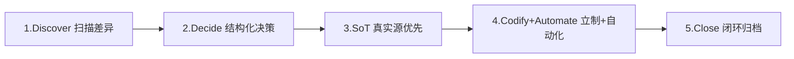

# 文档维护任务的 5 步通用流程

面向「文档维护」类任务（README/CHANGELOG/AGENTS/规则文件等多入口文档协同）的可复用方法论。本页是 2026-05 期间多轮 README/CHANGELOG 同步、内链治理、规则立制与 CI 集成实践的提炼。

## 1. 流程总览

每一步都对应一个核心动作与一个反模式：

| 步骤 | 核心动作 | 反模式 | 关键输出 |
|---|---|---|---|
| **1. Discover** | 并行扫描结构与文档比对，列差异清单（5±2 类） | 直接动手改 README | 主题化差异清单 |
| **2. Decide** | 结构化提问让用户多选范围 + 执行方式 | 擅自扩张 / 全推用户 | 本轮承诺范围 |
| **3. SoT** | 区分真实源 / 镜像页 / 索引页；根索引必指 SSOT | 根索引指向镜像页 | 一致的路径口径 + 镜像页脚注 |
| **4. Codify + Automate** | 隐性约定立成规则 + 写脚本 + mise + 双站 CI | 只修不立制 | 规则章节 + 脚本 + CI 步骤 |
| **5. Close** | 复盘暂存 → 用户确认 → 归档 → 原子化提交 | 跳确认归档 / 混合提交 | 归档文件 + N 个 atomic commits |

## 2. Discover — 扫描差异，先不决策

- **行动**：并行使用 `list_dir` / `grep_code` / `search_codebase` 比对项目结构 vs 现有文档入口；产出按主题分类的差异清单（理想 5±2 类）。
- **反模式**：直接动手改 README，错把局部表象当全部目标。
- **输出物**：差异清单（含每条差异的位置、缺失内容、置信度评估）。

## 3. Decide — 结构化决策，让用户选范围

- **行动**：使用结构化提问工具让用户在差异清单中多选/单选；同时让用户在「先扫再确认」与「直接落地」中选择执行方式。
- **反模式**：
  - 擅自扩张范围（"顺手优化"是常见陷阱）。
  - 反向把所有差异塞回去当问题轰炸用户。
- **输出物**：本轮承诺范围（明确入选 + 明确不做）。
- **每轮"继续"都先列剩余差异让用户选**，不要自动接力下一项。

## 4. SoT — 真实源优先，识别镜像页与索引页

辨识三类位置：

| 类别 | 性质 | 示例（本仓） | 编辑约束 |
|---|---|---|---|
| **真实源 (SSOT)** | 实际编辑与维护点 | `tests/project_changelogs/CHANGELOG_<年月>.md`、`.agents/skills/<skill>/CHANGELOG.md` | ✅ 仅在此处编辑 |
| **Sphinx 镜像页** | 通过 `{include}` 引用真实源进行文档站渲染 | `docs/changelogs/<topic>.md` | ❌ 禁止直接编辑内容 |
| **导航索引页** | 指向真实源或镜像页的入口表格 | 根 `CHANGELOG.md`、`docs/changelog.md` | ⚠️ 遵循指向规则 |

**指向规则**：

- 根目录索引（`CHANGELOG.md`、`README.md`）→ 必须指向**真实源**，确保 GitHub 浏览体验直达数据。
- Sphinx 站内索引（`docs/changelog.md`）→ 指向同站镜像页（相对路径）。
- 同一字段不要同时挂两条链接。

详见本仓 [`.agents/rules/documentation.md`](../../rules/documentation.md) 第 6 节。

## 5. Codify + Automate — 把隐性规则立成规则 + 自动化

每次发现的"隐性约定"立刻沉淀到 [`.agents/rules/`](../../rules/) 对应文档；同时为可机检的部分写脚本（标准库优先），并接入 `mise` 任务 + CI 干道。

### 5.1 脚本要点

- **跨平台编码**：Windows 控制台/管道默认 GBK，emoji 输出会触发 `UnicodeEncodeError`，应在入口统一 `sys.stdout.reconfigure(encoding="utf-8")`。
- **默认排除历史快照区**：例如 `superpowers/`（plans/retrospectives 允许包含规划中尚未实现的目标路径与占位符），允许通过参数显式覆盖。
- **退出码语义**：0=通过、1=失效、2=参数/运行时错（CI 友好）。
- **零依赖优先**：能用标准库就不引外部包，便于 CI 接入轻量 job（如 lint）。

### 5.2 双站 CI 一致接入

| 平台 | 接入位置 | 调度方式 |
|---|---|---|
| GitHub | `.github/workflows/ci.yml` 的 `lint` job | 通过 `mise run <task>` |
| GitCode（镜像）| `.gitcode/workflows/ci.yml` 的 `lint` job | 直接 `cd repo_workspace && python <script>`（无 mise） |

### 5.3 参考实现

本仓 [`.agents/scripts/check_doc_links.py`](../../scripts/check_doc_links.py) 是该模式的完整范例：递归扫描 + 历史快照排除 + UTF-8 兼容 + `--dirs/--files` 灵活配置 + mise 任务 `docs-internal-linkcheck` + 双站 CI 接入。

## 6. Close — 复盘 → 归档 → 原子化提交

按顺序执行：

1. 用 task-execution-summary 类技能生成复盘到 `.temp/`。
2. 用户确认后归档到 [`.agents/docs/superpowers/retrospectives/`](../superpowers/retrospectives/)，链接路径全部相对化，并补「归档」阶段产出物。
3. 删除 `.temp/` 临时稿。
4. 按主题原子化 Git 提交：
   - 先**基础设施**（脚本/CI）
   - 再**文档/规则修订**
   - 最后**归档复盘**
   - 每个 commit 单一主题，提交信息含一行摘要 + 多行细节。

## 7. 关键经验沉淀

- **README/CHANGELOG 这类多入口文件的修改是渐进式的**：多次小范围 `search_replace` 比一次大改更安全；每次保证唯一上下文，必要时重新读取最新内容。
- **新功能命令必须同时入 README 速查表 + CI 干道**，否则人类发现不了，也无法被持续校验。
- **历史快照区不应被强校验**：plans/retrospectives 是已发生的设计快照，允许包含"未来路径"和占位符示例，强行修正会破坏历史真实性。
- **"立制 + 自动化"是闭环的关键**：仅修复一次性问题而不立规则，问题会反复出现；规则若没有自动化保障，下次又会被破坏。

## 8. 适用边界

- ✅ 多入口文档同步、规则立制、内链治理、变更日志路径治理、文档导航补充。
- ❌ 不适用单一文件的小幅 typo 修改（直接改即可）；不适用业务代码重构（应走专门工作流）。

## 9. 关联资源

- [`.agents/rules/documentation.md`](../../rules/documentation.md) — 文档治理规则（含真实源 vs 镜像页规范）。
- [`.agents/scripts/check_doc_links.py`](../../scripts/check_doc_links.py) — 内链校验脚本参考实现。
- [`.agents/docs/superpowers/retrospectives/task-summary-readme-changelog-sync-20260525.md`](../superpowers/retrospectives/task-summary-readme-changelog-sync-20260525.md) — 本流程的实战复盘原型。
