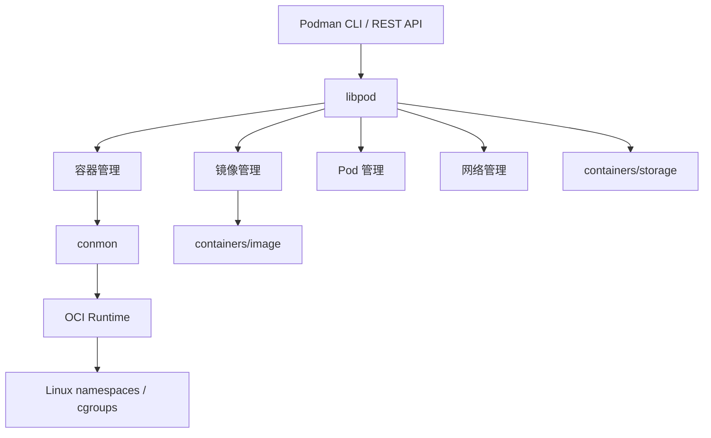
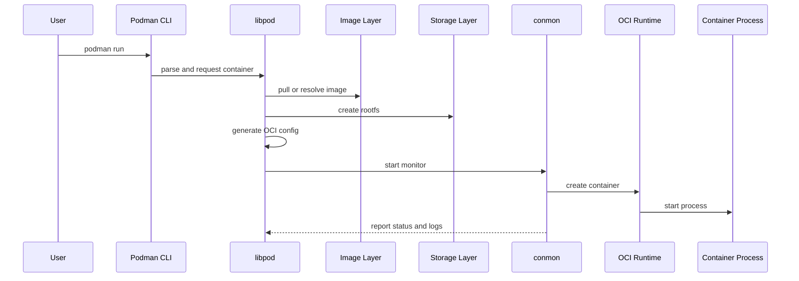

# Podman Architecture And Workflows

## Search Keywords

- 主关键词：Podman architecture
- 英文术语：libpod, conmon, containers/storage, containers/image, OCI Runtime, crun, runc, Netavark, CNI, Quadlet
- 常见别名：Podman 架构, Podman 容器创建流程, Podman 技术栈, Podman 工作流
- 错误短语：podman conmon, podman libpod, podman container creation flow, podman kube play flow

## Goal

说明 Podman 的核心组件职责、容器创建链路和常见工作流，帮助 agent 在排查容器构建、运行、网络、存储和 systemd 集成问题时快速定位层次。

## Relevance In AgentForge

- 关联模块：容器构建脚本、本地运行环境、CI 容器任务、Podman 集成说明和排障知识库。
- 常见触发场景：容器启动失败、镜像构建失败、日志缺失、存储驱动异常、Kubernetes YAML 本地运行失败。
- 优先检查文件：`Containerfile`、容器启动脚本、Podman 集成页、Podman issue-patterns 页面。

## Trigger Phrases

- Podman 内部是怎么创建容器的？
- libpod、conmon、crun 分别负责什么？
- Podman 容器日志为什么和 conmon 有关？
- Podman 构建镜像时涉及哪些组件？
- podman kube play 的定位是什么？

## Architecture Map



## Component Responsibilities

| 组件 | 职责 | 排查价值 |
|------|------|----------|
| Podman CLI / REST API | 用户入口，解析命令并调用 libpod | 判断命令参数、上下文和连接目标是否正确 |
| libpod | Podman 核心管理引擎，统一管理容器、镜像、Pod 和网络 | 判断问题属于容器管理层还是底层运行时 |
| conmon | 容器监控器，监控容器进程、收集日志、处理退出码 | 容器快速退出、日志缺失、退出码异常时优先关注 |
| containers/storage | 管理镜像层、容器可写层、卷和存储驱动 | 存储驱动、磁盘占用、overlay/fuse-overlayfs 问题相关 |
| containers/image | 负责拉取、推送、复制、签名验证镜像 | 镜像仓库、认证、签名和格式兼容问题相关 |
| containers/common | 提供配置、镜像签名策略、认证等共享能力 | 配置漂移、策略文件、认证异常相关 |
| OCI Runtime | 实际创建容器进程，常见实现包括 `crun`、`runc`、`kata-containers` | namespace、cgroups、seccomp、SELinux、运行时错误相关 |

## Container Creation Flow



## Workflow Notes

### Container Lifecycle

- 常用入口：`podman run`、`podman ps`、`podman logs`、`podman exec`、`podman stop`、`podman rm`。
- 排查重点：启动命令、环境变量、挂载路径、权限、端口映射和容器日志。
- 如果容器快速退出，先看 `podman logs <container>` 和 `podman inspect <container>`。

### Image Build

- 常用入口：`podman build -t <image> .`。
- 支持 `Containerfile` 和 Dockerfile 语法。
- 排查重点：构建上下文、基础镜像拉取、缓存、网络访问、平台架构和 registry 认证。

### Pod Management

- 常用入口：`podman pod create`、`podman pod start`、`podman pod ps`。
- Pod 内容器通常共享网络命名空间，适合本地模拟紧密耦合的多容器组合。
- 可通过 `podman generate kube` 导出 Kubernetes YAML。

### Quadlet

- 适用于将容器、Pod、Kube、Network、Volume 声明为 systemd 管理的服务。
- 排查重点：Quadlet 文件位置、systemd daemon reload、生成的 service、journal 日志和用户级/系统级 systemd 上下文。

### Kubernetes Integration

- `podman kube play <file>` 可把 Kubernetes YAML 部署到本地 Podman。
- `podman kube down <file>` 可按 YAML 清理资源。
- `podman generate kube <pod-or-container>` 可把本地容器或 Pod 导出为 YAML。

## Common Problems

### 问题：容器没有日志或日志不完整

- 现象：容器异常退出，但 `podman logs` 没有足够信息。
- 原因：进程过早退出、入口命令没有输出到 stdout/stderr、conmon 或日志驱动配置异常。
- 排查步骤：检查 `podman inspect` 中的状态和退出码，再确认容器入口命令是否把日志写到标准输出。
- 相关命令或代码位置：`podman logs <container>`、`podman inspect <container>`、启动命令。

### 问题：镜像层或容器可写层占用过高

- 现象：磁盘空间异常增长，删除容器后空间未按预期释放。
- 原因：镜像层、构建缓存、卷或容器可写层仍被引用。
- 排查步骤：使用 `podman system df` 查看占用，再谨慎清理未使用资源。
- 相关命令或代码位置：`podman system df`、`podman system prune`、`podman volume ls`。

### 问题：Kubernetes YAML 本地运行失败

- 现象：`podman kube play` 报字段不支持、网络或挂载错误。
- 原因：Podman 支持 Kubernetes YAML 的常用子集，某些集群级资源或云厂商特性无法直接本地运行。
- 排查步骤：先缩小 YAML 到 Pod、Deployment、Volume、Port 等核心字段，再逐步恢复配置。
- 相关命令或代码位置：`podman kube play <file>`、`podman kube down <file>`。

## Commands Or Snippets

```bash
podman run -d --name my-nginx -p 8080:80 docker.io/library/nginx:latest
podman logs my-nginx
podman exec -it my-nginx /bin/bash
podman build -t myapp .
podman pod create --name mypod
podman generate kube mypod > pod.yaml
podman kube play deploy.yaml
podman kube down deploy.yaml
podman system df
```

## Sources

- 页面来源：<https://acntxq6xf8pe.aiforce.cloud/app/app_4jwk79sp6p8gg>
- 本地来源摘要：../../sources/podman/aiforce-podman-wiki.md
- 页面版本标识：v5.8.x
- 抓取时间：2026-05-23
