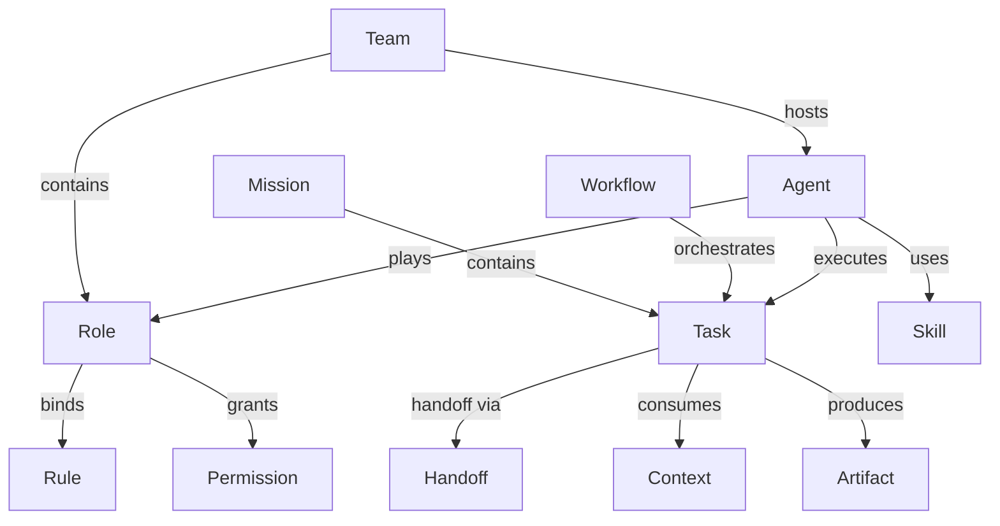
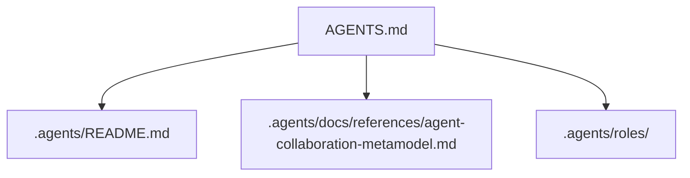

# Agent Collaboration Metamodel Implementation Plan

> **For agentic workers:** REQUIRED SUB-SKILL: Use superpowers:subagent-driven-development (recommended) or superpowers:executing-plans to implement this plan task-by-task. Steps use checkbox (`- [ ]`) syntax for tracking.

**Goal:** 为 AgentForge 落地第一阶段协作元模型入口，补齐稳定参考页、入口导航，并将 `.agents/roles/` 作为首个语义实例目录试点引入。

**Architecture:** 本阶段只实现“语义层 + 导航层 + 最小实例层”三部分。`.agents/docs/references/` 承载稳定参考页，`AGENTS.md` 与 `.agents/README.md` 负责全局路由和目录映射，`.agents/roles/` 作为 `Role` 的首个实例承载目录验证目录化方向，不引入运行时编排或配置引擎。

**Tech Stack:** Markdown、Mermaid、Git、项目既有 `.agents/` 文档体系。

---

### Task 1: 收敛 Spec 与稳定参考页

**Files:**
- Modify: `.agents/docs/superpowers/specs/2026-05-24-agent-collaboration-metamodel-design.md`
- Create: `.agents/docs/references/agent-collaboration-metamodel.md`

- [ ] **Step 1: 将 `.agents/roles/` 明确为第一批试点目录**

将 spec 中关于目录演进的表述统一为“首批引入 `roles/`，其余目录后续评估”，确保设计结论与用户确认一致。目标段落应包含如下语义：

```md
## Semantic Directories Evolution

在当前映射层稳定之后，第一批优先引入 `.agents/roles/`，并将其他语义实例目录保留为后续扩展选项。
```

- [ ] **Step 2: 生成稳定参考页骨架**

在 `.agents/docs/references/agent-collaboration-metamodel.md` 中沉淀一份面向长期复用的参考页，内容至少包含以下章节：

```md
# Agent Collaboration Metamodel

## 1. 定位
- 说明本页是协作元模型的稳定参考入口。

## 2. 双层结构
- MetaModel Layer
- Governance Layer

## 3. 五大领域
- Organization
- Execution
- Knowledge
- Governance
- Runtime State

## 4. 核心实体
- Team / Role / Agent
- Mission / Task / Workflow / Handoff
- Memory / Context / Rule / Skill / Artifact
- Policy / Permission / Session

## 5. 目录映射
- AGENTS.md
- .agents/rules/
- .agents/workflows/
- .agents/skills/
- .agents/docs/
- .agents/roles/
- .trae/
```

- [ ] **Step 3: 将参考页补齐为可独立阅读版本**

补充关键关系图、强约束、软约束和目录演进说明。主图建议直接使用以下 Mermaid：



- [ ] **Step 4: 自检 spec 与参考页是否一致**

Run:

```bash
git diff -- .agents/docs/superpowers/specs/2026-05-24-agent-collaboration-metamodel-design.md .agents/docs/references/agent-collaboration-metamodel.md
```

Expected: diff 只包含 “`.agents/roles/` 为首批试点目录” 的收敛，以及新参考页内容；不出现与运行时实现相关的新增承诺。

- [ ] **Step 5: Commit**

```bash
git add .agents/docs/superpowers/specs/2026-05-24-agent-collaboration-metamodel-design.md .agents/docs/references/agent-collaboration-metamodel.md
git commit -m "docs(agent): add collaboration metamodel reference"
```

### Task 2: 更新全局入口与目录导航

**Files:**
- Modify: `AGENTS.md`
- Modify: `.agents/README.md`

- [ ] **Step 1: 为 `AGENTS.md` 增加协作元模型导航**

在“项目结构入口”或“上下文路由”附近补充协作语义入口，至少表达以下信息：

```md
- 协作元模型参考：阅读 `.agents/docs/references/agent-collaboration-metamodel.md`
- Role 语义实例目录：优先参考 `.agents/roles/`
```

若补图，保持 Mermaid 基础语法，例如：



- [ ] **Step 2: 为 `.agents/README.md` 增加目录语义映射**

在阅读导航或目录定位部分补充 `roles/` 的定位，并说明其与现有目录的关系：

```md
| [`roles/`](./roles/) | 需要查看职责模板的读者 | 查看角色定义、默认规则绑定与权限边界。 |
```

同时补一段短说明，强调：

```md
- `.agents/roles/` 是协作元模型的首个语义实例目录试点。
- `.agents/skills/` 继续承载能力资产，`roles/` 不替代 `skills/`。
```

- [ ] **Step 3: 检查入口文档没有把目录职责写混**

逐项确认：

```text
AGENTS.md = 治理入口
.agents/README.md = 目录说明入口
.agents/docs/references/agent-collaboration-metamodel.md = 稳定参考页
.agents/roles/ = Role 实例承载目录
```

- [ ] **Step 4: 验证相对路径与导航一致性**

Run:

```bash
git diff -- AGENTS.md .agents/README.md
```

Expected: 只出现新增导航、目录说明和轻量 Mermaid 调整；不出现对现有规则入口的大规模改写。

- [ ] **Step 5: Commit**

```bash
git add AGENTS.md .agents/README.md
git commit -m "docs(agent): wire collaboration model navigation"
```

### Task 3: 引入 `.agents/roles/` 首批试点目录

**Files:**
- Create: `.agents/roles/README.md`
- Create: `.agents/roles/collaboration-architect.md`

- [ ] **Step 1: 创建 `roles` 目录说明页**

在 `.agents/roles/README.md` 中说明目录目标、边界和文件约定。起始内容应包含：

```md
# Roles

本目录承载协作元模型中的 `Role` 实例，用于定义职责模板、默认规则绑定、权限边界和协作期望。

## 目录边界
- 不存放执行日志
- 不存放临时上下文
- 不直接复制 `skills/` 内容
```

- [ ] **Step 2: 创建首个试点角色文件**

在 `.agents/roles/collaboration-architect.md` 中定义一个最小可用角色实例，至少包含以下字段：

```md
# Collaboration Architect

## Role Identity
- Name: `collaboration-architect`
- Domain: `Governance + Knowledge`

## Responsibilities
- 维护协作元模型语义边界
- 设计目录映射与治理约束

## Default Bindings
- Rules: `documentation.md`, `context-economy.md`
- References: `agent-collaboration-metamodel.md`

## Non-Goals
- 不直接承担运行时任务调度实现
```

- [ ] **Step 3: 确保角色文件不退化为提示词仓库**

检查角色文件是否同时满足：

```text
有职责
有默认绑定
有边界
没有长篇自由提示词堆叠
```

- [ ] **Step 4: 运行目录检查**

Run:

```bash
git diff -- .agents/roles/README.md .agents/roles/collaboration-architect.md
```

Expected: 目录仅包含说明页和一个角色实例；没有额外引入 `teams/`、`agents/` 或 `policies/` 目录。

- [ ] **Step 5: Commit**

```bash
git add .agents/roles/README.md .agents/roles/collaboration-architect.md
git commit -m "docs(agent): add roles pilot directory"
```

### Task 4: 回填引用与验收校验

**Files:**
- Read: `AGENTS.md`
- Read: `.agents/README.md`
- Read: `.agents/docs/references/agent-collaboration-metamodel.md`
- Read: `.agents/roles/README.md`
- Read: `.agents/roles/collaboration-architect.md`

- [ ] **Step 1: 检查无占位词**

Run:

```bash
rg "TODO|TBD|待定|占位" AGENTS.md .agents/README.md .agents/docs/references/agent-collaboration-metamodel.md .agents/roles/README.md .agents/roles/collaboration-architect.md
```

Expected: 无匹配结果。

- [ ] **Step 2: 检查项目内链接均为相对路径**

手动确认以下链接形式存在且正确：

```text
./roles/
./docs/references/agent-collaboration-metamodel.md
.agents/roles/
.agents/docs/references/agent-collaboration-metamodel.md
```

- [ ] **Step 3: 检查 Mermaid 图仅使用基础语法**

手动确认仅使用：

```text
flowchart TD
flowchart LR
```

不引入复杂主题配置或不兼容语法。

- [ ] **Step 4: 检查改动范围**

Run:

```bash
git status --short
```

Expected: 只包含本计划涉及文件，或明确保留用户已有改动；不得误改 `src/taolib/`。

- [ ] **Step 5: Final Commit**

```bash
git add AGENTS.md .agents/README.md .agents/docs/references/agent-collaboration-metamodel.md .agents/roles/README.md .agents/roles/collaboration-architect.md
git commit -m "feat(agent): introduce collaboration model entrypoints"
```
