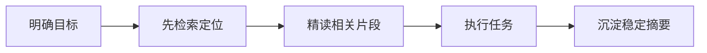
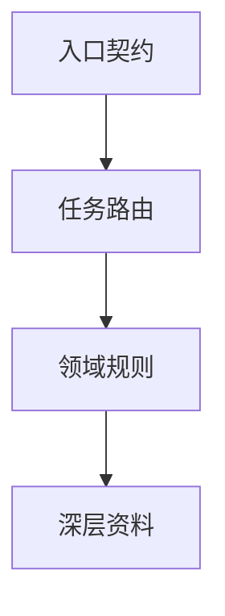
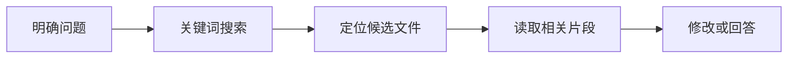

# 智能体 Token 消耗降低指南

## 定位

本文用于沉淀智能体运行过程中的上下文压缩、文档路由、检索策略与输出控制方法，适合作为后续优化智能体工作流、规则体系与知识库组织方式的参考。

## 核心原则

降低 token 消耗的核心不是减少智能体工作量，而是让智能体先定位、再读取、只保留相关上下文，并把稳定知识沉淀成可复用摘要。



## 控制输入上下文

最常见的 token 浪费来自一次性提供大量文件、日志或背景材料。

建议优先提供以下信息：

- 当前目标
- 相关文件路径
- 报错关键片段
- 期望结果
- 已知约束

应避免直接提供整个项目结构、完整日志、完整 README 或无筛选的长文档。大文件应只提供相关函数、类、配置段落或错误附近上下文。

示例：

```text
低效：
请阅读整个项目，然后帮我优化架构。

高效：
请基于 .agents/README.md 和 AGENTS.md，优化智能体上下文路由部分，目标是减少重复读取文档。
```

## 建立入口路由文档

智能体 token 消耗的一个主要来源，是反复读取规范、README、设计文档和历史记录。应将文档分成入口契约、任务路由、领域规则和深层资料四层。



优化原则：

- 入口契约只保留最高优先级规则和导航。
- 具体细节下沉到规则、工作流和知识文档。
- 按任务类型读取必要文档，而不是每次读取全部规则。
- 示例、背景解释和历史变更应尽量下沉，避免进入每次上下文。

## 使用摘要替代重复上下文

稳定不变的信息适合沉淀为摘要，而不是在每次任务中重复读取原始资料。

适合沉淀的内容：

- 项目技术栈
- 目录职责
- 代码风格约定
- 测试与构建入口
- 常见问题处理方式
- 核心业务概念

不适合沉淀的内容：

- 当前任务进度
- 一次性调试日志
- 临时方案
- 过期命令输出

推荐摘要形态：

```text
项目摘要：
- 本项目使用 uv 管理 Python 环境
- .agents/ 承载 AI 规则、工作流、技能与知识资产
- README.md 面向人类，.agents/docs/ 面向智能体
- 临时文件统一放入 .temp/
```

## 先搜索，再精读

文件读取应遵循先定位、再精读的流程。



实践建议：

- 查文件名时先使用文件模式匹配。
- 查概念、函数、错误时先使用关键词搜索。
- 理解架构时再使用语义检索。
- 只在必要时读取完整文件。
- 日志过长时优先筛选 error、warning、traceback、failed 等关键词。

## 控制输出长度

智能体输出本身也会消耗 token。可通过约束输出形态降低消耗。

可使用的提示方式：

```text
请先给 5 条结论，不要展开；如果我需要再详细解释。
```

```text
只输出修改方案，不要解释背景。
```

```text
请用表格列出问题、原因、修复建议，控制在 500 字内。
```

对于代码任务，可要求只说明改了哪些文件、为什么改、如何验证，不要重复贴完整代码。

## 长材料预处理

长日志、网页、PDF、研究材料应先压缩成结构化摘要。

长日志摘要模板：

```text
任务：运行测试失败
命令：uv run pytest
关键错误：
- ModuleNotFoundError: xxx
- failed at tests/test_agent.py::test_xxx
相关文件：
- src/agent/core.py
- tests/test_agent.py
```

长文档摘要模板：

```text
文档主题：
核心结论：
约束条件：
和当前任务相关的章节：
不相关内容：
```

## 精简提示词与规则体系

系统提示词、角色描述、工具说明和工作流说明应避免重复和过长。

| 优化点 | 做法 |
|---|---|
| 删除重复规则 | 同一规则只保留在最高优先级位置 |
| 合并相近规则 | 将相似的文档治理、文件治理和上下文治理规则归并 |
| 使用路由 | 不同任务读取不同规则 |
| 使用短句 | 避免长篇解释进入每次上下文 |
| 分离人类文档和 AI 文档 | README 不承载过多智能体执行细节 |
| 下沉示例 | 示例只在需要时读取 |

## 设置上下文预算

可在任务开始时要求智能体遵守上下文预算。

```text
本任务请遵守 token 节省策略：
1. 先搜索，不要全量读取文件；
2. 每次最多读取 200 行；
3. 只保留和任务直接相关的上下文；
4. 回答控制在 800 字以内；
5. 不要重复解释已确认的信息。
```

## AgentForge 项目建议

结合本项目结构，可按以下方向持续优化。

### 入口契约保留内容

- 沟通语言
- 最高优先级原则
- 上下文路由
- 关键目录职责
- 强制性规则

### 下沉到 `.agents/docs/` 的内容

- 哲学背景长解释
- 详细设计理念
- 示例图
- 历史变更
- 扩展说明

### 下沉到 `.agents/rules/` 的内容

- Python 规则
- 文档规则
- 技能开发规则
- 前端规则
- 后端规则
- 测试规则

### 建议结构

```text
AGENTS.md
├── 全局不可违背规则
├── 任务路由表
├── 目录边界
└── 详细规则索引
```

## 十条高收益实践

1. 让智能体先搜索，不要先读全量文件。
2. 把长文档拆成入口文档与专题文档。
3. 固定规则做摘要沉淀。
4. 当前任务只提供必要上下文。
5. 长日志先压缩为结构化摘要。
6. 输出要求短答，必要时再展开。
7. 不让智能体重复复述代码。
8. 避免每次加载完整 README、CHANGELOG、设计文档。
9. 中间产物放入 `.temp/`，避免后续被误读。
10. 为不同任务建立明确的上下文路由。
