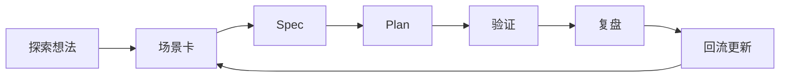

# Knowledge-Driven Exploration Foundation Implementation Plan

> **For agentic workers:** REQUIRED SUB-SKILL: Use superpowers:subagent-driven-development (recommended) or superpowers:executing-plans to implement this plan task-by-task. Steps use checkbox (`- [ ]`) syntax for tracking.

**Goal:** 将“知识沉淀驱动的探索型能力底座”从设计稿落实为可复用协议页、模板资产、最小工作台样例与导航入口，并用一个真实试点打通闭环。

**Architecture:** 实施分为六个串联文档单元。先把设计稿固化为稳定协议页，再升级场景卡与新增 spec / 复盘 / 工作台模板，随后创建首个 `.trae` 试点实例并把它回填到场景目录与导航中，最后做整体验证。整个过程只修改 `.agents/docs/` 与 `.trae/` 下的文档资产，不触碰业务代码。

**Tech Stack:** Markdown, Mermaid, AgentForge `.agents/` conventions, `.trae` workspace structure, VS Code diagnostics, Git

---

## File Structure

- Create: `.agents/docs/references/knowledge-driven-exploration-protocol.md`
  - 作用：作为探索型能力底座的稳定协议页，沉淀统一输入、输出、门禁规则与试点建议。
- Modify: `.agents/docs/templates/dao-scenario-card-template.md`
  - 作用：在现有场景卡模板上增加比赛型、应用型、技能生态型三种轻量视图，避免创建平行模板。
- Create: `.agents/docs/templates/knowledge-driven-exploration-spec-template.md`
  - 作用：提供探索 spec 母模板，约束目标、非目标、能力闭环与回流计划。
- Create: `.agents/docs/templates/knowledge-driven-exploration-retrospective-template.md`
  - 作用：提供复盘模板，强制回答复用、脆弱点、升级建议与适用范围。
- Create: `.agents/docs/templates/knowledge-driven-exploration-workbench-template.md`
  - 作用：定义 `.trae/specs/<topic>/` 工作台的最小文件结构与字段。
- Create: `.trae/specs/exploration-knowledge-loop-pilot/spec.md`
  - 作用：承载首个“探索任务知识闭环最小试点”的执行中 spec。
- Create: `.trae/specs/exploration-knowledge-loop-pilot/tasks.md`
  - 作用：承载首个试点的执行任务列表与依赖关系。
- Create: `.trae/specs/exploration-knowledge-loop-pilot/checklist.md`
  - 作用：承载首个试点的验收清单。
- Modify: `.agents/docs/references/dao-scenario-catalog.md`
  - 作用：将“探索任务知识闭环最小试点”加入长期场景目录，建立设计与试点之间的回流关系。
- Modify: `.agents/docs/README.md`
  - 作用：把探索协议页接入 AI 文档导航。
- Modify: `.agents/docs/references/README.md`
  - 作用：把探索协议页加入 `references/` 当前入口列表。

---

### Task 1: Create The Stable Exploration Protocol Page

**Files:**
- Create: `.agents/docs/references/knowledge-driven-exploration-protocol.md`

- [ ] **Step 1: Re-read the approved design to lock the protocol scope**

Run:
```bash
Get-Content .agents/docs/superpowers/specs/2026-05-24-knowledge-driven-exploration-foundation-design.md
```

Expected: the design explicitly defines `4 层结构`、`统一探索协议`、`5 个最小产物` and the recommended pilot `探索任务知识闭环最小试点`.

- [ ] **Step 2: Inspect the reference-page format before creating the new protocol page**

Run:
```bash
Get-Content .agents/docs/templates/reference-page-template.md
```

Expected: the template uses `Search Keywords`、`Goal`、`Relevance In AgentForge`、`Trigger Phrases` and `Sources` as the standard reference-page skeleton.

- [ ] **Step 3: Create the protocol page**

Create `.agents/docs/references/knowledge-driven-exploration-protocol.md` with exactly:
```md
# Knowledge-Driven Exploration Protocol

## Search Keywords

- 主关键词：探索协议、知识驱动探索、探索闭环、知识回流、探索型能力底座
- 英文术语：knowledge-driven exploration, exploration protocol, exploration loop, knowledge feedback loop
- 常见别名：探索底座协议、探索主线协议、知识沉淀协议
- 错误短语：无

## Goal

定义 AgentForge 中一次探索动作从立项到回流的统一协议，确保比赛、应用与技能生态三类探索都能复用同一条知识主线。

## Relevance In AgentForge

- 关联模块：`.agents/docs/templates/`、`.agents/docs/superpowers/specs/`、`.agents/docs/superpowers/retrospectives/`、`.trae/specs/`
- 常见触发场景：规划新的探索方向、设计最小试点、沉淀执行模板、复盘并升级规则
- 优先检查文件：`.agents/docs/superpowers/specs/2026-05-24-knowledge-driven-exploration-foundation-design.md`

## Trigger Phrases

- 如何把一个探索想法变成可执行闭环
- 比赛、应用和技能生态怎么共用一套探索流程
- 探索结束后经验应该沉淀到哪里
- 怎样定义探索完成而不只是“做过了”

## Core Flow



## Required Inputs

- `探索动机`：为什么现在要做这次探索
- `场景描述`：这次探索对应的真实问题空间
- `目标约束`：时间盒、边界、资源或风险约束
- `成功标准`：什么结果可以判定探索成立
- `已有参考`：现有文档、模板、历史试点或相关仓库资产

## Required Outputs

- `场景卡`：把探索问题表达为统一字段
- `设计 spec`：把场景卡展开为正式设计边界
- `执行计划`：把 spec 拆成可执行任务
- `验证记录`：记录演示、检查或阶段验收结果
- `复盘文档`：把经验回流到模板、规则或场景目录

## Gate Rules

- 没有场景卡，不进入 spec
- 没有 spec，不进入正式计划
- 没有验证，不判定探索完成
- 没有复盘回流，不算底座能力增长

## Layer Mapping

- `共性知识层`：统一资产与字段，是单一事实来源
- `场景适配层`：比赛、应用、技能生态三类轻量适配视图
- `轻工作流层`：推进探索动作，但不承担长期知识归档
- `回流演化层`：把偏差和经验反馈为模板、规则或目录更新

## Initial Deliverables

1. `统一探索协议页`
2. `三类探索场景卡视图`
3. `探索 spec 母模板`
4. `最小执行工作台模板`
5. `复盘回流模板`

## Recommended Pilot

- 试点主题：`探索任务知识闭环最小试点`
- 推荐原因：它能最低成本验证 `场景卡 -> spec -> plan -> 验证 -> 复盘 -> 回流` 是否真的成立

## Related Files

- [`../templates/dao-scenario-card-template.md`](../templates/dao-scenario-card-template.md)
- [`../templates/knowledge-driven-exploration-spec-template.md`](../templates/knowledge-driven-exploration-spec-template.md)
- [`../templates/knowledge-driven-exploration-retrospective-template.md`](../templates/knowledge-driven-exploration-retrospective-template.md)
- [`../../../../.trae/specs/exploration-knowledge-loop-pilot/spec.md`](../../../../.trae/specs/exploration-knowledge-loop-pilot/spec.md)

## Sources

- 设计来源：`.agents/docs/superpowers/specs/2026-05-24-knowledge-driven-exploration-foundation-design.md`
- 版本：2026-05-24
- 抓取时间：不适用
```

- [ ] **Step 4: Verify the protocol page content**

Run:
```bash
Get-Content .agents/docs/references/knowledge-driven-exploration-protocol.md
```

Expected: the page contains `Core Flow`、`Required Inputs`、`Required Outputs`、`Gate Rules` and `Recommended Pilot`.

- [ ] **Step 5: Run diagnostics on the new protocol page**

Check:
```text
file:///c:/Users/xinzo/OneDrive/Desktop/AI/Dao/spaces/AgentForge/.agents/docs/references/knowledge-driven-exploration-protocol.md
```

Expected: no Markdown diagnostics requiring immediate fixes.

- [ ] **Step 6: Commit**

```bash
git add .agents/docs/references/knowledge-driven-exploration-protocol.md
git commit -m "docs(agents): add exploration protocol reference"
```

---

### Task 2: Upgrade The Shared Scenario Card Template

**Files:**
- Modify: `.agents/docs/templates/dao-scenario-card-template.md`

- [ ] **Step 1: Read the current scenario template before editing**

Run:
```bash
Get-Content .agents/docs/templates/dao-scenario-card-template.md
```

Expected: the file currently contains `Usage`、`Card Template`、`Validation Questions` and `Notes`.

- [ ] **Step 2: Replace the template with the exploration-ready version**

Replace the full contents of `.agents/docs/templates/dao-scenario-card-template.md` with exactly:
```md
# Dao Scenario Card Template

## Usage

用于把一个具体探索方向统一表达为“哲学 -> 产品 -> 技术 -> 验证 -> 复盘”的场景卡，并在同一张卡上支持比赛型、应用型与技能生态型三类轻量视图。

## Core Card Template

```md
### 场景：<名称>

- 场景目标：
- 哲学依据：
- 工程解释：
- 产品能力：
- 技术模块：
- 验证指标：
- 实施优先级：
- 风险与偏差：
- 复盘入口：
```

## Adaptation Views

### 比赛型探索

- 时间盒：
- 演示亮点：
- 评审价值：

### 应用型探索

- 用户价值：
- 能力边界：
- 阶段演进：

### 技能生态型探索

- 触发条件：
- 输入输出契约：
- 评测口径：

## Validation Questions

- 这个场景是否绑定了明确的哲学依据
- 这个场景是否抽象出了真实的产品能力
- 这个场景是否对应清晰的技术模块
- 这个场景是否定义了可观察的验证指标
- 这个场景是否识别了主要风险与偏差
- 这个场景是否预留了复盘回流路径
- 三类适配视图是否只做轻量补充，而没有复制一套新模板

## Notes

- 核心字段保持稳定，适配字段只补充差异化信息
- 若某场景需要更多上下文，应在独立 spec 中展开，而不是继续膨胀场景卡
- 所有字段都应能被人类和 AI 直接读取
```

- [ ] **Step 3: Verify the upgraded template**

Run:
```bash
Get-Content .agents/docs/templates/dao-scenario-card-template.md
```

Expected: the template contains `Core Card Template` and `Adaptation Views`, and still keeps `Validation Questions`.

- [ ] **Step 4: Run diagnostics on the template**

Check:
```text
file:///c:/Users/xinzo/OneDrive/Desktop/AI/Dao/spaces/AgentForge/.agents/docs/templates/dao-scenario-card-template.md
```

Expected: no Markdown diagnostics requiring immediate fixes.

- [ ] **Step 5: Commit**

```bash
git add .agents/docs/templates/dao-scenario-card-template.md
git commit -m "docs(agents): upgrade exploration scenario card template"
```

---

### Task 3: Create The Spec And Retrospective Templates

**Files:**
- Create: `.agents/docs/templates/knowledge-driven-exploration-spec-template.md`
- Create: `.agents/docs/templates/knowledge-driven-exploration-retrospective-template.md`

- [ ] **Step 1: Inspect the approved design sections that must appear in the reusable templates**

Run:
```bash
Get-Content .agents/docs/superpowers/specs/2026-05-24-knowledge-driven-exploration-foundation-design.md
```

Expected: the design clearly lists `Goal`、`Non-Goals`、`Architecture Layers`、`Protocol`、`Validation Model` and `Risks`.

- [ ] **Step 2: Create the spec template**

Create `.agents/docs/templates/knowledge-driven-exploration-spec-template.md` with exactly:
```md
# Knowledge-Driven Exploration Spec Template

## Usage

用于把一张探索场景卡展开为正式 spec，统一描述边界、核心能力闭环、阶段划分、验证标准与回流计划。

## Template

```md
# <主题>

## Goal

- 这次探索最终要证明什么

## Background

- 当前上下文
- 已有相关资产
- 为什么现在做

## Scope

- 本次要覆盖的内容

## Non-Goals

- 本次明确不做的内容

## Core Loop

- 场景卡如何进入 spec
- spec 如何进入计划
- 如何验证
- 如何复盘回流

## Layer Mapping

- 共性知识层：
- 场景适配层：
- 轻工作流层：
- 回流演化层：

## Deliverables

- 本次会产出哪些模板、页面、计划或试点

## Validation

- 低摩擦：
- 可复用：
- 可回流：
- 可扩展：

## Risks

- 主要风险
- 偏差路径

## Rollback Or Adjustment

- 如果试点失败，优先调整哪里

## Next Step

- 进入 plan 的条件
```

## Notes

- 首版优先保证字段稳定，不加入 PRD 级别的产品细节
- 如果探索内容超出一个闭环，应拆成多个 spec，而不是继续加章节
```

- [ ] **Step 3: Create the retrospective template**

Create `.agents/docs/templates/knowledge-driven-exploration-retrospective-template.md` with exactly:
```md
# Knowledge-Driven Exploration Retrospective Template

## Usage

用于在一次探索闭环结束后，回答“哪些能力已复用、哪些地方仍然脆弱、哪些经验应该升级为底座资产”。

## Template

```md
# <主题> Retrospective

## Outcome

- 这次探索最终交付了什么

## Reused Foundation

- 复用了哪些协议、模板、工作台结构或导航资产

## Friction Points

- 哪些步骤仍然依赖手工
- 哪些约定容易被误解

## Validation Result

- 低摩擦：
- 可复用：
- 可回流：
- 可扩展：

## Upgrade Recommendations

- 哪些内容应该升级为模板
- 哪些内容应该进入参考页
- 哪些内容应该回写场景目录

## Best Fit

- 更适合比赛型、应用型还是技能生态型探索

## Next Action

- 下一轮应继续扩展什么
```

## Notes

- 复盘必须指向至少一个可执行的回流动作
- 复盘不是任务流水账，而是底座演化输入
```

- [ ] **Step 4: Verify both templates**

Run:
```bash
Get-Content .agents/docs/templates/knowledge-driven-exploration-spec-template.md
Get-Content .agents/docs/templates/knowledge-driven-exploration-retrospective-template.md
```

Expected: the spec template contains `Core Loop` and `Layer Mapping`; the retrospective template contains `Reused Foundation` and `Upgrade Recommendations`.

- [ ] **Step 5: Run diagnostics on both templates**

Check:
```text
file:///c:/Users/xinzo/OneDrive/Desktop/AI/Dao/spaces/AgentForge/.agents/docs/templates/knowledge-driven-exploration-spec-template.md
file:///c:/Users/xinzo/OneDrive/Desktop/AI/Dao/spaces/AgentForge/.agents/docs/templates/knowledge-driven-exploration-retrospective-template.md
```

Expected: no Markdown diagnostics requiring immediate fixes.

- [ ] **Step 6: Commit**

```bash
git add .agents/docs/templates/knowledge-driven-exploration-spec-template.md .agents/docs/templates/knowledge-driven-exploration-retrospective-template.md
git commit -m "docs(agents): add exploration spec and retrospective templates"
```

---

### Task 4: Create The Workbench Template And The First Pilot Workspace

**Files:**
- Create: `.agents/docs/templates/knowledge-driven-exploration-workbench-template.md`
- Create: `.trae/specs/exploration-knowledge-loop-pilot/spec.md`
- Create: `.trae/specs/exploration-knowledge-loop-pilot/tasks.md`
- Create: `.trae/specs/exploration-knowledge-loop-pilot/checklist.md`

- [ ] **Step 1: Inspect the current `.trae/specs/` file pattern**

Run:
```bash
Get-ChildItem .trae/specs
Get-Content .trae/specs/adopt-mise-dev-environment/spec.md
Get-Content .trae/specs/adopt-mise-dev-environment/tasks.md
Get-Content .trae/specs/adopt-mise-dev-environment/checklist.md
```

Expected: each workspace uses the three-file structure `spec.md`、`tasks.md` and `checklist.md`.

- [ ] **Step 2: Create the workbench template page**

Create `.agents/docs/templates/knowledge-driven-exploration-workbench-template.md` with exactly:
```md
# Knowledge-Driven Exploration Workbench Template

## Usage

用于在 `.trae/specs/<topic>/` 下创建执行中的探索工作台，保持 spec、tasks 与 checklist 三个文件结构稳定。

## Directory Layout

```text
.trae/specs/<topic>/
├── spec.md
├── tasks.md
└── checklist.md
```

## spec.md Skeleton

```md
# Spec

## Goal

- 本次试点要验证什么

## Scope

- 本次会做什么

## Non-Goals

- 本次明确不做什么

## Deliverables

- 具体产物

## Risks

- 当前主要风险
```

## tasks.md Skeleton

```md
# Tasks
- [ ] Task 1: 补齐场景卡与 spec。
- [ ] Task 2: 生成实施计划。
- [ ] Task 3: 完成最小验证。
- [ ] Task 4: 输出复盘并回流。

# Task Dependencies
- [Task 2] depends on [Task 1]
- [Task 3] depends on [Task 2]
- [Task 4] depends on [Task 3]
```

## checklist.md Skeleton

```md
- [ ] 场景卡已完成并字段完整
- [ ] spec 已完成并边界清晰
- [ ] plan 已完成并可执行
- [ ] 至少完成一次最小验证
- [ ] 已输出复盘并指定回流动作
```
```

- [ ] **Step 3: Create the pilot spec**

Create `.trae/specs/exploration-knowledge-loop-pilot/spec.md` with exactly:
```md
# Spec

## Goal

- 以最小成本验证“场景卡 -> spec -> plan -> 验证 -> 复盘 -> 回流”是否可以在 AgentForge 中稳定跑通。

## Scope

- 使用统一探索协议页作为规则入口
- 使用场景卡模板组织试点场景
- 使用计划文档驱动实施顺序
- 以一次真实复盘验证回流路径

## Non-Goals

- 本次不实现新的自动化工作流
- 本次不构建 UI 或数据库
- 本次不同时展开多个独立探索主题

## Deliverables

- 一个协议页
- 一组模板资产
- 一个 `.trae` 试点工作台
- 一份复盘回流动作

## Risks

- 试点范围可能因为文档膨胀而失控
- 回流动作如果不明确，试点会退化为一次性记录
```

- [ ] **Step 4: Create the pilot task list**

Create `.trae/specs/exploration-knowledge-loop-pilot/tasks.md` with exactly:
```md
# Tasks
- [ ] Task 1: 完成协议页与模板资产。
- [ ] Task 2: 将试点场景写入长期场景目录。
- [ ] Task 3: 更新导航入口并验证引用链路。
- [ ] Task 4: 输出复盘并确认至少一个回流动作。

# Task Dependencies
- [Task 2] depends on [Task 1]
- [Task 3] depends on [Task 1, Task 2]
- [Task 4] depends on [Task 1, Task 2, Task 3]
```

- [ ] **Step 5: Create the pilot checklist**

Create `.trae/specs/exploration-knowledge-loop-pilot/checklist.md` with exactly:
```md
- [ ] 已创建统一探索协议页
- [ ] 已升级场景卡模板并包含三类适配视图
- [ ] 已创建 spec、retrospective 与 workbench 模板
- [ ] 已创建 `.trae/specs/exploration-knowledge-loop-pilot/` 工作台
- [ ] 已将试点场景写入长期场景目录
- [ ] 已更新 AI 文档导航入口
- [ ] 已完成一次复盘并指定回流动作
```

- [ ] **Step 6: Verify the new template and pilot workspace**

Run:
```bash
Get-Content .agents/docs/templates/knowledge-driven-exploration-workbench-template.md
Get-Content .trae/specs/exploration-knowledge-loop-pilot/spec.md
Get-Content .trae/specs/exploration-knowledge-loop-pilot/tasks.md
Get-Content .trae/specs/exploration-knowledge-loop-pilot/checklist.md
```

Expected: the template explains the `.trae/specs/<topic>/` directory shape, and the pilot files use a coherent `spec / tasks / checklist` trio.

- [ ] **Step 7: Commit**

```bash
git add .agents/docs/templates/knowledge-driven-exploration-workbench-template.md .trae/specs/exploration-knowledge-loop-pilot/spec.md .trae/specs/exploration-knowledge-loop-pilot/tasks.md .trae/specs/exploration-knowledge-loop-pilot/checklist.md
git commit -m "docs(exploration): add workbench template and pilot workspace"
```

---

### Task 5: Register The Pilot In The Long-Term Scenario Catalog

**Files:**
- Modify: `.agents/docs/references/dao-scenario-catalog.md`

- [ ] **Step 1: Read the current scenario catalog before extending it**

Run:
```bash
Get-Content .agents/docs/references/dao-scenario-catalog.md
```

Expected: the catalog currently contains three scenario cards and a `Catalog Overview` table.

- [ ] **Step 2: Update the overview table with the pilot entry**

Edit the `Catalog Overview` table so it becomes exactly:
```md
| 场景 | 哲学依据 | 优先级 | 状态 |
|------|----------|--------|------|
| 智能体柔性协作编排 | 弱者道之用 | 首批 | 示例 |
| 知识闭环与复盘驱动演进 | 反者道之动 | 首批 | 示例 |
| 业务能力最小闭环建模 | 大道至简 | 首批 | 示例 |
| 探索任务知识闭环最小试点 | 反者道之动 | 当前 | 试点 |
```

- [ ] **Step 3: Append the pilot scenario card after `业务能力最小闭环建模`**

Append exactly this block to `.agents/docs/references/dao-scenario-catalog.md`:
```md
### 场景：探索任务知识闭环最小试点

- 场景目标：以最小成本验证探索型能力底座是否能够稳定串起“场景卡 -> spec -> plan -> 验证 -> 复盘 -> 回流”。
- 哲学依据：`反者道之动`
- 工程解释：先把一次探索跑成完整闭环，再决定哪些经验值得进入模板、协议或工作流，而不是提前平台化。
- 产品能力：让一个探索主题能够被稳定立项、执行、验证并回流为长期资产。
- 技术模块：`.agents/docs/references/knowledge-driven-exploration-protocol.md`、`.agents/docs/templates/`、`.trae/specs/exploration-knowledge-loop-pilot/`
- 验证指标：协议与模板能支撑真实试点；试点结束后至少有一条明确回流动作；下一次探索可直接复用本次资产。
- 实施优先级：当前
- 风险与偏差：如果试点只停留在模板创建而没有复盘回流，会误判底座已经成立。
- 复盘入口：`.agents/docs/superpowers/retrospectives/`
```

- [ ] **Step 4: Verify the catalog update**

Run:
```bash
Get-Content .agents/docs/references/dao-scenario-catalog.md
```

Expected: the overview table contains the pilot row, and the new pilot scenario card follows the same field order as the existing cards.

- [ ] **Step 5: Run diagnostics on the updated catalog**

Check:
```text
file:///c:/Users/xinzo/OneDrive/Desktop/AI/Dao/spaces/AgentForge/.agents/docs/references/dao-scenario-catalog.md
```

Expected: no Markdown diagnostics requiring immediate fixes.

- [ ] **Step 6: Commit**

```bash
git add .agents/docs/references/dao-scenario-catalog.md
git commit -m "docs(agents): register exploration pilot scenario"
```

---

### Task 6: Wire Navigation And Run Final Verification

**Files:**
- Modify: `.agents/docs/README.md`
- Modify: `.agents/docs/references/README.md`
- Modify: `.agents/docs/references/knowledge-driven-exploration-protocol.md`
- Modify: `.agents/docs/templates/dao-scenario-card-template.md`
- Modify: `.agents/docs/templates/knowledge-driven-exploration-spec-template.md`
- Modify: `.agents/docs/templates/knowledge-driven-exploration-retrospective-template.md`
- Modify: `.agents/docs/templates/knowledge-driven-exploration-workbench-template.md`
- Modify: `.agents/docs/references/dao-scenario-catalog.md`
- Modify: `.trae/specs/exploration-knowledge-loop-pilot/spec.md`
- Modify: `.trae/specs/exploration-knowledge-loop-pilot/tasks.md`
- Modify: `.trae/specs/exploration-knowledge-loop-pilot/checklist.md`

- [ ] **Step 1: Update `.agents/docs/README.md` with the exploration protocol entry**

Edit the section `如果你需要理解项目的哲学驱动、极简原则与“理论 -> 技术 -> 业务”的转化路径：` so it becomes exactly:
```md
如果你需要理解项目的哲学驱动、极简原则与“理论 -> 技术 -> 业务”的转化路径：

1. 先看 [`references/dao-tech-foundation.md`](./references/dao-tech-foundation.md)
2. 再看 [`references/dao-business-mapping-framework.md`](./references/dao-business-mapping-framework.md)
3. 需要探索协议时看 [`references/knowledge-driven-exploration-protocol.md`](./references/knowledge-driven-exploration-protocol.md)
4. 需要具体示例时看 [`references/dao-scenario-catalog.md`](./references/dao-scenario-catalog.md)
5. 需要设计历史时，再进入 [`superpowers/`](./superpowers/)
```

- [ ] **Step 2: Update `.agents/docs/references/README.md` with the new protocol page**

Edit the `## 当前入口` list so it becomes exactly:
```md
## 当前入口

- [Dao Tech Foundation](./dao-tech-foundation.md)
- [Dao Business Mapping Framework](./dao-business-mapping-framework.md)
- [Knowledge-Driven Exploration Protocol](./knowledge-driven-exploration-protocol.md)
- [Dao Scenario Catalog](./dao-scenario-catalog.md)
- [Python](./python/README.md)
- [Podman](./podman/README.md)
- [mise](./mise/README.md)
```

- [ ] **Step 3: Verify the whole exploration chain together**

Run:
```bash
Get-Content .agents/docs/references/knowledge-driven-exploration-protocol.md
Get-Content .agents/docs/templates/dao-scenario-card-template.md
Get-Content .agents/docs/templates/knowledge-driven-exploration-spec-template.md
Get-Content .agents/docs/templates/knowledge-driven-exploration-retrospective-template.md
Get-Content .agents/docs/templates/knowledge-driven-exploration-workbench-template.md
Get-Content .agents/docs/references/dao-scenario-catalog.md
Get-Content .agents/docs/README.md
Get-Content .agents/docs/references/README.md
Get-Content .trae/specs/exploration-knowledge-loop-pilot/spec.md
Get-Content .trae/specs/exploration-knowledge-loop-pilot/tasks.md
Get-Content .trae/specs/exploration-knowledge-loop-pilot/checklist.md
```

Expected: the files form a coherent chain of `协议页 -> 场景卡模板 -> spec 模板 -> retrospective 模板 -> workbench 模板 -> 试点工作台 -> 长期场景目录 -> 导航入口`.

- [ ] **Step 4: Scan all exploration assets for placeholders**

Run:
```bash
Select-String -Path .agents/docs/references/knowledge-driven-exploration-protocol.md,.agents/docs/templates/dao-scenario-card-template.md,.agents/docs/templates/knowledge-driven-exploration-spec-template.md,.agents/docs/templates/knowledge-driven-exploration-retrospective-template.md,.agents/docs/templates/knowledge-driven-exploration-workbench-template.md,.agents/docs/references/dao-scenario-catalog.md,.agents/docs/README.md,.agents/docs/references/README.md,.trae/specs/exploration-knowledge-loop-pilot/spec.md,.trae/specs/exploration-knowledge-loop-pilot/tasks.md,.trae/specs/exploration-knowledge-loop-pilot/checklist.md -Pattern "[T]BD|[T]ODO|待补|占位|未定"
```

Expected: no matches outside intentional template placeholders such as `<名称>` or `<主题>`.

- [ ] **Step 5: Run diagnostics on the edited Markdown files**

Check:
```text
file:///c:/Users/xinzo/OneDrive/Desktop/AI/Dao/spaces/AgentForge/.agents/docs/references/knowledge-driven-exploration-protocol.md
file:///c:/Users/xinzo/OneDrive/Desktop/AI/Dao/spaces/AgentForge/.agents/docs/templates/dao-scenario-card-template.md
file:///c:/Users/xinzo/OneDrive/Desktop/AI/Dao/spaces/AgentForge/.agents/docs/templates/knowledge-driven-exploration-spec-template.md
file:///c:/Users/xinzo/OneDrive/Desktop/AI/Dao/spaces/AgentForge/.agents/docs/templates/knowledge-driven-exploration-retrospective-template.md
file:///c:/Users/xinzo/OneDrive/Desktop/AI/Dao/spaces/AgentForge/.agents/docs/templates/knowledge-driven-exploration-workbench-template.md
file:///c:/Users/xinzo/OneDrive/Desktop/AI/Dao/spaces/AgentForge/.agents/docs/references/dao-scenario-catalog.md
file:///c:/Users/xinzo/OneDrive/Desktop/AI/Dao/spaces/AgentForge/.agents/docs/README.md
file:///c:/Users/xinzo/OneDrive/Desktop/AI/Dao/spaces/AgentForge/.agents/docs/references/README.md
file:///c:/Users/xinzo/OneDrive/Desktop/AI/Dao/spaces/AgentForge/.trae/specs/exploration-knowledge-loop-pilot/spec.md
file:///c:/Users/xinzo/OneDrive/Desktop/AI/Dao/spaces/AgentForge/.trae/specs/exploration-knowledge-loop-pilot/tasks.md
file:///c:/Users/xinzo/OneDrive/Desktop/AI/Dao/spaces/AgentForge/.trae/specs/exploration-knowledge-loop-pilot/checklist.md
```

Expected: no Markdown diagnostics requiring immediate fixes.

- [ ] **Step 6: Check the final repository status**

Run:
```bash
git status --short
```

Expected: only the intended exploration foundation files are modified or created before the final commit, or the worktree is clean if earlier commits were made.

- [ ] **Step 7: Commit**

```bash
git add .agents/docs/README.md .agents/docs/references/README.md .agents/docs/references/knowledge-driven-exploration-protocol.md .agents/docs/templates/dao-scenario-card-template.md .agents/docs/templates/knowledge-driven-exploration-spec-template.md .agents/docs/templates/knowledge-driven-exploration-retrospective-template.md .agents/docs/templates/knowledge-driven-exploration-workbench-template.md .agents/docs/references/dao-scenario-catalog.md .trae/specs/exploration-knowledge-loop-pilot/spec.md .trae/specs/exploration-knowledge-loop-pilot/tasks.md .trae/specs/exploration-knowledge-loop-pilot/checklist.md
git commit -m "docs(exploration): finalize knowledge-driven exploration foundation"
```
