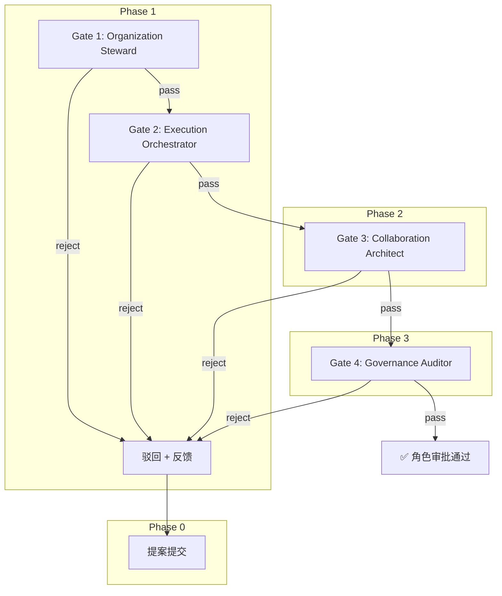

# Role Review Workflow Implementation Plan

> **For agentic workers:** REQUIRED SUB-SKILL: Use superpowers:subagent-driven-development (recommended) or superpowers:executing-plans to implement this plan task-by-task. Steps use checkbox (`- [ ]`) syntax for tracking.

**Goal:** 为 AgentForge 引入首条多角色协作工作流，用 Organization Steward → Execution Orchestrator → Collaboration Architect → Governance Auditor 的顺序门禁审批新增角色，并产出 4 份真实试运行审查记录。

**Architecture:** `.agents/workflows/role-review.md` 作为工作流主文档，`.agents/workflows/role-review/templates/` 承载提案模板，`.agents/workflows/role-review/verification/` 承载试运行审查记录。同时更新 `.agents/roles/README.md` 角色清单和协作元模型参考页的目录映射。

**Tech Stack:** Markdown、Mermaid、Git。

---

### Task 1: 创建工作流主文档与提案模板

**Files:**
- Create: `.agents/workflows/role-review.md`
- Create: `.agents/workflows/role-review/templates/proposal.md`

- [ ] **Step 1: 创建工作流主文档**

写入完整内容到 `.agents/workflows/role-review.md`：

```markdown
# 角色审查工作流 (Role Review Workflow)

本工作流定义了向 `.agents/roles/` 新增角色时的四道顺序门禁审批流程。四个已有角色按 Organization → Execution → Architecture → Governance 顺序逐级审查提案。

## 1. 概述



## 2. 触发条件

以下情况触发本工作流：

- 有人提出新增 `.agents/roles/` 下的角色实例
- 有人提出对现有角色进行结构性修改（Domain 变更、Responsibilities 重写）
- 协作元模型发生重大变更，需重新审查所有现有角色

## 3. 提案提交

提案者使用标准模板提交提案，模板见 [`role-review/templates/proposal.md`](role-review/templates/proposal.md)。

提案文件放在 `.agents/roles/proposals/` 下，命名为 `<role-name>-proposal.md`。

## 4. 门禁标准

### Gate 1: Organization Steward — 组织归属审查

**审查焦点**：角色的组织定位是否正确。

| 检查项 | 通过条件 | 驳回条件 |
|---|---|---|
| Domain 归属 | Domain 明确属于五大领域之一 | Domain 缺失、模糊或跨领域混写 |
| 名命规范 | Name 使用英文小写连字符，不混淆元模型实体名 | Name 使用中文、大写或与 `Team/Agent` 等实体名重复 |
| 角色唯一性 | 与现有 Role 职责不重叠 | 与已有 Role 职责高度重复且无区分说明 |

### Gate 2: Execution Orchestrator — 执行影响审查

**审查焦点**：角色定义是否侵蚀执行层边界。

| 检查项 | 通过条件 | 驳回条件 |
|---|---|---|
| 职责编排性 | Responsibilities 聚焦"设计/规范/审核"，不描述具体任务执行 | Responsibilities 直接描述任务调度、代码实现或 Agent 操作细节 |
| Agent 边界 | 不替代 Agent 的执行职责 | 将 Agent 的执行能力复述为角色职责 |
| 运行时排除 | Non-Goals 中明确排除运行时实现 | Non-Goals 未涉及运行时相关排除项 |

### Gate 3: Collaboration Architect — 语义一致性审查

**审查焦点**：角色文件是否符合元模型四字段规范。

| 检查项 | 通过条件 | 驳回条件 |
|---|---|---|
| 字段完整性 | Role Identity / Responsibilities / Default Bindings / Non-Goals 全部存在 | 任一必填字段缺失 |
| 引用有效性 | Default Bindings 中所有引用的 Rules/References 真实存在于仓库 | 引用路径错误或引用不存在的文件 |
| 映射兼容性 | 不破坏现有目录映射关系 | 引入后导致语义冲突（如 Role 名称与已有 Workflow 同名） |

### Gate 4: Governance Auditor — 合规审计审查

**审查焦点**：角色是否违反协作元模型强约束。

| 检查项 | 通过条件 | 驳回条件 |
|---|---|---|
| 强约束遵守 | 不违反五大强约束中任一条 | 违反任一条强约束 |
| 越界防护 | Non-Goals 覆盖了角色可能的越界风险 | Non-Goals 不足以阻止职责越界 |
| 可追踪性 | 角色文件包含完整四字段，可被独立审计 | 关键字段缺失导致无法追踪角色来源和定位 |

## 5. 交接协议

每道 Gate 审查完成后，通过显式 Handoff 交接到下一 Gate：

```
Gate N → Gate N+1
来源角色: [审查者角色名]
目标角色: [下一审查者角色名]
交接内容: 上一步审查结论 + 未解决问题
当前状态: prepared
```

Handoff 状态流转：

- **prepared** — 审查完成，等待下一 Gate 接手
- **accepted** — 下一 Gate 已接收并开始审查
- **rejected** — 下一 Gate 驳回，退回提案阶段

## 6. 审查输出格式

每道 Gate 产出统一格式的审查记录，示例：

```markdown
# Gate 1: Organization Steward 审查

**审查人**: Organization Steward
**审查对象**: example-role.md
**审查日期**: YYYY-MM-DD
**结论**: ✅ 通过

## 检查项

- [x] Domain 归属 — Domain 明确为 Organization，属于五大领域
- [x] 名命规范 — Name 使用英文小写连字符，不混淆实体名
- [x] 角色唯一性 — 与现有 Role 职责无重叠

## Handoff

来源角色: Organization Steward
目标角色: Execution Orchestrator
交接内容: 组织归属判定通过，无未解决问题
当前状态: prepared
```

## 7. 目录结构

```
.agents/workflows/
├── pr-review.md
├── role-review.md                          # 本工作流主文档
└── role-review/
    ├── templates/
    │   └── proposal.md                     # 提案模板
    └── verification/                       # 试运行审查记录
        ├── gate-01-organization-steward.md
        ├── gate-02-execution-orchestrator.md
        ├── gate-03-collaboration-architect.md
        └── gate-04-governance-auditor.md
```

## 8. 与现有资产的关系

- 本工作流不替代 `pr-review.md`，两者适用场景不同
- 本工作流的角色审查基于 `.agents/docs/references/agent-collaboration-metamodel.md` 中的强约束
- 提案模板与工作流内聚存放，遵循"模板随工作流"原则
```

- [ ] **Step 2: 创建提案模板**

写入完整内容到 `.agents/workflows/role-review/templates/proposal.md`：

```markdown
# 新角色提案模板

使用本模板向 `.agents/roles/` 提交新角色提案。提案文件命名为 `<role-name>-proposal.md`，放入 `.agents/roles/proposals/`。

---

# [角色名称] 提案

## Role Identity

- **Name**: `[英文小写连字符，如 knowledge-curator]`
- **Domain**: [Organization / Execution / Knowledge / Governance]
- **Description**: [一句话说明角色定位与核心价值]

## Motivation

[为什么需要这个角色？当前协作体系中存在什么空白或痛点？]

## Responsibilities

- [核心职责 1 — 使用"设计/维护/审核/规范/评估"等编排性动词，避免"执行/实现/调用"等运行时动词]
- [核心职责 2]
- [核心职责 3]

## Default Bindings

### Rules

- [`.agents/rules/xxx.md` — 必须真实存在于仓库]

### References

- [`.agents/docs/references/xxx.md` — 必须真实存在于仓库]

### Skills

- [skill-name — 必须存在于 `.agents/skills/`]

## Non-Goals

- [明确排除项 1 — 至少一条排除运行时实现]
- [明确排除项 2]

## Impact Assessment

[该角色引入后对现有角色、目录映射、工作流、规则体系的潜在影响。如果无影响，说明原因。]

---

## 提交检查清单

提交前逐项确认：

- [ ] Name 使用英文小写连字符，不与现有角色名重复
- [ ] Domain 属于五大领域之一
- [ ] Default Bindings 中所有引用路径真实存在
- [ ] Responsibilities 使用编排性动词，不描述具体执行细节
- [ ] Non-Goals 至少有一条排除运行时实现
- [ ] Impact Assessment 已填写
```

- [ ] **Step 3: 检查文件内容没有占位词**

Run:

```bash
rg "TODO|TBD|待定|占位" .agents/workflows/role-review.md .agents/workflows/role-review/templates/proposal.md
```

Expected: 无匹配结果。

- [ ] **Step 4: 提交**

```bash
git add .agents/workflows/role-review.md .agents/workflows/role-review/templates/proposal.md
git commit -m "docs(agent): add role review workflow and proposal template"
```

---

### Task 2: 生成 4 份试运行审查记录

**Files:**
- Create: `.agents/workflows/role-review/verification/gate-01-organization-steward.md`
- Create: `.agents/workflows/role-review/verification/gate-02-execution-orchestrator.md`
- Create: `.agents/workflows/role-review/verification/gate-03-collaboration-architect.md`
- Create: `.agents/workflows/role-review/verification/gate-04-governance-auditor.md`

- [ ] **Step 1: 写入 Gate 1 审查记录**

完整内容写入 `.agents/workflows/role-review/verification/gate-01-organization-steward.md`：

```markdown
# Gate 1: Organization Steward 审查

**审查人**: Organization Steward
**审查对象**: organization-steward.md
**审查日期**: 2026-05-24
**结论**: ✅ 通过（自审）

## 检查项

- [x] Domain 归属 — Domain 明确为 Organization，属于五大领域之一
- [x] 名命规范 — Name `organization-steward` 使用英文小写连字符，不混淆 `Team/Agent` 等实体名
- [x] 角色唯一性 — 与 Execution Orchestrator（Execution）、Collaboration Architect（Governance+Knowledge）、Governance Auditor（Governance）的职责边界清晰，无重叠

## 自审依据

本条为自审。Organization Steward 自身的 Domain、Name 和唯一性均符合 Gate 1 标准。职责聚焦 Team/Role/Agent 的组织边界维护，与其他三个角色的分属不同领域，无冲突。

## Handoff

来源角色: Organization Steward
目标角色: Execution Orchestrator
交接内容: 组织归属判定通过，Organization Steward 自身定位符合元模型规范。无未解决问题。
当前状态: prepared
```

- [ ] **Step 2: 写入 Gate 2 审查记录**

完整内容写入 `.agents/workflows/role-review/verification/gate-02-execution-orchestrator.md`：

```markdown
# Gate 2: Execution Orchestrator 审查

**审查人**: Execution Orchestrator
**审查对象**: execution-orchestrator.md
**审查日期**: 2026-05-24
**结论**: ✅ 通过（自审）

## 检查项

- [x] 职责编排性 — Responsibilities 聚焦"设计 Mission 分层结构、定义 Workflow 编排协议、规范 Handoff 结构、评估 Task 状态流转"，均为编排层语义，不描述具体任务调度实现
- [x] Agent 边界 — 不替代 Agent 执行任务，Non-Goals 明确"不直接承担运行时任务调度实现"和"不替代具体 Agent 的任务执行"
- [x] 运行时排除 — Non-Goals 包含"不直接承担运行时任务调度实现"，明确排除了运行时职责

## 自审依据

本条为自审。Execution Orchestrator 的 Responsibilities 全部使用"设计/定义/规范/评估"等编排性动词，不侵入 Agent 执行范围。Non-Goals 明确排除运行时实现和替代 Agent 执行，满足 Gate 2 标准。

## Handoff

来源角色: Execution Orchestrator
目标角色: Collaboration Architect
交接内容:
- Gate 1 (Org Steward) 组织归属判定：通过
- Gate 2 (Exec Orchestrator) 执行影响评估：通过
- 无未解决问题
当前状态: prepared
```

- [ ] **Step 3: 写入 Gate 3 审查记录**

完整内容写入 `.agents/workflows/role-review/verification/gate-03-collaboration-architect.md`：

```markdown
# Gate 3: Collaboration Architect 审查

**审查人**: Collaboration Architect
**审查对象**: collaboration-architect.md
**审查日期**: 2026-05-24
**结论**: ✅ 通过（自审）

## 检查项

- [x] 字段完整性 — Role Identity（Name/Domain/Description）、Responsibilities、Default Bindings（Rules/References/Skills）、Non-Goals 四个字段全部存在
- [x] 引用有效性 — Default Bindings 中的 `documentation.md`、`context-economy.md`、`agent-collaboration-metamodel.md` 均真实存在于仓库
- [x] 映射兼容性 — 不破坏现有目录映射，Collaboration Architect 作为 Governance+Knowledge 跨域角色，语义上填补了元模型维护与治理之间的空白

## 自审依据

本条为自审。Collaboration Architect 的四字段完整，所有绑定引用均为真实路径，Domain 虽标注为 Governance+Knowledge 跨域，但这是因其职责天然需要同时覆盖元模型定义（Knowledge）与治理约束（Governance），在语义上合理，不构成映射冲突。

## Handoff

来源角色: Collaboration Architect
目标角色: Governance Auditor
交接内容:
- Gate 1 (Org Steward) 组织归属判定：通过
- Gate 2 (Exec Orchestrator) 执行影响评估：通过
- Gate 3 (Collab Architect) 语义一致性检查：通过
- 备注：Collaboration Architect 标注为跨域角色（Governance+Knowledge），建议后续工作流明确跨域角色的命名约定
当前状态: prepared
```

- [ ] **Step 4: 写入 Gate 4 审查记录**

完整内容写入 `.agents/workflows/role-review/verification/gate-04-governance-auditor.md`：

```markdown
# Gate 4: Governance Auditor 审查

**审查人**: Governance Auditor
**审查对象**: governance-auditor.md
**审查日期**: 2026-05-24
**结论**: ✅ 通过（自审）

## 检查项

- [x] 强约束遵守 — 不违反五大强约束中任一条：不绕过 Role 体系、不将 Permission 直接赋给 Task、不将 Workflow 当作知识容器
- [x] 越界防护 — Non-Goals 包含"不实现权限引擎或审批系统、不替代具体业务审计流程、不在第一版引入自动化合规扫描"，覆盖了实现层越界、业务层越界和自动化越界三个风险方向
- [x] 可追踪性 — 四字段完整，Role Identity 明确标定 Domain 为 Governance，追溯链路清晰

## 自审依据

本条为自审。Governance Auditor 自身不违反任何强约束，Non-Goals 从三个维度排除了越界风险，四字段完整可追踪。作为四道 Gate 中的最后一关，Governance Auditor 需要对本条工作流全链路进行总结。

## 全链路总结

| Gate | 审查对象 | 结论 |
|---|---|---|
| Gate 1 | organization-steward.md | ✅ 通过 |
| Gate 2 | execution-orchestrator.md | ✅ 通过 |
| Gate 3 | collaboration-architect.md | ✅ 通过 |
| Gate 4 | governance-auditor.md | ✅ 通过 |

四个已有角色均通过自审，协作元模型的角色实例层质量得到验证。后续新增角色应严格遵循本工作流提交审批。

## 改进建议

- Gate 3 提出跨域角色（Governance+Knowledge）的命名约定应被明确，建议在后续工作流迭代中加入跨域命名规范
- 当前工作流仅覆盖"自审通过"场景，建议后续引入"驳回+修订+重新提交"的端到端验证

## Handoff

来源角色: Governance Auditor
目标角色: 无（最终 Gate）
交接内容: 全链路审查通过。四个已有角色均满足四道门禁标准。改进建议已记录。
当前状态: prepared
```

- [ ] **Step 5: 检查审查记录无占位词**

Run:

```bash
rg "TODO|TBD|待定|占位" .agents/workflows/role-review/verification/
```

Expected: 无匹配结果。

- [ ] **Step 6: 提交**

```bash
git add .agents/workflows/role-review/verification/
git commit -m "docs(agent): add role review trial run gate records"
```

---

### Task 3: 更新 roles/README.md 角色清单

**Files:**
- Modify: `.agents/roles/README.md`

- [ ] **Step 1: 增加审查状态列并补充工作流引用**

读取当前 `.agents/roles/README.md`。将角色清单表更新为增加审查状态列，并在表格后补充工作流引用段。

更新角色清单表：

```markdown
## 当前角色清单

| 文件 | 角色 | 领域 | 审查状态 |
|---|---|---|---|
| `organization-steward.md` | Organization Steward | Organization | ✅ 已审查 |
| `execution-orchestrator.md` | Execution Orchestrator | Execution | ✅ 已审查 |
| `collaboration-architect.md` | Collaboration Architect | Governance + Knowledge | ✅ 已审查 |
| `governance-auditor.md` | Governance Auditor | Governance | ✅ 已审查 |
```

在角色清单表之后补充：

```markdown
## 审查流程

新增角色须通过 `.agents/workflows/role-review.md` 定义的四道门禁审批。提案模板见 `.agents/workflows/role-review/templates/proposal.md`。

当前四个角色已通过试运行自审查，审查记录见 `.agents/workflows/role-review/verification/`。
```

- [ ] **Step 2: 提交**

```bash
git add .agents/roles/README.md
git commit -m "docs(agent): add review status to roles manifest"
```

---

### Task 4: 更新协作元模型参考页目录映射

**Files:**
- Modify: `.agents/docs/references/agent-collaboration-metamodel.md`

- [ ] **Step 1: 在目录映射表中增加 role-review 条目**

读取 `.agents/docs/references/agent-collaboration-metamodel.md`，找到 `## 7. 目录映射` 的表格。在 `.agents/workflows/` 行之前插入一行：

```markdown
| `.agents/workflows/role-review/` | Execution 域协作协议实例 | 首条多角色协作工作流，覆盖角色审批四道门禁。 |
```

修改后的完整表格应为：

```markdown
| 当前位置 | 协作模型定位 | 说明 |
|---|---|---|
| `AGENTS.md` | Governance Layer 总入口 | 全局治理契约、任务路由与协作边界。 |
| `.agents/rules/` | Governance Layer 规则实现 | 对 Role、Workflow、知识访问等对象的约束。 |
| `.agents/workflows/role-review/` | Execution 域协作协议实例 | 首条多角色协作工作流，覆盖角色审批四道门禁。 |
| `.agents/workflows/` | Execution 域协作协议实例 | 围绕任务执行的流程化编排说明。 |
| `.agents/skills/` | Knowledge 域能力资产 | 可被 Role 或 Agent 使用的能力单元。 |
| `.agents/roles/` | Organization 域实例承载 | 首字母义实例目录，当前试点 Role 实例。 |
| `.agents/docs/` | Knowledge 域长期知识层 | 规则、参考、洞见、spec、复盘等知识资产。 |
| `.trae/` | Runtime State 任务期工作台 | Session、草稿、执行中上下文与临时产物。 |
```

- [ ] **Step 2: 检查映射表没有重复条目**

Run:

```bash
git diff -- .agents/docs/references/agent-collaboration-metamodel.md
```

Expected: 仅新增一行 `.agents/workflows/role-review/`，其他条目不变。

- [ ] **Step 3: 提交**

```bash
git add .agents/docs/references/agent-collaboration-metamodel.md
git commit -m "docs(agent): add role-review to metamodel directory mapping"
```

---

### Task 5: 验收校验

**Files:**
- Read: `.agents/workflows/role-review.md`
- Read: `.agents/workflows/role-review/templates/proposal.md`
- Read: `.agents/workflows/role-review/verification/gate-01-organization-steward.md`
- Read: `.agents/workflows/role-review/verification/gate-02-execution-orchestrator.md`
- Read: `.agents/workflows/role-review/verification/gate-03-collaboration-architect.md`
- Read: `.agents/workflows/role-review/verification/gate-04-governance-auditor.md`
- Read: `.agents/roles/README.md`
- Read: `.agents/docs/references/agent-collaboration-metamodel.md`

- [ ] **Step 1: 全面占位词检查**

Run:

```bash
rg "TODO|TBD|待定|占位" .agents/workflows/role-review.md .agents/workflows/role-review/templates/ .agents/workflows/role-review/verification/ .agents/roles/README.md .agents/docs/references/agent-collaboration-metamodel.md
```

Expected: 无匹配结果。

- [ ] **Step 2: 检查所有文件 Mermaid 语法**

手动确认所有 Mermaid 块仅使用 `flowchart TD` 或 `flowchart LR`。

- [ ] **Step 3: 检查所有项目内链接**

手动确认以下链接存在且正确：
- `.agents/workflows/role-review.md` 中 `role-review/templates/proposal.md`
- `.agents/workflows/role-review.md` 中 `.agents/docs/references/agent-collaboration-metamodel.md`
- `.agents/roles/README.md` 中 `collaboration-architect.md` 等角色文件引用
- `.agents/roles/README.md` 中 `.agents/workflows/role-review.md`

- [ ] **Step 4: 检查改动范围**

Run:

```bash
git status --short
```

Expected: 仅包含本计划涉及的 8 个文件，不包含 `src/taolib/`。

- [ ] **Step 5: 最终提交**

如果 Task 1-4 已分批提交完毕，此步骤应为空提交，仅做最终确认。如还有未提交的改动：

```bash
git add -A
git commit -m "feat(agent): complete role review workflow implementation"
```

如已全部提交，运行：

```bash
git log --oneline -6
```

Expected: 最近 6 个提交覆盖全部 Task。
