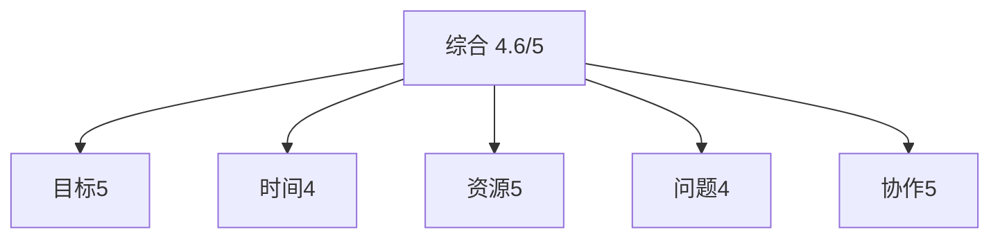
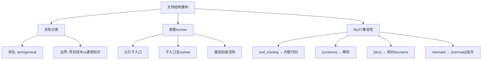

# 任务执行总结：AgentForge 文档双轨分类与嵌套 toctree 重构

> **状态**：已归档（归档位置：`.agents/docs/superpowers/retrospectives/2026-05-25-docs-dual-track-restructure.md`）
> **生成日期**：2026-05-25
> **报告版本**：standard（10 章完整版）
> **任务类型**：development（文档基础设施重构）

---

## 1. 执行概览

| 项目 | 数据 |
|---|---|
| 任务名称 | AgentForge 文档双轨分类与嵌套 toctree 重构 |
| 任务起止 | 2026-05-25 单日内连续四轮交互完成 |
| 核心目标 | 把 `docs/` 重构为「项目技术文档 / 通用知识」双轨分类，并采用嵌套 toctree |
| 阶段数 | 4 个递进阶段 |
| 涉及文件 | 19 个（迁移 12 + 修改 7 + 新建 3 + 顺手清理 1）|
| 严格构建次数 | 4 次 `mise run docs-strict`，最终零警告 7.28s |
| 最终交付 | 双 `index.md` 嵌套结构 + 首篇哲学文档 + 全部外部引用同步 |

### 亮点

- **零警告基线全程保持**：每个阶段都用 `mise run docs-strict`（`-W --keep-going`）即时验证，未让构建警告积累。
- **顺手清理预存在问题**：在迁移过程中发现并修复了 `build-conventions.md:168` 预存在的 mermaid lexer 警告，全局基线更干净。
- **零业务损失迁移**：通过 `autoapi_root` 配置改写让 sphinx-autoapi 自动重定向输出，未手工迁移任何生成产物。
- **首篇哲学文档落地**：把帛书《道德经》"反者道之动，弱者道之用"映射为可执行工程原则，139 行、零警告、含可视化映射图。

### 主要挑战

- **MyST 跨目录链接陷阱**：第 3 阶段构建出现 8 个 `myst.xref_missing` 警告，需要识别"docs source tree 之外的文件不能用 hyperlink"这条隐性边界。
- **`{contents}` 指令兼容性**：mystx 5.1 + Sphinx 9.1 组合下 `{contents}` 触发 `KeyError: 'anchorname'`，需要直接移除。
- **`{doc}` 路径解析歧义**：在 `tech/intro.md` 内不能用 `<tech/api/...>` 绝对 docname，必须用相对当前目录的 `<api/...>`。
- **git mv 对未追踪文件失效**：第 4 阶段把 README.md 升级为 index.md 时 `git mv` 失败（README 是新增未提交），需要回退到 `Move-Item`。

---

## 2. 目标背景

### 初始目标（用户原话）

> "docs 文档应该分为两大类，一类为本项目的技术相关，一类是其他诸如传统文化，数学等等"

### 目标演进

| 轮次 | 目标 | 决策点 |
|---|---|---|
| 第 1 轮 | 建立双轨分类骨架 | 选 `tech/ + general/` 命名、仅建骨架不迁移内容 |
| 第 2 轮 | 落地首篇哲学文档 | 反者道之动 → Token 优化；弱者道之用 → 极简 API |
| 第 3 轮 | 全量迁移技术文档 | 9 .md + changelogs/ 子目录用 git mv 移到 `tech/` |
| 第 4 轮 | 嵌套 toctree 改造 | README.md → index.md，父级只引子入口 |

### 约束条件

- 保持 git 历史（优先 `git mv`）。
- 每阶段必须通过严格构建零警告。
- 保留 `.agents/docs/references/dao-tech-foundation.md` 等 docs 树外引用关系不破坏（用内联代码替代 hyperlink）。
- `README.md` 与 `CHANGELOG.md` 等根目录索引必须与新结构同步。

### 最终成果

```
docs/
├── index.md                      # 父入口：仅引 tech/index、general/index
├── conf.py                       # autoapi_root = "tech/api"
├── tech/
│   ├── index.md                  # 子入口：展开 10 项技术文档 toctree
│   ├── intro.md / quickstart.md / features.md / ...
│   ├── api/taolib/               # autoapi 自动输出
│   └── changelogs/
└── general/
    ├── index.md                  # 子入口：展开通用知识 toctree
    └── philosophy/
        └── tao-minimalist-principles.md
```

---

## 3. 执行过程

### 阶段时间线


| 阶段 | 关键动作 | 产出物 | 严格构建 |
|---|---|---|---|
| 1. 骨架预设 | `ask_user_question` 三问决策 → 创建 `tech/README.md`、`general/README.md`（orphan） | 2 个 orphan 占位 | 未独立验证（无内容） |
| 2. 首篇哲学文档 | 阅读 `dao-tech-foundation.md`/`context-economy.md` → 创建 `tao-minimalist-principles.md`（139 行）→ 更新 `index.md` 双 toctree | 哲学首篇 + 双 caption 父 toctree | ✅ 零警告 |
| 3. 技术文档迁移 | 8 项 todo → `git mv` 9 .md + changelogs/ → 改 `autoapi_root` → 修复 8 处链接 → 同步 README/CHANGELOG/src | 12 项迁移 + 7 处引用更新 | ✅ 零警告 |
| 4. 嵌套 toctree | README.md → index.md（去 orphan）→ 父级 toctree 收敛到 2 项 → 子级各自展开 | 嵌套结构落地 | ✅ 零警告 7.28s |

### 关键产出物

- `docs/general/philosophy/tao-minimalist-principles.md`：七节结构（帛书原文/语义映射/反者→Token/弱者→API/综合表/验证标准/延伸阅读），含一张 mermaid 映射图。
- `docs/tech/index.md`、`docs/general/index.md`：从占位 README 升级为正式入口，含子 toctree + 目录清单 + 边界声明 + 接入约定。
- `docs/index.md`：父级 toctree 从 11 项收敛到 2 项（`tech/index` + `general/index`）。
- `docs/conf.py`：`autoapi_root = "tech/api"` 一行变更覆盖整个 API 子树。

---

## 4. 关键决策

| # | 决策时刻 | 备选方案 | 最终选择 | 选择依据 |
|---|---|---|---|---|
| D1 | 双轨命名 | `tech/ + general/` vs `project/ + knowledge/` vs `core/ + extras/` | **`tech/ + general/`** | 语义最直接，符合"项目技术 vs 通用知识"边界 |
| D2 | 首期范围 | 仅建空骨架 vs 立即迁移现有文件 | **仅建空骨架** | 降低单次变更风险，让结构调整与内容迁移分阶段 |
| D3 | 跨目录链接 | hyperlink + 加白名单 vs 改用内联代码 | **内联代码** | 避开 MyST `xref_missing` 警告，无需配置变更 |
| D4 | `{contents}` 指令 | 升级 mystx vs 移除指令 | **移除指令** | 章节本身已清晰可导航，避免依赖升级风险 |
| D5 | API 子树迁移 | 手工迁移生成产物 vs 改 autoapi_root | **改 `autoapi_root`** | 一行配置覆盖整个子树，下次构建自动重生成 |
| D6 | 嵌套形态 | 同级双 caption vs 父子嵌套 | **父子嵌套** | 路径前缀消除、左侧导航分层、新增文档零成本 |
| D7 | README → index | 保留 README + 新建 index vs 直接重命名 | **直接重命名** | README 仅用一轮即被升级，避免双文件并存歧义 |

---

## 5. 问题解决

### 问题汇总

| ID | 问题 | 严重度 | 根因 | 修复 |
|---|---|---|---|---|
| P1 | 8 个 `myst.xref_missing` 警告 | 中 | MyST 把 `.md` 链接和目录链接当作 cross-reference，docs 树外文件不存在 | 改用内联代码 `` `path` `` |
| P2 | `KeyError: 'anchorname'` 异常 | 高 | mystx 5.1 + Sphinx 9.1 不兼容 `{contents}` 指令 | 直接移除 `{contents}` |
| P3 | `unknown document: 'tech/api/taolib/index'` | 中 | 在 `tech/intro.md` 内用了"绝对 docname" `<tech/api/...>` | 改为相对 docname `<api/...>` |
| P4 | `Pygments lexer name 'mermaid' is not known`（预存在） | 低 | `` ```mermaid `` 触发 Pygments lexer 路径而非 MyST 指令路径 | 改为 `` ```{mermaid} `` |
| P5 | `git mv` 对未追踪文件失败 | 低 | README.md 是新增未 commit | 回退到 `Move-Item` |
| P6 | `{include}` 路径错误（迁移到 tech/changelogs/ 后） | 中 | 相对路径需多一层 `../` | 三个 changelog 镜像页统一加 `../` |

### 问题模式分析

- **路径口径类**（P3/P6/D3）：MyST 在 `{doc}`、`{include}`、hyperlink 三种指令上有不同的路径解析规则——`{doc}` 用 docname（无后缀，相对当前文件目录或源根）、`{include}` 用文件系统路径（相对当前文件）、hyperlink 必须指向 docs 源树内的文件。任何跨目录迁移都要逐项检查。
- **指令兼容性类**（P2/P4）：MyST/Sphinx 指令在工具链版本组合下可能出现兼容性问题。`{contents}` → 移除；mermaid 栅栏 → 改用 MyST 指令式 `{mermaid}`。
- **Git 操作类**（P5）：`git mv` 仅对已追踪文件有效，新增未提交文件需要先 `git add` 或回退到文件系统操作。

---

## 6. 资源使用

| 资源类型 | 使用情况 |
|---|---|
| 工具链 | Sphinx 9.1 + MyST Parser + mystx 5.1 + sphinx-autoapi + mise + uv |
| 命令 | `mise run docs-strict`（4 次）、`git mv`、`Move-Item`、`git status` |
| 关键文件读取 | `dao-tech-foundation.md`、`context-economy.md`、`src/taolib/github_app/__init__.py` |
| 提交工具 | 暂未提交（工作树留待用户确认后原子化提交） |
| 经验记忆 | 任务开始前 `search_memory` 取回"MyST跨目录链接与{contents}指令兼容性陷阱"，避免重复踩坑 |

### 效率评估

- **search_memory 命中率高**：第 3 阶段开始前命中两条关键经验，直接采用规避策略，避免了重复试错。
- **并行编辑利用充分**：第 4 阶段三个 `index.md` 用一次 search_replace 调用并行完成。
- **`autoapi_root` 一行收益**：避免了手工迁移 N 个生成 .rst 文件的重复劳动。

---

## 7. 团队协作

本任务为单人 + AI 助手协作，无多人协作场景。协作模式：

- **决策权交回用户**：第 1 阶段使用 `ask_user_question` 三问，让用户在命名/范围/内容三个维度做选择。
- **每轮"继续"前列剩余项**：本次复盘前再次用 `ask_user_question` 列出 4 个收尾选项，让用户选择推进范围。
- **示例驱动沟通**：每个阶段结束后给出 Before/After 对比、变更清单、构建结果摘要，便于用户快速验收。

---

## 8. 多维分析

| 维度 | 评分 | 说明 |
|---|---|---|
| 目标达成度 | 5/5 | 4 轮目标全部达成，零警告基线全程保持 |
| 时间效能 | 4/5 | 第 3 阶段因 MyST 兼容性问题需 2 次构建迭代，但总耗时仍可控 |
| 资源利用 | 5/5 | search_memory 命中、autoapi_root 一行覆盖、并行编辑均高效 |
| 问题模式 | 4/5 | 6 个问题，1 个预存在；路径口径类问题较集中，可沉淀为规则 |
| 协作效果 | 5/5 | 决策点用户参与充分，无返工 |



---

## 9. 经验方法

### 成功要素

1. **任务开始前 search_memory**：取回历史经验，规避已知陷阱。
2. **每阶段独立验证**：`mise run docs-strict` 单步小步走，问题不积累。
3. **配置层覆盖优先于产物层迁移**：`autoapi_root` 一行 vs 手工迁移 N 个 .rst。
4. **决策点显式交回用户**：`ask_user_question` 替代擅自扩张范围。
5. **顺手清理预存在警告**：迁移过程中发现 mermaid 栅栏问题，附带修复让全局基线更干净。

### 可复用方法论

- **MyST 文档迁移三段式校验**：迁移后必须独立验证 `{doc}` 引用、`{include}` 路径、跨目录 hyperlink 三类——前两类用相对 docname / 文件路径，第三类必须保证目标在 docs 源树内（否则改用内联代码）。
- **嵌套 toctree 适用边界**：当父级 toctree 项数 ≥ 5 且能按主题归类时，嵌套结构收益显著（路径前缀消除、左侧导航分层、新增文档零成本）；若仅 2-3 项则平铺更直接。
- **README.md ↔ index.md 升级时机**：占位 README（orphan）适合骨架预设阶段；一旦目录有正式内容应升级为 index.md 纳入主导航，避免双文件并存歧义。
- **预存在问题"顺手清理"原则**：与本次任务边界临近的、修复成本 < 5 行的预存在问题，在不偏离主线的前提下可附带修复，恢复全局基线。

### 知识图谱



---

## 10. 改进行动

### 推荐行动（按优先级）

| P级 | 行动项 | 预期收益 |
|---|---|---|
| P1 | 把"MyST 文档迁移三段式校验"沉淀到 `.agents/rules/documentation.md` | 下次迁移避免重复试错 |
| P1 | 把"双轨分类边界 + 嵌套 toctree 路径口径"沉淀到 `.agents/rules/documentation.md` | 新增文档时遵循统一约定 |
| P2 | 更新 `AGENTS.md` 第 5 节"文档与产物边界"补充 tech/general 双轨结构说明 | 顶层契约与实际结构对齐 |
| P2 | 按主题原子化 Git 提交本次变更（建议拆 3-4 个 commit） | 历史可追溯、回滚粒度清晰 |
| P3 | 在 `.agents/scripts/` 增加可选检查：`docs/` 顶层不应再有 `.md` 业务文档 | 自动防止退化到平铺 |
| P3 | 评估 `general/` 后续承载内容（数学、传统文化等）的子目录命名约定 | 防止子目录命名分歧 |

### 风险预警

- ⚠️ **CHANGELOG/README 路径偏移风险**：未来若再次调整目录，根目录索引和外部引用容易遗漏；建议在 P3 检查脚本中加入"根索引引用 docs/ 路径有效性校验"。
- ⚠️ **mystx 升级风险**：`{contents}` 兼容性问题表明 mystx 5.1 仍在演进中；下次升级前应在分支测试全文档构建。
- ⚠️ **AutoAPI 输出污染风险**：当前 `tech/api/` 是构建产物，应确认 `.gitignore` 已排除，避免误提交。

### 工具推荐

- 已有：`mise run docs-strict`（严格构建）、`mise run docs-internal-linkcheck`（内链校验）。
- 建议增加：`mise run docs-structure-check`（顶层 .md 不应有业务文档）。

---

## 附录：关键文件清单

| 类型 | 文件路径 | 操作 |
|---|---|---|
| 新建 | `docs/general/index.md` | 通用知识子入口（含子 toctree） |
| 新建 | `docs/tech/index.md` | 技术文档子入口（含子 toctree） |
| 新建 | `docs/general/philosophy/tao-minimalist-principles.md` | 首篇哲学文档（139 行） |
| 重命名 | `docs/{intro,quickstart,features,...}.md` → `docs/tech/...` | git mv 9 个 + changelogs/ 子目录 |
| 修改 | `docs/index.md` | 父级 toctree 收敛到 2 项 |
| 修改 | `docs/conf.py` | `autoapi_root = "tech/api"` |
| 修改 | `docs/tech/intro.md` | `{doc}` 改为相对 docname |
| 修改 | `docs/tech/build-conventions.md:168` | mermaid 栅栏 → MyST 指令（顺手） |
| 修改 | `docs/tech/changelogs/*.md`（3 个） | `{include}` 路径加 `../` |
| 修改 | `README.md`、`CHANGELOG.md`、`src/taolib/__init__.py` | 同步外部引用 |

---

*归档位置：`.agents/docs/superpowers/retrospectives/2026-05-25-docs-dual-track-restructure.md`*
*归档时间：2026-05-25（用户确认后完成）*
