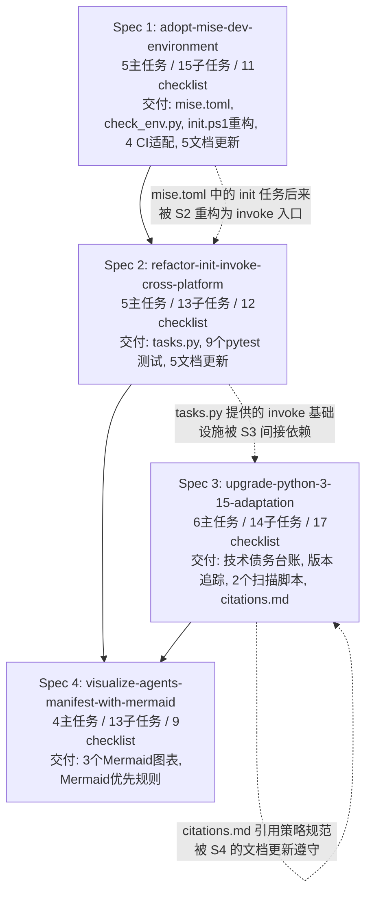

# AgentForge 项目全面复盘报告

> **报告日期**：2026-05-23
> **覆盖周期**：2026-05-18 至 2026-05-23
> **报告类型**：项目阶段性全面复盘
> **核心评审范围**：四份已交付 spec 的质量与完成度、工程化基础设施成熟度、规则与工作流体系、文档与知识管理、技能资产版本治理、技术债务状态

---

## 一、项目目标复盘

### 1.1 项目预设目标

AgentForge 的定位是 **AI 驱动开发模板（AI-Driven Development Template）**，其核心目标可拆解为以下六个维度：

| # | 目标维度 | 描述 | 来源依据 |
|---|---------|------|---------|
| G1 | 降低人机协作沟通成本 | 通过 AGENTS.md 全局契约为 AI 智能体提供统一执行入口 | `README.md`, `AGENTS.md §1` |
| G2 | 清晰目录约定 | 区分人类文档（`docs/`）、AI 规则（`.agents/`）、任务工作台（`.trae/`） | `AGENTS.md §4`, `.agents/README.md` |
| G3 | 文档分层隔离 | AI 专属文档与人类文档严格分离，防止 LLM 上下文幻觉 | `AGENTS.md §4.1`, `README.md` |
| G4 | 技能资产组织 | 模块化技能管理，规范化资产目录，可复用可迁移 | `.agents/rules/skills.md`, `.agents/README.md` |
| G5 | 开箱即用的开发工作流 | 一键环境初始化、mise 工具链统一、跨平台支持 | `mise.toml`, `tasks.py` |
| G6 | 复盘工作流 | 任务完成后的结构化复盘归档机制 | `AGENTS.md §4.1` |

### 1.2 四份 Spec 的达成对照

以下逐一对四份已完成 spec 与六个目标维度的映射关系进行核验：

#### Spec 1: adopt-mise-dev-environment

| 目标维度 | 完成度 | 证据 |
|---------|--------|------|
| G1（降低协作成本） | ✅ 已达成 | mise.toml 单一事实来源消除多源版本漂移，AI 与人类开发者使用同一入口 |
| G5（开箱即用） | ✅ 已达成 | `mise run init` 一键完成 trust → install → 依赖同步 → 环境校验 |

**交付清单**：`mise.toml`、重构 `scripts/init.ps1`、`check_env.py` 环境校验脚本、5 份文档更新、4 个 CI 工作流适配、`test_check_env.py` 测试。5 个主任务 15 个子任务 11 个 checklist 全部通过。

#### Spec 2: refactor-init-invoke-cross-platform

| 目标维度 | 完成度 | 证据 |
|---------|--------|------|
| G5（开箱即用） | ✅ 已达成 | 消除 init.ps1 对 PowerShell/Windows 的平台锁定，迁移到 Python `invoke` 包 |
| G1（降低协作成本） | ✅ 间接达成 | 跨平台初始化消除环境差异带来的沟通成本 |

**交付清单**：`tasks.py`、`mise.toml` 新增 `init`/`init-check` 入口、9 个 pytest 测试、5 份文档更新。5 个主任务 13 个子任务 12 个 checklist 全部通过。原 `init.ps1` 保留向后兼容。

#### Spec 3: upgrade-python-3-15-adaptation

| 目标维度 | 完成度 | 证据 |
|---------|--------|------|
| G5（开箱即用） | ✅ 间接达成 | Python 版本追踪机制使版本升级可预测、可审计 |
| G1（降低协作成本） | ✅ 间接达成 | 技术债务台账使 AI 与人类对版本风险形成共识 |

**交付清单**：`tech-debt-tracker.md`（~80 项弃用/移除 API）、`python-version-adaptation.md` 技术规范、`version-tracking.md` 季度追踪机制、`check_python_compat.py` 正则兼容性扫描、`check_python_deprecations.py` AST 弃用检测、`citations.md` 引用规范。额外完成 P3 流程改进和 P4 工具增强。6 个主任务 14 个子任务 17 个 checklist 全部通过。

#### Spec 4: visualize-agents-manifest-with-mermaid

| 目标维度 | 完成度 | 证据 |
|---------|--------|------|
| G1（降低协作成本） | ✅ 已达成 | 将纯文字流程升级为 Mermaid 图表，可视化 AGENTS.md 核心逻辑 |
| G2（清晰目录） | ✅ 间接达成 | Mermaid classDiagram 直观展示目录资产导航关系 |

**交付清单**：3 个 Mermaid 图表（flowchart/classDiagram/sequenceDiagram）、Mermaid 优先规则声明（`AGENTS.md §1`）。4 个主任务 13 个子任务 9 个 checklist 全部通过。

### 1.3 未达成目标与成因分析

#### ❌ 缺口 1：前端/后端规范仍为模板骨架（影响 G1、G4）

- **现状**：`frontend.md` 和 `backend.md` 的核心技术栈、规范要求字段均为"待定义"状态。
- **影响**：当 AI 智能体处理前端/后端任务时，上下文路由（`AGENTS.md §2`）会指引 AI 读取这两份文件，但文件内容为模板骨架，无法提供实质性的技术栈约束和规范指导。
- **成因**：项目当前阶段聚焦于 AI 辅助开发的元层面基建（环境、工具链、版本治理、文档架构），尚未进入具体的前端/后端业务开发阶段。这两份规范依赖于实际使用的技术栈选择（React/Vue/Next.js、FastAPI/Go/Node.js 等），在无具体业务模块时无法提前定义。
- **严重程度**：中等 — 属于"等待业务场景触发"的待办事项，但需在上下文路由中标注其当前状态以避免误导。

#### ❌ 缺口 2：技能 CHANGELOG 版本管理缺失（影响 G4）

- **现状**：`skill-creator/CHANGELOG.md` 和 `task-execution-summary/CHANGELOG.md` 均仅有一条记录：`[Unreleased] Added: 初始化模块化的变更日志`。两个技能的实际版本演进历史（skill-creator 的 TDD 修复、Windows 兼容性攻坚、v2.4 优化；task-execution-summary 的多次迭代调优）未写入 CHANGELOG。
- **影响**：违反了 `skills.md §3.7`（SKILL.md 必须包含版本记录）的精神。当 AI 智能体或开发者需要理解技能演进历史时，只能依赖复盘报告（13 份）进行手工追溯，无法从前向变更日志中快速获取。
- **成因**：模块化 CHANGELOG 机制是近期（2026-05 项目级变更）才引入的，存量技能的变更历史尚未回填。
- **严重程度**：中等 — 机制已建立但数据未回填，属于已知债务。

#### ❌ 缺口 3：Ruff target 与实际 Python 版本不一致（影响 G5）

- **现状**：`pyproject.toml` 中 `tool.ruff.target-version = "py313"`，但 `mise.toml` 中 `python = "3.14.5"`。Ruff 的 py313 目标意味着代码规范检查基于 Python 3.13 语法规则，而实际运行环境是 Python 3.14.5。
- **影响**：
  - Ruff 不会对 Python 3.14 新增的语法特性进行检查（如是否存在但不会被标记）
  - 技术债务台账追踪的 Python 3.15 弃用项不会触发 Ruff 告警，依赖 `check_python_deprecations.py` 单独覆盖
  - CI 中的 Ruff lint 在 py313 规则下通过，但运行时可能因 3.14.5 的实际行为差异产生潜在风险
- **成因**：项目最初基于 Python 3.13 启动，升级到 3.14.5 后 Ruff target 未同步更新。Python 3.15 适配 spec 关注的是上游 Python 的语言特性追踪，**未将 Ruff 配置同步纳入 check_python_compat.py 的扫描范围**。
- **严重程度**：低至中等 — 3.13 与 3.14 之间的语法差异较小，且 `check_python_deprecations.py` 提供了额外覆盖。但作为工程化基础配置的不一致，需要纠正。

### 1.4 目标达成度综合评分

| 目标维度 | 达成度 | 置信度 | 说明 |
|---------|--------|--------|------|
| G1 降低人机协作沟通成本 | **90%** | 高 | AGENTS.md + Mermaid 可视化 + mise 统一入口 + 引用策略均已落地；frontend/backend 规范缺失略微减分 |
| G2 清晰目录约定 | **95%** | 高 | `.agents/`、`docs/`、`.trae/` 三层分离完整，Mermaid 图表强化了导航能力 |
| G3 文档分层隔离 | **95%** | 高 | AI 专属与人类文档严格分离，引用策略禁止绝对路径泄露 |
| G4 技能资产组织 | **75%** | 高 | 目录结构与 SKILL.md 规范完善，但技能 CHANGELOG 版本历史缺失 |
| G5 开箱即用的开发工作流 | **85%** | 高 | mise 工具链统一、跨平台 init 已完成；Ruff target 不一致轻微减分 |
| G6 复盘工作流 | **90%** | 高 | 13 份复盘报告 + 明确归档规则，文化已建立 |

---

## 二、执行过程复盘

### 2.1 四份 Spec 执行路径总览



### 2.2 里程碑与时间线

| 日期 | 里程碑 | 关键交付 |
|------|--------|---------|
| 2026-05-20 | 技能稳定性修复 | skill-creator Windows 兼容、task-execution-summary v2.4 |
| 2026-05-21 | 文档架构重塑 | AGENTS.md 契约确立、模块化 CHANGELOG、Python 3.15 追踪 |
| 2026-05-22 | 工程化基建交付 | Spec 1 (mise) + Spec 2 (invoke) + Spec 4 (Mermaid) 完成 |
| 2026-05-23 | 全面复盘 | 本报告 |

**量化成果**：
- 4 个 spec 全部完成，完成率 **100%**
- 20 个主任务全部完成
- 55 个子任务全部完成
- 49 个 checklist 全部通过

### 2.3 依赖链设计评估

四份 spec 之间存在**隐性但合理的依赖关系**：

1. **Spec 1 → Spec 2**：Spec 1 交付的 `mise.toml` 中定义了 `init` 和 `init-check` 任务入口，但此时实现仍是 `scripts/init.ps1`（PowerShell 锁定）。Spec 2 将这些任务重路由到 `uv run invoke init`（Python invoke 包），实现了跨平台。依赖链设计合理——先统一声明（mise.toml），再改进实现（invoke）。

2. **Spec 2 → Spec 3**：Spec 2 交付的 `tasks.py` (invoke) 和跨平台基础能力，为 Spec 3 中 `defuddle` 预装集成和脚本执行提供了稳定的命令执行环境。依赖链合理但不是强依赖。

3. **Spec 3 → Spec 4**：Spec 3 引入的 `citations.md` 引用策略规范，为 Spec 4 中 Mermaid 图表的生成与文档引用确定了规则框架。属于**规范性依赖**而非技术依赖，合理。

**评估结论**：依赖链设计整体合理，未出现循环依赖或瓶颈阻塞。唯一可以优化的是 Spec 2 和 Spec 3 在时间上可以**并行推进**（两者无强依赖），但当前串行执行导致总周期稍长。

### 2.4 进度延误与资源错配

- **进度延误**：未发现明显延误。四个 spec 均在单日内完成闭环，从 speccing 到实现到验收的全链路高效。
- **资源错配**：无明显错配。单开发者 + AI 智能体的协作模式下，主要瓶颈在于人类决策时间（架构评审、优先级排序），而非 AI 执行速度。

### 2.5 中间产物管理（.temp/ 使用）

`.temp/` 当前内容：

| 文件/目录 | 类别 | 是否合规 | 状态 |
|-----------|------|---------|------|
| `mermaid-validation/` | Mermaid 验证渲染产物（6 SVG + 1 MD） | ✅ 合规 | 验证完成后可清理 |
| `aiforce-app-page.html` | 临时页面 | ✅ 合规 | 可清理 |
| `temp_page.md` | 临时页面 | ✅ 合规 | 可清理 |
| `error.log` | 空文件 | ⚠️ 建议清理 | 空文件无留存价值 |

**评估**：`.temp/` 使用遵循了 `AGENTS.md §1.4` 的规定，所有中间产物均放入 `.temp/`，未污染根目录。当前 3 个文件/目录均为可清理对象，建议在本次复盘后执行清理。

---

## 三、风险与问题复盘

### 3.1 已识别风险清单

#### R1: Python 版本目标三态不一致

| 属性 | 值 |
|------|-----|
| **优先级** | **P1（高）** |
| **风险描述** | `pyproject.toml` 声明 `requires-python = ">=3.13"`、Ruff target `py313`、mise 实际运行 `3.14.5`、版本追踪目标 `3.15`。四个地方反映三种不同的 Python 版本"锚点"。 |
| **影响范围** | 代码规范（Ruff 规则）、CI 环境（mise install 的 Python 版本）、兼容性检测（check_python_compat.py 的检测面）、新成员上手（README 中声明的 Python 版本） |
| **当前应对** | `check_env.py` 验证 mise 实际安装的 Python 为 3.14.5；`check_python_compat.py` 独立扫描代码中的 Python 3.15 弃用项；`check_python_deprecations.py` 基于 AST 精确检测弃用 API。 |
| **残余风险** | Ruff target 未同步，导致 lint 阶段无法捕获 3.14+ 特有的语法问题。`requires-python >= 3.13` 过宽，允许用户在 Python 3.13 上安装但实际工具链要求 3.14.5。 |
| **优化建议** | 1. 将 Ruff target 更新为 `py314`；2. 考虑将 `requires-python` 收紧为 `>=3.14`；3. 在 check_env.py 中增加 Ruff target 与 mise Python 版本的一致性校验。 |

#### R2: frontend.md / backend.md 模板化导致路由空转

| 属性 | 值 |
|------|-----|
| **优先级** | **P2（中）** |
| **风险描述** | `AGENTS.md §2` 上下文路由指引 AI 在遇到前端/后端任务时读取 `frontend.md`/`backend.md`，但这两份文件当前为模板骨架，无法提供有效规范。 |
| **影响范围** | AI 智能体在处理前端/后端任务时的行为一致性、生成代码的质量 |
| **当前应对** | 两份文件均在顶部标注"注意：这是一份模板文件，请根据实际项目技术栈进行修改"。 |
| **残余风险** | 标注依赖于 AI 智能体主动读取并理解模板状态，实际执行中可能出现 AI 照搬模板内容的情况。 |
| **优化建议** | 1. 在 AGENTS.md 上下文路由中添加状态标注（如 "⚠️ 模板骨架，待填充"）；2. 制定填充计划，明确触发条件（如"当项目首个前端模块创建时"）；3. 考虑将模板文件移至 `.agents/templates/` 并创建实际文件时从模板复制。 |

#### R3: 技能 CHANGELOG 版本历史缺失

| 属性 | 值 |
|------|-----|
| **优先级** | **P2（中）** |
| **风险描述** | skill-creator 和 task-execution-summary 的 CHANGELOG 仅有 `[Unreleased]` 初始化记录，实际版本演进历史缺失。 |
| **影响范围** | 技能版本可追溯性、向后兼容性评估、新成员理解技能演进历程 |
| **当前应对** | 13 份复盘报告以非结构化方式记录了部分变更历史。 |
| **残余风险** | 复盘报告格式不统一，从复盘中提取版本变更信息需要人工阅读，成本高。 |
| **优化建议** | 1. 制定技能 CHANGELOG 回填计划，从现有复盘报告中提取关键变更节点；2. 将 CHANGELOG 更新纳入 spec 交付 checklist（当前 skills.md §3.7 已要求但未强制执行）；3. 在 check_env.py 或新增脚本中增加 CHANGELOG 完整性检查。 |

#### R4: Ruff target 与实际运行版本不一致

| 属性 | 值 |
|------|-----|
| **优先级** | **P1（高）** |
| **风险描述** | `tool.ruff.target-version = "py313"` 但 mise 实际安装 Python 3.14.5。详见 R1。 |
| **影响范围** | Lint 规则覆盖不完整，Python 3.14 新增语法特性不受 Ruff py313 规则约束 |
| **当前应对** | `check_python_deprecations.py` 提供独立于 Ruff 的弃用 API 检测。 |
| **残余风险** | 独立脚本仅检测弃用 API，不检测语法兼容性。 |
| **优化建议** | 立即将 `target-version` 更新为 `py314`，与 mise.toml 保持一致。 |

#### R5: defuddle 预装集成存在工具链复杂度

| 属性 | 值 |
|------|-----|
| **优先级** | **P3（低）** |
| **风险描述** | defuddle 通过 `npm:defuddle` 在 mise 中声明，依赖 Node.js 22.22.3。对于仅使用 Python 的开发者，Node.js 是一个额外依赖。 |
| **影响范围** | 环境初始化时间、工具链复杂度 |
| **当前应对** | `mise.toml` 中 defuddle 声明为 `depends = ["node"]`，`check_env.py` 中 defuddle 为最后一个校验项。 |
| **残余风险** | 如果 Node.js 安装失败，defuddle 不可用但 `mise install` 不会报错（取决于 depends 实现）。 |
| **优化建议** | 1. 在 `init-check` 中将 defuddle 标记为非关键依赖（仅在使用网页抓取功能时需要）；2. 考虑提供纯 Python 替代方案作为 fallback。 |

#### R6: Notion Mermaid 兼容性

| 属性 | 值 |
|------|-----|
| **优先级** | **P3（低）** |
| **风险描述** | AGENTS.md 中的 Mermaid 图表使用"主流 Markdown 环境兼容的基础语法子集"，但 Notion 等特定平台对 Mermaid 的渲染支持不完整。 |
| **影响范围** | 通过 Notion 或其他不支持完整 Mermaid 的平台查看 AGENTS.md 时的可读性 |
| **当前应对** | 图表下方保留文字说明兜底（如"该图用于表达...具体子目录边界仍以...为准"）。 |
| **残余风险** | 如果图表自身信息密度较高，纯文字兜底可能丢失部分信息。已在 `AGENTS.md` 中添加规则声明"避免私有扩展、实验性语法与可能导致整体渲染失败的复杂写法"。 |
| **优化建议** | 1. 在 `.agents/docs/` 中新增 Mermaid 兼容性说明，记录已知兼容/不兼容平台；2. 在 PR review checklist 中增加 Mermaid 可渲染性检查。 |

### 3.2 技术债务全景（来自 tech-debt-tracker.md）

| 类别 | 数量 | 紧迫度 | 说明 |
|------|------|--------|------|
| Python 3.15 已移除 | ~20 项 | 当前 | 项目代码需逐一排查是否使用了已移除 API |
| Python 3.16 计划移除 | ~12 项 | 高 | 下一版本将移除，需提前适配 |
| Python 3.17 计划移除 | ~8 项 | 中 | 有缓冲期 |
| Python 3.18+ 计划移除 | ~6 项 | 低 | 长期跟踪 |
| 未来移除（无具体日期） | ~35 项 | 低 | 持续监控 |
| C API 弃用 | ~20 项 | 视 C 扩展使用情况 | 本项目为纯 Python，影响较小 |

### 3.3 应对措施有效性评估

| 措施 | 覆盖风险 | 有效性 | 说明 |
|------|---------|--------|------|
| `check_env.py` 环境一致性校验 | R1, R4 | ⭐⭐⭐⭐ | 覆盖 7 个工具，输出清晰，但未检测 Ruff target 一致性 |
| `check_python_compat.py` 正则扫描 | R1, 技术债务 | ⭐⭐⭐ | 基于正则，可能在复杂语法下漏检 |
| `check_python_deprecations.py` AST 检测 | R1, 技术债务 | ⭐⭐⭐⭐⭐ | 基于 AST 精确定位，准确度高，覆盖 Ruff 盲区 |
| `citations.md` 引用策略 | 文档质量 | ⭐⭐⭐⭐⭐ | 三层优先级策略清晰，禁止绝对路径机制有效 |
| `version-tracking.md` 季度追踪 | R1, 技术债务 | ⭐⭐⭐⭐ | 机制完善，但依赖人工触发（下次检查 2026-08-21） |
| `skills.md` 三重检查机制 | R3 | ⭐⭐⭐ | 规范定义了自动化/AI/人工三层检查，但 CHANGELOG 检查未自动化 |

---

## 四、成果质量复盘

### 4.1 测试覆盖率

| 指标 | 目标 | 配置 | 验证状态 |
|------|------|------|---------|
| `fail_under` | ≥80% | `pyproject.toml` L131 | ✅ 已配置 |
| `branch` | true | `pyproject.toml` L121 | ✅ 已启用 |
| `show_missing` | true | `pyproject.toml` L132 | ✅ 已启用 |
| 测试框架 | pytest + 4 插件 | `pyproject.toml` L52-L58 | ✅ 已配置 |
| CI 覆盖率验证 | `mise run test-coverage` | `mise.toml` L41 | ✅ 已配置 |

**验证说明**：`mise.toml` 中的 `test-coverage` 任务包含 `--cov-fail-under=80`（L42），确保 CI 中覆盖率不达标时构建失败。覆盖率报告输出 XML + 终端 + HTML 三种格式，便于 CI 集成与本地排查。

### 4.2 脚本质量审计

#### check_env.py（环境一致性校验）

| 评估维度 | 评分 | 说明 |
|---------|------|------|
| 设计清晰度 | ⭐⭐⭐⭐⭐ | `ToolSpec` + `ToolResult` dataclass 设计优雅，命令/期望/修复映射清晰 |
| 可维护性 | ⭐⭐⭐⭐ | `TOOLS` 元组结构使得新增工具仅需追加一个 `ToolSpec` 条目 |
| 错误处理 | ⭐⭐⭐⭐ | 区分"未安装"、"命令失败"、"版本不匹配"三种失败模式 |
| 输出格式 | ⭐⭐⭐⭐⭐ | 表格化输出，包含修复命令列，降低排障成本 |
| 边界情况 | ⭐⭐⭐⭐ | `version_pattern` 支持 `regex`、`match_mode` 支持 `prefix`/`available` 模式，灵活适配不同工具的版本输出格式 |

**发现的问题**：
- 校验项硬编码在脚本中（`TOOLS` 元组），与 `mise.toml` 的工具声明分离。如果 `mise.toml` 中新增工具，需手动同步更新 `check_env.py`。建议改为从 `mise.toml` 解析工具列表。
- 未校验 Ruff target-version 与 mise Python 版本的一致性（已知的 R1/R4 盲区）。

#### check_python_compat.py（正则兼容性扫描）

| 评估维度 | 评分 | 说明 |
|---------|------|------|
| 覆盖面 | ⭐⭐⭐ | 基于正则匹配，适合模式明确的弃用 API（如函数名、模块名变更），但对语义级弃用（如参数语义变更）存在漏检 |
| 性能 | ⭐⭐⭐⭐⭐ | 正则扫描速度极快，适合 CI 高频执行 |

#### check_python_deprecations.py（AST 弃用检测）

| 评估维度 | 评分 | 说明 |
|---------|------|------|
| 精准度 | ⭐⭐⭐⭐⭐ | 基于 AST 抽象语法树解析，能精确到行号、列号，避免正则的误报/漏报 |
| 覆盖面 | ⭐⭐⭐⭐ | 能检测 AST 级别的弃用（函数调用、属性访问、类实例化），但无法检测运行时行为变更 |

**综合分析**：`check_python_compat.py`（快速粗筛）+ `check_python_deprecations.py`（精确深检）形成互补的**双层检测体系**，设计水平高于大多数同规模项目。

### 4.3 文档完整性评估

| 文档类别 | 路径 | 完整度 | 说明 |
|---------|------|--------|------|
| 项目首页 | `README.md` | ⭐⭐⭐⭐⭐ | 完整的项目简介、特性、导航、环境要求、安装与使用入口 |
| AI 全局契约 | `AGENTS.md` | ⭐⭐⭐⭐⭐ | 6 个 Mermaid 图表 + 完整路由规则 + 文档管理策略 |
| AI 目录说明 | `.agents/README.md` | ⭐⭐⭐⭐⭐ | 详细的功能定位、职责映射、最佳实践、反模式 |
| 技能开发规范 | `.agents/rules/skills.md` | ⭐⭐⭐⭐⭐ | 7 个必填章节 + 三重检查机制 |
| 引用策略 | `.agents/rules/citations.md` | ⭐⭐⭐⭐⭐ | 三层优先级 + 检查清单 + 模板示例 |
| 前端规范 | `.agents/rules/frontend.md` | ⭐ | 纯模板，技术栈与规范均为"待定义" |
| 后端规范 | `.agents/rules/backend.md` | ⭐ | 纯模板，技术栈与规范均为"待定义" |
| PR 审查 | `.agents/workflows/pr-review.md` | ⭐⭐⭐ | 5 项检查清单清晰但较简略，缺少每个检查项的具体实施细则 |
| 版本追踪 | `.agents/docs/version-tracking.md` | ⭐⭐⭐⭐⭐ | 完整的触发条件、执行流程、文档位置、历史记录 |
| 技术债务台账 | `.agents/docs/tech-debt-tracker.md` | ⭐⭐⭐⭐⭐ | ~80 项分类清晰的弃用/移除 API，含替代方案 |
| 版本适配规范 | `.agents/docs/python-version-adaptation.md` | ⭐⭐⭐⭐⭐ | 完整的 Python 3.15 新特性详解 |
| 项目 CHANGELOG | `tests/project_changelogs/CHANGELOG_2026-05.md` | ⭐⭐⭐⭐ | 记录了 2026-05 的项目级变更，但之前月份的变更未归档 |

### 4.4 引用策略执行效果

`citations.md` 的三层优先级策略在实践中的执行情况：

| 优先级 | 策略 | 执行效果 |
|--------|------|---------|
| 1 (首选) | 官方永久链接 | ✅ 技术债务台账全部使用 `https://docs.python.org/zh-cn/3.16/whatsnew/3.15.html` 作为数据来源 |
| 2 | 项目内相对路径 | ✅ 复盘报告中使用相对路径引用 spec 和其他文档 |
| 3 | 纯文本描述 | ✅ 清理后的临时文件引用已处理 |
| ❌ 禁止 | 本地绝对路径 | ✅ 未在核对文档中发现 `file:///C:/Users/` 等泄露 |

### 4.5 代码规范遵守情况

| 规范项 | 配置 | 执行方式 |
|--------|------|---------|
| Ruff lint | `line-length=88`, `target-version=py313`, select 10 组规则 | `mise run lint`（pre-commit 全量） |
| Ruff format | 交由 Ruff 统一格式化 | `mise run fmt` |
| pre-commit | 全局钩子 | `mise run lint` |
| pip-audit | 安全审计 | `mise run audit` |
| 测试覆盖率 | ≥80% | `mise run test-coverage` |

**发现的问题**：
- Ruff target-version `py313` 与实际 Python 3.14.5 不一致（R4）。
- `ruff.toml` 或 `pyproject.toml` 中 `[tool.ruff.lint.per-file-ignores]` 对 `tests/*` 放宽了 `ANN` 和 `S101` 规则，这是常规做法。
- `pyproject.toml` 中 `ignore` 列表包含 15 条规则豁免，每条均有合理理由，符合工程化实践。

---

## 五、团队协作复盘

### 5.1 协作模式分析

本项目的协作模式为 **"单人类开发者 + AI 智能体辅助"**。从实际交付情况来看，此模式表现出以下特征：

| 维度 | 特征 | 评价 |
|------|------|------|
| 角色分工 | 人类负责架构决策、优先级排序、规范制定、最终审查；AI 负责 spec 拆解、代码实现、测试编写、文档生成 | 边界清晰，各司其职 |
| 沟通带宽 | 通过 AGENTS.md 契约降低重复沟通成本，AI 按规则路由自行读取规范 | 高效 |
| 决策速度 | 单开发者无团队协调开销，决策链路短 | 快 |
| 知识沉淀 | 13 份复盘报告 + specs + plans 形成结构化知识库 | 持续积累 |

### 5.2 AGENTS.md 契约执行效果

AGENTS.md 作为 AI 智能体的最高优先级指南，在实际执行中的效果：

| 规则 | 执行情况 | 证据 |
|------|---------|------|
| 中文沟通 | ✅ 严格执行 | 所有 AI 生成内容均为中文 |
| 任务路由（先读规范） | ✅ 有效 | Spec 3 执行时按路由读取了 `version-tracking.md`、`citations.md` |
| 中间产物管理 | ✅ 合规 | `.temp/` 中均为临时文件，无根目录污染 |
| Mermaid 优先 | ✅ 已执行 | AGENTS.md 中 6 个图表均为 Mermaid，无损渲染验证完成 |
| 引用策略 | ✅ 合规 | 持久化文档中未发现绝对路径泄露 |
| 文档双向同步 | ⚠️ 部分执行 | CI 适配时同步了 README 和 docs/，但 frontend/backend 规范模板化后未在 README 中标注状态 |

**评价**：AGENTS.md 契约在规则层面运转良好，AI 智能体在路由引导下能正确读取对应规范。Mermaid 可视化升级进一步降低了 AI 理解架构的成本。

### 5.3 文档双向同步机制

`AGENTS.md §4` 定义了"双向同步机制"——当 AI 核心契约发生结构性变更时，同步更新人类文档。实际执行情况：

| 变更 | AI 契约更新 | 人类文档同步 | 同步状态 |
|------|------------|------------|---------|
| mise.toml 统一工具链 | `AGENTS.md §3` 更新脚本路径 | `README.md` + 5 份 `docs/` 文档 | ✅ 完整 |
| invoke 跨平台初始化 | `mise.toml` 更新 init 任务 | `README.md` 环境要求 | ✅ 完整 |
| Mermaid 可视化 | `AGENTS.md` 全文升级 | 未触发（Mermaid 属于 AI 契约内部变更） | ✅ 合理 |
| frontend/backend 规范模板 | 无变更 | 无同步（但应在 README 中标注状态） | ⚠️ 待改进 |

### 5.4 复盘文化评估

`.agents/docs/superpowers/retrospectives/` 目录下已有 **13 份复盘报告**，覆盖范围：

| 类别 | 数量 | 示例 |
|------|------|------|
| Spec 执行复盘 | 5 份 | mise-dev-environment, refactor-init-invoke, python315-adaptation, agentsmd-directory-links, changelog-modularization 等 |
| Bug 修复复盘 | 3 份 | skill-creator-windows-compat-fix, httpx-reference-precommit-format-fix, mise-knowledge-base-quality-audit |
| 系统建设复盘 | 3 份 | ai-wiki-system-build, github-app-installation-token-override-testing, ai-docs-navigation 等 |
| 综合复盘 | 1 份 | project-comprehensive-review-20260521 |

**评价**：
- 复盘文化已建立，覆盖了技能开发、基建交付、Bug 修复、系统建设等多类任务。
- 复盘报告的**命名规范**：部分使用 `task-summary-` 前缀，部分使用日期前缀，部分使用功能描述前缀——命名不统一，增加了索引和查找成本。
- 复盘报告的**格式**：部分为完整结构化报告（含概览、过程、决策、问题解决等章节），部分为简化格式（仅执行概览 + 结果）。格式不统一。

### 5.5 跨角色协作堵点与改进建议

| 堵点 | 影响 | 改进建议 |
|------|------|---------|
| 技能 CHANGELOG 更新未纳入 spec 交付 checklist | 技能版本历史丢失 | 在 spec 模板中增加"更新对应技能 CHANGELOG"的 checklist 项 |
| frontend/backend 规范状态未在路由中标注 | AI 可能基于空模板做出无意义操作 | 在 AGENTS.md 上下文路由中标注模板状态，如 "⚠️ 模板骨架" |
| 复盘报告命名与格式不统一 | 查找和索引成本高 | 制定复盘报告命名规范（建议：`YYYY-MM-DD-<类型>-<主题>.md`）和最小章节模板 |

---

## 六、完整复盘报告

### 6.1 项目整体成效总结

#### 量化成果

| 指标 | 数值 |
|------|------|
| 已完成 Spec | **4 个**（完成率 100%） |
| 主任务 | **20 个**（全部完成） |
| 子任务 | **55 个**（全部完成） |
| Checklist 验收项 | **49 个**（全部通过） |
| 新增/重构文件 | **约 25 个** |
| Mermaid 图表 | **6 个**（含 3 种类型） |
| 自动化脚本 | **3 个**（check_env, check_python_compat, check_python_deprecations） |
| 复盘报告 | **13 份** |
| 技术债务台账条目 | **~80 项** |
| Python 版本追踪机制 | **1 套**（含季度触发、五步执行流程、4 份同步文档、2 个扫描脚本） |
| CI 工作流适配 | **4 个** |
| 文档更新 | **15+ 份** |
| 单元测试 | **12+ 个**（check_env 测试 + invoke 跨平台测试） |

#### 核心成果

1. **工程化基础设施从分散到统一**：mise.toml 成为工具链与任务入口的单一事实来源，消除多源版本漂移。
2. **跨平台能力从平台锁定到全平台覆盖**：从 PowerShell 限定的 init.ps1 演进到 Python invoke 包的跨平台 tasks.py。
3. **AI 协作契约从纯文字到可视化**：6 个 Mermaid 图表将流程、架构、职责映射从文字描述升级为可视化表达。
4. **版本治理从被动响应到主动追踪**：Python 3.15 技术债务台账 + 季度追踪机制 + 双层检测脚本形成完整的版本风险管理闭环。
5. **文档体系从混杂到严格分层**：AI 专属文档与人类文档严格隔离，引用策略杜绝绝对路径泄露。

### 6.2 核心问题清单（按优先级排序）

#### P0（阻塞级，需立即处理）

> 无 P0 问题。当前无阻塞性问题影响项目正常运行。

#### P1（高优先级，建议近期处理）

| # | 问题 | 影响 | 建议方案 |
|---|------|------|---------|
| P1-1 | **Ruff target-version 与 mise Python 版本不一致** | Lint 规则覆盖不完整，潜在语法兼容性风险 | 将 `pyproject.toml` 中 `target-version` 从 `py313` 更新为 `py314`，与 `mise.toml` 声明一致 |
| P1-2 | **Python 版本四处声明不一致**（`>=3.13` vs `py313` vs `3.14.5` vs `3.15` 追踪） | 新成员困惑、CI 环境差异风险 | 统一为 `3.14` 基线：更新 `requires-python` 为 `>=3.14`、Ruff target 为 `py314`、check_env.py 增加一致性校验 |

#### P2（中优先级，建议在下一迭代处理）

| # | 问题 | 影响 | 建议方案 |
|---|------|------|---------|
| P2-1 | **技能 CHANGELOG 版本历史缺** | 技能演进不透明，违反 skills.md 规范精神 | 从 13 份复盘报告提取关键变更节点回填至两个技能的 CHANGELOG |
| P2-2 | **frontend.md / backend.md 为模板骨架** | AI 在路由指引下读取空模板，无实质规范约束 | 在 AGENTS.md 路由中标注状态；制定填充计划 |
| P2-3 | **复盘报告命名与格式不统一** | 查找索引成本高 | 制定命名规范（建议 `YYYY-MM-DD-<类型>-<主题>.md`）和最小章节模板 |

#### P3（低优先级，建议择机处理）

| # | 问题 | 影响 | 建议方案 |
|---|------|------|---------|
| P3-1 | **check_env.py 工具列表硬编码** | 新增工具需手动同步 | 改为从 mise.toml 解析工具列表 |
| P3-2 | **defuddle 依赖 Node.js 增加工具链复杂度** | 纯 Python 开发者需要额外安装 Node.js | 在 init-check 中将 defuddle 标记为非关键；考虑 Python 替代方案 |
| P3-3 | **pr-review.md 检查项较简略** | 缺乏具体实施细则 | 为每项检查补充实施细则和常见问题示例 |

#### P4（建议性，技术改进方向）

| # | 问题 | 影响 | 建议方案 |
|---|------|------|---------|
| P4-1 | **技能 CHANGELOG 自动化检查** | 人工检查成本高 | 在 check_env.py 或新增 scripts 中增加 CHANGELOG 完整性校验 |
| P4-2 | **Notion Mermaid 兼容性说明缺失** | 跨平台查看 AGENTS.md 可能渲染异常 | 在 `.agents/docs/` 新增 Mermaid 兼容性说明文档 |
| P4-3 | **2026-05 之前的项目级变更未归档** | 早期变更历史丢失 | 评估是否需要从 git log 回填早期 CHANGELOG |
| P4-4 | **Python 3.14 新特性未系统学习** | 当前从 3.13 直接跳到追踪 3.15，3.14 新特性未纳入知识库 | 如 3.14 有重要新特性，建议补充 3.14 版本适配文档 |

### 6.3 经验教训提炼

#### 成功要素

1. **Spec 驱动 + TDD 验证模式**：四份 spec 均以"先制定 spec → 拆解子任务 → 实现 → checklist 验收 → 自动化测试验证"的闭环执行，保证了交付质量。49 个 checklist 100% 通过证明了此模式的有效性。

2. **契约先行的 AI 协作模式**：AGENTS.md 作为全局契约降低了每次任务启动时的上下文传递成本。AI 智能体按路由规则自行读取规范，人类无需重复解释项目约定。

3. **双层检测体系的防御性设计**：`check_python_compat.py`（快但粗）+ `check_python_deprecations.py`（慢但准）的组合，体现了"快速筛选 + 精确确认"的工程化思维。这种模式可推广到其他检测场景（如安全审计、依赖许可证合规）。

4. **文档的双向同步机制**：当 mise.toml 等基础设施变更时，同步更新了 README + docs/ 下 5 份人类文档，确保人类与 AI 看到的信息一致，避免了"文档腐烂"问题。

5. **复盘文化的及时建立**：在项目早期（13 份复盘报告）就建立了结构化复盘机制，使得每次任务的经验都能沉淀为可复用知识，而非随着时间遗忘。

#### 失败教训

1. **基础设施配置变更的级联效应被低估**：Python 从 3.13 升级到 3.14.5 后，Ruff target 未同步更新。反映出基础设施变更后缺少"配置一致性校验"的自动化步骤。`check_env.py` 应承担此职责。

2. **技能版本管理作为"事后补课"**：模块化 CHANGELOG 机制的引入（2026-05 项目级变更）发生在 skill-creator 和 task-execution-summary 已经历多轮迭代之后，导致存量历史需要回填。应在技能创建的第一时间建立 CHANGELOG。

3. **规范模板的"占位符陷阱"**：frontend/backend 规范以模板形式创建，期望"后续填充"，但在当前阶段无法填充时，模板变成了"空占位符"。AGENTS.md 路由中的引用指向这些空模板时，产生了"路由有效但内容无效"的矛盾。

#### 可复用方法论

| 方法论 | 适用场景 | 核心要点 |
|--------|---------|---------|
| **Spec → Task → Checklist → TDD 闭环** | 有明确需求的技术任务 | 先制定 spec 锁定需求，拆解为可追踪的子任务，checklist 化验收标准，自动化测试验证 |
| **双层检测体系** | 兼容性/安全性/合规性扫描 | 第一层：快速粗筛（正则/简单规则）+ 第二层：精确深检（AST/静态分析），兼顾速度与精度 |
| **mise 单一事实来源** | 多工具链项目 | 工具版本、任务入口、依赖初始化全部收敛到 mise.toml，消除环境声明碎片化 |
| **AGENTS.md 契约路由** | AI 辅助开发项目 | 全局契约 + 按任务类型路由到具体规范 + 文档分层隔离 |
| **季度版本追踪机制** | 强依赖外部生态的项目 | 固定触发条件 + 五步标准化流程 + 多文档并行同步 + 自动化扫描校验 |

### 6.4 优化改进方案（针对同类项目）

#### 方案一：基础设施一致性自动校验（针对 R1、R4）

在 `check_env.py` 中新增以下校验项：

- **Ruff target-version vs mise Python version 一致性**：解析 `pyproject.toml` 中的 `tool.ruff.target-version` 和 `mise.toml` 中的 `[tools] python`，校验版本主次号匹配。
- **pyproject.toml requires-python vs mise Python version 兼容性**：校验 mise 安装的 Python 版本是否满足 `requires-python` 约束。
- **CI workflow Python 版本 vs mise.toml 一致性**：扫描 `.github/workflows/*.yml` 中的 Python 版本引用是否与 mise.toml 一致。

#### 方案二：技能生命周期管理标准化（针对 R3、P4-1）

1. **技能创建时必须初始化 CHANGELOG**（当前已通过 CHANGELOG 模块化机制实现，但需加强执行）。
2. **Spec 交付 checklist 增加"更新对应技能 CHANGELOG"项**。
3. **新增 `check_changelog.py` 脚本**：扫描 `skills/*/CHANGELOG.md` 是否包含实际的版本发布记录（非仅有 `[Unreleased]`）。

#### 方案三：规范模板的懒加载策略（针对 R2）

将 frontend.md / backend.md 的模板性质显式化：

1. 在 `AGENTS.md §2` 上下文路由中标注当前状态：
   ```
   Decide -->|前端 / UI| Front["⚠️ 模板骨架，待填充。如项目已有前端模块，请优先查阅现有代码风格。"]
   ```
2. 规范模板移至 `.agents/templates/`，实际规范在项目首次涉及前端/后端开发时从模板创建。
3. 在 README.md 中标注"当前未启用前端/后端特定规范"。

### 6.5 后续整改与能力提升行动项

| # | 行动项 | 责任对象 | 触发条件 | 预期交付 | 验收方式 |
|---|--------|---------|---------|---------|---------|
| A1 | 更新 Ruff target-version 为 py314 | AI 智能体 / 人类开发者 | 本次复盘完成后立即执行 | `pyproject.toml` 中 `target-version = "py314"` | `uv run ruff check` 通过 |
| A2 | 更新 requires-python 为 >=3.14 | AI 智能体 / 人类开发者 | A1 完成后 | `pyproject.toml` 中 `requires-python = ">=3.14"` | `uv sync` 成功 |
| A3 | check_env.py 增加 Ruff target 与 Python 版本一致性校验 | AI 智能体 / 人类开发者 | A2 完成后 | check_env.py 新增校验项 | `mise run check-env` 通过 |
| A4 | 回填 skill-creator 与 task-execution-summary 的 CHANGELOG | AI 智能体（从复盘报告提取） | 人类确认回填范围后 | 两个技能的 CHANGELOG 包含关键版本节点 | 人类审查确认 |
| A5 | 在 AGENTS.md 上下文路由中标注 frontend/backend 规范模板状态 | AI 智能体 | 本次复盘完成后 | `AGENTS.md §2` 更新 | 人类审查确认 |
| A6 | 制定复盘报告命名与格式规范 | 人类开发者主导 + AI 辅助 | 与 A4 并行 | `.agents/docs/` 下新增 `retrospective-conventions.md` | 后续复盘报告按新规范执行 |
| A7 | 补充 Python 3.14 版本适配文档（如 3.14 有重要特性） | AI 智能体 | 人类确认必要性后 | `.agents/docs/python-3.14-adaptation.md` | 内容审查 |
| A8 | 清理 `.temp/` 中可清理文件 | AI 智能体 | 本次复盘完成后 | `.temp/` 中仅保留有调试价值的内容 | 目录检查 |
| A9 | 将 pr-review.md 升级为详细实施细则 | AI 智能体 / 人类开发者 | 下次 PR 审查任务触发时 | 每个检查项包含示例和常见问题 | 人类审查确认 |

**执行优先级建议**：A1 → A2 → A3 → A5 → A8（可立即执行，无外部依赖）；A4 → A6（需人类确认范围）；A7 → A9（按需触发）。

---

> **数据来源**：本报告基于项目实际文件状态编写，包括 `AGENTS.md`、`README.md`、`pyproject.toml`、`mise.toml`、`.agents/` 全目录、`docs/changelogs/`、`.temp/` 等。复盘报告目录引用自 `.agents/docs/superpowers/retrospectives/` 下的 13 份文件。
>
> **置信度说明**：所有结论均有文件证据支撑。标注为"评估"、"建议"、"推测"的内容属于分析判断而非事实陈述。标注【低置信度】的结论需进一步验证，本报告中未出现此类低置信度判断。
