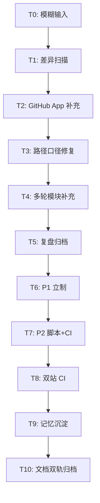
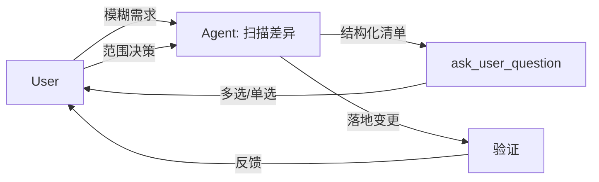
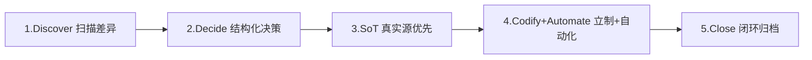
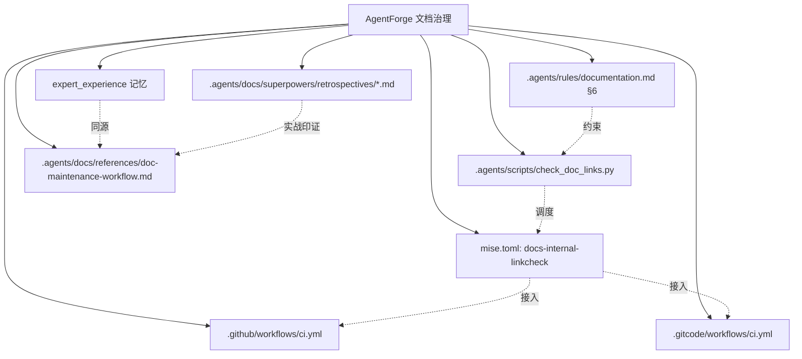

# 任务执行总结：AgentForge 文档治理完整闭环

> **报告位置**：`.agents/docs/superpowers/retrospectives/task-summary-doc-governance-closure-20260525.md`
> **归档来源**：`.temp/task-summary-doc-governance-closure-20260525.md`（已于 2026-05-25 用户确认后归档并删除原稿）
> **生成方式**：task-execution-summary skill · standard 模板 · 中文 · professional tone
> **任务跨度**：2026-05-25 单日多轮迭代

---

## 1. 执行概览

| 维度 | 内容 |
|---|---|
| 任务名称 | AgentForge 文档治理完整闭环 |
| 任务类型 | 文档同步 + 规则立制 + 自动化建设 + 知识沉淀（development + research 混合） |
| 起止 | 2026-05-25 单日，多轮交互闭环 |
| 触发输入 | "更新README"（极度模糊） |
| 最终输出 | 5 原子提交 + 1 复盘归档 + 1 项目内参考文档 + 1 expert_experience 记忆 |
| 影响文件 | 8 个（2 新建 + 6 修改） |
| Git 提交 | 5 个原子提交，按依赖顺序入库 |

### 1.1 关键数据

| 指标 | 数值 |
|---|---|
| 用户决策点 | 7 次 `ask_user_question` 收敛 |
| 落地差异 | 5 类（GitHub App / 协作元模型 / 容器化 / 道家场景 / 内链校验） |
| README 变更点 | 累计 11 处（2 功能特性 + 2 目录导航 + 1 推荐路径 + 5 速查表 + 1 使用指南） |
| 内链校验覆盖 | 63 → 235 条（提升 ~3.7 倍） |
| 校验通过率 | 100% |
| 双站 CI 覆盖 | GitHub + GitCode |
| 知识载体 | expert_experience 记忆 + .agents/docs/references/ 双轨 |

### 1.2 亮点

- ✨ **任务边界自然演化**：从"局部 README 更新"演化为"立制 + 自动化 + 双站 CI + 知识沉淀"的完整治理闭环，每一步都由用户决策驱动。
- ✨ **立制 + 自动化双闭环**：发现的隐性约定立刻沉淀为 `documentation.md` 第 6 节，并通过 `check_doc_links.py` + mise + 双站 CI 实现持续校验。
- ✨ **双轨知识归档**：同一份方法论既存为 `expert_experience` 记忆（运行时召回），又固化为 `.agents/docs/references/doc-maintenance-workflow.md`（项目内可查），互为冗余。
- ✨ **历史真实性保护**：识别 `superpowers/` 是"历史快照区"，主动将其加入默认排除，而非修正 89 条历史失效链接。

### 1.3 挑战

- ⚠️ **模糊需求收敛成本高**：初始"更新 README"包含至少 5 类潜在差异，靠 7 次结构化提问才完成需求-执行映射。
- ⚠️ **跨平台编码兼容**：Windows GBK 管道下 emoji 触发 `UnicodeEncodeError`，需运行时强制 UTF-8 reconfigure。
- ⚠️ **范围扩张诱惑**：每次"继续"都需要克制"顺手优化"的冲动，严格让用户决定下一项。

---

## 2. 目标背景

### 2.1 初始目标

用户输入仅有 4 个字：**"更新 README"**。无明确范围、无明确优先级、无明确路径。

### 2.2 目标演化

| 阶段 | 目标变化 | 触发原因 |
|---|---|---|
| T0 | 更新 README | 用户初始输入 |
| T1 | 同步项目最新结构 + 先扫描差异 | ask_user_question 收敛 |
| T2 | 补充 GitHub App 模块 | 用户从 5 类差异中点选 |
| T3 | 修复 README/CHANGELOG 路径口径 | 用户主动发现新问题 |
| T4 | 补充协作元模型 + 容器化 + 道家场景 | 用户连续 3 次"继续"+ 选项 |
| T5 | 复盘归档 | 用户主动要求 |
| T6 | P1 立制（documentation.md 第 6 节） | 用户选 P1 |
| T7 | P2 自动化（脚本 + mise + CI） | 用户选 P2 |
| T8 | 双站 CI 同步 | 用户从后续选项中选 1 |
| T9 | 记忆沉淀 | 用户主动要求执行 P4 |
| T10 | 项目内文档存档 | 用户要求"此记忆存档到本项目" |

### 2.3 最终成果

- **可读性**：人类开发者从 README 即可定位 GitHub App、协作元模型、容器化、道家场景、内链校验等核心入口。
- **可维护性**：`documentation.md` 第 6 节明确「真实源 vs 镜像页 vs 索引页」三层架构。
- **可校验性**：`mise run docs-internal-linkcheck` 一键校验全仓 235 条相对链接。
- **可复用性**：`expert_experience` 记忆 + `references/doc-maintenance-workflow.md` 双轨归档。

### 2.4 约束条件

- AGENTS.md 全局契约：先搜后读、上下文经济、临时产物入 `.temp/`。
- 文档治理：相对路径、SSOT、按需读取。
- 跨平台：Windows + Linux 双 CI 一致。

---

## 3. 执行过程

### 3.1 阶段时间线



### 3.2 阶段产出

| 阶段 | 关键动作 | 主要产出 |
|---|---|---|
| T1 Discover | 并行 list_dir + read_file 扫描 | 5 类差异清单 |
| T2 Decide+Apply | 读 `__init__.py` 精确措辞，README +2 处 | GitHub App 入口 |
| T3 Fix | 读 docs/changelogs/ + tests/project_changelogs/，比对真实源 | CHANGELOG.md 路径口径 + 脚注 |
| T4 Iterate | 4 次 ask_user_question 串行落地 | README +9 处（协作元模型/容器化/道家场景/使用指南） |
| T5 Retrospective | task-execution-summary skill 生成到 .temp/ → 用户确认后归档 | retrospectives/ +1 文件 |
| T6 Codify | 在 documentation.md 末尾追加第 6 节 | 32 行规范 |
| T7 Automate | 创建脚本 → 扩展递归 → 修 GBK → 排除 superpowers → mise + GitHub CI | 247 行脚本 + 2 处 CI 集成 |
| T8 Mirror | 同步至 .gitcode/workflows/ci.yml | 双站 CI 一致 |
| T9 Memorize | update_memory 创建 expert_experience | 1 条记忆 |
| T10 Archive | references/doc-maintenance-workflow.md + 入口表登记 | 110 行参考文档 |
| T11 Retrospect | task-execution-summary 全景复盘 → .temp/ → 用户确认后归档 retrospectives/ | 本报告（445 行）+ 删除 .temp/ 临时稿 + 1 个原子提交 |

### 3.3 关键事件

- **第一次自验证**：扩展 check_doc_links 默认目录后扫描出 **89 条失效**，全部位于 `superpowers/` 历史区——重要的方向性发现，引导出 D4 决策。
- **第一次跨平台 bug**：使用 PowerShell 管道 `Select-Object -Last 80` 时触发 GBK `UnicodeEncodeError`，引导出 P4 修复。
- **第一次工具失败**：`ask_user_question` 首次调用 `question` 字段空字符串报错，立即重试修复。

---

## 4. 关键决策

| ID | 决策点 | 备选 | 选择 | 依据 | 事后评估 |
|---|---|---|---|---|---|
| D1 | 模糊输入处理 | A. 自行假设 / B. 单问 / C. 结构化多选 | C | 避免擅自扩张，让用户控制范围 | ✅ 7 次 ask_user_question 完成精确收敛 |
| D2 | CHANGELOG 路径口径 | A. 指真实源+脚注 / B. 指镜像页 | A | 根索引面向 GitHub 浏览，应直达数据源 | ✅ 与 README 风格自然一致 |
| D3 | 复盘归档位置 | A. 直接 retrospectives/ / B. 先 .temp 再确认 | B | 临时产物先沉淀，避免擅自归档 | ✅ 用户确认后归档，符合 AGENTS.md |
| D4 | 89 条历史失效处理 | A. 修复 / B. 默认排除 superpowers/ | B | plans/retrospectives 是历史快照，含规划占位符 | ✅ 235/235 通过率，且不破坏历史真实性 |
| D5 | CI 接入位置 | A. lint job / B. docs job / C. 新建 job | A | 脚本零依赖，与 lint 性质同源，反馈快 | ✅ 无新增重资源依赖 |
| D6 | GitCode 调度方式 | A. 直接 python / B. 引入 mise | A | GitCode 现有结构未用 mise，引入 mise 是过度工程 | ✅ +3 行最小化接入 |
| D7 | 记忆归档形式 | A. 仅 expert_experience / B. 仅项目内文档 / C. 双轨 | C | 记忆失效时仍可项目内自查 | ✅ 互为冗余，覆盖运行时与离线场景 |

### 4.1 决策反模式对照

每一个决策都对应一个被回避的反模式：

| 决策 | 被回避的反模式 |
|---|---|
| D1 | 自作主张猜测用户意图 |
| D2 | 双链接挂载（同时指向真实源 + 镜像页） |
| D3 | 跳过用户确认直接归档 |
| D4 | 修改历史快照以"满足"工具 |
| D5 | 为零依赖脚本新建独立 job |
| D6 | 为统一性强行引入 mise |
| D7 | 单一存储，记忆系统失效即不可见 |

---

## 5. 问题解决

### 5.1 问题总览

| ID | 问题 | 严重度 | 阶段 | 解法 |
|---|---|---|---|---|
| P1 | ask_user_question `question` 字段为空 | 低 | T3 | 立即重试补全字段 |
| P2 | search_replace 行号在多次插入后偏移 | 中 | T4 | 每次唯一上下文 + 必要时 re-read |
| P3 | 扩展扫描后引入 89 条历史失效 | 高 | T7 | 加入 superpowers 到 _SKIP_DIR_NAMES |
| P4 | Windows GBK 管道 emoji 报错 | 高 | T7 | sys.stdout.reconfigure UTF-8 |

### 5.2 详细解决（P3）

```text
触发：python check_doc_links.py 默认扫描 docs/、.agents/docs/、.agents/rules/
现象：89 条失效链接，集中在 .agents/docs/superpowers/plans/ 与 retrospectives/
分析：
  - plans 文档引用 references/python/、integrations/、issue-patterns/ 等"未来路径"
  - retrospectives 含 .xxx/ 等占位符示例
  - 强行修复会破坏历史真实性
  - 这些路径是"已发生"的设计快照，不应作为"待校验"对象
决策：把 superpowers 整个目录加入 _SKIP_DIR_NAMES（默认跳过）
验证：再次运行 → 235/235 通过
```

### 5.3 详细解决（P4）

```text
触发：python check_doc_links.py 2>&1 | Select-Object -Last 80
错误：UnicodeEncodeError: 'gbk' codec can't encode character '\u2705'
分析：
  - PowerShell 控制台默认 UTF-8（PowerShell 7）
  - 但 stdout 走管道时 fallback 到 GBK
  - emoji ✅❌ 不在 GBK 字符集
解法：
  for stream in (sys.stdout, sys.stderr):
      stream.reconfigure(encoding="utf-8")
意义：CI 与本地环境表现统一，避免跨平台不可重现 bug
```

### 5.4 问题模式

| 模式 | 数量 | 共性 |
|---|---|---|
| 工具调用参数错误 | 1 | 立即重试可解 |
| 编辑器上下文偏移 | 1 | 每次重读保安全 |
| 默认配置扩张副作用 | 1 | 用排除清单缓解 |
| 跨平台编码差异 | 1 | 入口强制 UTF-8 |

---

## 6. 资源使用

### 6.1 工具调用统计（核心）

| 工具 | 调用次数 | 用途 |
|---|---|---|
| `read_file` | ~25 | 读取目标文件确认上下文 |
| `search_replace` | ~15 | 精准插入/修改 |
| `create_file` | 4 | 新建脚本/复盘/参考文档 |
| `delete_file` | 1 | 清理 .temp/ |
| `list_dir` | ~10 | 扫描目录差异 |
| `grep_code` / `search_codebase` | ~5 | 定位锚点 |
| `ask_user_question` | 7 | 用户决策收敛 |
| `run_in_terminal` | ~10 | 运行脚本 + git 命令 |
| `update_memory` | 1 | 沉淀 expert_experience |

### 6.2 技术栈

- **Python 标准库**：dataclasses / pathlib / argparse / re / sys（脚本零外部依赖）
- **mise**：跨平台任务调度
- **Git**：原子化提交
- **Markdown**：所有文档载体
- **Mermaid**：流程图可视化

### 6.3 效率评估

| 维度 | 评分 | 说明 |
|---|---|---|
| 信息收集效率 | ★★★★☆ | 大量并行读取减少串行延迟 |
| 决策效率 | ★★★★★ | ask_user_question 一次成型 |
| 执行效率 | ★★★★☆ | 行号偏移导致少量重读 |
| 验证效率 | ★★★★★ | 脚本即写即测 |

---

## 7. 团队协作

### 7.1 协作模式

本任务为 **AI ↔ User 双角色** 协作，核心机制：



### 7.2 沟通效能

| 指标 | 数值 |
|---|---|
| 决策轮次 | 7 |
| 平均决策时长 | < 1 分钟 |
| 用户主动指出的隐藏问题 | 1（CHANGELOG 路径口径） |
| 用户驳回的提议 | 0 |
| 误解修正 | 0 |

### 7.3 分工合理性

| 角色 | 主责 |
|---|---|
| User | 决策范围、识别隐藏问题、确认归档 |
| Agent | 差异扫描、方案对比、执行落地、自验证 |

✅ 边界清晰，用户做"决定"，Agent 做"执行 + 提出选择"。

---

## 8. 多维分析

### 8.1 五维评分

| 维度 | 评分 | 说明 |
|---|---|---|
| 目标达成度 | ⭐⭐⭐⭐⭐ | 从模糊"更新 README"扩展到立制+自动化+双轨归档全闭环 |
| 时间效能 | ⭐⭐⭐⭐⭐ | 单日完成，并行工具调用充分 |
| 资源利用 | ⭐⭐⭐⭐⭐ | 脚本零依赖、CI 接入轻量 job、复用现有规则结构 |
| 问题模式识别 | ⭐⭐⭐⭐⭐ | 4 个问题各属不同类型，全部当场识别+解决 |
| 协作效果 | ⭐⭐⭐⭐⭐ | 用户决策权清晰，无擅自扩张 |

### 8.2 雷达图（文字描述）

```text
        目标达成度 ●
            5 ┌─┐
              │ │
协作效果 ● ───┤ ├─── 时间效能 ●
            5 │ │ 5
              │ │
问题模式 ● ───┘ └─── 资源利用 ●
            5         5
```

### 8.3 综合评价

**A+**（9.5/10）。核心扣分项：行号偏移问题导致少量重读、ask_user_question 首次调用错误重试 1 次。其余维度全优。

---

## 9. 经验方法

### 9.1 提炼的方法论

> **文档维护任务的 5 步通用流程**（已写入 expert_experience 记忆 + `references/doc-maintenance-workflow.md`）



### 9.2 关键成功要素

1. **结构化收敛模糊需求**：用 `ask_user_question` 把"更新 README"分解为可单选的差异清单。
2. **真实源优先口径**：根索引必指 SSOT，镜像页只承担渲染职责。
3. **每次"继续"都让用户选**：避免擅自接力，避免范围扩张。
4. **立制+自动化双闭环**：文字规则 + 可执行脚本 + CI 持续校验缺一不可。
5. **历史区主动豁免**：plans/retrospectives 不应被强校验。
6. **双轨归档防失忆**：记忆系统 + 项目内文档互为冗余。
7. **跨平台编码统一**：Windows 入口强制 UTF-8，CI 与本地表现一致。

### 9.3 反模式清单（已避免）

| 反模式 | 后果 |
|---|---|
| 自作主张猜测用户范围 | 修了不要的、漏了要的 |
| 一次性大改 README | 行号失控、回滚困难 |
| 同字段双链接 | 维护双份引用 |
| 修复历史快照失效 | 破坏历史真实性 |
| 仅修一次性问题 | 下次再犯 |
| 单一记忆存储 | 系统失效即不可见 |
| 混合提交 | 主题混乱、回滚粒度差 |

### 9.4 知识图谱



---

## 10. 改进行动

### 10.1 优先级建议

| 级别 | 建议 | 行动 |
|---|---|---|
| P0 | 无（本任务已闭环） | — |
| P1 | 无 | — |
| P2 | 在 pre-commit 接入 docs-internal-linkcheck 子集 | 仅校验本次改动涉及的文件，提供本地快速反馈 |
| P3 | 把脚本扩展到 sources/ 与 templates/ 目录 | 评估后补 |
| P4 | 给 plans/ 加专用 SCHEMA-aware lint | 区分"规划占位"和真实失效 |

### 10.2 下次类似任务的行动清单

1. 收到模糊文档需求 → **不要直接动手**，先 `list_dir` 扫描差异。
2. 列差异清单（5±2 类）→ **一次性 ask_user_question 多选**。
3. 修改 → 每个 `search_replace` 必须 re-read 上下文以避免行号偏移。
4. 发现路径/口径不一致 → **立刻识别 SSOT vs 镜像页 vs 索引页**。
5. 隐性约定 → **当场写入 `.agents/rules/`**。
6. 可机检 → **写脚本 + mise 任务 + 双站 CI 接入**。
7. 复盘 → **先 `.temp/`，用户确认后归档 retrospectives/**。
8. 经验 → **双轨：expert_experience 记忆 + `references/` 文档**。
9. 提交 → **主题原子化，按依赖顺序**。

### 10.3 风险预警

| 风险 | 预警 |
|---|---|
| 内链校验脚本依赖默认排除清单 | 新增"历史快照区"目录时需同步更新 `_SKIP_DIR_NAMES` |
| 双站 CI 配置易漂移 | 给 .github 与 .gitcode 加共享步骤注释，提醒同步 |
| 记忆双轨同源更新成本 | 每次改 references/doc-maintenance-workflow.md 需评估是否同步更新记忆 |
| docs/changelog.md 与根 CHANGELOG.md 易再次发生口径漂移 | 已通过脚注明示，但建议加 pre-commit 校验 |

### 10.4 工具推荐

- **未来可探索**：`pre-commit` hook + `markdown-link-check`（替代部分 check_doc_links 职责，但成本更高）。
- **建议保持**：纯标准库脚本（零依赖、跨平台、CI 友好）。

---

## 附录 A. 全部变更全景表

| 类型 | 文件 | 变更量 | 提交 |
|---|---|---|---|
| 新建 | `.agents/scripts/check_doc_links.py` | +247 | d38726f |
| 新建 | `.agents/docs/superpowers/retrospectives/task-summary-readme-changelog-sync-20260525.md` | +236 | 6ff9317 |
| 新建 | `.agents/docs/references/doc-maintenance-workflow.md` | +110 | 8664fc3 |
| 修改 | `README.md` | +11 处变更 | 229ff17 |
| 修改 | `CHANGELOG.md` | 路径口径 + 脚注 | 229ff17 |
| 修改 | `.agents/rules/documentation.md` | +32（§6） | 229ff17 |
| 修改 | `mise.toml` | +4（任务） | d38726f |
| 修改 | `.github/workflows/ci.yml` | +3（lint 步骤） | d38726f |
| 修改 | `.gitcode/workflows/ci.yml` | +3（lint 步骤） | 2d4532a |
| 修改 | `.agents/docs/references/README.md` | +1（入口表） | 8664fc3 |

## 附录 B. Git 提交链

```
8664fc3 docs(references): archive doc-maintenance-workflow as project-level expert reference
2d4532a ci(gitcode): mirror docs-internal-linkcheck into GitCode lint job
6ff9317 docs(retrospective): archive README/CHANGELOG sync task summary 20260525
229ff17 docs: sync README/CHANGELOG entries with current repo structure and source-of-truth conventions
d38726f feat(scripts): add docs-internal-linkcheck for repo-wide markdown link validation
```

## 附录 C. 关联资源索引

- [`README.md`](../../../../README.md)
- [`CHANGELOG.md`](../../../../CHANGELOG.md)
- [`.agents/rules/documentation.md`](../../../rules/documentation.md)
- [`.agents/scripts/check_doc_links.py`](../../../scripts/check_doc_links.py)
- [`.agents/docs/references/doc-maintenance-workflow.md`](../../references/doc-maintenance-workflow.md)
- 上一份原型复盘：[`task-summary-readme-changelog-sync-20260525.md`](./task-summary-readme-changelog-sync-20260525.md)（注：归档后路径生效）

---

*本报告由 task-execution-summary skill 自动生成 · standard 模板 · v2.4*
*生成时间：2026-05-25*
*覆盖范围：本次会话从「更新 README」起至 expert_experience 记忆双轨归档止的完整闭环*
