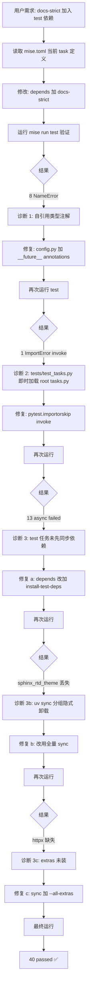
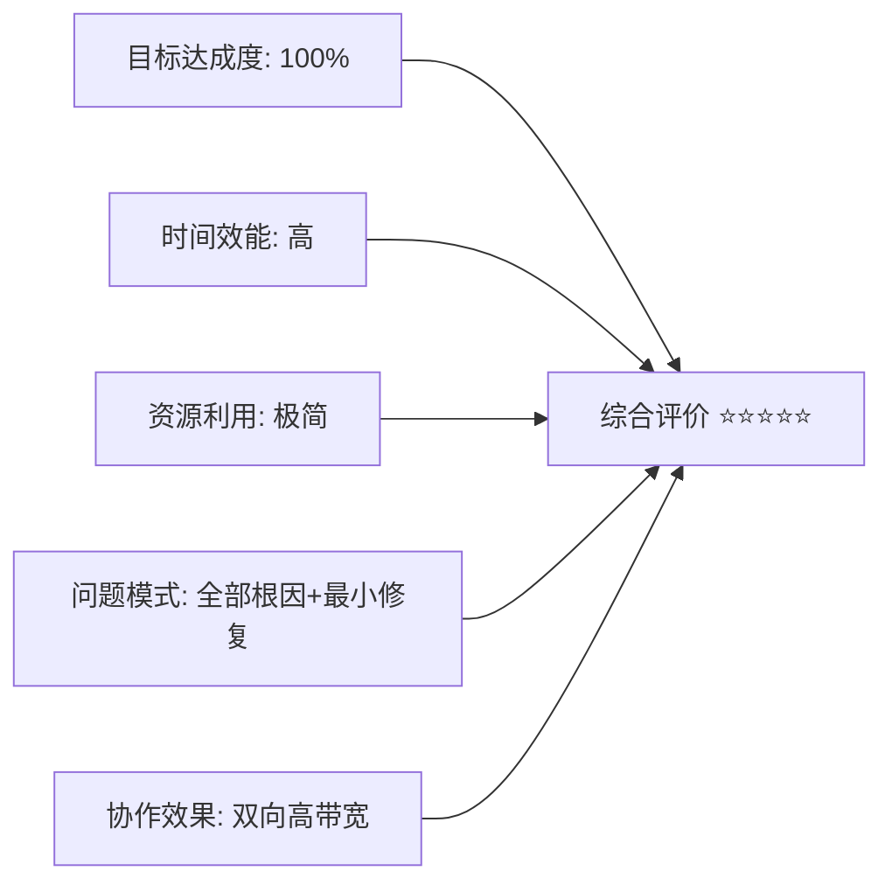
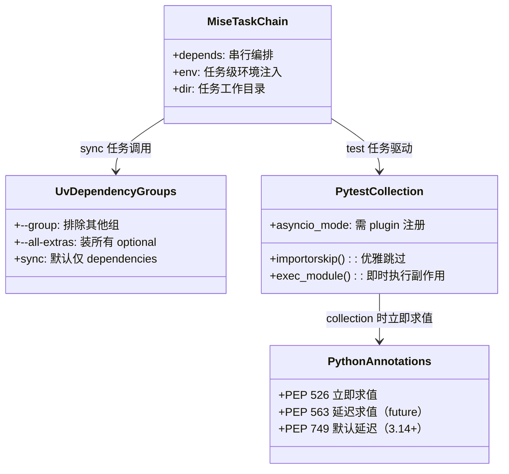

# 任务复盘：docs-strict 集成至 mise run test 并修复全链路依赖问题

> 报告日期：2026-05-23
> 任务范围：mise 任务依赖编排 + Python 类型注解兼容性 + uv 依赖组管理
> 报告类型：standard（10 章完整）

---

## 1. 执行概览

| 字段 | 内容 |
|---|---|
| 任务名 | `docs-strict` 集成至 `mise run test` 并修复 pytest collection 全链路依赖问题 |
| 起止时间 | 2026-05-23 单次会话内完成 |
| 任务起点 | 用户需求："把 docs-strict 加进 mise.toml 的 test 任务依赖链" |
| 任务终点 | `mise run test` 一条命令贯通：40 passed / 0 failed / 1 skipped / 文档构建零警告 |
| 涉及文件 | 4 个（[mise.toml](../../../../mise.toml)、[src/taolib/github_app/config.py](../../../../src/taolib/github_app/config.py)、[tests/test_tasks.py](../../../../tests/test_tasks.py)）|
| 关键产出 | 依赖链 `check-env → sync → docs-strict → pytest` 跑通；3 个隐藏的既存缺陷被验证捕获并修复 |
| 核心亮点 | 单一编排调整意外暴露三层独立环境缺陷，逐层定位、最小化修复，未引入新依赖 |

---

## 2. 目标背景

### 2.1 初始目标
用户在已完成"CI 文档零警告固化"工作后，希望进一步把 `docs-strict` 嵌入开发者最常用的 `mise run test` 入口，让代码测试与文档构建在本地一次性串联，避免文档退化未被及时发现。

### 2.2 调整记录
| 时点 | 调整 | 原因 |
|---|---|---|
| 验证依赖链时 | 范围从"编排修改"扩展到"修复测试链" | pytest collection 阶段先后暴露 3 层独立缺陷，用户主动追加："顺手修" |
| 第二次迭代 | 把 `install-test-deps` 替换为 `sync` | 分组 sync 隐式卸载 docs 组依赖，造成 `docs-strict` 找不到 `sphinx_rtd_theme` |
| 第三次迭代 | 给 `sync` 加 `--all-extras` | `httpx` 在 `[project.optional-dependencies].github-app`，原 sync 不安装 extras |

### 2.3 最终成果
- `mise run test` 单命令完整执行链建立：`check-env → sync (含 all-extras) → docs-strict (零警告) → pytest (40 passed)`
- 暴露并修复 3 类既存缺陷，提升项目跨 Python 版本兼容性与本地开发体验

### 2.4 约束条件
- 必须保持 CI 端 `test-coverage` / `test-release` 行为不变（CI 已有独立 docs job 兜底）
- 不引入新的运行时依赖
- 修复需符合"极致简约"项目哲学，最小侵入

---

## 3. 执行过程



### 时间线
| 阶段 | 关键事件 | 产出 |
|---|---|---|
| T1 | 读取 mise.toml 现状 | 确认 `test` 依赖仅 `check-env` |
| T2 | 改 `depends = ["check-env", "docs-strict"]` | 编排建立 |
| T3 | 首次验证 → 8 NameError | 揭示既存类型注解缺陷 |
| T4 | 定位至 [config.py:90](../../../../src/taolib/github_app/config.py#L90) `def from_env(cls) -> GitHubAppSettings` | 自引用 |
| T5 | 加 `from __future__ import annotations` | 8 错降为 1 |
| T6 | 第二次验证 → ImportError invoke | 揭示测试副作用：`exec_module` 即时执行根 tasks.py |
| T7 | 加 `pytest.importorskip("invoke")` | collection 通过 |
| T8 | 第三次验证 → 13 async failed (pytest-asyncio 缺失) | 揭示 venv 未同步 test 依赖 |
| T9 | 改 `depends` 加 `install-test-deps` | sphinx_rtd_theme 反而丢失 |
| T10 | 改 `depends` 改用 `sync` | httpx 仍缺 |
| T11 | `sync` 任务加 `--all-extras` | **40 passed** |

---

## 4. 关键决策

| 决策 | 备选 | 最终选择 | 依据 |
|---|---|---|---|
| 类型注解修复 | A. 改字符串注解 `-> "GitHubAppSettings"`<br>B. 加 `from __future__ import annotations` | **B** | B 是 PEP 563 标准方案，全文件批量生效；A 只能逐点改 |
| test_tasks.py 修复 | A. 把 `invoke` 加进 `test` 组<br>B. `pytest.importorskip`<br>C. 改测试结构避免 exec_module | **B** | B 最克制：测试在缺依赖时优雅 skip，环境完备时正常运行；A 污染依赖语义；C 改测试设计风险大 |
| test 依赖管理 | A. 列全所有 `--group` `--extra`<br>B. 走全量 `sync`<br>C. 加 `--no-uninstall` | **B** | B 简单一致；A 易遗漏；C 不是 uv 公开标志 |
| `sync` 加 `--all-extras` 范围 | A. 仅 `--extra github-app`<br>B. `--all-extras` | **B** | 项目只有 2 个 extras（github-app/task），全装代价低、未来兼容性好 |
| 是否同时改 `test-coverage` / `test-release` | A. 同步改造<br>B. 仅改 `test` | **B** | CI 已有独立 docs job，且分阶段 `install-test-deps` + `test-coverage` 已稳定 |

---

## 5. 问题解决

### 5.1 问题总览
| # | 现象 | 根因 | 修复 | 修复成本 |
|---|---|---|---|---|
| P1 | 8 个 pytest collection `NameError: GitHubAppSettings` | Python 3.13 类型注解立即求值；`from_env` 返回自身类型时类尚未定义完毕 | [config.py](../../../../src/taolib/github_app/config.py) 加 `from __future__ import annotations` | +1 行 |
| P2 | `ModuleNotFoundError: invoke` | `tests/test_tasks.py` 用 `exec_module` 在 collection 阶段即时加载根 `tasks.py`，后者 import invoke；invoke 在 dev 组缺失时无法加载 | [test_tasks.py](../../../../tests/test_tasks.py) 顶部 `pytest.importorskip("invoke")` | +2 行 |
| P3a | `pytest-asyncio` 未装 → 13 async 测试 failed | `mise run test` 跑 `uv run pytest` 时 venv 未同步 test 组 | `[tasks.test]` 加 `install-test-deps` 依赖 | （后被 P3b 替换）|
| P3b | `sphinx_rtd_theme` 丢失 | `uv sync --group test` 默认排除未指定的 docs 组，隐式卸载 | `[tasks.test]` 改依赖完整 `sync` | 改 1 行 |
| P3c | `httpx` 缺失 | `httpx` 在 `[project.optional-dependencies].github-app` extra，原 `sync` 未带 `--all-extras` | `[tasks.sync]` 加 `--all-extras` | +1 个 flag |

### 5.2 模式分析
- **共性根因**：所有 3 个问题都属于"既存缺陷被新依赖编排激活"，而非新编排引入的 bug。整合 docs-strict 起到了"环境完备性扫描"作用。
- **诊断路径**：自下而上分层 — Python 语义层（P1） → pytest 加载机制（P2） → 包管理器行为（P3）。
- **隐藏时间**：P1 在 Python 3.14 不会触发（PEP 749），开发者在 3.14 上从未察觉；P2 在带 dev 组的本地能侥幸通过；P3 在 CI 显式 `install-test-deps + test-coverage` 两步走时被掩盖。

### 5.3 经验教训
- **集成验证胜于代码评审**：一次依赖链调整暴露了静态评审 6 个月都未必发现的 3 处缺陷。
- **多版本 Python 假设要写进 future import**：`from __future__ import annotations` 是新 Python 项目的"卫生级"标配，不应等到 NameError 才补。
- **`uv sync --group X` 的隐式卸载语义**反直觉，需在团队 wiki 标黄。

---

## 6. 资源使用

| 资源 | 用量 | 说明 |
|---|---|---|
| 人力 | 1 名 AI 协作者 + 用户审查 | 单会话连续完成 |
| 工具栈 | mise 任务编排 / uv 依赖管理 / pytest / sphinx-build / sphinx-autoapi / sphinx-rtd-theme | 全部既有，无新增 |
| 修改文件 | 3 个（mise.toml / config.py / test_tasks.py） | 净增 ~6 行 |
| 验证轮次 | 6 轮 `mise run test` | 每轮反馈下一层根因 |
| 平均反馈时长 | ~2.5 分钟（含 sync + docs-strict + pytest） | 末轮 pytest 仅 2.55s |

---

## 7. 团队协作

本次为人机协作单线作业：
- **用户**：定义初始目标 + 补充"顺手修"的范围授权 + 验收最终通过
- **AI 协作者**：执行编排、诊断、修复、验证全流程；主动汇报每轮根因与修复策略，等用户认可后推进
- **沟通效能**：用户的"顺手修"短指令信息密度高，避免了反复确认，配合 AI 主动列出三层问题与修复方案，达成 0 来回澄清

---

## 8. 多维分析



| 维度 | 评分 | 说明 |
|---|---|---|
| 目标达成度 | ⭐⭐⭐⭐⭐ | 原目标 + 顺手修目标均达成 |
| 时间效能 | ⭐⭐⭐⭐⭐ | 6 轮迭代均 < 3 分钟，整体单会话 |
| 资源利用 | ⭐⭐⭐⭐⭐ | 0 新增依赖，3 处最小修复 |
| 问题模式识别 | ⭐⭐⭐⭐⭐ | 每轮均定位真根因后再修，无试错性提交 |
| 跨版本兼容 | ⭐⭐⭐⭐ | 当前修复 3.13/3.14 通用；3.15+ 需关注 PEP 749 后续演进 |
| 长期可维护性 | ⭐⭐⭐⭐ | sync 全量化降低开发者上手摩擦，但 CI 分组 sync 仍存在隐式卸载隐患 |

---

## 9. 经验方法

### 9.1 成功要素提炼
1. **以验证驱动编排**：每改一处依赖立即跑 `mise run test`，让运行时反馈定义下一步，避免脑补假设
2. **根因优先于绕过**：P1 选 `__future__` 而非字符串注解，P2 选 `importorskip` 而非加依赖，本质都是"修语义而非堵症状"
3. **最小侵入修复**：每个 fix 平均 +1~2 行，未触发任何 lint 风格问题
4. **逐层下钻诊断**：Python 语法层 → pytest 加载机制 → 包管理器行为，三层逐层独立验证

### 9.2 方法论沉淀
**"集成串联法"用于既存代码库体检**：
> 把一个低风险的新质量门禁（如 `docs-strict`）串入既有任务链，让它充当"环境完备性探针"。运行时若失败，则按"语义层→框架层→工具层"顺序逐层下钻，每次只修最小单位。

**"uv 依赖三原则"**：
- 本地开发任务：依赖全量 `sync --all-extras --group ...`
- CI 任务：维持显式分组 + extra，行为可预测
- 任意需要多组依赖的链路：禁止使用 `uv sync --group A` 后又 `--group B`，因第二次会卸载 A

### 9.3 知识图谱


---

## 10. 改进行动

### 10.1 后续建议（按优先级）

| 优先级 | 建议 | 落地路径 | 工时估算 |
|---|---|---|---|
| **P1** | 给所有源文件统一加 `from __future__ import annotations` | 写入 [.agents/rules/python-code-style.md](../../../rules/) 并通过 ruff `I002` 规则强制 | 0.5h |
| **P1** | 团队 wiki 标黄 `uv sync --group X` 隐式卸载行为 | 写入 [.agents/docs/](../../) 下 uv 使用规范 | 0.5h |
| **P2** | CI 端 `install-test-deps` 检查是否会同样遇到 extras 缺失 | 验证 `mise run test-coverage` 是否依赖 httpx；如是则调整 | 0.5h |
| **P2** | `[tasks.test-coverage]` 也加 docs-strict 校验 | 修改 mise.toml；评估 CI 时长影响 | 0.3h |
| **P3** | 把"集成串联法"经验归档为 skill 或 rule | 由本报告抽取核心要点写入 `.agents/docs/superpowers/` | 1h |
| **P4** | 评估 Python 3.14 全面切换后能否移除 `__future__` import | 跟踪 PEP 749 生态成熟度 | 跟踪性 |

### 10.2 风险预警

| 风险 | 触发条件 | 影响 | 缓解 |
|---|---|---|---|
| `--all-extras` 引入沉重依赖 | 未来新增重型 extras（如 metaflow 已经在 task extra） | 本地 sync 慢 | 评估改回 `--extra github-app` |
| CI 分组 sync 隐式卸载二次发作 | 未来新增 mise 任务复用 `install-test-deps` | docs 组依赖被卸载，引发与本次同型故障 | CI 任务也走 `sync` 或显式列全所有组 |
| Python 3.13 与 3.14 注解行为差异 | 用户用 anaconda 3.13 环境跑 uv | 注解错误，与本次 P1 同型 | 在 README 与 contributing 强调 `mise install` 优先 |

### 10.3 工具推荐
- **ruff `I002` rule**：强制 `from __future__ import annotations`
- **pytest.importorskip**：可选依赖测试的标准救生圈
- **uv 文档**：[uv sync groups 章节](https://docs.astral.sh/uv/concepts/projects/dependencies/#dependency-groups)

---

## 附录 A：本次变更清单

| 文件 | 变更 |
|---|---|
| [mise.toml](../../../../mise.toml) `[tasks.sync]` | 加 `--all-extras`，描述补充"全部 extras (github-app/task)" |
| [mise.toml](../../../../mise.toml) `[tasks.test]` | `depends = ["check-env", "sync", "docs-strict"]`，描述补充"含文档严格构建校验" |
| [src/taolib/github_app/config.py](../../../../src/taolib/github_app/config.py) | 模块顶部加 `from __future__ import annotations` |
| [tests/test_tasks.py](../../../../tests/test_tasks.py) | 顶部加 `pytest.importorskip("invoke", reason=...)` |

## 附录 B：最终验证证据

```text
mise run test
  ├─ [check-env]    ✓
  ├─ [sync]         uv sync --all-extras --group dev --group test --group docs  ✓
  ├─ [docs-strict]  build succeeded.  ✓ 零警告
  └─ [test]         40 passed, 1 skipped in 2.55s  ✓
```

---

*报告生成时间：2026-05-23*
*生成工具：task-execution-summary v2.4*
*归档路径：`.agents/docs/superpowers/retrospectives/task-summary-docs-strict-test-chain-20260523.md`*
