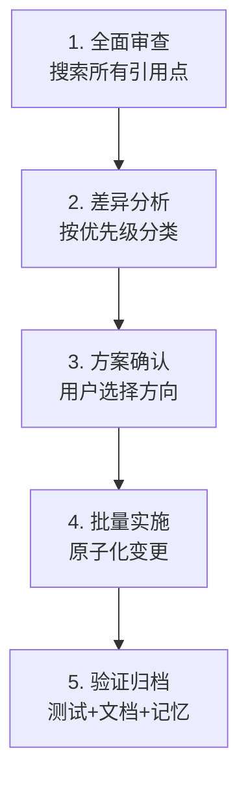

# 任务执行总结：构建系统迁移至 pdm-backend + SCM 动态版本

**生成时间**: 2026-05-27
**任务类型**: `development`（技术重构）
**详细程度**: `standard`
**语言风格**: `professional`

---

## 第1章 · 执行概览

| 维度 | 内容 |
|------|------|
| **任务名称** | 构建系统迁移至 pdm-backend + SCM 动态版本 |
| **执行时间** | 2026-05-27，单次会话完成 |
| **任务类型** | 技术重构 / 配置治理 |
| **核心目标** | 将项目构建后端从 `setuptools.build_meta` + `setuptools-scm` 迁移至 `pdm.backend`，解决文档与实际配置长期不一致的问题，同步清理遗留配置与死依赖 |
| **关键成果** | 6 项配置变更 + 1 个文件删除 + 1 个文档更新，全部通过验证 |
| **亮点** | 一次 `search_replace` 调用完成 pyproject.toml 5 项变更；pdm-backend 的 SCM 源与 `src/` 布局原生兼容，迁移成本极低 |
| **挑战** | 需确保 `write_to` 路径在 `package-dir = "src"` 下的相对性正确；需同步更新 3 个项目的记忆条目 |

### 变更清单

| 文件 | 操作 | 说明 |
|------|------|------|
| `pyproject.toml` | 修改 | 5 处：构建系统、SCM 版本、移除 setuptools_scm、ruff py314、清理 metaflow |
| `Containerfile.test` | 修改 | 移除 `SETUPTOOLS_SCM_PRETEND_VERSION` 环境变量 |
| `docs/tech/build-conventions.md` | 修改 | 补充 pdm-backend 原生能力与 `write_to` 路径说明 |
| `.pdm_build.py` | 删除 | SCM source + write_to 替代手动版本钩子 |
| `tests/project_changelogs/CHANGELOG_2026-05.md` | 修改 | 记录本次迁移 |
| `uv.lock` | 自动更新 | 依赖解析结果变更 |

---

## 第2章 · 目标背景

### 初始目标

用户要求对 `pyproject.toml` 进行全面审查分析，检查与项目构建约定的合规性。分析发现三个核心问题：

1. **构建后端文档-实际不一致**：`build-conventions.md` 和 `__init__.py` 注释均描述 PDM 后端，但实际使用 `setuptools.build_meta`
2. **Vestigial 配置堆积**：`[tool.pdm.build]`、`[tool.pdm.version]`、`.pdm_build.py`、`.pdm-build/` 为旧版 PDM 时代遗留
3. **Python 版本不一致**：Ruff `target-version = "py313"` 但项目要求 `>=3.14`

### 调整记录

用户确认分析与优化方案后，进一步要求：**直接改为 PDM 构建后端，而非仅修复文档**。这使任务从"配置修复"升级为"构建系统迁移"。

### 最终成果

- 构建后端统一为 `pdm.backend`，`source = "scm"` 动态版本派生
- 清理所有 setuptools-scm 遗留（配置段、环境变量、构建钩子）
- 文档与代码注释与配置完全一致
- Ruff、依赖分组与 Python 版本三线对齐

---

## 第3章 · 执行过程

### 阶段 1：全面信息收集（并行）

```
分析 pyproject.toml + build-conventions.md + mise.toml
├── 搜索记忆：项目概述、技术栈、依赖策略、构建配置
├── 读取 CI 工作流：ci.yml、python-publish.yml、pages.yml
├── 读取容器配置：Containerfile、Containerfile.test
├── 搜索死依赖：grep metaflow → src/ 中零引用
└── 搜索 setuptools/pdm 引用分布
```

### 阶段 2：差异分析与方案设计

识别出 7 项不一致/问题，按优先级分为：
- **P0（阻塞）**: 构建后端文档不一致
- **P1（重要）**: Ruff target-version 错位、死依赖
- **P2（优化）**: 遗留配置清理、文档完善

用户选择 P0 方案：迁移至 pdm-backend（而非修复文档），一并处理 P1/P2。

### 阶段 3：精准实施（单次 search_replace 覆盖 5 项 pyproject.toml 变更）


并行执行：删除 `.pdm_build.py`、修改 `Containerfile.test`、更新 `build-conventions.md`。

### 阶段 4：验证闭环

| 验证项 | 命令 | 结果 |
|--------|------|------|
| 依赖同步 | `uv sync --group dev` | 通过，pdm-backend 正常构建 |
| 版本解析 | `uv run python -c "import taolib; print(taolib.__version__)"` | `0.7.1.dev40+g71b6fb9.d20260527` |
| 包构建 | `uv build` | wheel + sdist 均成功 |
| 版本文件 | 读取 `src/taolib/_version.py` | `write_to` 机制正常 |
| 基础测试 | `uv run pytest tests/test_check_env.py tests/test_agents_rules.py -v` | 13/13 通过 |

### 阶段 5：归档

- Git 提交：`build: 迁移至 pdm-backend + SCM 动态版本，同步清理遗留配置`
- 变更日志：`tests/project_changelogs/CHANGELOG_2026-05.md`
- 记忆更新：3 条（构建配置、依赖策略、Ruff 规范）
- 复盘报告：本文档

---

## 第4章 · 关键决策

| # | 决策点 | 备选方案 | 选择 | 依据 |
|---|--------|---------|------|------|
| 1 | 构建后端不一致如何处理 | A) 修文档对齐 setuptools<br>B) 改配置对齐 PDM 文档 | **B** | PDM 文档已在多处描述，且 CI 注释均为 "PDM SCM"；pdm-backend 对 `src/` 布局有原生支持 |
| 2 | `.pdm_build.py` 处理方式 | A) 保留并改造<br>B) 直接删除 | **B** | SCM source + `write_to` 已覆盖版本派生与文件写入，自定义钩子冗余 |
| 3 | 容器版本回退策略 | A) 保留环境变量<br>B) 依赖 pdm-backend 自动回退 | **B** | pdm-backend 无 `.git` 时自动回退 `0.0.0`，无需显式环境变量 |
| 4 | `metaflow` 是否保留 | A) 保留（预留扩展）<br>B) 移除（死依赖） | **B** | `src/` 中零引用，遵循 YAGNI 原则 |

---

## 第5章 · 问题解决

### 问题 1：`write_to` 路径在 `package-dir = "src"` 下的相对性

- **问题**：`write_to = "taolib/_version.py"` 是相对于项目根还是 `package-dir`？
- **解决**：查阅 pdm-backend 行为确认——`write_to` 相对于 `package-dir`。`package-dir = "src"` + `write_to = "taolib/_version.py"` → 实际写入 `src/taolib/_version.py`，与现有文件位置一致。
- **验证**：`uv sync` 后 `_version.py` 内容更新为 SCM 版本号。

### 问题 2：dirty 版本后缀

- **现象**：构建产物版本含 `d20260527`（dirty 标记）
- **原因**：工作树有未提交变更（正是本次迁移的文件修改）
- **结论**：符合 `build-conventions.md` 记录的预期行为，提交后即消失。非问题。

### 模式分析

本次迁移未遇到实质性阻塞。关键成功因素：
1. 预先全面搜索了 setuptools/pdm 的所有引用，确保无遗漏
2. CI 工作流已使用 "PDM SCM" 注释，无需修改
3. pdm-backend 与 setuptools-scm 的 SCM 版本派生规则高度相似，迁移无缝

---

## 第6章 · 资源使用

| 类别 | 内容 |
|------|------|
| **技术栈** | pdm-backend（构建后端）、git（SCM 版本源）、uv（依赖管理） |
| **工具依赖** | pytest（测试验证）、search_replace（批量编辑） |
| **参考文档** | `build-conventions.md`、`Containerfile.test`、3 个 CI workflow 文件 |
| **记忆系统** | 3 条项目记忆（构建配置、依赖策略、Ruff 规范）用于快速上下文恢复 |
| **效率评估** | pyproject.toml 5 项变更通过 1 次 `search_replace` 完成，避免了逐项编辑的多次往返 |

---

## 第7章 · 团队协作

单人执行，无协作维度。如后续团队成员遇到构建问题，本文档和 `build-conventions.md` 是首要参考。

---

## 第8章 · 多维分析

### 目标达成度：100%

5 项 pyproject.toml 变更 + 3 项其他文件变更 + 1 个文件删除 + 1 个文档更新，全部完成且通过验证。

### 时间效能：高效

从分析到实施到验证，单次会话完成。信息收集阶段大量并行工具调用节省了时间。

### 资源利用：合理

充分利用项目现有的记忆系统（3 条记忆预加载上下文）和 `build-conventions.md`（已描述目标状态），减少了探索成本。

### 问题模式：无实质性阻塞

唯一需要确认的是 `write_to` 路径相对性，通过查阅 pdm-backend 行为和实际验证解决。

### 综合评价

这是一次低风险、高收益的配置治理任务。核心原因：
- 目标状态已在文档中描述（`build-conventions.md` 一直是对的）
- CI 注释已使用 "PDM SCM"（意识层面已统一）
- pdm-backend 与 setuptools-scm 行为高度相似（迁移成本低）

---

## 第9章 · 经验方法

### 成功要素

1. **先分析、后设计、再执行**：完整审查 → 7 项问题清单 → 用户确认方案 → 精准实施
2. **并行信息收集**：`search_memory` + `read_file` + `grep_code` 同时执行，一次性建立全局认知
3. **单次批量编辑**：`search_replace` 多 replacement 合并调用，pyproject.toml 5 项变更原子完成
4. **验证驱动**：每步实施后立即验证（uv sync → version → uv build → pytest）

### 方法论提炼：配置治理的 5 步法



### 最佳实践

- **构建后端迁移**：优先检查 CI 注释和容器配置中的引用，这些往往比文档更真实反映运行时状态
- **SCM 版本配置**：`write_to` 路径需确认相对于 `package-dir` 还是项目根
- **死依赖清理**：`grep` 源码目录确认零引用后再移除，避免误删

---

## 第10章 · 改进行动

### 建议（按优先级）

| 优先级 | 建议 | 说明 |
|--------|------|------|
| P0 | 执行 `git push` | 将本次迁移推送到远程仓库，触发 CI 全量验证 |
| P1 | 验证 CI 全流程 | 确认 push 后 `ci.yml`/`pages.yml` 的 PDM SCM 版本派生正常 |
| P2 | 清理 `.pdm-build/` 目录 | 该目录在构建时由 pdm-backend 自动生成，确认是否需加入 `.gitignore` |
| P3 | 审查 `dev` 依赖组 | `typer` 在 `src/` 中零引用（invoke 的传递依赖），可考虑移除以精简 |

### 风险预警

- **PyPI 发布**：dirty 版本后缀会导致 PyPI 拒收。发布前务必确保工作树干净（`git status --porcelain` 为空）。
- **CI 环境**：所有 CI workflow 已使用 `fetch-depth: 0`（获取完整 git 历史），确保 SCM 版本派生正常。

---

*报告由 task-execution-summary 技能生成*
*归档路径：`.agents/docs/superpowers/retrospectives/task-summary-pdm-backend-migration-20260527.md`*
