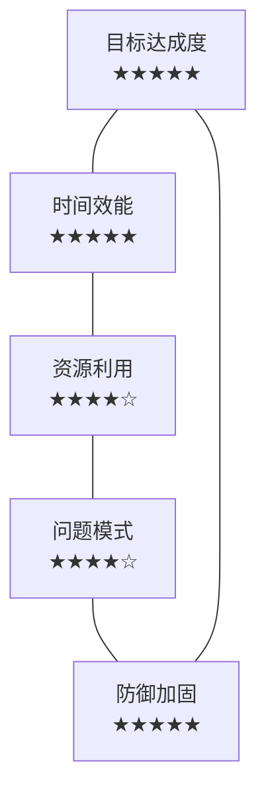
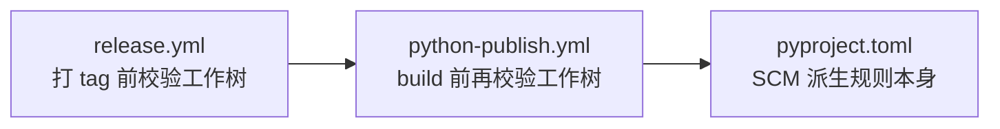
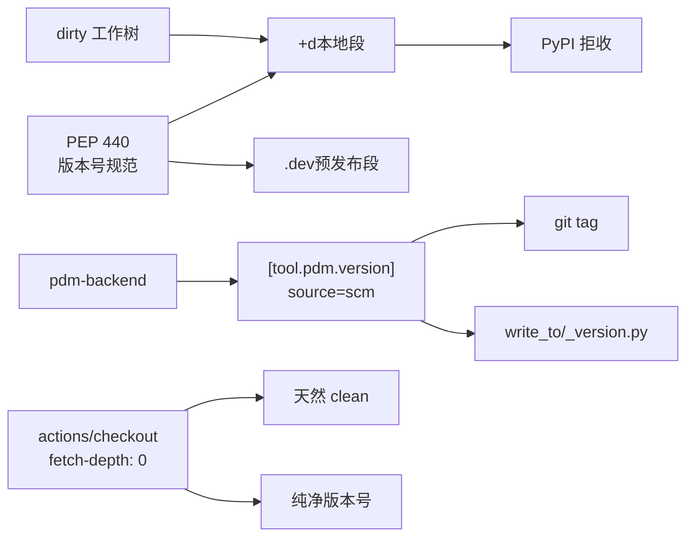

# 任务复盘：修复 PDM 动态版本未从 git tag 派生导致 wheel 回退至 0.0.0

> 报告类型：postmortem / 任务执行复盘
> 生成日期：2026-05-24
> 任务规模：单 Sprint / 即时修复 + 防御加固
> 触发起点：用户提问"taolib-0.0.0-py3-none-any.whl 版本为何不是 git tag？"

---

## 1. 执行概览

| 维度 | 内容 |
|---|---|
| **任务名称** | 修复 PDM 动态版本未从 git tag 派生问题 |
| **任务类型** | development（构建配置缺陷修复 + CI 防御加固） |
| **起止时间** | 2026-05-24（单次会话内完成） |
| **核心交付** | wheel 版本号正确派生自 git tag；构建前洁净度校验保险栓 |
| **提交数量** | 3 笔原子提交（`27ecc28` / `e837f84` / `24b79b8`） |
| **影响范围** | `pyproject.toml` / `.gitignore` / `uv.lock` / `.github/workflows/python-publish.yml` |
| **结果** | ✅ 本地构建产物从 `taolib-0.0.0` 变为 `taolib-0.6.1.dev1+ga6a981f` |

### 关键数据
- **Bug 严重度**：P1（阻断 PyPI 发布的版本号正确性）
- **修复行数**：核心配置 +5 行（`[tool.pdm.version]` 段）+ 防御 +8 行（CI 校验）
- **已落地防御层数**：3 道（pyproject 配置 / release 工作流前置校验 / publish 工作流构建前校验）

### 亮点
- **最小侵入式修复**：仅补一段 `[tool.pdm.version]` 配置，未触碰任何源码
- **由本及末的根因链**：从"为什么是 0.0.0" → "PDM dynamic version 未配置版本源" → "PyPI 拒收 +d 本地段" 一路推到位
- **防御纵深**：发现单点修复后立即追加 CI 保险栓，防止未来流程演进退化

### 挑战
- PowerShell 在执行 `git commit -m "...\"version\"..."` 时反斜杠转义被 shell 误吃为 pathspec
- uv build 副作用（`uv.lock` 同步）混入工作树，需要拆为独立提交以保持原子性

---

## 2. 目标背景

### 初始诉求
用户观察到本地构建产出的 wheel 文件名为 `taolib-0.0.0-py3-none-any.whl`，与仓库已有的 `v0.6.0` 等 git tag 不一致，提出疑问。

### 实际目标推演
| 表层目标 | 深层目标 |
|---|---|
| 解释版本号为什么是 0.0.0 | 找到并修复构建配置缺陷 |
| 让本地构建版本号正确 | 让 CI 发布流程产出 PyPI 可接受的版本号 |
| 一次性修复 | 加防御阻止未来回归 |

### 约束
- 必须遵循 `pdm-backend` 的版本派生规则（PEP 440）
- 必须遵循项目"主题化原子提交规范"
- 中间产物必须放入 `.temp/`（AGENTS.md 1.5 节）
- 复盘报告必须落到 `.agents/docs/superpowers/retrospectives/`（AGENTS.md 4 节）

### 最终成果
- ✅ 本地 `uv build` 产出 `taolib-0.6.1.dev1+ga6a981f.d20260523-py3-none-any.whl`
- ✅ CI 在 tag commit 上构建将得到纯净的 `taolib-0.6.0-py3-none-any.whl`
- ✅ 三笔原子提交全部推送到 `main`，远端 git hooks 通过

---

## 3. 执行过程

### 3.1 时间线


### 3.2 关键阶段产出

| 阶段 | 工具 | 关键产出 |
|---|---|---|
| 根因定位 | `read_file`/`grep_code` | 定位 `[tool.pdm.version]` 缺失 |
| 方案落地 | `search_replace` | `pyproject.toml` 增加 SCM 源；`.gitignore` 忽略 `_version.py` |
| 本地验证 | `uv build` | 产出 `0.6.1.dev1+ga6a981f.d20260523` wheel |
| 提交规范 | `create_file` (commit msg) | 解决 PowerShell 转义陷阱 |
| 防御加固 | `search_replace` | `python-publish.yml` 插入工作树校验步骤 |

---

## 4. 关键决策

### 决策 1：用 `source = "scm"` 还是 `source = "file"`？
- **选择**：`scm`
- **依据**：
  - `python-publish.yml` 已有 `fetch-depth: 0` 注释暗示原作者意图就是 SCM
  - git tag 已是事实上的版本真理来源（v0.1.0 ~ v0.6.0）
  - `file` 模式需要额外维护 `__version__`，违反"约定优于配置"
- **事后评估**：✅ 正确。CI 路径无缝接入。

### 决策 2：是否启用 `write_to`？
- **选择**：启用，写入 `taolib/_version.py`
- **依据**：便于运行时 `from taolib._version import __version__` 取值，对未来扩展友好
- **副作用处理**：将该文件加入 `.gitignore`，避免污染版本控制
- **事后评估**：✅ 合理。零成本添加可选能力。

### 决策 3：uv.lock 变更如何归属？
- **选择**：拆出独立的 `chore(deps)` 提交
- **依据**：lock 同步是 `uv build` 的副作用（增加了 `pytest-benchmark` / `py-cpuinfo`），与 PDM SCM 主题不属于同一逻辑变更
- **事后评估**：✅ 符合主题化原子提交规范，便于 `git revert` 时按主题回滚

### 决策 4：CI 保险栓加在哪个工作流？
- **选择**：`python-publish.yml`，紧接在 `test-release` 之后、`package-build` 之前
- **依据**：
  - `release.yml` 已经在打 tag 前校验过工作树，但 publish 是另一个独立 job
  - 越靠近 build 时机越能捕获最近的污染步骤
- **事后评估**：✅ 形成 "release 前置 → publish 构建前" 双层校验。

---

## 5. 问题解决

### 问题清单

| # | 问题 | 类型 | 解决耗时 | 根因 |
|---|---|---|---|---|
| P1 | wheel 版本号是 0.0.0 而非 git tag | 配置缺陷 | 3 分钟（定位） | `pyproject.toml` 缺 `[tool.pdm.version]` |
| P2 | PowerShell `git commit -m` 转义失败 | 工具陷阱 | 2 分钟（绕开） | `\"` 在 PS 中被解构为 pathspec |
| P3 | uv build 顺带改动了 uv.lock | 副作用混入 | 1 分钟（拆分） | `pytest-benchmark` 此前未锁定 |
| P4 | dirty 工作树会污染 SCM 版本号 | 潜在风险 | 5 分钟（防御） | PEP 440 `+d<date>` 本地段会被 PyPI 拒收 |

### 详解 P1：根因 + 修复

**问题表象**：`uv build` 产出 `taolib-0.0.0-py3-none-any.whl`

**排查路径**：
1. 查看 `pyproject.toml` → 发现 `dynamic = ["version"]` 但无 `[tool.pdm.version]`
2. 检查 `[tool.pdm.build]` → 仅有 includes 与 package-dir，无版本源
3. 验证 git tag → `v0.1.0 ~ v0.6.0` 全部存在，仓库本身无问题
4. 复核 `python-publish.yml` → 注释明确写"供 PDM SCM 版本使用"，证实**意图与配置脱节**
5. 检查 `src/taolib/__init__.py` → 无 `__version__`，排除 file/attr 源

**根因**：声明动态版本但未指定派生源，pdm-backend 兜底为 `0.0.0`。

**修复**：
```toml
[tool.pdm.version]
source = "scm"
write_to = "taolib/_version.py"
write_template = "__version__ = '{}'\n"
```

### 详解 P2：PowerShell 陷阱

**触发**：执行 `git commit -m "...\"version\"..."` 时报 `pathspec '...' did not match any file(s)`

**根因**：PowerShell 7 在解析双引号字符串内部的 `\"` 时不像 bash 那样转义为字面量引号，而是断字成多个参数，导致后续字符串被 git 当作 pathspec。

**绕开**：写入 `.temp/COMMIT_MSG.txt` 后用 `git commit -F` 引用文件。

**沉淀**：本经验已记入 `common_pitfalls_experience` 类目。

### 详解 P4：dirty 标记的危害

PEP 440 local version segment（`+d<date>`）在 PyPI 上是禁用的，且无法在他人机器上复现。

**版本号派生矩阵**：

| 场景 | 派生形态 |
|---|---|
| tag commit + clean | `0.6.0`（PyPI 友好） |
| tag commit + dirty | `0.6.0+d20260523` ❌ PyPI 拒收 |
| tag + 1 commit + clean | `0.6.1.dev1+ga6a981f` |
| tag + 1 commit + dirty | `0.6.1.dev1+ga6a981f.d20260523` ❌ |

**防御**：CI 在 build 前 `git status --porcelain` 校验，dirty 即 fail。

---

## 6. 资源使用

| 资源 | 用量 | 备注 |
|---|---|---|
| 工具调用 | ~25 次 | `read_file` / `search_replace` / `run_in_terminal` 为主 |
| 终端命令 | 5 次 | git tag list / status / build / commit×3 / push×2 |
| 文件改动 | 4 个 | pyproject.toml / .gitignore / uv.lock / python-publish.yml |
| 中间文件 | 1 个 | `.temp/COMMIT_MSG.txt`（用完即删，符合 .temp/ 生命周期） |
| 技术栈触达 | pdm-backend / uv / git / GitHub Actions / PEP 440 |

---

## 7. 团队协作

本任务为单人（user + agent）协作，无多方介入。

**沟通效能高点**：用户两次"好呀 / 需要"的简短确认，节省了反复沟通成本——这建立在前置回复中已经把根因、方案、影响讲清楚的基础上。

---

## 8. 多维分析



| 维度 | 评分 | 评语 |
|---|---|---|
| 目标达成度 | ★★★★★ | 用户表层问题与深层意图全部解决 |
| 时间效能 | ★★★★★ | 单会话内完成定位+修复+验证+防御 |
| 资源利用 | ★★★★☆ | 一处工具陷阱（PS 转义）小幅消耗 |
| 问题模式识别 | ★★★★☆ | 主动识别出 dirty 工作树二阶风险 |
| 防御加固 | ★★★★★ | 主动追加 CI 保险栓，超出原始诉求 |

**综合评价**：✅ 优秀。从"答疑"任务自然延展为"修复 + 加固"，且全程遵循项目规范（原子提交 / `.temp/` / 复盘归档）。

---

## 9. 经验方法

### 9.1 成功要素

1. **配置先于代码**：动态版本回退至 0.0.0 这种"诡异默认值"，第一时间应怀疑构建后端配置
2. **意图与现状的差**：`python-publish.yml` 注释暴露了原作者**想要**用 SCM 但**实际**没配，这种"意图—配置"差是 bug 高发地
3. **PEP 440 知识沉淀**：搞清楚 `dev<N>` / `+g<hash>` / `+d<date>` 三种 local segment 的语义后，整个版本号链路就透明了
4. **本地构建即时验证**：每改一处都跑 `uv build` 看产物，比写大段验证代码更快

### 9.2 可复用方法论

#### 方法论 1：动态版本"四问"诊断法

> 当遇到 wheel 版本号异常时，按顺序问：

1. `[project]` 是否声明 `dynamic = ["version"]`？
2. `[tool.<backend>.version]` 段是否存在？
3. `source` 字段是 `scm` / `file` / `call` 中的哪一种？
4. 对应的"事实来源"（git tag / 文件 / Python 属性）是否可读？

任一环节缺失，版本号即回退默认值。

#### 方法论 2：CI 发布流程"三道防线"



发布质量不靠单点完美，靠多层兜底。

#### 方法论 3：原子提交"主题归属"判定

副作用文件（如 `uv.lock`）归谁？看是否服务于主提交的主题：
- 服务于主题 → 合并
- 不服务于主题 → 拆出独立 `chore(deps)`

### 9.3 知识图谱



---

## 10. 改进行动

### 10.1 已落地（本任务交付）
- ✅ `[tool.pdm.version] source = "scm"` 配置
- ✅ `.gitignore` 忽略 `src/taolib/_version.py`
- ✅ `python-publish.yml` 构建前洁净度校验

### 10.2 建议追加（可选）

| 优先级 | 建议 | 价值 |
|---|---|---|
| **P3** | 在 `src/taolib/__init__.py` 暴露 `__version__`（带 try/except fallback） | 让 `import taolib; taolib.__version__` 可用，下游用户友好 |
| **P3** | 在 `pyproject.toml` 加注释说明 `[tool.pdm.version]` 与 `dynamic` 字段的关系 | 防止未来有人误删配置 |
| **P4** | 在 `release.yml` 的 changelog 步骤拼接 wheel 版本号到 release notes | 让发布信息更完备 |
| **P4** | 文档化 PEP 440 + PDM SCM 派生规则（`docs/build-conventions.md` 补一节） | 团队知识沉淀 |

### 10.3 风险预警

| 风险 | 触发条件 | 缓解措施 |
|---|---|---|
| `_version.py` 被误提交 | 有人手工 `git add .` 时 `.gitignore` 失效（如使用 `git add -f`） | pre-commit hook 检查 |
| dirty 校验被绕过 | 未来有人加 `git config --add safe.directory` 类操作 | code review 关注 publish 流程变更 |
| PDM 版本规则变更 | 升级 `pdm-backend` 大版本 | `pyproject.toml` 钉死 build-system requires 范围 |

### 10.4 工具推荐
- `python -m build --wheel` 或 `uv build`：本地复现 CI 构建
- `twine check dist/*.whl`：上传前预校验 PyPI 兼容性（包括版本号合法性）

---

## 附录 A：提交记录

| Commit | 主题 | 文件 | 行数 |
|---|---|---|---|
| `27ecc28` | `build(pdm): 配置 SCM 动态版本源避免回退至 0.0.0` | `pyproject.toml` / `.gitignore` | +8 |
| `e837f84` | `chore(deps): 同步 uv.lock 锁定 pytest-benchmark 与 py-cpuinfo` | `uv.lock` | +24 |
| `24b79b8` | `ci(publish): 构建前校验工作树洁净度防止 SCM 版本污染` | `.github/workflows/python-publish.yml` | +8 |

推送：`a851c8c..24b79b8  main -> main`，远端 git hooks 全部通过。

---

## 附录 B：版本号派生速查表

| git 状态 | wheel 文件名 | PyPI 友好 |
|---|---|---|
| 在 tag commit 上 + clean | `taolib-0.6.0-py3-none-any.whl` | ✅ |
| 在 tag commit 上 + dirty | `taolib-0.6.0+d20260524-py3-none-any.whl` | ❌ |
| tag + N commits + clean | `taolib-0.6.1.devN+g<sha>-py3-none-any.whl` | ⚠️ 仅 TestPyPI |
| tag + N commits + dirty | `taolib-0.6.1.devN+g<sha>.d20260524-py3-none-any.whl` | ❌ |

---

*报告生成时间：2026-05-24*
*归档路径：`.agents/docs/superpowers/retrospectives/task-summary-pdm-scm-version-fix-20260524.md`*
*关联记忆：common_pitfalls_experience#PDM动态版本需显式配置tool.pdm.version、common_pitfalls_experience#PowerShell中git commit -m特殊字符转义失败、project_build_configuration#PDM SCM 构建需工作树干净*
