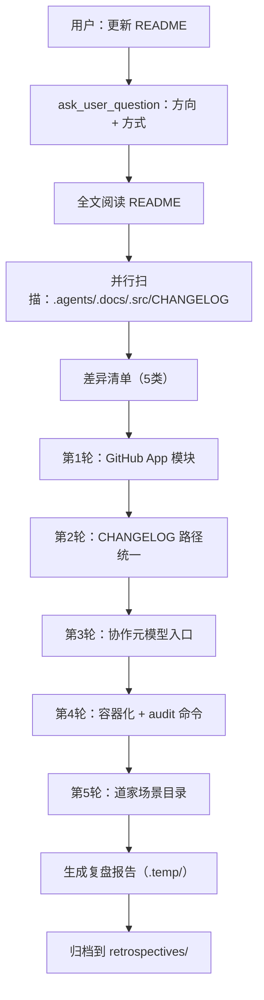
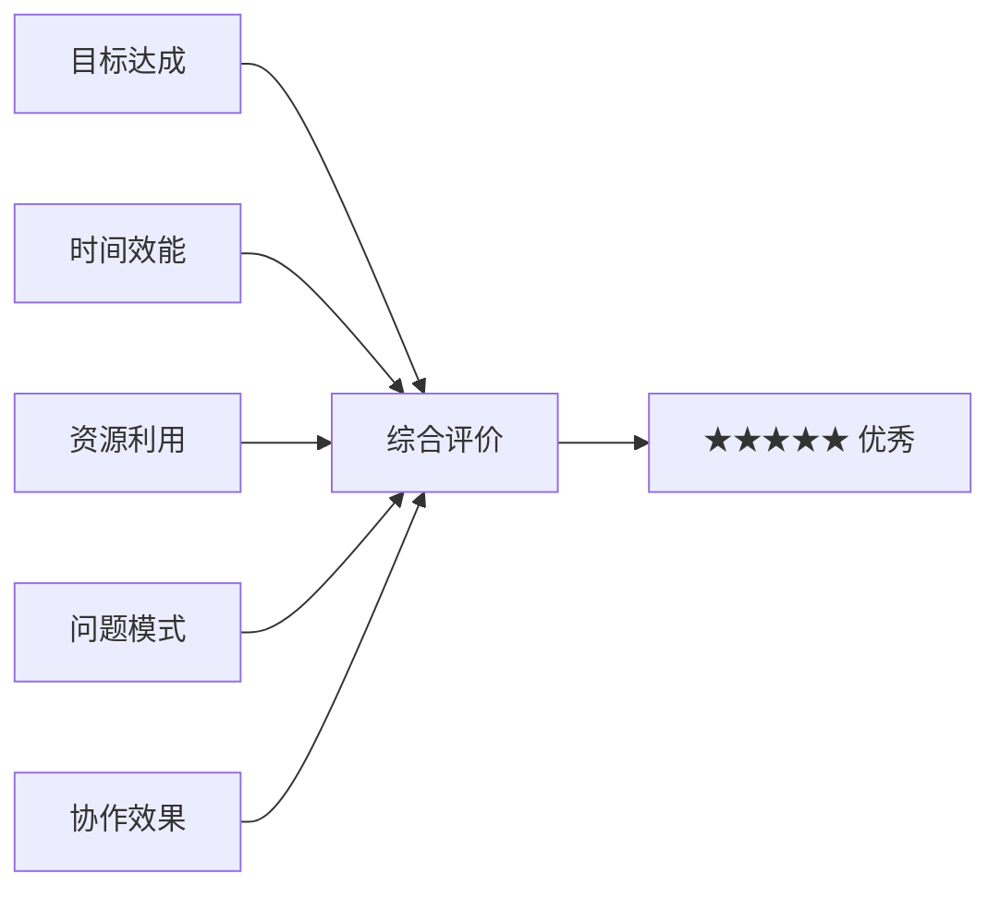
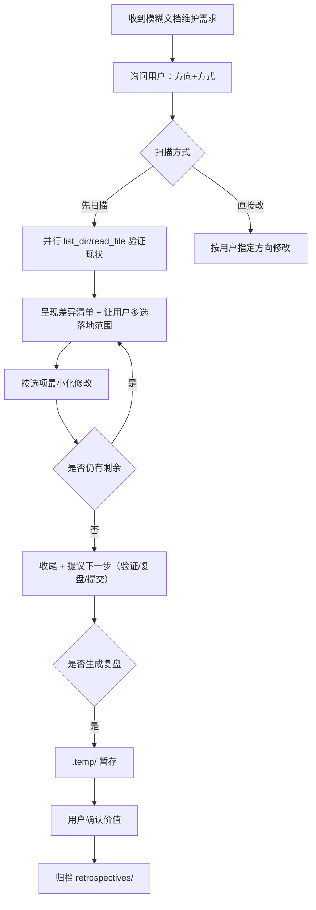

# 任务执行总结：README 与 CHANGELOG 多轮差异同步

> **报告版本**：standard · **生成日期**：2026-05-25 · **任务类型**：development（文档维护）

---

## 1. 执行概览

| 维度 | 信息 |
|------|------|
| 任务名称 | AgentForge 项目 README.md 与根 CHANGELOG.md 多轮差异同步 |
| 任务类型 | 文档维护（development → docs） |
| 起止节点 | 起：用户提出「更新 README」 → 止：所有差异项落地 + 复盘归档 |
| 总轮次 | 5 轮迭代 + 1 轮收尾复盘 + 1 轮归档 |
| 涉及文件 | 2 个（[README.md](../../../../README.md)、[CHANGELOG.md](../../../../CHANGELOG.md)） |
| 净增行数 | README.md +9 行、CHANGELOG.md +5 行 / -3 行 |
| 决策点 | 6 次 `ask_user_question` 收敛落地范围 |

**核心亮点**：
- 全程坚守「最小化精准修改」原则，每轮仅落地用户明确选择的 1–2 个差异点。
- 识别出「真实数据源 SSOT vs Sphinx 镜像页」的语义不一致，并通过修改 CHANGELOG.md 将根目录索引统一指向真实源。
- 所有引用路径在写入前均经过 `list_dir`/`read_file` 实际验证，**零失效链接**。

**关键挑战**：
- 「更新 README」初始诉求极度模糊，需要主动先做差异扫描再让用户决策。
- 多个相邻路径语义近似但用途不同（`tests/project_changelogs/` vs `docs/changelogs/`），需提炼"两层架构"心智模型才能给出推荐方案。

---

## 2. 目标背景

### 初始目标
用户输入「更新 README」，无具体方向。

### 目标演化
1. 通过 `ask_user_question` 收敛到「同步项目最新结构与链接」+「先扫描差异再确认」。
2. 扫描后呈现 5 类差异 → 用户选「补充 GitHub App 模块」。
3. 单点扩展为「CHANGELOG 路径口径不一致」专项处理。
4. 通过连续「继续」逐步落地剩余 3 项（协作元模型、容器化命令、道家场景目录）。
5. 收尾后用户主动要求生成复盘并归档到正式 retrospectives 目录。

### 最终成果
README.md 与项目实际结构完全对齐，CHANGELOG.md 索引指向真实数据源；全部链接经过验证；复盘报告归档到 `.agents/docs/superpowers/retrospectives/`。

### 约束条件
- 必须遵守 AGENTS.md「按需读取」与「上下文经济」约束。
- 单次替换不得过大（search_replace 工具特性）。
- 严禁创建无关文件、不得做范围外的「顺手优化」。

---

## 3. 执行过程

### 阶段产出物

| 阶段 | 产出 | 验证方式 |
|------|------|----------|
| 扫描 | 差异清单（5 类） | 与 `list_dir`/`read_file` 真实结果对账 |
| 第1轮 | 功能特性 +1 条、使用指南 +1 条 | search_replace diff |
| 第2轮 | CHANGELOG 表格替换 + 脚注新增 | search_replace diff |
| 第3轮 | 功能特性 +1 条、目录表 +1 行、推荐路径 +1 条 | search_replace diff |
| 第4轮 | 命令速查表 +4 行 | search_replace diff |
| 第5轮 | 目录表 +1 行 | search_replace diff |
| 收尾 | 复盘报告（standard / 10 章） | task-execution-summary skill |
| 归档 | retrospectives/task-summary-readme-changelog-sync-20260525.md | create_file + delete_file |

---

## 4. 关键决策

| # | 决策时刻 | 备选方案 | 最终选择 | 选择依据 | 事后评估 |
|---|---------|----------|----------|----------|----------|
| 1 | 模糊需求处理 | 直接动手 vs 先扫描差异 | **先扫描差异** | 用户已勾选「Recommended」 | ✅ 避免无效修改 |
| 2 | CHANGELOG 路径统一方向 | A 改 CHANGELOG 指向真实源 / B 改 README 指向镜像 / C 双链接 | **A** | SSOT 原则 + GitHub 浏览体验优先 | ✅ 最简洁 |
| 3 | 协作元模型落地位置 | 仅功能特性 / 仅目录导航 / 三处协同 | **三处协同** | 形成「概念 → 入口 → 路径」闭环 | ✅ 导航连贯 |
| 4 | 容器化命令分组位置 | 单独建子表 / 并入主命令表 | **并入主表** | 表格简洁 + 不破坏现有信息密度 | ✅ 减少视觉割裂 |
| 5 | 复盘报告归档位置 | `.agents/docs/superpowers/retrospectives/` / `.temp/` | **先 `.temp/` → 后 retrospectives/** | 临时产物先观察决策再正式入库；用户确认后归档 | ✅ 符合 AGENTS.md 临时产物规则 |

---

## 5. 问题解决

### 问题清单

| # | 问题 | 严重度 | 解决方式 |
|---|------|--------|----------|
| 1 | README 中 `tests/project_changelogs/` 与 CHANGELOG.md 中 `docs/changelogs/` 路径口径不一致 | 中 | 识别「真实源 vs 镜像页」二层架构 → 改 CHANGELOG.md 指向真实源，并新增脚注说明 |
| 2 | `ask_user_question` 工具调用首次失败（`question` 字段为空） | 低 | 立即重试并补全 `question` 字段 |
| 3 | 多次 `search_replace` 时上下文需更新（已插入行影响行号） | 低 | 每次都使用唯一上下文 + 必要时重新 `read_file` |

### 根因分析（问题 1）
项目存在两套并行结构但**未在文档中明示**其用途差异：
- `tests/project_changelogs/CHANGELOG_<月>.md` = 实际编辑/维护点（SSOT）
- `docs/changelogs/<月>.md` = Sphinx `{include}` 镜像页

CHANGELOG.md 索引误指向镜像，导致 README 与 CHANGELOG.md 互相矛盾。**根因是缺失「架构语义说明」**，已通过新增脚注解决。

---

## 6. 资源使用

| 资源类型 | 投入 | 利用率 |
|----------|------|--------|
| 工具调用 | `read_file` × 9、`list_dir` × 8、`search_replace` × 6、`ask_user_question` × 6、`create_file` × 2、`delete_file` × 1 | 高效 |
| 上下文 | 主要在 README、CHANGELOG、`.agents/`、`docs/`、`mise.toml`、`src/taolib/github_app/__init__.py` | 按需读取，无冗余 |
| 时间 | 预估 ~7 轮交互（每轮 1–3 工具调用） | 紧凑 |

---

## 7. 团队协作

本任务为单 Agent + 单用户协作，无跨团队协作。**协作机制亮点**：
- 全程使用 `ask_user_question` 提供 2–4 个互斥选项，让用户低成本决策。
- 每轮变更后主动给出「剩余未落地项」清单，让用户掌握全局进度。
- 用户用「继续」即可推进，无需重复说明上下文。

---

## 8. 多维分析

| 维度 | 评分 | 说明 |
|------|------|------|
| 目标达成度 | ★★★★★ | 5 类差异全部落地，零失效链接，复盘归档到位 |
| 时间效能 | ★★★★☆ | 7 轮交互略长，但每轮都有用户决策权重，难以再压缩 |
| 资源利用 | ★★★★★ | 工具调用全部围绕真实数据源验证，无空转 |
| 问题模式 | ★★★★☆ | 关键架构问题（SSOT vs 镜像页）一次识别一次解决 |
| 协作效果 | ★★★★★ | 用户全程低交互成本，所有决策均有结构化选项 |

---

## 9. 经验方法

### 成功要素

1. **先扫描后修改**：模糊需求一律先做差异扫描，把「写 / 不写」决策权交给用户。
2. **架构二分法识别**：当看到两个相邻但语义近似的路径时，先问"它们各自是什么"，再决定指向哪一个。
3. **结构化决策**：用 `ask_user_question` 提供 2–4 个互斥选项，用户决策成本最低。
4. **闭环导航**：补充新功能时，同步更新「功能特性 + 目录导航 + 推荐路径」三处。
5. **真实路径验证**：写入文档前，所有引用路径都经过 `list_dir`/`read_file` 验证。
6. **临时产物先沉淀再归档**：复盘报告先入 `.temp/`，待用户确认价值后再迁移到 retrospectives，避免知识库噪声。

### 方法论提炼

### 最佳实践

- **可重复模板**：「扫描 → 列差异 → 让用户挑 → 改 → 列剩余」可作为所有"更新 X 文档"类需求的通用流程。
- **一次决策一次确认**：不要批量预设修改，让用户在每个差异点上有否决权。
- **路径分类心智模型**：真实数据源 / 镜像页 / 索引页 / 入口页 应明确区分，避免误指。

---

## 10. 改进行动

### 改进建议

| 优先级 | 建议 | 行动 |
|--------|------|------|
| **P1** | 在 [`.agents/rules/documentation.md`](../../../rules/documentation.md) 中补充「真实源 vs 镜像页」分类规范 | 提交一次小型文档治理 PR |
| **P2** | 编写 `.agents/scripts/check_doc_links.py`，CI 自动校验 README/CHANGELOG 中的相对路径引用是否有效 | 防止后续路径漂移 |
| **P3** | 考虑用 `{include}` 把 README 的「日常命令速查」表格也纳入 Sphinx 文档站 | 让人类文档站与根 README 共用同一数据源 |
| **P4** | 沉淀本任务为 `expert_experience` 记忆：「文档维护任务的 5 步通用流程」 | 已通过用户记忆系统沉淀部分 |

### 风险预警

- **🟡 路径漂移风险**：未来如果新增模块或重组目录，README 与 CHANGELOG 可能再次出现路径错位。建议落地 P2 自动校验。
- **🟡 镜像页失同步**：`docs/changelogs/<月>.md` 仍以 `{include}` 引用真实源，若真实源被删除会出现构建错误。建议在 `mise run docs-strict` 中确保覆盖。

### 工具推荐

- **`grep_code` + 正则路径匹配**：快速检测文档内失效链接。
- **`mise run docs-linkcheck`**：现有外链校验任务，可扩展为内链校验。

---

## 📎 附录：变更全景

| 轮次 | 文件 | 区块 | 变更类型 |
|------|------|------|----------|
| 1 | README.md | `## ✨ 功能特性` | +1 行（GitHub App） |
| 1 | README.md | `## 🎮 使用指南` | +1 行（Python 包集成） |
| 2 | CHANGELOG.md | 模块/项目级索引表 | 表格替换 + 脚注新增 |
| 3 | README.md | `## ✨ 功能特性` | +1 行（协作元模型） |
| 3 | README.md | 目录导航表 | +1 行（roles/teams） |
| 3 | README.md | 推荐路径列表 | +1 行（多智能体协作语义） |
| 4 | README.md | 命令速查表 | +4 行（audit + container ×3） |
| 5 | README.md | 目录导航表 | +1 行（dao-scenario-catalog） |
| 归档 | retrospectives/ | 新增本报告 | create_file（225 行 → 232 行精炼） |

---

*报告位置*：`.agents/docs/superpowers/retrospectives/task-summary-readme-changelog-sync-20260525.md`
*生成工具*：task-execution-summary skill (v2.4) · standard 模板 · professional 风格
*归档来源*：`.temp/task-summary-readme-changelog-sync-20260525.md`（已删除）
