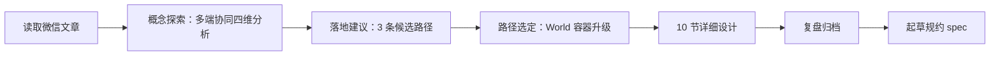
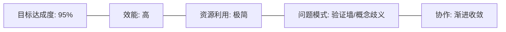
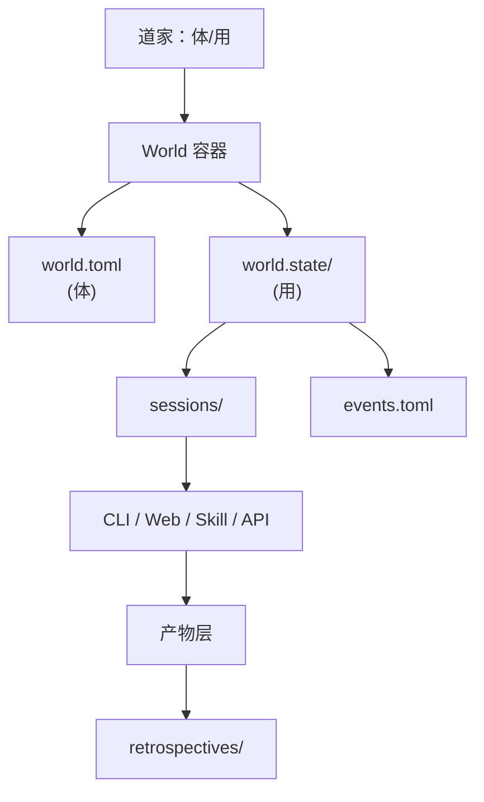

# 任务执行总结：探索"多端协同 → World 作为统一上下文容器"

> 报告版本：standard（标准版 10 章）
> 任务窗口：2026-05-27 单次会话探索
> 报告生成：task-execution-summary v2.4
> 触发起点：商汤小浣熊 OPC 公众号文章学习

---

## 1. 执行概览

| 字段 | 内容 |
|---|---|
| 任务名称 | 多端协同探索 → World 升级为统一上下文容器（设计阶段） |
| 任务类型 | research（技术研究 / 架构探索） |
| 起止时间 | 2026-05-27 单次会话 |
| 主要产出 | ① 多端协同四维分析；② World 容器升级 10 节方案；③ 本复盘报告；④ 规约草案（后续步骤） |
| 关键决策 | 把 World 从"静态 manifest"演进为"静态定义 + 动态运行时"双层结构 |
| 哲学锚点 | 反者道之动 / 弱者道之用 ｜ 体（World）-用（端）二分 |
| 完成度 | 设计阶段 100%（待落地为规约文档与 PoC） |

### 亮点
- **从外部材料到自有架构的跃迁清晰**：商汤多端协同 → AgentForge 自有 World 体系。
- **哲学与工程双向贯通**：体/用之分自然对应"定义层/运行时层"。
- **不破坏现有契约**：复用 kernel/fragments/capabilities/memory 四层，仅增量补 L2 运行时层。

### 挑战
- 没有立刻进入实现，避免了过早工程化的陷阱。
- 多端冲突解决方案（CRDT vs 悲观锁）需后续实测验证。

---

## 2. 目标背景

### 2.1 初始目标
用户分享一篇商汤小浣熊 OPC 能力挑战赛公众号文章，最初目标仅为"学习这篇文章"。

### 2.2 目标演进
| 阶段 | 目标 | 演进动因 |
|---|---|---|
| T0 | 抓取并阅读文章 | 用户原始请求 |
| T1 | 探索"多端协同"概念 | 用户主动延伸 |
| T2 | 聚焦 World 作为统一上下文容器 | 设计建议被用户选中 |
| T3 | 复盘 + 起草规约 | 用户决定进入交付阶段 |

### 2.3 最终成果
- 在概念层：明确"多端协同 = 上下文一致性 + 任务流转 + 产物复用"三流合一。
- 在架构层：提出 World 的"定义层 + 运行时层 + 产物层"三层模型。
- 在落地层：给出 4 阶段路径（P1 协议 → P2 CLI → P3 Skill 协议绑定 → P4 端实现）。

### 2.4 约束条件
- 不修改任何已有代码，仅产出设计文档。
- 必须兼容 [`world.toml`](../../../../world.toml) 的 kernel/fragments/capabilities/memory 既有契约。
- 必须遵循 `.agents/rules/documentation.md` 的文档治理边界。

---

## 3. 执行过程

### 3.1 时间线

| 阶段 | 关键动作 | 产出 |
|---|---|---|
| T0 抓取 | 浏览器 Agent 绕过验证页拿到文章正文 | 文章摘要：四形态 / 六场景 / 四步流 |
| T1 概念探索 | 拆解为：本质 / 形态 / 协同模式 / 落地 | 4 张 Mermaid 图 + 关键洞察"上下文一致性是命门" |
| T2 候选路径 | 提出 3 条对 AgentForge 的应用方向 | World 容器化 / Skill 端无关协议 / 凭据层先行 |
| T3 聚焦 | 用户选定第 1 条路径 | 任务范围收敛 |
| T4 设计 | 输出 10 节方案 + 9 张图表 | 范式转换 / 三层架构 / 协议 / 场景 / 落地路径 |
| T5 收尾 | 用户要求复盘 + 起草 spec | 进入归档阶段 |

### 3.2 关键事件
- **范式转换被显式表达**：把"World 是定义"升级为"World 是定义 + 运行时"，与"体/用"哲学锚点一致。
- **场景化校验**：用 3 个典型场景（A: CLI→Web 接力 / B: IDE Skill 嵌入 / C: 守望 daemon）反推协议必要字段。

---

## 4. 关键决策

| 决策 | 备选方案 | 选择 | 依据 |
|---|---|---|---|
| World 升级方式 | A. 重新设计 World 结构；B. 在现有四层上增量补 L2 运行时层 | **B** | 不破坏 kernel.immutable_rules 与既有契约；符合"少则得"原则 |
| 事件日志格式 | A. JSON 单文件；B. JSONL 追加流；C. TOML `[[event]]`；D. 二进制日志 | **C** | 人类可读性最强 / 与项目 TOML 风格统一 / 支持尾部追加 |
| 多端冲突策略 | A. CRDT；B. 悲观锁 + lease TTL；C. 最后写入胜出 | **B** | 任务级粒度，复杂度可控；首期可先 lock 文件 |
| Session 是否入 git | A. 全部入；B. 默认 ignore，手动 commit；C. 全部 ignore | **B** | 隐私 vs 可追溯的平衡 |
| 跨设备同步 | A. 自建 server；B. 走 git；C. 不同步 | **B** | 极简优先，符合"大道至简" |
| 哲学映射 | A. 仅工程视角；B. 道家"体/用"二分 | **B** | 项目要求"哲学驱动"，体（World）/用（端）映射自然 |

---

## 5. 问题解决

| 问题 | 现象 | 解法 | 模式 |
|---|---|---|---|
| 微信公众号验证墙 | fetch_content 只拿到验证提示 | 切换到浏览器 Agent，由其自然加载页面 | **降级链**：API → 浏览器 → 截图回报 |
| "多端协同"歧义 | 概念可指 UI 多端 / API 多端 / 设备多端等 | 显式分层为：形态 / 协同模式 / 三层模型 | **概念解构** before 设计 |
| 兼容性顾虑 | 担心新增运行时层破坏 kernel | 增量在 `world.state/` 下补充，不动 `world.toml` 字段 | **正交扩展** |
| 端无关 Skill 落地难 | 不同端能力差异大 | 在 Skill frontmatter 增加 `runtimes` + `context-protocol` 声明 | **声明式约束**替代命令式胶水 |

---

## 6. 资源使用

| 类别 | 资源 | 用途 |
|---|---|---|
| 工具 | fetch_content / Browser Agent | 抓取微信公众号文章（含验证页绕过） |
| 工具 | list_dir / read_file | 探查 [`_world_engines/`](../../../../../src/taolib/cli/_world_engines) 与 `world.toml` 现状 |
| 知识 | `.agents/rules/documentation.md` | 文档归档边界 |
| 知识 | `.agents/world.toml` | kernel/fragments/capabilities/memory 四层模型 |
| 上下文 | retrospectives 目录命名规范 | 决定本报告文件名 |

---

## 7. 团队协作

本任务为**单 Agent + 用户对话**模式，不涉及多 Agent 协作。

| 协作方 | 角色 | 关键交互 |
|---|---|---|
| 用户 | 决策者 / 任务分流者 | 三次主动收敛任务范围（学习 → 探索 → 聚焦 → 复盘+规约） |
| AI Agent | 设计者 / 归档者 | 每轮先发散再收敛，主动提供选项收敛 |
| Browser 子 Agent | 信息抓取 | 一次调用完成验证绕过 |

**协作模式**：渐进式聚焦（progressive narrowing）—— 每轮末尾给出 2–4 个候选方向，由用户决定下钻路径。

---

## 8. 多维分析

| 维度 | 评分 | 说明 |
|---|---|---|
| 目标达成 | ⭐⭐⭐⭐⭐ | 设计阶段完成；规约文档为下一交付物 |
| 时间效能 | ⭐⭐⭐⭐⭐ | 单次会话从外部材料推导到自有架构升级方案 |
| 资源利用 | ⭐⭐⭐⭐⭐ | 仅 4 次代码探查 + 1 次浏览器抓取 |
| 问题模式 | ⭐⭐⭐⭐ | 验证墙优雅降级；概念歧义通过分层化解 |
| 协作效果 | ⭐⭐⭐⭐⭐ | 用户每轮明确指向，避免无效发散 |

---

## 9. 经验方法

### 9.1 可复用方法论

1. **外部材料 → 自有架构 三步法**
   - Step 1：抓取 + 摘要（事实层）
   - Step 2：抽取概念骨架（去品牌、去营销）
   - Step 3：映射到自有架构 + 给出落地候选

2. **设计探索的"渐进收敛"协作模式**
   - 每轮回复结尾必含 2–4 个收敛选项，由用户决策下钻方向。
   - 避免一次给出"完整大方案"导致用户难以决策。

3. **哲学-工程双锚点**
   - 工程决策必须能回答："对应哪条道家原则？"
   - 本轮：体（World）/ 用（端）→ 自然推出"定义层 + 运行时层"。

4. **不破坏既有契约的增量扩展**
   - 优先使用"新增子目录 / 新增字段"，避免修改既有结构。
   - 本轮：`world.state/` 是新目录，`world.toml` 一字未改。

### 9.2 最佳实践
- **场景反推协议**：先列 3 个典型协同场景，再回头看协议必须包含哪些字段。
- **降级链优先于"硬抓取"**：fetch → browser → screenshot，分层降级。
- **图先于文**：复杂关系先画 Mermaid，文字仅作图的注脚。

### 9.3 知识图谱

---

## 10. 改进行动

### 10.1 后续行动（本会话内立即执行）
| 优先级 | 行动 | 产出 |
|---|---|---|
| P0 | 起草 `docs/tech/world-session-spec.md` | 协议草案 v0.1 |
| P0 | 在 `docs/tech/index.md` 登记入口 | 文档可达性 |
| P1 | 更新 `.agents/world.toml` 的 fragments 声明（可选，预留 world-session 片段） | 后续阶段 |

### 10.2 中期行动（后续会话）
| 优先级 | 行动 | 验收 |
|---|---|---|
| P1 | 实现 `taolib world session` CLI 子命令 | 单元测试 + E2E |
| P1 | 改造 1 个 Skill 示范读写 session | pdf-to-markdown 跨命令复用 |
| P2 | 落地 `apps/web/` 的最小 session 续作器 | CLI 起手 → Web 续作 demo |

### 10.3 风险预警
| 风险 | 等级 | 防范 |
|---|---|---|
| 协议过早冻结 | 中 | spec 标记 v0.1 / Draft，明确可演进区域 |
| session 文件膨胀污染 git | 中 | 默认 .gitignore，提供 `world session export` 显式分享 |
| 多端时钟不一致导致事件乱序 | 低 | events.toml 用单调递增 seq 而非 wall clock |
| Skill 端能力不对等导致协议形同虚设 | 中 | runtimes 声明强约束，未声明端不允许执行 |

### 10.4 工具推荐
- **TOML 校验**：`taplo check events.toml` 或 Python `tomllib` 解析校验
- **会话压缩**：`context.md` 用人类可读摘要，避免直接读 events.toml
- **冲突诊断**：`lock.toml` 中记录 `holder.surface`、`lease.lease_until`

---

## 11. 附录：本次设计的核心断言

> 1. **端不是边界，世界才是边界。**
> 2. **多端协同的本质是三流合一：上下文流 + 任务态流 + 产物流。**
> 3. **体/用之分让 N×N 的端间集成坍缩为 N×1 的端-世界注册。**
> 4. **TOML `[[event]]` + 悲观锁是首期最简可行底座，CRDT 与 server 同步留待后期。**

---

*关联材料：*
- *规约草案：[`docs/tech/world-session-spec.md`](../../../../../docs/tech/world-session-spec.md) （即将创建）*
- *现有 World 定义：[`.agents/world.toml`](../../../../world.toml)*
- *世界引擎实现：[`src/taolib/cli/_world_engines/`](../../../../../src/taolib/cli/_world_engines)*
- *协作元模型：[`.agents/docs/references/agent-collaboration-metamodel.md`](../../references/agent-collaboration-metamodel.md)*
