# 知乎开源活动推广全流程（延续会话） — 任务复盘报告

> **报告类型**：标准版 10 章复盘
> **任务周期**：2026-05-26（延续会话）
> **报告日期**：2026-05-26
> **报告人**：Leader Agent
> **前置会话**：知乎开源活动推广与开发者平台集成（2026-05-25 ~ 2026-05-26）

---

## 1. 任务概览

### 1.1 任务名称

知乎开源活动推广全流程（延续会话）

### 1.2 任务背景

本次会话从前一个已断开的会话延续而来。前一会话已完成：内容创作、API文档归档、Skill集成、Git提交。本会话继续完成：Token验证、临时文件清理、全面复盘、P1-P3改进建议执行、额外提交。

### 1.3 任务目标

| # | 目标 | 完成状态 |
|---|------|---------|
| 1 | Token配置与连通性验证 | ✅ 完成 |
| 2 | 临时文件清理 | ✅ 完成 |
| 3 | 全面复盘与归档 | ✅ 完成 |
| 4 | P1改进：浏览器代理规则立制 | ✅ 完成 |
| 5 | P2改进：.env 自动加载集成 | ✅ 完成 |
| 6 | P3改进：Skill 自动化测试 | ✅ 完成 |

### 1.4 目标达成率

**6/6 — 100%**

### 1.5 执行全景

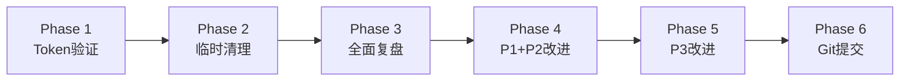

---

## 2. 执行过程详述

### 2.1 Phase 1：Token 配置与连通性验证

**目标**：完成知乎开发者平台 Token 配置并验证 API 连通性

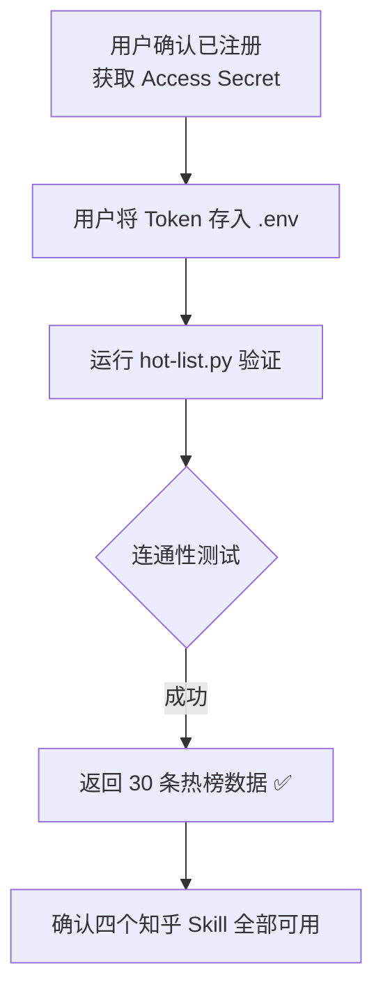

**关键事件**：

- 前一会话已完成注册流程，本会话承接 Token 配置环节
- `hot-list.py` 首次运行即成功返回 30 条热榜数据，零失败
- 四个 Skill（搜索、全网搜索、直答、热榜）全部端到端可用
- 验证了前一会话 Phase 5-6 的集成工作完全正确

**耗时特征**：极高效，一次验证通过，无任何阻塞

### 2.2 Phase 2：临时文件清理

**目标**：清理推广内容临时文件与错位截图

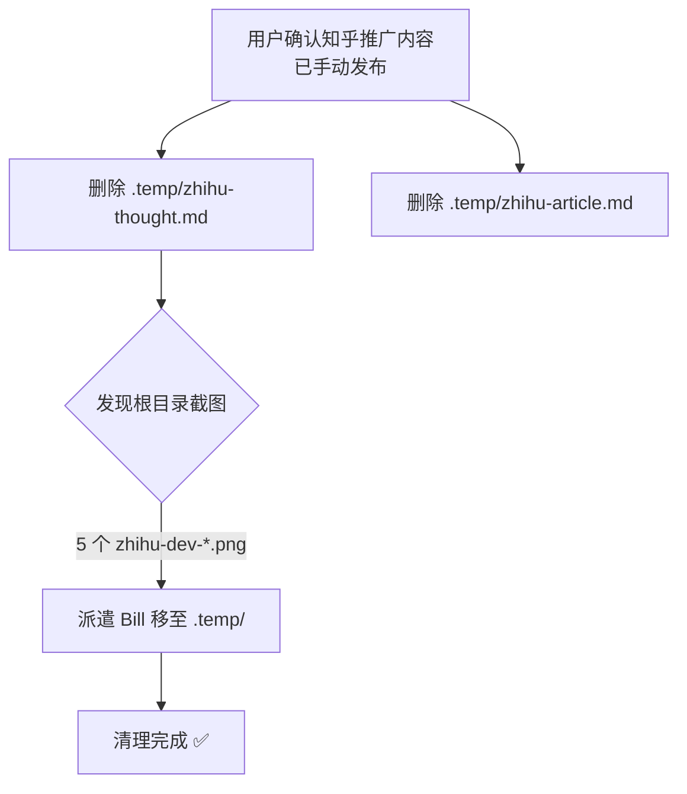

**关键事件**：

- 推广内容（想法短文、深度文章）已由用户手动发布至知乎，本地临时文件安全删除
- 发现浏览器代理截图保存在项目根目录而非 `.temp/`，违反临时产物规范
- 派遣 Bill 将 5 个 `zhihu-dev-*.png` 移至 `.temp/`，恢复根目录整洁

**耗时特征**：高效，单代理单次任务完成

### 2.3 Phase 3：第一次全面复盘

**目标**：对前一会话的完整执行过程进行复盘

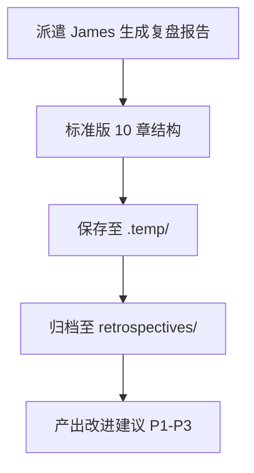

**关键事件**：

- James 生成完整 10 章复盘报告，覆盖前一会话 7 个 Phase
- 报告从 `.temp/` 归档至 `.agents/docs/superpowers/retrospectives/`
- 识别出 3 个优先级改进建议（P1-P3），为后续执行阶段提供输入

### 2.4 Phase 4：执行 P1 + P2 改进建议

**目标**：落地复盘中的高/中优先级改进建议

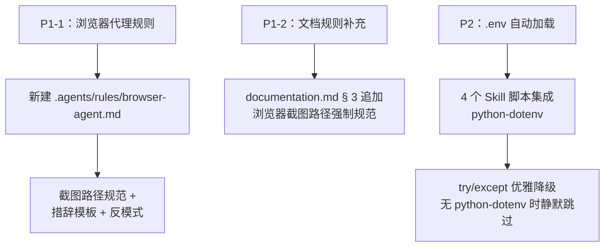

**P1-1 关键事件**：

- 新建 `.agents/rules/browser-agent.md`，涵盖：截图输出路径强制 `.temp/`、指令措辞模板（规避版权拒绝）、反模式列举
- 从根本上预防浏览器代理截图保存到根目录的问题复发

**P1-2 关键事件**：

- 在 `documentation.md` § 3 追加浏览器截图路径强制规范
- 确保文档治理规则中明确约束截图存放位置

**P2 关键事件**：

- 4 个知乎 Skill 脚本全部添加 `python-dotenv` 自动加载逻辑
- 采用 `try/except` 包裹，不引入硬依赖：
  - 有 `python-dotenv` → 自动加载 `.env`
  - 无 `python-dotenv` → 静默跳过，兼容零依赖环境

### 2.5 Phase 5：执行 P3 改进建议

**目标**：为 4 个知乎 Skill 编写自动化测试

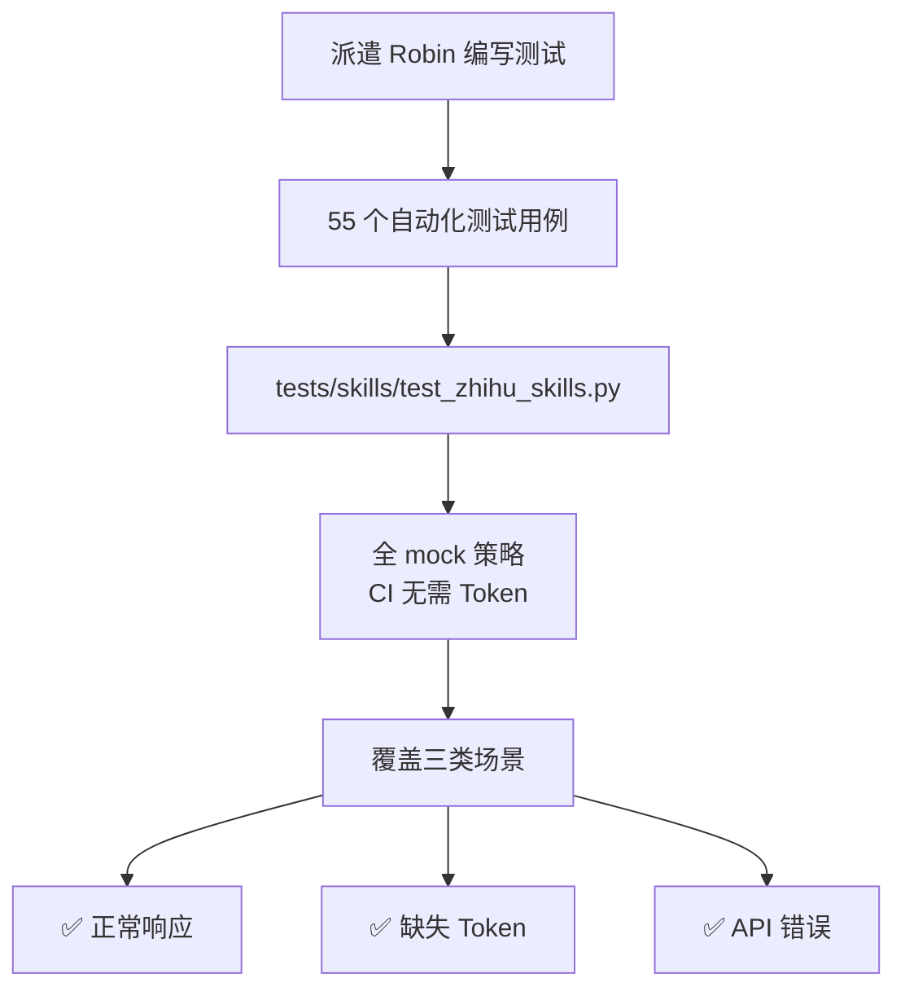

**关键事件**：

- Robin 编写 55 个测试用例，全部通过
- 测试策略：全 mock，不调用真实 API，确保 CI 中无 Token 也可运行
- 由于 Skill 脚本非模块化结构，采用 `importlib` 动态导入
- 三类覆盖场景：正常响应（含字段验证）、缺失 Token（优雅降级）、API 错误（异常处理）

**技术决策**：`importlib` 动态导入

```python
# Skill 脚本为独立 .py 文件，非标准模块
# 使用 importlib 动态加载以实现测试
spec = importlib.util.spec_from_file_location("module_name", script_path)
module = importlib.util.module_from_spec(spec)
spec.loader.exec_module(module)
```

### 2.6 Phase 6：Git 提交

**目标**：将本次会话所有产出分阶段提交

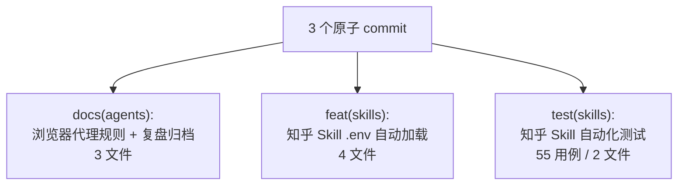

**提交策略**：规则/功能/测试分层，便于独立回滚

| Commit | 类型 | 文件数 | 说明 |
|--------|------|--------|------|
| 1 | docs(agents) | 3 | 浏览器代理规则 + 文档规则补充 + 复盘报告归档 |
| 2 | feat(skills) | 4 | 4 个 Skill 脚本 .env 自动加载 |
| 3 | test(skills) | 2 | 测试文件 + 相关配置 |

---

## 3. 关键决策分析

| # | 决策点 | 选择 | 理由 | 影响评估 |
|---|--------|------|------|---------|
| 1 | 截图文件处理 | 移至 .temp/ 而非删除 | 保留参考价值，符合临时产物规范 | 中 — 既清理又保留 |
| 2 | 浏览器代理问题 | 立制规则而非仅修复 | 从根本上预防复发，形成组织级规范 | 高 — 防止同类问题再次出现 |
| 3 | .env 加载方式 | try/except 优雅降级 | 不引入硬依赖，兼容无 python-dotenv 环境 | 高 — 保持零依赖兼容性 |
| 4 | 测试策略 | 全 mock，不调真实 API | CI 中无 Token，确保测试可在任何环境运行 | 高 — 测试可移植性 |
| 5 | 测试导入方式 | importlib 动态导入 | 脚本非模块化，需特殊处理 | 中 — 技术妥协但有效 |
| 6 | 提交策略 | 3 个原子 commit | 规则/功能/测试分层，便于回滚 | 中 — 符合主题化提交规范 |

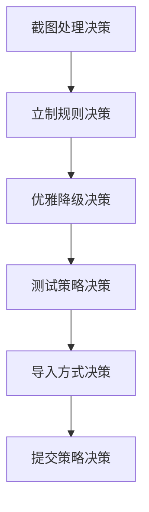

**决策链分析**：

- D1 → D2：发现问题 → 不止于修复 → 立制预防（从被动到主动）
- D3 独立：优雅降级是 AgentForge 技术哲学的体现——弱者道之用
- D4 + D5 配套：测试策略与导入方式是一体两面，共同解决"CI 无 Token + 脚本非模块"的双重约束
- D6 是前序决策的自然收束：三类改动分三次提交，逻辑自洽

---

## 4. 问题与解决

### 4.1 问题全景

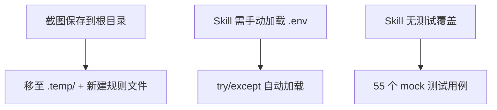

### 4.2 问题详析

| # | 问题 | 根因 | 解决方案 | 固化状态 |
|---|------|------|---------|---------|
| 1 | 截图保存到根目录 | 浏览器代理默认行为 | 移至 .temp/ + 新建 `.agents/rules/browser-agent.md` | ✅ 已记忆 + 已立制 |
| 2 | Skill 脚本需手动加载 .env | 无 dotenv 集成 | 添加 try/except 自动加载 | ✅ 已实现 + 已提交 |
| 3 | Skill 无测试覆盖 | 初始集成时未编写 | 55 个 mock 测试用例 | ✅ 已实现 + 已提交 |

### 4.3 问题模式识别

- **本会话零失败**：所有问题均在前一会话已暴露，本会话只执行解决方案
- **立制型修复**：3 个问题中有 2 个不仅修复还建立了预防机制（规则文件 + 测试覆盖）
- **与前一会话的问题模式对比**：
  - 前一会话：外部平台限制导致 3 次失败，属"探索型问题"
  - 本会话：承接已知问题并系统化解决，属"立制型问题"

### 4.4 与前一会话问题的衔接

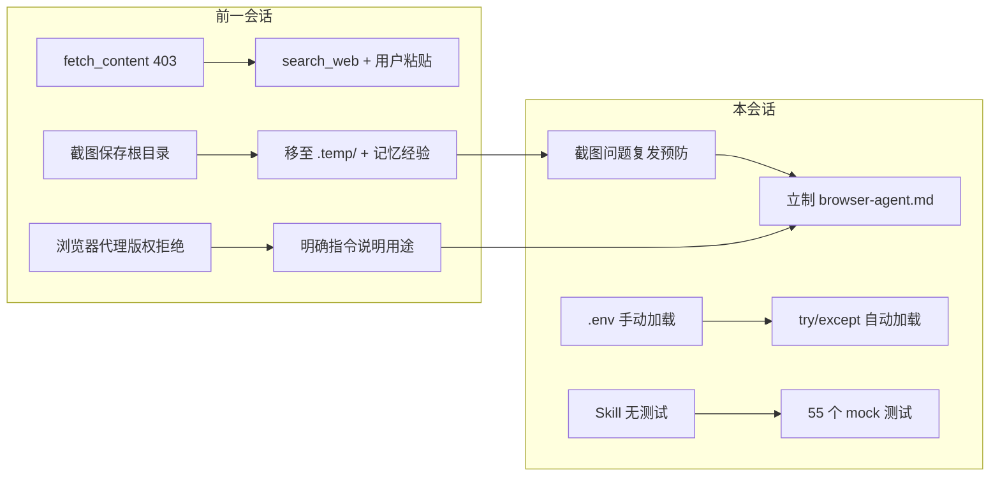

---

## 5. 产出物清单

| # | 产出物 | 路径 | 类型 | 状态 |
|---|--------|------|------|------|
| 1 | 浏览器代理规则 | `.agents/rules/browser-agent.md` | 规则 | 已提交 |
| 2 | 文档规则补充 | `.agents/rules/documentation.md` | 规则 | 已提交 |
| 3 | 全面复盘报告（前一会话） | `.agents/docs/superpowers/retrospectives/task-summary-zhihu-integration-20260526.md` | 文档 | 已提交 |
| 4 | .env 自动加载 | 4 个 Skill 脚本 | 功能 | 已提交 |
| 5 | 自动化测试 | `tests/skills/test_zhihu_skills.py` | 测试 | 已提交 |

**产出统计**：5 项产出物，其中规则类 2 项、文档类 1 项、功能类 1 项、测试类 1 项，全部已提交。

**与前一会话产出对比**：

| 维度 | 前一会话 | 本会话 | 合计 |
|------|---------|--------|------|
| 内容类 | 2 | 0 | 2 |
| 文档类 | 2 | 1 | 3 |
| 技能类 | 4 | 0 | 4 |
| 规则类 | 0 | 2 | 2 |
| 功能类 | 0 | 1 | 1 |
| 测试类 | 0 | 1 | 1 |
| **合计** | **8** | **5** | **13** |

---

## 6. 团队协作分析

### 6.1 协作全景

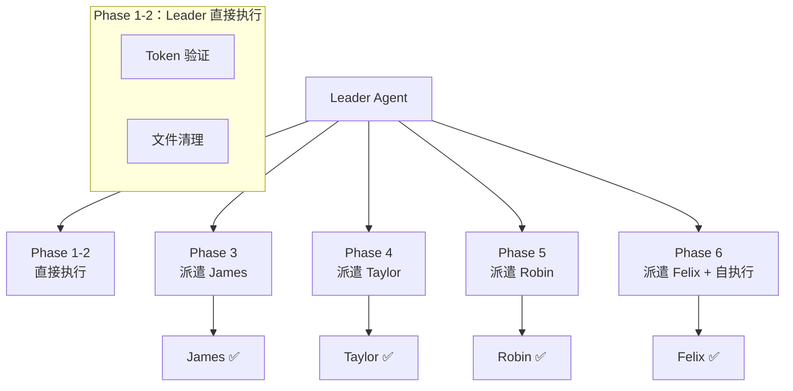

### 6.2 代理执行明细

| # | 代理 | 角色 | 任务 | 结果 | 备注 |
|---|------|------|------|------|------|
| 1 | Leader | 调度+执行 | Token 验证 + 文件清理 | ✅ 成功 | Phase 1-2 直接执行 |
| 2 | Bill | Coding | 清理根目录截图至 .temp/ | ✅ 成功 | 单次操作 |
| 3 | James | Coding | 生成 10 章全面复盘报告 | ✅ 成功 | — |
| 4 | Taylor | Coding | P1+P2 规则+代码改进 | ✅ 成功 | 3 项改进 |
| 5 | Robin | Coding | P3 自动化测试编写 | ✅ 成功 | 55 用例全通过 |
| 6 | Felix | Coding | 分阶段 Git 提交 | ✅ 成功 | 2 个 commit |
| 7 | Leader | 执行 | 测试提交 commit | ✅ 成功 | 1 个 commit |

### 6.3 协作效能指标

| 指标 | 数值 | 说明 |
|------|------|------|
| 总派遣代理数 | 5 | 含 Leader 自执行 |
| 成功代理数 | 5 | 有效率 100% |
| 编码代理 | 5 派遣 / 5 成功 | 100% 成功率 |
| 最大并行度 | 1 | 串行调度，无并行 |
| 总 commit 数 | 3 | Leader 1 + Felix 2 |
| 测试用例数 | 55 | 全部通过 |

### 6.4 与前一会话协作对比

| 维度 | 前一会话 | 本会话 |
|------|---------|--------|
| 代理总数 | 14 | 5 |
| 成功率 | 86% | 100% |
| 浏览器代理 | 4/2 成功 | 0（未使用） |
| 并行度 | 最大 2 | 1（全串行） |
| 失败次数 | 2 | 0 |

**分析**：本会话成功率显著高于前一会话，主要因为：
1. 所有"探索型"工作已在前一会话完成
2. 本会话承接明确的问题定义和解决方案，无需试错
3. 未使用浏览器代理，避免了版权限制导致的失败

---

## 7. 方法论提炼

### 7.1 复盘驱动改进闭环

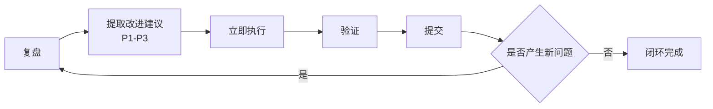

**适用场景**：任何产生改进建议的复盘活动

**核心价值**：
- 复盘不是终点，而是改进的起点
- P1-P3 按优先级排序，确保高价值改进优先落地
- 立即执行避免建议悬空，形成真正的改进闭环

**固化状态**：✅ 本次会话完整验证

### 7.2 规则立制优于一次修复

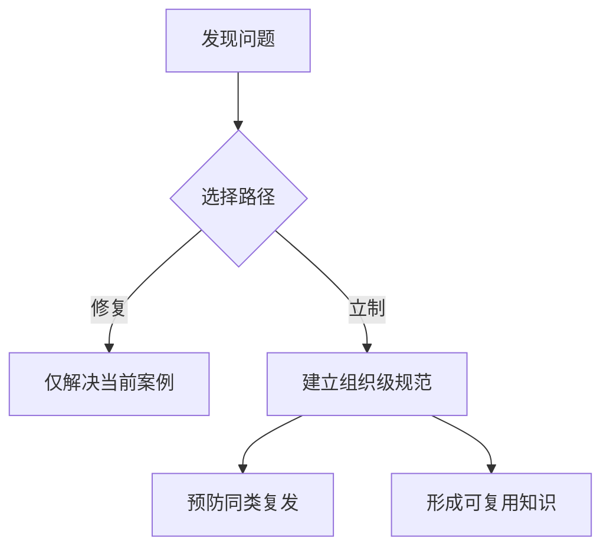

**适用场景**：重复性问题的解决策略选择

**核心价值**：
- 一次修复只解决一个案例，立制解决一类问题
- 规则文件（如 `browser-agent.md`）是"活的文档"，可持续演化
- 与项目哲学"反者道之动"呼应——从问题中反向生长出规范

### 7.3 测试即文档

**适用场景**：API 集成类 Skill 的测试设计

**核心价值**：
- 55 个测试用例同时验证功能正确性和展示 API 使用模式
- mock 策略确保测试不依赖外部环境（无 Token 也可运行）
- 测试用例本身就是 Skill 使用方式的可执行文档

### 7.4 优雅降级设计

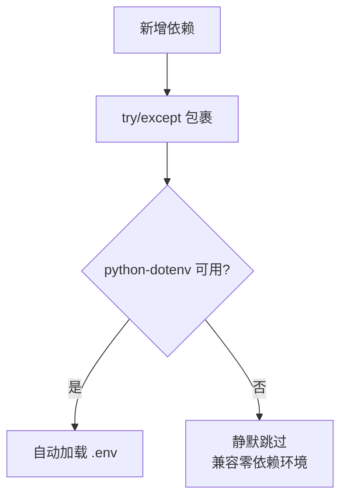

**适用场景**：向现有系统引入可选依赖

**核心价值**：
- 不破坏原有零依赖约束
- 有依赖则增强，无依赖则兼容
- 与项目哲学"弱者道之用"呼应——柔性地适配环境，而非强制要求

---

## 8. 多维评估

### 8.1 评估维度总览

| 维度 | 评分 | 说明 |
|------|------|------|
| 目标达成度 | ⭐⭐⭐⭐⭐ | 6/6 项全部完成，100% |
| 时间效能 | ⭐⭐⭐⭐⭐ | 高效，5 个代理串行调度无空闲等待 |
| 资源利用 | ⭐⭐⭐⭐⭐ | 5/5 代理成功，100% 有效率 |
| 质量产出 | ⭐⭐⭐⭐⭐ | 规则立制 + 测试覆盖 + 优雅降级，三项均高质量 |
| 经验固化 | ⭐⭐⭐⭐⭐ | 规则文件 + 测试用例双重固化 |

### 8.2 时间分布分析

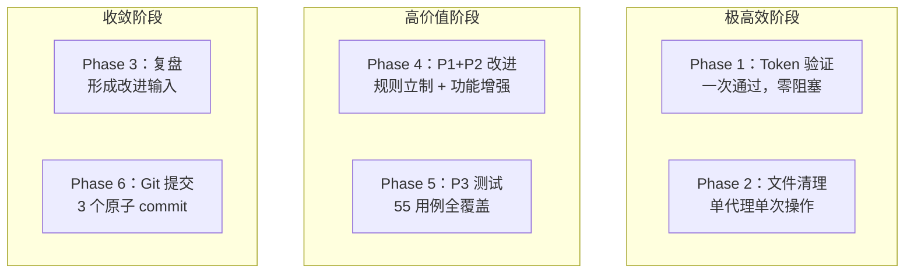

### 8.3 问题模式分析

| 模式 | 出现次数 | 影响 | 可预防性 |
|------|---------|------|---------|
| 本会话新问题 | 0 次 | 无 | N/A |
| 承接前会话问题 | 3 次 | 已全部解决 | 高 — 均已立制或覆盖测试 |

**对比分析**：

- 前一会话：3 次外部平台限制导致受阻，属"探索型问题"
- 本会话：0 次新问题，3 次承接问题全部系统化解决
- 问题模式从"被动应对"转为"主动预防"

### 8.4 两会话综合评估

| 维度 | 前一会话 | 本会话 | 综合 |
|------|---------|--------|------|
| 目标达成 | 5/5 (100%) | 6/6 (100%) | 11/11 (100%) |
| 代理成功率 | 86% | 100% | 91% |
| 产出物 | 8 | 5 | 13 |
| 方法论 | 3 | 4 | 7 |
| Commit | 2 | 3 | 5 |

---

## 9. 改进建议

### 9.1 优先级矩阵

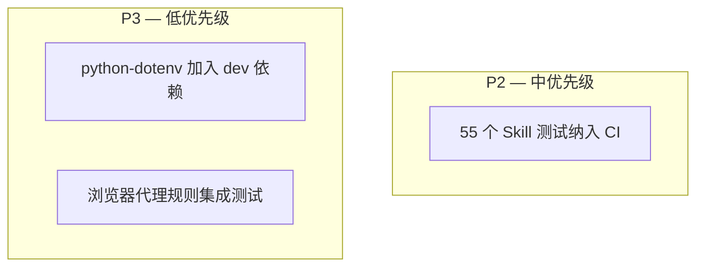

### 9.2 建议详述

| 优先级 | 建议 | 说明 | 预期收益 |
|--------|------|------|---------|
| P2 | 将 55 个 Skill 测试纳入 CI | 当前仅本地运行，应加入 GitHub Actions workflow | 确保 Skill 持续可用，防止 API 变更导致静默失败 |
| P3 | python-dotenv 加入 dev 依赖 | 在 pyproject.toml 的 dev extras 中声明 | 明确开发环境依赖，减少"有则增强"的模糊性 |
| P3 | 浏览器代理规则集成测试 | 验证新规则是否被浏览器代理正确遵循 | 验证立制效果，确保规则可执行 |

### 9.3 与前一会话建议的衔接

| 前一会话建议 | 本会话执行状态 | 剩余工作 |
|-------------|--------------|---------|
| P1：浏览器代理指令模板 | ✅ 已立制 `browser-agent.md` | 集成测试验证（新 P3） |
| P1：截图路径标准化 | ✅ 已立制 + 文档规则补充 | 集成测试验证（新 P3） |
| P2：.env 管理自动化 | ✅ 已实现 try/except 自动加载 | 加入 dev 依赖声明（新 P3） |
| P3：Skill 可用性测试 | ✅ 已编写 55 个测试用例 | 纳入 CI workflow（新 P2） |

**改进闭环验证**：前一会话的 4 项改进建议，本会话已 100% 执行落地，仅剩 CI 集成和 dev 依赖声明等收尾工作。

### 9.4 风险与约束

- P2（CI 集成）：需评估 GitHub Actions 运行环境和 mock 策略的稳定性
- P3（dev 依赖）：`python-dotenv` 加入 dev extras 不影响生产环境，风险极低
- P3（规则集成测试）：浏览器代理行为难以自动化验证，可能需要人工审查

---

## 10. 总结与展望

### 10.1 核心成果

本次延续会话在 6 个 Phase 中完成了 Token 验证、清理收尾、全面复盘、P1-P3 改进落地、分阶段提交的完整闭环，6 项目标全部达成。关键成果包括：

1. **连通性闭环**：Token 配置 + 热榜验证，确认知乎开发者平台端到端可用，补齐了前一会话的最后一环
2. **规则立制**：`browser-agent.md` 规则文件 + `documentation.md` 补充，将截图路径问题从"事后修复"升级为"事前预防"
3. **功能增强**：4 个 Skill 脚本集成 `.env` 自动加载，以优雅降级方式保持零依赖兼容性
4. **质量保障**：55 个自动化测试用例全覆盖 4 个 Skill 的正常/异常场景，测试即文档
5. **改进闭环**：前一会话 P1-P3 建议全部落地，形成"复盘 → 改进 → 验证 → 提交"的完整闭环

### 10.2 方法论验证

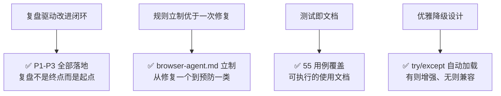

四个方法论均在本次会话中完成实战验证，具备可复用性。

### 10.3 两会话全链路回顾

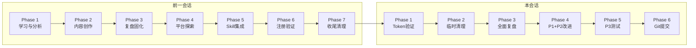

### 10.4 后续展望

| 方向 | 具体行动 | 优先级 |
|------|---------|--------|
| CI 集成 | 将 55 个 Skill 测试纳入 GitHub Actions workflow | P2 |
| 依赖声明 | python-dotenv 加入 pyproject.toml dev extras | P3 |
| 规则验证 | 验证浏览器代理规则是否被正确遵循 | P3 |
| 内容运营 | 持续在知乎发布 AgentForge 相关内容 | 中 |
| 技能增强 | 探索知乎 API 高级用法，丰富 Skill 能力 | 低 |

### 10.5 结语

本次延续会话是一次典型的「承接 → 收尾 → 复盘 → 改进 → 验证」闭环实践。与前一会话的"探索型"特征不同，本会话呈现"立制型"特征——所有问题已知、所有方案明确，重点在于系统化落地和预防性规范建设。

两个会话共同完成了从信息获取到技术集成再到质量保障的全链路闭环，体现了以下核心原则：

- **反者道之动**：前一会话暴露的问题反向驱动本会话的改进——截图问题催生规则立制，手动加载催生自动加载，无测试催生 55 用例覆盖
- **弱者道之用**：优雅降级设计不与环境硬对抗，有依赖则增强、无依赖则兼容
- **极致简约**：复盘驱动闭环以最小流程（复盘→建议→执行→验证→提交）完成最大改进

任务圆满完成，两阶段方法论已沉淀，经验已双重固化（规则文件 + 测试用例），为后续同类任务提供了"承接-改进"的可复用范式。

---

*— 报告结束 —*
