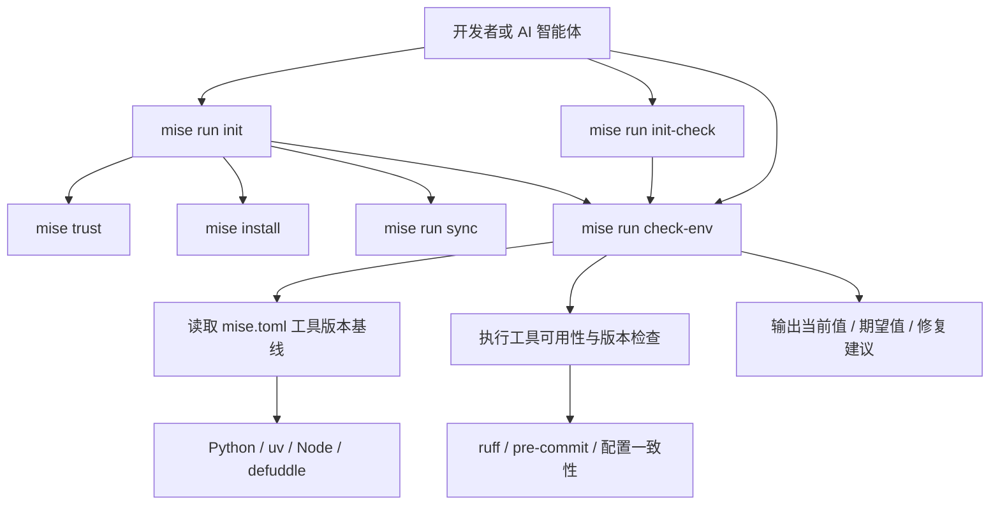

# mise 战略底座单一事实来源加固设计

**日期**：2026-05-23
**状态**：待评审
**场景来源**：`adopt-mise-dev-environment` 二次收口
**推荐路线**：方案 B：单一事实来源路线

---

## 1. 背景

AgentForge 已经完成以 `mise` 作为开发环境战略底座的主体建设：根目录存在 `mise.toml`，README、AGENTS 与多份 docs 文档均已切换到 `mise` 优先的环境入口，CI 主路径也基本使用 `mise install` 与 `mise run`。

当前阶段不再是“引入 mise”，而是进入“加固 mise 作为唯一工具版本基线”的二次收口阶段。现有实现仍存在少量入口残留和版本声明重复，可能削弱新开发者与 AI 智能体对环境主路径的判断。

本设计以“大道至简”为约束，目标是减少入口分叉、减少版本重复声明，并让环境校验形成可诊断、可修复的闭环。

---

## 2. 设计目标

1. 确认 `mise run check-env` 与 `mise run init-check` 在当前仓库中可运行、可诊断、可给出明确修复建议。
2. 将当前推荐入口统一收敛为：
   - `mise run init`
   - `mise run init-check`
   - `mise run check-env`
3. 消除运行提示中的历史入口漂移，避免将 `scripts/init.ps1` 作为当前主路径。
4. 让 `.agents/scripts/check_env.py` 尽量从 `mise.toml` 读取工具期望版本，减少 `python`、`uv`、`node`、`npm:defuddle` 等版本号重复维护。
5. 保持 `uv` 作为 Python 依赖层入口，保持 `mise` 作为工具层与任务层入口。

---

## 3. 非目标

1. 不重新设计整个开发环境体系。
2. 不升级 Python、Node、uv、ruff、pre-commit 或 defuddle 的版本。
3. 不重写 CI/CD 全链路；CI 只在必要时做口径检查或轻量修正。
4. 不删除历史复盘文档中的事实记录，只在当前态文档或新设计中澄清推荐入口。
5. 不引入 conda、pipx 或直接 pip 安装作为项目依赖安装方式。

---

## 4. 哲学到工程映射

| 哲学原则 | 工程解释 | 本场景落点 |
|---|---|---|
| 大道至简 | 单一入口、单一版本基线、减少重复声明 | `mise.toml` 作为工具层版本基准；统一 `mise run <task>` |
| 反者道之动 | 出错后可回退、可诊断、可修复 | `check-env` 输出当前值、期望值和修复建议 |
| 弱者道之用 | 低侵入、低门槛、兼容现有工作流 | 不重构全链路，只收口关键入口与校验脚本 |

---

## 5. 当前问题

### 5.1 环境校验脚本存在潜在运行风险

`.agents/scripts/check_env.py` 中使用了 `Path`，但文件头部需要确认是否导入 `pathlib.Path`。若缺失，`mise run check-env` 会在执行配置一致性检查时失败。

### 5.2 修复提示仍残留历史入口

环境校验脚本中 `mise` 缺失时的修复提示仍可能指向 `scripts/init.ps1`。当前推荐入口已经是 `mise run init`，旧提示会造成认知分叉。

### 5.3 工具版本存在重复声明

`mise.toml` 与 `check_env.py` 同时保存部分工具期望版本，例如 Python、uv、Node、defuddle。长期看，版本升级时可能出现一处修改、一处遗漏的问题。

### 5.4 当前态与历史态需要明确边界

早期 `adopt-mise-dev-environment` 文档中存在以 PowerShell 初始化脚本为主路径的历史描述；后续已经迁移到 `tasks.py` + `mise run init`。当前阶段应明确“历史事实”和“当前推荐入口”的区别。

---

## 6. 目标架构



---

## 7. 设计方案

### 7.1 入口收口

当前主路径固定为：

```bash
mise run init
mise run init-check
mise run check-env
```

所有当前态错误提示、README 入口、AGENTS 环境说明、docs 快速开始说明均应围绕这三个命令表达。`scripts/init.ps1` 如仍存在，只能作为历史兼容入口，不应出现在当前推荐路径中。

### 7.2 环境校验脚本加固

`.agents/scripts/check_env.py` 应满足：

1. 能在当前 Python 环境下直接执行。
2. 缺失 `mise` 时输出清晰的安装与重试建议。
3. 缺失或版本不符时输出：工具名、当前值、期望值、修复命令。
4. 配置一致性检查不因导入缺失或路径解析失败而中断。

### 7.3 版本来源收口

工具层版本应优先从 `mise.toml` 解析：

| 工具 | 期望版本来源 | 说明 |
|---|---|---|
| python | `mise.toml` `[tools].python` | 精确版本基线 |
| uv | `mise.toml` `[tools].uv` | 精确版本基线 |
| node | `mise.toml` `[tools].node.version` | 兼容对象形式 |
| defuddle | `mise.toml` `[tools]."npm:defuddle".version` | 兼容 npm 工具声明 |
| ruff | Python 依赖层 | 可继续通过 `uv run ruff --version` 校验 |
| pre-commit | Python 依赖层 | 可继续通过 `uv run pre-commit --version` 校验 |

若暂不解析 `uv.lock`，`ruff` 与 `pre-commit` 的期望版本可保留在脚本中，但应明确它们属于 Python 依赖层，而非 mise 工具层。

### 7.4 文档口径收口

文档更新范围应保持克制：

1. 当前态入口文档只保留 `mise run init`、`mise run init-check`、`mise run check-env`。
2. 历史复盘文档不强行改写，只在必要的新文档中说明历史入口已被新入口替代。
3. 不扩大到全量 CI/CD 治理，避免本场景范围失控。

---

## 8. 验收标准

1. `mise run check-env` 可以运行，并输出结构化环境检查结果。
2. `mise run init-check` 可以调用环境校验链路。
3. `check_env.py` 不再因 `Path` 导入、路径解析或配置一致性检查而失败。
4. `check_env.py` 中面向当前用户的修复提示不再推荐 `scripts/init.ps1` 作为主路径。
5. Python、uv、Node、defuddle 的期望版本优先由 `mise.toml` 提供。
6. `README.md`、`AGENTS.md` 与关键 docs 中的当前推荐入口保持一致。
7. 不引入 `conda`、`pipx` 或直接 `pip install` 作为项目依赖安装路径。

---

## 9. 测试与验证

建议执行以下验证：

```bash
mise run check-env
mise run init-check
mise run lint
```

若本地环境暂不具备完整工具链，应至少执行脚本级别的 Python 语法与导入校验，并记录无法完成完整验证的原因。

---

## 10. 风险与边界

| 风险 | 影响 | 缓解 |
|---|---|---|
| `mise.toml` TOML 解析兼容性不足 | 无法稳定读取对象形式工具声明 | 使用 Python 3.11+ 标准库 `tomllib`，并兼容字符串与对象两种写法 |
| 本地未安装 mise | 无法完成端到端验证 | 脚本需给出明确安装和重试建议 |
| 版本期望来源迁移过度 | 引入复杂解析逻辑 | 只迁移工具层版本，Python 依赖层暂保守处理 |
| CI/CD 范围扩散 | 当前场景过大 | 仅做必要口径检查，不做全链路治理 |

---

## 11. 实施边界建议

本场景建议拆为 4 个实施任务：

1. 修复并验证环境校验脚本基础可运行性。
2. 从 `mise.toml` 读取工具层期望版本。
3. 收口历史入口提示与关键文档口径。
4. 运行验证命令并记录结果。

---

## 12. 用户评审点

请重点确认：

1. 是否认可 `mise.toml` 作为工具层版本单一事实来源。
2. 是否认可 `scripts/init.ps1` 不再作为当前推荐入口。
3. 是否认可本轮不扩大到完整 CI/CD 治理，只聚焦环境底座加固。
