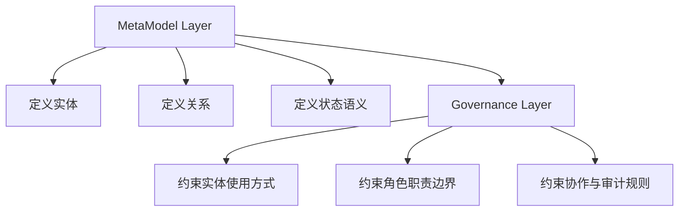
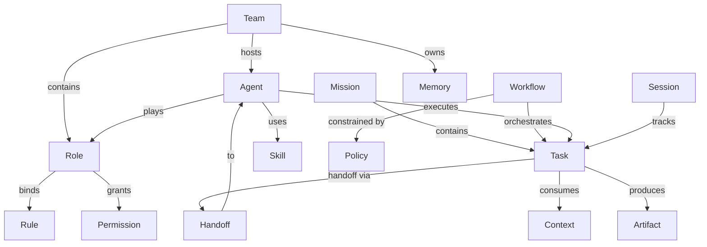

# Agent Collaboration Metamodel Design

## Goal

为 `AgentForge` 增加一套面向多 team、多角色、多智能体协作的统一语义内核设计稿，用于在不提前绑定配置格式、运行时引擎或具体平台实现的前提下，先定义稳定、可迁移、可复用的协作元模型。

本次设计目标如下：

- 定义 `MetaModel Layer + Governance Layer` 的双层结构
- 同时覆盖组织、任务、知识三类关系，并补齐治理与运行态语义边界
- 为 `Team`、`Role`、`Agent`、`Mission`、`Task`、`Workflow`、`Memory` 等核心实体建立统一关系模型
- 将当前 `AGENTS.md`、`.agents/`、`.trae/` 等既有结构映射到协作元模型中
- 为后续配置驱动、运行时编排、权限治理和审计能力预留清晰边界

## Background

当前仓库已经具备较好的 AI 协作基础：

- `AGENTS.md` 已作为智能体全局契约入口存在
- `.agents/rules/` 已承载高频执行规则
- `.agents/workflows/` 已承载流程化任务说明
- `.agents/skills/` 已承载能力资产
- `.agents/docs/` 已承载 AI 知识库与长期沉淀
- `.trae/` 已承载任务执行期工作台

这些结构已经说明，项目并不缺少规则、工作流、技能和知识的容器；真正缺少的是一套上位的协作语义模型，去回答以下问题：

- 一个 `Team`、`Role`、`Agent` 在本项目中的语义差异是什么
- 多个智能体围绕同一目标协作时，任务、交接、知识和规则如何建立统一关系
- 当前仓库中的规则、工作流、技能、文档和工作台分别处于协作模型的哪一层
- 项目如何在不被当前实现细节绑死的情况下，向未来的配置层与运行时层演进

因此，本次设计的重点不应是先实现多智能体运行时，而应先补上一套稳定的“协作语义内核”。

## Scope

- 定义协作元模型的双层结构
- 定义 5 个领域的职责边界
- 定义首版核心实体、关键关系、状态语义与命名边界
- 定义强约束与弱约束
- 定义当前仓库目录与协作元模型的映射关系
- 规划首版最小落地顺序与非目标边界

## Non-Goals

- 本次不实现多智能体运行时编排器
- 本次不引入新的配置文件格式或实例化 DSL
- 本次不实现权限引擎、审批系统或审计后端
- 本次不修改 `src/taolib/` 以承载运行时代码
- 本次不大规模重写现有规则、工作流、技能和知识目录
- 本次不把抽象概念直接收敛为某个单一模型厂商或单一 agent 平台接口

## Design Principles

1. 语义优先：先固化协作概念与边界，再考虑配置与运行时。
2. 双层分离：明确区分“是什么”与“应该怎么做”，避免术语与治理混写。
3. 完整优先：首版使用完整元模型，而不是仅保留最小词表。
4. 可迁移优先：不让概念依赖当前目录实现、具体工具或单一平台。
5. 映射优先：新增模型必须能够解释当前仓库结构，而不是另起一套平行体系。
6. 极简落地：第一版只补语义层与映射层，不提前把实现做重。

## Options Considered

### Option A: 契约内嵌型

结构：

- 直接在 `AGENTS.md`、`.agents/rules/` 和部分文档中分散加入多 team、多角色、多智能体术语
- 不单独抽出元模型层

优点：

- 变更小
- 落地快
- 对当前结构侵入低

缺点：

- 概念分散，难形成统一抽象
- 不利于跨项目迁移
- 后续配置层和运行时层难以复用稳定语义

### Option B: 元模型中心型

结构：

- 先定义独立的协作元模型
- 再将现有 `AGENTS`、规则、工作流、技能、知识与工作台映射到该模型

优点：

- 语义统一
- 边界清晰
- 最适合跨项目迁移和后续分层演进

缺点：

- 首版设计工作更重
- 需要先完成概念边界梳理

### Option C: 运行时先行型

结构：

- 先面向多智能体任务编排设计执行流
- 再从运行时反推协作概念

优点：

- 更贴近真实协作执行
- 对编排型能力有直接指导作用

缺点：

- 容易被当前实现细节牵引
- 元模型通用性最差
- 容易过早做重

## Recommendation

采用 Option B。

推荐原因如下：

- 目标是“统一框架”，而不是只补一组术语
- 首版优先服务“规范表达”，而不是运行时落地
- 需要同时覆盖组织、任务、知识三类关系，且保留治理层
- 明确要求可迁移、可复用，因此需要一个不依赖当前实现的稳定语义中心

## Architecture Layers

推荐将协作语义内核分为两层：

1. `MetaModel Layer`
2. `Governance Layer`

对应关系如下：

- `MetaModel Layer`：定义实体、关系、状态语义与边界语义
- `Governance Layer`：定义约束、职责边界、推荐路径、禁止事项和审计要求

主图如下：

### MetaModel Layer

该层回答以下问题：

- 世界里有哪些实体
- 实体之间允许建立什么关系
- 各类状态对象的最小语义是什么
- 概念之间的边界如何区分

例如：

- `Team` 是治理边界，不是聊天群组
- `Role` 是职责模板，不是权限集合的别名
- `Agent` 是执行主体，不等于某个具体模型实例
- `Workflow` 是协作协议，不是脚本文件路径
- `Memory` 是长期可复用知识，不等于上下文窗口
- `Context` 是任务执行时的工作集

### Governance Layer

该层回答以下问题：

- 哪些关系是必须的
- 哪些路径是推荐的
- 哪些行为是禁止的
- 关键动作如何被追踪与审计

例如：

- `Agent` 必须通过 `Role` 进入规范性协作体系
- 跨 team 协作推荐通过显式 `Handoff`
- 高权限能力不能绕开角色与规则体系直接使用
- 关键任务应记录角色来源、交接链路、产物归档与规则依据

## Domains

推荐将第一版元模型划分为 5 个领域：

1. `Organization`
2. `Execution`
3. `Knowledge`
4. `Governance`
5. `Runtime State`

### Organization

- 负责组织边界、成员关系与职责模板
- 核心实体：`Team`、`Role`、`Agent`

### Execution

- 负责目标容器、任务分派、流程编排与交接语义
- 核心实体：`Mission`、`Task`、`Workflow`、`Handoff`

### Knowledge

- 负责规则、能力、记忆、上下文和产物等知识与能力资产
- 核心实体：`Memory`、`Context`、`Rule`、`Skill`、`Artifact`

### Governance

- 负责权限、策略、约束与治理边界
- 核心实体：`Policy`、`Permission`

### Runtime State

- 负责运行态会话与最小状态壳
- 核心实体：`Session`

## Core Entities

首版收敛为 15 个核心实体：

- `Team`
- `Role`
- `Agent`
- `Mission`
- `Task`
- `Workflow`
- `Handoff`
- `Memory`
- `Context`
- `Rule`
- `Skill`
- `Artifact`
- `Policy`
- `Permission`
- `Session`

推荐说明如下：

- `Mission` 表示一个可分解的协作目标，可承载多个 `Task`
- `Task` 是最小可分派工作单元
- `Workflow` 是任务协作协议，不等于任务本身
- `Handoff` 是显式交接对象，不应隐藏在流程描述文字中
- `Memory / Context / Rule / Skill / Artifact` 共同构成知识与能力层
- `Policy / Permission` 用于将治理规则从领域对象中分离
- `Session` 是运行时最小状态壳，为后续事件流和快照保留接口

## Relationship Model

推荐将关系分为 4 类：

- 归属关系
- 扮演关系
- 执行关系
- 挂载关系

主图如下：

### Organization Relations

- `Team contains Role`
- `Team hosts Agent`
- `Agent plays Role`

说明：

- 一个 `Agent` 可以扮演多个 `Role`
- 在单个 `Session` 中，建议为一个 `Agent` 指定主角色

### Execution Relations

- `Mission contains Task`
- `Workflow orchestrates Task`
- `Agent executes Task`
- `Task handoff via Handoff`

说明：

- `Workflow` 不是 `Task` 的父容器，而是围绕任务的协作协议
- `Review` 首版不作为一级实体，先作为 `Task` 或 `Workflow` 的动作语义存在

### Knowledge Relations

- `Rule` 可以绑定到 `Team`、`Role`、`Workflow`
- `Skill` 可以绑定到 `Role`、`Agent`
- `Memory` 可以属于 `Team`、`Agent`、`Mission`
- `Context` 是任务执行时被消费的知识切片
- `Artifact` 是任务输出物，也是知识回流和审计输入

## Constraints

### Hard Constraints

- `Agent` 不能脱离 `Role` 直接进入规范性协作体系
- `Task` 必须归属于某个 `Mission` 或更高层目标容器
- `Workflow` 不拥有知识，只编排执行；知识通过 `Context`、`Rule`、`Memory`、`Skill` 注入
- `Permission` 不直接赋给 `Task`，而应赋给 `Role` 或 `Agent`
- `Handoff` 必须是显式对象，至少包含来源、目标、交接内容和状态

### Soft Constraints

- `Team` 是否必须拥有多个 `Role` 可由具体项目裁剪
- `Agent` 是否允许跨 `Team` 协作由治理层决定
- `Memory` 是否持久化及如何检索属于实现层
- `Skill` 是工具能力还是复合工作流单元，首版不强制限定实现形态

## State Semantics

首版仅定义最小状态语义，不绑定具体引擎实现。

### Task State

推荐最小状态集合：

- `draft`
- `ready`
- `in_progress`
- `handoff_pending`
- `blocked`
- `done`

### Handoff State

推荐最小状态集合：

- `prepared`
- `offered`
- `accepted`
- `rejected`
- `completed`

### Session State

推荐最小状态语义：

- 标识当前协作上下文
- 追踪参与主体、当前任务、活动角色和上下文工作集
- 为未来事件流、快照恢复和审计回放预留接口

## Directory Mapping

第一版不新造平行体系，而是用元模型去解释现有结构。

| 当前位置 | 协作模型定位 | 说明 |
|---|---|---|
| `AGENTS.md` | `Governance Layer` 总入口 | 承载全局治理契约、任务路由与协作边界。 |
| `.agents/rules/` | `Governance Layer` 规则实现 | 承载对 `Role`、`Workflow`、知识访问等对象的约束。 |
| `.agents/workflows/` | `Execution` 域中的协作协议实例 | 承载围绕任务执行的流程化编排说明。 |
| `.agents/skills/` | `Knowledge` 域中的能力资产 | 承载可被 `Role` 或 `Agent` 使用的能力单元。 |
| `.agents/docs/` | `Knowledge` 域中的长期知识层 | 承载规则、参考、洞见、spec、复盘等知识资产。 |
| `.trae/` | `Runtime State` 的任务期工作台 | 承载 `Session`、草稿、执行中上下文与临时产物。 |

## Semantic Directories Evolution

在当前映射层稳定之后，可以考虑为协作元模型增加一组“语义实例目录”，让部分核心实体拥有更直接的承载位置。

推荐候选如下：

| 候选目录 | 主要对应实体 | 建议定位 |
|---|---|---|
| `.agents/roles/` | `Role` | 职责模板、权限边界、默认规则绑定。 |
| `.agents/teams/` | `Team` | 团队边界、成员关系、默认治理策略。 |
| `.agents/agents/` | `Agent` | 执行主体画像、能力组合、角色扮演关系。 |
| `.agents/policies/` | `Policy` | 治理策略、协作限制、升级与审计规则。 |
| `.agents/workflows/` | `Workflow` | 协作协议实例，保持沿用当前目录。 |

### Recommendation for Phaseing

推荐采用“先角色、后团队、再主体”的引入顺序：

1. 优先考虑 `.agents/roles/`
   因为 `Role` 是 `Agent` 进入规范性协作体系的关键桥梁，也是规则、权限、技能绑定的最佳聚合点。
2. 再考虑 `.agents/teams/`
   因为 `Team` 更偏治理边界与组织容器，应建立在 `Role` 的稳定语义之上。
3. 最后考虑 `.agents/agents/`
   因为 `Agent` 最容易与具体实现、模型厂商或运行时形态耦合，适合在前两者稳定后再落目录。

### Guardrails

- 这些目录属于协作模型的“实例层承载”，不是元模型定义本身
- 第一版即使不创建这些目录，元模型依然成立
- 一旦引入，目录内文件应优先保存声明式语义，而不是执行日志或临时上下文
- `roles/` 应优先承载职责模板和约束绑定，不应退化为杂项提示词仓库
- `agents/` 不应直接等同于某个模型提供商配置集合

## First-Phase Adoption Plan

推荐采用最小落地顺序：

1. 先定义元模型：形成正式参考 spec，固化实体、关系、边界和状态语义。
2. 再定义治理映射：明确现有入口文件和目录分别位于哪一层、对应哪些实体。
3. 最后收敛入口：只在少量关键入口文件补充协作语义导航，不大规模调整目录结构。
4. 如需增强实例承载，再受控引入 `.agents/roles/` 等语义目录，从 `Role` 开始试点。

## Planned Touchpoints

第一版建议影响以下入口：

- `AGENTS.md`
- `.agents/README.md`
- `.agents/docs/references/`
- 可选的 `.agents/roles/`

说明：

- `AGENTS.md` 适合补充协作语义入口和治理总览
- `.agents/README.md` 适合补充目录与元模型的语义映射
- `.agents/docs/references/` 适合作为后续稳定参考页的长期承载位置
- `.agents/roles/` 适合作为后续首个语义实例目录试点，但不应在第一版中成为硬依赖

## Explicit Non-Goals for Phase 1

第一版明确不做：

- 多智能体运行时调度器
- 配置驱动实例化规范
- 权限引擎和审批流实现
- 跨 team 状态同步机制
- 对现有规则体系的大规模重写
- 一次性引入完整的 `teams/`、`roles/`、`agents/`、`policies/` 目录矩阵

## Acceptance Criteria

- 存在一份可独立阅读的协作元模型设计稿
- 设计稿明确区分 `MetaModel Layer` 与 `Governance Layer`
- 设计稿明确 5 个领域与 15 个核心实体
- 设计稿明确关键关系、强约束、弱约束和最小状态语义
- 设计稿明确当前项目主要目录在协作模型中的映射位置
- 设计稿明确第一版做什么、不做什么，以及推荐落地顺序

## Risks

- 如果后续直接进入运行时实现而不先补治理映射，元模型会重新退化为术语表
- 如果把 `Role`、`Permission`、`Rule` 混用，治理层会快速失去边界
- 如果把 `Workflow` 设计成知识容器，会造成执行层与知识层耦合
- 如果在第一版就绑定具体配置格式，可能削弱跨项目迁移能力

## Open Questions Deferred

以下问题被明确延后到后续阶段：

- 配置层的实例化语法采用什么格式
- 运行时协作是否采用事件驱动或状态机实现
- 跨 team 的权限继承与冲突解析如何落地
- `Artifact` 与长期知识回流之间的自动化机制如何实现
- `Session` 是否需要拆分为事件、快照和恢复三个对象
