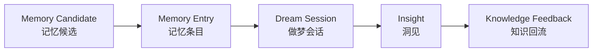
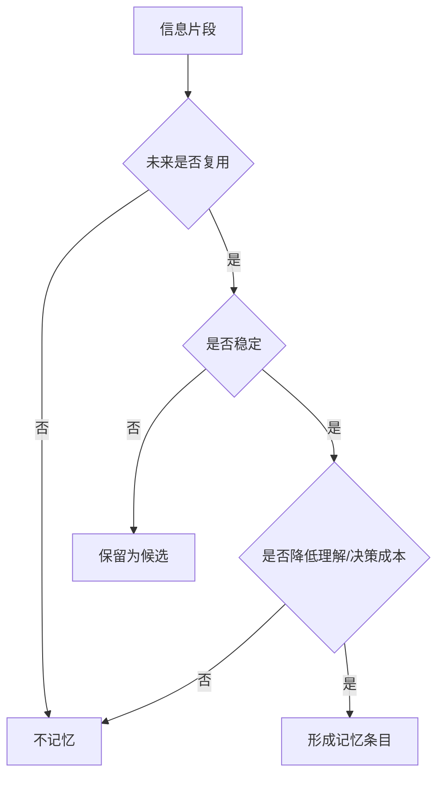
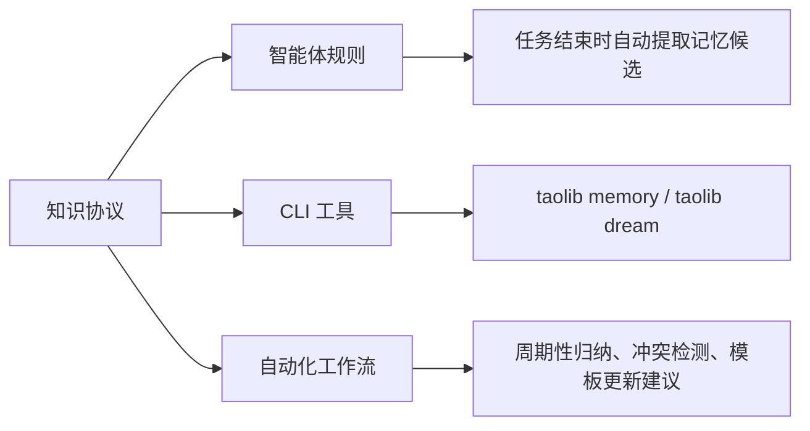

# Agent Memory Dream Protocol Design

## Goal

为 AgentForge 增加“记忆、做梦”的概念性功能。首版定位为知识协议层能力，用于定义什么值得记忆、何时做梦、梦见什么才算洞见、洞见如何回流、什么应该遗忘。

本次设计目标如下：

- 定义 `记忆 -> 做梦 -> 洞见 -> 回流 -> 遗忘` 的最小认知循环
- 将记忆从“保存上下文”收敛为“保存未来能降低理解成本或决策成本的稳定知识”
- 将做梦从“随机发散”收敛为“对多条记忆进行非线性重组并发现隐藏模式”
- 明确首版只做知识协议，不进入运行时代码、CLI、数据库或后台自动化
- 为后续智能体规则、CLI 工具和自动化工作流预留边界

核心心法：

> 记忆负责“存真”，做梦负责“通变”，洞见负责“落地”，遗忘负责“归简”。

## Background

AgentForge 已经具备较完整的 AI 知识资产体系：

- `AGENTS.md` 定义了智能体全局契约与哲学底座
- `.agents/docs/references/knowledge-driven-exploration-protocol.md` 定义了知识驱动探索协议
- `.agents/docs/templates/` 已承载可复用模板
- `.agents/docs/superpowers/specs/` 与 `.agents/docs/superpowers/retrospectives/` 已承载长期设计与复盘档案
- `.trae/` 已作为任务执行期工作台存在

这些基础已经能承载“探索如何形成知识”，但还缺少一套更细的认知协议来回答：哪些信息应该被记住，记忆积累后如何被重新组合，组合产生的洞见如何改变项目规则、模板或参考页，以及哪些信息应该被遗忘。

因此，本次功能不应先实现为工具或数据库，而应先定义一套稳定、低摩擦、可回流的知识协议。

## Scope

本次覆盖：

- 定义记忆、做梦、洞见、遗忘四个核心概念
- 定义记忆候选、记忆条目、做梦会话、知识回流的流转关系
- 定义记忆候选与做梦会话的触发条件
- 定义洞见合格标准与回流位置
- 定义首版文档产物和验收标准

## Non-Goals

首版明确不做：

- 不保存所有聊天记录
- 不建立数据库或向量检索
- 不实现 CLI 命令
- 不修改 `src/taolib/`
- 不自动修改规则文件
- 不把当前任务待办当长期记忆
- 不引入后台任务、定时器或外部服务
- 不把做梦变成无限发散创意

## Design Principles

1. 极简优先：先固化最小协议，再决定是否工具化。
2. 存真优先：记忆只保存稳定、可复用、能降低未来成本的知识。
3. 通变优先：做梦用于发现关系、张力、重复模式和演化方向。
4. 回流优先：洞见必须能进入规则、模板、参考页或复盘档案。
5. 遗忘优先：长期知识必须允许合并、降级、删除和过期。

## Options Considered

### Option A: 最小知识协议型

结构：

- 仅定义概念、字段、触发条件、回流位置与模板
- 不修改代码和全局规则

优点：

- 最低侵入
- 与现有 `.agents/` 知识资产结构最兼容
- 能最快形成可复用认知协议

缺点：

- 首版依赖执行纪律
- 不提供自动化能力

### Option B: 规则增强型

结构：

- 主要修改 `AGENTS.md` 或 `.agents/rules/`
- 让智能体在任务后自动判断是否沉淀记忆或触发做梦

优点：

- 能直接影响日常协作行为
- 与任务闭环结合紧密

缺点：

- 如果协议尚未稳定，容易让全局规则变重
- 容易把概念能力写成抽象口号

### Option C: 协议加轻工作流型

结构：

- 以知识协议为主体
- 预留一条最小做梦循环
- 不实现自动化，但清楚定义后续工具化边界

优点：

- 既保持首版轻量，又能回答如何落地
- 能自然衔接后续规则、CLI 和自动化工作流
- 最符合当前项目“知识驱动探索”方向

缺点：

- 需要清晰区分协议、模板和未来执行机制

## Recommendation

采用 Option C 的克制版。

首版只创建一份设计 spec、一份参考协议页、一份记忆条目模板、一份做梦会话模板。不修改 `src/taolib/`，不修改 `AGENTS.md`，不修改 `.agents/rules/`。

## Concept Model



### Memory Candidate

记忆候选是从任务、设计、复盘、问题修复、探索过程中提取出的潜在长期知识。

它不直接进入长期资产，必须先判断：

- 是否稳定
- 是否可复用
- 是否能降低未来理解成本或决策成本
- 是否不是单纯的任务进度、临时路径或调试噪音

### Memory Entry

记忆条目是经过筛选后的长期知识单元。

建议字段：

```text
标题：
类型：事实 / 原则 / 经验 / 约束 / 反例
适用范围：
内容：
来源：
过期条件：
回流建议：
```

### Dream Session

做梦会话是对多条记忆进行非线性重组，发现隐藏模式、矛盾、缺失、遗忘点和演化方向的结构化动作。

做梦不是随机发散，也不是普通总结。它必须以记忆为输入，以洞见候选、遗忘建议或回流建议为输出。

### Insight

洞见是做梦之后产生的可判断、可验证、可回流结论。

合格洞见至少具备一种特征：

- 发现重复模式
- 发现规则或模板冲突
- 发现缺失机制
- 发现可复用结构
- 发现可删除、合并、降级的信息
- 发现下一步演化方向

### Forgetting

遗忘是主动处理过时、重复、临时、低复用价值信息的机制。

遗忘并不只等于删除，也可以是：

- 合并重复记忆
- 降级为复盘附录
- 标记过期条件
- 将临时经验留在任务工作台而非长期资产

## Trigger Mechanism

### Memory Candidate Trigger

适合提取记忆候选的场景：

- 完成一次设计 spec
- 完成一次实施计划
- 完成一次问题修复并发现复用经验
- 完成一次复盘并得到稳定教训
- 用户明确表达长期偏好或项目原则

不适合提取记忆的场景：

- 当前任务进度
- 一次性路径
- 临时命令输出
- 调试噪音
- 未验证猜测

判断流：



### Dream Trigger

适合触发做梦的场景：

- 同一主题积累多条记忆
- 多次复盘出现相似问题
- 不同规则、模板或经验之间出现张力
- 项目准备进入新阶段
- 用户明确提出“做梦、归纳、找隐藏模式、提炼下一步、看看哪些规则可以删掉或合并”

## Knowledge Feedback

洞见不直接变成规则，必须先判断应回流到哪里。

| 洞见类型 | 回流位置 |
|---|---|
| 高频执行规则 | `.agents/rules/` |
| 稳定参考知识 | `.agents/docs/references/` |
| 可复用流程 | `.agents/workflows/` |
| 可复用模板 | `.agents/docs/templates/` |
| 阶段性设计 | `.agents/docs/superpowers/specs/` |
| 复盘经验 | `.agents/docs/superpowers/retrospectives/` |

## Deliverables

首版产物：

- `.agents/docs/superpowers/specs/2026-05-24-agent-memory-dream-protocol-design.md`
- `.agents/docs/references/agent-memory-dream-protocol.md`
- `.agents/docs/templates/agent-memory-entry-template.md`
- `.agents/docs/templates/agent-dream-session-template.md`

## Validation

### 低摩擦

- 不依赖数据库、后台服务或外部平台
- 能被智能体在一次任务中快速理解和执行

### 可复用

- 适用于设计、复盘、问题修复、探索任务等不同场景
- 能和现有知识驱动探索协议组合使用

### 可回流

- 洞见能明确进入规则、模板、参考页或复盘档案
- 避免只总结、不改变系统

### 可遗忘

- 定义过期条件、重复信息处理与降噪机制
- 避免长期知识库无限膨胀

### 可演进

- 为后续 CLI、自动化工作流、智能体规则增强预留边界
- 不把首版协议设计得过重

## Completion Definition

当项目中存在以下四类产物，并且它们能清楚回答核心问题时，首版完成：

1. 一份设计 spec
2. 一份参考协议页
3. 一份记忆条目模板
4. 一份做梦会话模板

核心问题：

- 什么值得记忆
- 何时做梦
- 梦见什么才算洞见
- 洞见如何回流
- 什么应该遗忘

## Future Evolution

后续可沿三条路径演进：



进入下一阶段前，应先通过至少一次真实任务验证本协议是否低摩擦、可回流、可遗忘。
