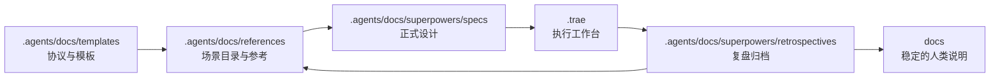

# Knowledge-Driven Exploration Foundation Design

## Goal

为 `AgentForge` 建立一套以知识沉淀为核心的探索型能力底座设计稿，用于统一承载比赛型探索、应用型探索与技能生态型探索，避免每次从零组织思路、重复发明流程或让经验停留在对话里。

本次设计目标如下：

- 定义一条统一的探索主线：`场景卡 -> spec -> plan -> 验证 -> 复盘 -> 回流`
- 以知识协议而非功能平台作为首期复用基座
- 在同一套框架下同时服务比赛、应用与技能生态三类探索对象
- 复用现有 `.trae/` 工作台与 `.agents/docs/` 档案馆结构，避免新造平行体系
- 为后续轻工作流、技能化封装与自动化校验预留清晰边界

## Background

当前仓库已经具备较好的知识沉淀基础：

- `AGENTS.md` 已明确“极致简约、大道至简”“反者道之动”“弱者道之用”等项目级哲学约束
- `.agents/docs/templates/dao-scenario-card-template.md` 已提供标准化场景卡模板
- `.agents/docs/references/dao-scenario-catalog.md` 已提供首批场景目录与示例
- `.agents/docs/superpowers/specs/` 与 `.agents/docs/superpowers/retrospectives/` 已被定义为长期设计与复盘档案馆
- `.trae/` 已被定义为执行中的临时工作台

这些基础说明，项目已经拥有“存放知识”的目录结构，但还缺少一套更稳定的“探索协议”，去回答以下问题：

- 什么样的输入才算一次正式探索的起点
- 不同探索对象如何复用同一套知识骨架，而不是各自生长
- 执行中的上下文与长期档案如何清晰分层
- 复盘结果如何反向改变模板、规则与场景目录，而不是只做归档

因此，需要新增一份设计稿，明确探索型能力底座的分层结构、输入输出协议、目录落位、首批产物与首个试点。

## Scope

- 定义探索型能力底座的分层架构
- 定义统一的输入输出协议与流转路径
- 明确与现有仓库目录的映射关系
- 规划首批最小产物集合
- 选择一个最低成本的正式试点，验证底座闭环

## Non-Goals

- 本次不直接实现自动化工作流、脚本或 UI
- 本次不创建新的数据库、索引服务或平台型基础设施
- 本次不替代具体业务 spec、PRD 或实施计划
- 本次不为比赛、应用、技能生态分别建立三套独立知识体系
- 本次不提前设计复杂的多智能体编排系统

## Design Principles

1. 知识优先：优先固化知识协议、模板与回流机制，再考虑自动化。
2. 共性优先：先定义跨场景通用骨架，再做薄适配，而不是先做三条独立分支。
3. 极简优先：仅保留支撑闭环的最小必要产物，避免把探索工作平台化、系统化过早做重。
4. 执行与归档分离：执行期上下文放工作台，长期资产放档案馆，避免混杂。
5. 回流为硬约束：没有复盘回流，不算底座能力增长。

## Options Considered

### Option A: 文档中心型

结构：

- 以场景卡、spec、plan、retrospective 为核心
- 先把所有探索流程文档化和模板化

优点：

- 最低侵入
- 与现有目录结构最兼容
- 可以最快形成第一版规范

缺点：

- 自动化能力较弱
- 依赖执行纪律来维持一致性

### Option B: 工作流中心型

结构：

- 以固定流程与子代理编排为核心
- 让探索按照预定义步骤自动推进

优点：

- 长期执行效率高
- 更适合后续规模化协作

缺点：

- 容易在知识模型稳定前把流程做重
- 容易把不成熟的方法过早固化

### Option C: 双层底座型

结构：

- 底层先定义知识沉淀协议
- 上层只补一层薄工作流与场景适配

优点：

- 同时兼顾比赛、应用与技能生态三类复用对象
- 既不过早平台化，也保留后续自动化空间
- 最符合当前项目“工作台 + 档案馆”的已有结构

缺点：

- 需要从一开始就划清共性层与适配层边界
- 如果缺少回流纪律，容易重新退化为“只写文档”

## Recommendation

采用 Option C。

推荐原因如下：

- 你当前的首要目标是“提高复用性”，且优先级最高的底座能力是“知识沉淀”
- 仓库已经具备较完整的知识资产目录，适合先定义统一协议，再逐步补轻工作流
- 比赛、应用、技能生态三类探索可以共用同一条知识主线，仅在验收重点与适配视图上做差异化

## Architecture Layers

推荐将探索型能力底座分为 4 层：

1. `共性知识层`
2. `场景适配层`
3. `轻工作流层`
4. `回流演化层`

对应关系如下：

- `共性知识层`：定义跨场景通用资产与字段，是单一事实来源
- `场景适配层`：把共性知识映射为比赛、应用、技能生态三类轻量视图
- `轻工作流层`：负责推进探索动作，但不抢占长期知识的归属
- `回流演化层`：把一次探索中的偏差、经验与复用结论反向更新到底座

推荐主图如下：

### Layer Responsibilities

#### 共性知识层

- 作用：统一承载所有探索共用的标准资产
- 典型内容：场景卡、spec、plan、验证记录、retrospective、术语与验收口径
- 约束：必须保持字段稳定，禁止为单一场景随意扩充模板复杂度

#### 场景适配层

- 作用：在不复制体系的前提下，为不同探索对象提供轻量差异视图
- 比赛型重点：时间盒、演示亮点、评审价值、快速闭环
- 应用型重点：用户价值、能力边界、阶段演进、稳定接口
- 技能生态型重点：触发条件、输入输出契约、评测口径、插件化边界

#### 轻工作流层

- 作用：串联“立项 -> 设计 -> 计划 -> 验证 -> 复盘”这些动作
- 典型产物：阶段状态、待办、阻塞项、阶段记录、下一步动作
- 约束：首版只保持最薄的一层编排，不提前做重型自动化

#### 回流演化层

- 作用：把一次探索真正转化为底座增长
- 典型动作：修订模板、补充场景目录、更新参考页、调整规范与验收口径
- 约束：复盘必须回答“哪些经验值得进入共性层”

## Protocol

统一探索协议定义为：

> 任何探索动作，都必须从结构化输入进入，并产出可回流的结构化结果。

### Standard Inputs

- 探索动机
- 场景描述
- 目标约束
- 成功标准
- 已有参考

### Standard Outputs

- 场景卡
- 设计 spec
- 执行计划
- 验证记录
- 复盘文档

### Unified Flow

推荐将所有探索动作固定为以下流转路径：

### Gate Rules

- 没有场景卡，不进入 spec
- 没有 spec，不进入正式计划
- 没有验证，不判定探索完成
- 没有复盘回流，不算底座能力增长

## Directory Mapping

推荐直接复用仓库现有目录体系，不新建平行目录：

- `探索入口`：`.agents/docs/references/` 与 `.agents/docs/templates/`
- `设计档案`：`.agents/docs/superpowers/specs/`
- `执行工作台`：`.trae/`
- `复盘档案`：`.agents/docs/superpowers/retrospectives/`
- `人类说明`：`docs/`

对应职责如下：

- `.agents/docs/templates/`：存放统一探索协议模板、场景卡模板、spec 母模板、复盘模板
- `.agents/docs/references/`：存放场景目录、术语表、分类规则与参考页
- `.agents/docs/superpowers/specs/`：存放正式设计稿与长期方案母本
- `.trae/`：存放执行期计划、任务拆解、临时分析与阶段记录
- `.agents/docs/superpowers/retrospectives/`：存放复盘与经验回流
- `docs/`：仅在某项成果对人类开发者已稳定有效时，才同步为长期说明

推荐目录流转图如下：

## Initial Deliverables

首批建议只建设 5 个最小产物：

1. `统一探索协议页`
2. `三类探索场景卡视图`
3. `探索 spec 母模板`
4. `最小执行工作台模板`
5. `复盘回流模板`

### Deliverable 1: 统一探索协议页

- 位置建议：`.agents/docs/references/`
- 作用：定义一次探索的输入、输出、流转路径、完成条件与回流义务

### Deliverable 2: 三类探索场景卡视图

- 基于统一场景卡模板做轻量适配
- 比赛型补充时间盒、演示亮点、评审价值
- 应用型补充用户价值、能力边界、阶段演进
- 技能生态型补充触发条件、输入输出契约、评测口径

### Deliverable 3: 探索 Spec 母模板

建议至少包含以下章节：

- `目标`
- `非目标`
- `适用范围`
- `核心能力闭环`
- `阶段划分`
- `验证标准`
- `风险与偏差`
- `回流计划`

### Deliverable 4: 最小执行工作台模板

建议至少包含以下字段：

- `当前阶段`
- `待办`
- `阻塞项`
- `验证记录`
- `下一步`

### Deliverable 5: 复盘回流模板

建议强制回答以下问题：

- 这次探索复用了哪些底座能力
- 哪些步骤仍然依赖手工或脆弱约定
- 哪些经验值得升级为模板、规则或参考页
- 这次探索对比赛、应用、技能生态哪一类最有复用价值

## Initial Build Order

建议按以下顺序推进首批产物：

1. 先写统一探索协议页
2. 再补三类探索场景卡视图
3. 再固化 spec 母模板
4. 再补执行工作台模板
5. 最后补复盘回流模板

这个顺序的意义在于：

- 先定义规则，再定义设计展开方式
- 先明确长期知识边界，再补执行期承载方式
- 最后再规定经验如何回流到底座

## Pilot Strategy

首个试点不应选择“最大价值”的方向，而应选择“最低成本验证闭环”的方向。

推荐首个试点主题为：

- `探索任务知识闭环最小试点`

试点目标如下：

- 让一次真实探索完整跑通 `场景卡 -> spec -> plan -> 执行 -> 复盘 -> 回流`
- 验证这条链路是否低摩擦、可复用、可回流、可扩展
- 证明知识底座可以先于复杂工作流成立

### Pilot Options

#### Option A: 比赛型原型生成闭环

优点：

- 节奏快
- 结果易展示

风险：

- 容易过度偏向演示闭环

#### Option B: 应用型最小能力闭环

优点：

- 更贴近长期应用价值

风险：

- 短期成果不够显性

#### Option C: 技能生态型知识闭环试点

优点：

- 最符合当前“知识沉淀优先”的目标
- 能直接反哺 `.agents/skills/` 与工作流体系

风险：

- 外部业务感较弱

### Pilot Recommendation

采用 `Option C`。

原因如下：

- 它最直接验证“知识底座是否成立”
- 一旦该试点跑通，后续切换到比赛型或应用型只需要更换场景，不需要重做底座
- 它天然适合作为后续技能、流程或模板升级的真实来源

## Validation Model

建议从以下四个维度验证这套底座：

- `低摩擦`：一次探索能否自然进入该链路，而不是增加明显流程负担
- `可复用`：首批模板与规范能否直接服务下一个探索
- `可回流`：复盘能否实质更新模板、规则、场景目录或参考页
- `可扩展`：后续接入比赛型与应用型时，是否只需要薄适配

## Risks

- 如果过早追求自动化，可能在知识协议尚未稳定时固化错误流程
- 如果三类探索适配字段持续膨胀，场景适配层会逐渐分叉
- 如果执行工作台与长期档案边界不清，知识会重新混乱
- 如果复盘不更新模板与规则，底座会退化为归档系统
- 如果首个试点过大，闭环验证成本会过高并削弱学习速度

## Acceptance Criteria

- 新增设计稿位于 `.agents/docs/superpowers/specs/` 下
- 文档明确给出 4 层底座结构与各层职责
- 文档明确给出统一探索协议与流转路径
- 文档明确给出目录落位与文件归属规则
- 文档明确给出首批 5 个最小产物与建设顺序
- 文档明确给出首个试点选择与验收维度
- 文档内容可直接作为后续模板设计与实施计划的母本
