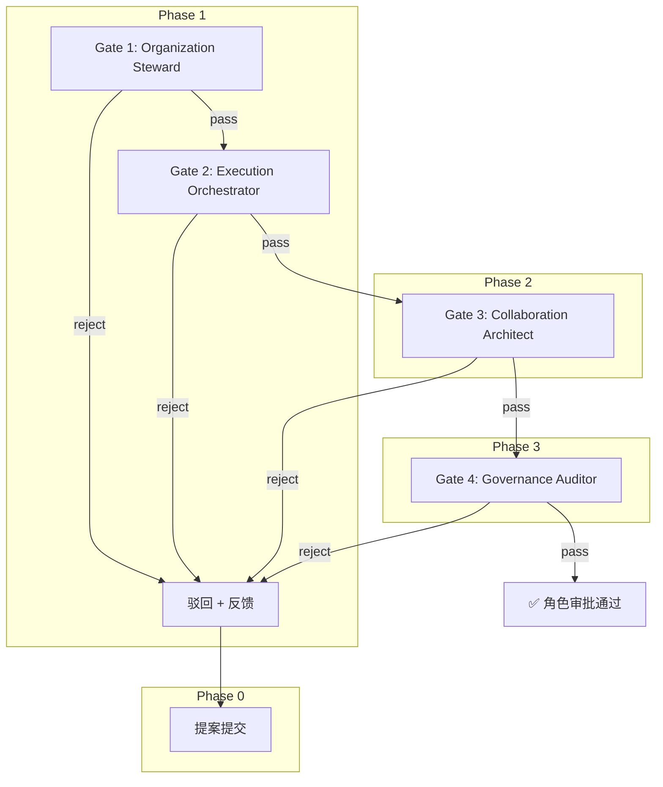

# Role Review Workflow Design

## Goal

为 AgentForge 引入第一条多角色协作工作流，用于审批向 `.agents/roles/` 新增角色。用已有四个角色互相审查的方式，验证协作元模型的自指一致性。

本次设计目标如下：

- 定义一条 4 Gate 顺序审批工作流，覆盖 Organization → Execution → Architecture → Governance
- 为每道门禁定义明确的审查标准与通过/驳回条件
- 提供新角色提案模板，标准化未来提交
- 用这条工作流审查现有 4 个角色作为试运行验证
- 产出 4 份真实的 Gate 审查记录，不留空占位

## Background

当前仓库已落地：

- 协作元模型参考页 `.agents/docs/references/agent-collaboration-metamodel.md`
- 五大领域 15 个核心实体定义
- `.agents/roles/` 首批 4 个角色实例：`organization-steward`、`execution-orchestrator`、`collaboration-architect`、`governance-auditor`
- `.agents/workflows/pr-review.md` 作为单角色工作流先例

这些资产已经能承载"多角色协作协议"的语义，但还缺一条显式工作流将这些角色串联成一个可追踪的协作链路。最适合的第一条工作流是"审批新增角色"，因为它自指地验证了角色模型本身是否有协作价值。

## Scope

- 定义工作流主文档 `.agents/workflows/role-review.md`
- 定义提案模板 `.agents/workflows/role-review/templates/proposal.md`
- 生成 4 份 Gate 审查记录作为试运行证据
- 更新 `.agents/roles/README.md` 增加审查状态列
- 更新协作元模型参考页中的目录映射

## Non-Goals

- 不在工作流中嵌入自动化校验脚本
- 不对提案文件做 YAML frontmatter 解析
- 不把 Handoff 实现为代码级事件
- 不建立提案数据库或索引
- 工作流本身不定义角色优先级或投票机制
- 不修改 `src/taolib/`

## Design Principles

1. 自指验证：首条工作流直接审查角色模型自身，杜绝"设计好却用不上"。
2. 顺序依赖：四角色按元模型分层自然排列，每步建立在上一步结论上。
3. 显式 Handoff：每道 Gate 之间使用结构化交接对象，不隐式跳转。
4. 试运行出真产物：不写"审核通过"的占位语，逐项列出检查项和结论。
5. 模板与工作流内聚：提案模板跟工作流放在同一目录下，便于将来按工作流聚合。

## Options Considered

### Option A: 顺序门禁模型

四角色按依赖链顺序审批。每节点通过/驳回/修订，驳回时退回提案。

优点：依赖链清晰，状态追踪简单，最符合元模型分层逻辑。

缺点：串行耗时，但第一版 4 个 Gate 均为人工审核，时间不是瓶颈。

### Option B: 并行审查模型

四角色同时审查，全部通过才算完成。

优点：理论更快。

缺点：后续审查者看不到前置判断，容易产生矛盾反馈。

### Option C: 两阶段共识模型

Org+Exec 和 Arch+Gov 分两阶段各自共识。

优点：更细腻。

缺点：第一版复杂度过高，收益不大。

## Recommendation

采用 Option A。

推荐原因：四角色之间有天然依赖，Org 先判组织归属、Exec 再评估执行影响、Arch 审语义一致性、Gov 做最终合规把关。顺序门禁模型直接映射了元模型的分层逻辑。

## Workflow Design

### Overview



### Gate Standards

| Gate | 角色 | 审查焦点 | 通过条件 | 驳回条件 |
|---|---|---|---|---|
| **Gate 1** | Organization Steward | 组织归属 | Domain 正确、与现有 Role 不重复、Name 在元模型语义内 | Domain 缺失或错配、与已有 Role 职责重叠、Name 混淆元模型实体 |
| **Gate 2** | Execution Orchestrator | 执行影响 | Responsibilities 可编排、不替代 Agent 执行、Non-Goals 排除了运行时职责 | Responsibilities 直接描述任务调度实现、边界侵蚀 Agent 或 Task |
| **Gate 3** | Collaboration Architect | 语义一致 | 四字段完整、Bindings 引用有效、不破坏现有映射 | 字段缺失、引用路径错误、Default Bindings 悬空 |
| **Gate 4** | Governance Auditor | 合规审计 | 不违反强约束、Non-Goals 覆盖了越界风险、角色可追踪 | 违反任一条强约束、Non-Goals 不足以阻止越界 |

### Handoff Structure

每道门禁之间通过显式 Handoff：

- **Gate 1 → Gate 2**：Org Steward 交接组织归属判定
- **Gate 2 → Gate 3**：Exec Orchestrator 交接执行影响评估
- **Gate 3 → Gate 4**：Collab Architect 交接语义一致性检查

Handoff 必含字段：

```text
来源角色 → 目标角色
交接内容：上一步审查结论 + 未解决问题
当前状态：prepared / accepted / rejected
```

### Gate Review Output Format

每道 Gate 审查产出统一格式：

```text
Gate N: [审查角色名] 审查

审查人: [角色名]
审查对象: [文件名]
结论: ✅ 通过 / ❌ 驳回 / ⚠️ 修订

检查项：
- [ ] 检查项 1 — 结果
- [ ] 检查项 2 — 结果

驳回/修订意见（如有）：[具体反馈]
Handoff 状态: prepared → 下一 Gate
```

### Proposal Template

提案模板字段如下，提案文件放在 `.agents/workflows/role-review/templates/proposal.md`：

- **Role Identity**：Name（英文小写连字符）、Domain（五大领域之一）、Description
- **Motivation**：为什么引入这个角色、解决了什么协作空白
- **Responsibilities**：核心职责列表，不得描述具体任务执行细节
- **Default Bindings**：引用的 Rules/References 必须真实存在于仓库
- **Non-Goals**：至少一条排除运行时实现
- **Impact Assessment**：对现有角色、目录映射、工作流的潜在影响

## Verification Plan

用本条工作流审查现有 4 个角色，产出 4 份真实 Gate 记录：

```
organization-steward.md ─── Gate 1 (Org)  → 审查自身组织归属
execution-orchestrator.md ── Gate 2 (Exec) → 审查自身执行边界
collaboration-architect.md ─ Gate 3 (Arch) → 审查自身语义完整
governance-auditor.md ────── Gate 4 (Gov)  → 审查自身合规性
```

自审约束：

- 自审时允许通过，但必须说明自审依据
- 每份记录必须逐项列出检查项和结论
- 不留"审核通过"的占位语

## Deliverables

| 文件 | 操作 | 说明 |
|---|---|---|
| `.agents/workflows/role-review.md` | 新建 | 工作流主文档 |
| `.agents/workflows/role-review/templates/proposal.md` | 新建 | 提案模板 |
| `.agents/workflows/role-review/verification/gate-01-organization-steward.md` | 新建 | Gate 1 审查记录 |
| `.agents/workflows/role-review/verification/gate-02-execution-orchestrator.md` | 新建 | Gate 2 审查记录 |
| `.agents/workflows/role-review/verification/gate-03-collaboration-architect.md` | 新建 | Gate 3 审查记录 |
| `.agents/workflows/role-review/verification/gate-04-governance-auditor.md` | 新建 | Gate 4 审查记录 |
| `.agents/roles/README.md` | 修改 | 增加审查状态列 |
| `.agents/docs/references/agent-collaboration-metamodel.md` | 修改 | 目录映射补 `workflows/role-review/` |

## Risks

- 如果试运行只是走过场（全员通过无实质检查），工作流会失去公信力
- 如果提案模板不被后续使用者遵循，标准化会退化
- 如果 Gate 审查记录格式不被其他工作流复用，会形成碎片化输出

## Acceptance Criteria

- 存在一份可独立阅读的 `role-review.md` 工作流文档
- 工作流明确 4 道 Gate 的审查标准与通过/驳回条件
- 存在一份可复用的新角色提案模板
- 存在 4 份逐项列出检查项的试运行审查记录
- `.agents/roles/README.md` 角色清单表已更新
- 协作元模型参考页目录映射已补充
