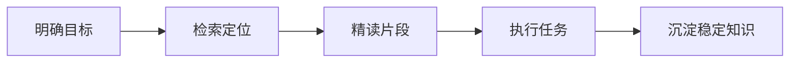

# 上下文节省规则

本文档定义智能体在本项目中控制上下文与 token 消耗的默认策略。除非用户明确要求全量分析，否则所有任务均应优先遵循“先定位、再读取、只保留相关上下文”的原则。

## 1. 核心原则



- 优先理解用户目标和约束，再决定读取哪些文件。
- 优先搜索关键词、文件名和目录索引，避免直接读取大范围内容。
- 优先读取相关片段，避免读取完整大文件。
- 稳定、可复用的知识应沉淀到 `.agents/docs/` 或规则文件中，避免反复读取原始材料。

## 2. 文件读取策略

| 场景 | 推荐做法 |
|---|---|
| 查找文件 | 先使用文件名或路径模式定位 |
| 查找函数、概念、错误 | 先使用关键词搜索 |
| 理解架构 | 先读入口文档和目录索引，再读专题文档 |
| 分析长日志 | 先筛选 `error`、`warning`、`traceback`、`failed` 等关键词 |
| 修改代码 | 先读取目标文件相邻上下文，确认风格后再改 |

## 3. 长材料预处理

长日志、网页、PDF、研究材料和完整命令输出应先压缩为结构化摘要。

长日志摘要格式：

```text
任务：
命令：
关键错误：
相关文件：
已尝试操作：
```

长文档摘要格式：

```text
文档主题：
核心结论：
约束条件：
相关章节：
不相关内容：
```

## 4. 输出预算

- 默认回答应直接服务当前任务，不重复复述已确认背景。
- 代码任务完成后优先说明改动文件、关键原因、验证结果。
- 用户要求短答时，应先给结论，必要时再展开。
- 不应在最终回答中粘贴大段未修改代码。

## 5. 任务记忆与知识沉淀

- 当前任务进度使用任务列表管理，不写入长期知识库。
- 项目稳定约定、长期规则、复用方法可沉淀到 `.agents/docs/` 或 `.agents/rules/`。
- 复盘报告统一放入 `.agents/docs/superpowers/retrospectives/`。
- 上下文优化方法参考 `.agents/docs/superpowers/plans/2026-05-24-agent-token-reduction-guide.md`。
