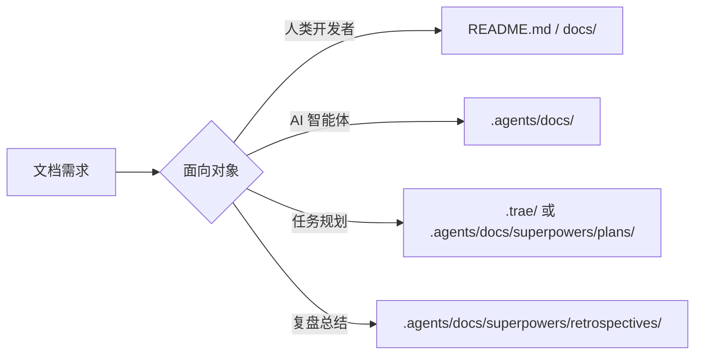

# 文档治理规则

本文档定义项目中文档边界、归档位置、临时产物和同步机制。处理文档相关任务时，应先判断文档面向对象和生命周期，再选择写入位置。

## 1. 文档边界

- `README.md` 与 `docs/` 面向人类开发者。
- `.agents/docs/` 面向 AI 智能体，用于知识库、架构分析、参考资料和长期沉淀。
- `.agents/rules/` 面向 AI 智能体，用于高频执行规则。
- `.agents/workflows/` 面向 AI 智能体，用于流程化任务指南。

## 2. 归档规则

| 文档类型 | 归档位置 |
|---|---|
| 技能设计 spec | `.agents/docs/superpowers/specs/<skill-name>/` |
| 通用技术方案 | `.agents/docs/` 下对应主题目录 |
| 实施计划 | `.agents/docs/superpowers/plans/` |
| 复盘报告 | `.agents/docs/superpowers/retrospectives/` |
| AI 参考资料 | `.agents/docs/references/` 或 `.agents/docs/sources/` |
| 人类说明文档 | `README.md` 或 `docs/` |

## 3. 临时产物

任务执行过程中产生的中间文件、调试输出、缓存数据、截图、测试草稿和一次性脚本应放入 `.temp/`。

`.temp/` 内容为临时性质，任务结束后可安全清理。不得将 `.temp/` 中的文件作为长期文档引用目标。

## 4. 路径与引用

- 项目内引用必须使用相对路径。
- 持久化文档中禁止写入本地绝对路径或包含个人用户名的路径。
- 外部资料优先引用官方永久链接。
- 临时抓取文件、临时日志和中间产物不得作为长期引用来源。

## 5. 双向同步

当 `AGENTS.md`、`.agents/README.md` 或 `.agents/` 目录结构发生结构性变化时，应评估是否需要同步更新面向人类的 `README.md` 或 `docs/`。

同步判断标准：

- 是否改变了项目入口说明。
- 是否改变了目录职责或导航路径。
- 是否影响人类开发者理解项目结构。
- 是否只是 AI 内部规则微调。

仅 AI 内部规则微调通常不需要更新人类文档；若变更影响项目公共说明，则应同步更新。

## 6. 真实源与镜像页

部分文档同时存在于"真实数据源"与"Sphinx 镜像页"两类位置，应明确区分：

| 类别 | 位置示例 | 性质 | 编辑约束 |
|---|---|---|---|
| **真实源 (SSOT)** | `tests/project_changelogs/CHANGELOG_<年月>.md`、`.agents/skills/<skill>/CHANGELOG.md` | 实际编辑与维护点 | ✅ 仅在此处编辑变更内容 |
| **Sphinx 镜像页** | `docs/changelogs/<topic>.md` | 通过 `{include}` 引用真实源进行文档站渲染 | ❌ 禁止直接编辑内容；仅维护 include 路径与标题 |
| **导航索引页** | 根 `CHANGELOG.md`、`docs/changelog.md` | 指向真实源或镜像页的入口表格 | ⚠️ 修改时遵循「指向规则」 |

### 6.1 指向规则

- **根目录索引**（`CHANGELOG.md`、`README.md`）→ 必须指向**真实源**，确保 GitHub 浏览体验直达数据。
- **Sphinx 站内索引**（`docs/changelog.md`）→ 指向同站镜像页（相对路径），借助 Sphinx 渲染管线。
- **同一字段不要同时挂两条链接**，避免维护双份引用。

### 6.2 新增镜像页流程

为新模块新增变更日志时：

1. 在真实源位置创建 `CHANGELOG.md`（或月度文件）。
2. 在 `docs/changelogs/<topic>.md` 创建镜像页，仅含一级标题 + `{include}` 块。
3. 在 `docs/changelog.md` 索引表追加镜像页相对路径。
4. 在根 `CHANGELOG.md` 索引表追加**真实源**绝对/相对路径。
5. 在 `docs/changelog.md` 顶部 `toctree` 中登记镜像页。

### 6.3 禁止事项

- ❌ 不得在根 `CHANGELOG.md`、`README.md` 中将链接指向 `docs/changelogs/` 镜像页。
- ❌ 不得在 `docs/changelogs/<topic>.md` 镜像页中直接添加变更内容（应改写真实源）。
- ❌ 不得删除真实源而仅保留镜像页，会导致 Sphinx 构建失败。
