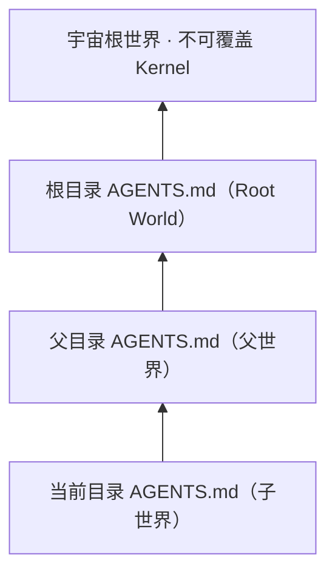
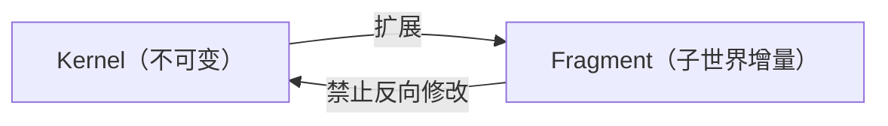
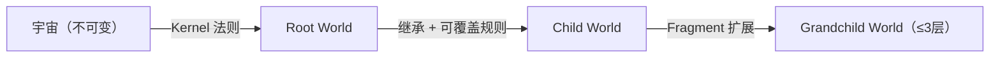

# 世界层级规则

本文档定义多 `AGENTS.md` 嵌套场景下的世界发现、继承、覆盖与冲突处理规则。处理多世界层级相关任务时，应先读取本文档，再执行具体操作。

## 1. 世界发现规则

Agent 启动时从当前工作目录向上逐级查找 `AGENTS.md`：

- 每遇到一个 `AGENTS.md` 即注册为一个世界层级（World Layer）。
- 根目录的 `AGENTS.md` 为**宇宙根世界（Root World）**，是层级树的顶点。
- 查找在到达文件系统根（如 `/` 或盘符根）时终止。



## 2. 最近原则继承语义

- 子世界自动继承其所有祖先世界的规则。
- 子世界中**显式声明**的同名规则覆盖父世界对应规则。
- 未声明覆盖的规则原样透传至子世界。
- 优先级链：`当前目录 > 父目录 > … > Root World`

示例：子世界的 `python.md` 仅需声明差异项，父世界中其余 Python 规则自动生效。

## 3. 覆盖粒度定义

| 覆盖对象 | 最小单位 | 覆盖方式 |
|---|---|---|
| `.agents/rules/` 下的规则文件 | 文件（按文件名匹配） | 子世界同名文件完整覆盖父世界对应文件 |
| 规则文件内部的规则节 | Section（`##` 级标题） | 子世界同节声明覆盖父世界同节内容 |
| 上下文路由表（Context Router） | 表格行（按 key 匹配） | 子表项**追加或覆盖**父表同名项，未提及项透传 |

## 4. Kernel 不可覆盖约束

- `world.toml` 中 `[kernel]` 声明的条目为**宇宙法则**，在任何子世界中均不可覆盖。
- 子世界只允许通过 **Fragment 扩展**（新增条目）与 Kernel 交互，禁止修改 Kernel 已有内容。
- Agent 检测到子世界试图覆盖 Kernel 条目时，必须**显式报告冲突**并拒绝执行。



### 查看 Kernel 不可覆盖项

`world.toml` 中 `[kernel]` 区块的 `immutable_rules` 字段列出所有不可覆盖的规则：

```toml
[kernel]
# 不可覆盖的宇宙法则：子世界禁止通过同名文件覆盖以下规则
immutable_rules = ["world-hierarchy", "context-economy"]
```

子世界的 `.agents/rules/` 中若存在与上述列表**同名的规则文件**，视为 Kernel 违规，Agent 必须显式报告并拒绝执行。

## 5. 子世界 `.agents/` 目录语义

| 子目录 | 语义 | 行为 |
|---|---|---|
| `.agents/rules/` | 该世界的增量覆盖规则 | 同名文件覆盖父世界；无同名则透传父世界规则 |
| `.agents/skills/` | 附加技能集 | **追加**到父世界技能集，不替换 |
| `.agents/workflows/` | 附加工作流 | **追加**到父世界工作流集，不替换 |
| `world.toml` | 世界级 manifest | **一个 monorepo 仅允许一份**，子目录禁止存在独立 `world.toml` |

## 6. 冲突声明与诊断

- 子世界 `AGENTS.md` 可声明 `## 覆盖说明` 节，列出有意覆盖的父规则（含文件名与节名）。
- **未声明的隐式覆盖**视为合法，但在审计时应标记为待审项。
- 嵌套深度推荐 **≤ 3 层**，对齐嵌套深度与觉醒量表推论（见 `../../docs/general/philosophy/dynamics/nesting-depth-and-alpha.md` 推论二）。

### 覆盖说明示例

```markdown
## 覆盖说明

| 父规则文件 | 覆盖节 | 覆盖原因 |
|---|---|---|
| `python.md` | `## 3. 版本约束` | 子项目锁定 Python 3.11，与父世界 3.13 要求不同 |
```

## 7. 哲学映射

- **宇宙不可变 → Kernel 不可覆盖**：宇宙为唯一自持实体，其法则不以任何世界意志为转移。  
  参见：[`../../docs/general/philosophy/ontology/universe-world-ontology.md`](../../docs/general/philosophy/ontology/universe-world-ontology.md)

- **世界可操作 → Fragment / 规则可覆盖**：世界是宇宙内可被 Agent 操作的子空间，规则在此域内可被裁剪与扩展。  
  参见：[`../../docs/general/philosophy/ontology/universe-world-ontology.md`](../../docs/general/philosophy/ontology/universe-world-ontology.md)

- **共振对齐 → 父子世界结构共振**：父子世界通过同构协议（相同的文件命名、节标题约定）保持结构共振，避免语义漂移。  
  参见：[`../../docs/general/philosophy/engineering/resonance-synchronization.md`](../../docs/general/philosophy/engineering/resonance-synchronization.md)


