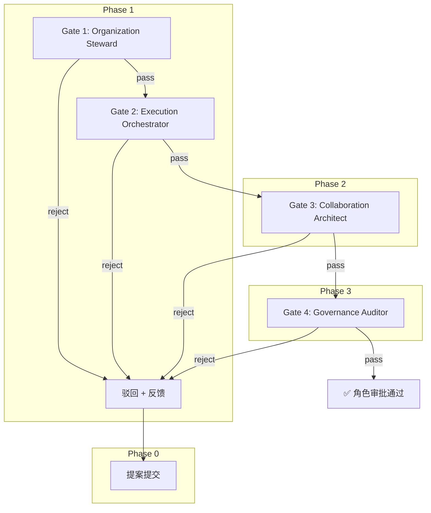

# 角色审查工作流 (Role Review Workflow)

本工作流定义了向 `.agents/roles/` 新增角色时的四道顺序门禁审批流程。四个已有角色按 Organization → Execution → Architecture → Governance 顺序逐级审查提案。

## 1. 概述



## 2. 触发条件

以下情况触发本工作流：

- 有人提出新增 `.agents/roles/` 下的角色实例
- 有人提出对现有角色进行结构性修改（Domain 变更、Responsibilities 重写）
- 协作元模型发生重大变更，需重新审查所有现有角色

## 3. 提案提交

提案者使用标准模板提交提案，模板见 [`role-review/templates/proposal.md`](role-review/templates/proposal.md)。

提案文件放在 `.agents/roles/proposals/` 下，命名为 `<role-name>-proposal.md`。

## 4. 门禁标准

### Gate 1: Organization Steward — 组织归属审查

**审查焦点**：角色的组织定位是否正确。

| 检查项 | 通过条件 | 驳回条件 |
|---|---|---|
| Domain 归属 | Domain 明确属于五大领域之一 | Domain 缺失、模糊或跨领域混写 |
| 名命规范 | Name 使用英文小写连字符，不混淆元模型实体名 | Name 使用中文、大写或与 `Team/Agent` 等实体名重复 |
| 角色唯一性 | 与现有 Role 职责不重叠 | 与已有 Role 职责高度重复且无区分说明 |

### Gate 2: Execution Orchestrator — 执行影响审查

**审查焦点**：角色定义是否侵蚀执行层边界。

| 检查项 | 通过条件 | 驳回条件 |
|---|---|---|
| 职责编排性 | Responsibilities 聚焦"设计/规范/审核"，不描述具体任务执行 | Responsibilities 直接描述任务调度、代码实现或 Agent 操作细节 |
| Agent 边界 | 不替代 Agent 的执行职责 | 将 Agent 的执行能力复述为角色职责 |
| 运行时排除 | Non-Goals 中明确排除运行时实现 | Non-Goals 未涉及运行时相关排除项 |

### Gate 3: Collaboration Architect — 语义一致性审查

**审查焦点**：角色文件是否符合元模型四字段规范。

| 检查项 | 通过条件 | 驳回条件 |
|---|---|---|
| 字段完整性 | Role Identity / Responsibilities / Default Bindings / Non-Goals 全部存在 | 任一必填字段缺失 |
| 引用有效性 | Default Bindings 中所有引用的 Rules/References 真实存在于仓库 | 引用路径错误或引用不存在的文件 |
| 映射兼容性 | 不破坏现有目录映射关系 | 引入后导致语义冲突（如 Role 名称与已有 Workflow 同名） |

### Gate 4: Governance Auditor — 合规审计审查

**审查焦点**：角色是否违反协作元模型强约束。

| 检查项 | 通过条件 | 驳回条件 |
|---|---|---|
| 强约束遵守 | 不违反五大强约束中任一条 | 违反任一条强约束 |
| 越界防护 | Non-Goals 覆盖了角色可能的越界风险 | Non-Goals 不足以阻止职责越界 |
| 可追踪性 | 角色文件包含完整四字段，可被独立审计 | 关键字段缺失导致无法追踪角色来源和定位 |

## 5. 交接协议

每道 Gate 审查完成后，通过显式 Handoff 交接到下一 Gate：

```
Gate N → Gate N+1
来源角色: [审查者角色名]
目标角色: [下一审查者角色名]
交接内容: 上一步审查结论 + 未解决问题
当前状态: prepared
```

Handoff 状态流转：

- **prepared** — 审查完成，等待下一 Gate 接手
- **accepted** — 下一 Gate 已接收并开始审查
- **rejected** — 下一 Gate 驳回，退回提案阶段

## 6. 审查输出格式

每道 Gate 产出统一格式的审查记录，示例：

```markdown
# Gate 1: Organization Steward 审查

**审查人**: Organization Steward
**审查对象**: example-role.md
**审查日期**: YYYY-MM-DD
**结论**: ✅ 通过

## 检查项

- [x] Domain 归属 — Domain 明确为 Organization，属于五大领域
- [x] 名命规范 — Name 使用英文小写连字符，不混淆实体名
- [x] 角色唯一性 — 与现有 Role 职责无重叠

## Handoff

来源角色: Organization Steward
目标角色: Execution Orchestrator
交接内容: 组织归属判定通过，无未解决问题
当前状态: prepared
```

## 7. 目录结构

```
.agents/workflows/
├── pr-review.md
├── role-review.md                          # 本工作流主文档
└── role-review/
    ├── templates/
    │   └── proposal.md                     # 提案模板
    └── verification/                       # 试运行审查记录
        ├── gate-01-organization-steward.md
        ├── gate-02-execution-orchestrator.md
        ├── gate-03-collaboration-architect.md
        └── gate-04-governance-auditor.md
```

## 8. 与现有资产的关系

- 本工作流不替代 `pr-review.md`，两者适用场景不同
- 本工作流的角色审查基于 `.agents/docs/references/agent-collaboration-metamodel.md` 中的强约束
- 提案模板与工作流内聚存放，遵循"模板随工作流"原则
