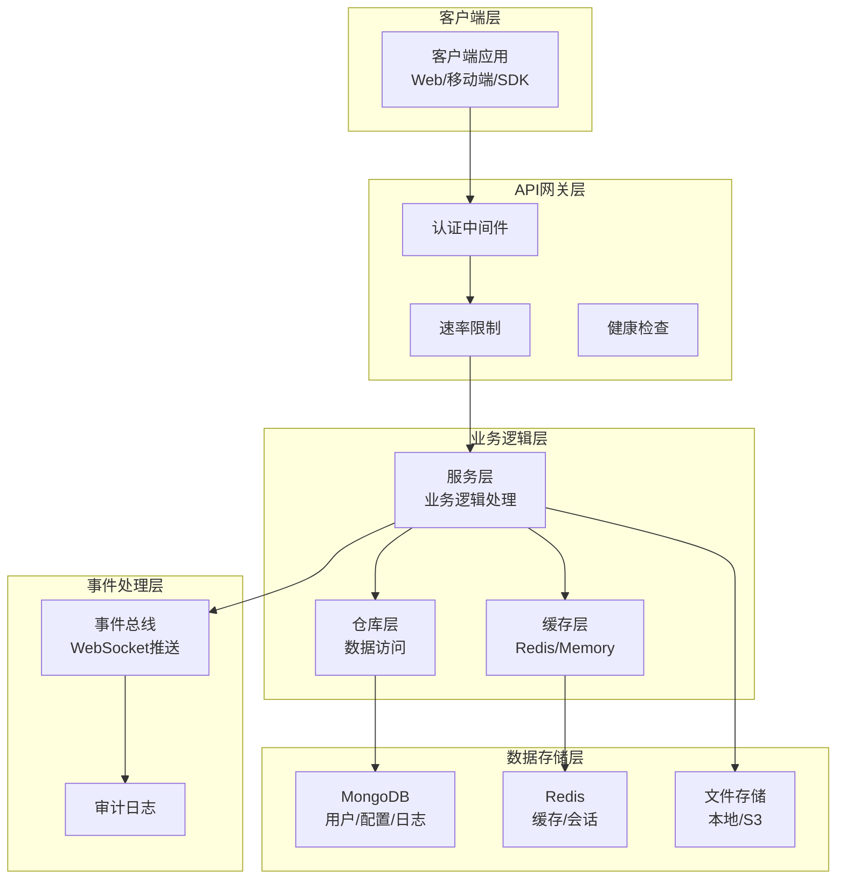
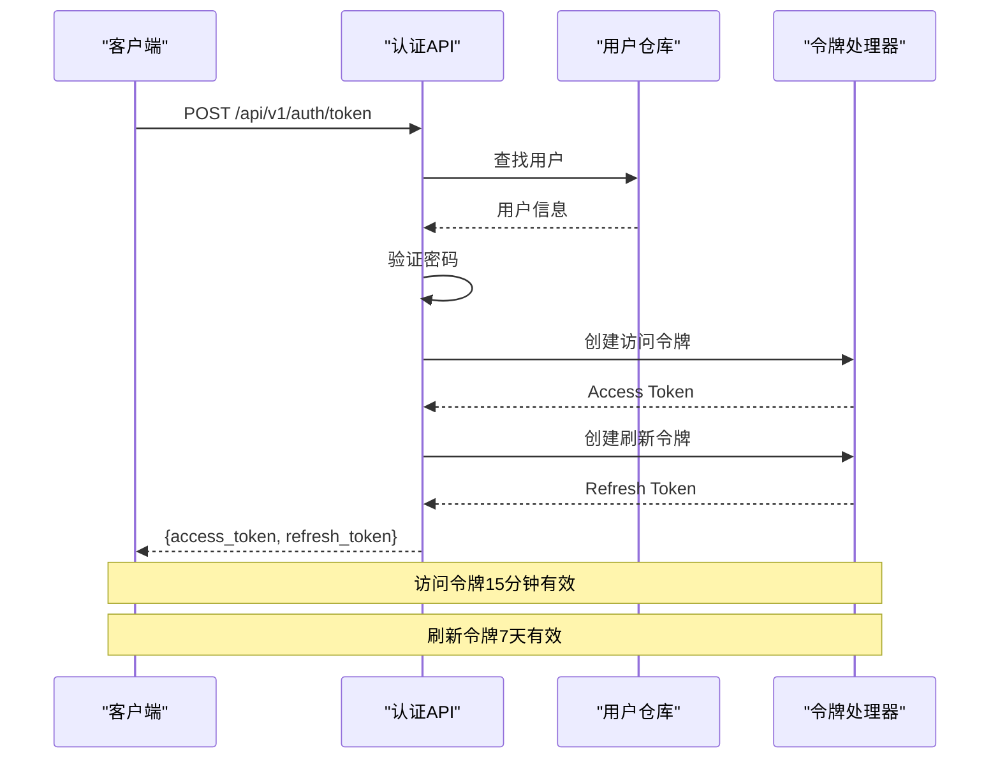
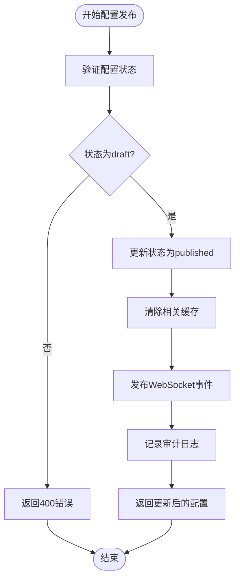
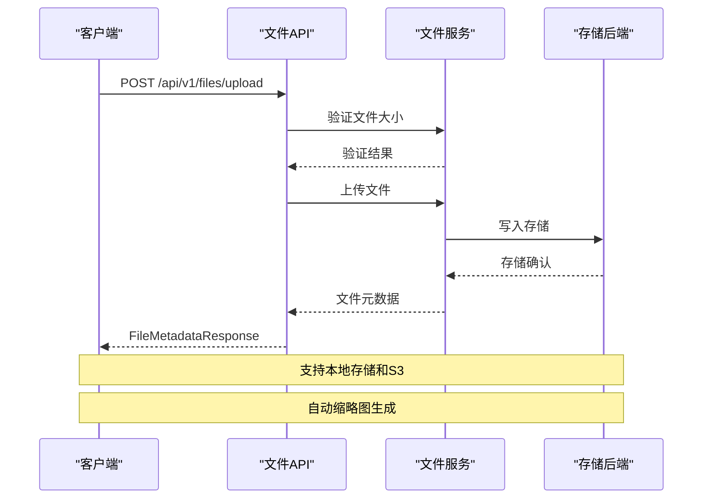
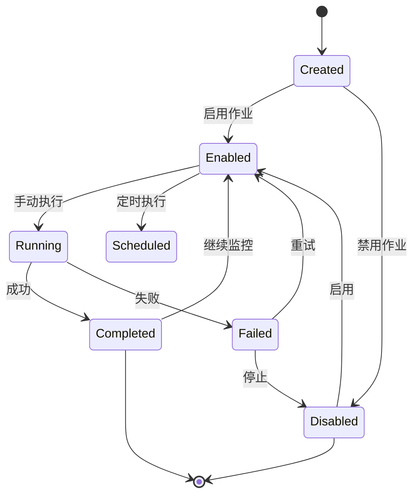
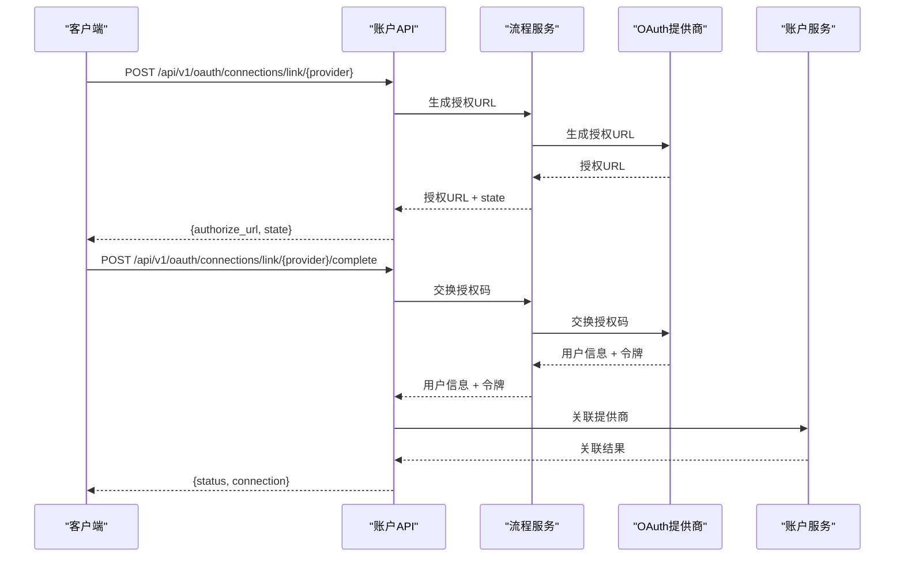
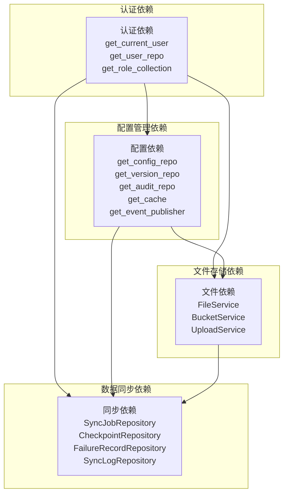

# API参考文档

<cite>
**本文档引用的文件**
- [router.py](file://src/taolib/testing/config_center/server/api/router.py)
- [auth.py](file://src/taolib/testing/config_center/server/api/auth.py)
- [configs.py](file://src/taolib/testing/config_center/server/api/configs.py)
- [router.py](file://src/taolib/testing/file_storage/server/api/router.py)
- [files.py](file://src/taolib/testing/file_storage/server/api/files.py)
- [router.py](file://src/taolib/testing/data_sync/server/api/router.py)
- [jobs.py](file://src/taolib/testing/data_sync/server/api/jobs.py)
- [router.py](file://src/taolib/testing/oauth/server/api/router.py)
- [accounts.py](file://src/taolib/testing/oauth/server/api/accounts.py)
- [router.py](file://src/taolib/testing/task_queue/server/api/router.py)
- [router.py](file://src/taolib/testing/qrcode/server/api/router.py)
- [router.py](file://src/taolib/testing/rate_limiter/api/router.py)
- [router.py](file://src/taolib/testing/email_service/server/api/router.py)
- [router.py](file://src/taolib/testing/analytics/server/api/router.py)
</cite>

## 目录
1. [简介](#简介)
2. [项目结构](#项目结构)
3. [核心组件](#核心组件)
4. [架构概览](#架构概览)
5. [详细组件分析](#详细组件分析)
6. [依赖分析](#依赖分析)
7. [性能考虑](#性能考虑)
8. [故障排除指南](#故障排除指南)
9. [结论](#结论)
10. [附录](#附录)

## 简介
本文件为FlexLoop项目的API参考文档，涵盖认证、配置管理、文件存储、数据同步、OAuth账户连接、任务队列、二维码生成、速率限制、邮件服务和分析服务等模块的完整接口规范。文档遵循RESTful设计原则，采用版本控制（/api/v1），提供详细的HTTP方法、URL模式、请求/响应格式、认证方式、参数说明、返回值定义和错误处理策略。

## 项目结构
FlexLoop基于FastAPI构建，采用模块化组织方式，每个功能模块包含独立的API路由聚合器和具体端点实现。主要模块包括：
- 配置中心：认证、配置管理、审计、用户、角色、推送
- 文件存储：桶管理、文件操作、上传、签名URL、统计
- 数据同步：作业管理、日志、故障、指标
- OAuth：账户连接、会话、引导流程、管理员
- 任务队列：任务管理、统计、健康检查
- 其他服务：二维码、速率限制、邮件服务、分析服务

```mermaid
graph TB
subgraph "API版本控制"
V1["/api/v1"]
end
subgraph "配置中心模块"
CC_AUTH["/auth<br/>认证"]
CC_CONFIGS["/configs<br/>配置管理"]
CC_USERS["/users<br/>用户管理"]
CC_ROLES["/roles<br/>角色管理"]
CC_AUDIT["/audit<br/>审计日志"]
CC_PUSH["/push<br/>推送服务"]
end
subgraph "文件存储模块"
FS_BUCKETS["/buckets<br/>桶管理"]
FS_FILES["/files<br/>文件操作"]
FS_UPLOADS["/uploads<br/>上传"]
FS_SIGNED["/signed-urls<br/>签名URL"]
FS_STATS["/stats<br/>统计"]
end
subgraph "数据同步模块"
DS_JOBS["/jobs<br/>作业管理"]
DS_LOGS["/logs<br/>日志"]
DS_FAILURES["/failures<br/>故障"]
DS_METRICS["/metrics<br/>指标"]
end
subgraph "OAuth模块"
OA_ACCOUNTS["/oauth/connections<br/>账户连接"]
OA_FLOW["/flow<br/>授权流程"]
OA_SESSIONS["/sessions<br/>会话管理"]
OA_ONBOARDING["/onboarding<br/>引导流程"]
OA_ADMIN["/admin<br/>管理员"]
end
subgraph "其他模块"
TQ_TASKS["/tasks<br/>任务队列"]
QR_GENERATE["/generate<br/>生成二维码"]
RL_RATE["/rate-limit<br/>速率限制"]
ES_EMAIL["/emails<br/>邮件服务"]
AN_EVENTS["/events<br/>事件分析"]
end
V1 --> CC_AUTH
V1 --> CC_CONFIGS
V1 --> CC_USERS
V1 --> CC_ROLES
V1 --> CC_AUDIT
V1 --> CC_PUSH
V1 --> FS_BUCKETS
V1 --> FS_FILES
V1 --> FS_UPLOADS
V1 --> FS_SIGNED
V1 --> FS_STATS
V1 --> DS_JOBS
V1 --> DS_LOGS
V1 --> DS_FAILURES
V1 --> DS_METRICS
V1 --> OA_ACCOUNTS
V1 --> OA_FLOW
V1 --> OA_SESSIONS
V1 --> OA_ONBOARDING
V1 --> OA_ADMIN
V1 --> TQ_TASKS
V1 --> QR_GENERATE
V1 --> RL_RATE
V1 --> ES_EMAIL
V1 --> AN_EVENTS
```

**图表来源**
- [router.py:17-28](file://src/taolib/testing/config_center/server/api/router.py#L17-L28)
- [router.py:15-24](file://src/taolib/testing/file_storage/server/api/router.py#L15-L24)
- [router.py:7-14](file://src/taolib/testing/data_sync/server/api/router.py#L7-L14)
- [router.py:15-22](file://src/taolib/testing/oauth/server/api/router.py#L15-L22)

**章节来源**
- [router.py:1-30](file://src/taolib/testing/config_center/server/api/router.py#L1-L30)
- [router.py:1-27](file://src/taolib/testing/file_storage/server/api/router.py#L1-L27)
- [router.py:1-17](file://src/taolib/testing/data_sync/server/api/router.py#L1-L17)
- [router.py:1-25](file://src/taolib/testing/oauth/server/api/router.py#L1-L25)

## 核心组件
本项目采用模块化架构，每个功能域都有独立的API路由器和路由聚合器。核心组件包括：

### 版本控制机制
- 所有API端点统一使用 `/api/v1` 前缀
- 支持向后兼容性，新增功能通过扩展路由实现
- 保持现有端点的稳定性

### 认证与授权
- JWT令牌认证（Access Token 15分钟，Refresh Token 7天）
- 基于角色的访问控制（RBAC）
- API密钥认证支持
- 会话管理和令牌刷新

### 服务层架构
- 每个模块包含独立的服务层、仓库层和模型层
- 事件驱动架构支持实时推送
- 缓存层提升性能
- 审计日志记录所有重要操作

**章节来源**
- [auth.py:26-42](file://src/taolib/testing/config_center/server/api/auth.py#L26-L42)
- [router.py:17-28](file://src/taolib/testing/config_center/server/api/router.py#L17-L28)

## 架构概览
FlexLoop采用分层架构设计，确保各模块间的松耦合和高内聚。

**图表来源**
- [auth.py:92-122](file://src/taolib/testing/config_center/server/api/auth.py#L92-L122)
- [configs.py:49-61](file://src/taolib/testing/config_center/server/api/configs.py#L49-L61)

## 详细组件分析

### 认证API模块
提供用户身份验证和令牌管理功能，支持多种认证方式。

#### 认证端点规范

**图表来源**
- [auth.py:92-122](file://src/taolib/testing/config_center/server/api/auth.py#L92-L122)
- [auth.py:169-216](file://src/taolib/testing/config_center/server/api/auth.py#L169-L216)

##### 登录端点 (/api/v1/auth/token)
- **方法**: POST
- **认证**: 无（用于获取令牌）
- **内容类型**: application/x-www-form-urlencoded
- **请求参数**:
  - username (string, 必填): 用户名
  - password (string, 必填): 密码
- **响应**: 
  - access_token (string): 访问令牌
  - refresh_token (string): 刷新令牌
  - token_type (string): 令牌类型（bearer）
- **错误码**:
  - 401: 用户名或密码错误

##### 刷新令牌端点 (/api/v1/auth/refresh)
- **方法**: POST
- **认证**: 无（使用刷新令牌）
- **请求参数**:
  - refresh_token (string, 必填): 刷新令牌
- **响应**: 同登录端点
- **错误码**:
  - 401: 无效的刷新令牌

##### 获取当前用户信息端点 (/api/v1/auth/me)
- **方法**: GET
- **认证**: 需要Access Token
- **响应**: 用户信息对象
- **错误码**:
  - 401: 未授权

**章节来源**
- [auth.py:45-122](file://src/taolib/testing/config_center/server/api/auth.py#L45-L122)
- [auth.py:125-216](file://src/taolib/testing/config_center/server/api/auth.py#L125-L216)
- [auth.py:219-267](file://src/taolib/testing/config_center/server/api/auth.py#L219-L267)

### 配置管理API模块
提供完整的配置生命周期管理，包括版本控制和实时推送。

#### 配置管理端点规范

**图表来源**
- [configs.py:365-382](file://src/taolib/testing/config_center/server/api/configs.py#L365-L382)

##### 配置列表端点 (/api/v1/configs)
- **方法**: GET
- **认证**: 需要JWT
- **查询参数**:
  - environment (string): 环境过滤（development/staging/production）
  - service (string): 服务名称过滤
  - skip (integer): 跳过记录数，默认0
  - limit (integer): 返回记录数，默认100，最大1000
- **响应**: 配置数组
- **权限**: config:read

##### 获取配置详情端点 (/api/v1/configs/{config_id})
- **方法**: GET
- **认证**: 需要JWT
- **路径参数**:
  - config_id (string): 配置唯一标识符
- **响应**: 配置详情对象
- **错误码**:
  - 404: 配置不存在

##### 创建配置端点 (/api/v1/configs)
- **方法**: POST
- **认证**: 需要JWT
- **请求体**: ConfigCreate对象
- **业务规则**:
  - 配置键在相同环境和服务下必须唯一
  - 创建后自动生成版本1
  - 初始状态为 `draft`
- **响应**: 新创建的配置对象
- **权限**: config:write

##### 更新配置端点 (/api/v1/configs/{config_id})
- **方法**: PUT
- **认证**: 需要JWT
- **业务规则**:
  - 更新会自动创建新版本
  - 已发布的配置更新后状态变为 `draft`
- **响应**: 更新后的配置对象
- **权限**: config:write

##### 删除配置端点 (/api/v1/configs/{config_id})
- **方法**: DELETE
- **认证**: 需要JWT
- **警告**: 删除操作不可恢复
- **权限**: config:delete

##### 发布配置端点 (/api/v1/configs/{config_id}/publish)
- **方法**: POST
- **认证**: 需要JWT
- **业务流程**:
  1. 验证配置状态为 `draft`
  2. 更新状态为 `published`
  3. 清除相关缓存
  4. 通过WebSocket推送变更事件
  5. 记录审计日志
- **响应**: 发布后的配置对象
- **权限**: config:publish

**章节来源**
- [configs.py:64-133](file://src/taolib/testing/config_center/server/api/configs.py#L64-L133)
- [configs.py:136-180](file://src/taolib/testing/config_center/server/api/configs.py#L136-L180)
- [configs.py:183-232](file://src/taolib/testing/config_center/server/api/configs.py#L183-L232)
- [configs.py:235-283](file://src/taolib/testing/config_center/server/api/configs.py#L235-L283)
- [configs.py:286-328](file://src/taolib/testing/config_center/server/api/configs.py#L286-L328)
- [configs.py:330-382](file://src/taolib/testing/config_center/server/api/configs.py#L330-L382)

### 文件存储API模块
提供完整的文件存储解决方案，支持多后端和版本控制。

#### 文件存储端点规范

**图表来源**
- [files.py:128-145](file://src/taolib/testing/file_storage/server/api/files.py#L128-L145)

##### 文件列表端点 (/api/v1/files)
- **方法**: GET
- **认证**: 需要JWT
- **查询参数**:
  - bucket_id (string): 存储桶ID
  - prefix (string): 路径前缀过滤
  - tags (string): 标签过滤（逗号分隔）
  - media_type (string): 媒体类型过滤
  - skip (integer): 跳过记录数，默认0
  - limit (integer): 返回数量，默认100，最大1000
- **响应**: 文件元数据数组

##### 简单上传端点 (/api/v1/files/upload)
- **方法**: POST
- **认证**: 需要JWT
- **表单参数**:
  - file (file, 必填): 上传的文件
  - bucket_id (string, 必填): 目标桶ID
  - object_key (string, 必填): 对象键（桶内路径）
  - access_level (enum): 访问级别，默认private
- **限制**:
  - 单个文件最大10MB
  - 超过10MB请使用分片上传
- **响应**: FileMetadataResponse对象

##### 获取文件元数据端点 (/api/v1/files/{file_id})
- **方法**: GET
- **认证**: 需要JWT
- **路径参数**:
  - file_id (string): 文件唯一标识符
- **响应**: 文件元数据对象

##### 更新文件元数据端点 (/api/v1/files/{file_id})
- **方法**: PATCH
- **认证**: 需要JWT
- **路径参数**:
  - file_id (string): 文件唯一标识符
- **请求体**: FileMetadataUpdate对象
- **可更新字段**: tags、description、access_level

##### 删除文件端点 (/api/v1/files/{file_id})
- **方法**: DELETE
- **认证**: 需要JWT
- **警告**: 删除操作不可恢复
- **响应**: HTTP 204 No Content

##### 下载文件端点 (/api/v1/files/{file_id}/download)
- **方法**: GET
- **认证**: 需要JWT
- **路径参数**:
  - file_id (string): 文件唯一标识符
- **响应**: 文件流（StreamingResponse）

##### 获取文件访问URL端点 (/api/v1/files/{file_id}/url)
- **方法**: GET
- **认证**: 需要JWT
- **路径参数**:
  - file_id (string): 文件唯一标识符
- **查询参数**:
  - expires_in (integer): URL有效期，默认3600秒，最小60秒
- **响应**: {url: string}

**章节来源**
- [files.py:33-88](file://src/taolib/testing/file_storage/server/api/files.py#L33-L88)
- [files.py:91-145](file://src/taolib/testing/file_storage/server/api/files.py#L91-L145)
- [files.py:148-187](file://src/taolib/testing/file_storage/server/api/files.py#L148-L187)
- [files.py:190-232](file://src/taolib/testing/file_storage/server/api/files.py#L190-L232)
- [files.py:235-272](file://src/taolib/testing/file_storage/server/api/files.py#L235-L272)
- [files.py:274-303](file://src/taolib/testing/file_storage/server/api/files.py#L274-L303)
- [files.py:306-347](file://src/taolib/testing/file_storage/server/api/files.py#L306-L347)

### 数据同步API模块
提供数据同步作业的完整生命周期管理。

#### 数据同步端点规范

**图表来源**
- [jobs.py:189-211](file://src/taolib/testing/data_sync/server/api/jobs.py#L189-L211)

##### 作业列表端点 (/api/v1/jobs)
- **方法**: GET
- **认证**: 需要JWT
- **查询参数**:
  - skip (integer): 跳过记录数，默认0
  - limit (integer): 返回数量，默认20
  - enabled (boolean): 是否只显示启用的作业
- **响应**: {items: SyncJobResponse[], total: integer}

##### 获取作业端点 (/api/v1/jobs/{job_id})
- **方法**: GET
- **认证**: 需要JWT
- **路径参数**:
  - job_id (string): 作业唯一标识符
- **响应**: SyncJobResponse对象

##### 创建作业端点 (/api/v1/jobs)
- **方法**: POST
- **认证**: 需要JWT
- **请求体**: CreateJobRequest对象
- **必需字段**: name, scope, mode, source, target
- **响应**: SyncJobResponse对象

##### 更新作业端点 (/api/v1/jobs/{job_id})
- **方法**: PATCH
- **认证**: 需要JWT
- **路径参数**:
  - job_id (string): 作业唯一标识符
- **请求体**: UpdateJobRequest对象
- **可更新字段**: enabled, batch_size, failure_action, schedule_cron

##### 删除作业端点 (/api/v1/jobs/{job_id})
- **方法**: DELETE
- **认证**: 需要JWT
- **路径参数**:
  - job_id (string): 作业唯一标识符
- **响应**: HTTP 204 No Content

##### 手动执行作业端点 (/api/v1/jobs/{job_id}/run)
- **方法**: POST
- **认证**: 需要JWT
- **路径参数**:
  - job_id (string): 作业唯一标识符
- **响应**: JobRunResponse对象
- **包含字段**: log_id, status, message

**章节来源**
- [jobs.py:51-88](file://src/taolib/testing/data_sync/server/api/jobs.py#L51-L88)
- [jobs.py:76-88](file://src/taolib/testing/data_sync/server/api/jobs.py#L76-L88)
- [jobs.py:106-137](file://src/taolib/testing/data_sync/server/api/jobs.py#L106-L137)
- [jobs.py:149-173](file://src/taolib/testing/data_sync/server/api/jobs.py#L149-L173)
- [jobs.py:176-186](file://src/taolib/testing/data_sync/server/api/jobs.py#L176-L186)
- [jobs.py:189-211](file://src/taolib/testing/data_sync/server/api/jobs.py#L189-L211)

### OAuth账户连接API模块
管理用户的OAuth提供商连接，支持多种第三方认证提供商。

#### OAuth账户连接端点规范

**图表来源**
- [accounts.py:39-63](file://src/taolib/testing/oauth/server/api/accounts.py#L39-L63)
- [accounts.py:71-115](file://src/taolib/testing/oauth/server/api/accounts.py#L71-L115)

##### 列出OAuth连接端点 (/api/v1/oauth/connections)
- **方法**: GET
- **认证**: 需要JWT
- **响应**: OAuthConnectionResponse数组
- **用途**: 获取当前用户的所有OAuth连接

##### 关联提供商端点 (/api/v1/oauth/connections/link/{provider})
- **方法**: POST
- **认证**: 需要JWT
- **路径参数**:
  - provider (string): OAuth提供商名称
- **响应**: {authorize_url: string, state: string}
- **流程**: 生成授权URL用于用户引导

##### 完成关联端点 (/api/v1/oauth/connections/link/{provider}/complete)
- **方法**: POST
- **认证**: 需要JWT
- **查询参数**:
  - code (string, 必填): 授权码
  - state (string, 必填): CSRF状态令牌
- **响应**: {status: string, connection: OAuthConnectionResponse}
- **流程**: 使用授权码交换用户信息并完成关联

##### 解除关联端点 (/api/v1/oauth/connections/{provider})
- **方法**: DELETE
- **认证**: 需要JWT
- **路径参数**:
  - provider (string): OAuth提供商名称
- **查询参数**:
  - has_password (boolean): 用户是否设置了密码
- **响应**: {status: string, provider: string}
- **安全检查**: 确保至少保留一种认证方式

**章节来源**
- [accounts.py:21-35](file://src/taolib/testing/oauth/server/api/accounts.py#L21-L35)
- [accounts.py:38-68](file://src/taolib/testing/oauth/server/api/accounts.py#L38-L68)
- [accounts.py:71-126](file://src/taolib/testing/oauth/server/api/accounts.py#L71-L126)
- [accounts.py:129-175](file://src/taolib/testing/oauth/server/api/accounts.py#L129-L175)

## 依赖分析
各模块间存在明确的依赖关系和接口契约。

**图表来源**
- [auth.py:22-22](file://src/taolib/testing/config_center/server/api/auth.py#L22-L22)
- [configs.py:18-25](file://src/taolib/testing/config_center/server/api/configs.py#L18-L25)
- [files.py:8-8](file://src/taolib/testing/file_storage/server/api/files.py#L8-L8)

**章节来源**
- [auth.py:22-22](file://src/taolib/testing/config_center/server/api/auth.py#L22-L22)
- [configs.py:18-25](file://src/taolib/testing/config_center/server/api/configs.py#L18-L25)
- [files.py:8-8](file://src/taolib/testing/file_storage/server/api/files.py#L8-L8)

## 性能考虑
- **缓存策略**: 配置中心使用Redis缓存提升查询性能
- **异步处理**: 文件上传和数据同步采用异步处理避免阻塞
- **分页查询**: 大数据集使用分页减少内存占用
- **连接池**: 数据库和外部服务使用连接池管理资源
- **压缩传输**: 静态资源启用Gzip压缩

## 故障排除指南
- **认证失败**: 检查Access Token是否过期，使用Refresh Token刷新
- **权限不足**: 确认用户角色是否具备相应权限
- **文件上传失败**: 验证文件大小限制和存储桶配置
- **配置发布失败**: 检查配置状态是否为draft
- **同步作业异常**: 查看作业日志和失败记录

**章节来源**
- [auth.py:98-104](file://src/taolib/testing/config_center/server/api/auth.py#L98-L104)
- [configs.py:379-381](file://src/taolib/testing/config_center/server/api/configs.py#L379-L381)
- [files.py:105-108](file://src/taolib/testing/file_storage/server/api/files.py#L105-L108)

## 结论
FlexLoop提供了完整的API生态系统，涵盖了现代应用开发的核心需求。通过模块化设计、严格的认证授权机制和完善的错误处理，确保了系统的安全性、可扩展性和易用性。建议在生产环境中合理配置缓存和监控，以获得最佳的性能表现。

## 附录

### RESTful设计原则
- **资源导向**: 使用名词表示资源，如 `/api/v1/configs`
- **HTTP方法语义**: GET获取、POST创建、PUT更新、DELETE删除
- **状态码标准**: 使用标准HTTP状态码表示操作结果
- **版本控制**: 通过URL前缀实现API版本管理
- **错误处理**: 统一的错误响应格式和状态码

### WebSocket接口说明
- **实时推送**: 配置发布后通过WebSocket推送变更事件
- **连接管理**: 基于FastAPI的WebSocket支持
- **心跳机制**: 维护长连接的活跃状态
- **消息缓冲**: 处理网络波动和客户端离线情况

### SDK使用指南
- **认证**: 使用JWT令牌进行API调用
- **错误处理**: 实现重试机制和降级策略
- **并发控制**: 合理设置并发数避免API限流
- **缓存策略**: 利用本地缓存减少重复请求