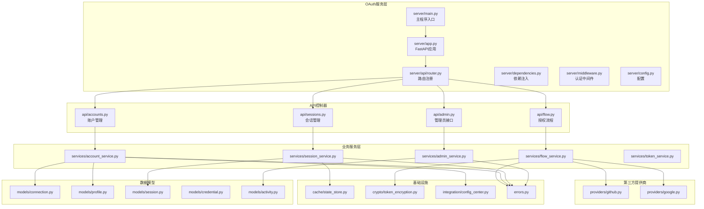
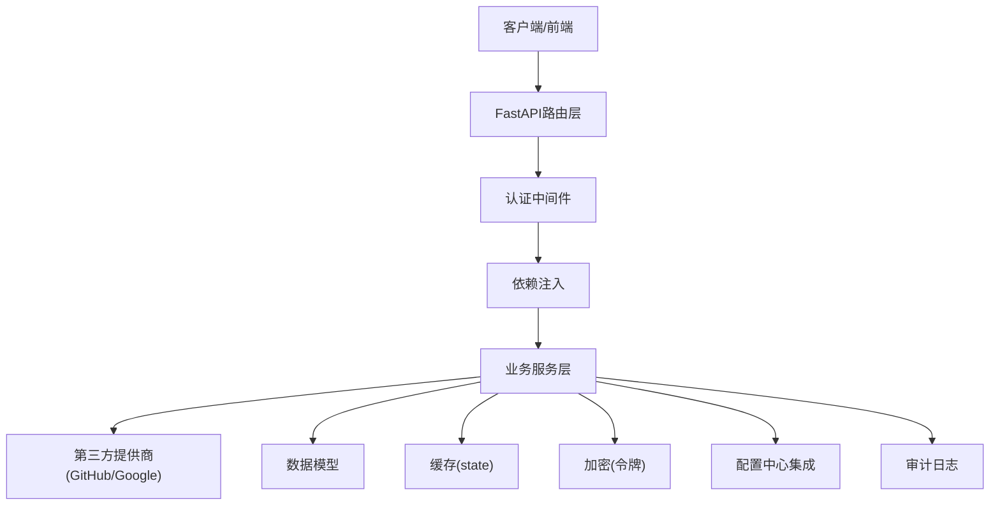
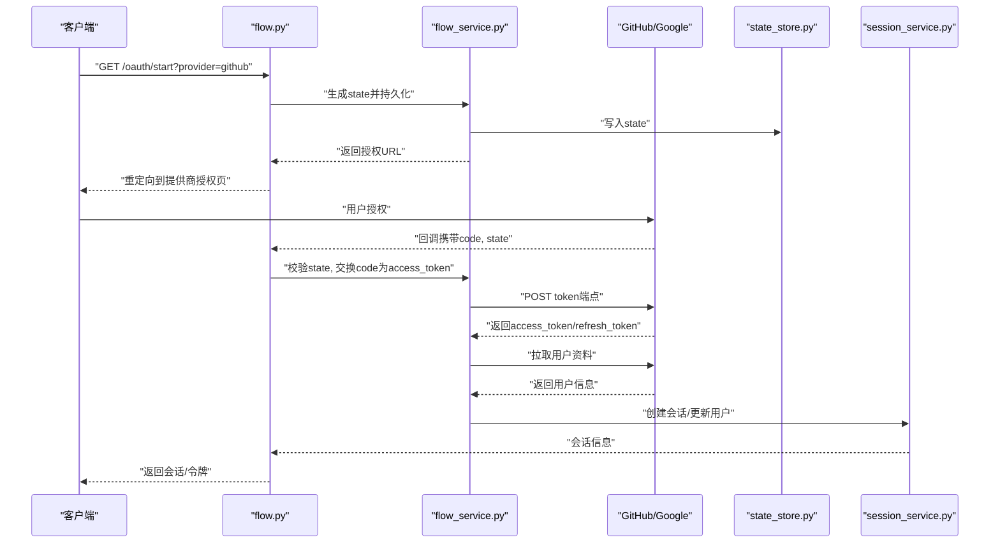
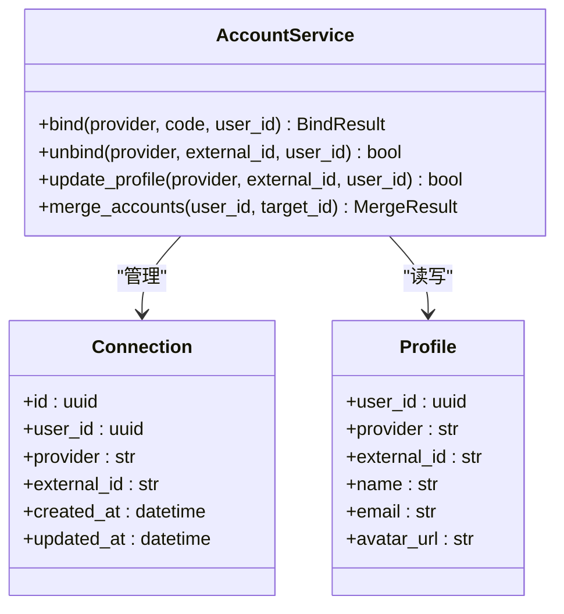
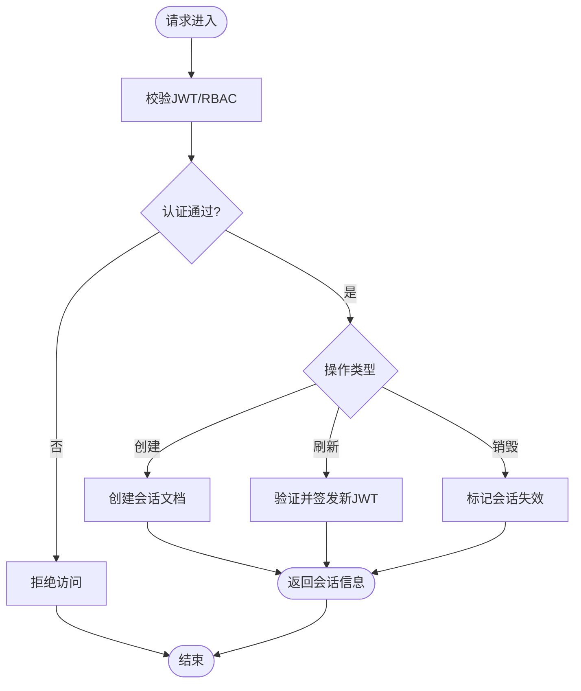
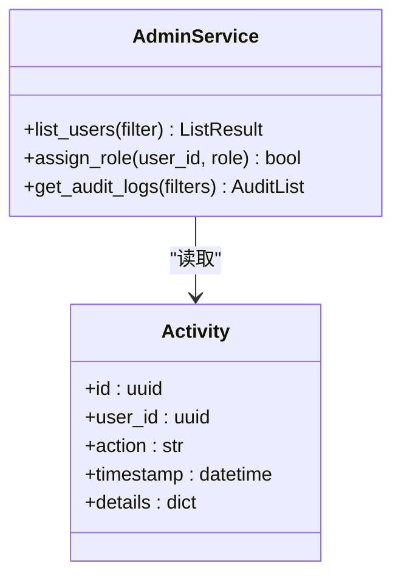
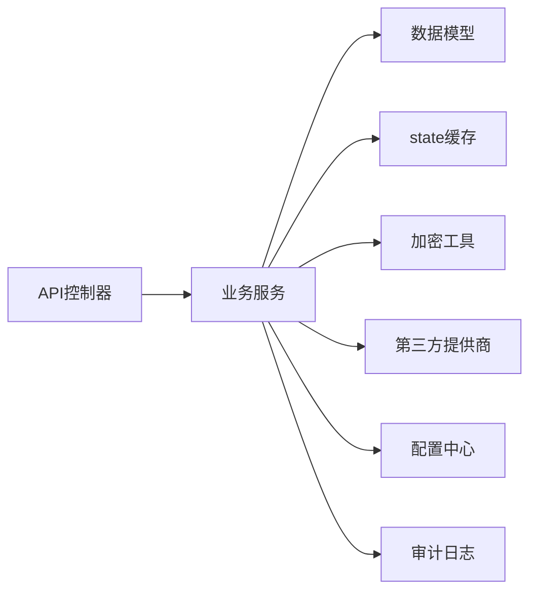

# OAuth集成API

<cite>
**本文引用的文件**
- [README.md](file://README.md)
- [pyproject.toml](file://pyproject.toml)
- [oauth_server_app.py](file://src/taolib/testing/oauth/server/app.py)
- [oauth_server_main.py](file://src/taolib/testing/oauth/server/main.py)
- [oauth_server_router.py](file://src/taolib/testing/oauth/server/api/router.py)
- [oauth_flow_api.py](file://src/taolib/testing/oauth/server/api/flow.py)
- [oauth_accounts_api.py](file://src/taolib/testing/oauth/server/api/accounts.py)
- [oauth_sessions_api.py](file://src/taolib/testing/oauth/server/api/sessions.py)
- [oauth_admin_api.py](file://src/taolib/testing/oauth/server/api/admin.py)
- [oauth_flow_service.py](file://src/taolib/testing/oauth/services/flow_service.py)
- [oauth_account_service.py](file://src/taolib/testing/oauth/services/account_service.py)
- [oauth_session_service.py](file://src/taolib/testing/oauth/services/session_service.py)
- [oauth_admin_service.py](file://src/taolib/testing/oauth/services/admin_service.py)
- [oauth_token_service.py](file://src/taolib/testing/oauth/services/token_service.py)
- [oauth_github_provider.py](file://src/taolib/testing/oauth/providers/github.py)
- [oauth_google_provider.py](file://oauth_google_provider.py](file://src/taolib/testing/oauth/providers/google.py)
- [oauth_connection_model.py](file://src/taolib/testing/oauth/models/connection.py)
- [oauth_profile_model.py](file://src/taolib/testing/oauth/models/profile.py)
- [oauth_session_model.py](file://src/taolib/testing/oauth/models/session.py)
- [oauth_credential_model.py](file://src/taolib/testing/oauth/models/credential.py)
- [oauth_activity_model.py](file://src/taolib/testing/oauth/models/activity.py)
- [oauth_state_store.py](file://src/taolib/testing/oauth/cache/state_store.py)
- [oauth_token_encryption.py](file://src/taolib/testing/oauth/crypto/token_encryption.py)
- [oauth_errors.py](file://src/taolib/testing/oauth/errors.py)
- [oauth_auth_config.py](file://src/taolib/testing/oauth/server/config.py)
- [oauth_auth_dependencies.py](file://src/taolib/testing/oauth/server/dependencies.py)
- [oauth_auth_middleware.py](file://src/taolib/testing/oauth/server/middleware.py)
- [oauth_auth_schemes.py](file://src/taolib/testing/oauth/server/schemes.py)
- [oauth_auth_jwt_handler.py](file://src/taolib/testing/oauth/server/auth/jwt_handler.py)
- [oauth_auth_oauth2.py](file://src/taolib/testing/oauth/server/auth/oauth2.py)
- [oauth_auth_rbac.py](file://src/taolib/testing/oauth/server/auth/rbac.py)
- [oauth_integration_config_center.py](file://src/taolib/testing/oauth/integration/config_center.py)
- [oauth_audit_logger.py](file://src/taolib/testing/audit/logger.py)
- [oauth_audit_models.py](file://src/taolib/testing/audit/models.py)
- [oauth_testing_flow.py](file://tests/testing/test_oauth/test_providers/test_providers.py)
- [oauth_testing_state_store.py](file://tests/testing/test_oauth/test_cache/test_state_store.py)
- [oauth_testing_crypto.py](file://tests/testing/test_oauth/test_crypto.py)
</cite>

## 目录
1. [简介](#简介)
2. [项目结构](#项目结构)
3. [核心组件](#核心组件)
4. [架构总览](#架构总览)
5. [详细组件分析](#详细组件分析)
6. [依赖关系分析](#依赖关系分析)
7. [性能考虑](#性能考虑)
8. [故障排除指南](#故障排除指南)
9. [结论](#结论)
10. [附录](#附录)

## 简介
本文件为OAuth集成API模块的权威技术文档，面向后端开发者与前端集成工程师，系统性阐述第三方OAuth登录（GitHub、Google等）的端到端实现，包括授权码获取、令牌交换、用户信息获取、账户绑定/解绑/更新、会话创建/刷新/销毁、管理员用户管理与审计日志等能力。文档同时覆盖OAuth 2.0授权流程、PKCE安全机制、state参数校验、JWT会话与RBAC权限控制、多账户管理策略与安全防护措施，并提供前后端统一认证接口的集成方案。

## 项目结构
OAuth模块位于`src/taolib/testing/oauth/`目录下，采用按功能域分层的组织方式：
- server：FastAPI服务入口、路由、认证中间件与配置
- services：业务服务层（流程、账户、会话、管理员、令牌）
- providers：第三方提供商适配器（GitHub、Google）
- models：数据模型（连接、凭证、会话、用户资料、活动）
- cache：状态缓存（state校验）
- crypto：令牌加密工具
- integration：与配置中心的集成
- errors：领域错误定义
- testing：单元测试与集成测试

图表来源
- [oauth_server_app.py](file://src/taolib/testing/oauth/server/app.py)
- [oauth_server_main.py](file://src/taolib/testing/oauth/server/main.py)
- [oauth_server_router.py](file://src/taolib/testing/oauth/server/api/router.py)
- [oauth_flow_api.py](file://src/taolib/testing/oauth/server/api/flow.py)
- [oauth_accounts_api.py](file://src/taolib/testing/oauth/server/api/accounts.py)
- [oauth_sessions_api.py](file://src/taolib/testing/oauth/server/api/sessions.py)
- [oauth_admin_api.py](file://src/taolib/testing/oauth/server/api/admin.py)
- [oauth_flow_service.py](file://src/taolib/testing/oauth/services/flow_service.py)
- [oauth_account_service.py](file://src/taolib/testing/oauth/services/account_service.py)
- [oauth_session_service.py](file://src/taolib/testing/oauth/services/session_service.py)
- [oauth_admin_service.py](file://src/taolib/testing/oauth/services/admin_service.py)
- [oauth_token_service.py](file://src/taolib/testing/oauth/services/token_service.py)
- [oauth_github_provider.py](file://src/taolib/testing/oauth/providers/github.py)
- [oauth_google_provider.py](file://src/taolib/testing/oauth/providers/google.py)
- [oauth_connection_model.py](file://src/taolib/testing/oauth/models/connection.py)
- [oauth_profile_model.py](file://src/taolib/testing/oauth/models/profile.py)
- [oauth_session_model.py](file://src/taolib/testing/oauth/models/session.py)
- [oauth_credential_model.py](file://src/taolib/testing/oauth/models/credential.py)
- [oauth_activity_model.py](file://src/taolib/testing/oauth/models/activity.py)
- [oauth_state_store.py](file://src/taolib/testing/oauth/cache/state_store.py)
- [oauth_token_encryption.py](file://src/taolib/testing/oauth/crypto/token_encryption.py)
- [oauth_integration_config_center.py](file://src/taolib/testing/oauth/integration/config_center.py)
- [oauth_errors.py](file://src/taolib/testing/oauth/errors.py)

章节来源
- [README.md:1-100](file://README.md#L1-L100)
- [pyproject.toml:187-203](file://pyproject.toml#L187-L203)

## 核心组件
- 授权流程API：负责生成授权URL、处理回调、完成令牌交换与用户资料拉取
- 账户管理API：支持第三方账户绑定、解绑、信息更新与多账户合并
- 会话管理API：创建、刷新、销毁会话；与JWT/RBAC结合实现权限控制
- 管理员API：用户查询、权限分配、审计日志检索
- 第三方提供商适配器：GitHub、Google等，统一封装授权端点与用户资料
- 数据模型：连接、凭证、会话、用户资料、活动日志
- 缓存与加密：state参数存储、令牌加密
- 集成与错误：与配置中心集成、统一错误处理

章节来源
- [oauth_server_router.py](file://src/taolib/testing/oauth/server/api/router.py)
- [oauth_flow_api.py](file://src/taolib/testing/oauth/server/api/flow.py)
- [oauth_accounts_api.py](file://src/taolib/testing/oauth/server/api/accounts.py)
- [oauth_sessions_api.py](file://src/taolib/testing/oauth/server/api/sessions.py)
- [oauth_admin_api.py](file://src/taolib/testing/oauth/server/api/admin.py)
- [oauth_github_provider.py](file://src/taolib/testing/oauth/providers/github.py)
- [oauth_google_provider.py](file://src/taolib/testing/oauth/providers/google.py)
- [oauth_connection_model.py](file://src/taolib/testing/oauth/models/connection.py)
- [oauth_profile_model.py](file://src/taolib/testing/oauth/models/profile.py)
- [oauth_session_model.py](file://src/taolib/testing/oauth/models/session.py)
- [oauth_credential_model.py](file://src/taolib/testing/oauth/models/credential.py)
- [oauth_activity_model.py](file://src/taolib/testing/oauth/models/activity.py)
- [oauth_state_store.py](file://src/taolib/testing/oauth/cache/state_store.py)
- [oauth_token_encryption.py](file://src/taolib/testing/oauth/crypto/token_encryption.py)
- [oauth_integration_config_center.py](file://src/taolib/testing/oauth/integration/config_center.py)
- [oauth_errors.py](file://src/taolib/testing/oauth/errors.py)

## 架构总览
OAuth服务基于FastAPI构建，采用中间件+依赖注入+服务层的分层架构。认证方案支持JWT与OAuth2，RBAC用于权限控制。第三方提供商通过统一接口抽象，便于扩展更多平台。

图表来源
- [oauth_server_router.py](file://src/taolib/testing/oauth/server/api/router.py)
- [oauth_auth_middleware.py](file://src/taolib/testing/oauth/server/middleware.py)
- [oauth_auth_dependencies.py](file://src/taolib/testing/oauth/server/dependencies.py)
- [oauth_flow_service.py](file://src/taolib/testing/oauth/services/flow_service.py)
- [oauth_account_service.py](file://src/taolib/testing/oauth/services/account_service.py)
- [oauth_session_service.py](file://src/taolib/testing/oauth/services/session_service.py)
- [oauth_token_service.py](file://src/taolib/testing/oauth/services/token_service.py)
- [oauth_github_provider.py](file://src/taolib/testing/oauth/providers/github.py)
- [oauth_google_provider.py](file://src/taolib/testing/oauth/providers/google.py)
- [oauth_state_store.py](file://src/taolib/testing/oauth/cache/state_store.py)
- [oauth_token_encryption.py](file://src/taolib/testing/oauth/crypto/token_encryption.py)
- [oauth_integration_config_center.py](file://src/taolib/testing/oauth/integration/config_center.py)
- [oauth_audit_logger.py](file://src/taolib/testing/audit/logger.py)

## 详细组件分析

### 授权流程接口（Authorization Flow）
- 功能要点
  - 生成授权URL（含state、PKCE code_challenge）
  - 处理回调（state校验、PKCE code_verifier交换令牌）
  - 用户资料拉取与账户映射
  - 会话创建与返回
- 关键流程图

图表来源
- [oauth_flow_api.py](file://src/taolib/testing/oauth/server/api/flow.py)
- [oauth_flow_service.py](file://src/taolib/testing/oauth/services/flow_service.py)
- [oauth_github_provider.py](file://src/taolib/testing/oauth/providers/github.py)
- [oauth_google_provider.py](file://src/taolib/testing/oauth/providers/google.py)
- [oauth_state_store.py](file://src/taolib/testing/oauth/cache/state_store.py)
- [oauth_session_service.py](file://src/taolib/testing/oauth/services/session_service.py)

章节来源
- [oauth_flow_api.py](file://src/taolib/testing/oauth/server/api/flow.py)
- [oauth_flow_service.py](file://src/taolib/testing/oauth/services/flow_service.py)
- [oauth_state_store.py](file://src/taolib/testing/oauth/cache/state_store.py)

### 账户管理接口（Account Management）
- 功能要点
  - 绑定第三方账户（同一用户可多账户）
  - 解绑第三方账户（保留本地账户）
  - 更新账户信息（同步第三方资料）
  - 多账户合并与冲突处理
- 类图

图表来源
- [oauth_account_service.py](file://src/taolib/testing/oauth/services/account_service.py)
- [oauth_connection_model.py](file://src/taolib/testing/oauth/models/connection.py)
- [oauth_profile_model.py](file://src/taolib/testing/oauth/models/profile.py)

章节来源
- [oauth_accounts_api.py](file://src/taolib/testing/oauth/server/api/accounts.py)
- [oauth_account_service.py](file://src/taolib/testing/oauth/services/account_service.py)
- [oauth_connection_model.py](file://src/taolib/testing/oauth/models/connection.py)
- [oauth_profile_model.py](file://src/taolib/testing/oauth/models/profile.py)

### 会话管理接口（Session Management）
- 功能要点
  - 创建会话（首次登录/绑定后）
  - 刷新会话（基于刷新令牌）
  - 销毁会话（登出）
  - 与JWT/RBAC结合进行权限校验
- 流程图

图表来源
- [oauth_sessions_api.py](file://src/taolib/testing/oauth/server/api/sessions.py)
- [oauth_session_service.py](file://src/taolib/testing/oauth/services/session_service.py)
- [oauth_auth_jwt_handler.py](file://src/taolib/testing/oauth/server/auth/jwt_handler.py)
- [oauth_auth_rbac.py](file://src/taolib/testing/oauth/server/auth/rbac.py)

章节来源
- [oauth_sessions_api.py](file://src/taolib/testing/oauth/server/api/sessions.py)
- [oauth_session_service.py](file://src/taolib/testing/oauth/services/session_service.py)

### 管理员接口（Admin）
- 功能要点
  - 查询用户列表与状态
  - 分配角色与权限
  - 审计日志检索与导出
- 类图

图表来源
- [oauth_admin_api.py](file://src/taolib/testing/oauth/server/api/admin.py)
- [oauth_admin_service.py](file://src/taolib/testing/oauth/services/admin_service.py)
- [oauth_activity_model.py](file://src/taolib/testing/oauth/models/activity.py)
- [oauth_audit_logger.py](file://src/taolib/testing/audit/logger.py)

章节来源
- [oauth_admin_api.py](file://src/taolib/testing/oauth/server/api/admin.py)
- [oauth_admin_service.py](file://src/taolib/testing/oauth/services/admin_service.py)
- [oauth_activity_model.py](file://src/taolib/testing/oauth/models/activity.py)

### 第三方提供商集成（GitHub/Google）
- 统一接口抽象：提供标准方法（获取授权URL、交换令牌、拉取用户资料）
- GitHub：使用REST API获取用户信息
- Google：使用OpenID Connect获取ID Token与用户资料
- 错误处理：网络异常、速率限制、字段缺失等

章节来源
- [oauth_github_provider.py](file://src/taolib/testing/oauth/providers/github.py)
- [oauth_google_provider.py](file://src/taolib/testing/oauth/providers/google.py)

### OAuth 2.0与PKCE、state校验
- 授权码流程：生成state并缓存，回调时校验；PKCE使用S256变换与code_challenge
- 安全机制：state防CSRF、code_verifier一次性、短生命周期state
- 实现位置：state存储、令牌交换、用户资料拉取

章节来源
- [oauth_state_store.py](file://src/taolib/testing/oauth/cache/state_store.py)
- [oauth_flow_service.py](file://src/taolib/testing/oauth/services/flow_service.py)

### 令牌加密与安全
- 令牌加密：对refresh_token等敏感信息进行加密存储
- 加密工具：密钥生成与加解密封装
- 存储安全：避免明文落库，配合最小权限原则

章节来源
- [oauth_token_encryption.py](file://src/taolib/testing/oauth/crypto/token_encryption.py)
- [oauth_token_service.py](file://src/taolib/testing/oauth/services/token_service.py)

### 权限继承与RBAC
- JWT：签发与解析，承载用户标识与角色
- RBAC：基于角色的权限控制，支持细粒度资源授权
- 中间件：统一鉴权与权限校验

章节来源
- [oauth_auth_jwt_handler.py](file://src/taolib/testing/oauth/server/auth/jwt_handler.py)
- [oauth_auth_rbac.py](file://src/taolib/testing/oauth/server/auth/rbac.py)
- [oauth_auth_middleware.py](file://src/taolib/testing/oauth/server/middleware.py)

### 前端集成方案
- 前端触发：调用“开始授权”接口，接收授权URL并跳转
- 回调处理：前端监听回调，向后端发起“完成授权”请求
- 会话持久化：前端存储JWT，请求头携带Authorization
- 多账户：前端展示用户绑定的多个第三方账户，支持切换

章节来源
- [oauth_flow_api.py](file://src/taolib/testing/oauth/server/api/flow.py)
- [oauth_sessions_api.py](file://src/taolib/testing/oauth/server/api/sessions.py)

## 依赖关系分析
- 服务依赖：API控制器依赖服务层；服务层依赖模型、缓存、加密、提供商与配置中心
- 外部依赖：FastAPI、httpx、motor、redis、python-jose、cryptography
- 配置：通过配置中心集中管理提供商凭据与安全参数

图表来源
- [oauth_server_router.py](file://src/taolib/testing/oauth/server/api/router.py)
- [oauth_flow_service.py](file://src/taolib/testing/oauth/services/flow_service.py)
- [oauth_account_service.py](file://src/taolib/testing/oauth/services/account_service.py)
- [oauth_session_service.py](file://src/taolib/testing/oauth/services/session_service.py)
- [oauth_integration_config_center.py](file://src/taolib/testing/oauth/integration/config_center.py)

章节来源
- [pyproject.toml:187-203](file://pyproject.toml#L187-L203)

## 性能考虑
- 缓存优化：state与会话信息使用Redis，降低数据库压力
- 异步处理：HTTP请求与数据库操作异步化，提升并发
- 连接池：数据库与HTTP客户端复用连接
- 限流与熔断：结合速率限制中间件与超时设置
- 日志与监控：审计日志与指标上报，便于问题定位

## 故障排除指南
- 常见错误
  - state不匹配：检查state是否被篡改或过期
  - code_verifier不正确：确保前端生成与后端存储一致
  - 提供商返回错误：检查client_id/secret与作用域配置
  - 会话无效：确认JWT签名与过期时间
- 排查步骤
  - 查看审计日志与错误码
  - 核对配置中心中的提供商凭据
  - 检查缓存中state是否存在与过期
  - 确认加密密钥与算法一致性

章节来源
- [oauth_errors.py](file://src/taolib/testing/oauth/errors.py)
- [oauth_audit_logger.py](file://src/taolib/testing/audit/logger.py)
- [oauth_state_store.py](file://src/taolib/testing/oauth/cache/state_store.py)

## 结论
该OAuth集成API模块提供了完整的第三方登录解决方案，涵盖授权流程、账户管理、会话与权限控制、审计与安全等关键能力。通过标准化的提供商适配器与服务层设计，具备良好的扩展性与安全性，适合在企业级系统中作为统一认证与授权中枢使用。

## 附录

### API端点概览（按模块）
- 授权流程
  - GET /oauth/start?provider={github|google}：生成授权URL
  - GET /oauth/callback：处理回调并完成令牌交换
- 账户管理
  - POST /oauth/accounts/bind：绑定第三方账户
  - POST /oauth/accounts/unbind：解绑第三方账户
  - PUT /oauth/accounts/profile：更新账户信息
- 会话管理
  - POST /oauth/sessions：创建会话
  - POST /oauth/sessions/refresh：刷新会话
  - DELETE /oauth/sessions：销毁会话
- 管理员
  - GET /oauth/admin/users：查询用户列表
  - POST /oauth/admin/users/{id}/roles：分配角色
  - GET /oauth/admin/audit：获取审计日志

章节来源
- [oauth_flow_api.py](file://src/taolib/testing/oauth/server/api/flow.py)
- [oauth_accounts_api.py](file://src/taolib/testing/oauth/server/api/accounts.py)
- [oauth_sessions_api.py](file://src/taolib/testing/oauth/server/api/sessions.py)
- [oauth_admin_api.py](file://src/taolib/testing/oauth/server/api/admin.py)