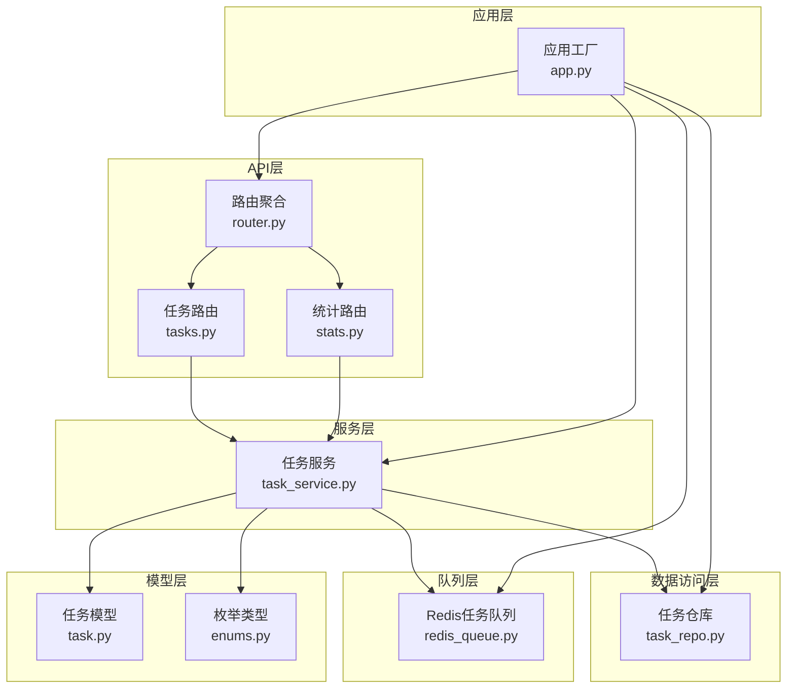
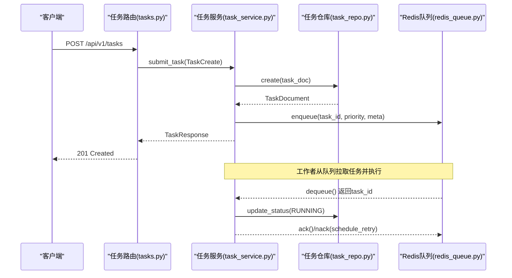
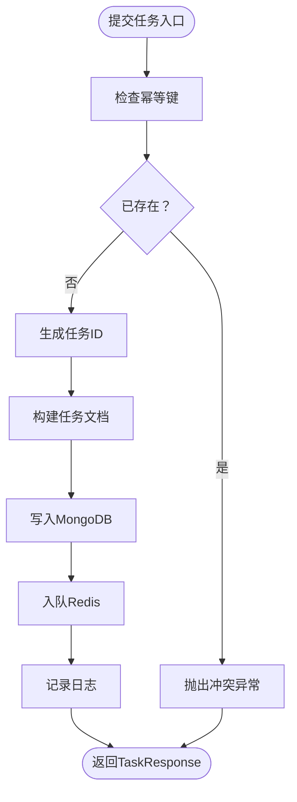
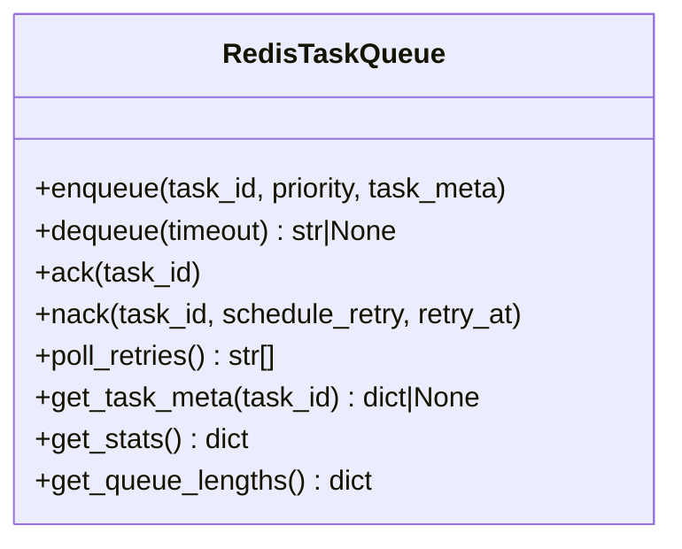
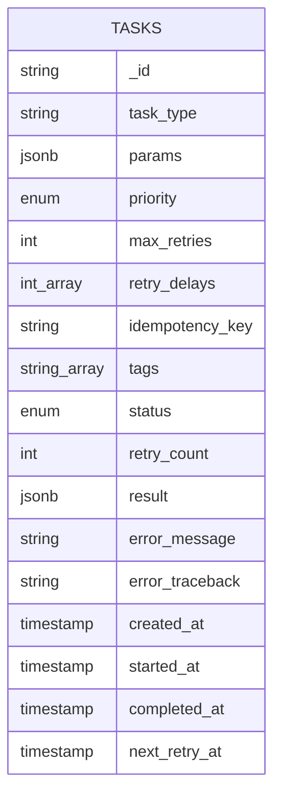
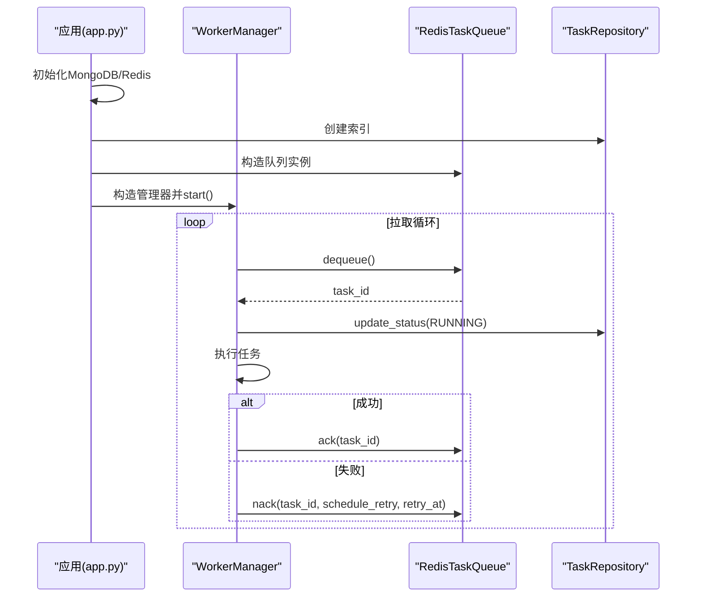
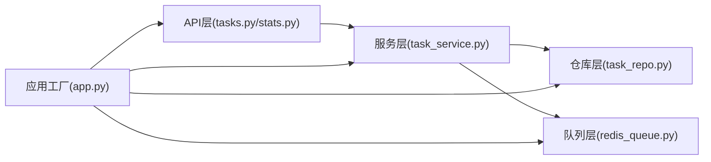

# 任务队列API

<cite>
**本文引用的文件**
- [src/taolib/testing/task_queue/server/api/tasks.py](file://src/taolib/testing/task_queue/server/api/tasks.py)
- [src/taolib/testing/task_queue/server/api/stats.py](file://src/taolib/testing/task_queue/server/api/stats.py)
- [src/taolib/testing/task_queue/models/task.py](file://src/taolib/testing/task_queue/models/task.py)
- [src/taolib/testing/task_queue/models/enums.py](file://src/taolib/testing/task_queue/models/enums.py)
- [src/taolib/testing/task_queue/services/task_service.py](file://src/taolib/testing/task_queue/services/task_service.py)
- [src/taolib/testing/task_queue/queue/redis_queue.py](file://src/taolib/testing/task_queue/queue/redis_queue.py)
- [src/taolib/testing/task_queue/repository/task_repo.py](file://src/taolib/testing/task_queue/repository/task_repo.py)
- [src/taolib/testing/task_queue/server/api/router.py](file://src/taolib/testing/task_queue/server/api/router.py)
- [src/taolib/testing/task_queue/server/app.py](file://src/taolib/testing/task_queue/server/app.py)
</cite>

## 目录
1. [简介](#简介)
2. [项目结构](#项目结构)
3. [核心组件](#核心组件)
4. [架构总览](#架构总览)
5. [详细组件分析](#详细组件分析)
6. [依赖关系分析](#依赖关系分析)
7. [性能考量](#性能考量)
8. [故障排查指南](#故障排查指南)
9. [结论](#结论)
10. [附录](#附录)

## 简介
本文件为任务队列API模块的全面技术文档，覆盖任务创建（同步/异步/定时）、任务状态查询、任务管理（取消/重试/删除）、统计监控（队列长度/执行时间/失败率）等全部端点与机制。文档同时阐述任务调度机制、优先级管理、重试策略与故障恢复、Redis队列数据结构、任务序列化、工作进程负载均衡、生命周期管理、错误处理与性能监控，并提供WebSocket实时状态推送与批量任务处理最佳实践。

## 项目结构
任务队列API采用分层架构：FastAPI路由层负责HTTP接口定义；服务层封装业务逻辑；仓库层负责MongoDB持久化；队列层基于Redis实现优先级队列与重试调度；应用工厂负责生命周期管理与工作进程启动。

图表来源
- [src/taolib/testing/task_queue/server/api/router.py:1-15](file://src/taolib/testing/task_queue/server/api/router.py#L1-L15)
- [src/taolib/testing/task_queue/server/api/tasks.py:1-205](file://src/taolib/testing/task_queue/server/api/tasks.py#L1-L205)
- [src/taolib/testing/task_queue/server/api/stats.py:1-65](file://src/taolib/testing/task_queue/server/api/stats.py#L1-L65)
- [src/taolib/testing/task_queue/services/task_service.py:1-259](file://src/taolib/testing/task_queue/services/task_service.py#L1-L259)
- [src/taolib/testing/task_queue/queue/redis_queue.py:1-317](file://src/taolib/testing/task_queue/queue/redis_queue.py#L1-L317)
- [src/taolib/testing/task_queue/repository/task_repo.py:1-169](file://src/taolib/testing/task_queue/repository/task_repo.py#L1-L169)
- [src/taolib/testing/task_queue/models/task.py:1-107](file://src/taolib/testing/task_queue/models/task.py#L1-L107)
- [src/taolib/testing/task_queue/models/enums.py:1-28](file://src/taolib/testing/task_queue/models/enums.py#L1-L28)
- [src/taolib/testing/task_queue/server/app.py:1-394](file://src/taolib/testing/task_queue/server/app.py#L1-L394)

章节来源
- [src/taolib/testing/task_queue/server/api/router.py:1-15](file://src/taolib/testing/task_queue/server/api/router.py#L1-L15)
- [src/taolib/testing/task_queue/server/app.py:1-394](file://src/taolib/testing/task_queue/server/app.py#L1-L394)

## 核心组件
- 路由与控制器
  - 任务路由：提供任务提交、查询、重试、取消、删除等端点。
  - 统计路由：提供全局统计与队列深度查询端点。
- 服务层
  - 任务服务：封装提交、查询、重试、取消、列表筛选、统计合并等业务逻辑。
- 数据模型
  - 任务模型：Pydantic四层模型（Base/Create/Response/Document），统一输入输出与存储。
  - 枚举类型：任务状态与优先级。
- 仓库层
  - 任务仓库：基于Motor的MongoDB访问，提供多条件查询、索引与TTL。
- 队列层
  - Redis任务队列：基于List实现优先级队列，ZSet实现重试调度，Hash缓存任务元数据，SET维护运行中/失败任务集合。
- 应用工厂
  - 生命周期管理：连接数据库与Redis，创建索引，启动工作进程管理器。

章节来源
- [src/taolib/testing/task_queue/server/api/tasks.py:1-205](file://src/taolib/testing/task_queue/server/api/tasks.py#L1-L205)
- [src/taolib/testing/task_queue/server/api/stats.py:1-65](file://src/taolib/testing/task_queue/server/api/stats.py#L1-L65)
- [src/taolib/testing/task_queue/services/task_service.py:1-259](file://src/taolib/testing/task_queue/services/task_service.py#L1-L259)
- [src/taolib/testing/task_queue/models/task.py:1-107](file://src/taolib/testing/task_queue/models/task.py#L1-L107)
- [src/taolib/testing/task_queue/models/enums.py:1-28](file://src/taolib/testing/task_queue/models/enums.py#L1-L28)
- [src/taolib/testing/task_queue/repository/task_repo.py:1-169](file://src/taolib/testing/task_queue/repository/task_repo.py#L1-L169)
- [src/taolib/testing/task_queue/queue/redis_queue.py:1-317](file://src/taolib/testing/task_queue/queue/redis_queue.py#L1-L317)
- [src/taolib/testing/task_queue/server/app.py:1-394](file://src/taolib/testing/task_queue/server/app.py#L1-L394)

## 架构总览
任务队列API采用“HTTP接口 + 任务服务 + Redis队列 + MongoDB仓库”的分层架构。工作进程通过WorkerManager拉取任务，执行后通过ack/nack完成生命周期闭环。

图表来源
- [src/taolib/testing/task_queue/server/api/tasks.py:117-140](file://src/taolib/testing/task_queue/server/api/tasks.py#L117-L140)
- [src/taolib/testing/task_queue/services/task_service.py:43-94](file://src/taolib/testing/task_queue/services/task_service.py#L43-L94)
- [src/taolib/testing/task_queue/queue/redis_queue.py:81-103](file://src/taolib/testing/task_queue/queue/redis_queue.py#L81-L103)
- [src/taolib/testing/task_queue/repository/task_repo.py:92-109](file://src/taolib/testing/task_queue/repository/task_repo.py#L92-L109)

## 详细组件分析

### API端点定义与行为
- 任务创建
  - 方法与路径：POST /api/v1/tasks
  - 请求体：SubmitTaskRequest（任务类型、参数、优先级、最大重试次数、重试延迟、幂等键、标签）
  - 响应：TaskResponse（包含任务ID、状态、重试计数、结果、错误信息、时间戳等）
  - 行为：幂等键检查、生成任务ID、写入MongoDB、入队Redis、记录统计
- 任务查询
  - 列表查询：GET /api/v1/tasks（支持status、task_type、priority、skip、limit过滤）
  - 单个查询：GET /api/v1/tasks/{task_id}
- 任务管理
  - 重试：POST /api/v1/tasks/{task_id}/retry（仅FAILED任务）
  - 取消：POST /api/v1/tasks/{task_id}/cancel（仅PENDING/RETRYING任务）
  - 删除：DELETE /api/v1/tasks/{task_id}（仅终态：COMPLETED/FAILED/CANCELLED）
- 统计监控
  - 全局统计：GET /api/v1/stats
  - 队列深度：GET /api/v1/stats/queue-depths

章节来源
- [src/taolib/testing/task_queue/server/api/tasks.py:79-205](file://src/taolib/testing/task_queue/server/api/tasks.py#L79-L205)
- [src/taolib/testing/task_queue/server/api/stats.py:37-65](file://src/taolib/testing/task_queue/server/api/stats.py#L37-L65)

### 任务服务与业务逻辑
- 提交任务：幂等键冲突检测、MongoDB写入、Redis入队、统计累加
- 查询任务：按ID查询、按条件过滤列表
- 重试任务：校验状态为FAILED，重置状态并重新入队
- 取消任务：仅允许PENDING/RETRYING，标记为CANCELLED
- 统计合并：Redis实时统计 + MongoDB持久计数

图表来源
- [src/taolib/testing/task_queue/services/task_service.py:43-94](file://src/taolib/testing/task_queue/services/task_service.py#L43-L94)

章节来源
- [src/taolib/testing/task_queue/services/task_service.py:1-259](file://src/taolib/testing/task_queue/services/task_service.py#L1-L259)

### Redis队列数据结构与调度
- 键空间设计
  - {prefix}:queue:{high|normal|low}：LIST，按优先级存放任务ID
  - {prefix}:running：SET，运行中任务ID
  - {prefix}:completed：LIST，最近完成任务ID（上限1000）
  - {prefix}:failed：SET，失败任务ID
  - {prefix}:retry：ZSET，score为下次重试时间戳
  - {prefix}:task:{id}：HASH，缓存任务元数据
  - {prefix}:stats：HASH，全局计数器
- 调度机制
  - 出队：BRPOP按优先级顺序阻塞弹出
  - 成功：移出运行集、推入完成列表、清理元数据、统计+1
  - 失败：可选择入重试ZSET或直接标记失败集
  - 重试轮询：按当前时间从ZSET取出到期任务并重新入队对应优先级

图表来源
- [src/taolib/testing/task_queue/queue/redis_queue.py:14-317](file://src/taolib/testing/task_queue/queue/redis_queue.py#L14-L317)

章节来源
- [src/taolib/testing/task_queue/queue/redis_queue.py:1-317](file://src/taolib/testing/task_queue/queue/redis_queue.py#L1-L317)

### MongoDB模型与索引
- 模型层次
  - TaskBase：任务基础字段（类型、参数、优先级、重试策略、幂等键、标签）
  - TaskCreate：创建输入
  - TaskUpdate：更新输入（状态、重试计数、结果、错误信息、时间戳等）
  - TaskResponse：API响应模型
  - TaskDocument：MongoDB文档模型（含默认状态与时间戳）
- 索引策略
  - task_type：便于按类型查询
  - (status, priority)：复合索引，支持快速筛选
  - idempotency_key：唯一稀疏索引，支持幂等键去重
  - created_at：TTL 30天，自动清理历史任务

图表来源
- [src/taolib/testing/task_queue/models/task.py:68-107](file://src/taolib/testing/task_queue/models/task.py#L68-L107)
- [src/taolib/testing/task_queue/repository/task_repo.py:159-166](file://src/taolib/testing/task_queue/repository/task_repo.py#L159-L166)

章节来源
- [src/taolib/testing/task_queue/models/task.py:1-107](file://src/taolib/testing/task_queue/models/task.py#L1-L107)
- [src/taolib/testing/task_queue/repository/task_repo.py:1-169](file://src/taolib/testing/task_queue/repository/task_repo.py#L1-L169)

### 应用生命周期与工作进程
- 生命周期
  - 启动：连接MongoDB与Redis，创建索引，初始化RedisTaskQueue与TaskRepository，注册WorkerManager并启动
  - 关闭：停止WorkerManager，关闭Redis与MongoDB连接
- 工作进程
  - WorkerManager负责拉取任务、执行、ACK/NACK、重试轮询与统计更新

图表来源
- [src/taolib/testing/task_queue/server/app.py:19-67](file://src/taolib/testing/task_queue/server/app.py#L19-L67)
- [src/taolib/testing/task_queue/queue/redis_queue.py:81-157](file://src/taolib/testing/task_queue/queue/redis_queue.py#L81-L157)

章节来源
- [src/taolib/testing/task_queue/server/app.py:1-394](file://src/taolib/testing/task_queue/server/app.py#L1-L394)

## 依赖关系分析
- 组件耦合
  - API层依赖服务层；服务层依赖仓库层与队列层；应用工厂统一装配各组件。
- 外部依赖
  - Redis：异步客户端，键空间与数据结构
  - MongoDB：Motor异步驱动，集合与索引
- 循环依赖
  - 未发现循环导入；各层职责清晰，接口契约明确。

图表来源
- [src/taolib/testing/task_queue/server/api/tasks.py:34-44](file://src/taolib/testing/task_queue/server/api/tasks.py#L34-L44)
- [src/taolib/testing/task_queue/server/api/stats.py:40-48](file://src/taolib/testing/task_queue/server/api/stats.py#L40-L48)
- [src/taolib/testing/task_queue/services/task_service.py:29-41](file://src/taolib/testing/task_queue/services/task_service.py#L29-L41)
- [src/taolib/testing/task_queue/server/app.py:44-53](file://src/taolib/testing/task_queue/server/app.py#L44-L53)

章节来源
- [src/taolib/testing/task_queue/server/api/tasks.py:1-205](file://src/taolib/testing/task_queue/server/api/tasks.py#L1-L205)
- [src/taolib/testing/task_queue/server/api/stats.py:1-65](file://src/taolib/testing/task_queue/server/api/stats.py#L1-L65)
- [src/taolib/testing/task_queue/services/task_service.py:1-259](file://src/taolib/testing/task_queue/services/task_service.py#L1-L259)
- [src/taolib/testing/task_queue/server/app.py:1-394](file://src/taolib/testing/task_queue/server/app.py#L1-L394)

## 性能考量
- Redis键空间与原子操作
  - 使用pipeline事务减少RTT，确保入队、统计累加与状态变更原子性。
- 队列深度与优先级
  - 高优队列优先级最高，避免饥饿；合理分配workers数量以平衡队列深度。
- MongoDB索引
  - 复合索引与TTL降低查询成本与存储压力。
- 重试策略
  - 指数退避与ZSET调度，避免热点任务反复争抢。
- 监控与告警
  - 统计端点暴露队列长度、运行中/失败任务数，结合仪表板实现可视化监控。

## 故障排查指南
- 常见问题与定位
  - 任务无法入队：检查Redis连接与键前缀配置；确认pipeline执行是否成功。
  - 任务状态不一致：核对ack/nack调用时机与状态更新流程。
  - 重试未生效：确认nack是否schedule_retry且retry_at正确写入ZSET。
  - 查询为空：检查过滤条件与索引是否生效。
- 错误码与提示
  - 404：任务不存在（查询/重试/取消/删除）
  - 400：状态不允许（取消/删除）
  - 409：幂等键冲突（提交）

章节来源
- [src/taolib/testing/task_queue/server/api/tasks.py:104-114](file://src/taolib/testing/task_queue/server/api/tasks.py#L104-L114)
- [src/taolib/testing/task_queue/server/api/tasks.py:142-158](file://src/taolib/testing/task_queue/server/api/tasks.py#L142-L158)
- [src/taolib/testing/task_queue/server/api/tasks.py:161-177](file://src/taolib/testing/task_queue/server/api/tasks.py#L161-L177)
- [src/taolib/testing/task_queue/server/api/tasks.py:180-197](file://src/taolib/testing/task_queue/server/api/tasks.py#L180-L197)

## 结论
该任务队列API模块通过清晰的分层设计与完善的Redis/MongoDB数据结构，实现了高可用、可观测、可扩展的任务调度系统。结合幂等提交、优先级队列、指数退避重试与统计监控，能够满足生产环境的稳定性与性能需求。建议在实际部署中配合负载均衡与水平扩展，持续优化workers数量与队列深度阈值。

## 附录

### API端点一览
- 任务
  - GET /api/v1/tasks
  - GET /api/v1/tasks/{task_id}
  - POST /api/v1/tasks
  - POST /api/v1/tasks/{task_id}/retry
  - POST /api/v1/tasks/{task_id}/cancel
  - DELETE /api/v1/tasks/{task_id}
- 统计
  - GET /api/v1/stats
  - GET /api/v1/stats/queue-depths

章节来源
- [src/taolib/testing/task_queue/server/api/router.py:7-12](file://src/taolib/testing/task_queue/server/api/router.py#L7-L12)
- [src/taolib/testing/task_queue/server/api/tasks.py:79-205](file://src/taolib/testing/task_queue/server/api/tasks.py#L79-L205)
- [src/taolib/testing/task_queue/server/api/stats.py:37-65](file://src/taolib/testing/task_queue/server/api/stats.py#L37-L65)

### 任务状态与优先级
- 状态：PENDING、RUNNING、COMPLETED、FAILED、RETRYING、CANCELLED
- 优先级：HIGH、NORMAL、LOW

章节来源
- [src/taolib/testing/task_queue/models/enums.py:9-26](file://src/taolib/testing/task_queue/models/enums.py#L9-L26)

### WebSocket实时推送与批量处理最佳实践
- WebSocket推送
  - 建议在应用层集成WebSocket通道，订阅任务状态变更事件，向客户端推送增量更新。
- 批量任务
  - 提交时使用幂等键避免重复；批量执行时按优先级拆分批次，控制单批并发度；完成后统一ACK/NACK并记录汇总统计。

[本节为概念性指导，无需代码来源]