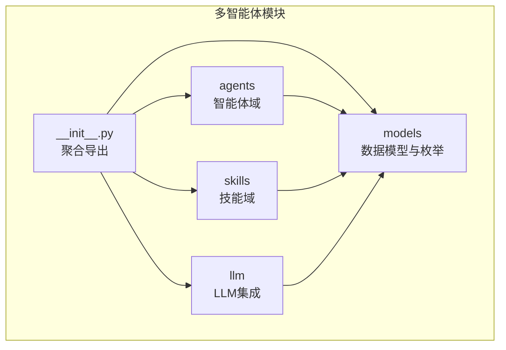
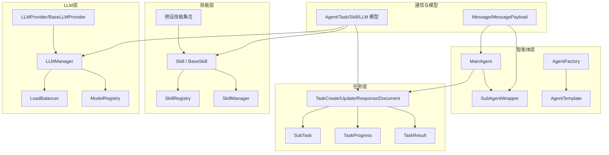
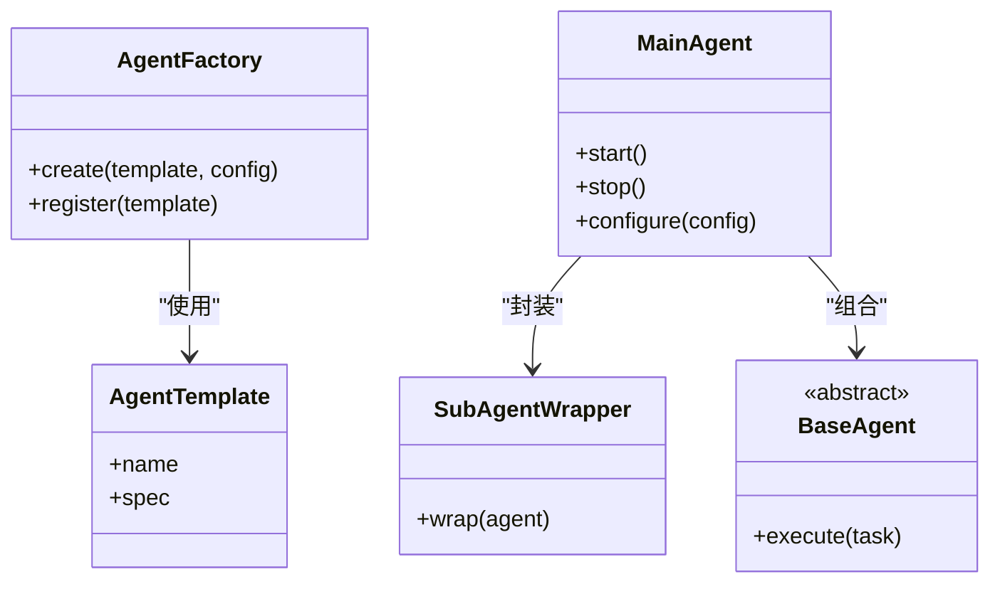
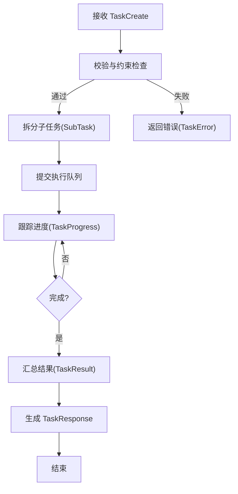
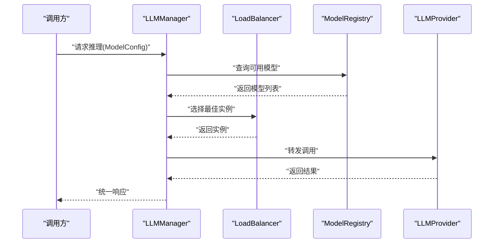
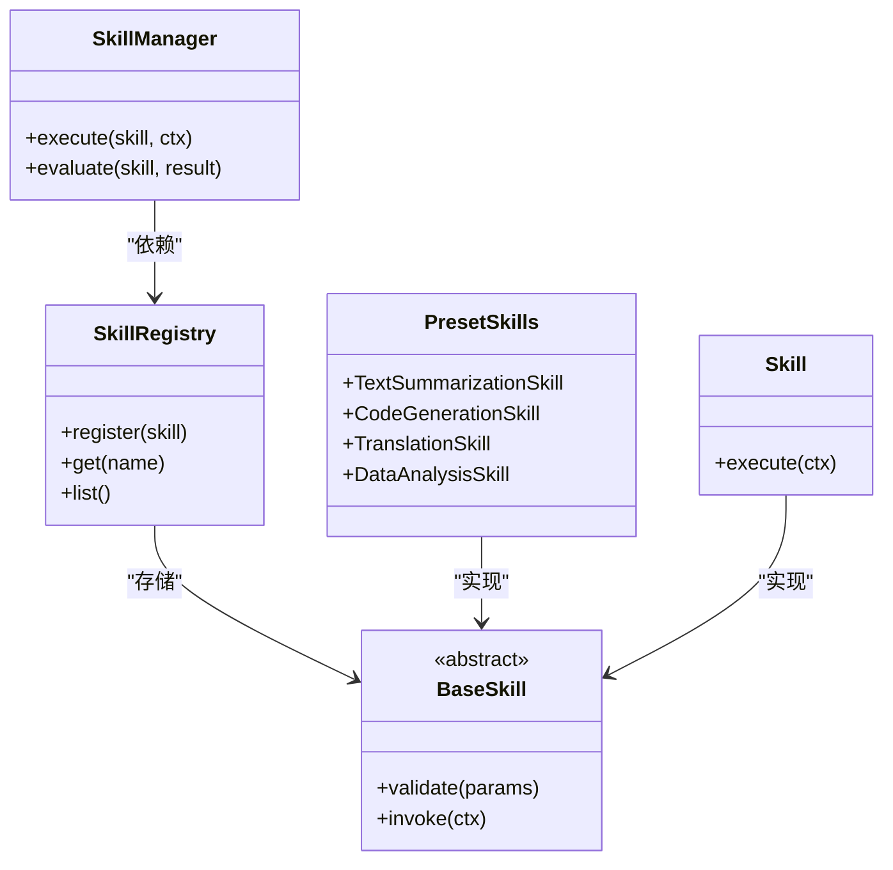
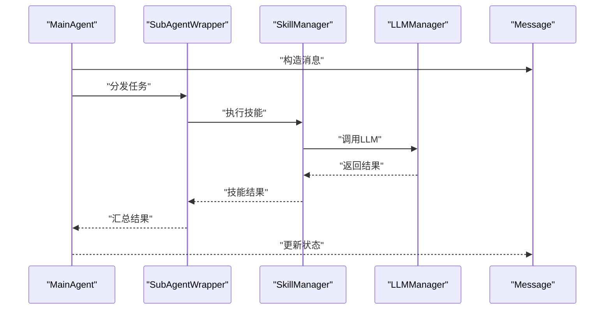
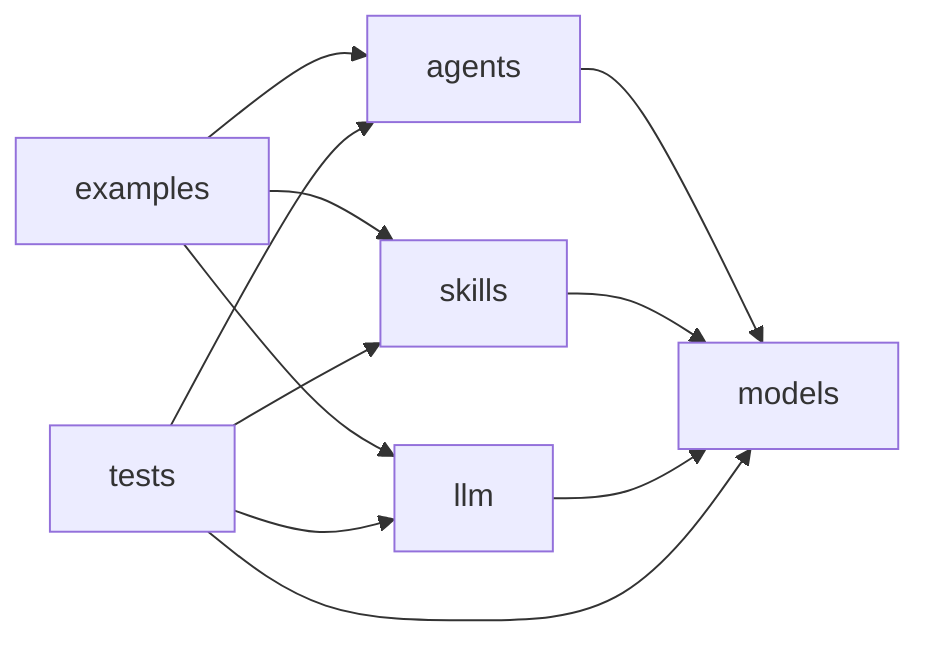

# 多智能体API

<cite>
**本文引用的文件**
- [src/taolib/testing/multi_agent/__init__.py](file://src/taolib/testing/multi_agent/__init__.py)
- [src/taolib/testing/multi_agent/agents/__init__.py](file://src/taolib/testing/multi_agent/agents/__init__.py)
- [src/taolib/testing/multi_agent/models/__init__.py](file://src/taolib/testing/multi_agent/models/__init__.py)
- [src/taolib/testing/multi_agent/skills/__init__.py](file://src/taolib/testing/multi_agent/skills/__init__.py)
- [src/taolib/testing/multi_agent/llm/__init__.py](file://src/taolib/testing/multi_agent/llm/__init__.py)
- [examples/multi_agent_example.py](file://examples/multi_agent_example.py)
- [tests/testing/test_multi_agent/test_agents.py](file://tests/testing/test_multi_agent/test_agents.py)
- [tests/testing/test_multi_agent/test_skills.py](file://tests/testing/test_multi_agent/test_skills.py)
- [tests/testing/test_multi_agent/test_llm.py](file://tests/testing/test_multi_agent/test_llm.py)
- [tests/testing/test_multi_agent/test_models.py](file://tests/testing/test_multi_agent/test_models.py)
</cite>

## 目录
1. [简介](#简介)
2. [项目结构](#项目结构)
3. [核心组件](#核心组件)
4. [架构总览](#架构总览)
5. [详细组件分析](#详细组件分析)
6. [依赖分析](#依赖分析)
7. [性能考虑](#性能考虑)
8. [故障排查指南](#故障排查指南)
9. [结论](#结论)
10. [附录](#附录)

## 简介
本文件为多智能体API模块的综合技术文档，面向需要在系统中集成与扩展多智能体能力的工程师与产品团队。文档覆盖以下方面：
- 智能体管理：创建、配置、启动、停止与模板化管理
- 任务调度：任务创建、子任务拆分、执行与进度监控
- LLM集成：模型选择、参数配置、调用管理与负载均衡
- 技能管理：技能注册、调用、评估与插件化扩展
- 智能体通信：消息传递、状态同步与协作机制
- 生命周期管理、任务编排、负载均衡策略与故障恢复
- LLM提供者动态切换、技能插件化扩展与智能体协作模式
- 完整的多智能体系统集成方案与性能优化建议

## 项目结构
多智能体模块采用“功能域+层次化”的组织方式，主要由以下子模块构成：
- agents：智能体基类、主智能体、子智能体包装器与工厂
- models：Pydantic数据模型与枚举（智能体、任务、技能、消息、LLM）
- skills：技能协议、注册表、管理器与预设技能
- llm：LLM提供者协议、模型注册表、负载均衡与管理器
- 根级聚合导出：统一对外暴露API与类型定义

图示来源
- [src/taolib/testing/multi_agent/__init__.py:1-181](file://src/taolib/testing/multi_agent/__init__.py#L1-L181)
- [src/taolib/testing/multi_agent/agents/__init__.py:1-34](file://src/taolib/testing/multi_agent/agents/__init__.py#L1-L34)
- [src/taolib/testing/multi_agent/models/__init__.py:1-104](file://src/taolib/testing/multi_agent/models/__init__.py#L1-L104)
- [src/taolib/testing/multi_agent/skills/__init__.py:1-49](file://src/taolib/testing/multi_agent/skills/__init__.py#L1-L49)
- [src/taolib/testing/multi_agent/llm/__init__.py:1-20](file://src/taolib/testing/multi_agent/llm/__init__.py#L1-L20)

章节来源
- [src/taolib/testing/multi_agent/__init__.py:1-181](file://src/taolib/testing/multi_agent/__init__.py#L1-L181)
- [src/taolib/testing/multi_agent/agents/__init__.py:1-34](file://src/taolib/testing/multi_agent/agents/__init__.py#L1-L34)
- [src/taolib/testing/multi_agent/models/__init__.py:1-104](file://src/taolib/testing/multi_agent/models/__init__.py#L1-L104)
- [src/taolib/testing/multi_agent/skills/__init__.py:1-49](file://src/taolib/testing/multi_agent/skills/__init__.py#L1-L49)
- [src/taolib/testing/multi_agent/llm/__init__.py:1-20](file://src/taolib/testing/multi_agent/llm/__init__.py#L1-L20)

## 核心组件
- 智能体域（agents）
  - BaseAgent：抽象智能体基类，定义通用行为契约
  - MainAgent：主智能体，负责任务编排与多子智能体协调
  - SubAgentWrapper：子智能体包装器，用于隔离与复用
  - AgentFactory：智能体工厂，支持按模板创建与配置
  - 模板系统：AgentTemplate、get_template、get_all_templates
- 任务域（models.task）
  - TaskCreate/TaskUpdate/TaskResponse/TaskDocument：任务生命周期数据结构
  - SubTask：子任务模型，支持任务拆分与并行执行
  - TaskProgress/TaskResult：任务进度与结果
- 技能域（skills）
  - Skill/SkillExecutionContext：技能协议与上下文
  - SkillRegistry/SkillManager：技能注册与管理
  - 预设技能：TextSummarizationSkill、CodeGenerationSkill、TranslationSkill、DataAnalysisSkill
- LLM域（llm）
  - LLMManager：LLM管理器，统一接入与调用
  - LoadBalancer：负载均衡器，支持多提供者与策略
  - ModelRegistry：模型注册表，维护可用模型清单
  - BaseLLMProvider/LLMProvider：LLM提供者协议
- 消息与通信（models.message）
  - Message/MessagePayload：消息与载荷模型，支持跨智能体通信
- 数据模型与枚举（models）
  - AgentConfig/AgentStatus/AgentType 等：智能体状态与类型
  - TaskStatus/SkillStatus/MessageType 等：任务、技能与消息状态枚举
  - ModelConfig/ModelStats/ModelInstance/LoadBalanceConfig：LLM配置与统计

章节来源
- [src/taolib/testing/multi_agent/agents/__init__.py:1-34](file://src/taolib/testing/multi_agent/agents/__init__.py#L1-L34)
- [src/taolib/testing/multi_agent/models/__init__.py:1-104](file://src/taolib/testing/multi_agent/models/__init__.py#L1-L104)
- [src/taolib/testing/multi_agent/skills/__init__.py:1-49](file://src/taolib/testing/multi_agent/skills/__init__.py#L1-L49)
- [src/taolib/testing/multi_agent/llm/__init__.py:1-20](file://src/taolib/testing/multi_agent/llm/__init__.py#L1-L20)

## 架构总览
多智能体系统以“智能体-任务-技能-LLM”为主线，通过工厂与模板实现可扩展的智能体创建；通过任务模型与子任务拆分实现任务编排；通过技能注册表与管理器实现插件化扩展；通过LLM管理器与负载均衡实现模型动态切换与高可用。

图示来源
- [src/taolib/testing/multi_agent/agents/__init__.py:1-34](file://src/taolib/testing/multi_agent/agents/__init__.py#L1-L34)
- [src/taolib/testing/multi_agent/models/__init__.py:1-104](file://src/taolib/testing/multi_agent/models/__init__.py#L1-L104)
- [src/taolib/testing/multi_agent/skills/__init__.py:1-49](file://src/taolib/testing/multi_agent/skills/__init__.py#L1-L49)
- [src/taolib/testing/multi_agent/llm/__init__.py:1-20](file://src/taolib/testing/multi_agent/llm/__init__.py#L1-L20)

## 详细组件分析

### 智能体管理接口
- 创建与配置
  - 使用 AgentFactory 与 AgentTemplate 进行模板化创建
  - 支持 AgentConfig/AgentCreate/AgentUpdate 的标准化配置
- 启动与停止
  - MainAgent 负责生命周期控制与状态管理
  - SubAgentWrapper 提供隔离与复用能力
- 模板系统
  - get_template/get_all_templates 提供模板检索与批量获取

图示来源
- [src/taolib/testing/multi_agent/agents/__init__.py:1-34](file://src/taolib/testing/multi_agent/agents/__init__.py#L1-L34)

章节来源
- [src/taolib/testing/multi_agent/agents/__init__.py:1-34](file://src/taolib/testing/multi_agent/agents/__init__.py#L1-L34)
- [src/taolib/testing/multi_agent/models/__init__.py:1-104](file://src/taolib/testing/multi_agent/models/__init__.py#L1-L104)

### 任务调度接口
- 任务创建与更新
  - TaskCreate/TaskUpdate 提供任务输入与变更
  - TaskResponse/TaskDocument 提供响应与持久化视图
- 子任务与并行执行
  - SubTask 支持任务拆分与并行执行
- 进度与结果
  - TaskProgress/TaskResult 提供进度追踪与结果回传

图示来源
- [src/taolib/testing/multi_agent/models/__init__.py:1-104](file://src/taolib/testing/multi_agent/models/__init__.py#L1-L104)

章节来源
- [src/taolib/testing/multi_agent/models/__init__.py:1-104](file://src/taolib/testing/multi_agent/models/__init__.py#L1-L104)

### LLM集成接口
- 模型选择与配置
  - ModelConfig/ModelInstance/ModelStats 提供模型配置与运行统计
  - ModelRegistry 维护可用模型清单
- 动态切换与负载均衡
  - LoadBalancer 支持多提供者与策略（如轮询、权重、健康优先）
  - LLMManager 统一接入与调用，支持热切换
- 提供者协议
  - BaseLLMProvider/LLMProvider 定义提供者接口，便于扩展新提供者

图示来源
- [src/taolib/testing/multi_agent/llm/__init__.py:1-20](file://src/taolib/testing/multi_agent/llm/__init__.py#L1-L20)
- [src/taolib/testing/multi_agent/models/__init__.py:1-104](file://src/taolib/testing/multi_agent/models/__init__.py#L1-L104)

章节来源
- [src/taolib/testing/multi_agent/llm/__init__.py:1-20](file://src/taolib/testing/multi_agent/llm/__init__.py#L1-L20)
- [src/taolib/testing/multi_agent/models/__init__.py:1-104](file://src/taolib/testing/multi_agent/models/__init__.py#L1-L104)

### 技能管理接口
- 注册与管理
  - SkillRegistry/SkillManager 提供技能注册、检索与管理
- 插件化扩展
  - BaseSkill/Skill 协议定义插件化技能接口
  - 预设技能集合（文本摘要、代码生成、翻译、数据分析）可直接使用或扩展
- 执行与评估
  - SkillExecutionContext 提供执行上下文
  - SkillEvaluation/SkillTestResult 支持评估与测试

图示来源
- [src/taolib/testing/multi_agent/skills/__init__.py:1-49](file://src/taolib/testing/multi_agent/skills/__init__.py#L1-L49)

章节来源
- [src/taolib/testing/multi_agent/skills/__init__.py:1-49](file://src/taolib/testing/multi_agent/skills/__init__.py#L1-L49)

### 智能体通信接口
- 消息传递
  - Message/MessagePayload 提供跨智能体的消息结构
- 状态同步
  - 通过 TaskProgress 与 AgentStatus 实现状态同步
- 协调机制
  - MainAgent 作为协调中心，结合 SubAgentWrapper 实现任务分发与结果汇聚

图示来源
- [src/taolib/testing/multi_agent/models/__init__.py:1-104](file://src/taolib/testing/multi_agent/models/__init__.py#L1-L104)
- [src/taolib/testing/multi_agent/skills/__init__.py:1-49](file://src/taolib/testing/multi_agent/skills/__init__.py#L1-L49)
- [src/taolib/testing/multi_agent/llm/__init__.py:1-20](file://src/taolib/testing/multi_agent/llm/__init__.py#L1-L20)

章节来源
- [src/taolib/testing/multi_agent/models/__init__.py:1-104](file://src/taolib/testing/multi_agent/models/__init__.py#L1-L104)

## 依赖分析
- 内聚性
  - 各子模块职责清晰：agents 负责智能体生命周期与编排；skills 负责技能插件化；llm 负责模型接入；models 提供统一数据契约
- 耦合度
  - 模块间通过统一的模型与协议耦合，降低直接依赖
  - LLMManager 与 LoadBalancer 对外屏蔽底层提供者差异
- 可扩展性
  - 工厂与模板支持智能体扩展
  - 注册表与协议支持技能与提供者扩展
- 测试覆盖
  - 单元测试覆盖 agents、skills、llm、models 四个子域

图示来源
- [src/taolib/testing/multi_agent/__init__.py:1-181](file://src/taolib/testing/multi_agent/__init__.py#L1-L181)
- [examples/multi_agent_example.py:1-200](file://examples/multi_agent_example.py#L1-L200)
- [tests/testing/test_multi_agent/test_agents.py:1-200](file://tests/testing/test_multi_agent/test_agents.py#L1-L200)
- [tests/testing/test_multi_agent/test_skills.py:1-200](file://tests/testing/test_multi_agent/test_skills.py#L1-L200)
- [tests/testing/test_multi_agent/test_llm.py:1-200](file://tests/testing/test_multi_agent/test_llm.py#L1-L200)
- [tests/testing/test_multi_agent/test_models.py:1-200](file://tests/testing/test_multi_agent/test_models.py#L1-L200)

章节来源
- [src/taolib/testing/multi_agent/__init__.py:1-181](file://src/taolib/testing/multi_agent/__init__.py#L1-L181)
- [examples/multi_agent_example.py:1-200](file://examples/multi_agent_example.py#L1-L200)
- [tests/testing/test_multi_agent/test_agents.py:1-200](file://tests/testing/test_multi_agent/test_agents.py#L1-L200)
- [tests/testing/test_multi_agent/test_skills.py:1-200](file://tests/testing/test_multi_agent/test_skills.py#L1-L200)
- [tests/testing/test_multi_agent/test_llm.py:1-200](file://tests/testing/test_multi_agent/test_llm.py#L1-L200)
- [tests/testing/test_multi_agent/test_models.py:1-200](file://tests/testing/test_multi_agent/test_models.py#L1-L200)

## 性能考虑
- 智能体并发
  - 使用 SubAgentWrapper 与工厂模式隔离资源，避免阻塞
- 任务编排
  - 子任务拆分与并行执行提升吞吐；合理设置并发度与队列长度
- LLM调用
  - 利用 LoadBalancer 进行多提供者负载均衡与熔断降级
  - 缓存热点问题与结果，减少重复调用
- 技能执行
  - 技能注册表按需加载，避免冷启动开销
- 监控与可观测性
  - 借助 ModelStats 与 TaskProgress 实时观测性能瓶颈

## 故障排查指南
- 常见错误类型
  - AgentError：智能体操作异常
  - TaskError：任务创建/执行异常
  - SkillError：技能执行异常
  - LLMError/ModelUnavailableError：LLM提供者不可用
- 排查步骤
  - 检查智能体状态与模板配置
  - 校验任务约束与子任务拆分
  - 查看技能注册表与执行上下文
  - 检查LLM提供者可用性与负载均衡策略
- 单元测试参考
  - 通过对应子域测试用例定位问题范围

章节来源
- [src/taolib/testing/multi_agent/__init__.py:17-24](file://src/taolib/testing/multi_agent/__init__.py#L17-L24)
- [tests/testing/test_multi_agent/test_agents.py:1-200](file://tests/testing/test_multi_agent/test_agents.py#L1-L200)
- [tests/testing/test_multi_agent/test_skills.py:1-200](file://tests/testing/test_multi_agent/test_skills.py#L1-L200)
- [tests/testing/test_multi_agent/test_llm.py:1-200](file://tests/testing/test_multi_agent/test_llm.py#L1-L200)
- [tests/testing/test_multi_agent/test_models.py:1-200](file://tests/testing/test_multi_agent/test_models.py#L1-L200)

## 结论
多智能体API模块通过清晰的领域划分与统一的数据契约，提供了从智能体创建到任务执行、从技能扩展到LLM接入的完整能力。配合工厂与模板、注册表与管理器、负载均衡与提供者协议，系统具备良好的可扩展性与可维护性。建议在生产环境中结合监控指标与弹性伸缩策略，持续优化任务编排与LLM调用性能。

## 附录
- 快速开始
  - 参考示例脚本了解智能体创建、任务下发与结果获取流程
- 集成建议
  - 将 MainAgent 作为编排入口，通过 SubAgentWrapper 实现隔离与复用
  - 使用 SkillRegistry 与预设技能快速落地业务场景
  - 通过 LLMManager 与 LoadBalancer 实现多提供者动态切换与高可用

章节来源
- [examples/multi_agent_example.py:1-200](file://examples/multi_agent_example.py#L1-L200)