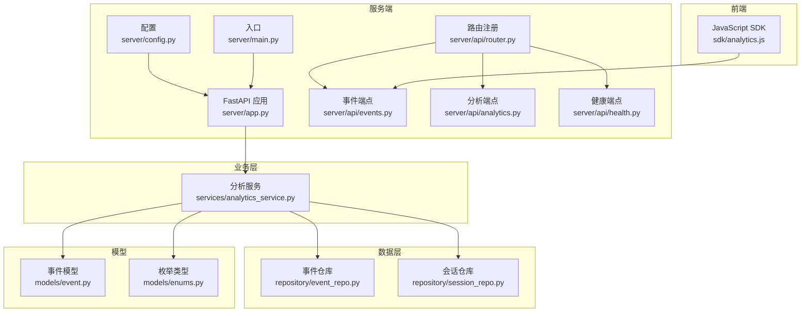
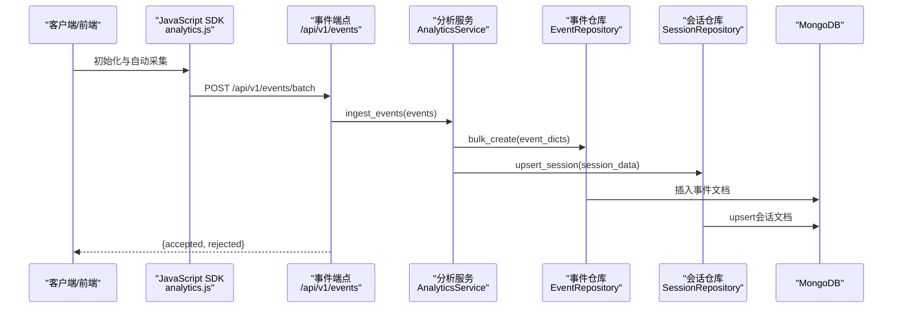
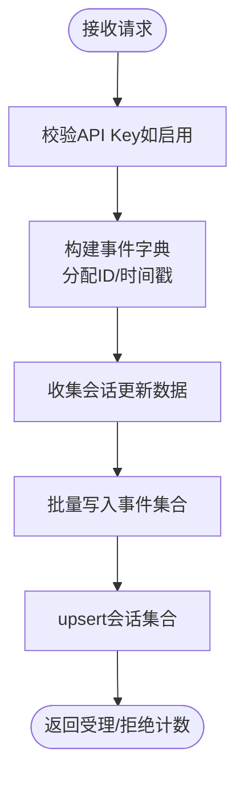
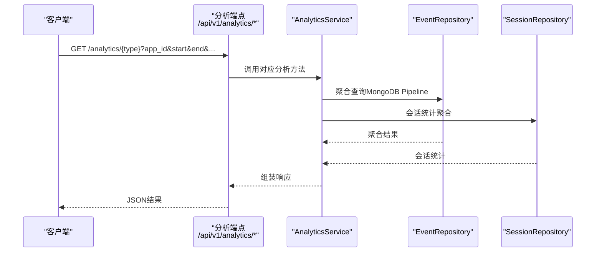
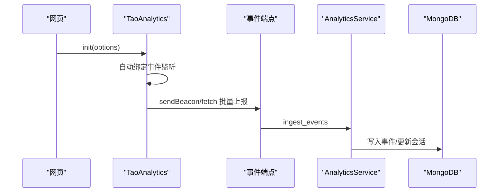
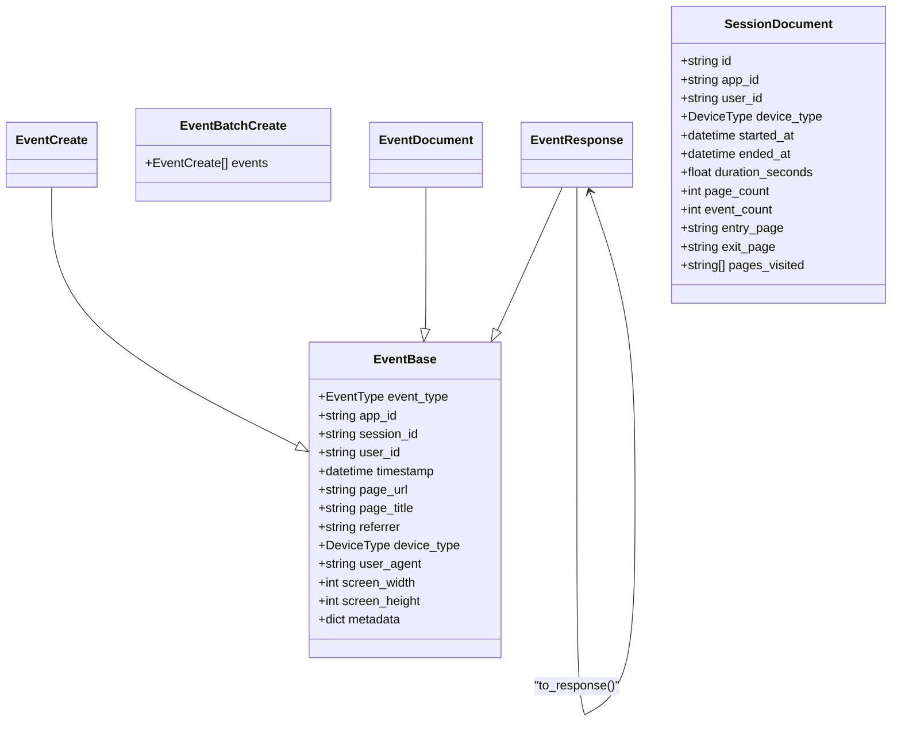
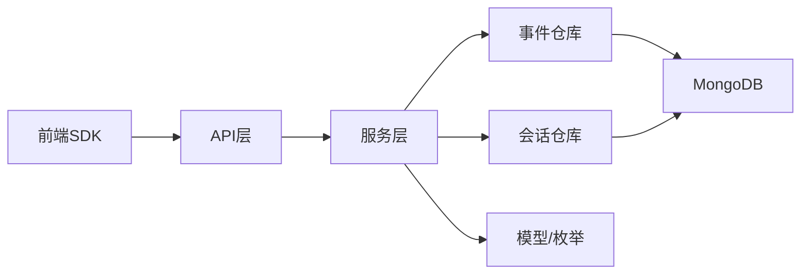

# 数据分析API

<cite>
**本文引用的文件**
- [src/taolib/testing/analytics/server/api/router.py](file://src/taolib/testing/analytics/server/api/router.py)
- [src/taolib/testing/analytics/server/api/analytics.py](file://src/taolib/testing/analytics/server/api/analytics.py)
- [src/taolib/testing/analytics/server/api/events.py](file://src/taolib/testing/analytics/server/api/events.py)
- [src/taolib/testing/analytics/server/api/health.py](file://src/taolib/testing/analytics/server/api/health.py)
- [src/taolib/testing/analytics/models/event.py](file://src/taolib/testing/analytics/models/event.py)
- [src/taolib/testing/analytics/models/enums.py](file://src/taolib/testing/analytics/models/enums.py)
- [src/taolib/testing/analytics/repository/event_repo.py](file://src/taolib/testing/analytics/repository/event_repo.py)
- [src/taolib/testing/analytics/repository/session_repo.py](file://src/taolib/testing/analytics/repository/session_repo.py)
- [src/taolib/testing/analytics/services/analytics_service.py](file://src/taolib/testing/analytics/services/analytics_service.py)
- [src/taolib/testing/analytics/servers/app.py](file://src/taolib/testing/analytics/server/app.py)
- [src/taolib/testing/analytics/server/config.py](file://src/taolib/testing/analytics/server/config.py)
- [src/taolib/testing/analytics/server/main.py](file://src/taolib/testing/analytics/server/main.py)
- [src/taolib/testing/analytics/errors.py](file://src/taolib/testing/analytics/errors.py)
- [src/taolib/testing/analytics/sdk/analytics.js](file://src/taolib/testing/analytics/sdk/analytics.js)
</cite>

## 目录
1. [简介](#简介)
2. [项目结构](#项目结构)
3. [核心组件](#核心组件)
4. [架构总览](#架构总览)
5. [详细组件分析](#详细组件分析)
6. [依赖分析](#依赖分析)
7. [性能考虑](#性能考虑)
8. [故障排查指南](#故障排查指南)
9. [结论](#结论)
10. [附录](#附录)

## 简介
本文件为数据分析API模块的全面技术文档，覆盖事件上报与查询、健康监控、前端SDK集成、Schema设计、实时处理机制、批量导入导出与数据持久化策略，并提供埋点方案、数据可视化与报表生成的技术实现说明。该模块基于FastAPI构建，采用MongoDB进行事件与会话数据存储，提供REST风格的分析查询接口与内置可视化仪表板。

## 项目结构
数据分析API模块位于 src/taolib/testing/analytics 目录下，主要分为以下层次：
- 服务端入口与配置：server/app.py、server/config.py、server/main.py
- API路由与端点：server/api/router.py、server/api/analytics.py、server/api/events.py、server/api/health.py
- 数据模型与枚举：models/event.py、models/enums.py
- 数据访问层：repository/event_repo.py、repository/session_repo.py
- 业务服务：services/analytics_service.py
- 错误定义：errors.py
- 前端SDK：sdk/analytics.js

图表来源
- [src/taolib/testing/analytics/server/app.py:65-96](file://src/taolib/testing/analytics/server/app.py#L65-L96)
- [src/taolib/testing/analytics/server/config.py:10-51](file://src/taolib/testing/analytics/server/config.py#L10-L51)
- [src/taolib/testing/analytics/server/main.py:14-42](file://src/taolib/testing/analytics/server/main.py#L14-L42)
- [src/taolib/testing/analytics/server/api/router.py:1-15](file://src/taolib/testing/analytics/server/api/router.py#L1-L15)
- [src/taolib/testing/analytics/server/api/events.py:1-63](file://src/taolib/testing/analytics/server/api/events.py#L1-L63)
- [src/taolib/testing/analytics/server/api/analytics.py:1-343](file://src/taolib/testing/analytics/server/api/analytics.py#L1-L343)
- [src/taolib/testing/analytics/server/api/health.py:1-23](file://src/taolib/testing/analytics/server/api/health.py#L1-L23)
- [src/taolib/testing/analytics/services/analytics_service.py:1-271](file://src/taolib/testing/analytics/services/analytics_service.py#L1-L271)
- [src/taolib/testing/analytics/repository/event_repo.py:1-469](file://src/taolib/testing/analytics/repository/event_repo.py#L1-L469)
- [src/taolib/testing/analytics/repository/session_repo.py:1-197](file://src/taolib/testing/analytics/repository/session_repo.py#L1-L197)
- [src/taolib/testing/analytics/models/event.py:1-105](file://src/taolib/testing/analytics/models/event.py#L1-L105)
- [src/taolib/testing/analytics/models/enums.py:1-31](file://src/taolib/testing/analytics/models/enums.py#L1-L31)
- [src/taolib/testing/analytics/sdk/analytics.js:1-451](file://src/taolib/testing/analytics/sdk/analytics.js#L1-L451)

章节来源
- [src/taolib/testing/analytics/server/app.py:1-243](file://src/taolib/testing/analytics/server/app.py#L1-L243)
- [src/taolib/testing/analytics/server/config.py:1-51](file://src/taolib/testing/analytics/server/config.py#L1-L51)
- [src/taolib/testing/analytics/server/main.py:1-48](file://src/taolib/testing/analytics/server/main.py#L1-L48)

## 核心组件
- 事件摄入端点：支持单事件与批量事件上报，具备API Key认证与批量大小限制。
- 分析查询端点：提供概览统计、转化漏斗、功能使用排名、用户导航路径、停留时间分析、流失点分析等。
- 健康监控端点：检查数据库连接状态。
- 业务服务：统一编排事件摄入与分析聚合。
- 数据仓库：事件与会话的MongoDB集合，含索引与TTL策略。
- 前端SDK：自动采集页面浏览、点击、功能使用、区域停留、会话起止与导航事件，并支持手动追踪与用户标识。

章节来源
- [src/taolib/testing/analytics/server/api/events.py:1-63](file://src/taolib/testing/analytics/server/api/events.py#L1-L63)
- [src/taolib/testing/analytics/server/api/analytics.py:1-343](file://src/taolib/testing/analytics/server/api/analytics.py#L1-L343)
- [src/taolib/testing/analytics/server/api/health.py:1-23](file://src/taolib/testing/analytics/server/api/health.py#L1-L23)
- [src/taolib/testing/analytics/services/analytics_service.py:1-271](file://src/taolib/testing/analytics/services/analytics_service.py#L1-L271)
- [src/taolib/testing/analytics/repository/event_repo.py:1-469](file://src/taolib/testing/analytics/repository/event_repo.py#L1-L469)
- [src/taolib/testing/analytics/repository/session_repo.py:1-197](file://src/taolib/testing/analytics/repository/session_repo.py#L1-L197)
- [src/taolib/testing/analytics/sdk/analytics.js:1-451](file://src/taolib/testing/analytics/sdk/analytics.js#L1-L451)

## 架构总览
系统采用“请求-服务-仓库-存储”的分层架构。FastAPI负责路由与中间件，服务层封装业务逻辑，仓库层对接MongoDB，模型层定义数据Schema与枚举。

图表来源
- [src/taolib/testing/analytics/sdk/analytics.js:148-174](file://src/taolib/testing/analytics/sdk/analytics.js#L148-L174)
- [src/taolib/testing/analytics/server/api/events.py:38-61](file://src/taolib/testing/analytics/server/api/events.py#L38-L61)
- [src/taolib/testing/analytics/services/analytics_service.py:33-101](file://src/taolib/testing/analytics/services/analytics_service.py#L33-L101)
- [src/taolib/testing/analytics/repository/event_repo.py:23-35](file://src/taolib/testing/analytics/repository/event_repo.py#L23-L35)
- [src/taolib/testing/analytics/repository/session_repo.py:22-79](file://src/taolib/testing/analytics/repository/session_repo.py#L22-L79)

## 详细组件分析

### 事件上报接口
- 单事件上报：POST /api/v1/events
- 批量上报：POST /api/v1/events/batch（受max_batch_size限制）
- 认证：若配置了api_keys，则需在请求头携带X-API-Key
- 数据校验：EventCreate模型定义字段与约束；批量长度限制为1~1000
- 写入策略：事件入库后，按会话聚合更新会话统计（页面数、时长、入口/出口页等）

图表来源
- [src/taolib/testing/analytics/server/api/events.py:11-61](file://src/taolib/testing/analytics/server/api/events.py#L11-L61)
- [src/taolib/testing/analytics/services/analytics_service.py:33-101](file://src/taolib/testing/analytics/services/analytics_service.py#L33-L101)
- [src/taolib/testing/analytics/repository/event_repo.py:23-35](file://src/taolib/testing/analytics/repository/event_repo.py#L23-L35)
- [src/taolib/testing/analytics/repository/session_repo.py:22-79](file://src/taolib/testing/analytics/repository/session_repo.py#L22-L79)

章节来源
- [src/taolib/testing/analytics/server/api/events.py:1-63](file://src/taolib/testing/analytics/server/api/events.py#L1-L63)
- [src/taolib/testing/analytics/models/event.py:39-48](file://src/taolib/testing/analytics/models/event.py#L39-L48)
- [src/taolib/testing/analytics/server/config.py:43-44](file://src/taolib/testing/analytics/server/config.py#L43-L44)

### 事件查询接口
- 概览统计：/api/v1/analytics/overview（支持start/end时间范围）
- 转化漏斗：/api/v1/analytics/funnel（steps逗号分隔）
- 功能使用排名：/api/v1/analytics/features（limit默认20，最大100）
- 用户导航路径：/api/v1/analytics/paths（limit默认50，最大200）
- 停留时间分析：/api/v1/analytics/retention
- 流失点分析：/api/v1/analytics/drop-off（steps逗号分隔）

时间范围解析：默认最近7天，支持ISO 8601格式，自动补全时区。

图表来源
- [src/taolib/testing/analytics/server/api/analytics.py:54-343](file://src/taolib/testing/analytics/server/api/analytics.py#L54-L343)
- [src/taolib/testing/analytics/services/analytics_service.py:103-253](file://src/taolib/testing/analytics/services/analytics_service.py#L103-L253)
- [src/taolib/testing/analytics/repository/event_repo.py:93-466](file://src/taolib/testing/analytics/repository/event_repo.py#L93-L466)
- [src/taolib/testing/analytics/repository/session_repo.py:81-197](file://src/taolib/testing/analytics/repository/session_repo.py#L81-L197)

章节来源
- [src/taolib/testing/analytics/server/api/analytics.py:1-343](file://src/taolib/testing/analytics/server/api/analytics.py#L1-L343)
- [src/taolib/testing/analytics/services/analytics_service.py:103-253](file://src/taolib/testing/analytics/services/analytics_service.py#L103-L253)

### 健康监控接口
- /api/v1/health：检查数据库连通性，返回status与database字段

章节来源
- [src/taolib/testing/analytics/server/api/health.py:1-23](file://src/taolib/testing/analytics/server/api/health.py#L1-L23)
- [src/taolib/testing/analytics/server/app.py:19-56](file://src/taolib/testing/analytics/server/app.py#L19-L56)

### 前端SDK接口与自动采集
- 初始化：init({ apiUrl, appId, apiKey?, flushInterval?, batchSize? })
- 自动采集
  - 页面浏览：history.pushState/replaceState/popstate触发page_view
  - 点击事件：优先读取data-track-feature，其次通用交互元素click
  - 功能使用：trackFeature(featureName, category?)
  - 区域停留：IntersectionObserver + time_on_section
  - 会话起止：session_start/session_end（visibilitychange/beforeunload）
  - 导航事件：navigation（from_page/to_page）
- 手动追踪：track(eventType, metadata)
- 用户标识：identify(userId)
- 刷新：flush()

图表来源
- [src/taolib/testing/analytics/sdk/analytics.js:376-445](file://src/taolib/testing/analytics/sdk/analytics.js#L376-L445)
- [src/taolib/testing/analytics/sdk/analytics.js:178-202](file://src/taolib/testing/analytics/sdk/analytics.js#L178-L202)
- [src/taolib/testing/analytics/sdk/analytics.js:206-248](file://src/taolib/testing/analytics/sdk/analytics.js#L206-L248)
- [src/taolib/testing/analytics/sdk/analytics.js:252-300](file://src/taolib/testing/analytics/sdk/analytics.js#L252-L300)
- [src/taolib/testing/analytics/sdk/analytics.js:304-335](file://src/taolib/testing/analytics/sdk/analytics.js#L304-L335)
- [src/taolib/testing/analytics/sdk/analytics.js:339-367](file://src/taolib/testing/analytics/sdk/analytics.js#L339-L367)
- [src/taolib/testing/analytics/server/api/events.py:38-61](file://src/taolib/testing/analytics/server/api/events.py#L38-L61)
- [src/taolib/testing/analytics/services/analytics_service.py:33-101](file://src/taolib/testing/analytics/services/analytics_service.py#L33-L101)

章节来源
- [src/taolib/testing/analytics/sdk/analytics.js:1-451](file://src/taolib/testing/analytics/sdk/analytics.js#L1-L451)

### Schema设计与数据模型
- 事件模型（EventBase/Create/Response/Document）
  - 必填字段：event_type、app_id、session_id、page_url、timestamp
  - 可选字段：user_id、page_title、referrer、device_type、user_agent、screen_*、metadata
  - 事件类型枚举：PAGE_VIEW、CLICK、FEATURE_USE、SESSION_START、SESSION_END、NAVIGATION、TIME_ON_SECTION、CUSTOM
  - 设备类型枚举：DESKTOP、MOBILE、TABLET、UNKNOWN
- 会话模型（SessionDocument）
  - 字段：app_id、user_id、device_type、started_at、ended_at、duration_seconds、page_count、event_count、entry_page、exit_page、pages_visited

图表来源
- [src/taolib/testing/analytics/models/event.py:17-105](file://src/taolib/testing/analytics/models/event.py#L17-L105)
- [src/taolib/testing/analytics/models/enums.py:9-31](file://src/taolib/testing/analytics/models/enums.py#L9-L31)

章节来源
- [src/taolib/testing/analytics/models/event.py:1-105](file://src/taolib/testing/analytics/models/event.py#L1-L105)
- [src/taolib/testing/analytics/models/enums.py:1-31](file://src/taolib/testing/analytics/models/enums.py#L1-L31)

### 实时处理机制
- SDK侧：本地队列+定时flush（默认5秒），批量大小20；优先sendBeacon，失败回退fetch
- 服务端：接收后立即写入事件集合，同时按会话聚合更新会话统计（页面数、时长、入口/出口页）
- 聚合分析：使用MongoDB聚合管道完成漏斗、功能使用、导航路径、停留时间、流失点等分析

章节来源
- [src/taolib/testing/analytics/sdk/analytics.js:148-174](file://src/taolib/testing/analytics/sdk/analytics.js#L148-L174)
- [src/taolib/testing/analytics/services/analytics_service.py:33-101](file://src/taolib/testing/analytics/services/analytics_service.py#L33-L101)
- [src/taolib/testing/analytics/repository/event_repo.py:93-466](file://src/taolib/testing/analytics/repository/event_repo.py#L93-L466)

### 批量导入导出与数据持久化
- 批量摄入：/api/v1/events/batch，受max_batch_size限制
- 导出：分析端点返回JSON，前端仪表板可直接消费
- 持久化策略：
  - 事件集合：按(app_id, timestamp)、(app_id, event_type)、(session_id, timestamp)、(app_id, event_type, metadata.feature_name)建立索引；TTL默认90天
  - 会话集合：按(app_id, started_at)、(app_id, user_id)稀疏索引；TTL默认180天
  - 生命周期：通过expireAfterSeconds自动清理过期数据

章节来源
- [src/taolib/testing/analytics/server/api/events.py:47-61](file://src/taolib/testing/analytics/server/api/events.py#L47-L61)
- [src/taolib/testing/analytics/server/config.py:39-44](file://src/taolib/testing/analytics/server/config.py#L39-L44)
- [src/taolib/testing/analytics/server/app.py:28-49](file://src/taolib/testing/analytics/server/app.py#L28-L49)
- [src/taolib/testing/analytics/repository/event_repo.py:443-466](file://src/taolib/testing/analytics/repository/event_repo.py#L443-L466)
- [src/taolib/testing/analytics/repository/session_repo.py:179-194](file://src/taolib/testing/analytics/repository/session_repo.py#L179-L194)

### 数据可视化与报表
- 内置仪表板：/dashboard，使用Chart.js展示概览、漏斗、功能使用、用户流、停留时间、事件分布等
- 交互：选择App ID与时间范围，自动刷新数据

章节来源
- [src/taolib/testing/analytics/server/app.py:90-240](file://src/taolib/testing/analytics/server/app.py#L90-L240)

## 依赖分析
- 组件耦合
  - API层仅依赖服务层，职责清晰
  - 服务层依赖仓库层与模型层，业务逻辑集中
  - 仓库层依赖MongoDB驱动与模型，封装聚合细节
- 外部依赖
  - FastAPI、Motor、pydantic、pydantic-settings
- 潜在风险
  - 聚合管道复杂度随分析维度增加而上升，需关注索引与TTL策略
  - SDK与服务端字段对齐，避免schema变更导致兼容问题

图表来源
- [src/taolib/testing/analytics/server/api/router.py:5-12](file://src/taolib/testing/analytics/server/api/router.py#L5-L12)
- [src/taolib/testing/analytics/services/analytics_service.py:16-32](file://src/taolib/testing/analytics/services/analytics_service.py#L16-L32)
- [src/taolib/testing/analytics/repository/event_repo.py:16-22](file://src/taolib/testing/analytics/repository/event_repo.py#L16-L22)
- [src/taolib/testing/analytics/repository/session_repo.py:15-21](file://src/taolib/testing/analytics/repository/session_repo.py#L15-L21)
- [src/taolib/testing/analytics/sdk/analytics.js:1-451](file://src/taolib/testing/analytics/sdk/analytics.js#L1-L451)

## 性能考虑
- 索引优化：针对高频查询建立复合索引，减少聚合扫描成本
- TTL策略：合理设置事件与会话TTL，平衡存储与查询性能
- 批量写入：SDK批量与服务端批量写入相结合，降低网络与写入开销
- 聚合优化：分析端点使用聚合管道，避免全表扫描；必要时引入物化视图或缓存（建议）
- 并发与限流：结合速率限制中间件控制突发流量（建议）

## 故障排查指南
- 健康检查
  - /api/v1/health：确认数据库连通性
- 认证失败
  - 若启用api_keys，检查请求头X-API-Key是否正确
- 批量超限
  - max_batch_size限制，调整客户端批量大小或服务端配置
- 聚合异常
  - 检查MongoDB聚合管道与索引是否存在；查看服务端日志定位具体分析方法
- SDK未上报
  - 确认init调用、API地址与App ID；检查浏览器控制台与网络面板

章节来源
- [src/taolib/testing/analytics/server/api/health.py:8-20](file://src/taolib/testing/analytics/server/api/health.py#L8-L20)
- [src/taolib/testing/analytics/server/api/events.py:11-25](file://src/taolib/testing/analytics/server/api/events.py#L11-L25)
- [src/taolib/testing/analytics/server/api/events.py:52-56](file://src/taolib/testing/analytics/server/api/events.py#L52-L56)
- [src/taolib/testing/analytics/errors.py:7-23](file://src/taolib/testing/analytics/errors.py#L7-L23)

## 结论
该数据分析API模块提供了从事件采集到分析查询的完整链路，具备良好的扩展性与可观测性。通过合理的Schema设计、索引与TTL策略，以及内置的可视化仪表板，能够满足常见的用户行为分析需求。建议在生产环境中进一步完善限流、缓存与监控体系，并持续优化聚合性能以应对更大规模的数据。

## 附录

### API清单与说明
- 事件上报
  - POST /api/v1/events：单事件上报
  - POST /api/v1/events/batch：批量上报（受max_batch_size限制）
- 分析查询
  - GET /api/v1/analytics/overview：概览统计（支持start/end）
  - GET /api/v1/analytics/funnel：转化漏斗（steps逗号分隔）
  - GET /api/v1/analytics/features：功能使用排名（limit）
  - GET /api/v1/analytics/paths：用户导航路径（limit）
  - GET /api/v1/analytics/retention：停留时间分析
  - GET /api/v1/analytics/drop-off：流失点分析（steps逗号分隔）
- 健康监控
  - GET /api/v1/health：服务与数据库健康状态

章节来源
- [src/taolib/testing/analytics/server/api/router.py:7-12](file://src/taolib/testing/analytics/server/api/router.py#L7-L12)
- [src/taolib/testing/analytics/server/api/events.py:38-61](file://src/taolib/testing/analytics/server/api/events.py#L38-L61)
- [src/taolib/testing/analytics/server/api/analytics.py:54-343](file://src/taolib/testing/analytics/server/api/analytics.py#L54-L343)
- [src/taolib/testing/analytics/server/api/health.py:8-20](file://src/taolib/testing/analytics/server/api/health.py#L8-L20)

### 集成与埋点方案
- 前端集成
  - 引入SDK脚本，调用init配置apiUrl、appId、apiKey（可选）
  - 使用trackFeature、track、identify、flush等API
- 埋点策略
  - 页面浏览：自动采集
  - 点击与交互：通过data-track-feature/data-track-category标注
  - 功能使用：trackFeature(featureName, category)
  - 区域停留：通过data-track-section标注目标区域
  - 导航事件：自动感知URL变化
- 隐私保护
  - 仅采集必要字段（不包含敏感信息）
  - 可通过metadata传递非敏感扩展数据
  - 服务端不存储明文密码等敏感信息

章节来源
- [src/taolib/testing/analytics/sdk/analytics.js:376-445](file://src/taolib/testing/analytics/sdk/analytics.js#L376-L445)
- [src/taolib/testing/analytics/models/event.py:17-36](file://src/taolib/testing/analytics/models/event.py#L17-L36)