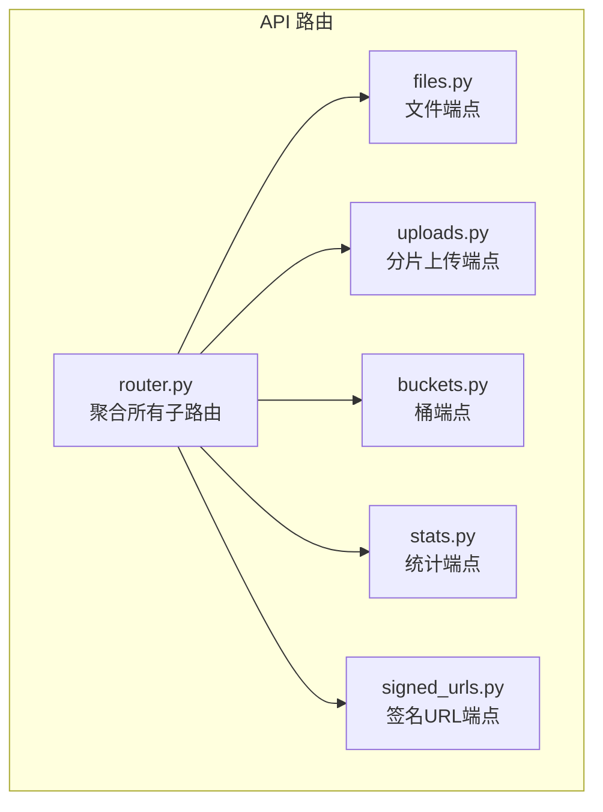
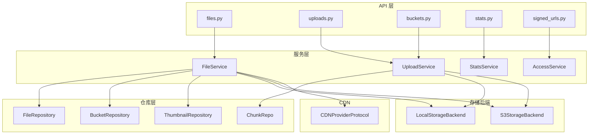
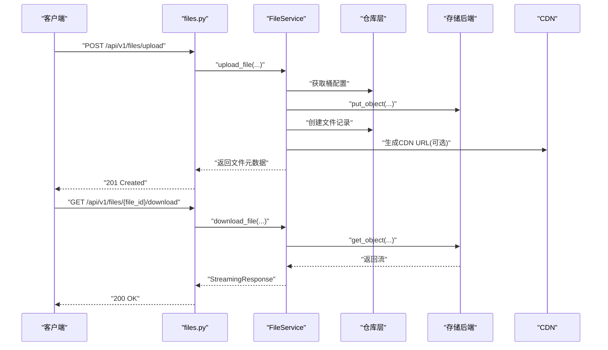
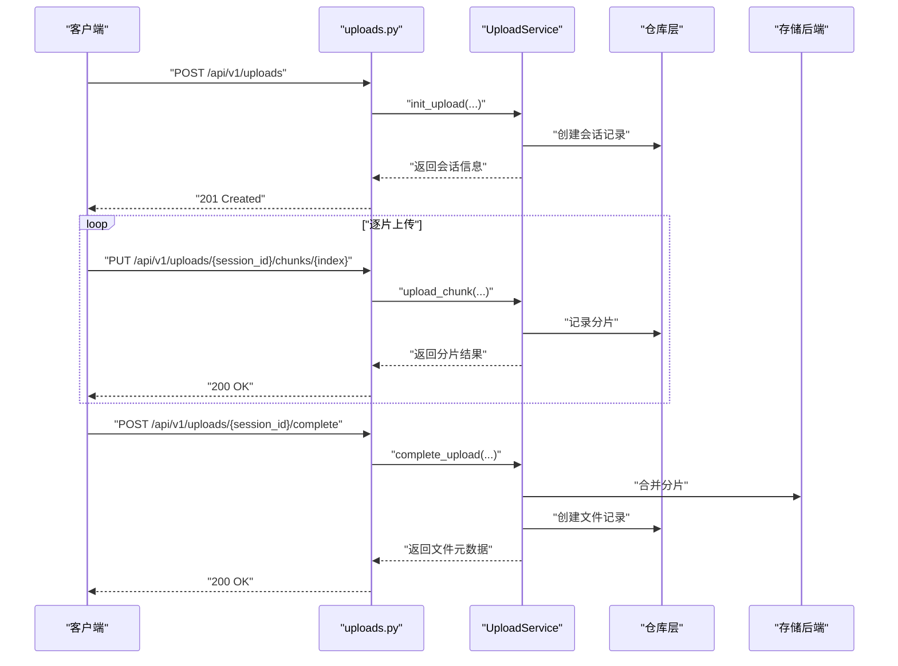
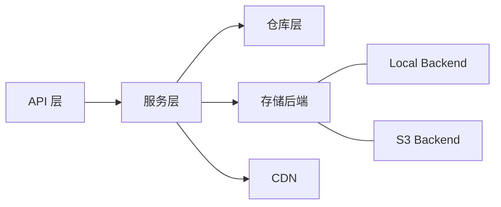

# 文件存储API

<cite>
**本文引用的文件**
- [router.py](file://src/taolib/testing/file_storage/server/api/router.py)
- [files.py](file://src/taolib/testing/file_storage/server/api/files.py)
- [uploads.py](file://src/taolib/testing/file_storage/server/api/uploads.py)
- [buckets.py](file://src/taolib/testing/file_storage/server/api/buckets.py)
- [stats.py](file://src/taolib/testing/file_storage/server/api/stats.py)
- [signed_urls.py](file://src/taolib/testing/file_storage/server/api/signed_urls.py)
- [file_service.py](file://src/taolib/testing/file_storage/services/file_service.py)
- [file.py](file://src/taolib/testing/file_storage/models/file.py)
- [upload.py](file://src/taolib/testing/file_storage/models/upload.py)
- [bucket.py](file://src/taolib/testing/file_storage/models/bucket.py)
- [local_backend.py](file://src/taolib/testing/file_storage/storage/local_backend.py)
- [s3_backend.py](file://src/taolib/testing/file_storage/storage/s3_backend.py)
</cite>

## 目录
1. [简介](#简介)
2. [项目结构](#项目结构)
3. [核心组件](#核心组件)
4. [架构总览](#架构总览)
5. [详细组件分析](#详细组件分析)
6. [依赖分析](#依赖分析)
7. [性能考虑](#性能考虑)
8. [故障排查指南](#故障排查指南)
9. [结论](#结论)
10. [附录](#附录)

## 简介
本文件存储API模块提供统一的文件上传、下载、管理与统计能力，支持多后端存储（本地文件系统、S3兼容服务），并内置分片上传、版本控制、缩略图生成、CDN集成与签名URL等功能。本文档面向前后端开发者与运维人员，覆盖所有端点、数据模型、处理流程、安全机制、CDN集成与性能优化建议，并给出前端直传与后端代理两种集成方案。

## 项目结构
文件存储API采用FastAPI路由聚合的方式，将各功能域（桶、文件、上传、签名URL、统计、健康）拆分为独立子路由，统一挂载在统一前缀下，便于扩展与维护。

图表来源
- [router.py:15-24](file://src/taolib/testing/file_storage/server/api/router.py#L15-L24)

章节来源
- [router.py:1-27](file://src/taolib/testing/file_storage/server/api/router.py#L1-L27)

## 核心组件
- 路由聚合：统一前缀与标签组织，便于Swagger/OpenAPI展示与调用。
- 服务层：封装业务逻辑，协调仓库、存储后端、处理流水线与CDN。
- 数据模型：定义文件、桶、上传会话、响应与文档模型，确保API一致性。
- 存储后端：抽象出本地与S3兼容后端，屏蔽差异，便于切换与扩展。
- CDN协议：统一CDN URL生成接口，支持公开访问加速与签名URL回源。

章节来源
- [files.py:10](file://src/taolib/testing/file_storage/server/api/files.py#L10)
- [uploads.py:11](file://src/taolib/testing/file_storage/server/api/uploads.py#L11)
- [buckets.py:8](file://src/taolib/testing/file_storage/server/api/buckets.py#L8)
- [stats.py:11](file://src/taolib/testing/file_storage/server/api/stats.py#L11)
- [signed_urls.py:7](file://src/taolib/testing/file_storage/server/api/signed_urls.py#L7)
- [file_service.py:30](file://src/taolib/testing/file_storage/services/file_service.py#L30)
- [file.py:19](file://src/taolib/testing/file_storage/models/file.py#L19)
- [upload.py:13](file://src/taolib/testing/file_storage/models/upload.py#L13)
- [bucket.py:24](file://src/taolib/testing/file_storage/models/bucket.py#L24)
- [local_backend.py:22](file://src/taolib/testing/file_storage/storage/local_backend.py#L22)
- [s3_backend.py:18](file://src/taolib/testing/file_storage/storage/s3_backend.py#L18)

## 架构总览
整体架构围绕“API层-服务层-仓库层-存储后端-CDN”展开，文件服务负责校验、处理、存储与统计更新；上传服务负责分片会话管理与进度跟踪；访问服务负责签名URL生成与令牌校验；CDN提供公开访问加速。

图表来源
- [files.py:8](file://src/taolib/testing/file_storage/server/api/files.py#L8)
- [uploads.py:9](file://src/taolib/testing/file_storage/server/api/uploads.py#L9)
- [buckets.py:6](file://src/taolib/testing/file_storage/server/api/buckets.py#L6)
- [stats.py:9](file://src/taolib/testing/file_storage/server/api/stats.py#L9)
- [signed_urls.py:5](file://src/taolib/testing/file_storage/server/api/signed_urls.py#L5)
- [file_service.py:33](file://src/taolib/testing/file_storage/services/file_service.py#L33)
- [local_backend.py:22](file://src/taolib/testing/file_storage/storage/local_backend.py#L22)
- [s3_backend.py:18](file://src/taolib/testing/file_storage/storage/s3_backend.py#L18)

## 详细组件分析

### 文件端点（文件上传、下载、管理）
- 端点概览
  - GET /api/v1/files：按桶、前缀、标签、媒体类型过滤列出文件，支持分页。
  - POST /api/v1/files/upload：简单上传（小文件，单次请求），支持访问级别设置。
  - GET /api/v1/files/{file_id}：获取文件元数据。
  - PATCH /api/v1/files/{file_id}：更新文件元数据（标签、描述、访问级别）。
  - DELETE /api/v1/files/{file_id}：删除文件及所有版本，不可恢复。
  - GET /api/v1/files/{file_id}/download：流式下载文件。
  - GET /api/v1/files/{file_id}/url：获取文件访问URL（公开访问走CDN，其他走签名URL）。

- 关键流程
  - 简单上传：校验桶存在性与文件大小/MIME限制，写入存储后端，生成文件记录，异步生成缩略图并更新文件记录。
  - 流式下载：根据文件记录定位后端对象，返回流式响应。
  - URL获取：公开且配置CDN时返回CDN URL；否则生成签名URL。

图表来源
- [files.py:128-145](file://src/taolib/testing/file_storage/server/api/files.py#L128-L145)
- [files.py:297-303](file://src/taolib/testing/file_storage/server/api/files.py#L297-L303)
- [file_service.py:49-171](file://src/taolib/testing/file_storage/services/file_service.py#L49-L171)

章节来源
- [files.py:33-350](file://src/taolib/testing/file_storage/server/api/files.py#L33-L350)
- [file_service.py:49-274](file://src/taolib/testing/file_storage/services/file_service.py#L49-L274)

### 分片上传端点（初始化、上传分片、完成、中止）
- 端点概览
  - POST /api/v1/uploads：初始化分片上传会话，返回会话ID与分片策略。
  - GET /api/v1/uploads/{session_id}：查询上传状态与进度。
  - PUT /api/v1/uploads/{session_id}/chunks/{chunk_index}：上传指定索引的分片。
  - POST /api/v1/uploads/{session_id}/complete：完成上传，合并分片并创建文件记录。
  - POST /api/v1/uploads/{session_id}/abort：中止上传，清理临时资源。

- 关键流程
  - 初始化：计算总分片数与分片大小，持久化会话状态。
  - 上传分片：接收二进制分片，可选校验和，保存至临时位置。
  - 完成：按序合并分片，写入最终对象，创建文件记录，清理会话。

图表来源
- [uploads.py:20-94](file://src/taolib/testing/file_storage/server/api/uploads.py#L20-L94)
- [upload.py:13-115](file://src/taolib/testing/file_storage/models/upload.py#L13-L115)

章节来源
- [uploads.py:1-96](file://src/taolib/testing/file_storage/server/api/uploads.py#L1-L96)
- [upload.py:13-115](file://src/taolib/testing/file_storage/models/upload.py#L13-L115)

### 存储桶管理端点（创建、删除、权限设置、统计）
- 端点概览
  - GET /api/v1/buckets：分页列出桶。
  - POST /api/v1/buckets：创建桶（含默认访问级别、大小限制、MIME白名单、生命周期策略等）。
  - GET /api/v1/buckets/{bucket_id}：获取桶详情。
  - PUT /api/v1/buckets/{bucket_id}：更新桶配置。
  - DELETE /api/v1/buckets/{bucket_id}?force=false：删除桶（可强制）。
  - GET /api/v1/buckets/{bucket_id}/stats：获取桶统计信息。

- 关键模型
  - 生命周期规则：自动过期天数、版本控制开关与最大版本数。
  - 存储类：标准/低频等（可扩展）。
  - MIME白名单：限制允许的文件类型。

章节来源
- [buckets.py:11-85](file://src/taolib/testing/file_storage/server/api/buckets.py#L11-L85)
- [bucket.py:14-108](file://src/taolib/testing/file_storage/models/bucket.py#L14-L108)

### 统计端点（存储概览、上传统计）
- 端点概览
  - GET /api/v1/stats/overview：全局存储概览（总文件数、总容量等）。
  - GET /api/v1/stats/uploads：上传统计（趋势、失败率等）。

章节来源
- [stats.py:14-30](file://src/taolib/testing/file_storage/server/api/stats.py#L14-L30)

### CDN与签名URL端点
- 端点概览
  - POST /api/v1/signed-urls：生成签名URL。
  - POST /api/v1/signed-urls/validate：验证签名Token。

- 关键行为
  - 公开文件：优先返回CDN URL以提升访问速度。
  - 私有/受限文件：生成带有效期的签名URL，保障安全访问。

章节来源
- [signed_urls.py:18-50](file://src/taolib/testing/file_storage/server/api/signed_urls.py#L18-L50)
- [file_service.py:258-272](file://src/taolib/testing/file_storage/services/file_service.py#L258-L272)

## 依赖分析
- API层依赖服务层，服务层依赖仓库层与存储后端，形成清晰的分层。
- 上传流程依赖上传服务与分片仓库，下载与管理依赖文件与缩略图仓库。
- 存储后端通过协议抽象，支持本地与S3兼容后端无缝切换。
- CDN通过协议注入，公开文件可直接走CDN，降低后端压力。

图表来源
- [file_service.py:33-47](file://src/taolib/testing/file_storage/services/file_service.py#L33-L47)
- [local_backend.py:22](file://src/taolib/testing/file_storage/storage/local_backend.py#L22)
- [s3_backend.py:18](file://src/taolib/testing/file_storage/storage/s3_backend.py#L18)

章节来源
- [file_service.py:30-47](file://src/taolib/testing/file_storage/services/file_service.py#L30-L47)

## 性能考虑
- 分片上传
  - 推荐分片大小：≥1MB，≤100MB；默认5MB，适合大多数场景。
  - 并发上传：建议按CPU核数或网络带宽动态调整并发度，避免过度竞争。
  - 断点续传：基于已上传分片索引与校验和，快速恢复。
- 缓存与CDN
  - 公开文件优先走CDN，显著降低后端负载与延迟。
  - 缩略图按需生成并缓存，减少重复计算。
- I/O与内存
  - 流式下载/上传，避免一次性加载大文件至内存。
  - 本地后端使用分块读取，S3后端使用异步迭代器。
- 并发与限速
  - 结合速率限制中间件与队列，防止突发流量冲击。
  - 上传会话过期时间合理设置，避免僵尸会话占用资源。

## 故障排查指南
- 常见错误码
  - 400：参数错误、文件过大、上传失败（中止/完成阶段）。
  - 404：文件或桶不存在。
  - 403：权限不足（如访问私有文件未签名）。
- 定位步骤
  - 检查桶配置：MIME白名单、大小限制、生命周期策略。
  - 校验分片完整性：校验和不一致时重传对应分片。
  - 查看日志：存储后端异常、签名URL生成失败、CDN不可达。
- 建议
  - 对外暴露签名URL时严格控制有效期与来源IP。
  - 定期清理过期会话与临时分片，释放存储空间。

章节来源
- [files.py:122-127](file://src/taolib/testing/file_storage/server/api/files.py#L122-L127)
- [uploads.py:56-61](file://src/taolib/testing/file_storage/server/api/uploads.py#L56-L61)
- [buckets.py:67-70](file://src/taolib/testing/file_storage/server/api/buckets.py#L67-L70)

## 结论
该文件存储API模块以清晰的分层设计与协议抽象实现了高可用、可扩展的文件服务能力。通过分片上传、版本控制、缩略图与CDN集成，兼顾了性能与易用性。结合合理的并发策略与安全机制，可满足从开发测试到生产环境的多样化需求。

## 附录

### API端点一览（按功能域）
- 文件管理
  - GET /api/v1/files
  - POST /api/v1/files/upload
  - GET /api/v1/files/{file_id}
  - PATCH /api/v1/files/{file_id}
  - DELETE /api/v1/files/{file_id}
  - GET /api/v1/files/{file_id}/download
  - GET /api/v1/files/{file_id}/url
- 分片上传
  - POST /api/v1/uploads
  - GET /api/v1/uploads/{session_id}
  - PUT /api/v1/uploads/{session_id}/chunks/{chunk_index}
  - POST /api/v1/uploads/{session_id}/complete
  - POST /api/v1/uploads/{session_id}/abort
- 存储桶管理
  - GET /api/v1/buckets
  - POST /api/v1/buckets
  - GET /api/v1/buckets/{bucket_id}
  - PUT /api/v1/buckets/{bucket_id}
  - DELETE /api/v1/buckets/{bucket_id}?force=false
  - GET /api/v1/buckets/{bucket_id}/stats
- 统计
  - GET /api/v1/stats/overview
  - GET /api/v1/stats/uploads
- 签名URL
  - POST /api/v1/signed-urls
  - POST /api/v1/signed-urls/validate

章节来源
- [router.py:17-24](file://src/taolib/testing/file_storage/server/api/router.py#L17-L24)
- [files.py:33-350](file://src/taolib/testing/file_storage/server/api/files.py#L33-L350)
- [uploads.py:14-96](file://src/taolib/testing/file_storage/server/api/uploads.py#L14-L96)
- [buckets.py:11-85](file://src/taolib/testing/file_storage/server/api/buckets.py#L11-L85)
- [stats.py:14-30](file://src/taolib/testing/file_storage/server/api/stats.py#L14-L30)
- [signed_urls.py:18-50](file://src/taolib/testing/file_storage/server/api/signed_urls.py#L18-L50)

### 数据模型要点
- 文件元数据
  - 字段：桶ID、对象键、原始文件名、内容类型、大小、媒体类型、访问级别、标签、自定义元数据、校验和、版本、状态、CDN URL、缩略图列表、过期时间、创建/更新信息。
- 上传会话
  - 字段：桶ID、对象键、原始文件名、内容类型、总大小、分片大小、总分片数、状态、已上传分片索引、已上传字节数、进度百分比、后端上传ID、创建者、过期时间、创建/更新时间。
- 存储桶
  - 字段：名称、描述、默认访问级别、最大文件大小、允许的MIME类型、存储类、标签、生命周期规则（自动过期天数、版本控制、最大版本数）、文件计数、总大小、创建者、创建/更新时间。

章节来源
- [file.py:19-117](file://src/taolib/testing/file_storage/models/file.py#L19-L117)
- [upload.py:13-115](file://src/taolib/testing/file_storage/models/upload.py#L13-L115)
- [bucket.py:24-108](file://src/taolib/testing/file_storage/models/bucket.py#L24-L108)

### 安全与合规
- 访问控制
  - 私有文件仅通过签名URL访问；公开文件优先走CDN。
- 内容校验
  - 上传时进行MIME类型与大小校验，必要时进行校验和验证。
- 生命周期
  - 支持自动过期与版本控制，配合统计监控容量与成本。

章节来源
- [file_service.py:67-74](file://src/taolib/testing/file_storage/services/file_service.py#L67-L74)
- [bucket.py:14-22](file://src/taolib/testing/file_storage/models/bucket.py#L14-L22)

### 集成方案
- 前端直传（推荐）
  - 步骤：前端向后端申请上传会话或签名URL；后端返回会话ID或签名URL；前端直接调用CDN或S3上传；完成后通知后端完成合并或确认。
  - 优点：降低后端带宽与CPU压力，提升用户体验。
- 后端代理上传
  - 步骤：前端将文件发送至后端；后端转发至存储后端或CDN。
  - 适用：需要后端做额外处理（水印、转码）或跨域/鉴权复杂场景。

章节来源
- [uploads.py:20-25](file://src/taolib/testing/file_storage/server/api/uploads.py#L20-L25)
- [signed_urls.py:24-28](file://src/taolib/testing/file_storage/server/api/signed_urls.py#L24-L28)

### 存储后端对比
- 本地后端
  - 适合开发与测试；文件存储于本地文件系统；支持分片上传的本地模拟。
- S3兼容后端
  - 支持AWS S3、MinIO、阿里云OSS等；提供分片上传、签名URL、对象复制等能力。

章节来源
- [local_backend.py:36-58](file://src/taolib/testing/file_storage/storage/local_backend.py#L36-L58)
- [s3_backend.py:57-92](file://src/taolib/testing/file_storage/storage/s3_backend.py#L57-L92)