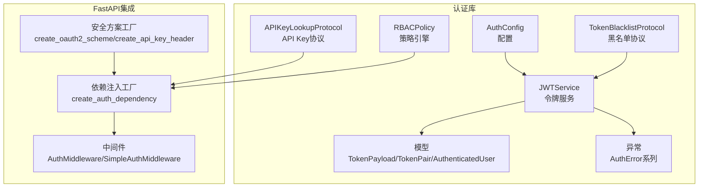
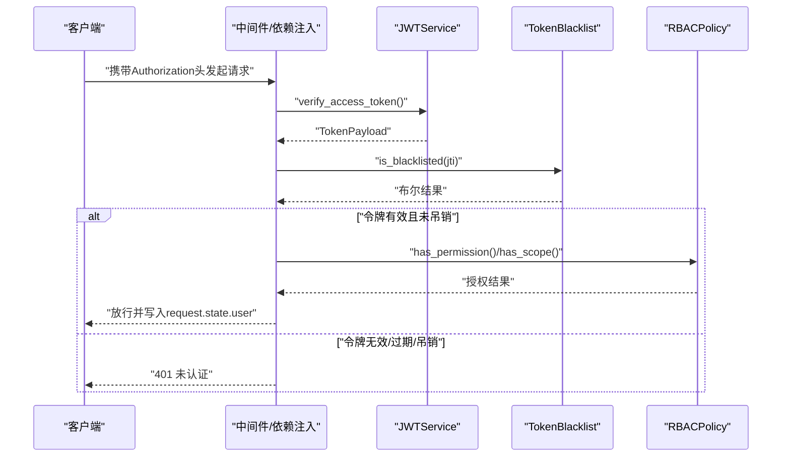
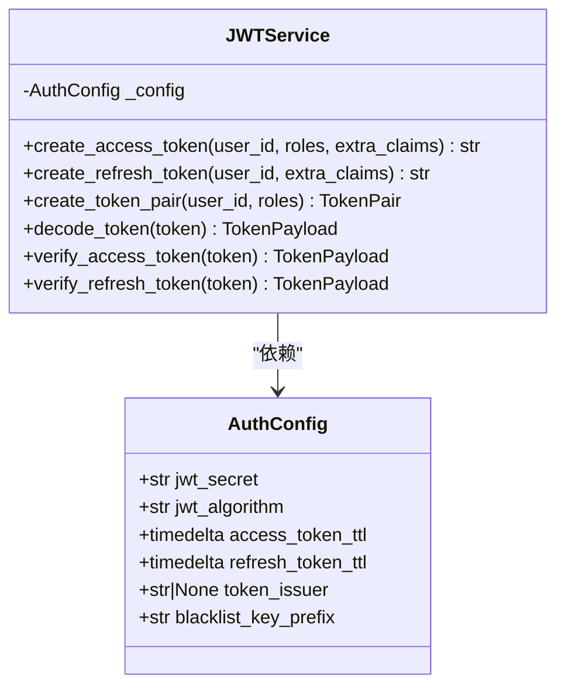
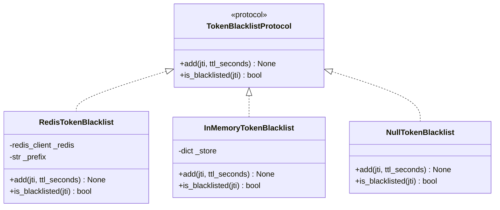
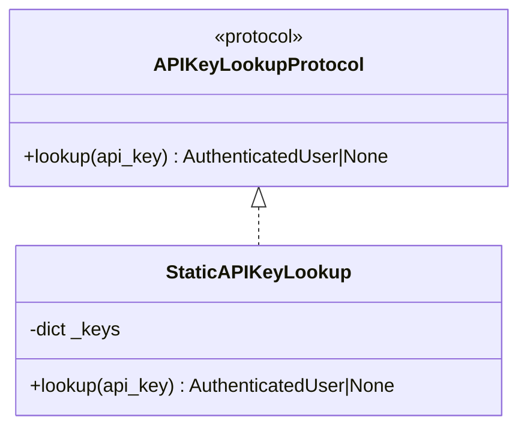
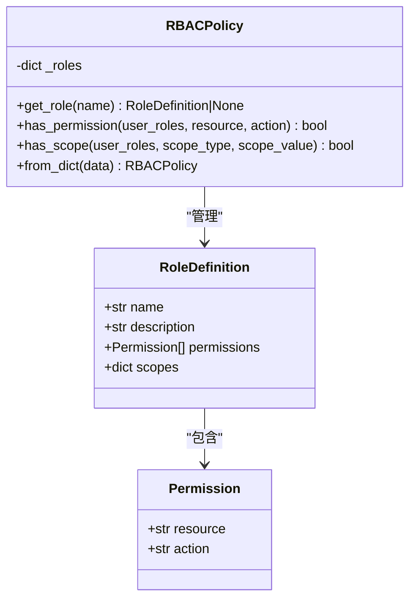
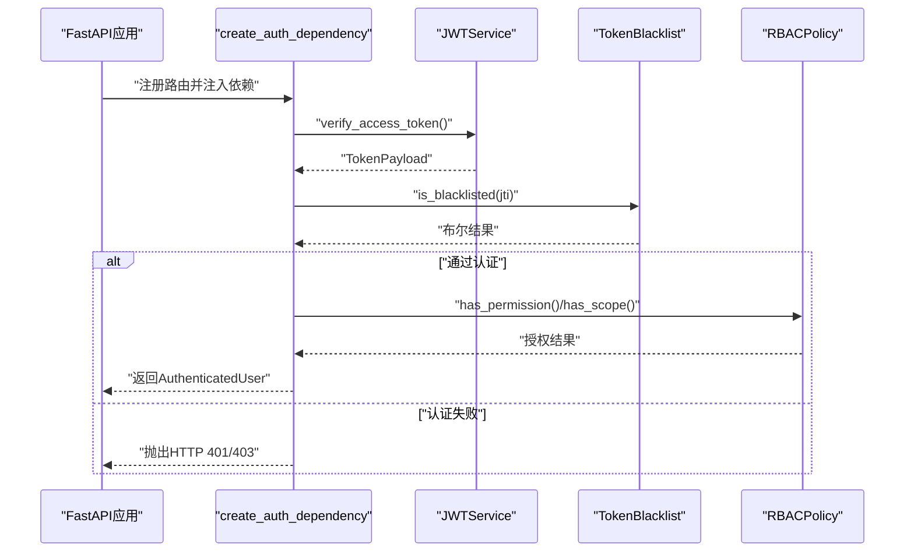
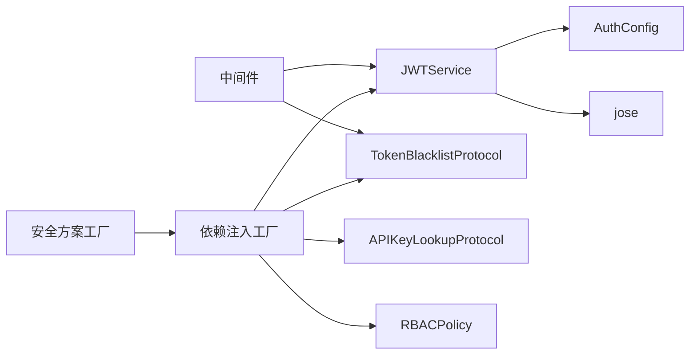

# 认证API

<cite>
**本文引用的文件**
- [src/taolib/testing/auth/__init__.py](file://src/taolib/testing/auth/__init__.py)
- [src/taolib/testing/auth/config.py](file://src/taolib/testing/auth/config.py)
- [src/taolib/testing/auth/models.py](file://src/taolib/testing/auth/models.py)
- [src/taolib/testing/auth/errors.py](file://src/taolib/testing/auth/errors.py)
- [src/taolib/testing/auth/tokens.py](file://src/taolib/testing/auth/tokens.py)
- [src/taolib/testing/auth/blacklist.py](file://src/taolib/testing/auth/blacklist.py)
- [src/taolib/testing/auth/api_key.py](file://src/taolib/testing/auth/api_key.py)
- [src/taolib/testing/auth/rbac.py](file://src/taolib/testing/auth/rbac.py)
- [src/taolib/testing/auth/fastapi/dependencies.py](file://src/taolib/testing/auth/fastapi/dependencies.py)
- [src/taolib/testing/auth/fastapi/middleware.py](file://src/taolib/testing/auth/fastapi/middleware.py)
- [src/taolib/testing/auth/fastapi/schemes.py](file://src/taolib/testing/auth/fastapi/schemes.py)
</cite>

## 目录
1. [简介](#简介)
2. [项目结构](#项目结构)
3. [核心组件](#核心组件)
4. [架构总览](#架构总览)
5. [详细组件分析](#详细组件分析)
6. [依赖分析](#依赖分析)
7. [性能考虑](#性能考虑)
8. [故障排查指南](#故障排查指南)
9. [结论](#结论)
10. [附录](#附录)

## 简介
本文件为认证API模块的权威技术文档，覆盖以下主题：
- 用户认证接口：登录、注册、登出
- 权限验证接口：JWT令牌验证、RBAC权限检查
- 令牌管理接口：令牌生成、刷新、撤销
- 认证中间件与依赖注入的使用方法
- 安全最佳实践
- 客户端集成示例（前端SDK与后端服务集成模式）

注意：当前仓库未包含具体的服务端路由实现（如FastAPI的router.py或auth.py），因此本文档聚焦于认证库的内部API与集成方式，并提供可直接对接到真实服务端的集成指导。

## 项目结构
认证模块位于 src/taolib/testing/auth 及其子目录 fastapi 下，采用分层设计：
- 配置与模型：AuthConfig、TokenPayload、TokenPair、AuthenticatedUser
- 令牌服务：JWTService（生成、验证、解码）
- 黑名单：TokenBlacklistProtocol及Redis/内存/空实现
- API Key：APIKeyLookupProtocol及静态实现
- RBAC：Permission、RoleDefinition、RBACPolicy
- FastAPI集成：依赖注入工厂、中间件、安全方案

图表来源
- [src/taolib/testing/auth/config.py:12-82](file://src/taolib/testing/auth/config.py#L12-L82)
- [src/taolib/testing/auth/tokens.py:17-237](file://src/taolib/testing/auth/tokens.py#L17-L237)
- [src/taolib/testing/auth/blacklist.py:10-113](file://src/taolib/testing/auth/blacklist.py#L10-L113)
- [src/taolib/testing/auth/api_key.py:11-48](file://src/taolib/testing/auth/api_key.py#L11-L48)
- [src/taolib/testing/auth/rbac.py:41-160](file://src/taolib/testing/auth/rbac.py#L41-L160)
- [src/taolib/testing/auth/models.py:11-68](file://src/taolib/testing/auth/models.py#L11-L68)
- [src/taolib/testing/auth/errors.py:7-55](file://src/taolib/testing/auth/errors.py#L7-L55)
- [src/taolib/testing/auth/fastapi/dependencies.py:27-291](file://src/taolib/testing/auth/fastapi/dependencies.py#L27-L291)
- [src/taolib/testing/auth/fastapi/middleware.py:20-173](file://src/taolib/testing/auth/fastapi/middleware.py#L20-L173)
- [src/taolib/testing/auth/fastapi/schemes.py:9-41](file://src/taolib/testing/auth/fastapi/schemes.py#L9-L41)

章节来源
- [src/taolib/testing/auth/__init__.py:1-86](file://src/taolib/testing/auth/__init__.py#L1-L86)

## 核心组件
- AuthConfig：不可变配置容器，支持从环境变量加载，包含JWT密钥、算法、Access/Refresh TTL、签发者、黑名单键前缀等。
- JWTService：提供Access/Refresh令牌生成、解码与验证；支持额外声明与签发者字段。
- TokenPayload/TokenPair/AuthenticatedUser：认证过程中的核心数据结构。
- TokenBlacklistProtocol：令牌黑名单协议，支持Redis/内存/空实现。
- APIKeyLookupProtocol/StaticAPIKeyLookup：API Key认证协议与静态实现。
- RBACPolicy：基于角色的权限与作用域检查。
- FastAPI依赖注入与中间件：统一的认证入口、角色/权限/作用域检查、以及中间件自动填充request.state.user。

章节来源
- [src/taolib/testing/auth/config.py:12-82](file://src/taolib/testing/auth/config.py#L12-L82)
- [src/taolib/testing/auth/tokens.py:17-237](file://src/taolib/testing/auth/tokens.py#L17-L237)
- [src/taolib/testing/auth/models.py:11-68](file://src/taolib/testing/auth/models.py#L11-L68)
- [src/taolib/testing/auth/blacklist.py:10-113](file://src/taolib/testing/auth/blacklist.py#L10-L113)
- [src/taolib/testing/auth/api_key.py:11-48](file://src/taolib/testing/auth/api_key.py#L11-L48)
- [src/taolib/testing/auth/rbac.py:41-160](file://src/taolib/testing/auth/rbac.py#L41-L160)
- [src/taolib/testing/auth/fastapi/dependencies.py:27-291](file://src/taolib/testing/auth/fastapi/dependencies.py#L27-L291)
- [src/taolib/testing/auth/fastapi/middleware.py:20-173](file://src/taolib/testing/auth/fastapi/middleware.py#L20-L173)
- [src/taolib/testing/auth/fastapi/schemes.py:9-41](file://src/taolib/testing/auth/fastapi/schemes.py#L9-L41)

## 架构总览
认证库通过“配置-服务-模型-协议-集成”的分层组织，形成可插拔的安全基础设施。FastAPI侧通过依赖注入工厂与中间件将认证能力无缝接入路由层，支持JWT与API Key双通道认证，并可选地结合RBAC进行细粒度授权。

图表来源
- [src/taolib/testing/auth/fastapi/dependencies.py:61-141](file://src/taolib/testing/auth/fastapi/dependencies.py#L61-L141)
- [src/taolib/testing/auth/tokens.py:155-199](file://src/taolib/testing/auth/tokens.py#L155-L199)
- [src/taolib/testing/auth/blacklist.py:26-35](file://src/taolib/testing/auth/blacklist.py#L26-L35)
- [src/taolib/testing/auth/rbac.py:64-116](file://src/taolib/testing/auth/rbac.py#L64-L116)

## 详细组件分析

### 组件A：JWT令牌服务（JWTService）
- 功能要点
  - 生成Access/Refresh Token：支持自定义额外声明与签发者
  - 解码与验证：区分Access/Refresh类型，校验过期与签名
  - TokenPair：一次生成一对令牌
- 关键属性
  - config：AuthConfig实例
- 复杂度
  - 生成/验证均为O(1)，内存开销极低
- 优化建议
  - 使用Redis黑名单时，保持TTL与令牌剩余时间一致，避免过期滞留
  - Access Token TTL建议较短，Refresh Token较长，降低泄露风险

图表来源
- [src/taolib/testing/auth/tokens.py:17-237](file://src/taolib/testing/auth/tokens.py#L17-L237)
- [src/taolib/testing/auth/config.py:12-82](file://src/taolib/testing/auth/config.py#L12-L82)

章节来源
- [src/taolib/testing/auth/tokens.py:17-237](file://src/taolib/testing/auth/tokens.py#L17-L237)
- [src/taolib/testing/auth/config.py:12-82](file://src/taolib/testing/auth/config.py#L12-L82)

### 组件B：令牌黑名单（TokenBlacklistProtocol）
- 协议与实现
  - 协议：add(jti, ttl_seconds)、is_blacklisted(jti)
  - Redis：基于SET+EX，TTL自动过期
  - 内存：字典+过期时间，自动清理
  - 空实现：始终返回False
- 使用建议
  - 登出时将jti加入黑名单，TTL与Access Token剩余时间一致
  - 生产环境优先使用Redis实现

图表来源
- [src/taolib/testing/auth/blacklist.py:10-113](file://src/taolib/testing/auth/blacklist.py#L10-L113)

章节来源
- [src/taolib/testing/auth/blacklist.py:10-113](file://src/taolib/testing/auth/blacklist.py#L10-L113)

### 组件C：API Key认证（APIKeyLookupProtocol）
- 协议与实现
  - 协议：lookup(api_key) -> Optional[AuthenticatedUser]
  - 静态实现：从字典映射中查找
- 使用建议
  - 小规模部署可用静态配置
  - 生产环境建议接入数据库或缓存

图表来源
- [src/taolib/testing/auth/api_key.py:11-48](file://src/taolib/testing/auth/api_key.py#L11-L48)

章节来源
- [src/taolib/testing/auth/api_key.py:11-48](file://src/taolib/testing/auth/api_key.py#L11-L48)

### 组件D：RBAC策略引擎（RBACPolicy）
- 功能要点
  - 角色定义：名称、描述、权限集合、作用域映射
  - 权限检查：has_permission(user_roles, resource, action)
  - 作用域检查：has_scope(user_roles, scope_type, scope_value)
  - 从字典构建策略（兼容既有系统）
- 使用建议
  - 将角色与权限解耦，便于动态配置
  - 作用域支持None表示无限制

图表来源
- [src/taolib/testing/auth/rbac.py:10-160](file://src/taolib/testing/auth/rbac.py#L10-L160)

章节来源
- [src/taolib/testing/auth/rbac.py:10-160](file://src/taolib/testing/auth/rbac.py#L10-L160)

### 组件E：FastAPI依赖注入与中间件
- 依赖注入工厂
  - create_auth_dependency：支持JWT Bearer与API Key双通道认证
  - require_roles/requires_permissions/requires_scope：角色/权限/作用域检查
- 中间件
  - AuthMiddleware/SimpleAuthMiddleware：在ASGI层自动填充request.state.user
- 安全方案工厂
  - create_oauth2_scheme/create_api_key_header：OAuth2与API Key头部方案

图表来源
- [src/taolib/testing/auth/fastapi/dependencies.py:27-291](file://src/taolib/testing/auth/fastapi/dependencies.py#L27-L291)
- [src/taolib/testing/auth/tokens.py:155-199](file://src/taolib/testing/auth/tokens.py#L155-L199)
- [src/taolib/testing/auth/blacklist.py:26-35](file://src/taolib/testing/auth/blacklist.py#L26-L35)
- [src/taolib/testing/auth/rbac.py:64-116](file://src/taolib/testing/auth/rbac.py#L64-L116)

章节来源
- [src/taolib/testing/auth/fastapi/dependencies.py:27-291](file://src/taolib/testing/auth/fastapi/dependencies.py#L27-L291)
- [src/taolib/testing/auth/fastapi/middleware.py:20-173](file://src/taolib/testing/auth/fastapi/middleware.py#L20-L173)
- [src/taolib/testing/auth/fastapi/schemes.py:9-41](file://src/taolib/testing/auth/fastapi/schemes.py#L9-L41)

## 依赖分析
- 组件内聚与耦合
  - JWTService仅依赖AuthConfig与jose库，内聚性高
  - 依赖注入工厂通过协议解耦JWTService与黑名单、API Key实现
  - RBACPolicy独立于FastAPI，便于复用
- 外部依赖
  - jose：JWT编码/解码
  - fastapi/starlette：依赖注入与中间件
  - redis.asyncio（可选）：黑名单Redis实现

图表来源
- [src/taolib/testing/auth/tokens.py:17-237](file://src/taolib/testing/auth/tokens.py#L17-L237)
- [src/taolib/testing/auth/fastapi/dependencies.py:27-291](file://src/taolib/testing/auth/fastapi/dependencies.py#L27-L291)
- [src/taolib/testing/auth/fastapi/middleware.py:20-173](file://src/taolib/testing/auth/fastapi/middleware.py#L20-L173)
- [src/taolib/testing/auth/fastapi/schemes.py:9-41](file://src/taolib/testing/auth/fastapi/schemes.py#L9-L41)

章节来源
- [src/taolib/testing/auth/tokens.py:17-237](file://src/taolib/testing/auth/tokens.py#L17-L237)
- [src/taolib/testing/auth/fastapi/dependencies.py:27-291](file://src/taolib/testing/auth/fastapi/dependencies.py#L27-L291)
- [src/taolib/testing/auth/fastapi/middleware.py:20-173](file://src/taolib/testing/auth/fastapi/middleware.py#L20-L173)
- [src/taolib/testing/auth/fastapi/schemes.py:9-41](file://src/taolib/testing/auth/fastapi/schemes.py#L9-L41)

## 性能考虑
- 令牌验证
  - JWT解码为O(1)，成本极低
  - 建议将Access Token TTL设为较短周期，降低泄露影响面
- 黑名单查询
  - Redis实现具备O(1)查询复杂度与自动过期，推荐生产使用
  - 内存实现适合开发/测试，注意进程重启导致的状态丢失
- RBAC检查
  - 角色与权限数量有限时，哈希查找O(1)，整体开销可忽略
- 中间件与依赖注入
  - 仅在必要路径执行认证，避免对公开端点造成额外延迟

## 故障排查指南
- 常见错误与定位
  - 令牌过期：抛出TokenExpiredError，需刷新
  - 令牌无效/签名不匹配：抛出TokenInvalidError，检查密钥与算法
  - 令牌被吊销：黑名单命中，返回401
  - 权限不足：RBAC拒绝，返回403
  - API Key无效：返回401
- 排查步骤
  - 确认JWT_SECRET长度与算法配置
  - 核对黑名单TTL与令牌剩余时间
  - 检查RBAC策略与用户角色映射
  - 验证API Key是否存在于lookup映射中

章节来源
- [src/taolib/testing/auth/errors.py:7-55](file://src/taolib/testing/auth/errors.py#L7-L55)
- [src/taolib/testing/auth/tokens.py:142-153](file://src/taolib/testing/auth/tokens.py#L142-L153)
- [src/taolib/testing/auth/fastapi/dependencies.py:83-122](file://src/taolib/testing/auth/fastapi/dependencies.py#L83-L122)

## 结论
本认证库提供了可插拔、可扩展的认证与授权基础设施，支持JWT与API Key双通道认证，并通过RBAC实现细粒度权限控制。配合FastAPI依赖注入与中间件，可在不侵入业务路由的情况下完成统一认证与授权。生产部署建议：
- 使用Redis黑名单
- 合理设置令牌TTL
- 严格管理JWT密钥与算法
- 动态维护RBAC策略

## 附录

### API端点与集成指引（概念性说明）
说明：当前仓库未包含具体服务端路由实现，以下为对接到真实服务端的集成指导。

- 登录（获取令牌）
  - 方法：POST
  - 路径：/api/v1/auth/token
  - 请求体：用户名/密码或API Key
  - 成功响应：TokenPair（access_token、refresh_token、expires_in）
  - 失败响应：401/422
- 刷新（刷新令牌）
  - 方法：POST
  - 路径：/api/v1/auth/refresh
  - 请求体：refresh_token
  - 成功响应：新的TokenPair
  - 失败响应：401（令牌无效/过期）
- 登出（撤销令牌）
  - 方法：POST
  - 路径：/api/v1/auth/logout
  - 请求体：refresh_token（可选）
  - 行为：将Access Token的jti加入黑名单
  - 成功响应：200
- JWT验证（受保护端点）
  - 方法：GET/POST（示例）
  - 路径：/api/v1/protected
  - 请求头：Authorization: Bearer <access_token>
  - 成功响应：业务数据
  - 失败响应：401/403
- RBAC权限检查（受保护端点）
  - 方法：GET/POST（示例）
  - 路径：/api/v1/admin/*
  - 请求头：Authorization: Bearer <access_token>
  - 角色/权限：require_roles()/require_permissions()装饰器
  - 成功响应：业务数据
  - 失败响应：403

### 客户端集成示例（概念性说明）
- 前端SDK集成
  - 存储：将access_token保存在HttpOnly Cookie或安全存储中
  - 发送：请求头添加Authorization: Bearer <access_token>
  - 刷新：捕获401后调用刷新接口，更新本地令牌
- 后端服务集成
  - FastAPI：使用create_auth_dependency注入认证依赖
  - 中间件：SimpleAuthMiddleware在ASGI层统一认证
  - RBAC：在路由上使用require_permissions/requires_scope

### 安全最佳实践
- 密钥管理
  - JWT_SECRET长度≥32字符，定期轮换
  - 使用环境变量注入，避免硬编码
- 令牌策略
  - Access Token TTL短，Refresh Token TTL长
  - 登出即刻加入黑名单，TTL与剩余时间一致
- 网络与传输
  - 使用HTTPS
  - 避免在URL中传递令牌
- 日志与审计
  - 记录认证事件但不落盘敏感令牌
  - 对异常与失败尝试进行告警