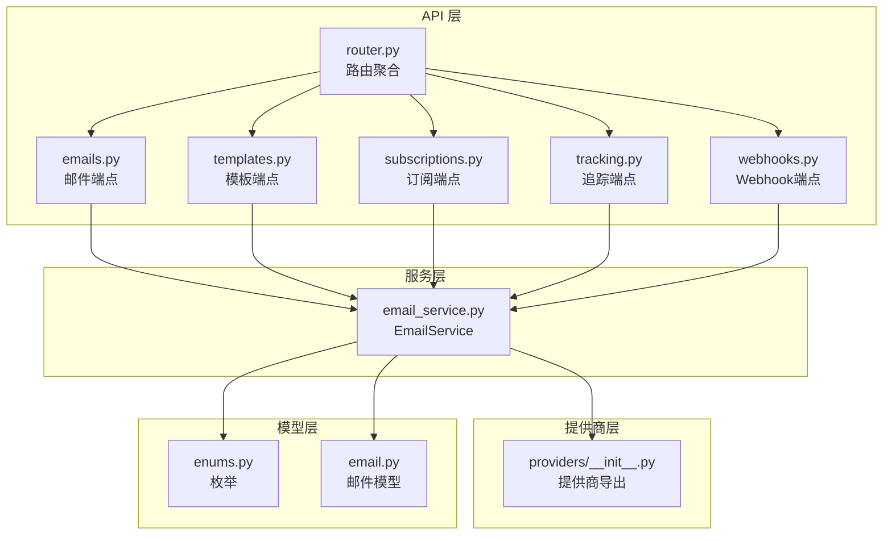
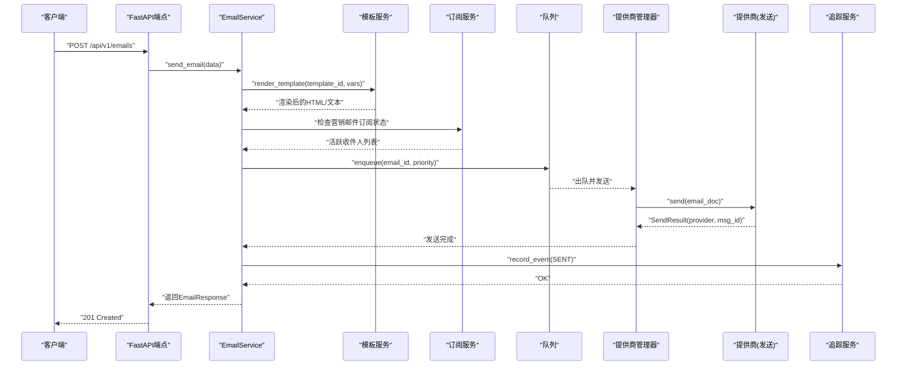
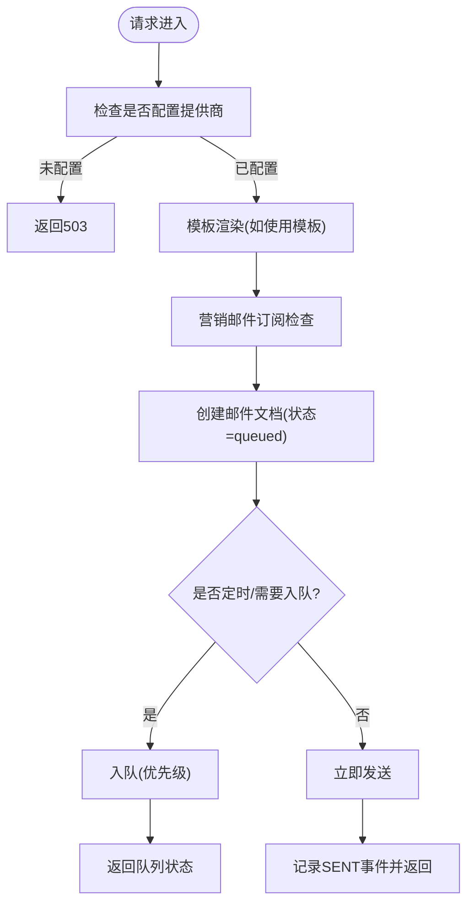
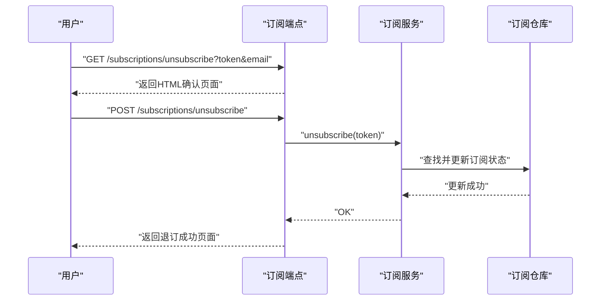
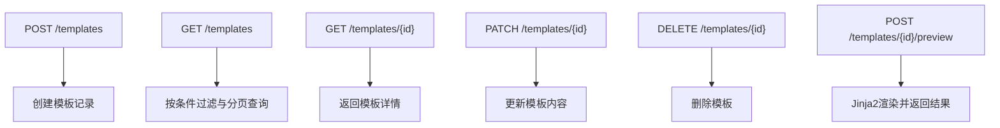
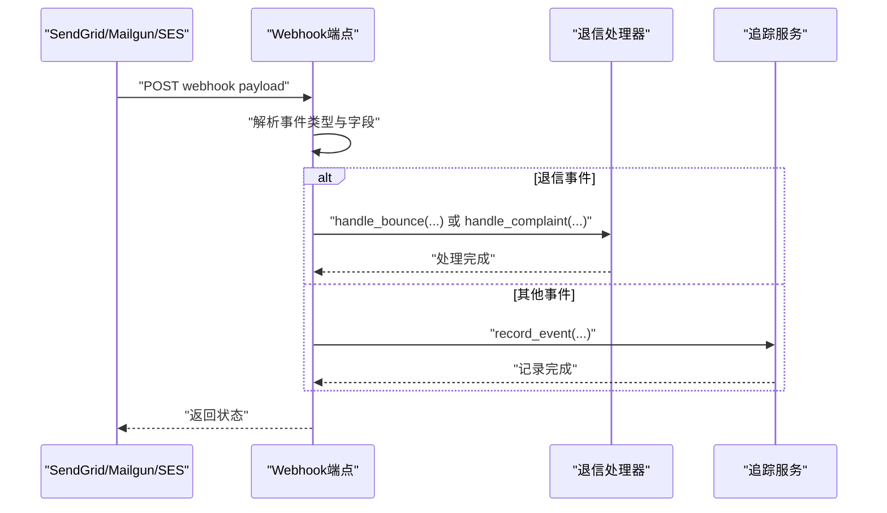
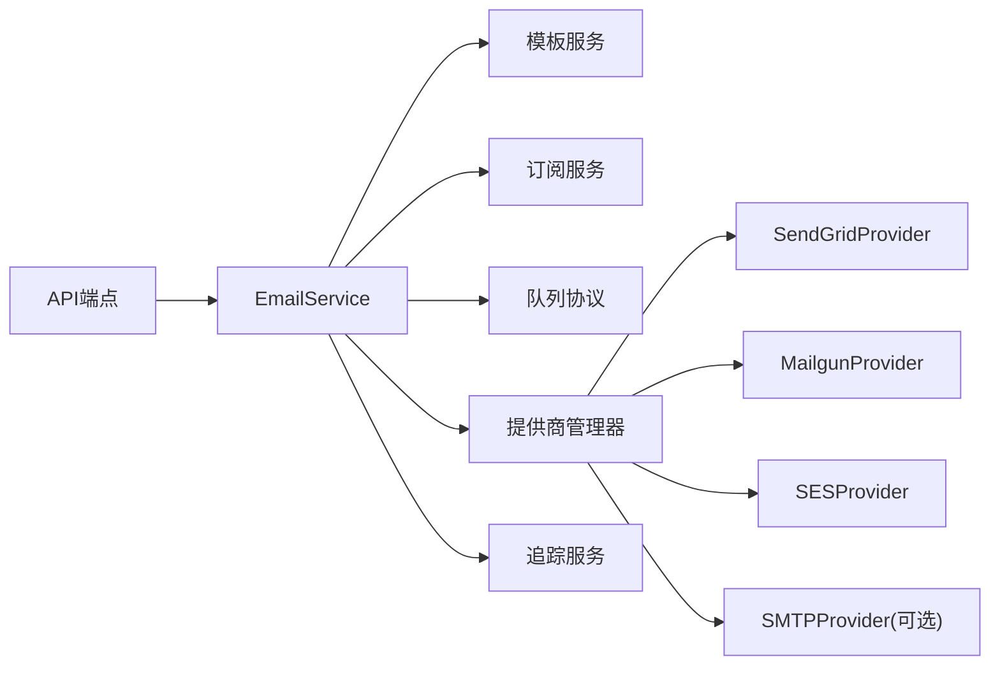

# 邮件服务API

<cite>
**本文引用的文件**
- [router.py](file://src/taolib/testing/email_service/server/api/router.py)
- [emails.py](file://src/taolib/testing/email_service/server/api/emails.py)
- [templates.py](file://src/taolib/testing/email_service/server/api/templates.py)
- [subscriptions.py](file://src/taolib/testing/email_service/server/api/subscriptions.py)
- [tracking.py](file://src/taolib/testing/email_service/server/api/tracking.py)
- [webhooks.py](file://src/taolib/testing/email_service/server/api/webhooks.py)
- [enums.py](file://src/taolib/testing/email_service/models/enums.py)
- [email.py](file://src/taolib/testing/email_service/models/email.py)
- [email_service.py](file://src/taolib/testing/email_service/services/email_service.py)
- [__init__.py](file://src/taolib/testing/email_service/providers/__init__.py)
</cite>

## 目录
1. [简介](#简介)
2. [项目结构](#项目结构)
3. [核心组件](#核心组件)
4. [架构总览](#架构总览)
5. [详细组件分析](#详细组件分析)
6. [依赖分析](#依赖分析)
7. [性能考虑](#性能考虑)
8. [故障排查指南](#故障排查指南)
9. [结论](#结论)
10. [附录](#附录)

## 简介
本文件为邮件服务API模块的权威技术文档，覆盖以下能力与范围：
- 邮件发送接口：单发、批量发送、模板邮件
- 订阅管理接口：订阅创建、取消、列表查询
- 模板管理接口：模板创建、更新、版本控制、预览
- 追踪接口：打开率、点击率、退信处理与统计
- Webhook接口：邮件状态回调、退信通知（SendGrid、Mailgun、SES、通用）
- 多提供商支持：SendGrid、Mailgun、SES、SMTP（可选）
- 邮件模板引擎：Jinja2 渲染
- 异步发送队列：内存队列与Redis队列（按协议抽象）
- 退信处理流程：硬退信/软退信分类、订阅状态更新、投诉处理
- 安全与合规：内容安全过滤建议、DKIM签名验证建议、反垃圾邮件最佳实践
- 集成方案：邮件营销自动化与实时通知

## 项目结构
邮件服务API采用分层设计，核心目录如下：
- server/api：FastAPI路由与端点定义
- services：业务服务（邮件、模板、订阅、追踪）
- providers：邮件提供商适配层（SendGrid、Mailgun、SES、SMTP）
- queue：队列抽象与实现（内存队列、Redis队列）
- repository：数据访问层（Email、Template、Subscription、Tracking）
- models：数据模型与枚举
- template：模板引擎（Jinja2）

图表来源
- [router.py:1-19](file://src/taolib/testing/email_service/server/api/router.py#L1-L19)
- [emails.py:1-257](file://src/taolib/testing/email_service/server/api/emails.py#L1-L257)
- [templates.py:1-86](file://src/taolib/testing/email_service/server/api/templates.py#L1-L86)
- [subscriptions.py:1-100](file://src/taolib/testing/email_service/server/api/subscriptions.py#L1-L100)
- [tracking.py:1-48](file://src/taolib/testing/email_service/server/api/tracking.py#L1-L48)
- [webhooks.py:1-194](file://src/taolib/testing/email_service/server/api/webhooks.py#L1-L194)
- [email_service.py:1-243](file://src/taolib/testing/email_service/services/email_service.py#L1-L243)
- [__init__.py:1-27](file://src/taolib/testing/email_service/providers/__init__.py#L1-L27)
- [enums.py:1-71](file://src/taolib/testing/email_service/models/enums.py#L1-L71)
- [email.py:1-152](file://src/taolib/testing/email_service/models/email.py#L1-L152)

章节来源
- [router.py:1-19](file://src/taolib/testing/email_service/server/api/router.py#L1-L19)

## 核心组件
- FastAPI 路由聚合：统一挂载邮件、模板、订阅、追踪、Webhook、健康检查等子路由
- 邮件服务 EmailService：编排模板渲染、订阅检查、队列入队、提供商发送、追踪事件记录
- 提供商适配层：SendGrid、Mailgun、SES、SMTP（可选），支持故障转移
- 模板服务：基于Jinja2的模板渲染与预览
- 订阅服务：订阅状态管理与退订令牌生成
- 追踪服务：事件记录与统计分析
- Webhook处理器：统一接收并解析各提供商回调，分派到追踪或退信处理

章节来源
- [email_service.py:28-63](file://src/taolib/testing/email_service/services/email_service.py#L28-L63)
- [__init__.py:1-27](file://src/taolib/testing/email_service/providers/__init__.py#L1-L27)

## 架构总览
下图展示从API调用到提供商发送的端到端流程，以及Webhook回传对追踪与退信的影响。

图表来源
- [emails.py:71-78](file://src/taolib/testing/email_service/server/api/emails.py#L71-L78)
- [email_service.py:64-147](file://src/taolib/testing/email_service/services/email_service.py#L64-L147)

## 详细组件分析

### 邮件发送接口
- 单发邮件
  - 路径：POST /api/v1/emails
  - 功能：支持模板渲染、订阅检查、队列入队、返回队列状态
  - 请求体字段：发件人、收件人、主题、HTML/文本正文、类型、优先级、标签、附件、定时发送、元数据、模板ID与变量
  - 响应：包含邮件ID、状态、时间戳等
- 批量发送
  - 路径：POST /api/v1/emails/bulk
  - 功能：批量入队，单次最多100封
- 邮件查询
  - GET /api/v1/emails：支持按状态、类型过滤
  - GET /api/v1/emails/{email_id}：获取详情
  - GET /api/v1/emails/{email_id}/events：获取追踪事件

图表来源
- [emails.py:71-124](file://src/taolib/testing/email_service/server/api/emails.py#L71-L124)
- [email_service.py:64-147](file://src/taolib/testing/email_service/services/email_service.py#L64-L147)

章节来源
- [emails.py:31-257](file://src/taolib/testing/email_service/server/api/emails.py#L31-L257)
- [email.py:47-94](file://src/taolib/testing/email_service/models/email.py#L47-L94)

### 订阅管理接口
- 列表查询
  - GET /api/v1/subscriptions：支持按状态过滤、分页
- 订阅状态查询
  - GET /api/v1/subscriptions/{email}：若不存在则返回默认激活状态
- 重新订阅
  - POST /api/v1/subscriptions/{email}/resubscribe：触发重新订阅逻辑
- 退订（公开页面与处理）
  - GET /api/v1/subscriptions/unsubscribe?token&email：退订确认页面
  - POST /api/v1/subscriptions/unsubscribe：处理退订请求，更新订阅状态

图表来源
- [subscriptions.py:47-98](file://src/taolib/testing/email_service/server/api/subscriptions.py#L47-L98)

章节来源
- [subscriptions.py:1-100](file://src/taolib/testing/email_service/server/api/subscriptions.py#L1-L100)
- [enums.py:64-69](file://src/taolib/testing/email_service/models/enums.py#L64-L69)

### 模板管理接口
- 创建模板
  - POST /api/v1/templates
- 列表查询
  - GET /api/v1/templates：支持按类型与激活状态过滤
- 获取详情
  - GET /api/v1/templates/{template_id}
- 更新模板
  - PATCH /api/v1/templates/{template_id}
- 删除模板
  - DELETE /api/v1/templates/{template_id}
- 模板预览
  - POST /api/v1/templates/{template_id}/preview：返回渲染后的主题与正文

图表来源
- [templates.py:15-84](file://src/taolib/testing/email_service/server/api/templates.py#L15-L84)

章节来源
- [templates.py:1-86](file://src/taolib/testing/email_service/server/api/templates.py#L1-L86)

### 追踪与分析接口
- 分析数据
  - GET /api/v1/tracking/analytics：按天数统计
- 日统计数据
  - GET /api/v1/tracking/daily：按天统计
- 事件查询
  - GET /api/v1/tracking/events：支持按邮件ID或分页查询

章节来源
- [tracking.py:10-48](file://src/taolib/testing/email_service/server/api/tracking.py#L10-L48)

### Webhook 接口
- SendGrid
  - POST /api/v1/webhooks/sendgrid：接收事件数组，映射事件类型，处理退信与投诉，记录其他事件
- Mailgun
  - POST /api/v1/webhooks/mailgun：解析事件数据，处理退信/投诉/投递/打开/点击
- SES
  - POST /api/v1/webhooks/ses：解析SNS通知，处理退信、投诉、投递
- 通用
  - POST /api/v1/webhooks/generic：接收通用格式事件，记录事件

图表来源
- [webhooks.py:13-191](file://src/taolib/testing/email_service/server/api/webhooks.py#L13-L191)

章节来源
- [webhooks.py:1-194](file://src/taolib/testing/email_service/server/api/webhooks.py#L1-L194)

## 依赖分析
- 组件耦合
  - API层仅依赖服务层接口，低耦合高内聚
  - EmailService依赖模板、订阅、追踪、提供商管理器与队列协议
  - 提供商层通过协议抽象屏蔽具体实现差异
- 外部依赖
  - 提供商SDK（SendGrid、Mailgun、SES）
  - 队列实现（内存/Redis）
  - 模板引擎（Jinja2）
- 循环依赖
  - 未见循环导入；服务间通过接口交互

图表来源
- [email_service.py:38-62](file://src/taolib/testing/email_service/services/email_service.py#L38-L62)
- [__init__.py:3-24](file://src/taolib/testing/email_service/providers/__init__.py#L3-L24)

章节来源
- [email_service.py:18-23](file://src/taolib/testing/email_service/services/email_service.py#L18-L23)
- [__init__.py:1-27](file://src/taolib/testing/email_service/providers/__init__.py#L1-L27)

## 性能考虑
- 异步队列与并发
  - 使用队列异步发送，避免阻塞HTTP请求
  - 支持优先级队列与延迟发送
- 重试策略
  - 失败时指数退避重试，达到最大重试次数后标记失败
- 批量发送
  - 单次批量上限100封，降低单次压力
- 数据库与索引
  - 建议在状态、类型、时间戳等字段建立索引以优化查询
- 模板渲染
  - 对常用模板进行缓存，减少重复渲染开销

## 故障排查指南
- 常见错误与定位
  - 503 未配置提供商：检查应用启动时提供商初始化
  - 404 邮件/模板不存在：确认ID正确性与数据存在性
  - 400 订阅相关错误：核对退订令牌与邮箱格式
- 日志与追踪
  - 关注发送失败日志与重试计数
  - 通过追踪事件查询定位问题（投递、打开、点击、退信）
- Webhook 回调
  - 确认回调URL可达且未被防火墙拦截
  - 核对事件映射与字段提取逻辑

章节来源
- [emails.py:65-78](file://src/taolib/testing/email_service/server/api/emails.py#L65-L78)
- [subscriptions.py:84-97](file://src/taolib/testing/email_service/server/api/subscriptions.py#L84-L97)
- [email_service.py:193-212](file://src/taolib/testing/email_service/services/email_service.py#L193-L212)

## 结论
该邮件服务API模块提供了完整的邮件发送、模板管理、订阅与追踪能力，并通过多提供商适配与异步队列实现了高可用与高扩展性。结合Webhook回调与退信处理，可构建完善的邮件营销自动化与实时通知体系。建议在生产环境中完善安全与合规措施，并持续优化模板渲染与队列性能。

## 附录

### API 端点一览
- 邮件
  - POST /api/v1/emails
  - POST /api/v1/emails/bulk
  - GET /api/v1/emails
  - GET /api/v1/emails/{email_id}
  - GET /api/v1/emails/{email_id}/events
- 模板
  - POST /api/v1/templates
  - GET /api/v1/templates
  - GET /api/v1/templates/{template_id}
  - PATCH /api/v1/templates/{template_id}
  - DELETE /api/v1/templates/{template_id}
  - POST /api/v1/templates/{template_id}/preview
- 订阅
  - GET /api/v1/subscriptions
  - GET /api/v1/subscriptions/{email}
  - POST /api/v1/subscriptions/{email}/resubscribe
  - GET /api/v1/subscriptions/unsubscribe
  - POST /api/v1/subscriptions/unsubscribe
- 追踪
  - GET /api/v1/tracking/analytics
  - GET /api/v1/tracking/daily
  - GET /api/v1/tracking/events
- Webhook
  - POST /api/v1/webhooks/sendgrid
  - POST /api/v1/webhooks/mailgun
  - POST /api/v1/webhooks/ses
  - POST /api/v1/webhooks/generic

### 数据模型与枚举要点
- 邮件状态：queued/sending/sent/delivered/opened/clicked/bounced/failed/rejected
- 邮件类型：transactional/marketing
- 事件类型：sent/delivered/opened/clicked/bounced/complained/unsubscribed
- 退信类型：hard/soft/undetermined
- 订阅状态：active/unsubscribed

章节来源
- [enums.py:6-71](file://src/taolib/testing/email_service/models/enums.py#L6-L71)
- [email.py:10-152](file://src/taolib/testing/email_service/models/email.py#L10-L152)

### 多提供商与模板引擎
- 提供商：SendGrid、Mailgun、SES、SMTP（可选）
- 模板引擎：Jinja2，支持变量渲染与预览
- 队列：内存队列与Redis队列（通过协议抽象）

章节来源
- [__init__.py:3-24](file://src/taolib/testing/email_service/providers/__init__.py#L3-L24)
- [email_service.py:87-95](file://src/taolib/testing/email_service/services/email_service.py#L87-L95)

### 安全与合规建议
- 内容安全过滤：对模板变量与用户输入进行白名单校验与XSS过滤
- DKIM/SPF/DKIM：确保域名DMARC策略正确配置，启用DKIM签名
- 反垃圾邮件：合理设置退信阈值、频率限制与退订链接
- Webhook签名验证：对回调进行签名校验以防止伪造