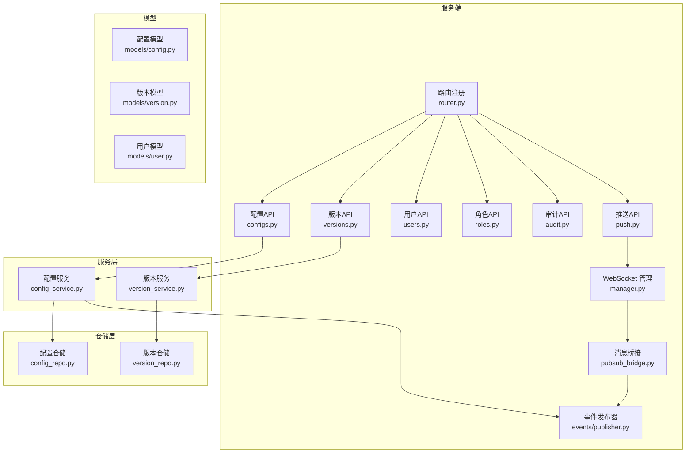
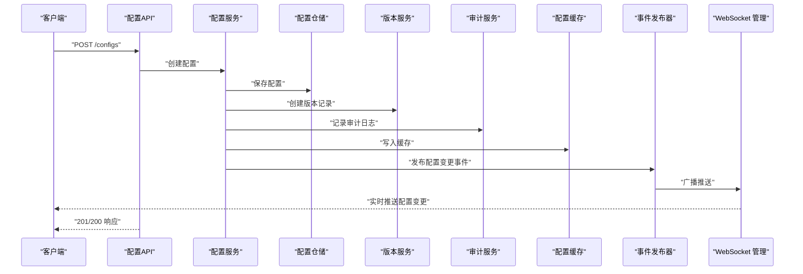
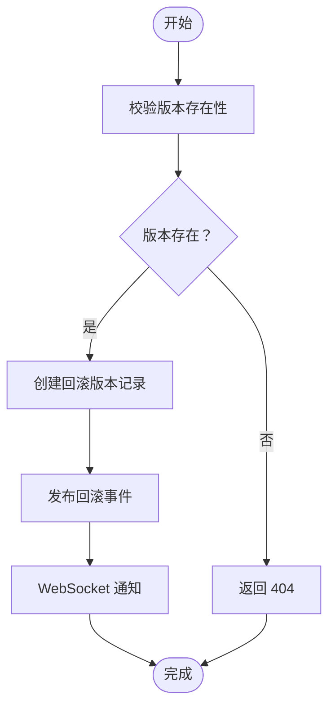
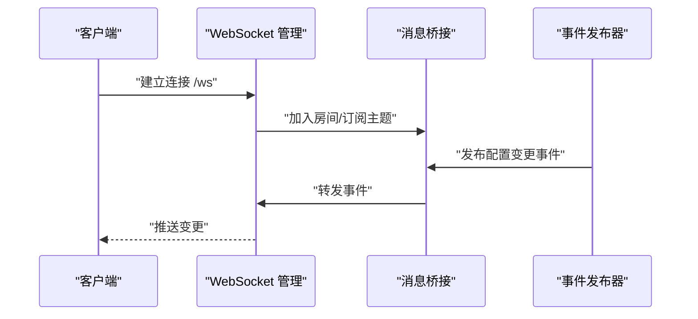
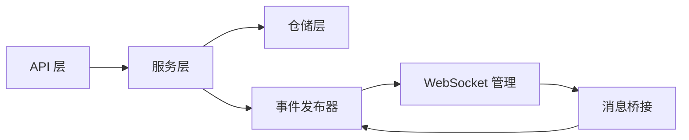

# 配置API

<cite>
**本文引用的文件**
- [src/taolib/testing/config_center/server/api/router.py](file://src/taolib/testing/config_center/server/api/router.py)
- [src/taolib/testing/config_center/server/api/configs.py](file://src/taolib/testing/config_center/server/api/configs.py)
- [src/taolib/testing/config_center/server/api/versions.py](file://src/taolib/testing/config_center/server/api/versions.py)
- [src/taolib/testing/config_center/server/api/users.py](file://src/taolib/testing/config_center/server/api/users.py)
- [src/taolib/testing/config_center/server/api/roles.py](file://src/taolib/testing/config_center/server/api/roles.py)
- [src/taolib/testing/config_center/server/api/audit.py](file://src/taolib/testing/config_center/server/api/audit.py)
- [src/taolib/testing/config_center/server/api/push.py](file://src/taolib/testing/config_center/server/api/push.py)
- [src/taolib/testing/config_center/server/websocket/manager.py](file://src/taolib/testing/config_center/server/websocket/manager.py)
- [src/taolib/testing/config_center/server/websocket/pubsub_bridge.py](file://src/taolib/testing/config_center/server/websocket/pubsub_bridge.py)
- [src/taolib/testing/config_center/events/publisher.py](file://src/taolib/testing/config_center/events/publisher.py)
- [src/taolib/testing/config_center/services/config_service.py](file://src/taolib/testing/config_center/services/config_service.py)
- [src/taolib/testing/config_center/services/version_service.py](file://src/taolib/testing/config_center/services/version_service.py)
- [src/taolib/testing/config_center/repository/config_repo.py](file://src/taolib/testing/config_center/repository/config_repo.py)
- [src/taolib/testing/config_center/repository/version_repo.py](file://src/taolib/testing/config_center/repository/version_repo.py)
- [src/taolib/testing/config_center/models/config.py](file://src/taolib/testing/config_center/models/config.py)
- [src/taolib/testing/config_center/models/version.py](file://src/taolib/testing/config_center/models/version.py)
- [src/taolib/testing/config_center/models/user.py](file://src/taolib/testing/config_center/models/user.py)
- [src/taolib/testing/config_center/server/auth/rbac.py](file://src/taolib/testing/config_center/server/auth/rbac.py)
- [src/taolib/testing/config_center/server/app.py](file://src/taolib/testing/config_center/server/app.py)
- [tests/testing/test_config_center/test_api_integration.py](file://tests/testing/test_config_center/test_api_integration.py)
</cite>

## 目录
1. [简介](#简介)
2. [项目结构](#项目结构)
3. [核心组件](#核心组件)
4. [架构总览](#架构总览)
5. [详细组件分析](#详细组件分析)
6. [依赖关系分析](#依赖关系分析)
7. [性能考量](#性能考量)
8. [故障排查指南](#故障排查指南)
9. [结论](#结论)
10. [附录](#附录)

## 简介
本文件为配置中心API模块的权威文档，覆盖配置管理、版本控制、用户与角色管理、审计日志、推送服务等全部配置相关端点。内容包括：
- 接口定义、请求/响应格式、参数校验规则
- 权限控制与作用域机制
- 错误处理策略
- 实时推送与WebSocket连接管理
- 完整集成示例与最佳实践

## 项目结构
配置中心API位于 taolib/testing/config_center 子模块中，采用分层设计：
- server/api：REST API 路由与端点
- server/websocket：WebSocket 推送与连接管理
- services：业务逻辑层（配置、版本、审计）
- repository：数据访问层（MongoDB）
- models：数据模型与枚举
- events：事件发布器
- server/auth：RBAC 权限与鉴权

**图表来源**
- [src/taolib/testing/config_center/server/api/router.py](file://src/taolib/testing/config_center/server/api/router.py)
- [src/taolib/testing/config_center/server/api/configs.py](file://src/taolib/testing/config_center/server/api/configs.py)
- [src/taolib/testing/config_center/server/api/versions.py](file://src/taolib/testing/config_center/server/api/versions.py)
- [src/taolib/testing/config_center/server/api/users.py](file://src/taolib/testing/config_center/server/api/users.py)
- [src/taolib/testing/config_center/server/api/roles.py](file://src/taolib/testing/config_center/server/api/roles.py)
- [src/taolib/testing/config_center/server/api/audit.py](file://src/taolib/testing/config_center/server/api/audit.py)
- [src/taolib/testing/config_center/server/api/push.py](file://src/taolib/testing/config_center/server/api/push.py)
- [src/taolib/testing/config_center/server/websocket/manager.py](file://src/taolib/testing/config_center/server/websocket/manager.py)
- [src/taolib/testing/config_center/server/websocket/pubsub_bridge.py](file://src/taolib/testing/config_center/server/websocket/pubsub_bridge.py)
- [src/taolib/testing/config_center/events/publisher.py](file://src/taolib/testing/config_center/events/publisher.py)
- [src/taolib/testing/config_center/services/config_service.py](file://src/taolib/testing/config_center/services/config_service.py)
- [src/taolib/testing/config_center/services/version_service.py](file://src/taolib/testing/config_center/services/version_service.py)
- [src/taolib/testing/config_center/repository/config_repo.py](file://src/taolib/testing/config_center/repository/config_repo.py)
- [src/taolib/testing/config_center/repository/version_repo.py](file://src/taolib/testing/config_center/repository/version_repo.py)
- [src/taolib/testing/config_center/models/config.py](file://src/taolib/testing/config_center/models/config.py)
- [src/taolib/testing/config_center/models/version.py](file://src/taolib/testing/config_center/models/version.py)
- [src/taolib/testing/config_center/models/user.py](file://src/taolib/testing/config_center/models/user.py)

**章节来源**
- [src/taolib/testing/config_center/server/api/router.py](file://src/taolib/testing/config_center/server/api/router.py)
- [src/taolib/testing/config_center/server/app.py](file://src/taolib/testing/config_center/server/app.py)

## 核心组件
- 路由与应用：注册各API模块，初始化CORS、依赖注入容器
- 配置服务：封装配置CRUD、发布、缓存、事件发布
- 版本服务：版本创建、查询、回滚、差异比较
- WebSocket 管理：连接维护、心跳、订阅、消息桥接
- 事件发布器：配置变更事件的发布与目标用户定向推送
- 数据模型：配置、版本、用户、审计日志等实体定义
- 权限控制：基于资源的动作授权与环境/服务作用域

**章节来源**
- [src/taolib/testing/config_center/server/api/configs.py](file://src/taolib/testing/config_center/server/api/configs.py)
- [src/taolib/testing/config_center/server/api/versions.py](file://src/taolib/testing/config_center/server/api/versions.py)
- [src/taolib/testing/config_center/server/websocket/manager.py](file://src/taolib/testing/config_center/server/websocket/manager.py)
- [src/taolib/testing/config_center/events/publisher.py](file://src/taolib/testing/config_center/events/publisher.py)
- [src/taolib/testing/config_center/services/config_service.py](file://src/taolib/testing/config_center/services/config_service.py)
- [src/taolib/testing/config_center/services/version_service.py](file://src/taolib/testing/config_center/services/version_service.py)
- [src/taolib/testing/config_center/models/config.py](file://src/taolib/testing/config_center/models/config.py)
- [src/taolib/testing/config_center/models/version.py](file://src/taolib/testing/config_center/models/version.py)
- [src/taolib/testing/config_center/models/user.py](file://src/taolib/testing/config_center/models/user.py)
- [src/taolib/testing/config_center/server/auth/rbac.py](file://src/taolib/testing/config_center/server/auth/rbac.py)

## 架构总览
配置中心采用“API层-服务层-仓储层-模型层”的清晰分层，配合事件驱动与WebSocket实现实时推送。

**图表来源**
- [src/taolib/testing/config_center/server/api/configs.py](file://src/taolib/testing/config_center/server/api/configs.py)
- [src/taolib/testing/config_center/services/config_service.py](file://src/taolib/testing/config_center/services/config_service.py)
- [src/taolib/testing/config_center/services/version_service.py](file://src/taolib/testing/config_center/services/version_service.py)
- [src/taolib/testing/config_center/repository/config_repo.py](file://src/taolib/testing/config_center/repository/config_repo.py)
- [src/taolib/testing/config_center/events/publisher.py](file://src/taolib/testing/config_center/events/publisher.py)
- [src/taolib/testing/config_center/server/websocket/manager.py](file://src/taolib/testing/config_center/server/websocket/manager.py)

## 详细组件分析

### 配置管理 API
- 路由前缀：/configs
- 支持环境与服务过滤、分页查询
- 权限：config:read、config:write、config:delete、config:publish
- 关键端点
  - GET /configs：查询配置列表（支持环境、服务、分页）
  - GET /configs/{id}：获取单个配置
  - POST /configs：创建配置
  - PUT /configs/{id}：更新配置
  - DELETE /configs/{id}：删除配置
  - POST /configs/{id}/publish：发布配置（触发版本创建与事件推送）

请求/响应要点
- 请求体使用 ConfigCreate/ConfigUpdate 模型
- 响应体使用 ConfigResponse 模型
- 参数校验：键名、值、环境、服务、标签等字段校验
- 错误码：400（参数错误）、403（权限不足）、404（资源不存在）、422（校验失败）、500（内部错误）

权限与作用域
- 使用 JWT 认证
- RBAC 角色包含 config:*、version:*、audit:* 权限
- 支持环境与服务作用域限制

实时推送
- 发布成功后通过事件发布器广播
- WebSocket 管理器向订阅者推送

**章节来源**
- [src/taolib/testing/config_center/server/api/configs.py](file://src/taolib/testing/config_center/server/api/configs.py)
- [src/taolib/testing/config_center/models/config.py](file://src/taolib/testing/config_center/models/config.py)
- [src/taolib/testing/config_center/server/auth/rbac.py](file://src/taolib/testing/config_center/server/auth/rbac.py)
- [src/taolib/testing/config_center/events/publisher.py](file://src/taolib/testing/config_center/events/publisher.py)
- [src/taolib/testing/config_center/server/websocket/manager.py](file://src/taolib/testing/config_center/server/websocket/manager.py)

### 版本控制 API
- 路由前缀：/configs/{id}/versions
- 权限：version:read、version:rollback
- 关键端点
  - GET /configs/{id}/versions：获取版本历史（分页）
  - GET /configs/{id}/versions/{version}：获取指定版本详情
  - POST /configs/{id}/versions/{version}/rollback：回滚到指定版本
  - GET /configs/{id}/versions/diff/{v1}/to/{v2}：版本差异比较

流程图（回滚）

**图表来源**
- [src/taolib/testing/config_center/server/api/versions.py](file://src/taolib/testing/config_center/server/api/versions.py)
- [src/taolib/testing/config_center/services/version_service.py](file://src/taolib/testing/config_center/services/version_service.py)
- [src/taolib/testing/config_center/events/publisher.py](file://src/taolib/testing/config_center/events/publisher.py)

**章节来源**
- [src/taolib/testing/config_center/server/api/versions.py](file://src/taolib/testing/config_center/server/api/versions.py)
- [src/taolib/testing/config_center/services/version_service.py](file://src/taolib/testing/config_center/services/version_service.py)
- [src/taolib/testing/config_center/models/version.py](file://src/taolib/testing/config_center/models/version.py)

### 用户与角色管理 API
- 用户管理：CRUD、角色分配、状态管理
- 角色管理：RBAC 角色定义、权限集合、作用域
- 权限：users:*、roles:*、config:*（按作用域）

**章节来源**
- [src/taolib/testing/config_center/server/api/users.py](file://src/taolib/testing/config_center/server/api/users.py)
- [src/taolib/testing/config_center/server/api/roles.py](file://src/taolib/testing/config_center/server/api/roles.py)
- [src/taolib/testing/config_center/models/user.py](file://src/taolib/testing/config_center/models/user.py)
- [src/taolib/testing/config_center/server/auth/rbac.py](file://src/taolib/testing/config_center/server/auth/rbac.py)

### 审计日志 API
- 查询审计记录：按时间、用户、资源、动作过滤
- 权限：audit:read
- 用于变更追踪与合规审计

**章节来源**
- [src/taolib/testing/config_center/server/api/audit.py](file://src/taolib/testing/config_center/server/api/audit.py)
- [src/taolib/testing/config_center/models/audit.py](file://src/taolib/testing/config_center/models/audit.py)

### 推送服务 API
- WebSocket 连接：心跳、订阅、离线消息缓冲
- 事件桥接：将配置变更事件转发至 WebSocket
- 端点：/ws（WebSocket 协议），/push/notify（HTTP 主动通知）

**图表来源**
- [src/taolib/testing/config_center/server/websocket/manager.py](file://src/taolib/testing/config_center/server/websocket/manager.py)
- [src/taolib/testing/config_center/server/websocket/pubsub_bridge.py](file://src/taolib/testing/config_center/server/websocket/pubsub_bridge.py)
- [src/taolib/testing/config_center/events/publisher.py](file://src/taolib/testing/config_center/events/publisher.py)

**章节来源**
- [src/taolib/testing/config_center/server/api/push.py](file://src/taolib/testing/config_center/server/api/push.py)
- [src/taolib/testing/config_center/server/websocket/manager.py](file://src/taolib/testing/config_center/server/websocket/manager.py)
- [src/taolib/testing/config_center/server/websocket/pubsub_bridge.py](file://src/taolib/testing/config_center/server/websocket/pubsub_bridge.py)
- [src/taolib/testing/config_center/events/publisher.py](file://src/taolib/testing/config_center/events/publisher.py)

## 依赖关系分析
- 组件耦合
  - API 层仅依赖服务层接口，低耦合高内聚
  - 服务层依赖仓储与事件发布器，职责单一
  - WebSocket 与事件发布器解耦，通过桥接器通信
- 外部依赖
  - MongoDB 仓储
  - Redis 缓存（键空间与模式见 keys.py）
  - FastAPI 应用与中间件栈

**图表来源**
- [src/taolib/testing/config_center/server/api/configs.py](file://src/taolib/testing/config_center/server/api/configs.py)
- [src/taolib/testing/config_center/services/config_service.py](file://src/taolib/testing/config_center/services/config_service.py)
- [src/taolib/testing/config_center/repository/config_repo.py](file://src/taolib/testing/config_center/repository/config_repo.py)
- [src/taolib/testing/config_center/events/publisher.py](file://src/taolib/testing/config_center/events/publisher.py)
- [src/taolib/testing/config_center/server/websocket/manager.py](file://src/taolib/testing/config_center/server/websocket/manager.py)
- [src/taolib/testing/config_center/server/websocket/pubsub_bridge.py](file://src/taolib/testing/config_center/server/websocket/pubsub_bridge.py)

**章节来源**
- [src/taolib/testing/config_center/cache/keys.py](file://src/taolib/testing/config_center/cache/keys.py)
- [src/taolib/testing/config_center/server/app.py](file://src/taolib/testing/config_center/server/app.py)

## 性能考量
- 缓存策略：使用配置键空间与元数据键，降低数据库压力
- 分页查询：默认分页参数避免一次性加载过多数据
- 事件批处理：批量发布配置变更事件，减少网络抖动
- 连接池：WebSocket 管理器复用连接，降低握手开销
- 最佳实践
  - 对高频读取的配置启用缓存
  - 控制版本历史数量，定期归档旧版本
  - 使用服务作用域与环境作用域缩小推送范围

[本节为通用指导，无需具体文件引用]

## 故障排查指南
常见问题与处理
- 401 未认证：确认携带有效的 JWT Token
- 403 权限不足：检查用户角色是否具备 config:* 权限及作用域
- 404 资源不存在：确认配置ID或版本号正确
- 422 校验失败：检查请求体字段类型与长度约束
- WebSocket 推送失败：检查桥接器与发布器状态，确认客户端订阅

**章节来源**
- [tests/testing/test_config_center/test_api_integration.py](file://tests/testing/test_config_center/test_api_integration.py)
- [src/taolib/testing/config_center/server/auth/rbac.py](file://src/taolib/testing/config_center/server/auth/rbac.py)

## 结论
该配置中心API模块提供了完善的配置全生命周期管理能力，结合版本控制、RBAC 权限、审计日志与实时推送，满足生产级配置管理需求。建议在集成时遵循参数校验、权限控制与缓存策略的最佳实践，确保系统的稳定性与可扩展性。

[本节为总结，无需具体文件引用]

## 附录

### API 端点一览（概要）
- 配置管理
  - GET /configs
  - GET /configs/{id}
  - POST /configs
  - PUT /configs/{id}
  - DELETE /configs/{id}
  - POST /configs/{id}/publish
- 版本管理
  - GET /configs/{id}/versions
  - GET /configs/{id}/versions/{version}
  - POST /configs/{id}/versions/{version}/rollback
  - GET /configs/{id}/versions/diff/{v1}/to/{v2}
- 用户与角色
  - 用户：CRUD、角色分配
  - 角色：RBAC 定义与作用域
- 审计日志
  - GET /audit/logs
- 推送服务
  - WebSocket：/ws
  - HTTP 通知：/push/notify

[本节为概要，无需具体文件引用]

### 集成示例与最佳实践
- 示例场景
  - 创建配置并发布：先 POST /configs，再 POST /configs/{id}/publish
  - 回滚配置：POST /configs/{id}/versions/{version}/rollback
  - 订阅推送：建立 /ws 连接并订阅目标配置键
- 最佳实践
  - 使用服务与环境作用域最小化权限
  - 对关键配置启用缓存与版本回滚
  - 审计日志保留周期与合规要求一致
  - WebSocket 连接保持心跳，异常重连

[本节为通用指导，无需具体文件引用]