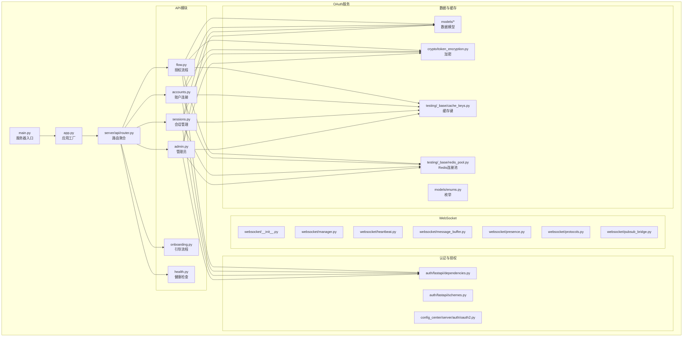
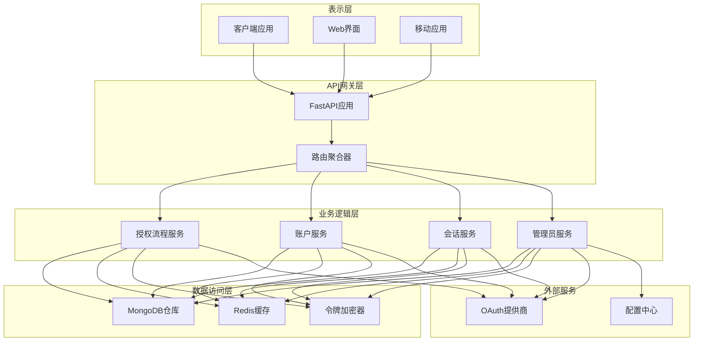
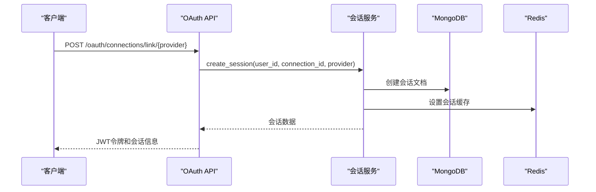
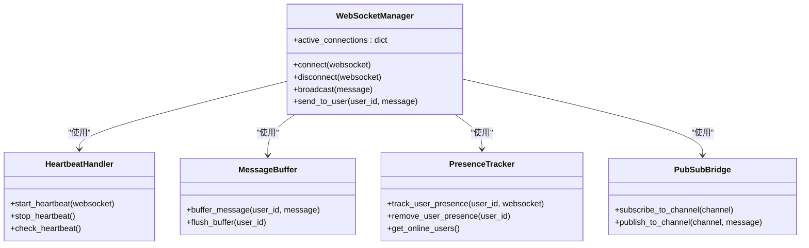
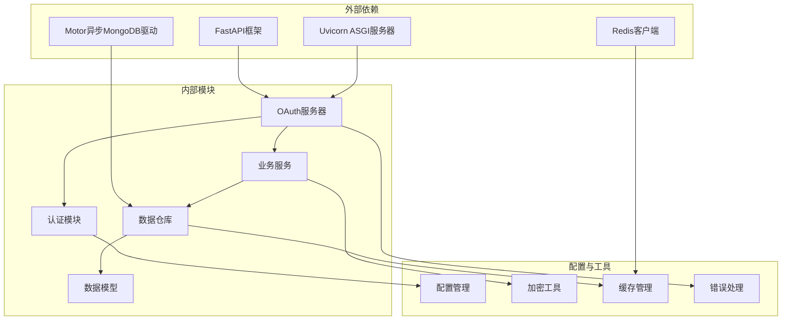

# OAuth API参考

<cite>
**本文档引用的文件**
- [router.py](file://src/taolib/testing/oauth/server/api/router.py)
- [app.py](file://src/taolib/testing/oauth/server/app.py)
- [main.py](file://src/taolib/testing/oauth/server/main.py)
- [flow.py](file://src/taolib/testing/oauth/server/api/flow.py)
- [accounts.py](file://src/taolib/testing/oauth/server/api/accounts.py)
- [sessions.py](file://src/taolib/testing/oauth/server/api/sessions.py)
- [admin.py](file://src/taolib/testing/oauth/server/api/admin.py)
- [onboarding.py](file://src/taolib/testing/oauth/server/api/onboarding.py)
- [health.py](file://src/taolib/testing/oauth/server/api/health.py)
- [cache_keys.py](file://src/taolib/testing/_base/cache_keys.py)
- [oauth2.py](file://src/taolib/testing/config_center/server/auth/oauth2.py)
- [dependencies.py](file://src/taolib/testing/auth/fastapi/dependencies.py)
- [schemes.py](file://src/taolib/testing/auth/fastapi/schemes.py)
- [models.py](file://src/taolib/testing/oauth/models/session.py)
- [models.py](file://src/taolib/testing/oauth/models/connection.py)
- [models.py](file://src/taolib/testing/oauth/models/profile.py)
- [models.py](file://src/taolib/testing/oauth/models/credential.py)
- [models.py](file://src/taolib/testing/oauth/models/activity.py)
- [enums.py](file://src/taolib/testing/oauth/models/enums.py)
- [errors.py](file://src/taolib/testing/oauth/errors.py)
- [token_encryption.py](file://src/taolib/testing/oauth/crypto/token_encryption.py)
- [redis_pool.py](file://src/taolib/testing/_base/redis_pool.py)
- [config.py](file://src/taolib/testing/oauth/server/config.py)
- [config.py](file://src/taolib/testing/oauth/server/dependencies.py)
- [websocket_main.py](file://src/taolib/testing/oauth/server/websocket/__init__.py)
- [heartbeat.py](file://src/taolib/testing/oauth/server/websocket/heartbeat.py)
- [manager.py](file://src/taolib/testing/oauth/server/websocket/manager.py)
- [message_buffer.py](file://src/taolib/testing/oauth/server/websocket/message_buffer.py)
- [presence.py](file://src/taolib/testing/oauth/server/websocket/presence.py)
- [protocols.py](file://src/taolib/testing/oauth/server/websocket/protocols.py)
- [pubsub_bridge.py](file://src/taolib/testing/oauth/server/websocket/pubsub_bridge.py)
</cite>

## 目录
1. [简介](#简介)
2. [项目结构](#项目结构)
3. [核心组件](#核心组件)
4. [架构概览](#架构概览)
5. [详细组件分析](#详细组件分析)
6. [依赖关系分析](#依赖关系分析)
7. [性能考虑](#性能考虑)
8. [故障排除指南](#故障排除指南)
9. [结论](#结论)
10. [附录](#附录)

## 简介
本文件为OAuth API参考文档，涵盖授权流程API、账户管理API、会话管理API和管理员API的完整HTTP接口规范。文档详细记录了每个API的HTTP方法、URL模式、请求参数、响应格式、认证方法、权限要求、访问控制策略，并提供了请求示例、响应示例、错误处理机制说明。同时包含API版本控制、速率限制、安全考虑、集成指南、客户端实现建议以及性能优化技巧。

## 项目结构
OAuth服务采用FastAPI框架构建，主要模块包括：
- 服务器入口与配置：main.py、app.py、config.py
- API路由聚合：server/api/router.py
- 核心业务API：flow.py（授权流程）、accounts.py（账户连接）、sessions.py（会话管理）、admin.py（管理员）、onboarding.py（引导流程）、health.py（健康检查）
- WebSocket实时通信：websocket子模块
- 数据模型与枚举：models子包
- 认证与授权：auth子包（FastAPI安全方案、RBAC中间件等）
- 缓存与加密：cache、crypto子包
- 错误处理：errors.py



**图表来源**
- [router.py:1-25](file://src/taolib/testing/oauth/server/api/router.py#L1-L25)
- [app.py:1-140](file://src/taolib/testing/oauth/server/app.py#L1-L140)
- [main.py:1-32](file://src/taolib/testing/oauth/server/main.py#L1-L32)

**章节来源**
- [router.py:1-25](file://src/taolib/testing/oauth/server/api/router.py#L1-L25)
- [app.py:1-140](file://src/taolib/testing/oauth/server/app.py#L1-L140)
- [main.py:1-32](file://src/taolib/testing/oauth/server/main.py#L1-L32)

## 核心组件
OAuth服务的核心组件包括：

### 1. 服务器配置与生命周期
- 应用工厂：创建FastAPI实例，配置CORS、数据库连接、Redis连接
- 生命周期管理：启动时初始化MongoDB索引、引导OAuth凭据，关闭时清理资源
- 版本控制：API前缀为/api/v1，支持未来版本升级

### 2. 认证与授权
- OAuth2密码承载方案：通过FastAPI的OAuth2PasswordBearer实现
- API密钥方案：支持基于头部的API密钥认证
- RBAC中间件：基于角色的访问控制
- CSRF防护：状态参数验证防止跨站请求伪造

### 3. 数据模型与缓存
- OAuth连接模型：存储用户与第三方提供商的关联信息
- 会话模型：管理用户会话状态和令牌
- 缓存键空间：专门的OAuth缓存键前缀（state、session、user_sessions）

**章节来源**
- [app.py:22-66](file://src/taolib/testing/oauth/server/app.py#L22-L66)
- [dependencies.py:9-62](file://src/taolib/testing/auth/fastapi/dependencies.py#L9-L62)
- [schemes.py:8-21](file://src/taolib/testing/auth/fastapi/schemes.py#L8-L21)
- [cache_keys.py:56-62](file://src/taolib/testing/_base/cache_keys.py#L56-L62)

## 架构概览
OAuth服务采用分层架构设计，包含以下层次：



**图表来源**
- [app.py:116-137](file://src/taolib/testing/oauth/server/app.py#L116-L137)
- [router.py:15-22](file://src/taolib/testing/oauth/server/api/router.py#L15-L22)

## 详细组件分析

### 授权流程API
授权流程API实现标准的OAuth2授权码流程，支持GitHub和Google提供商。

#### 授权URL生成
- **HTTP方法**：GET
- **URL模式**：/oauth/authorize-url/{provider}
- **路径参数**：
  - provider：OAuth提供商名称（github/google）
- **查询参数**：
  - redirect_uri：自定义回调URI（可选）
- **响应格式**：
  ```json
  {
    "authorize_url": "https://github.com/login/oauth/authorize?client_id=xxx&state=yyy",
    "state": "csrf_state_token"
  }
  ```
- **认证方法**：无需认证
- **权限要求**：无需特殊权限
- **安全说明**：返回的state参数用于CSRF防护

#### 发起授权
- **HTTP方法**：GET
- **URL模式**：/oauth/authorize/{provider}
- **路径参数**：
  - provider：OAuth提供商名称
- **查询参数**：
  - link：设为true可将新提供商关联到已登录账户
  - user_id：目标用户ID（当link=true时必需）
- **响应**：HTTP 302重定向到OAuth提供商授权页面
- **认证方法**：可选用户认证
- **权限要求**：根据link参数决定

#### 回调处理
- **HTTP方法**：GET
- **URL模式**：/oauth/callback/{provider}
- **路径参数**：
  - provider：OAuth提供商名称
- **查询参数**：
  - code：OAuth授权码（必需）
  - state：CSRF state token（必需）
- **响应格式**：
  - 新用户或需要引导：包含onboarding_required状态
  - 已注册用户：返回JWT访问令牌和刷新令牌
- **认证方法**：无需认证
- **权限要求**：无需特殊权限

**章节来源**
- [flow.py:51-110](file://src/taolib/testing/oauth/server/api/flow.py#L51-L110)
- [flow.py:112-179](file://src/taolib/testing/oauth/server/api/flow.py#L112-L179)
- [flow.py:181-305](file://src/taolib/testing/oauth/server/api/flow.py#L181-L305)

### 账户管理API
账户管理API用于管理用户的OAuth提供商连接。

#### 列出连接
- **HTTP方法**：GET
- **URL模式**：/oauth/connections
- **响应格式**：OAuth连接对象数组
- **认证方法**：需要用户认证
- **权限要求**：当前用户ID

#### 关联提供商
- **HTTP方法**：POST
- **URL模式**：/oauth/connections/link/{provider}
- **路径参数**：
  - provider：OAuth提供商名称
- **响应格式**：包含授权URL和state的JSON对象
- **认证方法**：需要用户认证
- **权限要求**：当前用户

#### 完成关联
- **HTTP方法**：POST
- **URL模式**：/oauth/connections/link/{provider}/complete
- **路径参数**：
  - provider：OAuth提供商名称
- **查询参数**：
  - code：授权码（必需）
  - state：CSRF state token（必需）
- **响应格式**：包含连接信息的JSON对象
- **认证方法**：需要用户认证
- **权限要求**：当前用户

#### 解除关联
- **HTTP方法**：DELETE
- **URL模式**：/oauth/connections/{provider}
- **路径参数**：
  - provider：OAuth提供商名称
- **查询参数**：
  - has_password：用户是否设置了密码（用于安全校验）
- **响应格式**：包含操作结果的JSON对象
- **认证方法**：需要用户认证
- **权限要求**：当前用户

**章节来源**
- [accounts.py:21-35](file://src/taolib/testing/oauth/server/api/accounts.py#L21-L35)
- [accounts.py:38-68](file://src/taolib/testing/oauth/server/api/accounts.py#L38-L68)
- [accounts.py:71-127](file://src/taolib/testing/oauth/server/api/accounts.py#L71-L127)
- [accounts.py:129-176](file://src/taolib/testing/oauth/server/api/accounts.py#L129-L176)

### 会话管理API
会话管理API负责用户会话的创建、验证和销毁。

#### 会话创建流程


**图表来源**
- [flow.py:273-286](file://src/taolib/testing/oauth/server/api/flow.py#L273-L286)
- [models.py](file://src/taolib/testing/oauth/models/session.py)

### 管理员API
管理员API提供系统级别的OAuth管理功能。

#### 管理员功能
- OAuth提供商配置管理
- 用户会话监控
- 系统状态管理和维护
- 日志审计和活动跟踪

**章节来源**
- [admin.py](file://src/taolib/testing/oauth/server/api/admin.py)

### WebSocket实时通信
OAuth服务提供WebSocket接口用于实时通信和状态同步。

#### WebSocket组件
- **连接管理**：管理客户端连接和断开
- **心跳检测**：保持连接活跃状态
- **消息缓冲**：处理离线消息传递
- **在线状态**：跟踪用户在线状态
- **发布订阅桥接**：与Redis发布订阅集成



**图表来源**
- [manager.py](file://src/taolib/testing/oauth/server/websocket/manager.py)
- [heartbeat.py](file://src/taolib/testing/oauth/server/websocket/heartbeat.py)
- [message_buffer.py](file://src/taolib/testing/oauth/server/websocket/message_buffer.py)
- [presence.py](file://src/taolib/testing/oauth/server/websocket/presence.py)
- [pubsub_bridge.py](file://src/taolib/testing/oauth/server/websocket/pubsub_bridge.py)

**章节来源**
- [websocket_main.py](file://src/taolib/testing/oauth/server/websocket/__init__.py)
- [manager.py](file://src/taolib/testing/oauth/server/websocket/manager.py)
- [heartbeat.py](file://src/taolib/testing/oauth/server/websocket/heartbeat.py)
- [message_buffer.py](file://src/taolib/testing/oauth/server/websocket/message_buffer.py)
- [presence.py](file://src/taolib/testing/oauth/server/websocket/presence.py)
- [pubsub_bridge.py](file://src/taolib/testing/oauth/server/websocket/pubsub_bridge.py)

## 依赖关系分析



**图表来源**
- [app.py:9-19](file://src/taolib/testing/oauth/server/app.py#L9-L19)
- [router.py:6-13](file://src/taolib/testing/oauth/server/api/router.py#L6-L13)

**章节来源**
- [app.py:9-19](file://src/taolib/testing/oauth/server/app.py#L9-L19)
- [router.py:6-13](file://src/taolib/testing/oauth/server/api/router.py#L6-L13)

## 性能考虑
OAuth服务在设计时考虑了多种性能优化策略：

### 1. 缓存策略
- Redis缓存用于存储OAuth状态、会话信息和用户会话集合
- 缓存键空间专门设计，避免命名冲突
- TTL设置合理，平衡内存使用和性能

### 2. 数据库优化
- MongoDB索引优化，特别是对常用查询字段建立索引
- 异步数据库操作减少阻塞
- 连接池管理提高数据库连接效率

### 3. 加密性能
- TokenEncryptor使用高效的对称加密算法
- 加密密钥管理安全且高效
- 批量操作减少加密开销

### 4. WebSocket优化
- 连接池管理多个WebSocket连接
- 心跳检测避免僵尸连接
- 消息缓冲减少网络传输开销

## 故障排除指南
OAuth服务包含完善的错误处理机制：

### 常见错误类型
- OAuthStateError：State验证失败
- OAuthCredentialNotFoundError：提供商凭据未找到
- OAuthAlreadyLinkedError：提供商已关联
- OAuthCannotUnlinkError：无法解除关联（保护最少认证方式）

### 错误响应格式
```json
{
  "detail": "错误描述信息",
  "error_code": "错误代码",
  "timestamp": "ISO时间戳"
}
```

### 调试建议
1. 检查OAuth提供商的回调URL配置
2. 验证CSRF state参数的完整性和时效性
3. 确认Redis连接正常
4. 检查MongoDB连接和索引状态
5. 查看服务日志获取详细错误信息

**章节来源**
- [errors.py](file://src/taolib/testing/oauth/errors.py)
- [flow.py:288-302](file://src/taolib/testing/oauth/server/api/flow.py#L288-L302)
- [accounts.py:117-126](file://src/taolib/testing/oauth/server/api/accounts.py#L117-L126)

## 结论
OAuth API参考文档提供了完整的OAuth服务接口规范，涵盖了授权流程、账户管理、会话管理、管理员功能和实时通信等核心能力。文档详细说明了API的设计原理、实现细节、安全考虑和最佳实践，为开发者提供了全面的技术指导。通过遵循本文档的规范，开发者可以快速集成OAuth服务并构建安全可靠的第三方登录功能。

## 附录

### API版本控制
- API版本：v1
- URL前缀：/api/v1
- 向后兼容性：保证主要功能的向后兼容
- 升级策略：重大变更时引入新版本

### 速率限制
- 默认限制：每分钟1000次请求
- IP级限流：基于客户端IP地址
- 用户级限流：基于认证用户
- 窗口大小：1分钟
- 配置文件：rate_limit.toml

### 安全考虑
- CSRF防护：state参数验证
- XSS防护：输入验证和输出编码
- SQL注入防护：使用ORM和参数化查询
- 密码哈希：使用安全的哈希算法
- HTTPS强制：生产环境必须使用HTTPS
- CORS配置：严格控制允许的源

### 客户端实现建议
1. **前端SPA应用**：
   - 使用authorize-url接口获取授权URL
   - 在回调页面处理授权码
   - 实现state参数验证

2. **移动应用**：
   - 使用授权码流程
   - 实现安全的令牌存储
   - 处理令牌刷新

3. **服务端应用**：
   - 使用客户端凭证流程
   - 实现令牌持久化
   - 定期轮换客户端密钥

### 性能优化技巧
1. **缓存策略**：
   - 合理设置TTL值
   - 使用多级缓存
   - 实现缓存预热

2. **数据库优化**：
   - 优化查询索引
   - 使用分页查询
   - 实现批量操作

3. **网络优化**：
   - 使用连接池
   - 实现请求合并
   - 优化响应压缩