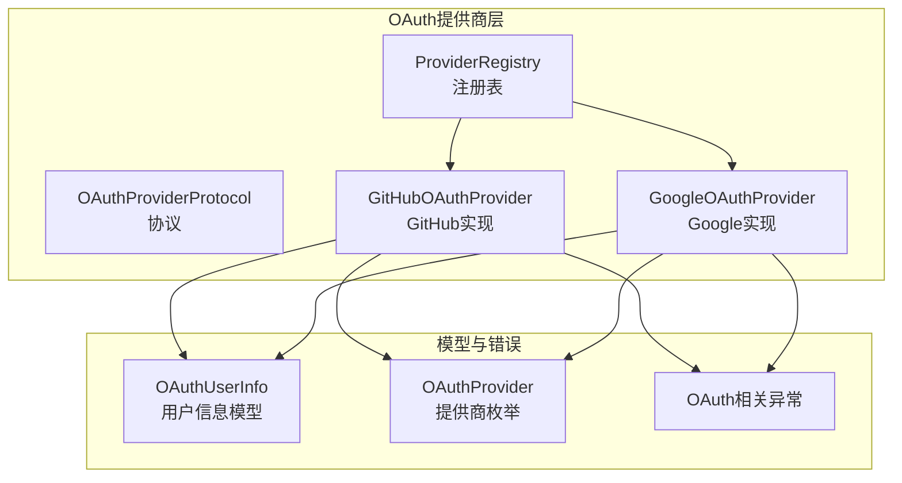
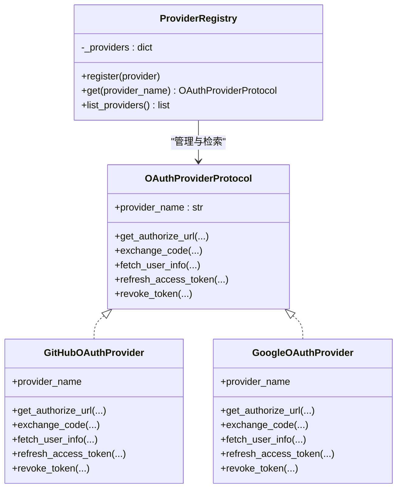
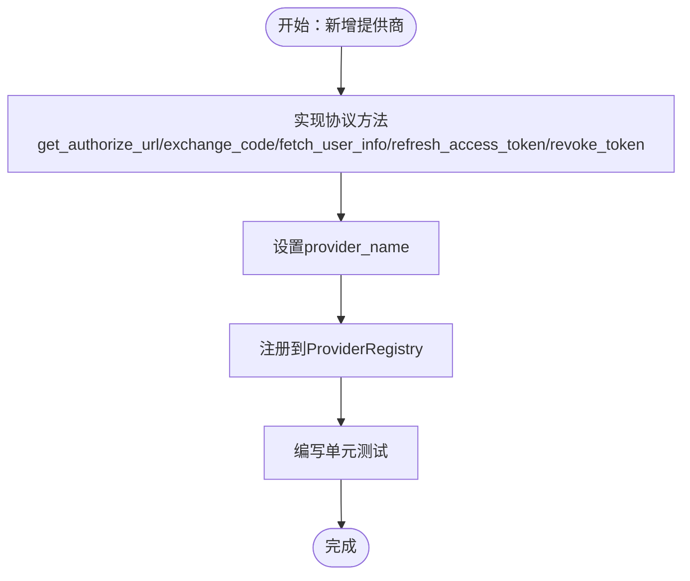
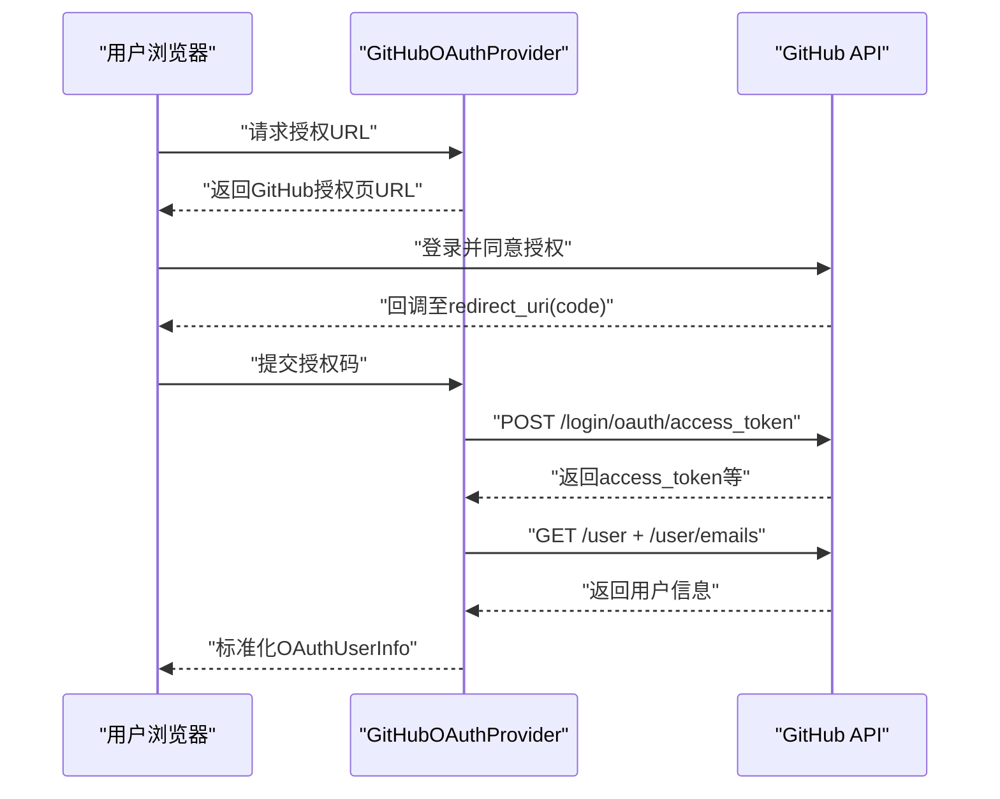
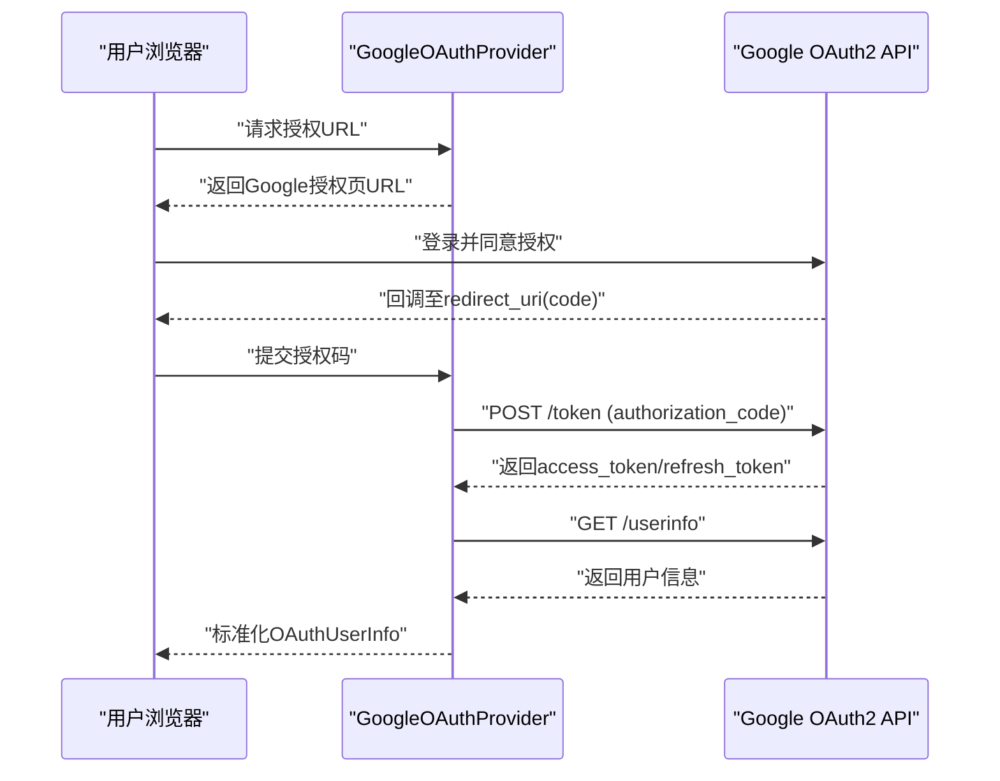
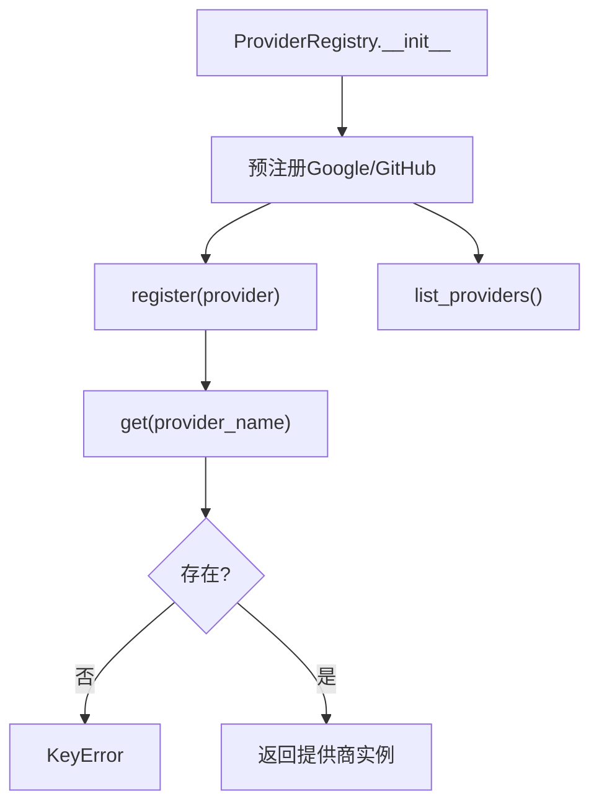
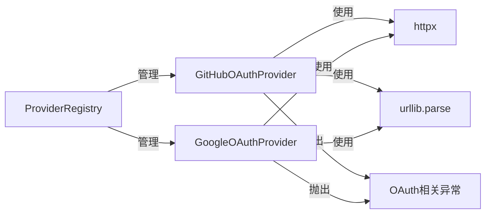

# OAuth提供商支持

<cite>
**本文引用的文件**
- [src/taolib/testing/oauth/providers/__init__.py](file://src/taolib/testing/oauth/providers/__init__.py)
- [src/taolib/testing/oauth/providers/base.py](file://src/taolib/testing/oauth/providers/base.py)
- [src/taolib/testing/oauth/providers/github.py](file://src/taolib/testing/oauth/providers/github.py)
- [src/taolib/testing/oauth/providers/google.py](file://src/taolib/testing/oauth/providers/google.py)
- [tests/testing/test_oauth/test_providers/test_providers.py](file://tests/testing/test_oauth/test_providers/test_providers.py)
</cite>

## 目录
1. [简介](#简介)
2. [项目结构](#项目结构)
3. [核心组件](#核心组件)
4. [架构总览](#架构总览)
5. [详细组件分析](#详细组件分析)
6. [依赖分析](#依赖分析)
7. [性能考虑](#性能考虑)
8. [故障排查指南](#故障排查指南)
9. [结论](#结论)
10. [附录](#附录)

## 简介
本文件面向OAuth提供商支持模块，系统性阐述GitHub与Google两大OAuth提供商的实现细节，包括授权码交换流程、用户信息获取、令牌管理与撤销、错误处理策略，并给出扩展新提供商的完整方法论。同时，文档化了提供商基类的设计模式、注册表的动态加载机制与最佳实践，帮助读者在不修改核心代码的前提下快速集成新的OAuth提供商。

## 项目结构
OAuth提供商支持位于测试模块taolib.testing.oauth下，采用“按功能域分层+协议驱动”的组织方式：
- providers：提供协议定义与具体提供商实现
- models：标准化用户信息模型与枚举
- errors：统一的OAuth异常体系
- cache：状态存储等辅助设施
- server：对外API入口（如会话、账户、授权流）
- services：业务服务（会话、令牌、账户等）

图表来源
- [src/taolib/testing/oauth/providers/__init__.py:15-56](file://src/taolib/testing/oauth/providers/__init__.py#L15-L56)
- [src/taolib/testing/oauth/providers/base.py:11-107](file://src/taolib/testing/oauth/providers/base.py#L11-L107)
- [src/taolib/testing/oauth/providers/github.py:27-205](file://src/taolib/testing/oauth/providers/github.py#L27-L205)
- [src/taolib/testing/oauth/providers/google.py:23-186](file://src/taolib/testing/oauth/providers/google.py#L23-L186)

章节来源
- [src/taolib/testing/oauth/providers/__init__.py:1-57](file://src/taolib/testing/oauth/providers/__init__.py#L1-L57)

## 核心组件
- 协议层：通过协议定义统一约束，确保各提供商实现一致的接口契约，便于替换与扩展。
- 注册表：集中管理提供商实例，支持预注册与动态注册，提供查询与列表能力。
- 具体提供商：GitHub与Google分别实现授权URL生成、授权码交换、用户信息获取、令牌刷新与撤销等核心流程。
- 模型与异常：标准化用户信息结构与统一的异常类型，提升跨提供商的一致性与可维护性。

章节来源
- [src/taolib/testing/oauth/providers/base.py:11-107](file://src/taolib/testing/oauth/providers/base.py#L11-L107)
- [src/taolib/testing/oauth/providers/__init__.py:15-56](file://src/taolib/testing/oauth/providers/__init__.py#L15-L56)

## 架构总览
OAuth提供商支持采用“协议驱动 + 注册表管理”的架构模式：
- 协议定义所有提供商必须实现的方法签名与职责边界
- 注册表负责提供商的生命周期管理与检索
- 具体提供商封装各自平台的API差异与特殊处理
- 统一的模型与异常体系降低跨提供商的适配成本

图表来源
- [src/taolib/testing/oauth/providers/base.py:11-107](file://src/taolib/testing/oauth/providers/base.py#L11-L107)
- [src/taolib/testing/oauth/providers/__init__.py:15-56](file://src/taolib/testing/oauth/providers/__init__.py#L15-L56)
- [src/taolib/testing/oauth/providers/github.py:27-205](file://src/taolib/testing/oauth/providers/github.py#L27-L205)
- [src/taolib/testing/oauth/providers/google.py:23-186](file://src/taolib/testing/oauth/providers/google.py#L23-L186)

## 详细组件分析

### 协议设计与扩展机制
- 设计要点
  - 使用Python协议（Protocol）定义统一接口，确保实现一致性与可替换性
  - 方法覆盖授权URL生成、授权码交换、用户信息获取、令牌刷新与撤销等关键流程
  - 通过provider_name字段标识提供商，作为注册表的键值
- 扩展新提供商步骤
  - 实现OAuthProviderProtocol的所有方法
  - 定义provider_name常量
  - 在注册表中注册或通过动态注册加入
  - 编写单元测试验证授权URL、交换流程与用户信息获取

章节来源
- [src/taolib/testing/oauth/providers/base.py:11-107](file://src/taolib/testing/oauth/providers/base.py#L11-L107)
- [src/taolib/testing/oauth/providers/__init__.py:15-56](file://src/taolib/testing/oauth/providers/__init__.py#L15-L56)
- [tests/testing/test_oauth/test_providers/test_providers.py:32-55](file://tests/testing/test_oauth/test_providers/test_providers.py#L32-L55)

### GitHub OAuth提供商实现
- 授权URL生成
  - 默认作用域：包含邮箱与用户信息读取
  - 支持传入自定义scopes，最终以空格拼接
- 授权码交换
  - 使用JSON响应头，校验HTTP状态与error字段
  - 失败时抛出授权码交换异常
- 用户信息获取
  - 优先使用用户公开邮箱；若缺失则调用邮箱API获取主邮箱
  - 返回标准化OAuthUserInfo，包含提供商标识、用户ID、邮箱、显示名、头像与原始数据
- 令牌刷新
  - 标准OAuth应用不支持刷新，直接抛出不支持异常
- 令牌撤销
  - 调用GitHub应用令牌撤销端点，使用Basic认证携带client_id与client_secret

图表来源
- [src/taolib/testing/oauth/providers/github.py:32-205](file://src/taolib/testing/oauth/providers/github.py#L32-L205)

章节来源
- [src/taolib/testing/oauth/providers/github.py:27-205](file://src/taolib/testing/oauth/providers/github.py#L27-L205)

### Google OAuth提供商实现
- 授权URL生成
  - 默认作用域：openid、email、profile
  - 显式设置access_type为offline以获取刷新令牌
  - prompt设置为consent以确保始终弹出授权确认
- 授权码交换
  - 指定grant_type为authorization_code
  - 校验HTTP状态与响应体，失败抛出授权码交换异常
- 用户信息获取
  - 通过OpenID Connect userinfo端点获取标准化用户信息
  - 返回OAuthUserInfo，包含提供商标识、用户ID、邮箱、显示名、头像与原始数据
- 令牌刷新
  - 使用refresh_token与grant_type为refresh_token进行刷新
  - 校验HTTP状态，失败抛出授权码交换异常
- 令牌撤销
  - 调用Google撤销端点，参数仅需token

图表来源
- [src/taolib/testing/oauth/providers/google.py:28-186](file://src/taolib/testing/oauth/providers/google.py#L28-L186)

章节来源
- [src/taolib/testing/oauth/providers/google.py:23-186](file://src/taolib/testing/oauth/providers/google.py#L23-L186)

### 注册表与动态加载机制
- 初始化预注册
  - 注册表在构造函数中预注册Google与GitHub提供商
- 动态注册
  - 通过register方法将任意符合协议的对象加入注册表
- 查找与列表
  - get根据provider_name获取对应提供商实例
  - list_providers返回已注册提供商名称列表
- 测试验证
  - 单元测试覆盖预注册、动态注册、未知提供商查找异常等场景

图表来源
- [src/taolib/testing/oauth/providers/__init__.py:15-56](file://src/taolib/testing/oauth/providers/__init__.py#L15-L56)

章节来源
- [src/taolib/testing/oauth/providers/__init__.py:15-56](file://src/taolib/testing/oauth/providers/__init__.py#L15-L56)
- [tests/testing/test_oauth/test_providers/test_providers.py:10-31](file://tests/testing/test_oauth/test_providers/test_providers.py#L10-L31)

## 依赖分析
- 协议与实现解耦
  - 协议层仅定义接口，实现层独立封装平台差异
- 注册表集中管理
  - 通过字典映射provider_name到实现实例，避免全局导入与硬编码
- 第三方依赖
  - httpx用于异步HTTP请求
  - urllib.parse用于URL参数编码
- 错误处理
  - 统一的OAuth异常类型，便于上层捕获与降级

图表来源
- [src/taolib/testing/oauth/providers/github.py:9-24](file://src/taolib/testing/oauth/providers/github.py#L9-L24)
- [src/taolib/testing/oauth/providers/google.py:9-20](file://src/taolib/testing/oauth/providers/google.py#L9-L20)
- [src/taolib/testing/oauth/providers/__init__.py:15-56](file://src/taolib/testing/oauth/providers/__init__.py#L15-L56)

章节来源
- [src/taolib/testing/oauth/providers/github.py:9-24](file://src/taolib/testing/oauth/providers/github.py#L9-L24)
- [src/taolib/testing/oauth/providers/google.py:9-20](file://src/taolib/testing/oauth/providers/google.py#L9-L20)

## 性能考虑
- 异步I/O
  - 使用httpx异步客户端减少阻塞，提高并发处理能力
- 超时控制
  - 统一的HTTP超时配置，避免长时间等待
- 最小化网络往返
  - GitHub在缺少邮箱时才调用邮箱API，减少不必要的请求
- 缓存与状态
  - 状态存储与缓存机制可用于优化授权state与令牌持久化（参考cache模块）

## 故障排查指南
- 授权码交换失败
  - 检查client_id、client_secret与redirect_uri是否正确
  - 关注第三方返回的错误码与错误描述
- 用户信息获取失败
  - 确认access_token有效且具备相应作用域
  - 对于GitHub，确认邮箱可见性与主邮箱设置
- 令牌刷新不支持
  - GitHub标准OAuth应用不支持刷新，需重新授权或使用离线访问
- 令牌撤销失败
  - 确认client_id与client_secret正确（GitHub需要），Google仅需token
- 注册表找不到提供商
  - 确认provider_name与注册时一致，或检查是否已动态注册

章节来源
- [src/taolib/testing/oauth/providers/github.py:91-100](file://src/taolib/testing/oauth/providers/github.py#L91-L100)
- [src/taolib/testing/oauth/providers/google.py:90-94](file://src/taolib/testing/oauth/providers/google.py#L90-L94)
- [src/taolib/testing/oauth/providers/github.py:177](file://src/taolib/testing/oauth/providers/github.py#L177)
- [src/taolib/testing/oauth/providers/google.py:156-160](file://src/taolib/testing/oauth/providers/google.py#L156-L160)
- [src/taolib/testing/oauth/providers/github.py:196-202](file://src/taolib/testing/oauth/providers/github.py#L196-L202)
- [src/taolib/testing/oauth/providers/google.py:178-183](file://src/taolib/testing/oauth/providers/google.py#L178-L183)
- [src/taolib/testing/oauth/providers/__init__.py:47-49](file://src/taolib/testing/oauth/providers/__init__.py#L47-L49)

## 结论
该OAuth提供商支持模块通过协议驱动与注册表管理实现了高内聚、低耦合的架构，既保证了GitHub与Google等主流平台的差异化处理，又提供了统一的扩展入口。借助标准化的模型与异常体系，开发者可以快速集成新的OAuth提供商，并在不破坏现有功能的前提下进行演进。

## 附录

### 配置参数与API限制速览
- GitHub
  - 授权端点：/login/oauth/authorize
  - 令牌端点：/login/oauth/access_token
  - 用户信息端点：/user
  - 邮箱端点：/user/emails
  - 默认作用域：user:email, read:user
  - 特殊处理：标准OAuth应用不支持刷新；撤销需client_id/client_secret
- Google
  - 授权端点：/o/oauth2/v2/auth
  - 令牌端点：/token
  - 用户信息端点：/userinfo
  - 撤销端点：/revoke
  - 默认作用域：openid, email, profile
  - 特殊处理：显式offline与consent提示；支持refresh_token刷新

章节来源
- [src/taolib/testing/oauth/providers/github.py:19-24](file://src/taolib/testing/oauth/providers/github.py#L19-L24)
- [src/taolib/testing/oauth/providers/google.py:15-20](file://src/taolib/testing/oauth/providers/google.py#L15-L20)

### 集成示例（步骤说明）
- 步骤1：创建自定义提供商类，实现协议全部方法并设置provider_name
- 步骤2：将实例注册到ProviderRegistry
- 步骤3：通过get(provider_name)获取实例并调用授权URL生成、授权码交换、用户信息获取、令牌刷新与撤销
- 步骤4：编写单元测试验证各流程

章节来源
- [tests/testing/test_oauth/test_providers/test_providers.py:32-55](file://tests/testing/test_oauth/test_providers/test_providers.py#L32-L55)