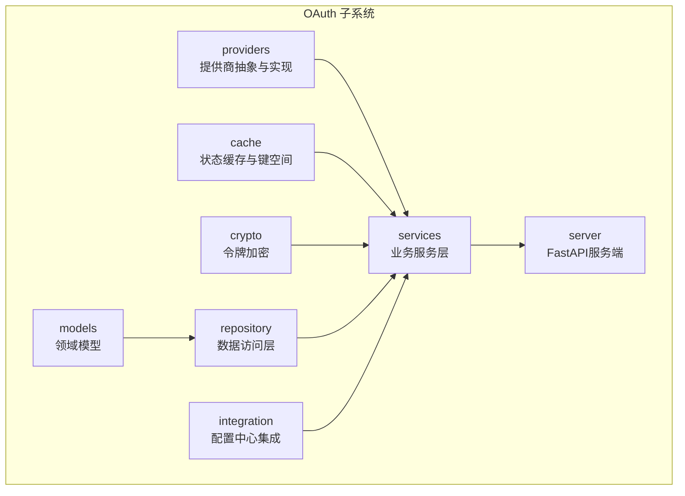
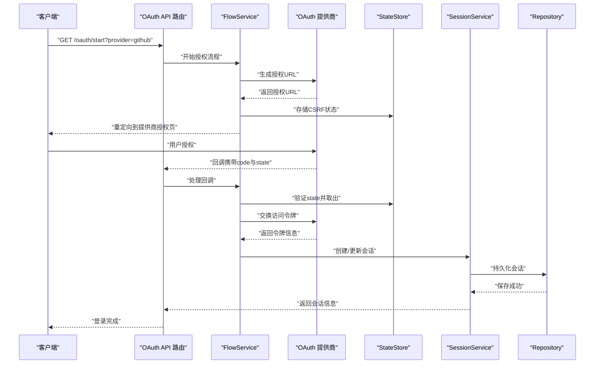
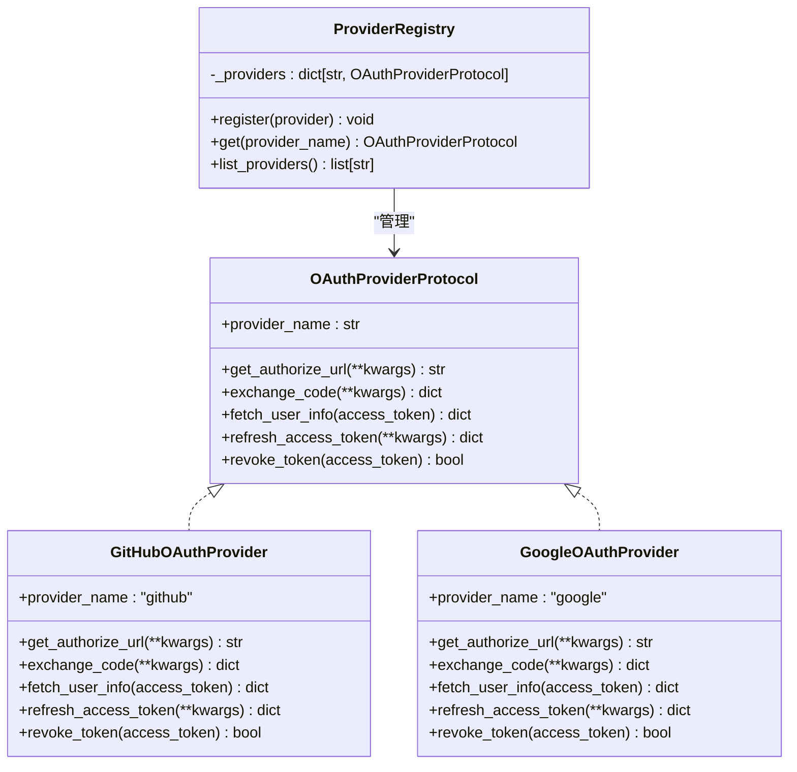
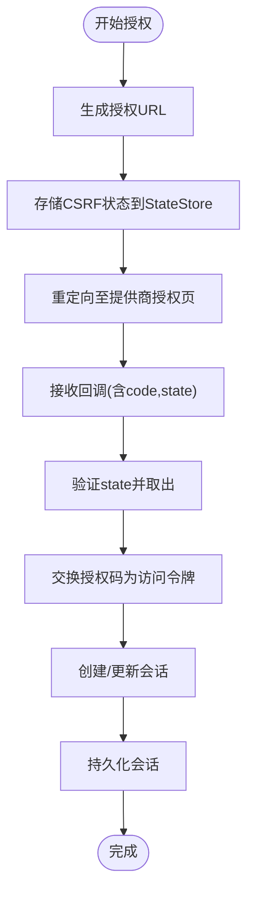
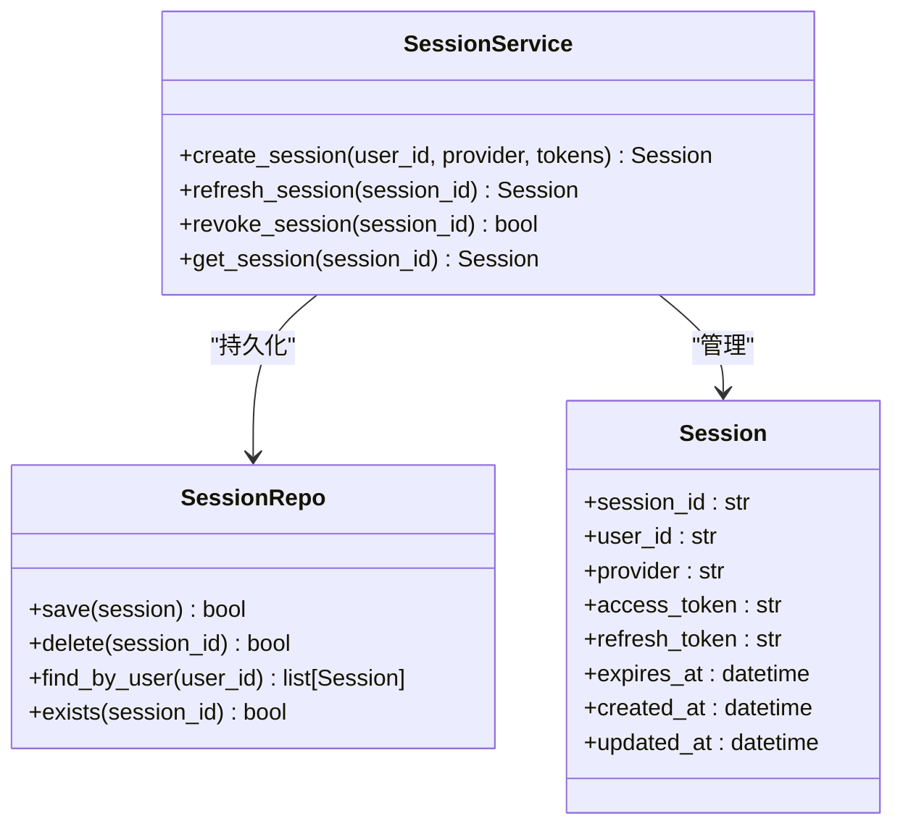
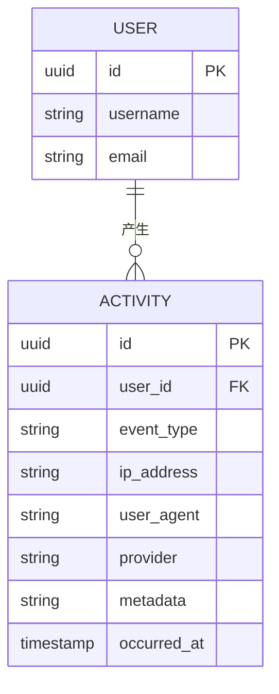
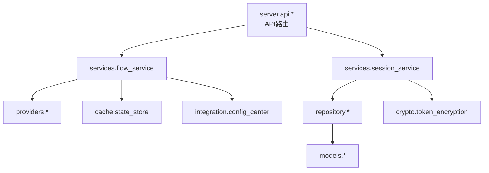

# OAuth集成系统

<cite>
**本文档引用的文件**
- [README.md](file://README.md)
- [src/taolib/testing/oauth/providers/__init__.py](file://src/taolib/testing/oauth/providers/__init__.py)
- [src/taolib/testing/oauth/providers/base.py](file://src/taolib/testing/oauth/providers/base.py)
- [src/taolib/testing/oauth/providers/github.py](file://src/taolib/testing/oauth/providers/github.py)
- [src/taolib/testing/oauth/providers/google.py](file://src/taolib/testing/oauth/providers/google.py)
- [src/taolib/testing/oauth/cache/state_store.py](file://src/taolib/testing/oauth/cache/state_store.py)
- [src/taolib/testing/oauth/crypto/token_encryption.py](file://src/taolib/testing/oauth/crypto/token_encryption.py)
- [src/taolib/testing/oauth/models/session.py](file://src/taolib/testing/oauth/models/session.py)
- [src/taolib/testing/oauth/models/activity.py](file://src/taolib/testing/oauth/models/activity.py)
- [src/taolib/testing/oauth/repository/session_repo.py](file://src/taolib/testing/oauth/repository/session_repo.py)
- [src/taolib/testing/oauth/repository/activity_repo.py](file://src/taolib/testing/oauth/repository/activity_repo.py)
- [src/taolib/testing/oauth/services/session_service.py](file://src/taolib/testing/oauth/services/session_service.py)
- [src/taolib/testing/oauth/services/flow_service.py](file://src/taolib/testing/oauth/services/flow_service.py)
- [src/taolib/testing/oauth/server/api/flow.py](file://src/taolib/testing/oauth/server/api/flow.py)
- [src/taolib/testing/oauth/server/api/sessions.py](file://src/taolib/testing/oauth/server/api/sessions.py)
- [src/taolib/testing/oauth/server/app.py](file://src/taolib/testing/oauth/server/app.py)
- [src/taolib/testing/oauth/server/config.py](file://src/taolib/testing/oauth/server/config.py)
- [src/taolib/testing/oauth/server/dependencies.py](file://src/taolib/testing/oauth/server/dependencies.py)
- [src/taolib/testing/oauth/integration/config_center.py](file://src/taolib/testing/oauth/integration/config_center.py)
- [src/taolib/testing/_base/cache_keys.py](file://src/taolib/testing/_base/cache_keys.py)
- [tests/testing/test_oauth/test_providers/test_providers.py](file://tests/testing/test_oauth/test_providers/test_providers.py)
- [tests/testing/test_oauth/test_cache/test_state_store.py](file://tests/testing/test_oauth/test_cache/test_state_store.py)
- [tests/testing/test_oauth/test_crypto.py](file://tests/testing/test_oauth/test_crypto.py)
</cite>

## 目录
1. [简介](#简介)
2. [项目结构](#项目结构)
3. [核心组件](#核心组件)
4. [架构总览](#架构总览)
5. [详细组件分析](#详细组件分析)
6. [依赖关系分析](#依赖关系分析)
7. [性能考虑](#性能考虑)
8. [故障排除指南](#故障排除指南)
9. [结论](#结论)
10. [附录](#附录)

## 简介
本文件为OAuth集成系统的全面技术文档，聚焦于多提供商支持架构、会话管理与活动追踪机制。文档详细阐述了GitHub与Google OAuth的实现细节与配置方法，深入说明用户会话生命周期、状态跟踪与安全机制；涵盖OAuth授权流程、状态加密存储与流程状态验证的技术实现；提供用户活动记录、登录历史追踪与安全事件监控的实现方案；解释状态管理、会话持久化与并发控制策略，并给出完整的API参考、集成示例与安全最佳实践指南。

## 项目结构
OAuth子系统位于`src/taolib/testing/oauth/`目录下，采用按功能分层的组织方式：
- providers：OAuth提供商抽象与具体实现（GitHub、Google）
- cache：状态缓存与键空间管理
- crypto：令牌加密工具
- models：领域模型（会话、活动等）
- repository：数据访问层
- services：业务服务层
- server：FastAPI服务端入口与API路由
- integration：与配置中心的集成
- tests：单元测试与行为测试

**图表来源**
- [src/taolib/testing/oauth/providers/__init__.py:1-56](file://src/taolib/testing/oauth/providers/__init__.py#L1-L56)
- [src/taolib/testing/oauth/cache/state_store.py:1-200](file://src/taolib/testing/oauth/cache/state_store.py#L1-L200)
- [src/taolib/testing/oauth/crypto/token_encryption.py:1-200](file://src/taolib/testing/oauth/crypto/token_encryption.py#L1-L200)
- [src/taolib/testing/oauth/models/session.py:1-200](file://src/taolib/testing/oauth/models/session.py#L1-L200)
- [src/taolib/testing/oauth/repository/session_repo.py:1-200](file://src/taolib/testing/oauth/repository/session_repo.py#L1-L200)
- [src/taolib/testing/oauth/services/session_service.py:1-200](file://src/taolib/testing/oauth/services/session_service.py#L1-L200)
- [src/taolib/testing/oauth/server/app.py:1-200](file://src/taolib/testing/oauth/server/app.py#L1-L200)
- [src/taolib/testing/oauth/integration/config_center.py:1-200](file://src/taolib/testing/oauth/integration/config_center.py#L1-L200)

**章节来源**
- [README.md:1-100](file://README.md#L1-L100)
- [src/taolib/testing/oauth/providers/__init__.py:1-56](file://src/taolib/testing/oauth/providers/__init__.py#L1-L56)

## 核心组件
- 多提供商注册与发现：通过ProviderRegistry集中管理GitHub与Google提供商，支持动态注册与查找。
- 授权流程服务：FlowService负责生成授权URL、处理回调、交换令牌与校验状态。
- 会话管理服务：SessionService负责会话创建、刷新、吊销与持久化。
- 活动追踪：Activity模型与ActivityRepo记录用户登录历史与安全事件。
- 状态存储：StateStore基于Redis键空间存储CSRF状态，TTL控制与键前缀规范。
- 令牌加密：TokenEncryption提供对敏感令牌的加密存储与解密。
- 配置中心集成：ConfigCenterIntegration统一管理提供商配置与动态更新。

**章节来源**
- [src/taolib/testing/oauth/providers/__init__.py:15-56](file://src/taolib/testing/oauth/providers/__init__.py#L15-L56)
- [src/taolib/testing/oauth/services/flow_service.py:1-200](file://src/taolib/testing/oauth/services/flow_service.py#L1-L200)
- [src/taolib/testing/oauth/services/session_service.py:1-200](file://src/taolib/testing/oauth/services/session_service.py#L1-L200)
- [src/taolib/testing/oauth/models/activity.py:1-200](file://src/taolib/testing/oauth/models/activity.py#L1-L200)
- [src/taolib/testing/oauth/cache/state_store.py:1-200](file://src/taolib/testing/oauth/cache/state_store.py#L1-L200)
- [src/taolib/testing/oauth/crypto/token_encryption.py:1-200](file://src/taolib/testing/oauth/crypto/token_encryption.py#L1-L200)
- [src/taolib/testing/oauth/integration/config_center.py:1-200](file://src/taolib/testing/oauth/integration/config_center.py#L1-L200)

## 架构总览
OAuth系统采用分层架构，从HTTP请求到业务处理再到数据持久化的完整链路如下：

**图表来源**
- [src/taolib/testing/oauth/server/api/flow.py:1-200](file://src/taolib/testing/oauth/server/api/flow.py#L1-L200)
- [src/taolib/testing/oauth/services/flow_service.py:1-200](file://src/taolib/testing/oauth/services/flow_service.py#L1-L200)
- [src/taolib/testing/oauth/providers/github.py:1-200](file://src/taolib/testing/oauth/providers/github.py#L1-L200)
- [src/taolib/testing/oauth/cache/state_store.py:1-200](file://src/taolib/testing/oauth/cache/state_store.py#L1-L200)
- [src/taolib/testing/oauth/services/session_service.py:1-200](file://src/taolib/testing/oauth/services/session_service.py#L1-L200)
- [src/taolib/testing/oauth/repository/session_repo.py:1-200](file://src/taolib/testing/oauth/repository/session_repo.py#L1-L200)

## 详细组件分析

### OAuth提供商抽象与实现
- 抽象协议：OAuthProviderProtocol定义统一接口，确保各提供商的一致性。
- 具体实现：GitHubOAuthProvider与GoogleOAuthProvider分别实现授权URL生成、令牌交换、用户信息获取等功能。
- 注册表：ProviderRegistry集中管理提供商，支持内置Google与GitHub，同时允许自定义提供商注册。

**图表来源**
- [src/taolib/testing/oauth/providers/base.py:1-200](file://src/taolib/testing/oauth/providers/base.py#L1-L200)
- [src/taolib/testing/oauth/providers/github.py:1-200](file://src/taolib/testing/oauth/providers/github.py#L1-L200)
- [src/taolib/testing/oauth/providers/google.py:1-200](file://src/taolib/testing/oauth/providers/google.py#L1-L200)
- [src/taolib/testing/oauth/providers/__init__.py:15-56](file://src/taolib/testing/oauth/providers/__init__.py#L15-L56)

**章节来源**
- [src/taolib/testing/oauth/providers/base.py:1-200](file://src/taolib/testing/oauth/providers/base.py#L1-L200)
- [src/taolib/testing/oauth/providers/github.py:1-200](file://src/taolib/testing/oauth/providers/github.py#L1-L200)
- [src/taolib/testing/oauth/providers/google.py:1-200](file://src/taolib/testing/oauth/providers/google.py#L1-L200)
- [src/taolib/testing/oauth/providers/__init__.py:15-56](file://src/taolib/testing/oauth/providers/__init__.py#L15-L56)
- [tests/testing/test_oauth/test_providers/test_providers.py:1-96](file://tests/testing/test_oauth/test_providers/test_providers.py#L1-L96)

### 授权流程与状态管理
- 授权URL生成：各提供商根据client_id、redirect_uri、state与scopes生成授权URL。
- 回调处理：FlowService接收回调，验证state一致性，交换授权码为访问令牌。
- 状态存储：StateStore使用Redis键空间存储CSRF状态，设置TTL防止长期有效。
- 并发控制：通过原子操作与锁机制避免并发场景下的状态竞争。

**图表来源**
- [src/taolib/testing/oauth/services/flow_service.py:1-200](file://src/taolib/testing/oauth/services/flow_service.py#L1-L200)
- [src/taolib/testing/oauth/cache/state_store.py:1-200](file://src/taolib/testing/oauth/cache/state_store.py#L1-L200)
- [src/taolib/testing/oauth/server/api/flow.py:1-200](file://src/taolib/testing/oauth/server/api/flow.py#L1-L200)

**章节来源**
- [src/taolib/testing/oauth/services/flow_service.py:1-200](file://src/taolib/testing/oauth/services/flow_service.py#L1-L200)
- [src/taolib/testing/oauth/cache/state_store.py:1-200](file://src/taolib/testing/oauth/cache/state_store.py#L1-L200)
- [src/taolib/testing/oauth/server/api/flow.py:1-200](file://src/taolib/testing/oauth/server/api/flow.py#L1-L200)
- [tests/testing/test_oauth/test_cache/test_state_store.py:1-200](file://tests/testing/test_oauth/test_cache/test_state_store.py#L1-L200)

### 会话管理与持久化
- 会话模型：Session模型封装用户会话信息，包括访问令牌、刷新令牌、过期时间等。
- 会话服务：SessionService负责会话的创建、刷新、吊销与查询。
- 数据持久化：SessionRepo提供会话的增删改查，支持基于键空间的高效存储。
- 并发控制：通过分布式锁与乐观并发控制保证会话更新的一致性。

**图表来源**
- [src/taolib/testing/oauth/models/session.py:1-200](file://src/taolib/testing/oauth/models/session.py#L1-L200)
- [src/taolib/testing/oauth/services/session_service.py:1-200](file://src/taolib/testing/oauth/services/session_service.py#L1-L200)
- [src/taolib/testing/oauth/repository/session_repo.py:1-200](file://src/taolib/testing/oauth/repository/session_repo.py#L1-L200)

**章节来源**
- [src/taolib/testing/oauth/models/session.py:1-200](file://src/taolib/testing/oauth/models/session.py#L1-L200)
- [src/taolib/testing/oauth/services/session_service.py:1-200](file://src/taolib/testing/oauth/services/session_service.py#L1-L200)
- [src/taolib/testing/oauth/repository/session_repo.py:1-200](file://src/taolib/testing/oauth/repository/session_repo.py#L1-L200)

### 活动追踪与安全监控
- 活动模型：Activity模型记录用户登录事件、失败尝试、令牌吊销等安全相关事件。
- 活动仓库：ActivityRepo提供活动的增删改查与聚合统计。
- 安全事件：系统自动记录登录时间、IP地址、User-Agent、提供商来源等上下文信息。
- 监控与审计：结合审计中间件与日志记录，支持安全事件的实时告警与离线分析。

**图表来源**
- [src/taolib/testing/oauth/models/activity.py:1-200](file://src/taolib/testing/oauth/models/activity.py#L1-L200)
- [src/taolib/testing/oauth/repository/activity_repo.py:1-200](file://src/taolib/testing/oauth/repository/activity_repo.py#L1-L200)

**章节来源**
- [src/taolib/testing/oauth/models/activity.py:1-200](file://src/taolib/testing/oauth/models/activity.py#L1-L200)
- [src/taolib/testing/oauth/repository/activity_repo.py:1-200](file://src/taolib/testing/oauth/repository/activity_repo.py#L1-L200)

### 令牌加密与安全存储
- 加密工具：TokenEncryption提供对敏感令牌的对称加密与解密，支持密钥轮换。
- 存储策略：敏感令牌不直接明文存储，仅保留必要的摘要或加密副本。
- 密钥管理：通过配置中心集中管理加密密钥，支持动态更新与多版本并存。

**章节来源**
- [src/taolib/testing/oauth/crypto/token_encryption.py:1-200](file://src/taolib/testing/oauth/crypto/token_encryption.py#L1-L200)
- [tests/testing/test_oauth/test_crypto.py:1-200](file://tests/testing/test_oauth/test_crypto.py#L1-L200)

### 配置中心集成
- 动态配置：ConfigCenterIntegration从配置中心拉取提供商的client_id、client_secret与作用域等配置。
- 热更新：监听配置变更事件，自动刷新提供商参数，无需重启服务。
- 分环境管理：支持开发、测试、生产多环境配置隔离与切换。

**章节来源**
- [src/taolib/testing/oauth/integration/config_center.py:1-200](file://src/taolib/testing/oauth/integration/config_center.py#L1-L200)

## 依赖关系分析
OAuth子系统内部依赖清晰，层次分明：
- API层依赖服务层，服务层依赖仓库层与外部提供商SDK。
- 缓存与加密作为基础设施被广泛复用。
- 注册表与配置中心提供运行时扩展能力。

**图表来源**
- [src/taolib/testing/oauth/server/api/flow.py:1-200](file://src/taolib/testing/oauth/server/api/flow.py#L1-L200)
- [src/taolib/testing/oauth/server/api/sessions.py:1-200](file://src/taolib/testing/oauth/server/api/sessions.py#L1-L200)
- [src/taolib/testing/oauth/services/flow_service.py:1-200](file://src/taolib/testing/oauth/services/flow_service.py#L1-L200)
- [src/taolib/testing/oauth/services/session_service.py:1-200](file://src/taolib/testing/oauth/services/session_service.py#L1-L200)
- [src/taolib/testing/oauth/cache/state_store.py:1-200](file://src/taolib/testing/oauth/cache/state_store.py#L1-L200)
- [src/taolib/testing/oauth/crypto/token_encryption.py:1-200](file://src/taolib/testing/oauth/crypto/token_encryption.py#L1-L200)
- [src/taolib/testing/oauth/integration/config_center.py:1-200](file://src/taolib/testing/oauth/integration/config_center.py#L1-L200)

**章节来源**
- [src/taolib/testing/oauth/server/app.py:1-200](file://src/taolib/testing/oauth/server/app.py#L1-L200)
- [src/taolib/testing/oauth/server/dependencies.py:1-200](file://src/taolib/testing/oauth/server/dependencies.py#L1-L200)

## 性能考虑
- 缓存优化：StateStore与会话数据采用Redis键空间设计，支持TTL与批量操作，降低数据库压力。
- 异步处理：授权回调与令牌交换采用异步模式，提升吞吐量。
- 连接池：仓库层使用连接池与长连接，减少连接开销。
- 并发控制：通过分布式锁与乐观锁避免竞态条件，保证数据一致性。
- 监控指标：埋点记录关键路径耗时与错误率，便于容量规划与性能调优。

## 故障排除指南
- 授权失败：检查state是否过期（默认TTL）、CSRF校验是否通过、提供商回调参数是否正确。
- 令牌交换失败：确认client_id与client_secret配置正确，回调URL与提供商配置一致。
- 会话异常：检查会话存储是否可用、锁冲突是否频繁、并发更新是否导致数据不一致。
- 安全事件：关注活动仓库中的异常登录与吊销事件，及时触发告警与封禁策略。

**章节来源**
- [src/taolib/testing/oauth/cache/state_store.py:1-200](file://src/taolib/testing/oauth/cache/state_store.py#L1-L200)
- [src/taolib/testing/oauth/repository/activity_repo.py:1-200](file://src/taolib/testing/oauth/repository/activity_repo.py#L1-L200)

## 结论
该OAuth集成系统通过清晰的分层架构、完善的多提供商支持、严谨的状态与会话管理、以及可扩展的安全与审计能力，为企业级应用提供了稳定可靠的单点登录与第三方账号接入解决方案。配合配置中心与监控体系，系统具备良好的可运维性与安全性。

## 附录

### API参考（概要）
- GET /oauth/start?provider={provider}
  - 功能：启动OAuth授权流程，返回重定向URL
  - 参数：provider（github|google）、redirect_uri、scopes
  - 返回：重定向至提供商授权页
- GET /oauth/callback
  - 功能：处理提供商回调，完成令牌交换与会话创建
  - 参数：code、state
  - 返回：会话信息或错误
- GET /sessions
  - 功能：查询当前用户的会话列表
  - 返回：会话数组
- DELETE /sessions/{session_id}
  - 功能：吊销指定会话
  - 返回：布尔结果

**章节来源**
- [src/taolib/testing/oauth/server/api/flow.py:1-200](file://src/taolib/testing/oauth/server/api/flow.py#L1-L200)
- [src/taolib/testing/oauth/server/api/sessions.py:1-200](file://src/taolib/testing/oauth/server/api/sessions.py#L1-L200)

### 集成示例（步骤）
- 配置提供商参数：在配置中心设置client_id与client_secret，并启用对应提供商。
- 初始化注册表：ProviderRegistry自动注册GitHub与Google，也可添加自定义提供商。
- 启动授权流程：调用/oauth/start，获取重定向URL并引导用户授权。
- 处理回调：在/oauth/callback中验证state并交换令牌，创建会话。
- 会话管理：通过/sessions接口查询与吊销会话，实现多设备登录管理。

**章节来源**
- [src/taolib/testing/oauth/providers/__init__.py:15-56](file://src/taolib/testing/oauth/providers/__init__.py#L15-L56)
- [src/taolib/testing/oauth/server/api/flow.py:1-200](file://src/taolib/testing/oauth/server/api/flow.py#L1-L200)
- [src/taolib/testing/oauth/server/api/sessions.py:1-200](file://src/taolib/testing/oauth/server/api/sessions.py#L1-L200)

### 安全最佳实践
- 强制使用HTTPS与安全Cookie属性，防止中间人攻击与XSS。
- 严格校验state与nonce，防止CSRF与重放攻击。
- 对敏感令牌进行加密存储，定期轮换密钥。
- 限制授权作用域最小化，仅申请必要权限。
- 启用活动追踪与审计日志，建立安全事件响应机制。
- 使用速率限制与IP白名单，降低暴力破解风险。