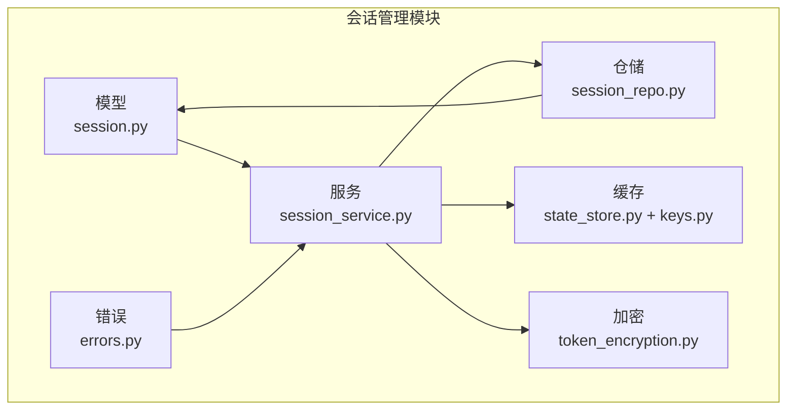
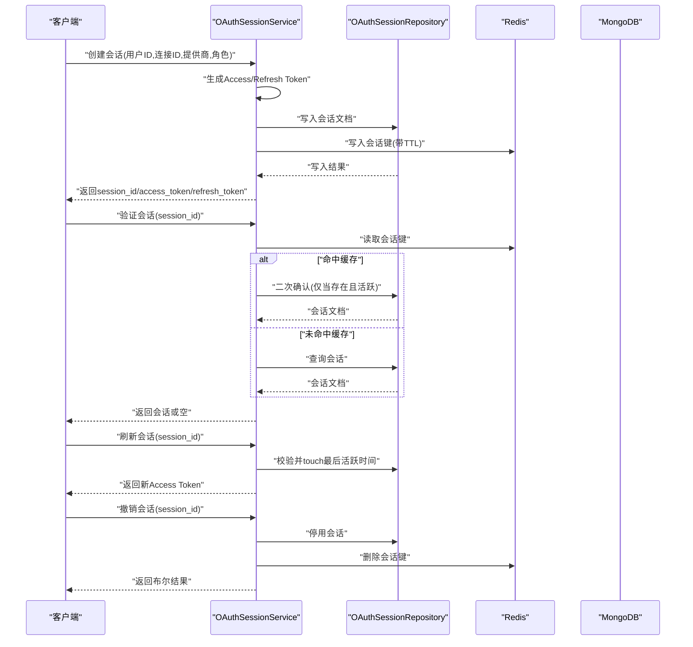
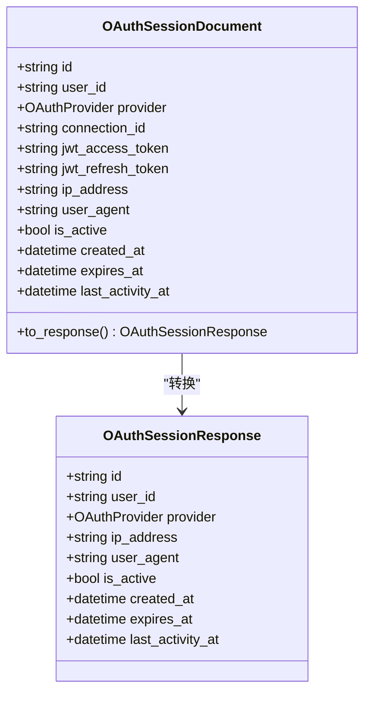
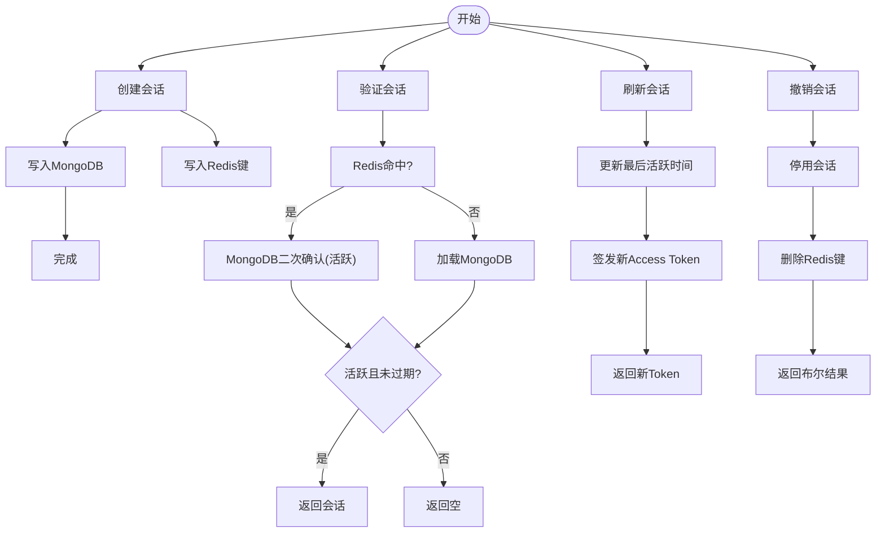
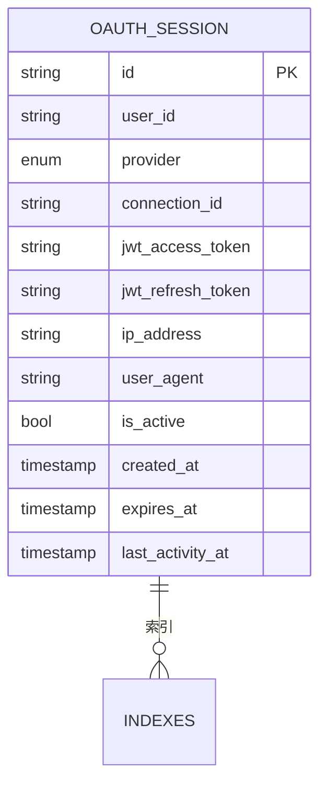
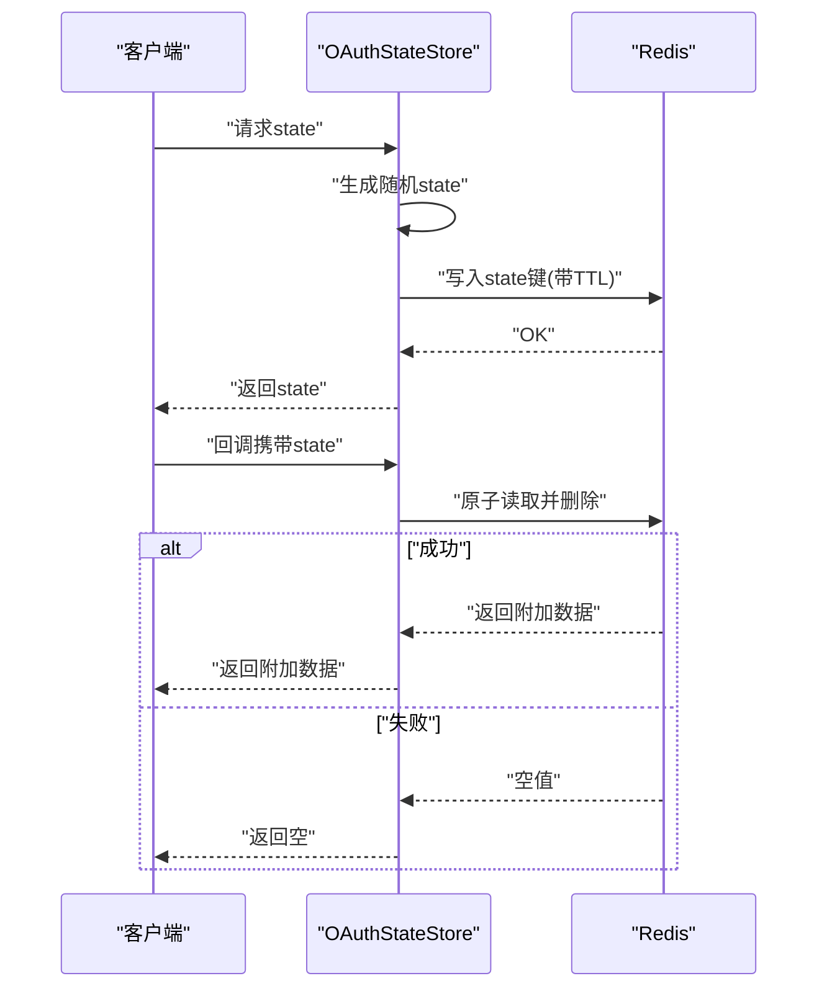
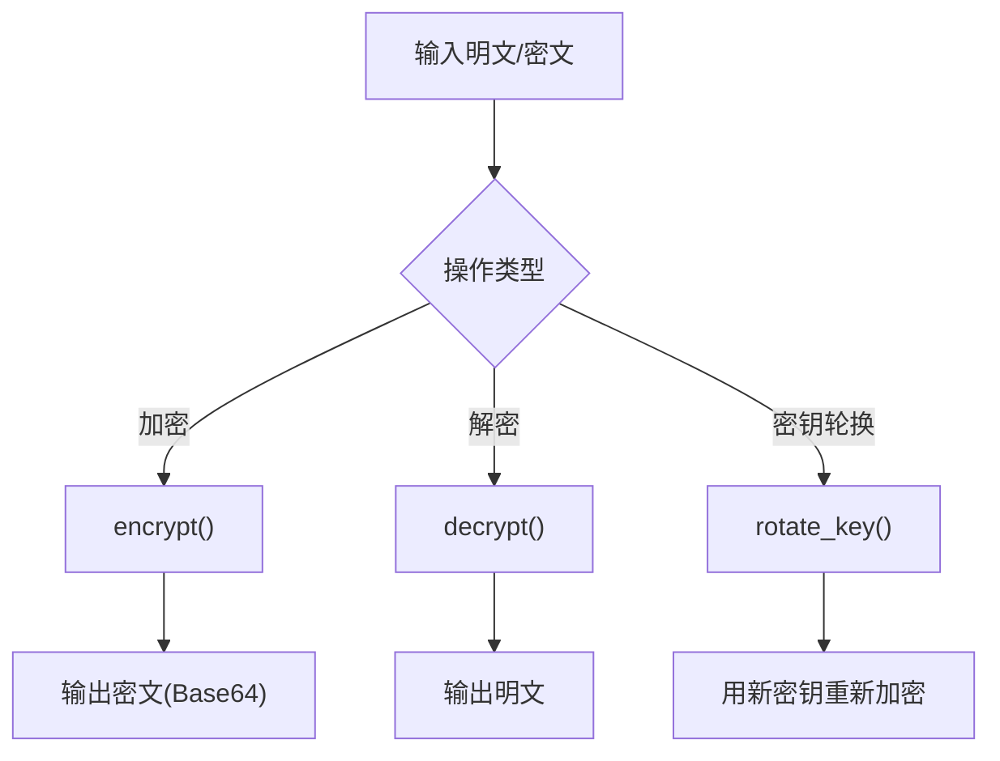
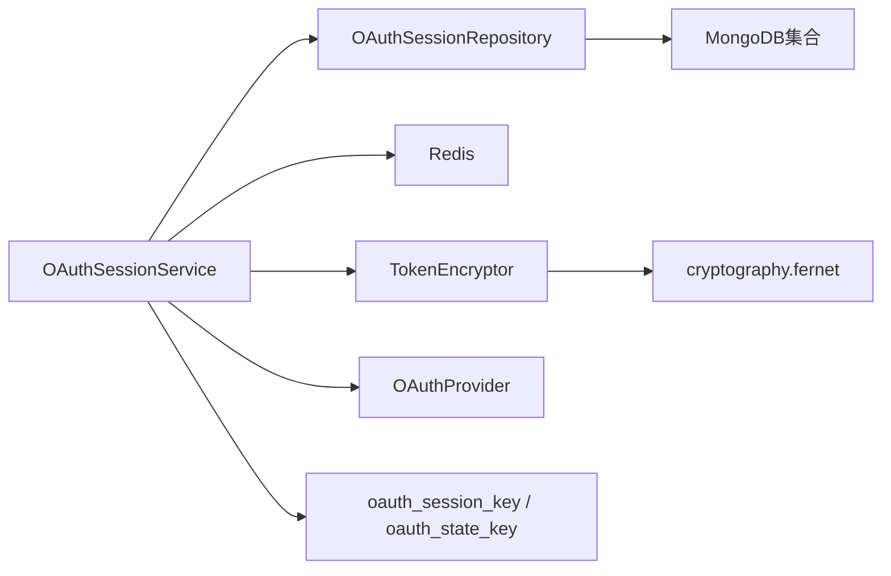

# 会话管理

<cite>
**本文引用的文件**
- [src/taolib/testing/oauth/models/session.py](file://src/taolib/testing/oauth/models/session.py)
- [src/taolib/testing/oauth/services/session_service.py](file://src/taolib/testing/oauth/services/session_service.py)
- [src/taolib/testing/oauth/repository/session_repo.py](file://src/taolib/testing/oauth/repository/session_repo.py)
- [src/taolib/testing/oauth/cache/state_store.py](file://src/taolib/testing/oauth/cache/state_store.py)
- [src/taolib/testing/oauth/crypto/token_encryption.py](file://src/taolib/testing/oauth/crypto/token_encryption.py)
- [src/taolib/testing/oauth/cache/keys.py](file://src/taolib/testing/oauth/cache/keys.py)
- [src/taolib/testing/oauth/models/enums.py](file://src/taolib/testing/oauth/models/enums.py)
- [src/taolib/testing/oauth/errors.py](file://src/taolib/testing/oauth/errors.py)
- [tests/testing/test_oauth/test_models.py](file://tests/testing/test_oauth/test_models.py)
- [tests/testing/test_oauth/test_repository/test_repos.py](file://tests/testing/test_oauth/test_repository/test_repos.py)
- [tests/testing/test_oauth/test_services/test_services.py](file://tests/testing/test_oauth/test_services/test_services.py)
</cite>

## 目录
1. [简介](#简介)
2. [项目结构](#项目结构)
3. [核心组件](#核心组件)
4. [架构总览](#架构总览)
5. [组件详解](#组件详解)
6. [依赖关系分析](#依赖关系分析)
7. [性能考量](#性能考量)
8. [故障排除指南](#故障排除指南)
9. [结论](#结论)
10. [附录](#附录)

## 简介
本文件面向OAuth会话管理模块，系统化阐述用户会话生命周期管理（创建、验证、刷新、撤销）、状态跟踪与持久化策略、并发控制与过期处理、以及安全机制（CSRF防护、会话劫持防护）。文档基于仓库中实际实现进行分析，并提供最佳实践与排障建议。

## 项目结构
OAuth会话管理相关代码主要分布在以下模块：
- 数据模型：会话响应模型与文档模型
- 服务层：会话创建、验证、刷新、撤销、查询等业务逻辑
- 仓储层：MongoDB访问接口，包含索引与常用查询
- 缓存层：Redis状态存储（CSRF state）与会话键空间
- 加密模块：对敏感令牌进行对称加密存储
- 错误类型：统一的OAuth错误体系
- 测试：覆盖模型、仓储、服务的关键行为

图表来源
- [src/taolib/testing/oauth/models/session.py:1-67](file://src/taolib/testing/oauth/models/session.py#L1-L67)
- [src/taolib/testing/oauth/services/session_service.py:1-238](file://src/taolib/testing/oauth/services/session_service.py#L1-L238)
- [src/taolib/testing/oauth/repository/session_repo.py:1-92](file://src/taolib/testing/oauth/repository/session_repo.py#L1-L92)
- [src/taolib/testing/oauth/cache/state_store.py:1-69](file://src/taolib/testing/oauth/cache/state_store.py#L1-L69)
- [src/taolib/testing/oauth/crypto/token_encryption.py:1-86](file://src/taolib/testing/oauth/crypto/token_encryption.py#L1-L86)

章节来源
- [src/taolib/testing/oauth/models/session.py:1-67](file://src/taolib/testing/oauth/models/session.py#L1-L67)
- [src/taolib/testing/oauth/services/session_service.py:1-238](file://src/taolib/testing/oauth/services/session_service.py#L1-L238)
- [src/taolib/testing/oauth/repository/session_repo.py:1-92](file://src/taolib/testing/oauth/repository/session_repo.py#L1-L92)
- [src/taolib/testing/oauth/cache/state_store.py:1-69](file://src/taolib/testing/oauth/cache/state_store.py#L1-L69)
- [src/taolib/testing/oauth/crypto/token_encryption.py:1-86](file://src/taolib/testing/oauth/crypto/token_encryption.py#L1-L86)

## 核心组件
- 会话模型
  - OAuthSessionResponse：对外响应模型，不暴露JWT字段
  - OAuthSessionDocument：MongoDB文档模型，包含JWT访问/刷新令牌
- 会话服务
  - 创建会话：生成Access/Refresh Token，写入MongoDB与Redis缓存
  - 验证会话：优先Redis缓存校验，再回退至数据库；同时检查激活态与过期时间
  - 刷新会话：在有效期内签发新的Access Token并更新最后活跃时间
  - 撤销会话：停用单个或全部会话，并清理Redis缓存
  - 查询活跃会话：按用户筛选活跃且未过期的会话
- 会话仓储
  - 活跃会话查询、停用单个/全部、更新最后活跃时间
  - MongoDB索引：user_id、expires_at TTL、复合索引(is_active,user_id)
- CSRF状态存储
  - 基于Redis的一次性state参数，带TTL，原子性读取并删除
- 令牌加密
  - 使用Fernet对称加密存储敏感令牌，支持密钥轮换

章节来源
- [src/taolib/testing/oauth/models/session.py:14-67](file://src/taolib/testing/oauth/models/session.py#L14-L67)
- [src/taolib/testing/oauth/services/session_service.py:15-238](file://src/taolib/testing/oauth/services/session_service.py#L15-L238)
- [src/taolib/testing/oauth/repository/session_repo.py:13-92](file://src/taolib/testing/oauth/repository/session_repo.py#L13-L92)
- [src/taolib/testing/oauth/cache/state_store.py:13-69](file://src/taolib/testing/oauth/cache/state_store.py#L13-L69)
- [src/taolib/testing/oauth/crypto/token_encryption.py:20-86](file://src/taolib/testing/oauth/crypto/token_encryption.py#L20-L86)

## 架构总览
下图展示会话管理的端到端流程与组件交互：

图表来源
- [src/taolib/testing/oauth/services/session_service.py:72-207](file://src/taolib/testing/oauth/services/session_service.py#L72-L207)
- [src/taolib/testing/oauth/repository/session_repo.py:24-83](file://src/taolib/testing/oauth/repository/session_repo.py#L24-L83)
- [src/taolib/testing/oauth/cache/keys.py](file://src/taolib/testing/oauth/cache/keys.py)

## 组件详解

### 会话模型与数据流
- OAuthSessionResponse：用于对外返回，屏蔽JWT细节，避免泄露
- OAuthSessionDocument：持久化载体，包含JWT访问/刷新令牌、IP/User-Agent、活跃标志、创建/过期/最后活跃时间戳
- to_response：模型转换，确保对外不暴露敏感令牌

图表来源
- [src/taolib/testing/oauth/models/session.py:14-67](file://src/taolib/testing/oauth/models/session.py#L14-L67)

章节来源
- [src/taolib/testing/oauth/models/session.py:14-67](file://src/taolib/testing/oauth/models/session.py#L14-L67)

### 会话服务：生命周期与并发控制
- 创建会话
  - 生成唯一session_id与Access/Refresh Token
  - 写入MongoDB会话集合
  - 在Redis中以oauth_session_key写入user_id，TTL为会话时长
- 验证会话
  - 优先从Redis读取，若命中且会话存在且活跃，直接返回
  - 否则回退到MongoDB查询，校验is_active与expires_at
- 刷新会话
  - 在有效期内签发新的Access Token
  - 触碰(last_activity_at)更新
- 撤销会话
  - 停用单个会话并删除Redis键
  - 支持批量停用用户所有活跃会话
- 查询活跃会话
  - 返回用户所有活跃且未过期的会话摘要

图表来源
- [src/taolib/testing/oauth/services/session_service.py:72-207](file://src/taolib/testing/oauth/services/session_service.py#L72-L207)
- [src/taolib/testing/oauth/repository/session_repo.py:74-83](file://src/taolib/testing/oauth/repository/session_repo.py#L74-L83)

章节来源
- [src/taolib/testing/oauth/services/session_service.py:72-207](file://src/taolib/testing/oauth/services/session_service.py#L72-L207)
- [src/taolib/testing/oauth/repository/session_repo.py:24-83](file://src/taolib/testing/oauth/repository/session_repo.py#L24-L83)

### 仓储层：索引与查询
- find_active_sessions：按user_id、is_active、expires_at查询活跃会话
- deactivate_session/deactivate_all_for_user：停用单个或全部活跃会话
- touch_session：更新last_activity_at
- create_indexes：建立user_id、expires_at TTL、(is_active,user_id)复合索引

图表来源
- [src/taolib/testing/oauth/repository/session_repo.py:24-89](file://src/taolib/testing/oauth/repository/session_repo.py#L24-L89)

章节来源
- [src/taolib/testing/oauth/repository/session_repo.py:13-92](file://src/taolib/testing/oauth/repository/session_repo.py#L13-L92)

### CSRF状态存储与防重放
- OAuthStateStore
  - create_state：生成一次性state，写入Redis，带TTL
  - validate_and_consume：原子性读取并删除，防止重放
- 适用场景：OAuth授权流程中的state参数校验

图表来源
- [src/taolib/testing/oauth/cache/state_store.py:33-67](file://src/taolib/testing/oauth/cache/state_store.py#L33-L67)

章节来源
- [src/taolib/testing/oauth/cache/state_store.py:13-69](file://src/taolib/testing/oauth/cache/state_store.py#L13-L69)

### 令牌加密与密钥轮换
- TokenEncryptor
  - encrypt/decrypt：对敏感令牌进行对称加密/解密
  - rotate_key：旧密钥解密后用新密钥重新加密，支持密钥轮换
- 适用场景：在持久化前对JWT等敏感令牌进行加密存储

图表来源
- [src/taolib/testing/oauth/crypto/token_encryption.py:37-84](file://src/taolib/testing/oauth/crypto/token_encryption.py#L37-L84)

章节来源
- [src/taolib/testing/oauth/crypto/token_encryption.py:20-86](file://src/taolib/testing/oauth/crypto/token_encryption.py#L20-L86)

### 会话安全机制
- CSRF防护
  - 使用一次性state参数，结合Redis原子读取+删除，防止重放
- 会话劫持防护
  - 结合IP/User-Agent与活跃状态、过期时间共同验证
  - Access/Refresh Token分离，缩短Access Token有效期
- 令牌存储安全
  - 敏感令牌可选加密存储，配合密钥轮换降低泄露影响面

章节来源
- [src/taolib/testing/oauth/cache/state_store.py:48-67](file://src/taolib/testing/oauth/cache/state_store.py#L48-L67)
- [src/taolib/testing/oauth/services/session_service.py:140-164](file://src/taolib/testing/oauth/services/session_service.py#L140-L164)
- [src/taolib/testing/oauth/crypto/token_encryption.py:65-84](file://src/taolib/testing/oauth/crypto/token_encryption.py#L65-L84)

## 依赖关系分析
- 服务层依赖仓储层与缓存层，负责业务编排与安全策略
- 仓储层依赖MongoDB集合，提供会话CRUD与索引
- 缓存层依赖Redis，提供高并发读取与TTL过期
- 加密模块独立，可选接入以增强敏感数据保护
- 错误类型集中管理，便于上层统一处理

图表来源
- [src/taolib/testing/oauth/services/session_service.py:9-43](file://src/taolib/testing/oauth/services/session_service.py#L9-L43)
- [src/taolib/testing/oauth/repository/session_repo.py:8-22](file://src/taolib/testing/oauth/repository/session_repo.py#L8-L22)
- [src/taolib/testing/oauth/crypto/token_encryption.py:6-35](file://src/taolib/testing/oauth/crypto/token_encryption.py#L6-L35)
- [src/taolib/testing/oauth/cache/keys.py](file://src/taolib/testing/oauth/cache/keys.py)

章节来源
- [src/taolib/testing/oauth/services/session_service.py:9-43](file://src/taolib/testing/oauth/services/session_service.py#L9-L43)
- [src/taolib/testing/oauth/repository/session_repo.py:8-22](file://src/taolib/testing/oauth/repository/session_repo.py#L8-L22)
- [src/taolib/testing/oauth/crypto/token_encryption.py:6-35](file://src/taolib/testing/oauth/crypto/token_encryption.py#L6-L35)

## 性能考量
- 读路径优化
  - 验证会话优先走Redis缓存，减少MongoDB压力
  - Redis键采用会话ID命名空间，TTL与会话时长一致，避免额外过期判断
- 写路径优化
  - 创建会话时，先写MongoDB再写Redis，保证最终一致性
  - 批量撤销会话时，先清理Redis键再批量更新，避免重复查询
- 索引设计
  - user_id索引支持用户维度查询
  - expires_at TTL索引自动清理过期文档
  - (is_active,user_id)复合索引加速活跃会话筛选
- 并发控制
  - Redis原子性读取+删除state，避免竞态
  - 会话touch操作在刷新时执行，降低写放大

章节来源
- [src/taolib/testing/oauth/services/session_service.py:140-164](file://src/taolib/testing/oauth/services/session_service.py#L140-L164)
- [src/taolib/testing/oauth/repository/session_repo.py:85-89](file://src/taolib/testing/oauth/repository/session_repo.py#L85-L89)

## 故障排除指南
- 会话验证失败
  - 检查Redis键是否存在且未过期
  - 若Redis未命中，确认MongoDB会话记录是否活跃且未过期
- 刷新失败
  - 确认会话仍处于有效期内
  - 检查touch操作是否成功更新last_activity_at
- 撤销无效
  - 确认会话确实被停用
  - 检查Redis键是否已被删除
- CSRF校验失败
  - 确认state是否在TTL内使用
  - 检查是否已被原子性消费（只能使用一次）
- 令牌解密异常
  - 检查密钥是否正确
  - 如发生密钥轮换，确认使用rotate_key流程

章节来源
- [src/taolib/testing/oauth/services/session_service.py:140-207](file://src/taolib/testing/oauth/services/session_service.py#L140-L207)
- [src/taolib/testing/oauth/cache/state_store.py:48-67](file://src/taolib/testing/oauth/cache/state_store.py#L48-L67)
- [src/taolib/testing/oauth/crypto/token_encryption.py:48-64](file://src/taolib/testing/oauth/crypto/token_encryption.py#L48-L64)
- [src/taolib/testing/oauth/errors.py:98-98](file://src/taolib/testing/oauth/errors.py#L98-L98)

## 结论
该会话管理模块通过“Redis缓存 + MongoDB持久化”的双层架构，实现了高性能、可扩展的OAuth会话生命周期管理。结合CSRF一次性state与敏感令牌加密，提供了较为完善的安全保障。建议在生产环境中：
- 明确Access/Refresh Token有效期与刷新策略
- 定期清理过期会话与废弃state
- 对敏感令牌启用加密存储并规范密钥轮换流程
- 监控Redis/MongoDB延迟与可用性，确保高并发下的稳定性

## 附录
- 关键配置项
  - Access Token过期时间（分钟）
  - Refresh Token过期时间（天）
  - 会话TTL（小时）
  - CSRF state有效期（秒）
- 常用操作
  - 创建会话：传入用户ID、连接ID、提供商、角色、可选IP/User-Agent、会话TTL
  - 验证会话：传入会话ID
  - 刷新会话：传入会话ID与最新角色
  - 撤销会话：单个或按用户批量撤销
  - 查询活跃会话：按用户ID查询

章节来源
- [src/taolib/testing/oauth/services/session_service.py:29-43](file://src/taolib/testing/oauth/services/session_service.py#L29-L43)
- [src/taolib/testing/oauth/cache/state_store.py:23-31](file://src/taolib/testing/oauth/cache/state_store.py#L23-L31)