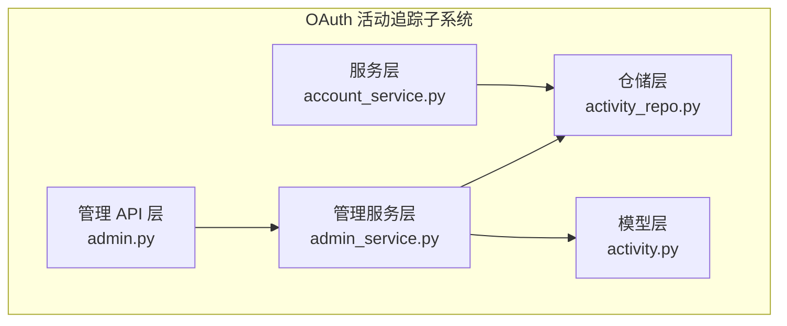
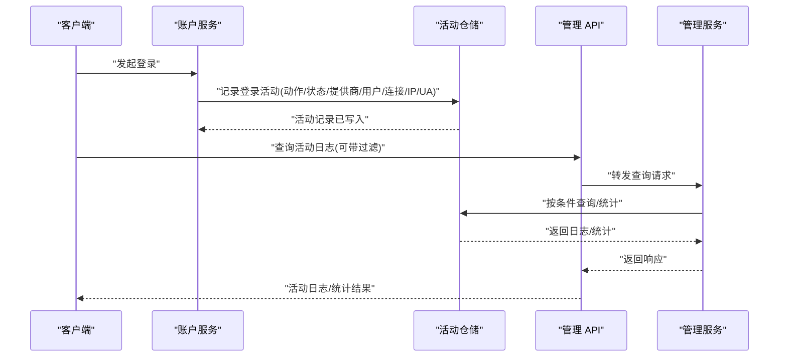
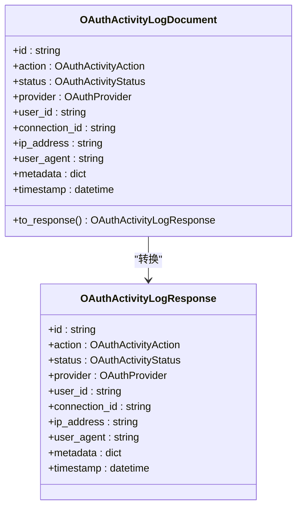
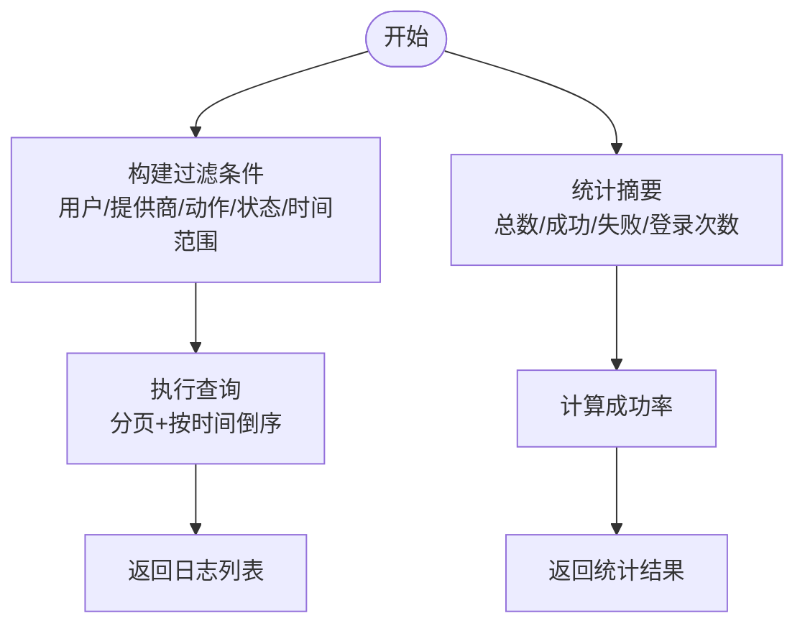
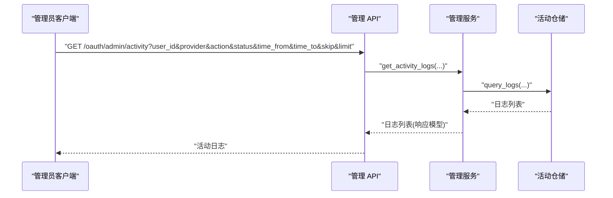
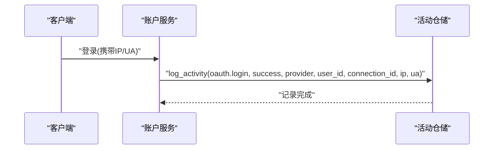
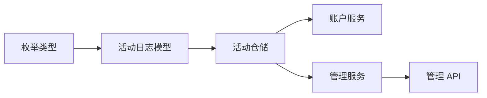

# 活动追踪

<cite>
**本文引用的文件**
- [src/taolib/testing/oauth/models/activity.py](file://src/taolib/testing/oauth/models/activity.py)
- [src/taolib/testing/oauth/repository/activity_repo.py](file://src/taolib/testing/oauth/repository/activity_repo.py)
- [src/taolib/testing/oauth/services/admin_service.py](file://src/taolib/testing/oauth/services/admin_service.py)
- [src/taolib/testing/oauth/server/api/admin.py](file://src/taolib/testing/oauth/server/api/admin.py)
- [src/taolib/testing/oauth/services/account_service.py](file://src/taolib/testing/oauth/services/account_service.py)
- [tests/testing/test_oauth/test_repository/test_repos.py](file://tests/testing/test_oauth/test_repository/test_repos.py)
- [tests/testing/test_oauth/test_models.py](file://tests/testing/test_oauth/test_models.py)
- [src/taolib/testing/analytics/events/types.py](file://src/taolib/testing/analytics/events/types.py)
</cite>

## 目录
1. [简介](#简介)
2. [项目结构](#项目结构)
3. [核心组件](#核心组件)
4. [架构总览](#架构总览)
5. [详细组件分析](#详细组件分析)
6. [依赖分析](#依赖分析)
7. [性能考量](#性能考量)
8. [故障排查指南](#故障排查指南)
9. [结论](#结论)
10. [附录](#附录)

## 简介
本技术文档聚焦于 OAuth 活动追踪模块，系统阐述用户活动记录机制（登录事件、连接操作与状态变更）、活动数据模型设计（活动类型、状态与时间戳）、活动历史追踪（登录历史与安全事件监控）、管理员服务中的活动管理（查询、过滤与统计分析）、以及活动事件的发布订阅与实时通知能力。同时，文档给出隐私保护与合规性建议，帮助在保障用户体验的同时满足数据治理要求。

## 项目结构
OAuth 活动追踪相关代码位于 OAuth 子模块中，采用分层架构组织：
- 模型层：定义活动日志的响应模型与文档模型
- 仓储层：提供活动日志的持久化与查询能力
- 服务层：封装业务逻辑（如登录时记录活动）
- 管理服务层：面向管理员的凭证与活动管理
- 管理 API 层：对外暴露管理端点
- 测试：覆盖活动日志记录、查询与统计

图表来源
- [src/taolib/testing/oauth/models/activity.py:14-65](file://src/taolib/testing/oauth/models/activity.py#L14-L65)
- [src/taolib/testing/oauth/repository/activity_repo.py:15-145](file://src/taolib/testing/oauth/repository/activity_repo.py#L15-L145)
- [src/taolib/testing/oauth/services/account_service.py:76-110](file://src/taolib/testing/oauth/services/account_service.py#L76-L110)
- [src/taolib/testing/oauth/services/admin_service.py:22-220](file://src/taolib/testing/oauth/services/admin_service.py#L22-L220)
- [src/taolib/testing/oauth/server/api/admin.py:19-177](file://src/taolib/testing/oauth/server/api/admin.py#L19-L177)

章节来源
- [src/taolib/testing/oauth/models/activity.py:1-65](file://src/taolib/testing/oauth/models/activity.py#L1-L65)
- [src/taolib/testing/oauth/repository/activity_repo.py:1-145](file://src/taolib/testing/oauth/repository/activity_repo.py#L1-L145)
- [src/taolib/testing/oauth/services/admin_service.py:1-220](file://src/taolib/testing/oauth/services/admin_service.py#L1-L220)
- [src/taolib/testing/oauth/server/api/admin.py:1-177](file://src/taolib/testing/oauth/server/api/admin.py#L1-L177)

## 核心组件
- 活动日志数据模型
  - 响应模型：用于对外返回，包含活动标识、动作类型、状态、提供商、用户与连接标识、IP、UA、元数据与时间戳
  - 文档模型：用于 MongoDB 存储，包含相同字段并提供 to_response 转换
- 活动日志仓储
  - 提供记录活动、按多维度过滤查询、统计摘要与索引创建
- 管理服务
  - 对外暴露凭证管理与活动查询、统计接口；在关键操作后记录审计活动
- 管理 API
  - 提供凭证增删改查、活动日志查询与统计接口
- 登录流程中的活动记录
  - 在账户服务登录成功后记录登录活动，包含动作、状态、提供商、用户与连接信息、IP 与 UA

章节来源
- [src/taolib/testing/oauth/models/activity.py:14-65](file://src/taolib/testing/oauth/models/activity.py#L14-L65)
- [src/taolib/testing/oauth/repository/activity_repo.py:15-145](file://src/taolib/testing/oauth/repository/activity_repo.py#L15-L145)
- [src/taolib/testing/oauth/services/admin_service.py:22-220](file://src/taolib/testing/oauth/services/admin_service.py#L22-L220)
- [src/taolib/testing/oauth/server/api/admin.py:19-177](file://src/taolib/testing/oauth/server/api/admin.py#L19-L177)
- [src/taolib/testing/oauth/services/account_service.py:76-110](file://src/taolib/testing/oauth/services/account_service.py#L76-L110)

## 架构总览
下图展示从登录到活动记录、再到管理端查询的整体流程：

图表来源
- [src/taolib/testing/oauth/services/account_service.py:76-110](file://src/taolib/testing/oauth/services/account_service.py#L76-L110)
- [src/taolib/testing/oauth/repository/activity_repo.py:26-133](file://src/taolib/testing/oauth/repository/activity_repo.py#L26-L133)
- [src/taolib/testing/oauth/server/api/admin.py:116-174](file://src/taolib/testing/oauth/server/api/admin.py#L116-L174)
- [src/taolib/testing/oauth/services/admin_service.py:164-217](file://src/taolib/testing/oauth/services/admin_service.py#L164-L217)

## 详细组件分析

### 数据模型与枚举
- 活动日志响应模型
  - 字段：标识、动作类型、状态、提供商、用户 ID、连接 ID、IP、UA、元数据、时间戳
  - 用途：对外 API 响应，避免泄露内部存储细节
- 活动日志文档模型
  - 字段：同上，且包含 MongoDB 的 _id 映射与默认时间戳
  - 转换：to_response 将文档模型转为响应模型
- 关键要点
  - 动作类型、状态、提供商均来自枚举，确保值域一致
  - 元数据用于扩展上下文（如错误详情、设备指纹等）

图表来源
- [src/taolib/testing/oauth/models/activity.py:14-65](file://src/taolib/testing/oauth/models/activity.py#L14-L65)

章节来源
- [src/taolib/testing/oauth/models/activity.py:14-65](file://src/taolib/testing/oauth/models/activity.py#L14-L65)
- [tests/testing/test_oauth/test_models.py:158-176](file://tests/testing/test_oauth/test_models.py#L158-L176)

### 活动日志仓储
- 主要能力
  - 记录活动：支持动作、状态、提供商、用户、连接、IP、UA、元数据
  - 查询：支持用户、提供商、动作、状态、时间范围过滤，分页排序
  - 统计：总事件数、成功/失败次数、登录次数与成功率
  - 索引：针对用户+时间、提供商+时间、动作+时间建立复合索引，并设置 TTL 自动清理
- 性能与可用性
  - 复合索引优化常见查询模式
  - TTL 索引自动清理过期日志，控制存储规模

图表来源
- [src/taolib/testing/oauth/repository/activity_repo.py:65-133](file://src/taolib/testing/oauth/repository/activity_repo.py#L65-L133)

章节来源
- [src/taolib/testing/oauth/repository/activity_repo.py:15-145](file://src/taolib/testing/oauth/repository/activity_repo.py#L15-L145)
- [tests/testing/test_oauth/test_repository/test_repos.py:224-266](file://tests/testing/test_oauth/test_repository/test_repos.py#L224-L266)

### 管理服务与 API
- 管理服务
  - 凭证管理：创建、更新、删除、列出（含加密敏感字段）
  - 活动查询：多维度过滤、分页、转换为响应模型
  - 统计汇总：活动统计 + 连接统计
- 管理 API
  - 凭证：GET/POST/PUT/DELETE
  - 活动：GET（支持过滤与分页）
  - 统计：GET

图表来源
- [src/taolib/testing/oauth/server/api/admin.py:116-156](file://src/taolib/testing/oauth/server/api/admin.py#L116-L156)
- [src/taolib/testing/oauth/services/admin_service.py:164-201](file://src/taolib/testing/oauth/services/admin_service.py#L164-L201)
- [src/taolib/testing/oauth/repository/activity_repo.py:65-114](file://src/taolib/testing/oauth/repository/activity_repo.py#L65-L114)

章节来源
- [src/taolib/testing/oauth/services/admin_service.py:22-220](file://src/taolib/testing/oauth/services/admin_service.py#L22-L220)
- [src/taolib/testing/oauth/server/api/admin.py:19-177](file://src/taolib/testing/oauth/server/api/admin.py#L19-L177)

### 登录流程中的活动记录
- 触发时机：账户服务在登录成功后记录活动
- 记录内容：动作（登录）、状态（成功）、提供商、用户 ID、连接 ID、IP、UA
- 作用：形成可追溯的登录历史与安全事件基线

图表来源
- [src/taolib/testing/oauth/services/account_service.py:76-110](file://src/taolib/testing/oauth/services/account_service.py#L76-L110)
- [src/taolib/testing/oauth/repository/activity_repo.py:26-63](file://src/taolib/testing/oauth/repository/activity_repo.py#L26-L63)

章节来源
- [src/taolib/testing/oauth/services/account_service.py:76-110](file://src/taolib/testing/oauth/services/account_service.py#L76-L110)

### 发布订阅与实时通知（概念性说明）
- 当前实现重点在活动日志的记录与查询；未发现内置的发布订阅或 WebSocket 实时推送模块
- 如需实时通知，可在现有仓储/服务层扩展事件发布机制（例如使用消息队列或事件总线），并在前端通过 WebSocket 或轮询订阅
- 参考其他模块的事件类型定义，可借鉴其事件数据结构设计思路

章节来源
- [src/taolib/testing/analytics/events/types.py:11-45](file://src/taolib/testing/analytics/events/types.py#L11-L45)

## 依赖分析
- 模型依赖：活动日志模型依赖枚举类型（动作、状态、提供商）
- 仓储依赖：基于通用异步仓储基类，封装 MongoDB 操作
- 服务依赖：管理服务依赖凭证、活动、连接仓储与令牌加密器
- API 依赖：依赖管理服务与当前用户身份解析

图表来源
- [src/taolib/testing/oauth/models/activity.py:11-11](file://src/taolib/testing/oauth/models/activity.py#L11-L11)
- [src/taolib/testing/oauth/repository/activity_repo.py:9-12](file://src/taolib/testing/oauth/repository/activity_repo.py#L9-L12)
- [src/taolib/testing/oauth/services/admin_service.py:16-20](file://src/taolib/testing/oauth/services/admin_service.py#L16-L20)

章节来源
- [src/taolib/testing/oauth/models/activity.py:11-11](file://src/taolib/testing/oauth/models/activity.py#L11-L11)
- [src/taolib/testing/oauth/repository/activity_repo.py:9-12](file://src/taolib/testing/oauth/repository/activity_repo.py#L9-L12)
- [src/taolib/testing/oauth/services/admin_service.py:16-20](file://src/taolib/testing/oauth/services/admin_service.py#L16-L20)

## 性能考量
- 查询性能
  - 已建立针对 user_id+timestamp、provider+timestamp、action+timestamp 的复合索引，有利于高频过滤与排序
  - TTL 索引自动清理过期日志，降低存储压力
- 写入性能
  - 单条活动记录写入，建议批量写入策略以进一步提升吞吐（可选扩展）
- 分页与排序
  - 默认按时间倒序，结合索引可保证高效分页
- 统计开销
  - 统计接口对不同状态与动作进行计数，建议在高并发场景下缓存热点统计结果

章节来源
- [src/taolib/testing/oauth/repository/activity_repo.py:135-142](file://src/taolib/testing/oauth/repository/activity_repo.py#L135-L142)
- [src/taolib/testing/oauth/repository/activity_repo.py:116-133](file://src/taolib/testing/oauth/repository/activity_repo.py#L116-L133)

## 故障排查指南
- 活动日志缺失
  - 检查登录流程是否调用活动记录方法
  - 核对提供商、用户 ID、连接 ID 参数是否正确传入
- 查询结果为空
  - 确认过滤参数（用户、提供商、动作、状态、时间范围）是否合理
  - 检查索引是否存在，必要时重建索引
- 统计异常
  - 确认状态与动作枚举值是否与记录一致
  - 检查 TTL 索引是否生效导致数据提前清理
- 权限与认证
  - 管理 API 需要有效管理员身份，确认鉴权中间件与依赖注入正常

章节来源
- [tests/testing/test_oauth/test_repository/test_repos.py:224-266](file://tests/testing/test_oauth/test_repository/test_repos.py#L224-L266)
- [tests/testing/test_oauth/test_models.py:158-176](file://tests/testing/test_oauth/test_models.py#L158-L176)

## 结论
OAuth 活动追踪模块通过清晰的分层设计实现了完整的活动记录、查询与统计能力。模型与仓储解耦良好，管理服务与 API 提供了完善的管理入口。建议在后续迭代中引入发布订阅与实时通知机制，并持续优化索引与统计缓存，以满足更高性能与可观测性的需求。

## 附录
- 隐私与合规建议
  - 最小化采集：仅记录必要的活动字段（如 IP、UA、时间戳），避免存储完整明文日志
  - 数据保留策略：结合 TTL 与手动清理策略，遵循最长保留期限
  - 访问控制：管理 API 严格鉴权，仅授权管理员访问
  - 审计留痕：所有管理操作均记录活动日志，便于审计追溯
  - 加密处理：敏感字段（如令牌）在存储前进行加密或脱敏