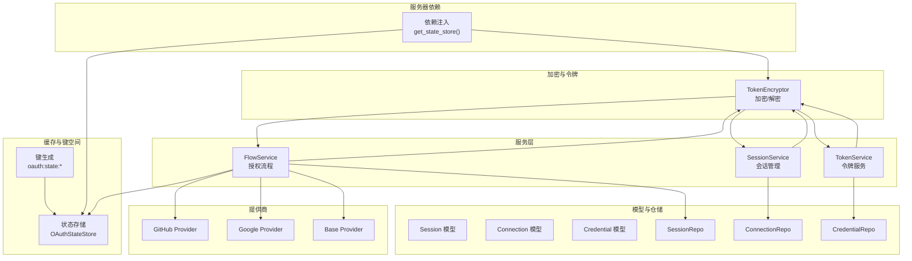
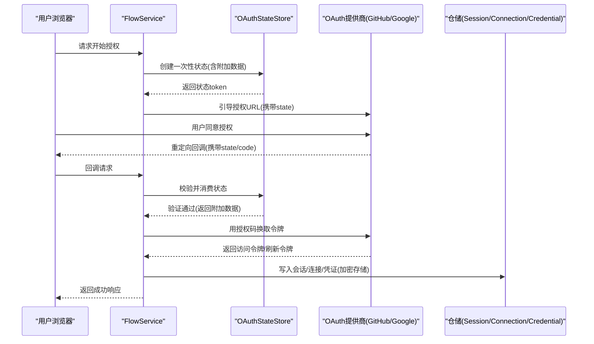
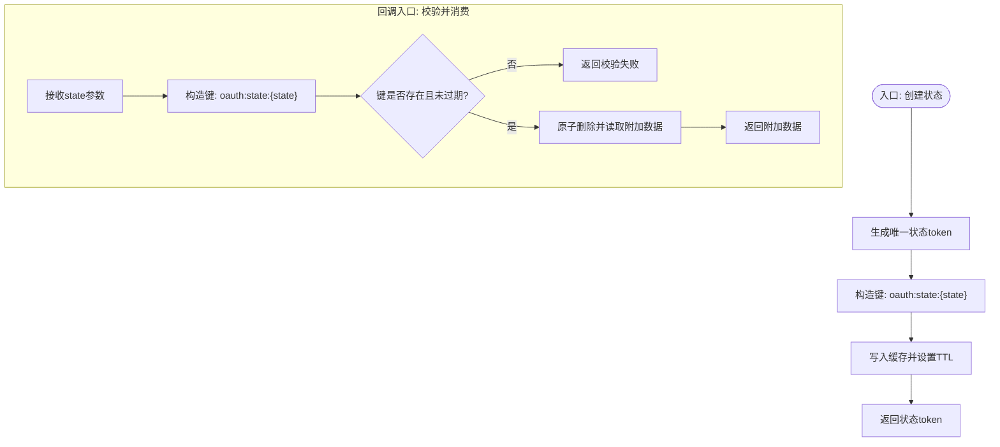
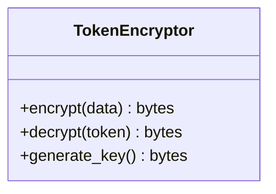
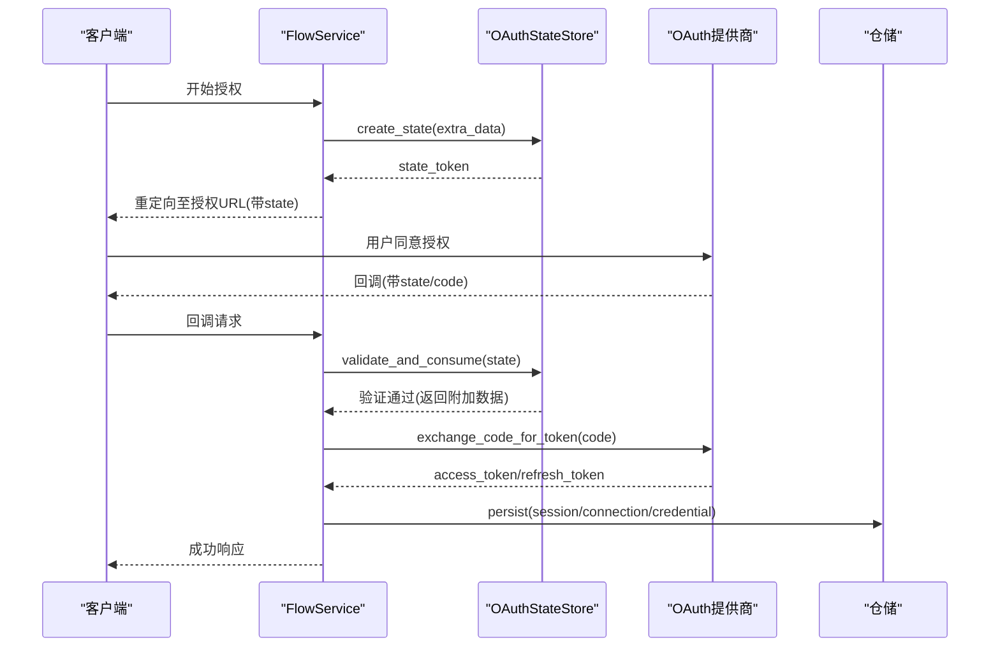
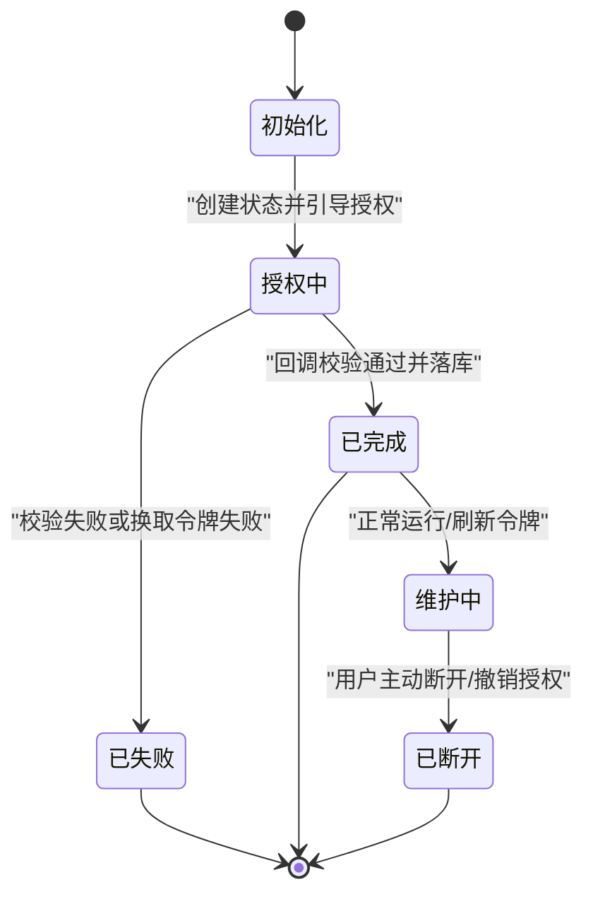
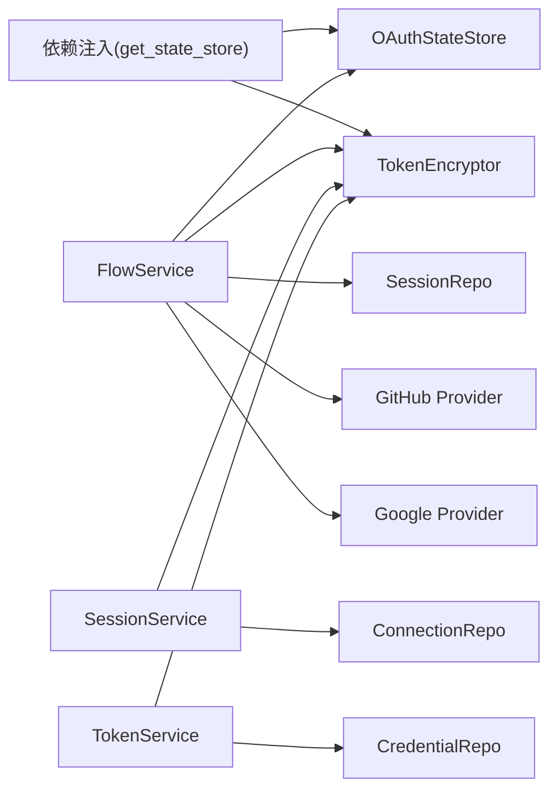

# 状态管理

<cite>
**本文引用的文件**
- [src/taolib/testing/oauth/cache/state_store.py](file://src/taolib/testing/oauth/cache/state_store.py)
- [src/taolib/testing/oauth/cache/keys.py](file://src/taolib/testing/oauth/cache/keys.py)
- [src/taolib/testing/oauth/crypto/token_encryption.py](file://src/taolib/testing/oauth/crypto/token_encryption.py)
- [src/taolib/testing/oauth/services/flow_service.py](file://src/taolib/testing/oauth/services/flow_service.py)
- [src/taolib/testing/oauth/server/dependencies.py](file://src/taolib/testing/oauth/server/dependencies.py)
- [src/taolib/testing/oauth/server/api/flow.py](file://src/taolib/testing/oauth/server/api/flow.py)
- [src/taolib/testing/oauth/models/session.py](file://src/taolib/testing/oauth/models/session.py)
- [src/taolib/testing/oauth/models/connection.py](file://src/taolib/testing/oauth/models/connection.py)
- [src/taolib/testing/oauth/models/credential.py](file://src/taolib/testing/oauth/models/credential.py)
- [src/taolib/testing/oauth/models/enums.py](file://src/taolib/testing/oauth/models/enums.py)
- [src/taolib/testing/oauth/repository/session_repo.py](file://src/taolib/testing/oauth/repository/session_repo.py)
- [src/taolib/testing/oauth/repository/connection_repo.py](file://src/taolib/testing/oauth/repository/connection_repo.py)
- [src/taolib/testing/oauth/repository/credential_repo.py](file://src/taolib/testing/oauth/repository/credential_repo.py)
- [src/taolib/testing/oauth/providers/github.py](file://src/taolib/testing/oauth/providers/github.py)
- [src/taolib/testing/oauth/providers/google.py](file://src/taolib/testing/oauth/providers/base.py](file://src/taolib/testing/oauth/providers/base.py)
- [src/taolib/testing/oauth/errors.py](file://src/taolib/testing/oauth/errors.py)
- [tests/testing/test_oauth/test_cache/test_state_store.py](file://tests/testing/test_oauth/test_cache/test_state_store.py)
- [src/taolib/testing/_base/cache_keys.py](file://src/taolib/testing/_base/cache_keys.py)
</cite>

## 目录
1. [简介](#简介)
2. [项目结构](#项目结构)
3. [核心组件](#核心组件)
4. [架构总览](#架构总览)
5. [详细组件分析](#详细组件分析)
6. [依赖关系分析](#依赖关系分析)
7. [性能考量](#性能考量)
8. [故障排查指南](#故障排查指南)
9. [结论](#结论)
10. [附录](#附录)

## 简介
本文件聚焦于OAuth状态管理模块，系统性阐述授权码交换过程中的状态验证与安全机制、状态加密存储技术、授权流程状态机设计、连接状态管理（建立、维护、断开）、防重放攻击策略以及状态同步方案，并提供安全最佳实践与常见问题解决方案。内容基于仓库中测试版OAuth实现进行归纳总结，便于开发者理解并扩展到生产环境。

## 项目结构
OAuth状态管理相关代码主要分布在以下子模块：
- 缓存与键空间：状态存储、键生成
- 加密与令牌：Token加密/解密工具
- 服务层：授权流程服务、会话服务、令牌服务
- 服务器依赖注入：状态存储与加密器的注入点
- 模型与仓储：会话、连接、凭证等数据模型及持久化接口
- 提供商适配：GitHub、Google等OAuth提供商
- 错误类型：OAuth专用错误体系
- 测试用例：状态存储功能验证

图表来源
- [src/taolib/testing/oauth/cache/state_store.py:1-120](file://src/taolib/testing/oauth/cache/state_store.py#L1-L120)
- [src/taolib/testing/oauth/cache/keys.py:1-30](file://src/taolib/testing/oauth/cache/keys.py#L1-L30)
- [src/taolib/testing/oauth/crypto/token_encryption.py:1-200](file://src/taolib/testing/oauth/crypto/token_encryption.py#L1-L200)
- [src/taolib/testing/oauth/services/flow_service.py:1-150](file://src/taolib/testing/oauth/services/flow_service.py#L1-L150)
- [src/taolib/testing/oauth/server/dependencies.py:1-160](file://src/taolib/testing/oauth/server/dependencies.py#L1-L160)
- [src/taolib/testing/oauth/models/session.py:1-200](file://src/taolib/testing/oauth/models/session.py#L1-L200)
- [src/taolib/testing/oauth/models/connection.py:1-200](file://src/taolib/testing/oauth/models/connection.py#L1-L200)
- [src/taolib/testing/oauth/models/credential.py:1-200](file://src/taolib/testing/oauth/models/credential.py#L1-L200)
- [src/taolib/testing/oauth/providers/github.py:1-200](file://src/taolib/testing/oauth/providers/github.py#L1-L200)
- [src/taolib/testing/oauth/providers/google.py:1-200](file://src/taolib/testing/oauth/providers/google.py#L1-L200)
- [src/taolib/testing/oauth/providers/base.py:1-200](file://src/taolib/testing/oauth/providers/base.py#L1-L200)

章节来源
- [src/taolib/testing/oauth/cache/state_store.py:1-120](file://src/taolib/testing/oauth/cache/state_store.py#L1-L120)
- [src/taolib/testing/oauth/cache/keys.py:1-30](file://src/taolib/testing/oauth/cache/keys.py#L1-L30)
- [src/taolib/testing/oauth/crypto/token_encryption.py:1-200](file://src/taolib/testing/oauth/crypto/token_encryption.py#L1-L200)
- [src/taolib/testing/oauth/services/flow_service.py:1-150](file://src/taolib/testing/oauth/services/flow_service.py#L1-L150)
- [src/taolib/testing/oauth/server/dependencies.py:1-160](file://src/taolib/testing/oauth/server/dependencies.py#L1-L160)
- [src/taolib/testing/oauth/models/session.py:1-200](file://src/taolib/testing/oauth/models/session.py#L1-L200)
- [src/taolib/testing/oauth/models/connection.py:1-200](file://src/taolib/testing/oauth/models/connection.py#L1-L200)
- [src/taolib/testing/oauth/models/credential.py:1-200](file://src/taolib/testing/oauth/models/credential.py#L1-L200)
- [src/taolib/testing/oauth/providers/github.py:1-200](file://src/taolib/testing/oauth/providers/github.py#L1-L200)
- [src/taolib/testing/oauth/providers/google.py:1-200](file://src/taolib/testing/oauth/providers/google.py#L1-L200)
- [src/taolib/testing/oauth/providers/base.py:1-200](file://src/taolib/testing/oauth/providers/base.py#L1-L200)

## 核心组件
- OAuth状态存储（OAuthStateStore）：负责生成CSRF状态、写入状态、一次性消费状态、TTL控制与并发安全。
- 状态键空间（oauth:state:*）：统一的键前缀与命名规范，便于缓存清理与可观测性。
- Token加密器（TokenEncryptor）：提供对敏感令牌的加密/解密能力，确保存储与传输安全。
- 授权流程服务（FlowService）：封装从“生成状态→引导授权→回调校验→换取令牌→落库”的完整流程。
- 会话与连接模型：抽象用户会话、OAuth连接、凭证等实体，支撑状态机与业务流转。
- 依赖注入（get_state_store）：集中提供状态存储与加密器实例，便于测试与替换。

章节来源
- [src/taolib/testing/oauth/cache/state_store.py:1-120](file://src/taolib/testing/oauth/cache/state_store.py#L1-L120)
- [src/taolib/testing/oauth/cache/keys.py:1-30](file://src/taolib/testing/oauth/cache/keys.py#L1-L30)
- [src/taolib/testing/oauth/crypto/token_encryption.py:1-200](file://src/taolib/testing/oauth/crypto/token_encryption.py#L1-L200)
- [src/taolib/testing/oauth/services/flow_service.py:1-150](file://src/taolib/testing/oauth/services/flow_service.py#L1-L150)
- [src/taolib/testing/oauth/server/dependencies.py:100-140](file://src/taolib/testing/oauth/server/dependencies.py#L100-L140)

## 架构总览
OAuth状态管理在服务端通过“状态生成—授权—回调校验—令牌落库”闭环实现，关键安全点包括：
- 使用一次性状态（单次有效），防止重放
- 回调参数携带状态，服务端严格比对
- 状态与额外数据（如用户标识）一并加密存储
- 令牌与凭证采用加密存储，避免明文泄露
- 通过仓储层持久化会话与连接，支持后续刷新与断开

图表来源
- [src/taolib/testing/oauth/services/flow_service.py:60-120](file://src/taolib/testing/oauth/services/flow_service.py#L60-L120)
- [src/taolib/testing/oauth/cache/state_store.py:30-70](file://src/taolib/testing/oauth/cache/state_store.py#L30-L70)
- [src/taolib/testing/oauth/server/api/flow.py:120-140](file://src/taolib/testing/oauth/server/api/flow.py#L120-L140)
- [src/taolib/testing/oauth/providers/github.py:1-200](file://src/taolib/testing/oauth/providers/github.py#L1-L200)
- [src/taolib/testing/oauth/providers/google.py:1-200](file://src/taolib/testing/oauth/providers/google.py#L1-L200)
- [src/taolib/testing/oauth/repository/session_repo.py:1-200](file://src/taolib/testing/oauth/repository/session_repo.py#L1-L200)
- [src/taolib/testing/oauth/repository/connection_repo.py:1-200](file://src/taolib/testing/oauth/repository/connection_repo.py#L1-L200)
- [src/taolib/testing/oauth/repository/credential_repo.py:1-200](file://src/taolib/testing/oauth/repository/credential_repo.py#L1-L200)

## 详细组件分析

### OAuth状态存储（OAuthStateStore）
- 职责
  - 生成一次性CSRF状态，可选携带额外数据（如用户ID）
  - 将状态写入缓存，设置TTL，保证时效性
  - 回调时校验并“一次性消费”状态，防止重放
  - 提供幂等与并发安全保证
- 关键行为
  - 创建状态：生成唯一状态token，构造键值，写入缓存并设置过期
  - 校验并消费：读取状态，校验存在与有效性，原子删除并返回附加数据
- 安全要点
  - 单次使用：消费后即失效
  - TTL控制：默认600秒，防止长期悬挂
  - 原子操作：消费与删除一体化，避免竞态

图表来源
- [src/taolib/testing/oauth/cache/state_store.py:30-70](file://src/taolib/testing/oauth/cache/state_store.py#L30-L70)
- [src/taolib/testing/oauth/cache/keys.py:1-30](file://src/taolib/testing/oauth/cache/keys.py#L1-L30)
- [src/taolib/testing/_base/cache_keys.py:55-60](file://src/taolib/testing/_base/cache_keys.py#L55-L60)

章节来源
- [src/taolib/testing/oauth/cache/state_store.py:1-120](file://src/taolib/testing/oauth/cache/state_store.py#L1-L120)
- [src/taolib/testing/oauth/cache/keys.py:1-30](file://src/taolib/testing/oauth/cache/keys.py#L1-L30)
- [src/taolib/testing/_base/cache_keys.py:55-60](file://src/taolib/testing/_base/cache_keys.py#L55-L60)

### 状态键空间与命名规范
- 统一键前缀：oauth:state:
- 键格式：oauth:state:{state_token}
- TTL：默认600秒
- 清理策略：到期自动过期；可按需批量扫描清理

章节来源
- [src/taolib/testing/oauth/cache/keys.py:1-30](file://src/taolib/testing/oauth/cache/keys.py#L1-L30)
- [src/taolib/testing/_base/cache_keys.py:55-60](file://src/taolib/testing/_base/cache_keys.py#L55-L60)

### Token加密与解密（TokenEncryptor）
- 能力
  - 对访问令牌、刷新令牌、客户端密钥等敏感信息进行加密存储
  - 支持对状态附加数据进行加密，降低缓存风险
- 实现要点
  - 密钥管理：提供生成加密密钥的工具函数
  - 对称加密：选择安全算法，密钥轮换策略
  - 解密仅在必要时进行（如换取令牌、刷新令牌）

图表来源
- [src/taolib/testing/oauth/crypto/token_encryption.py:1-200](file://src/taolib/testing/oauth/crypto/token_encryption.py#L1-L200)

章节来源
- [src/taolib/testing/oauth/crypto/token_encryption.py:1-200](file://src/taolib/testing/oauth/crypto/token_encryption.py#L1-L200)

### 授权流程服务（FlowService）
- 职责
  - 生成一次性状态并引导用户前往提供商授权
  - 处理回调，校验state，换取访问令牌
  - 将会话、连接、凭证写入仓储，完成状态落库
- 关键步骤
  - 生成状态：调用状态存储
  - 引导授权：拼装授权URL（包含state）
  - 回调校验：校验state并消费
  - 令牌交换：使用授权码向提供商换取令牌
  - 数据落库：写入会话/连接/凭证（加密存储）

图表来源
- [src/taolib/testing/oauth/services/flow_service.py:60-120](file://src/taolib/testing/oauth/services/flow_service.py#L60-L120)
- [src/taolib/testing/oauth/server/api/flow.py:120-140](file://src/taolib/testing/oauth/server/api/flow.py#L120-L140)
- [src/taolib/testing/oauth/providers/github.py:1-200](file://src/taolib/testing/oauth/providers/github.py#L1-L200)
- [src/taolib/testing/oauth/providers/google.py:1-200](file://src/taolib/testing/oauth/providers/google.py#L1-L200)
- [src/taolib/testing/oauth/repository/session_repo.py:1-200](file://src/taolib/testing/oauth/repository/session_repo.py#L1-L200)
- [src/taolib/testing/oauth/repository/connection_repo.py:1-200](file://src/taolib/testing/oauth/repository/connection_repo.py#L1-L200)
- [src/taolib/testing/oauth/repository/credential_repo.py:1-200](file://src/taolib/testing/oauth/repository/credential_repo.py#L1-L200)

章节来源
- [src/taolib/testing/oauth/services/flow_service.py:1-150](file://src/taolib/testing/oauth/services/flow_service.py#L1-L150)
- [src/taolib/testing/oauth/server/api/flow.py:120-140](file://src/taolib/testing/oauth/server/api/flow.py#L120-L140)

### 连接状态管理（建立、维护、断开）
- 建立
  - FlowService完成授权与令牌交换后，创建连接记录
  - 写入会话与凭证（加密存储），建立用户与提供商的绑定
- 维护
  - 通过仓储层查询连接状态，执行令牌刷新、心跳检测
  - 记录活动日志，监控异常
- 断开
  - 删除连接与相关会话
  - 可选撤销提供商侧授权（视提供商支持而定）

图表来源
- [src/taolib/testing/oauth/models/enums.py:1-200](file://src/taolib/testing/oauth/models/enums.py#L1-L200)
- [src/taolib/testing/oauth/models/connection.py:1-200](file://src/taolib/testing/oauth/models/connection.py#L1-L200)
- [src/taolib/testing/oauth/repository/connection_repo.py:1-200](file://src/taolib/testing/oauth/repository/connection_repo.py#L1-L200)

章节来源
- [src/taolib/testing/oauth/models/enums.py:1-200](file://src/taolib/testing/oauth/models/enums.py#L1-L200)
- [src/taolib/testing/oauth/models/connection.py:1-200](file://src/taolib/testing/oauth/models/connection.py#L1-L200)
- [src/taolib/testing/oauth/repository/connection_repo.py:1-200](file://src/taolib/testing/oauth/repository/connection_repo.py#L1-L200)

### 状态验证机制与防重放
- 一次性状态：消费即失效，杜绝重复使用
- 回调严格校验：state必须与缓存一致且未过期
- TTL约束：默认600秒，超时即失效
- 并发安全：消费与删除原子化，避免竞态

章节来源
- [src/taolib/testing/oauth/cache/state_store.py:30-70](file://src/taolib/testing/oauth/cache/state_store.py#L30-L70)
- [src/taolib/testing/oauth/errors.py:60-70](file://src/taolib/testing/oauth/errors.py#L60-L70)

### 状态同步策略
- 缓存一致性：状态写入与消费均通过状态存储抽象，确保一致性
- 仓储同步：授权完成后，状态与令牌信息同步写入仓储，形成最终一致
- 幂等处理：回调校验与消费具备幂等特性，避免重复处理

章节来源
- [src/taolib/testing/oauth/cache/state_store.py:30-70](file://src/taolib/testing/oauth/cache/state_store.py#L30-L70)
- [src/taolib/testing/oauth/repository/session_repo.py:1-200](file://src/taolib/testing/oauth/repository/session_repo.py#L1-L200)

## 依赖关系分析
- 依赖注入
  - get_state_store：提供OAuthStateStore实例
  - get_token_encryptor：提供TokenEncryptor实例
- 服务间耦合
  - FlowService依赖状态存储与加密器
  - 会话/连接/凭证服务依赖对应仓储
- 外部集成
  - GitHub/Google提供商适配器
  - Redis缓存（键空间：oauth:state:*）

图表来源
- [src/taolib/testing/oauth/server/dependencies.py:100-140](file://src/taolib/testing/oauth/server/dependencies.py#L100-L140)
- [src/taolib/testing/oauth/services/flow_service.py:1-150](file://src/taolib/testing/oauth/services/flow_service.py#L1-L150)
- [src/taolib/testing/oauth/crypto/token_encryption.py:1-200](file://src/taolib/testing/oauth/crypto/token_encryption.py#L1-L200)
- [src/taolib/testing/oauth/providers/github.py:1-200](file://src/taolib/testing/oauth/providers/github.py#L1-L200)
- [src/taolib/testing/oauth/providers/google.py:1-200](file://src/taolib/testing/oauth/providers/google.py#L1-L200)

章节来源
- [src/taolib/testing/oauth/server/dependencies.py:1-160](file://src/taolib/testing/oauth/server/dependencies.py#L1-L160)
- [src/taolib/testing/oauth/services/flow_service.py:1-150](file://src/taolib/testing/oauth/services/flow_service.py#L1-L150)

## 性能考量
- 缓存命中率：状态键短生命周期，建议使用高性能缓存（如Redis）并合理配置内存
- 原子操作：消费与删除原子化，减少锁竞争
- 批量清理：定期清理过期状态键，避免键空间膨胀
- 加密成本：加密/解密为CPU密集操作，建议异步化与批量处理

## 故障排查指南
- 状态校验失败
  - 检查state是否正确传递与回传
  - 确认状态是否已过期或被消费
  - 查看回调URL是否被中间件篡改
- 回调重放
  - 确认状态为一次性消费
  - 核对TTL设置是否合理
- 令牌交换失败
  - 检查授权码是否有效、是否已使用
  - 核对提供商回调域名与端口配置
- 仓储写入异常
  - 检查仓储连接与事务一致性
  - 确认加密字段是否正确解密后再入库

章节来源
- [src/taolib/testing/oauth/errors.py:60-70](file://src/taolib/testing/oauth/errors.py#L60-L70)
- [tests/testing/test_oauth/test_cache/test_state_store.py:1-80](file://tests/testing/test_oauth/test_cache/test_state_store.py#L1-L80)

## 结论
该OAuth状态管理模块通过一次性状态、严格的回调校验、加密存储与仓储落库，构建了完整的授权流程闭环。配合清晰的依赖注入与状态机设计，既满足安全需求，又具备良好的可扩展性。建议在生产环境中进一步完善密钥轮换、审计日志与异常告警机制。

## 附录
- 安全最佳实践
  - 使用一次性状态并严格校验
  - 设置合理的TTL与过期清理策略
  - 对敏感数据进行加密存储
  - 严格限制回调域名与端口
  - 记录审计日志，监控异常行为
- 常见问题
  - 状态过期：调整TTL或提示用户重新发起授权
  - 回调丢失：检查网络代理与重定向配置
  - 令牌刷新失败：检查刷新令牌有效期与提供商限制