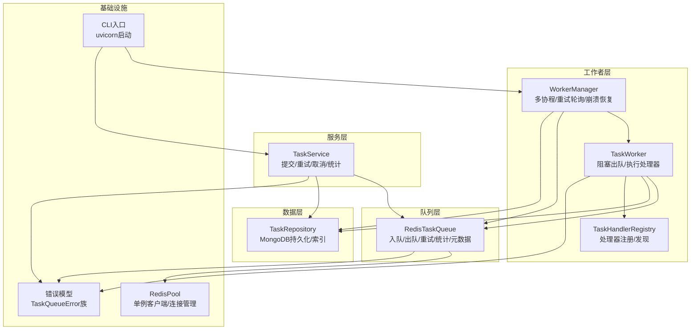
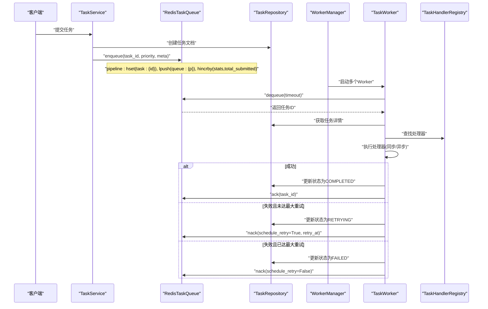
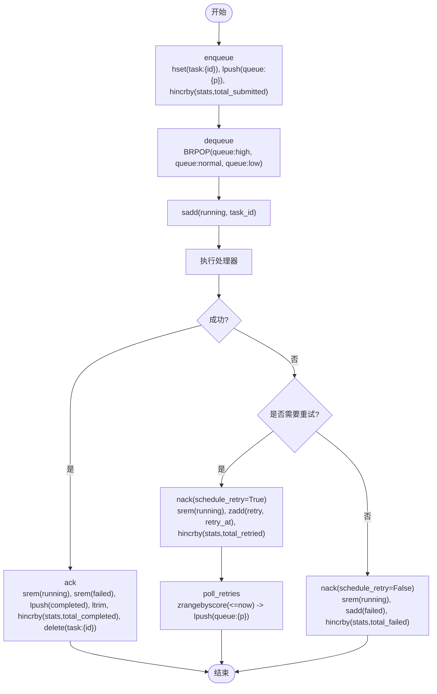
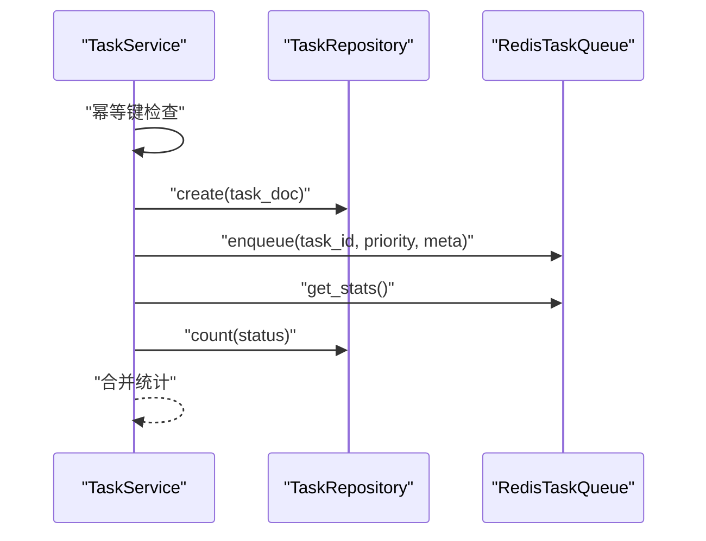
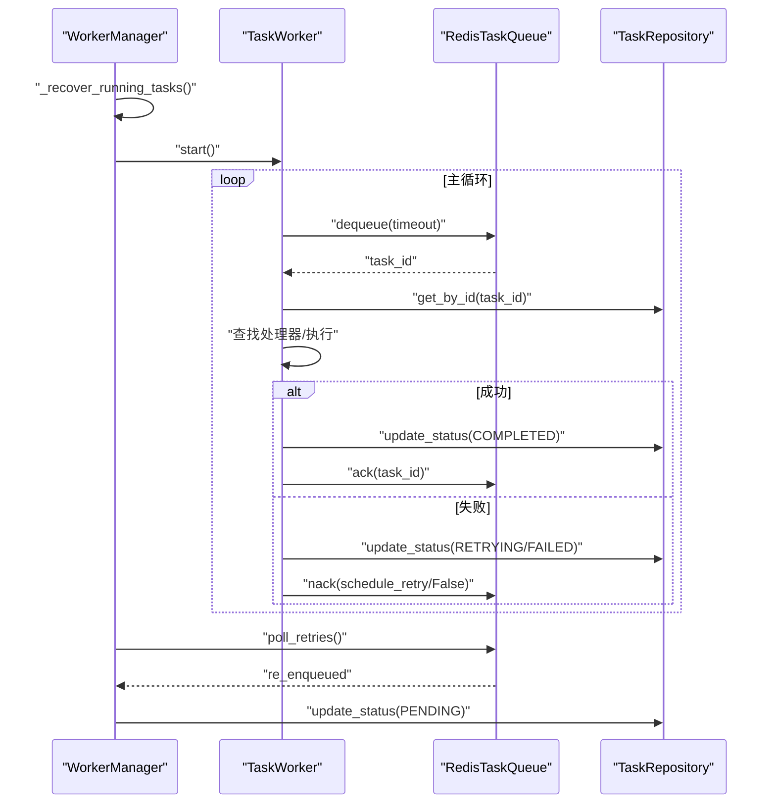
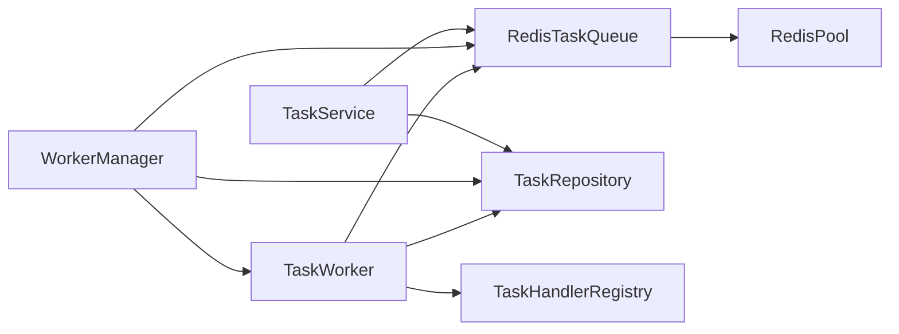

# Redis队列实现

<cite>
**本文引用的文件**
- [redis_queue.py](file://src/taolib/testing/task_queue/queue/redis_queue.py)
- [task.py](file://src/taolib/testing/task_queue/models/task.py)
- [enums.py](file://src/taolib/testing/task_queue/models/enums.py)
- [task_service.py](file://src/taolib/testing/task_queue/services/task_service.py)
- [manager.py](file://src/taolib/testing/task_queue/worker/manager.py)
- [worker.py](file://src/taolib/testing/task_queue/worker/worker.py)
- [task_repo.py](file://src/taolib/testing/task_queue/repository/task_repo.py)
- [registry.py](file://src/taolib/testing/task_queue/worker/registry.py)
- [errors.py](file://src/taolib/testing/task_queue/errors.py)
- [redis_pool.py](file://src/taolib/testing/_base/redis_pool.py)
- [main.py](file://src/taolib/testing/task_queue/server/main.py)
</cite>

## 目录
1. [简介](#简介)
2. [项目结构](#项目结构)
3. [核心组件](#核心组件)
4. [架构总览](#架构总览)
5. [详细组件分析](#详细组件分析)
6. [依赖分析](#依赖分析)
7. [性能考虑](#性能考虑)
8. [故障排查指南](#故障排查指南)
9. [结论](#结论)
10. [附录](#附录)

## 简介
本技术文档围绕基于Redis的三级优先级任务队列实现进行系统化阐述，涵盖数据结构设计、键命名规范、ZSET重试调度、阻塞出队与原子事务、任务元数据缓存、序列化与反序列化、连接池与错误重连策略、性能优化与监控、以及故障排查方法。该实现采用异步Redis客户端，结合MongoDB持久化，提供高可用、可观测、可扩展的任务处理能力。

## 项目结构
任务队列子系统由以下模块组成：
- 队列层：RedisTaskQueue，负责入队、出队、重试轮询、统计与元数据缓存
- 服务层：TaskService，封装业务流程（幂等提交、手动重试、取消、统计）
- 工作者层：TaskWorker与WorkerManager，负责拉取任务、执行处理器、崩溃恢复与重试轮询
- 注册表：TaskHandlerRegistry，装饰器式注册任务处理器
- 数据访问：TaskRepository，MongoDB持久化与索引
- 错误模型：自定义异常类型
- 连接池：Redis客户端单例与连接管理
- 服务器入口：CLI启动脚本

**图表来源**
- [redis_queue.py:14-317](file://src/taolib/testing/task_queue/queue/redis_queue.py#L14-L317)
- [task_service.py:23-259](file://src/taolib/testing/task_queue/services/task_service.py#L23-L259)
- [manager.py:25-225](file://src/taolib/testing/task_queue/worker/manager.py#L25-L225)
- [worker.py:21-275](file://src/taolib/testing/task_queue/worker/worker.py#L21-L275)
- [registry.py:11-136](file://src/taolib/testing/task_queue/worker/registry.py#L11-L136)
- [task_repo.py:15-169](file://src/taolib/testing/task_queue/repository/task_repo.py#L15-L169)
- [redis_pool.py:11-38](file://src/taolib/testing/_base/redis_pool.py#L11-L38)
- [main.py:14-48](file://src/taolib/testing/task_queue/server/main.py#L14-L48)

**章节来源**
- [redis_queue.py:14-317](file://src/taolib/testing/task_queue/queue/redis_queue.py#L14-L317)
- [task_service.py:23-259](file://src/taolib/testing/task_queue/services/task_service.py#L23-L259)
- [manager.py:25-225](file://src/taolib/testing/task_queue/worker/manager.py#L25-L225)
- [worker.py:21-275](file://src/taolib/testing/task_queue/worker/worker.py#L21-L275)
- [registry.py:11-136](file://src/taolib/testing/task_queue/worker/registry.py#L11-L136)
- [task_repo.py:15-169](file://src/taolib/testing/task_queue/repository/task_repo.py#L15-L169)
- [redis_pool.py:11-38](file://src/taolib/testing/_base/redis_pool.py#L11-L38)
- [main.py:14-48](file://src/taolib/testing/task_queue/server/main.py#L14-L48)

## 核心组件
- RedisTaskQueue：实现三级优先级队列（高/普通/低）、阻塞出队BRPOP、运行中集合、完成/失败集合、ZSET重试调度、任务元数据HASH缓存、全局计数器HASH、统计聚合
- TaskService：幂等提交、手动重试、取消、统计合并（Redis实时+MongoDB持久）
- WorkerManager：多Worker协程编排、重试轮询、崩溃恢复（孤儿任务检测与重新入队）
- TaskWorker：阻塞出队、处理器查找与执行（同步/异步）、成功/失败处理与重试调度
- TaskHandlerRegistry：装饰器式注册与查找任务处理器
- TaskRepository：MongoDB持久化、索引、TTL
- 错误模型：统一的异常层次结构
- RedisPool：Redis客户端单例与连接管理

**章节来源**
- [redis_queue.py:14-317](file://src/taolib/testing/task_queue/queue/redis_queue.py#L14-L317)
- [task_service.py:23-259](file://src/taolib/testing/task_queue/services/task_service.py#L23-L259)
- [manager.py:25-225](file://src/taolib/testing/task_queue/worker/manager.py#L25-L225)
- [worker.py:21-275](file://src/taolib/testing/task_queue/worker/worker.py#L21-L275)
- [registry.py:11-136](file://src/taolib/testing/task_queue/worker/registry.py#L11-L136)
- [task_repo.py:15-169](file://src/taolib/testing/task_queue/repository/task_repo.py#L15-L169)
- [errors.py:7-49](file://src/taolib/testing/task_queue/errors.py#L7-L49)
- [redis_pool.py:11-38](file://src/taolib/testing/_base/redis_pool.py#L11-L38)

## 架构总览
整体架构采用“服务层-队列层-工作者层-数据层”的分层设计，配合Redis与MongoDB双写以兼顾实时性与持久化。服务层负责业务编排，队列层负责任务编排与调度，工作者层负责具体执行，数据层负责持久化与查询。

**图表来源**
- [task_service.py:43-94](file://src/taolib/testing/task_queue/services/task_service.py#L43-L94)
- [redis_queue.py:58-103](file://src/taolib/testing/task_queue/queue/redis_queue.py#L58-L103)
- [worker.py:102-273](file://src/taolib/testing/task_queue/worker/worker.py#L102-L273)
- [registry.py:39-48](file://src/taolib/testing/task_queue/worker/registry.py#L39-L48)

## 详细组件分析

### RedisTaskQueue：三级优先级队列与重试调度
- 键命名规则
  - 队列键：{prefix}:queue:{priority}（高/普通/低）
  - 运行中集合：{prefix}:running
  - 完成集合：{prefix}:completed（LRANGE裁剪至最近1000条）
  - 失败集合：{prefix}:failed
  - 重试ZSET：{prefix}:retry（score=retry_at时间戳）
  - 任务元数据HASH：{prefix}:task:{id}
  - 全局计数器HASH：{prefix}:stats
- 入队（enqueue）
  - 使用pipeline原子性地写入任务元数据HASH、推入对应优先级LIST，并累加提交计数
- 出队（dequeue）
  - 使用BRPOP在三个队列上阻塞等待，按高→普通→低优先级顺序消费
  - 成功出队后将任务ID加入运行中集合
- 确认（ack）
  - 从运行中集合移除，从失败集合移除（重试成功时），推入完成LIST并裁剪，累加完成计数，删除任务元数据HASH
- 失败（nack）
  - 若需重试：从运行中集合移除，写入ZSET重试调度并累加重试计数
  - 若不重试：从运行中集合移除，加入失败集合并累加失败计数
- 重试轮询（poll_retries）
  - 周期性扫描ZSET到期任务，移除ZSET条目，读取任务元数据中的priority，重新推入对应优先级队列
- 统计（get_stats/get_queue_lengths）
  - 使用pipeline聚合统计：队列长度、运行中、失败、完成、重试数量；同时读取全局计数器

**图表来源**
- [redis_queue.py:58-194](file://src/taolib/testing/task_queue/queue/redis_queue.py#L58-L194)

**章节来源**
- [redis_queue.py:14-317](file://src/taolib/testing/task_queue/queue/redis_queue.py#L14-L317)

### TaskService：业务编排与幂等控制
- 幂等提交：若提供idempotency_key，则先查询是否存在相同键的任务，避免重复提交
- 提交流程：生成任务ID，写入MongoDB，再入Redis队列（携带task_type/priority/status等元数据）
- 手动重试：将失败任务重置为PENDING，从失败集合移除，重新入队
- 取消任务：仅允许PENDING/RETRYING状态取消
- 统计合并：汇总Redis实时统计与MongoDB持久统计

**图表来源**
- [task_service.py:43-94](file://src/taolib/testing/task_queue/services/task_service.py#L43-L94)
- [task_service.py:220-256](file://src/taolib/testing/task_queue/services/task_service.py#L220-L256)

**章节来源**
- [task_service.py:23-259](file://src/taolib/testing/task_queue/services/task_service.py#L23-L259)

### WorkerManager与TaskWorker：执行编排与崩溃恢复
- WorkerManager
  - 启动：崩溃恢复（扫描运行中集合，识别孤儿/超时任务并重新入队），启动多个TaskWorker协程，启动重试轮询
  - 停止：优雅关闭，等待所有Worker完成当前任务
  - 重试轮询：周期性调用队列层poll_retries，更新MongoDB状态为PENDING
- TaskWorker
  - 主循环：阻塞出队，获取任务详情，查找处理器，执行并处理成功/失败
  - 处理器执行：区分同步/异步，统一返回dict格式结果
  - 失败重试：按retry_delays指数退避计算下次重试时间，写入RETRYING状态与ZSET重试

**图表来源**
- [manager.py:73-168](file://src/taolib/testing/task_queue/worker/manager.py#L73-L168)
- [worker.py:79-273](file://src/taolib/testing/task_queue/worker/worker.py#L79-L273)
- [redis_queue.py:158-194](file://src/taolib/testing/task_queue/queue/redis_queue.py#L158-L194)

**章节来源**
- [manager.py:25-225](file://src/taolib/testing/task_queue/worker/manager.py#L25-L225)
- [worker.py:21-275](file://src/taolib/testing/task_queue/worker/worker.py#L21-L275)

### TaskHandlerRegistry：处理器注册与发现
- 支持同步与异步处理器
- 提供装饰器式注册与查找接口
- 默认注册表模块级导出

**章节来源**
- [registry.py:11-136](file://src/taolib/testing/task_queue/worker/registry.py#L11-L136)

### TaskRepository：MongoDB持久化与索引
- 提供常用CRUD与聚合查询
- 索引策略：按task_type、(status,priority)复合索引、幂等键唯一稀疏索引、按创建时间TTL（30天）

**章节来源**
- [task_repo.py:15-169](file://src/taolib/testing/task_queue/repository/task_repo.py#L15-L169)

### 错误模型与连接池
- 错误模型：TaskQueueError及其子类（任务不存在、已存在、处理器未找到、连接失败、最大重试超限等）
- RedisPool：提供Redis客户端单例与关闭接口，便于统一管理连接

**章节来源**
- [errors.py:7-49](file://src/taolib/testing/task_queue/errors.py#L7-L49)
- [redis_pool.py:11-38](file://src/taolib/testing/_base/redis_pool.py#L11-L38)

## 依赖分析
- 组件耦合
  - TaskService依赖RedisTaskQueue与TaskRepository，承担业务编排职责
  - WorkerManager依赖RedisTaskQueue、TaskRepository与TaskHandlerRegistry，负责协程生命周期与重试
  - TaskWorker依赖RedisTaskQueue、TaskRepository与TaskHandlerRegistry，负责具体执行
  - RedisTaskQueue依赖Redis客户端与键空间约定
- 外部依赖
  - Redis：异步客户端、ZSET、LIST、SET、HASH、PIPELINE
  - MongoDB：motor异步驱动、索引与TTL
  - uvicorn：服务器入口

**图表来源**
- [task_service.py:29-41](file://src/taolib/testing/task_queue/services/task_service.py#L29-L41)
- [manager.py:34-52](file://src/taolib/testing/task_queue/worker/manager.py#L34-L52)
- [worker.py:28-47](file://src/taolib/testing/task_queue/worker/worker.py#L28-L47)
- [redis_queue.py:31-43](file://src/taolib/testing/task_queue/queue/redis_queue.py#L31-L43)
- [redis_pool.py:11-38](file://src/taolib/testing/_base/redis_pool.py#L11-L38)

**章节来源**
- [task_service.py:23-259](file://src/taolib/testing/task_queue/services/task_service.py#L23-L259)
- [manager.py:25-225](file://src/taolib/testing/task_queue/worker/manager.py#L25-L225)
- [worker.py:21-275](file://src/taolib/testing/task_queue/worker/worker.py#L21-L275)
- [redis_queue.py:14-317](file://src/taolib/testing/task_queue/queue/redis_queue.py#L14-L317)
- [redis_pool.py:11-38](file://src/taolib/testing/_base/redis_pool.py#L11-L38)

## 性能考虑
- 队列消费优先级
  - 使用BRPOP在三个LIST上阻塞等待，按高→普通→低顺序消费，确保高优先级任务优先处理
- 原子性与批处理
  - 入队/确认/统计均使用pipeline，减少RTT与保证一致性
- 内存与存储
  - 完成队列LRANGE裁剪至最近1000条，控制内存占用
  - MongoDB集合按创建时间设置TTL，自动清理历史任务
- 并发与吞吐
  - 多Worker协程并行处理，提高吞吐
  - 异步Redis客户端提升IO并发
- 序列化与反序列化
  - 任务参数params为dict[Any,Any]，处理器返回值统一规整为dict，便于序列化与传输
- 重试策略
  - 指数退避延迟数组，避免雪崩效应

[本节为通用性能指导，无需特定文件引用]

## 故障排查指南
- 任务长时间无响应
  - 检查WorkerManager是否正常启动与运行，确认崩溃恢复逻辑是否将孤儿任务重新入队
  - 核对重试轮询是否按预期运行
- 任务堆积
  - 查看各优先级队列长度统计，评估Worker数量与处理耗时
  - 检查处理器执行耗时与异常日志
- 任务状态不一致
  - 检查ack/nack流程是否正确执行，确认pipeline事务是否成功
  - 核对MongoDB与Redis状态更新是否一致
- Redis连接问题
  - 使用RedisPool提供的单例客户端，确保连接复用与关闭时机
  - 关注连接超时与网络波动导致的异常
- 处理器缺失
  - 确认TaskHandlerRegistry是否正确注册了对应task_type的处理器

**章节来源**
- [manager.py:169-223](file://src/taolib/testing/task_queue/worker/manager.py#L169-L223)
- [worker.py:102-273](file://src/taolib/testing/task_queue/worker/worker.py#L102-L273)
- [redis_queue.py:105-157](file://src/taolib/testing/task_queue/queue/redis_queue.py#L105-L157)
- [redis_pool.py:11-38](file://src/taolib/testing/_base/redis_pool.py#L11-L38)

## 结论
该Redis队列实现通过清晰的分层设计与严格的原子性保障，提供了高可靠的任务调度能力。三级优先级队列、ZSET重试调度、崩溃恢复与统计聚合共同构成了完整的任务生命周期管理体系。结合MongoDB持久化与异步Redis客户端，系统在性能与可靠性之间取得了良好平衡。建议在生产环境中关注Worker数量、重试策略与监控告警，持续优化处理链路与资源使用。

[本节为总结性内容，无需特定文件引用]

## 附录

### 数据结构与键空间设计
- 队列键：{prefix}:queue:{priority}（LIST）
- 运行中：{prefix}:running（SET）
- 完成：{prefix}:completed（LIST，LRANGE裁剪）
- 失败：{prefix}:failed（SET）
- 重试：{prefix}:retry（ZSET，score=retry_at）
- 元数据：{prefix}:task:{id}（HASH）
- 统计：{prefix}:stats（HASH）

**章节来源**
- [redis_queue.py:19-29](file://src/taolib/testing/task_queue/queue/redis_queue.py#L19-L29)

### 任务序列化与反序列化
- 任务参数：params为dict[Any,Any]，支持任意JSON兼容类型
- 处理器返回：统一规整为dict，若为空则返回空字典，若非dict则包装为{"result": ...}

**章节来源**
- [task.py:18-29](file://src/taolib/testing/task_queue/models/task.py#L18-L29)
- [worker.py:154-177](file://src/taolib/testing/task_queue/worker/worker.py#L154-L177)

### Redis连接池与错误重连
- 单例客户端：通过RedisPool.get_redis_client获取，decode_responses开启，encoding为utf-8
- 连接关闭：通过close_redis_client释放连接
- 错误重连：在出现连接异常时，可重建客户端实例

**章节来源**
- [redis_pool.py:11-38](file://src/taolib/testing/_base/redis_pool.py#L11-L38)

### 服务器入口与配置
- CLI入口：解析host/port/reload/log-level参数，启动uvicorn应用
- 应用创建：由server/app.py中的create_app负责

**章节来源**
- [main.py:14-48](file://src/taolib/testing/task_queue/server/main.py#L14-L48)