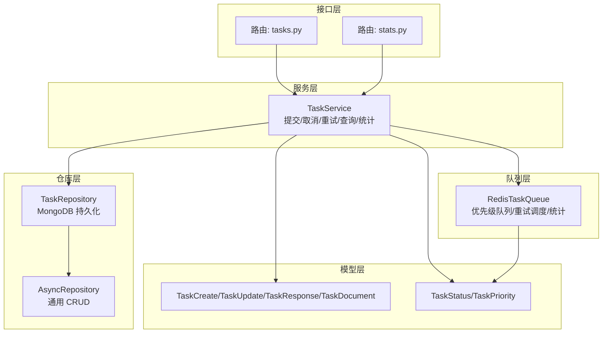
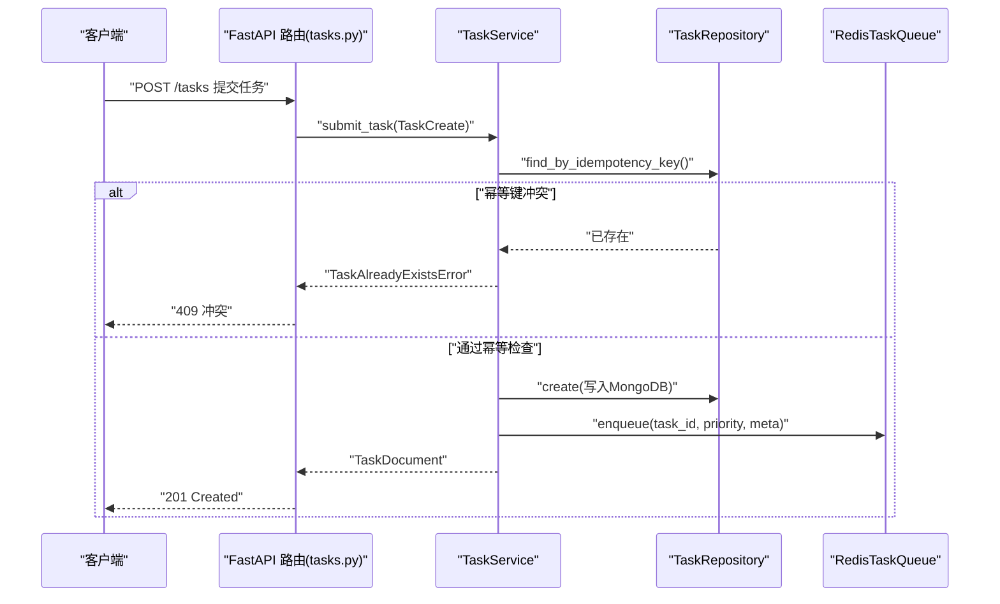
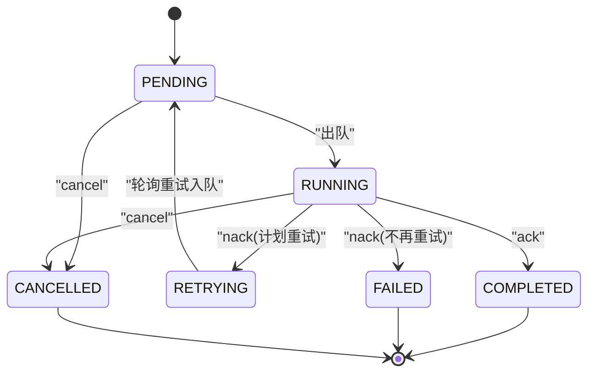
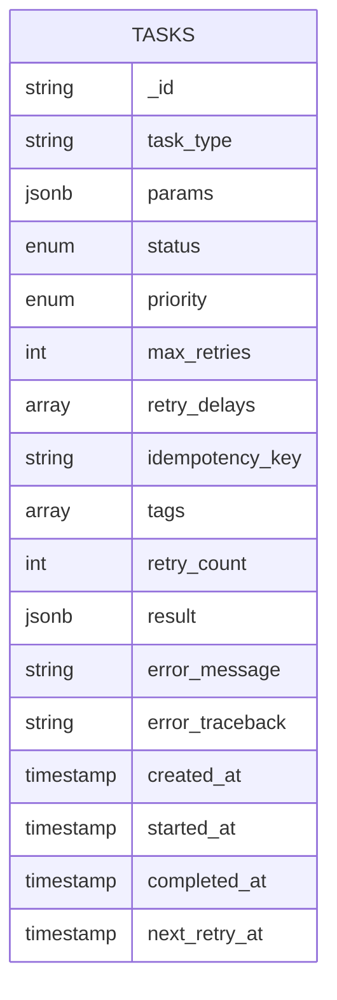
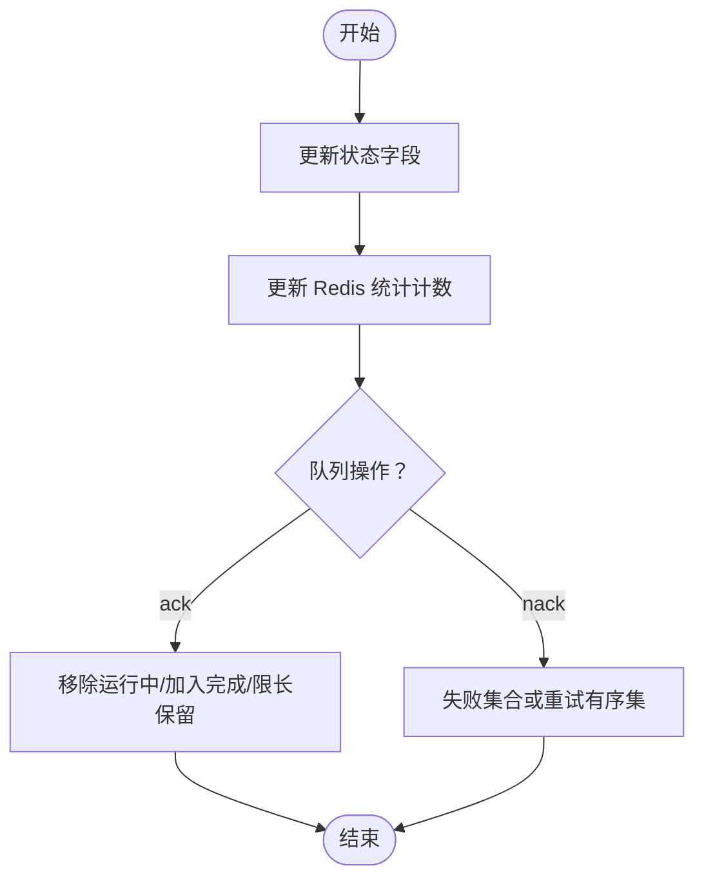
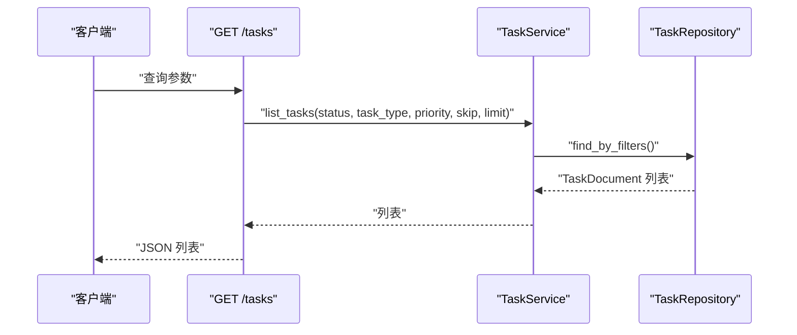
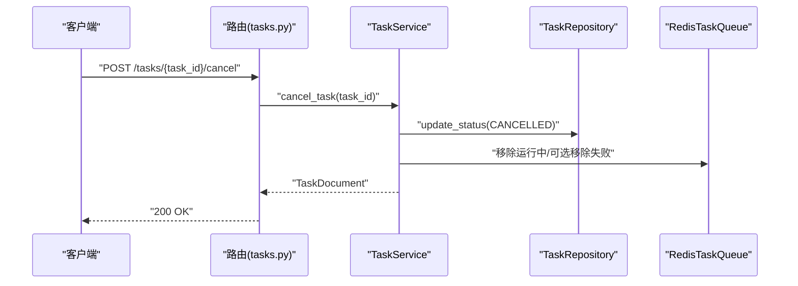
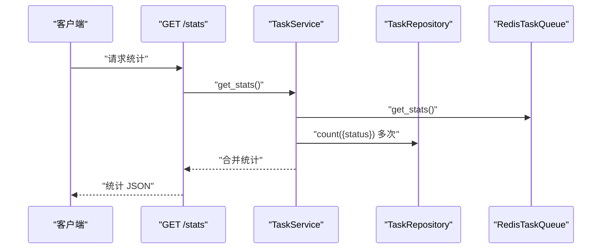
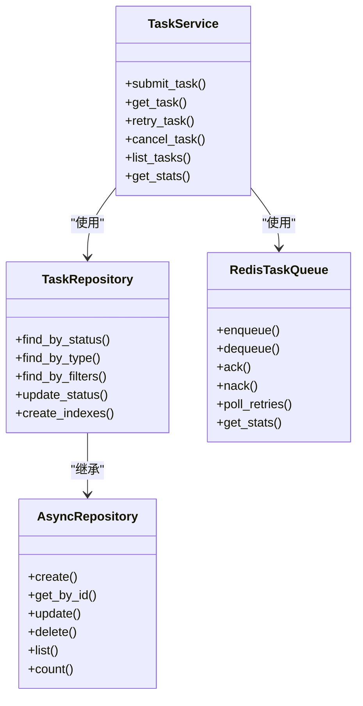

# 任务服务层

<cite>
**本文引用的文件**
- [task_service.py](file://src/taolib/testing/task_queue/services/task_service.py)
- [task_repo.py](file://src/taolib/testing/task_queue/repository/task_repo.py)
- [redis_queue.py](file://src/taolib/testing/task_queue/queue/redis_queue.py)
- [task.py](file://src/taolib/testing/task_queue/models/task.py)
- [enums.py](file://src/taolib/testing/task_queue/models/enums.py)
- [tasks.py](file://src/taolib/testing/task_queue/server/api/tasks.py)
- [stats.py](file://src/taolib/testing/task_queue/server/api/stats.py)
- [repository.py](file://src/taolib/testing/_base/repository.py)
- [errors.py](file://src/taolib/testing/task_queue/errors.py)
</cite>

## 目录
1. [简介](#简介)
2. [项目结构](#项目结构)
3. [核心组件](#核心组件)
4. [架构总览](#架构总览)
5. [详细组件分析](#详细组件分析)
6. [依赖关系分析](#依赖关系分析)
7. [性能考量](#性能考量)
8. [故障排查指南](#故障排查指南)
9. [结论](#结论)
10. [附录](#附录)

## 简介
本文件为“任务服务层”的全面技术文档，覆盖任务生命周期管理（创建、状态转换、完成处理与清理）、MongoDB 持久化策略（存储结构、索引设计、查询优化）、状态跟踪机制（变更日志、进度监控、异常处理）、任务查询接口（按状态/类型/优先级过滤、分页）、任务管理 API（取消、重试、删除）、统计功能（执行时间、成功率、性能指标）、任务隔离机制（命名空间与权限控制建议）、以及服务配置选项（数据库连接池、事务设置、批量参数）。文档以代码为依据，结合可视化图示帮助读者快速理解与落地。

## 项目结构
任务服务层位于测试子模块 taolib.testing 中，采用“模型-仓库-服务-队列-接口”分层组织，职责清晰、边界明确：
- 模型层：定义任务的输入、输出、文档形态与枚举类型
- 仓库层：封装 MongoDB 的异步 CRUD 与查询
- 服务层：编排业务流程（提交、取消、重试、统计）
- 队列层：基于 Redis 的优先级队列、重试调度与实时统计
- 接口层：FastAPI 路由暴露任务查询、提交、管理与统计 API

图表来源
- [tasks.py:1-205](file://src/taolib/testing/task_queue/server/api/tasks.py#L1-L205)
- [stats.py:1-65](file://src/taolib/testing/task_queue/server/api/stats.py#L1-L65)
- [task_service.py:1-259](file://src/taolib/testing/task_queue/services/task_service.py#L1-L259)
- [task_repo.py:1-169](file://src/taolib/testing/task_queue/repository/task_repo.py#L1-L169)
- [repository.py:1-131](file://src/taolib/testing/_base/repository.py#L1-L131)
- [redis_queue.py:1-317](file://src/taolib/testing/task_queue/queue/redis_queue.py#L1-L317)
- [task.py:1-107](file://src/taolib/testing/task_queue/models/task.py#L1-L107)
- [enums.py:1-28](file://src/taolib/testing/task_queue/models/enums.py#L1-L28)

章节来源
- [tasks.py:1-205](file://src/taolib/testing/task_queue/server/api/tasks.py#L1-L205)
- [task_service.py:1-259](file://src/taolib/testing/task_queue/services/task_service.py#L1-L259)
- [task_repo.py:1-169](file://src/taolib/testing/task_queue/repository/task_repo.py#L1-L169)
- [redis_queue.py:1-317](file://src/taolib/testing/task_queue/queue/redis_queue.py#L1-L317)
- [task.py:1-107](file://src/taolib/testing/task_queue/models/task.py#L1-L107)
- [enums.py:1-28](file://src/taolib/testing/task_queue/models/enums.py#L1-L28)
- [repository.py:1-131](file://src/taolib/testing/_base/repository.py#L1-L131)

## 核心组件
- 任务模型与枚举
  - 输入/输出/文档三层模型，确保 API 与存储一致性
  - 状态与优先级枚举统一管理
- 任务仓库
  - 基于 AsyncRepository 的通用 CRUD
  - 针对状态、类型、幂等键的查询方法
  - 集合索引创建（任务类型、状态+优先级、幂等键唯一索引、TTL）
- 任务服务
  - 提交任务：幂等键校验、MongoDB 写入、Redis 入队
  - 取消/重试：状态约束、更新与队列同步
  - 查询与统计：多维过滤、分页、Redis+MongoDB 统计合并
- Redis 任务队列
  - 优先级队列（高/普通/低）、运行中集合、失败集合、重试有序集
  - 任务元数据缓存、统计计数器、队列深度查询
- FastAPI 接口
  - 任务提交、查询、取消、重试、删除
  - 全局统计与队列深度查询

章节来源
- [task.py:1-107](file://src/taolib/testing/task_queue/models/task.py#L1-L107)
- [enums.py:1-28](file://src/taolib/testing/task_queue/models/enums.py#L1-L28)
- [task_repo.py:15-169](file://src/taolib/testing/task_queue/repository/task_repo.py#L15-L169)
- [repository.py:15-131](file://src/taolib/testing/_base/repository.py#L15-L131)
- [task_service.py:23-259](file://src/taolib/testing/task_queue/services/task_service.py#L23-L259)
- [redis_queue.py:14-317](file://src/taolib/testing/task_queue/queue/redis_queue.py#L14-L317)
- [tasks.py:34-205](file://src/taolib/testing/task_queue/server/api/tasks.py#L34-L205)
- [stats.py:37-65](file://src/taolib/testing/task_queue/server/api/stats.py#L37-L65)

## 架构总览
下图展示任务从提交到完成的关键交互流程，包括状态流转、持久化与队列同步。

图表来源
- [tasks.py:117-140](file://src/taolib/testing/task_queue/server/api/tasks.py#L117-L140)
- [task_service.py:43-94](file://src/taolib/testing/task_queue/services/task_service.py#L43-L94)
- [task_repo.py:111-123](file://src/taolib/testing/task_queue/repository/task_repo.py#L111-L123)
- [redis_queue.py:58-80](file://src/taolib/testing/task_queue/queue/redis_queue.py#L58-L80)

## 详细组件分析

### 任务生命周期管理
- 生命周期阶段
  - PENDING：待执行（初始状态）
  - RUNNING：执行中（从队列取出后进入）
  - COMPLETED/FAILED：完成或失败（ack/nack）
  - RETRYING：等待重试（nack 且计划重试）
  - CANCELLED：被取消（仅允许 PENDING/RETRYING）
- 状态转换
  - 提交：PENDING
  - 出队：PENDING → RUNNING
  - 完成：RUNNING → COMPLETED（ack）
  - 失败：RUNNING → RETRYING 或 FAILED（nack）
  - 重试：FAILED → PENDING（手动重试）
  - 取消：PENDING/RETRYING → CANCELLED

图表来源
- [enums.py:9-26](file://src/taolib/testing/task_queue/models/enums.py#L9-L26)
- [redis_queue.py:105-157](file://src/taolib/testing/task_queue/queue/redis_queue.py#L105-L157)
- [task_service.py:113-190](file://src/taolib/testing/task_queue/services/task_service.py#L113-L190)

章节来源
- [enums.py:9-26](file://src/taolib/testing/task_queue/models/enums.py#L9-L26)
- [task_service.py:43-190](file://src/taolib/testing/task_queue/services/task_service.py#L43-L190)
- [redis_queue.py:58-157](file://src/taolib/testing/task_queue/queue/redis_queue.py#L58-L157)

### 任务持久化策略（MongoDB）
- 存储结构
  - 集合：tasks
  - 文档字段：包含任务类型、参数、优先级、重试策略、幂等键、标签、状态、重试计数、时间戳、结果与错误信息等
- 索引设计
  - 任务类型：便于按类型查询
  - 状态+优先级：支持高效筛选与排序
  - 幂等键唯一稀疏索引：保证幂等性，允许空值
  - created_at TTL：自动过期清理历史数据（示例 30 天）
- 查询优化
  - 使用复合索引减少全表扫描
  - 分页查询配合 created_at 降序排序
  - 通过幂等键快速去重

图表来源
- [task.py:68-104](file://src/taolib/testing/task_queue/models/task.py#L68-L104)
- [task_repo.py:159-167](file://src/taolib/testing/task_queue/repository/task_repo.py#L159-L167)

章节来源
- [task_repo.py:15-169](file://src/taolib/testing/task_queue/repository/task_repo.py#L15-L169)
- [task.py:15-107](file://src/taolib/testing/task_queue/models/task.py#L15-L107)

### 任务状态跟踪机制
- 变更日志
  - MongoDB 文档字段记录状态、重试计数、错误信息、时间戳
  - Redis 统计计数器记录提交/完成/失败/重试总量
- 进度监控
  - Redis 队列长度（高/普通/低）
  - 运行中任务集合大小
  - 最近完成任务列表（固定长度）
- 异常处理
  - 自定义异常类型区分不同错误场景
  - 接口层捕获并映射为 HTTP 状态码

图表来源
- [task_service.py:96-190](file://src/taolib/testing/task_queue/services/task_service.py#L96-L190)
- [redis_queue.py:105-157](file://src/taolib/testing/task_queue/queue/redis_queue.py#L105-L157)
- [errors.py:7-49](file://src/taolib/testing/task_queue/errors.py#L7-L49)

章节来源
- [task_service.py:96-190](file://src/taolib/testing/task_queue/services/task_service.py#L96-L190)
- [redis_queue.py:105-157](file://src/taolib/testing/task_queue/queue/redis_queue.py#L105-L157)
- [errors.py:7-49](file://src/taolib/testing/task_queue/errors.py#L7-L49)

### 任务查询接口
- 支持过滤
  - 状态、任务类型、优先级
- 分页
  - skip/limit 控制结果集
- 排序
  - 默认按创建时间倒序
- 示例调用
  - GET /tasks?status=&task_type=&priority=&skip=&limit=

图表来源
- [tasks.py:79-101](file://src/taolib/testing/task_queue/server/api/tasks.py#L79-L101)
- [task_service.py:192-218](file://src/taolib/testing/task_queue/services/task_service.py#L192-L218)
- [task_repo.py:125-157](file://src/taolib/testing/task_queue/repository/task_repo.py#L125-L157)

章节来源
- [tasks.py:79-101](file://src/taolib/testing/task_queue/server/api/tasks.py#L79-L101)
- [task_service.py:192-218](file://src/taolib/testing/task_queue/services/task_service.py#L192-L218)
- [task_repo.py:125-157](file://src/taolib/testing/task_queue/repository/task_repo.py#L125-L157)

### 任务管理 API
- 提交任务
  - POST /tasks
  - 支持幂等键、重试策略、优先级、标签
- 查询任务
  - GET /tasks/{task_id}
- 取消任务
  - POST /tasks/{task_id}/cancel（仅 PENDING/RETRYING）
- 手动重试
  - POST /tasks/{task_id}/retry（仅 FAILED）
- 删除任务
  - DELETE /tasks/{task_id}（仅终态：COMPLETED/FAILED/CANCELLED）

图表来源
- [tasks.py:161-178](file://src/taolib/testing/task_queue/server/api/tasks.py#L161-L178)
- [task_service.py:161-190](file://src/taolib/testing/task_queue/services/task_service.py#L161-L190)
- [redis_queue.py:300-315](file://src/taolib/testing/task_queue/queue/redis_queue.py#L300-L315)

章节来源
- [tasks.py:117-205](file://src/taolib/testing/task_queue/server/api/tasks.py#L117-L205)
- [task_service.py:161-190](file://src/taolib/testing/task_queue/services/task_service.py#L161-L190)
- [redis_queue.py:300-315](file://src/taolib/testing/task_queue/queue/redis_queue.py#L300-L315)

### 任务统计功能
- 统计维度
  - MongoDB：各状态计数、总数
  - Redis：队列长度、运行中、失败、重试、累计提交/完成/失败/重试
- 接口
  - GET /stats
  - GET /stats/queue-depths

图表来源
- [stats.py:37-51](file://src/taolib/testing/task_queue/server/api/stats.py#L37-L51)
- [task_service.py:220-256](file://src/taolib/testing/task_queue/services/task_service.py#L220-L256)
- [redis_queue.py:226-271](file://src/taolib/testing/task_queue/queue/redis_queue.py#L226-L271)
- [task_repo.py:232-237](file://src/taolib/testing/task_queue/repository/task_repo.py#L232-L237)

章节来源
- [stats.py:37-65](file://src/taolib/testing/task_queue/server/api/stats.py#L37-L65)
- [task_service.py:220-256](file://src/taolib/testing/task_queue/services/task_service.py#L220-L256)
- [redis_queue.py:226-271](file://src/taolib/testing/task_queue/queue/redis_queue.py#L226-L271)
- [task_repo.py:232-237](file://src/taolib/testing/task_queue/repository/task_repo.py#L232-L237)

### 任务隔离机制（建议）
- 命名空间管理
  - Redis 键前缀隔离不同租户/环境
  - MongoDB 数据库/集合隔离
- 权限控制
  - 接口层鉴权与 RBAC
  - 任务标签用于访问控制与审计

（本节为概念性建议，不直接对应具体源码）

### 服务配置选项（建议）
- 数据库连接池
  - Motor 连接池参数（最大连接数、空闲超时、连接超时）
- 事务设置
  - 单文档更新无需事务；跨集合/跨文档需应用层一致性保障
- 批量操作参数
  - 批量插入/更新的批大小与超时
  - Redis 管道事务开启与批量统计

（本节为概念性建议，不直接对应具体源码）

## 依赖关系分析
- 组件耦合
  - TaskService 依赖 TaskRepository 与 RedisTaskQueue，职责单一
  - TaskRepository 继承 AsyncRepository，复用通用能力
  - API 层通过依赖注入获取服务实例
- 外部依赖
  - MongoDB（Motor）、Redis（redis-py）、FastAPI

图表来源
- [task_service.py:23-259](file://src/taolib/testing/task_queue/services/task_service.py#L23-L259)
- [task_repo.py:15-169](file://src/taolib/testing/task_queue/repository/task_repo.py#L15-L169)
- [repository.py:15-131](file://src/taolib/testing/_base/repository.py#L15-L131)
- [redis_queue.py:14-317](file://src/taolib/testing/task_queue/queue/redis_queue.py#L14-L317)

章节来源
- [task_service.py:23-259](file://src/taolib/testing/task_queue/services/task_service.py#L23-L259)
- [task_repo.py:15-169](file://src/taolib/testing/task_queue/repository/task_repo.py#L15-L169)
- [repository.py:15-131](file://src/taolib/testing/_base/repository.py#L15-L131)
- [redis_queue.py:14-317](file://src/taolib/testing/task_queue/queue/redis_queue.py#L14-L317)

## 性能考量
- 写入路径
  - 提交任务：一次 MongoDB 插入 + 一次 Redis 入队（管道事务）
- 读取路径
  - 查询列表：复合索引 + 分页 + 降序排序
  - 统计：Redis 计数器聚合 + MongoDB 计数
- 队列调度
  - BRPOP 优先级消费，ZSET 重试调度，避免轮询
- TTL 清理
  - created_at TTL 自动回收历史任务

（本节为通用性能建议，不直接对应具体源码）

## 故障排查指南
- 常见问题与定位
  - 409 冲突：幂等键已存在
  - 404 未找到：任务不存在
  - 400 参数错误：状态不允许取消/重试
- 日志与监控
  - 服务层记录关键事件（提交/取消/重试）
  - Redis 统计计数辅助定位异常峰值
- 排查步骤
  - 检查 Redis 键空间与统计
  - 核对 MongoDB 索引是否生效
  - 确认任务状态是否符合预期

章节来源
- [tasks.py:135-177](file://src/taolib/testing/task_queue/server/api/tasks.py#L135-L177)
- [task_service.py:43-94](file://src/taolib/testing/task_queue/services/task_service.py#L43-L94)
- [errors.py:13-49](file://src/taolib/testing/task_queue/errors.py#L13-L49)

## 结论
该任务服务层通过“模型-仓库-服务-队列-接口”的清晰分层，实现了高可用的任务生命周期管理与可观测性。MongoDB 与 Redis 的组合既保证了持久化与实时性的平衡，又提供了完善的索引与统计能力。接口层提供完整的任务管理能力，并通过幂等键与状态约束确保一致性。建议在生产环境中完善命名空间与权限控制、数据库连接池与批量参数配置，并持续监控 Redis 统计与 MongoDB 索引命中率以优化性能。

## 附录
- 关键 API
  - 提交：POST /tasks
  - 查询：GET /tasks
  - 详情：GET /tasks/{task_id}
  - 取消：POST /tasks/{task_id}/cancel
  - 重试：POST /tasks/{task_id}/retry
  - 删除：DELETE /tasks/{task_id}
  - 统计：GET /stats
  - 队列深度：GET /stats/queue-depths

章节来源
- [tasks.py:79-205](file://src/taolib/testing/task_queue/server/api/tasks.py#L79-L205)
- [stats.py:37-65](file://src/taolib/testing/task_queue/server/api/stats.py#L37-L65)