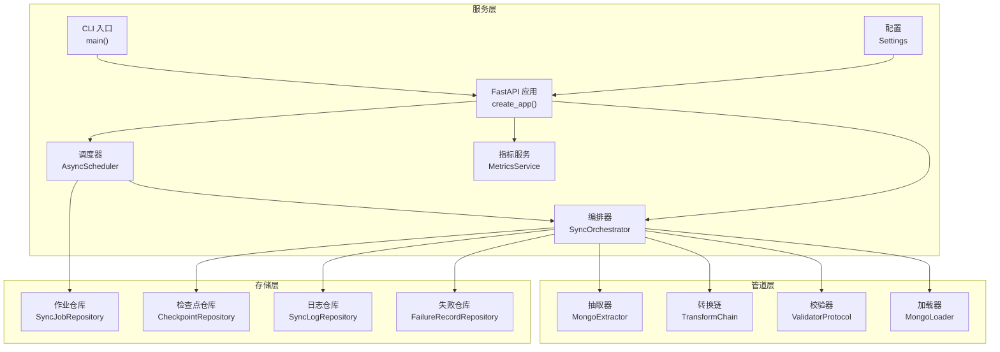
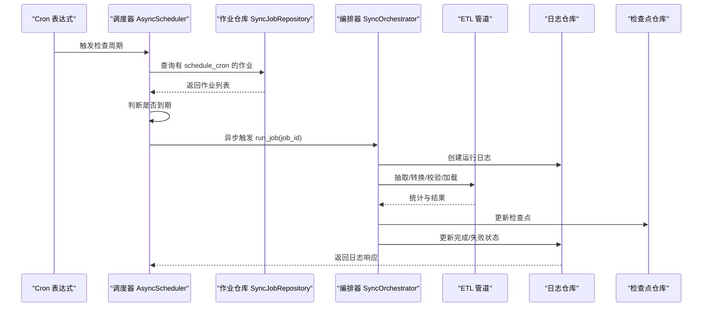
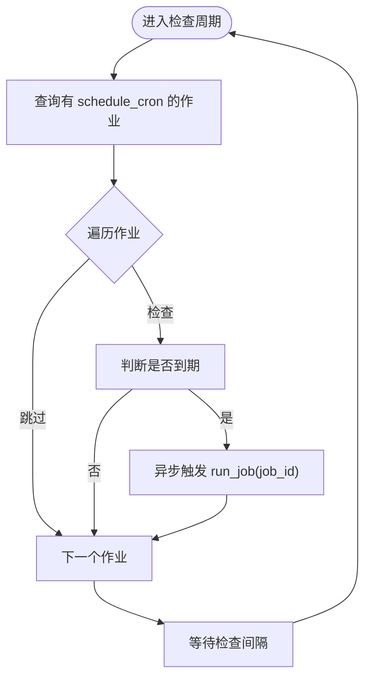
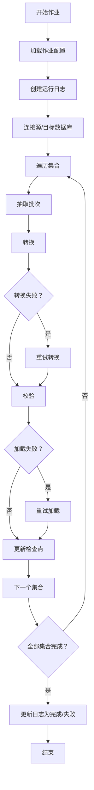
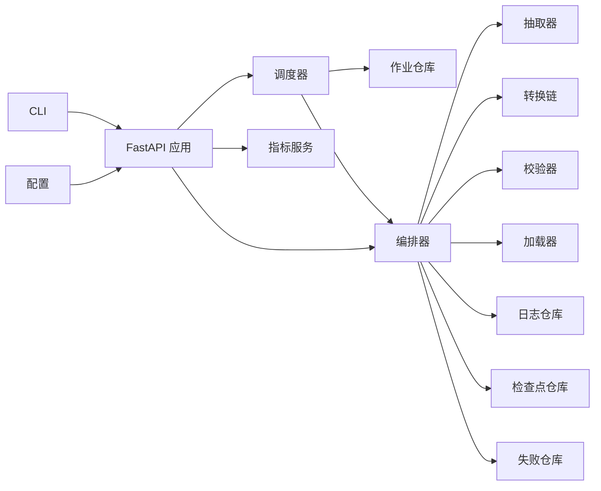

# 任务调度系统

<cite>
**本文引用的文件**
- [scheduler.py](file://src/taolib/testing/data_sync/services/scheduler.py)
- [orchestrator.py](file://src/taolib/testing/data_sync/services/orchestrator.py)
- [job.py](file://src/taolib/testing/data_sync/models/job.py)
- [extractor.py](file://src/taolib/testing/data_sync/pipeline/extractor.py)
- [loader.py](file://src/taolib/testing/data_sync/pipeline/loader.py)
- [job_repo.py](file://src/taolib/testing/data_sync/repository/job_repo.py)
- [enums.py](file://src/taolib/testing/data_sync/models/enums.py)
- [metrics_service.py](file://src/taolib/testing/data_sync/services/metrics_service.py)
- [main.py](file://src/taolib/testing/data_sync/server/main.py)
- [config.py](file://src/taolib/testing/data_sync/server/config.py)
- [app.py](file://src/taolib/testing/data_sync/server/app.py)
- [router.py](file://src/taolib/testing/data_sync/server/api/router.py)
- [jobs.py](file://src/taolib/testing/data_sync/server/api/jobs.py)
</cite>

## 目录
1. [简介](#简介)
2. [项目结构](#项目结构)
3. [核心组件](#核心组件)
4. [架构总览](#架构总览)
5. [详细组件分析](#详细组件分析)
6. [依赖分析](#依赖分析)
7. [性能考虑](#性能考虑)
8. [故障排查指南](#故障排查指南)
9. [结论](#结论)
10. [附录](#附录)

## 简介
本文件面向“任务调度系统”的技术文档，聚焦于定时任务与批处理作业的调度机制与实现细节。内容涵盖：
- Cron 表达式解析与任务触发时机
- 调度精度与检查周期
- 批处理作业的调度策略（批量大小、处理间隔、资源限制）
- 调度器核心算法（任务发现、触发、执行）
- 调度配置选项（并发、超时、重试策略）
- 性能监控指标（调度延迟、执行成功率、资源利用率）
- 调度器启动、停止、重启与故障恢复
- 配置示例与最佳实践

## 项目结构
该系统围绕“数据同步”场景构建，采用分层架构：
- 服务层：调度器、编排器、指标服务
- 管道层：抽取、转换、校验、加载
- 存储层：MongoDB 文档模型与仓库
- 服务层：FastAPI 应用、路由、配置与 CLI

图表来源
- [scheduler.py:21-108](file://src/taolib/testing/data_sync/services/scheduler.py#L21-L108)
- [orchestrator.py:48-605](file://src/taolib/testing/data_sync/services/orchestrator.py#L48-L605)
- [metrics_service.py:16-115](file://src/taolib/testing/data_sync/services/metrics_service.py#L16-L115)
- [job_repo.py:12-74](file://src/taolib/testing/data_sync/repository/job_repo.py#L12-L74)
- [app.py:57-84](file://src/taolib/testing/data_sync/server/app.py#L57-L84)
- [config.py:10-43](file://src/taolib/testing/data_sync/server/config.py#L10-L43)
- [main.py:14-48](file://src/taolib/testing/data_sync/server/main.py#L14-L48)

章节来源
- [scheduler.py:1-108](file://src/taolib/testing/data_sync/services/scheduler.py#L1-L108)
- [orchestrator.py:1-605](file://src/taolib/testing/data_sync/services/orchestrator.py#L1-L605)
- [job_repo.py:1-74](file://src/taolib/testing/data_sync/repository/job_repo.py#L1-L74)
- [app.py:1-372](file://src/taolib/testing/data_sync/server/app.py#L1-L372)
- [config.py:1-43](file://src/taolib/testing/data_sync/server/config.py#L1-L43)
- [main.py:1-48](file://src/taolib/testing/data_sync/server/main.py#L1-L48)

## 核心组件
- 调度器（AsyncScheduler）：基于 Cron 表达式定时扫描并触发作业，支持自定义检查周期。
- 编排器（SyncOrchestrator）：负责 ETL 流程（抽取→转换→校验→加载），维护日志、检查点与失败记录，并支持重试策略。
- 管道组件：MongoExtractor、TransformChain、ValidatorProtocol、MongoLoader。
- 仓库与模型：作业、日志、检查点、失败记录等模型与仓库。
- 指标服务（MetricsService）：聚合统计与监控查询。
- FastAPI 服务与 CLI：提供 Web API、仪表盘与命令行入口。

章节来源
- [scheduler.py:21-108](file://src/taolib/testing/data_sync/services/scheduler.py#L21-L108)
- [orchestrator.py:48-605](file://src/taolib/testing/data_sync/services/orchestrator.py#L48-L605)
- [metrics_service.py:16-115](file://src/taolib/testing/data_sync/services/metrics_service.py#L16-L115)
- [job.py:15-125](file://src/taolib/testing/data_sync/models/job.py#L15-L125)
- [enums.py:9-42](file://src/taolib/testing/data_sync/models/enums.py#L9-L42)

## 架构总览
系统通过调度器周期性扫描具备 Cron 配置的作业，触发编排器执行 ETL；编排器在每个集合上按批次处理，支持失败重试与失败记录；最终更新日志与检查点，并通过指标服务提供监控数据。

图表来源
- [scheduler.py:71-107](file://src/taolib/testing/data_sync/services/scheduler.py#L71-L107)
- [job_repo.py:42-48](file://src/taolib/testing/data_sync/repository/job_repo.py#L42-L48)
- [orchestrator.py:82-247](file://src/taolib/testing/data_sync/services/orchestrator.py#L82-L247)

## 详细组件分析

### 调度器（AsyncScheduler）
- 职责：周期扫描、Cron 到期判断、触发作业执行。
- 关键点：
  - 检查间隔可配置，默认 60 秒。
  - 使用 croniter 解析 Cron 表达式，若未安装则跳过。
  - 到期即以异步任务方式触发执行，不阻塞调度循环。
- 精度：受检查间隔影响，当前实现为“每 N 秒检查一次到期窗口”，非纳秒级精度。

图表来源
- [scheduler.py:62-107](file://src/taolib/testing/data_sync/services/scheduler.py#L62-L107)

章节来源
- [scheduler.py:21-108](file://src/taolib/testing/data_sync/services/scheduler.py#L21-L108)

### 编排器（SyncOrchestrator）
- 职责：统一协调 ETL 流程，维护日志、检查点与失败记录，支持失败重试与中止策略。
- ETL 步骤：
  - 连接源/目标数据库
  - 遍历集合，逐批处理
  - 抽取（MongoExtractor）、转换（TransformChain）、校验（可选）、加载（MongoLoader）
  - 失败重试（转换/加载阶段）
  - 更新日志与检查点
- 失败策略：SKIP（跳过）、RETRY（重试）、ABORT（中止）。
- 资源限制：批处理大小由作业配置决定，MongoDB 查询按时间戳排序与分批。

图表来源
- [orchestrator.py:162-392](file://src/taolib/testing/data_sync/services/orchestrator.py#L162-L392)

章节来源
- [orchestrator.py:48-605](file://src/taolib/testing/data_sync/services/orchestrator.py#L48-L605)

### 管道组件
- 抽取器（MongoExtractor）：基于时间戳与 ID 排序，按批次输出文档。
- 加载器（MongoLoader）：使用 ReplaceOne + upsert 批量写入，捕获部分失败并记录失败明细。
- 转换链（TransformChain）：支持字段映射与模块化转换，失败时记录失败明细。
- 校验器（ValidatorProtocol）：可选，过滤无效文档并记录失败明细。

章节来源
- [extractor.py:17-78](file://src/taolib/testing/data_sync/pipeline/extractor.py#L17-L78)
- [loader.py:18-98](file://src/taolib/testing/data_sync/pipeline/loader.py#L18-L98)

### 作业模型与配置
- 作业模型包含：名称、描述、范围、模式、源/目标连接、转换模块、字段映射、过滤条件、Cron 表达式、批处理大小、失败处理动作、最大重试次数、启用状态、标签等。
- 关键配置项：
  - schedule_cron：Cron 表达式，用于调度
  - batch_size：每批文档数
  - failure_action：失败处理动作（SKIP/RETRY/ABORT）
  - max_retries：最大重试次数
  - enabled：是否启用

章节来源
- [job.py:23-42](file://src/taolib/testing/data_sync/models/job.py#L23-L42)
- [enums.py:9-42](file://src/taolib/testing/data_sync/models/enums.py#L9-L42)

### 指标服务（MetricsService）
- 提供作业摘要、全局摘要与失败统计，便于监控与告警。
- 摘要包含：总运行次数、成功次数、成功率、聚合指标、最近日志、检查点信息等。

章节来源
- [metrics_service.py:16-115](file://src/taolib/testing/data_sync/services/metrics_service.py#L16-L115)

### Web 服务与 CLI
- FastAPI 应用：注册路由、中间件、生命周期钩子，创建数据库索引，提供仪表盘页面。
- CLI 入口：支持主机、端口、自动重载与日志级别参数。

章节来源
- [app.py:21-84](file://src/taolib/testing/data_sync/server/app.py#L21-L84)
- [main.py:14-48](file://src/taolib/testing/data_sync/server/main.py#L14-L48)
- [config.py:10-43](file://src/taolib/testing/data_sync/server/config.py#L10-L43)

## 依赖分析
- 调度器依赖作业仓库与编排器，通过 Cron 表达式驱动作业执行。
- 编排器依赖抽取、转换、校验、加载组件，以及日志、检查点、失败记录仓库。
- Web 服务依赖编排器与指标服务，提供作业管理、运行、监控接口。
- CLI 依赖应用工厂与配置模块。

图表来源
- [scheduler.py:15-16](file://src/taolib/testing/data_sync/services/scheduler.py#L15-L16)
- [orchestrator.py:42-43](file://src/taolib/testing/data_sync/services/orchestrator.py#L42-L43)
- [app.py:57-84](file://src/taolib/testing/data_sync/server/app.py#L57-L84)
- [config.py:10-43](file://src/taolib/testing/data_sync/server/config.py#L10-L43)
- [main.py:14-48](file://src/taolib/testing/data_sync/server/main.py#L14-L48)

章节来源
- [router.py:1-17](file://src/taolib/testing/data_sync/server/api/router.py#L1-L17)
- [jobs.py:14-34](file://src/taolib/testing/data_sync/server/api/jobs.py#L14-L34)

## 性能考虑
- 调度精度：当前实现为周期性检查（默认 60 秒），Cron 到期判断基于到期窗口与检查间隔比较，非纳秒级精度。
- 批处理大小：由作业配置决定，直接影响内存占用与吞吐量。
- 并发控制：调度器对到期作业以异步任务触发执行，避免阻塞主循环；编排器内部未显式限制并发，建议结合外部队列或工作器实现。
- 资源利用：MongoDB 查询按时间戳与 ID 排序，分批游标读取，减少内存压力。
- 重试策略：转换与加载阶段支持重试，失败记录入库，便于后续修复与重放。

章节来源
- [scheduler.py:31-42](file://src/taolib/testing/data_sync/services/scheduler.py#L31-L42)
- [scheduler.py:88-99](file://src/taolib/testing/data_sync/services/scheduler.py#L88-L99)
- [orchestrator.py:265-292](file://src/taolib/testing/data_sync/services/orchestrator.py#L265-L292)
- [loader.py:24-98](file://src/taolib/testing/data_sync/pipeline/loader.py#L24-L98)

## 故障排查指南
- 调度器异常：
  - croniter 未安装：调度器会跳过 Cron 检查，需安装依赖。
  - 检查周期错误：查看日志中“调度器检查周期出错”异常堆栈。
- 作业执行失败：
  - 查看日志仓库中的失败状态与错误信息。
  - 检查失败仓库中的失败明细（阶段、错误类型、消息、文档快照）。
- 数据库连接问题：
  - 确认 MongoDB 连接字符串与数据库名配置正确。
- 指标异常：
  - 使用指标服务接口查询作业摘要与全局摘要，核对成功率与失败统计。

章节来源
- [scheduler.py:67-69](file://src/taolib/testing/data_sync/services/scheduler.py#L67-L69)
- [orchestrator.py:114-126](file://src/taolib/testing/data_sync/services/orchestrator.py#L114-L126)
- [metrics_service.py:36-79](file://src/taolib/testing/data_sync/services/metrics_service.py#L36-L79)

## 结论
该调度系统以“调度器 + 编排器 + 管道组件”的分层设计实现了定时与批处理作业的自动化执行。通过 Cron 表达式与周期检查实现调度，借助仓库与模型保证数据一致性，利用指标服务提供可观测性。建议在生产环境中结合外部队列与工作器实现更精细的并发与资源控制，并完善超时与重试策略配置。

## 附录

### 调度配置选项清单
- schedule_cron：Cron 表达式（如每小时执行）
- check_interval：调度检查间隔（秒）
- batch_size：每批文档数
- failure_action：失败处理动作（SKIP/RETRY/ABORT）
- max_retries：最大重试次数
- enabled：是否启用

章节来源
- [job.py:35-42](file://src/taolib/testing/data_sync/models/job.py#L35-L42)
- [scheduler.py:27-42](file://src/taolib/testing/data_sync/services/scheduler.py#L27-L42)

### 调度性能监控指标
- 成功率：近期运行成功的作业占比
- 调度延迟：从到期到实际执行的时间差（可通过日志时间戳计算）
- 资源利用率：通过日志中的“提取/加载/失败”统计与数据库游标/批量写入行为评估
- 失败统计：按阶段（转换/校验/加载）与错误类型分类

章节来源
- [metrics_service.py:36-97](file://src/taolib/testing/data_sync/services/metrics_service.py#L36-L97)
- [orchestrator.py:226-247](file://src/taolib/testing/data_sync/services/orchestrator.py#L226-L247)

### 调度器启动、停止与重启
- 启动：CLI 参数指定主机、端口、日志级别与自动重载；应用生命周期内初始化数据库与索引。
- 停止：关闭时释放数据库连接。
- 重启：通过 CLI 重新启动进程；Web 服务提供健康检查路由。

章节来源
- [main.py:14-48](file://src/taolib/testing/data_sync/server/main.py#L14-L48)
- [app.py:21-54](file://src/taolib/testing/data_sync/server/app.py#L21-L54)
- [router.py:12-14](file://src/taolib/testing/data_sync/server/api/router.py#L12-L14)

### 配置示例与最佳实践
- 配置示例：通过环境变量前缀 DATA_SYNC_ 设置 MongoDB 连接、JWT 密钥、监听地址与端口等。
- 最佳实践：
  - Cron 表达式与检查间隔匹配：确保最小粒度满足业务需求。
  - 批处理大小适配：根据文档大小与内存限制调整 batch_size。
  - 失败策略：对可恢复错误使用 RETRY，对不可恢复错误使用 ABORT。
  - 监控与告警：定期查询指标服务，关注失败率与延迟趋势。
  - 索引优化：确保作业、日志、检查点与失败记录集合建立必要索引。

章节来源
- [config.py:10-43](file://src/taolib/testing/data_sync/server/config.py#L10-L43)
- [job_repo.py:68-71](file://src/taolib/testing/data_sync/repository/job_repo.py#L68-L71)
- [app.py:32-45](file://src/taolib/testing/data_sync/server/app.py#L32-L45)