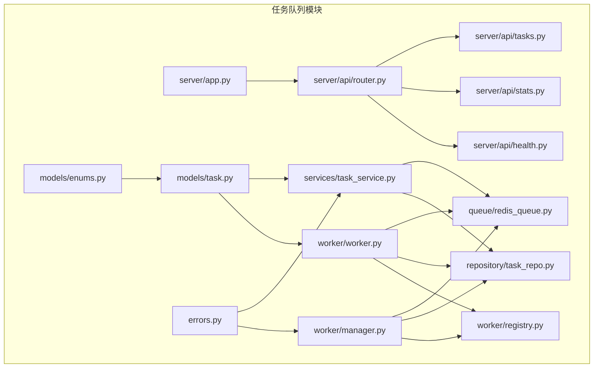
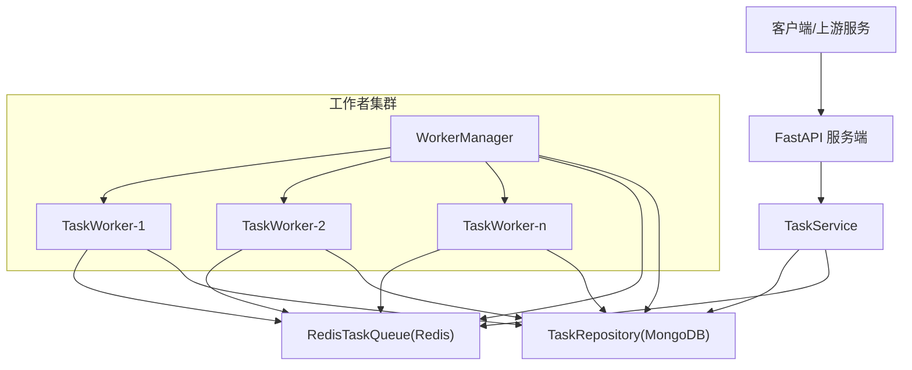
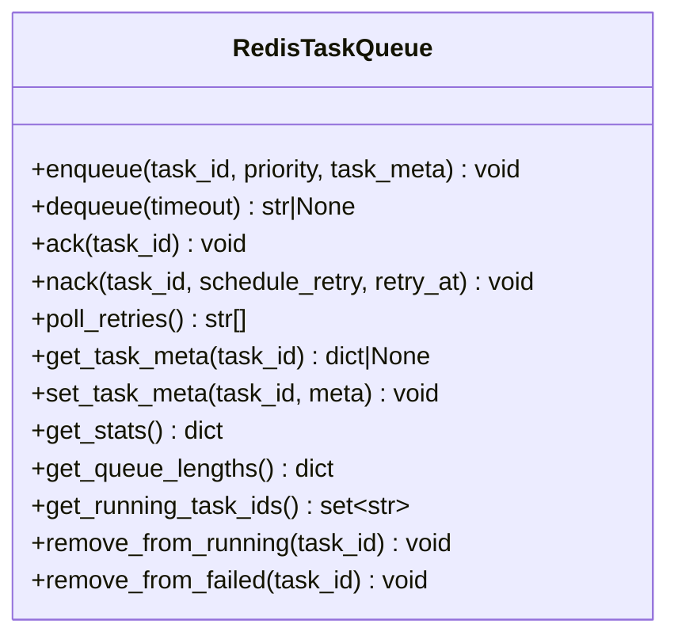
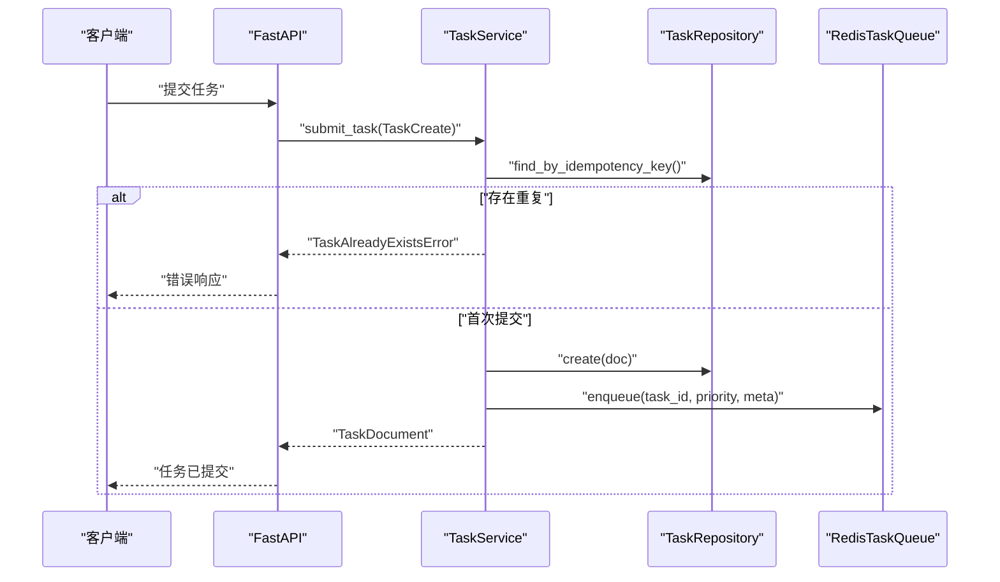
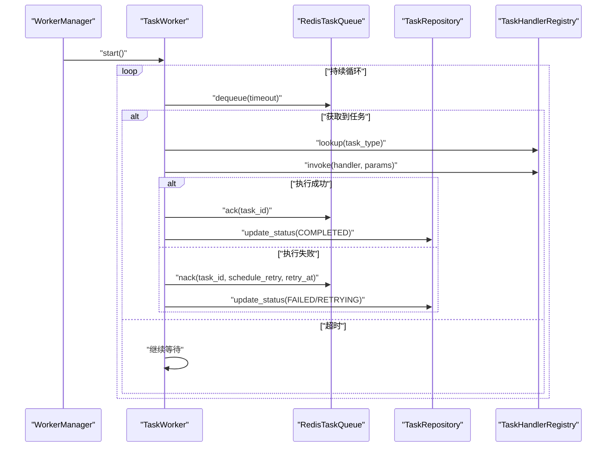
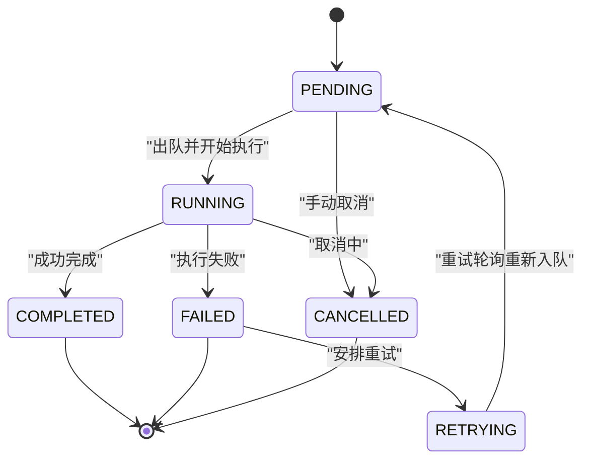
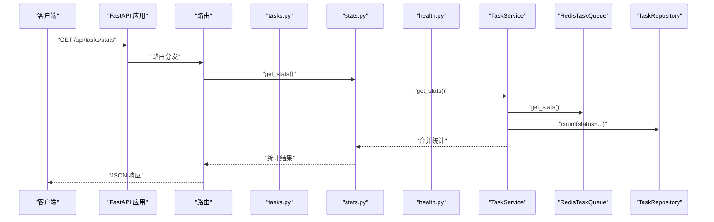
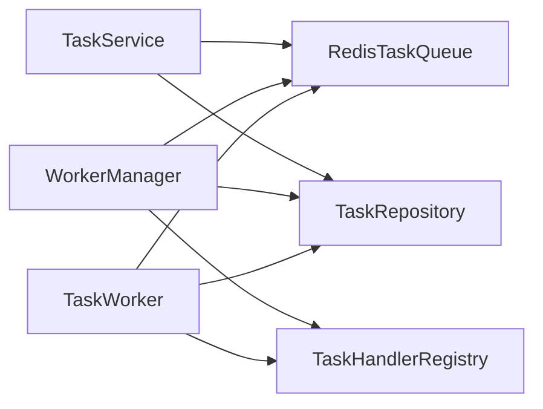

# 任务队列系统

<cite>
**本文引用的文件**
- [src/taolib/testing/task_queue/__init__.py](file://src/taolib/testing/task_queue/__init__.py)
- [src/taolib/testing/task_queue/queue/redis_queue.py](file://src/taolib/testing/task_queue/queue/redis_queue.py)
- [src/taolib/testing/task_queue/models/task.py](file://src/taolib/testing/task_queue/models/task.py)
- [src/taolib/testing/task_queue/services/task_service.py](file://src/taolib/testing/task_queue/services/task_service.py)
- [src/taolib/testing/task_queue/worker/manager.py](file://src/taolib/testing/task_queue/worker/manager.py)
- [src/taolib/testing/task_queue/worker/registry.py](file://src/taolib/testing/task_queue/worker/registry.py)
- [src/taolib/testing/task_queue/worker/worker.py](file://src/taolib/testing/task_queue/worker/worker.py)
- [src/taolib/testing/task_queue/repository/task_repo.py](file://src/taolib/testing/task_queue/repository/task_repo.py)
- [src/taolib/testing/task_queue/server/app.py](file://src/taolib/testing/task_queue/server/app.py)
- [src/taolib/testing/task_queue/server/main.py](file://src/taolib/testing/task_queue/server/main.py)
- [src/taolib/testing/task_queue/server/api/router.py](file://src/taolib/testing/task_queue/server/api/router.py)
- [src/taolib/testing/task_queue/server/api/tasks.py](file://src/taolib/testing/task_queue/server/api/tasks.py)
- [src/taolib/testing/task_queue/server/api/stats.py](file://src/taolib/testing/task_queue/server/api/stats.py)
- [src/taolib/testing/task_queue/server/api/health.py](file://src/taolib/testing/task_queue/server/api/health.py)
- [src/taolib/testing/task_queue/models/enums.py](file://src/taolib/testing/task_queue/models/enums.py)
- [src/taolib/testing/task_queue/errors.py](file://src/taolib/testing/task_queue/errors.py)
- [tests/testing/test_task_queue/test_manager.py](file://tests/testing/test_task_queue/test_manager.py)
- [tests/testing/test_task_queue/test_queue.py](file://tests/testing/test_task_queue/test_queue.py)
- [tests/testing/test_task_queue/test_service.py](file://tests/testing/test_task_queue/test_service.py)
- [tests/testing/test_task_queue/test_worker.py](file://tests/testing/test_task_queue/test_worker.py)
- [tests/testing/test_task_queue/test_registry.py](file://tests/testing/test_task_queue/test_registry.py)
- [tests/testing/test_task_queue/test_repository.py](file://tests/testing/test_task_queue/test_repository.py)
- [examples/multi_agent_example.py](file://examples/multi_agent_example.py)
</cite>

## 目录
1. [简介](#简介)
2. [项目结构](#项目结构)
3. [核心组件](#核心组件)
4. [架构总览](#架构总览)
5. [详细组件分析](#详细组件分析)
6. [依赖关系分析](#依赖关系分析)
7. [性能考虑](#性能考虑)
8. [故障排查指南](#故障排查指南)
9. [结论](#结论)
10. [附录](#附录)

## 简介
本任务队列系统基于 Redis 实现异步任务处理，具备以下能力：
- 三级优先级队列（高/普通/低）
- 失败自动重试与重试调度（Sorted Set）
- 可配置并发 Worker
- MongoDB 持久化任务记录
- Web 管理接口与统计信息
- 任务状态跟踪与幂等性控制
- 定时重试轮询与崩溃恢复
- 运行时统计与监控

该系统通过 Redis List 实现优先级队列，通过 Sorted Set 实现重试调度，并结合 MongoDB 记录任务状态与历史，形成“内存高速处理 + 持久化可靠存储”的双层架构。

## 项目结构
任务队列模块位于 src/taolib/testing/task_queue 下，采用分层组织：
- queue：Redis 队列实现
- models：任务数据模型与枚举
- services：任务服务层（业务逻辑）
- worker：工作者与管理器
- repository：MongoDB 仓库
- server：FastAPI 服务端（API/Stats/Health）
- errors：自定义异常

**图表来源**
- [src/taolib/testing/task_queue/queue/redis_queue.py:1-317](file://src/taolib/testing/task_queue/queue/redis_queue.py#L1-L317)
- [src/taolib/testing/task_queue/models/task.py:1-107](file://src/taolib/testing/task_queue/models/task.py#L1-L107)
- [src/taolib/testing/task_queue/services/task_service.py:1-259](file://src/taolib/testing/task_queue/services/task_service.py#L1-L259)
- [src/taolib/testing/task_queue/worker/manager.py:1-225](file://src/taolib/testing/task_queue/worker/manager.py#L1-L225)
- [src/taolib/testing/task_queue/worker/worker.py](file://src/taolib/testing/task_queue/worker/worker.py)
- [src/taolib/testing/task_queue/worker/registry.py](file://src/taolib/testing/task_queue/worker/registry.py)
- [src/taolib/testing/task_queue/repository/task_repo.py](file://src/taolib/testing/task_queue/repository/task_repo.py)
- [src/taolib/testing/task_queue/server/app.py](file://src/taolib/testing/task_queue/server/app.py)
- [src/taolib/testing/task_queue/server/api/router.py](file://src/taolib/testing/task_queue/server/api/router.py)
- [src/taolib/testing/task_queue/server/api/tasks.py](file://src/taolib/testing/task_queue/server/api/tasks.py)
- [src/taolib/testing/task_queue/server/api/stats.py](file://src/taolib/testing/task_queue/server/api/stats.py)
- [src/taolib/testing/task_queue/server/api/health.py](file://src/taolib/testing/task_queue/server/api/health.py)
- [src/taolib/testing/task_queue/errors.py](file://src/taolib/testing/task_queue/errors.py)

**章节来源**
- [src/taolib/testing/task_queue/__init__.py:1-76](file://src/taolib/testing/task_queue/__init__.py#L1-L76)

## 核心组件
- RedisTaskQueue：基于 Redis 的队列实现，负责入队、出队、确认/失败标记、重试轮询、统计与任务元数据缓存。
- TaskService：任务服务层，封装提交、查询、重试、取消等业务逻辑，并协调 Redis 与 MongoDB。
- WorkerManager：工作者管理器，编排多个 TaskWorker，负责重试轮询与崩溃恢复。
- TaskWorker：单个工作者协程，从 Redis 出队任务，调用注册的处理器，处理成功/失败与重试。
- TaskHandlerRegistry：任务处理器注册表，维护任务类型到处理器函数的映射。
- TaskRepository：MongoDB 仓库，提供任务的 CRUD、聚合与计数。
- Server API：FastAPI 接口，提供任务管理、统计查询与健康检查。

**章节来源**
- [src/taolib/testing/task_queue/queue/redis_queue.py:14-317](file://src/taolib/testing/task_queue/queue/redis_queue.py#L14-L317)
- [src/taolib/testing/task_queue/services/task_service.py:23-259](file://src/taolib/testing/task_queue/services/task_service.py#L23-L259)
- [src/taolib/testing/task_queue/worker/manager.py:25-225](file://src/taolib/testing/task_queue/worker/manager.py#L25-L225)
- [src/taolib/testing/task_queue/worker/worker.py](file://src/taolib/testing/task_queue/worker/worker.py)
- [src/taolib/testing/task_queue/worker/registry.py](file://src/taolib/testing/task_queue/worker/registry.py)
- [src/taolib/testing/task_queue/repository/task_repo.py](file://src/taolib/testing/task_queue/repository/task_repo.py)
- [src/taolib/testing/task_queue/server/api/router.py](file://src/taolib/testing/task_queue/server/api/router.py)

## 架构总览
系统采用“服务端 + 队列 + 工作者”三层架构：
- 服务端（FastAPI）接收任务提交与查询请求
- 队列层（Redis）负责任务调度与重试调度
- 工作者层（WorkerManager + TaskWorker）负责执行任务与状态回写

**图表来源**
- [src/taolib/testing/task_queue/services/task_service.py:23-259](file://src/taolib/testing/task_queue/services/task_service.py#L23-L259)
- [src/taolib/testing/task_queue/queue/redis_queue.py:14-317](file://src/taolib/testing/task_queue/queue/redis_queue.py#L14-L317)
- [src/taolib/testing/task_queue/worker/manager.py:25-225](file://src/taolib/testing/task_queue/worker/manager.py#L25-L225)
- [src/taolib/testing/task_queue/repository/task_repo.py](file://src/taolib/testing/task_queue/repository/task_repo.py)

## 详细组件分析

### Redis 队列实现（RedisTaskQueue）
- 数据结构设计
  - 优先级队列：三个 Redis List，分别对应高/普通/低优先级
  - 运行中集合：Redis Set 记录正在执行的任务 ID
  - 成功/失败集合：Redis List/Set 分别记录完成与失败任务 ID
  - 重试调度：Redis Sorted Set，score 为下次重试时间戳
  - 任务元数据缓存：Redis Hash，键为 task:{id}
  - 全局统计：Redis Hash，键为 stats
- 关键操作
  - 入队：原子地写入任务元数据、推入对应优先级队列、累计提交计数
  - 出队：BRPOP 顺序尝试高→普通→低，命中后加入运行中集合
  - 确认完成：从运行中集合移除，写入最近完成列表，累计完成计数，删除元数据
  - 失败标记：可选择进入重试调度或直接失败集合，累计失败/重试计数
  - 重试轮询：按当前时间从 Sorted Set 拉取到期任务，按原优先级重新入队
  - 统计查询：一次性 pipeline 查询各队列长度、运行中/失败/重试计数与累计指标
- 复杂度
  - 入队/出队/确认/失败均为 O(1) 原子操作
  - 重试轮询每次 O(k)（k 为到期任务数）

**图表来源**
- [src/taolib/testing/task_queue/queue/redis_queue.py:14-317](file://src/taolib/testing/task_queue/queue/redis_queue.py#L14-L317)

**章节来源**
- [src/taolib/testing/task_queue/queue/redis_queue.py:14-317](file://src/taolib/testing/task_queue/queue/redis_queue.py#L14-L317)

### 任务服务层（TaskService）
- 职责
  - 任务提交：幂等键检查、生成任务 ID、写入 MongoDB、入队 Redis
  - 任务查询：按 ID/条件查询任务
  - 手动重试：将失败任务重置为 PENDING 并重新入队
  - 取消任务：仅允许 PENDING/RETRYING 状态取消
  - 统计合并：汇总 Redis 实时统计与 MongoDB 持久统计
- 幂等性
  - 通过 idempotency_key 防止重复提交，冲突时抛出特定异常

**图表来源**
- [src/taolib/testing/task_queue/services/task_service.py:43-94](file://src/taolib/testing/task_queue/services/task_service.py#L43-L94)
- [src/taolib/testing/task_queue/repository/task_repo.py](file://src/taolib/testing/task_queue/repository/task_repo.py)
- [src/taolib/testing/task_queue/queue/redis_queue.py:58-80](file://src/taolib/testing/task_queue/queue/redis_queue.py#L58-L80)

**章节来源**
- [src/taolib/testing/task_queue/services/task_service.py:23-259](file://src/taolib/testing/task_queue/services/task_service.py#L23-L259)

### 工作者管理器（WorkerManager）与工作者（TaskWorker）
- WorkerManager
  - 启动：崩溃恢复（扫描运行中且超时任务）、创建多个 TaskWorker 协程、启动重试轮询
  - 停止：通知工作者停止、等待协程结束、停止重试轮询、清理资源
  - 重试轮询：每 RETRY_POLL_INTERVAL 检查到期重试任务，重新入队并更新 MongoDB 状态
  - 崩溃恢复：对长时间 RUNNING 的任务进行重新入队，避免僵尸任务
- TaskWorker
  - 从 Redis 出队任务，根据任务类型在注册表中查找处理器
  - 执行处理器，成功则 ack，失败则根据重试策略决定是否进入重试调度
  - 支持优雅停止与上下文管理

**图表来源**
- [src/taolib/testing/task_queue/worker/manager.py:73-168](file://src/taolib/testing/task_queue/worker/manager.py#L73-L168)
- [src/taolib/testing/task_queue/worker/worker.py](file://src/taolib/testing/task_queue/worker/worker.py)
- [src/taolib/testing/task_queue/queue/redis_queue.py:81-157](file://src/taolib/testing/task_queue/queue/redis_queue.py#L81-L157)
- [src/taolib/testing/task_queue/worker/registry.py](file://src/taolib/testing/task_queue/worker/registry.py)

**章节来源**
- [src/taolib/testing/task_queue/worker/manager.py:25-225](file://src/taolib/testing/task_queue/worker/manager.py#L25-L225)
- [src/taolib/testing/task_queue/worker/worker.py](file://src/taolib/testing/task_queue/worker/worker.py)

### 任务数据模型与状态管理
- 模型层次
  - TaskBase：基础字段（类型、参数、优先级、重试策略、幂等键、标签）
  - TaskCreate：创建输入
  - TaskUpdate：更新输入（状态、重试次数、结果、错误信息、时间戳等）
  - TaskResponse：API 响应模型
  - TaskDocument：MongoDB 文档模型，包含状态与时间戳
- 状态流转
  - PENDING → RUNNING → COMPLETED/FAILED
  - FAILED → RETRYING（按策略延时重试）
  - CANCELLED（仅 PENDING/RETRYING 可取消）

**图表来源**
- [src/taolib/testing/task_queue/models/enums.py](file://src/taolib/testing/task_queue/models/enums.py)
- [src/taolib/testing/task_queue/models/task.py:68-107](file://src/taolib/testing/task_queue/models/task.py#L68-L107)

**章节来源**
- [src/taolib/testing/task_queue/models/task.py:1-107](file://src/taolib/testing/task_queue/models/task.py#L1-L107)
- [src/taolib/testing/task_queue/models/enums.py](file://src/taolib/testing/task_queue/models/enums.py)

### 服务端 API 与监控
- 路由与接口
  - 任务管理：提交、查询、重试、取消
  - 统计接口：队列长度、运行中/失败/重试计数、累计指标
  - 健康检查：服务可用性
- 监控与统计
  - Redis 实时统计：队列长度、运行中/失败/重试计数、累计提交/完成/失败/重试
  - MongoDB 持久统计：各状态任务总数
  - 服务端聚合：合并 Redis 与 MongoDB 统计，统一对外输出

**图表来源**
- [src/taolib/testing/task_queue/server/api/router.py](file://src/taolib/testing/task_queue/server/api/router.py)
- [src/taolib/testing/task_queue/server/api/tasks.py](file://src/taolib/testing/task_queue/server/api/tasks.py)
- [src/taolib/testing/task_queue/server/api/stats.py](file://src/taolib/testing/task_queue/server/api/stats.py)
- [src/taolib/testing/task_queue/server/api/health.py](file://src/taolib/testing/task_queue/server/api/health.py)
- [src/taolib/testing/task_queue/services/task_service.py:220-256](file://src/taolib/testing/task_queue/services/task_service.py#L220-L256)
- [src/taolib/testing/task_queue/queue/redis_queue.py:226-289](file://src/taolib/testing/task_queue/queue/redis_queue.py#L226-L289)
- [src/taolib/testing/task_queue/repository/task_repo.py](file://src/taolib/testing/task_queue/repository/task_repo.py)

**章节来源**
- [src/taolib/testing/task_queue/server/api/router.py](file://src/taolib/testing/task_queue/server/api/router.py)
- [src/taolib/testing/task_queue/server/api/tasks.py](file://src/taolib/testing/task_queue/server/api/tasks.py)
- [src/taolib/testing/task_queue/server/api/stats.py](file://src/taolib/testing/task_queue/server/api/stats.py)
- [src/taolib/testing/task_queue/server/api/health.py](file://src/taolib/testing/task_queue/server/api/health.py)
- [src/taolib/testing/task_queue/services/task_service.py:220-256](file://src/taolib/testing/task_queue/services/task_service.py#L220-L256)

## 依赖关系分析
- 组件耦合
  - TaskService 同时依赖 Redis 与 MongoDB，承担业务协调职责
  - WorkerManager 依赖 Redis、MongoDB 与注册表，负责运行时编排
  - RedisTaskQueue 为纯数据访问层，不依赖上层业务
- 外部依赖
  - Redis（异步客户端）：队列与缓存
  - MongoDB：持久化任务状态与历史
  - FastAPI：服务端接口
- 循环依赖
  - 未发现循环导入；模块间通过接口解耦

**图表来源**
- [src/taolib/testing/task_queue/services/task_service.py:23-42](file://src/taolib/testing/task_queue/services/task_service.py#L23-L42)
- [src/taolib/testing/task_queue/worker/manager.py:34-56](file://src/taolib/testing/task_queue/worker/manager.py#L34-L56)
- [src/taolib/testing/task_queue/worker/worker.py](file://src/taolib/testing/task_queue/worker/worker.py)

**章节来源**
- [src/taolib/testing/task_queue/services/task_service.py:23-42](file://src/taolib/testing/task_queue/services/task_service.py#L23-L42)
- [src/taolib/testing/task_queue/worker/manager.py:34-56](file://src/taolib/testing/task_queue/worker/manager.py#L34-L56)

## 性能考虑
- Redis 数据结构选择
  - 队列使用 List，优先级顺序通过 BRPOP 顺序尝试保证
  - 重试使用 Sorted Set，按到期时间高效拉取
  - 运行中/失败使用 Set，便于快速去重与清理
- 原子性与一致性
  - 入队/确认/失败均使用 pipeline，减少往返开销并保证原子性
- 并发与负载均衡
  - 多 Worker 并发执行，任务类型通过注册表分发，天然具备负载均衡效果
- 统计与监控
  - Redis 实时统计降低数据库压力，适合高频查询
  - 服务端聚合统计，避免客户端多次请求

[本节为通用性能建议，无需具体文件引用]

## 故障排查指南
- 常见问题与定位
  - 任务卡在 RUNNING：检查 Worker 是否崩溃或阻塞；启用崩溃恢复；查看运行中集合与任务文档 started_at
  - 重试无效：确认重试轮询是否运行；检查 Redis 中 retry Sorted Set 是否有到期任务
  - 重复提交：幂等键冲突会触发特定异常；检查 idempotency_key 设置
  - API 返回错误：核对 TaskNotFoundError/TaskAlreadyExistsError 等异常类型
- 日志与告警
  - WorkerManager/Worker 在启动/停止/重试轮询/崩溃恢复时输出日志
  - 服务端接口记录提交/查询/重试/取消等关键操作
- 修复步骤
  - 对超时 RUNNING 任务执行重试轮询或手动恢复
  - 清理孤儿任务（Redis 中存在但 MongoDB 不存在的任务）
  - 检查 Redis/MongoDB 连接与权限

**章节来源**
- [src/taolib/testing/task_queue/worker/manager.py:138-222](file://src/taolib/testing/task_queue/worker/manager.py#L138-L222)
- [src/taolib/testing/task_queue/queue/redis_queue.py:158-194](file://src/taolib/testing/task_queue/queue/redis_queue.py#L158-L194)
- [src/taolib/testing/task_queue/errors.py](file://src/taolib/testing/task_queue/errors.py)

## 结论
该任务队列系统以 Redis 为核心实现高性能的异步任务处理，结合 MongoDB 提供可靠的持久化与审计能力。通过 WorkerManager 的编排与崩溃恢复机制，系统具备良好的稳定性与可维护性。配合服务端 API 与统计接口，能够满足生产环境的监控与运维需求。

[本节为总结性内容，无需具体文件引用]

## 附录

### API 参考（概要）
- 任务管理
  - 提交任务：POST /api/tasks
  - 查询任务：GET /api/tasks/{id}
  - 重试任务：POST /api/tasks/{id}/retry
  - 取消任务：POST /api/tasks/{id}/cancel
- 统计与监控
  - 获取统计：GET /api/tasks/stats
- 健康检查
  - 健康状态：GET /api/health

**章节来源**
- [src/taolib/testing/task_queue/server/api/tasks.py](file://src/taolib/testing/task_queue/server/api/tasks.py)
- [src/taolib/testing/task_queue/server/api/stats.py](file://src/taolib/testing/task_queue/server/api/stats.py)
- [src/taolib/testing/task_queue/server/api/health.py](file://src/taolib/testing/task_queue/server/api/health.py)

### 配置示例（要点）
- Redis 连接：提供异步 Redis 客户端实例
- MongoDB 连接：提供连接字符串与数据库名
- Worker 数量：通过 WorkerManager 构造函数配置
- 重试策略：在任务模型中配置最大重试次数与递增延迟
- 健康检查：通过 /api/health 接口验证服务可用性

**章节来源**
- [src/taolib/testing/task_queue/worker/manager.py:34-56](file://src/taolib/testing/task_queue/worker/manager.py#L34-L56)
- [src/taolib/testing/task_queue/models/task.py:15-30](file://src/taolib/testing/task_queue/models/task.py#L15-L30)

### 运维指南（要点）
- 监控指标
  - 队列长度（高/普通/低）
  - 运行中/失败/重试任务数
  - 累计提交/完成/失败/重试数
- 告警阈值
  - 队列堆积阈值
  - 失败率阈值
  - 重试任务占比阈值
- 故障恢复
  - 启动时自动崩溃恢复
  - 定期重试轮询
  - 手动重试与取消

**章节来源**
- [src/taolib/testing/task_queue/services/task_service.py:220-256](file://src/taolib/testing/task_queue/services/task_service.py#L220-L256)
- [src/taolib/testing/task_queue/worker/manager.py:138-222](file://src/taolib/testing/task_queue/worker/manager.py#L138-L222)

### 示例与最佳实践
- 任务处理器注册
  - 使用装饰器注册任务处理器，按任务类型分发执行
- 多进程/多实例
  - 多个 WorkerManager 实例共享同一 Redis/MongoDB，天然实现水平扩展
- 序列化与反序列化
  - 任务参数使用字典结构，确保可被 JSON 序列化
- 错误处理
  - 捕获并记录异常，必要时进入重试调度
- 定时任务与批处理
  - 定时任务可通过周期性提交任务实现
  - 批处理作业可拆分为多个小任务，利用优先级与并发提升吞吐

**章节来源**
- [src/taolib/testing/task_queue/worker/registry.py](file://src/taolib/testing/task_queue/worker/registry.py)
- [src/taolib/testing/task_queue/models/task.py:15-30](file://src/taolib/testing/task_queue/models/task.py#L15-L30)
- [examples/multi_agent_example.py](file://examples/multi_agent_example.py)