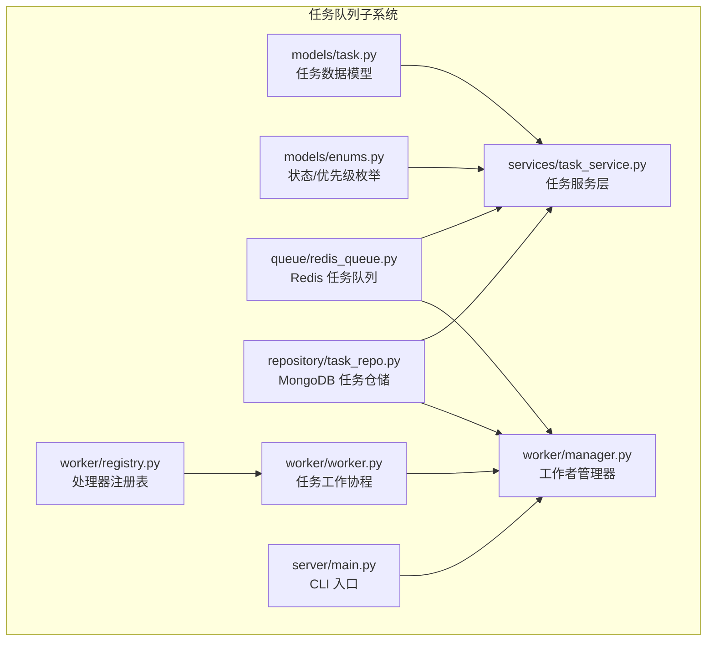
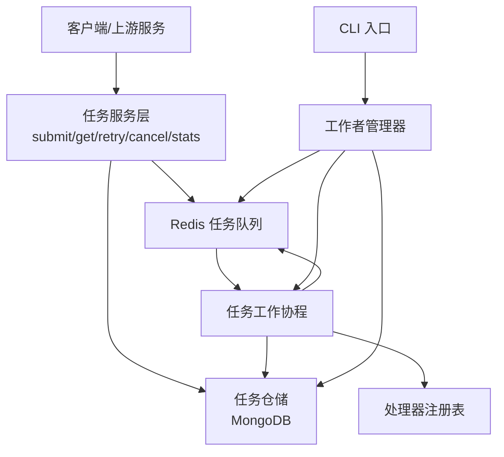
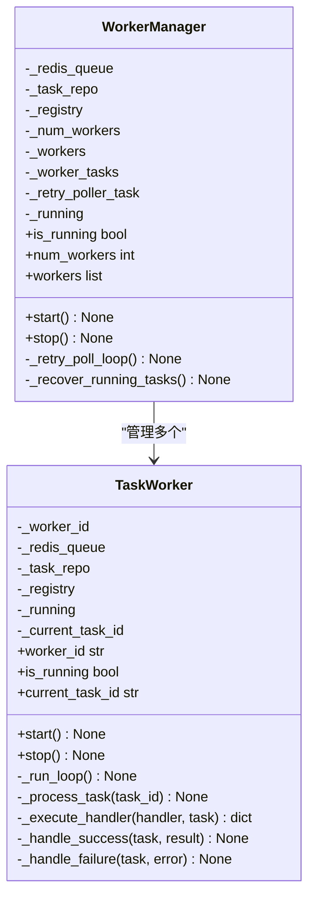
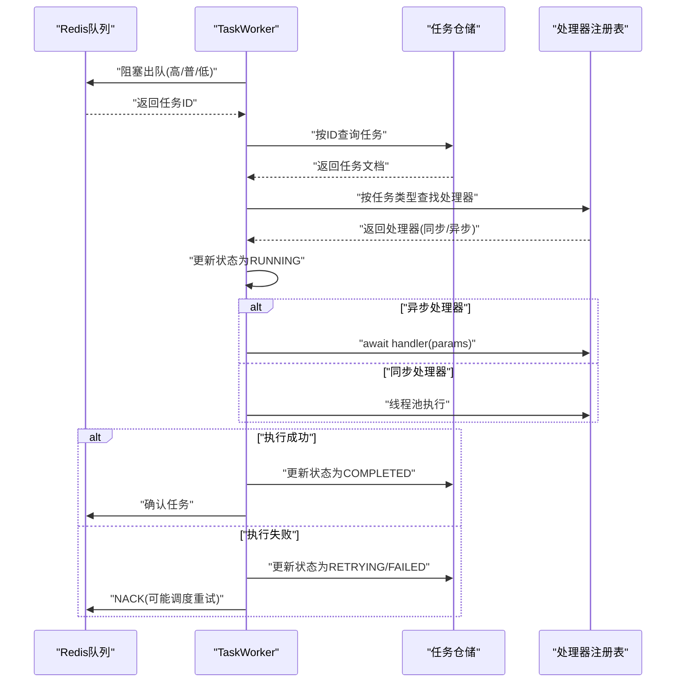
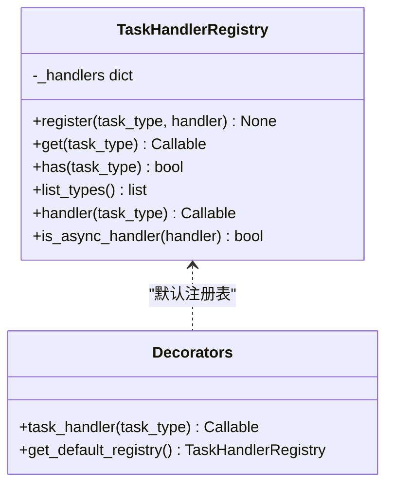
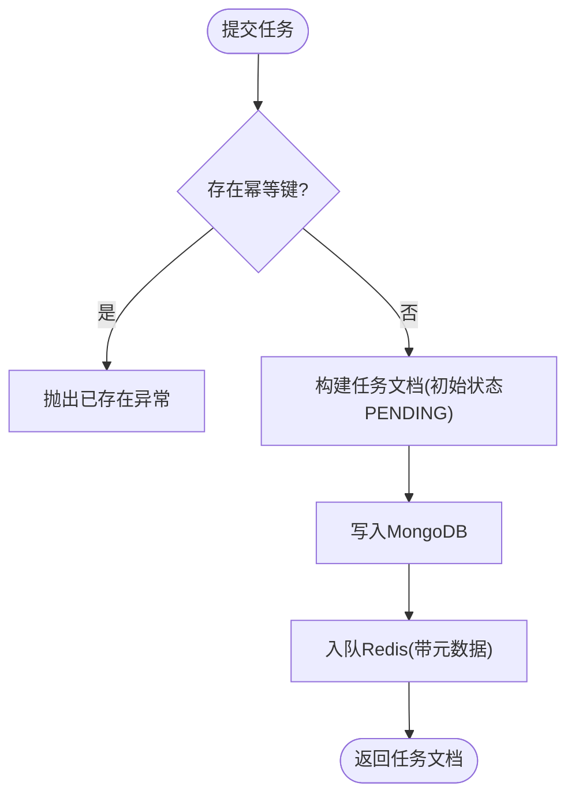
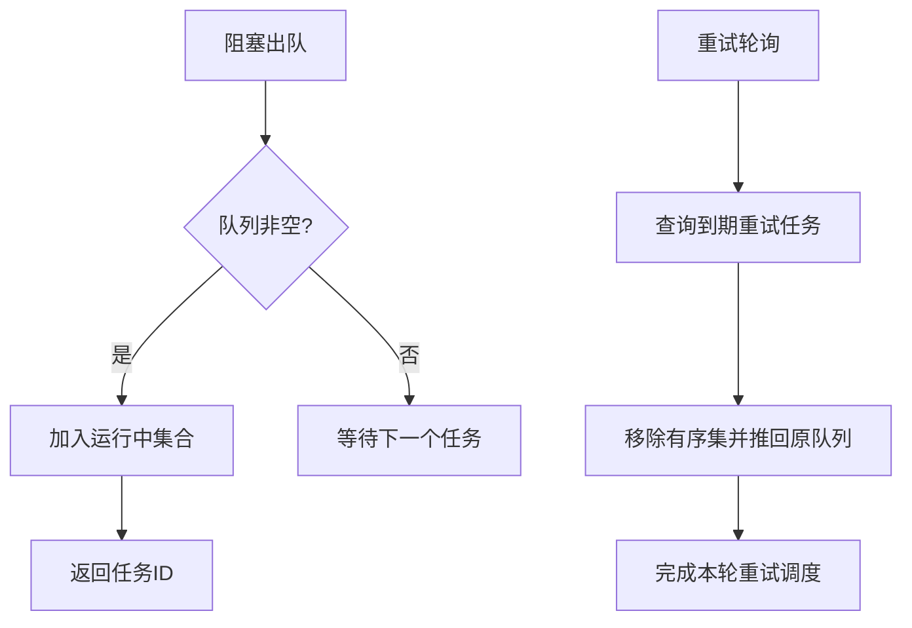
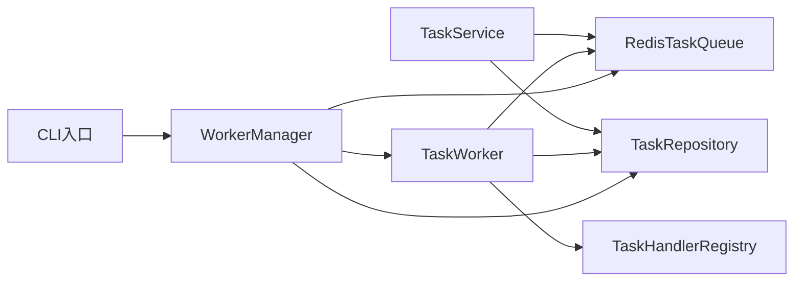

# 工作进程管理

<cite>
**本文引用的文件**
- [src/taolib/testing/task_queue/worker/manager.py](file://src/taolib/testing/task_queue/worker/manager.py)
- [src/taolib/testing/task_queue/worker/registry.py](file://src/taolib/testing/task_queue/worker/registry.py)
- [src/taolib/testing/task_queue/worker/worker.py](file://src/taolib/testing/task_queue/worker/worker.py)
- [src/taolib/testing/task_queue/services/task_service.py](file://src/taolib/testing/task_queue/services/task_service.py)
- [src/taolib/testing/task_queue/models/task.py](file://src/taolib/testing/task_queue/models/task.py)
- [src/taolib/testing/task_queue/queue/redis_queue.py](file://src/taolib/testing/task_queue/queue/redis_queue.py)
- [src/taolib/testing/task_queue/repository/task_repo.py](file://src/taolib/testing/task_queue/repository/task_repo.py)
- [src/taolib/testing/task_queue/models/enums.py](file://src/taolib/testing/task_queue/models/enums.py)
- [src/taolib/testing/task_queue/server/main.py](file://src/taolib/testing/task_queue/server/main.py)
- [examples/multi_agent_example.py](file://examples/multi_agent_example.py)
</cite>

## 目录
1. [简介](#简介)
2. [项目结构](#项目结构)
3. [核心组件](#核心组件)
4. [架构总览](#架构总览)
5. [详细组件分析](#详细组件分析)
6. [依赖分析](#依赖分析)
7. [性能考量](#性能考量)
8. [故障排查指南](#故障排查指南)
9. [结论](#结论)
10. [附录](#附录)

## 简介
本技术文档围绕“工作进程管理系统”展开，系统采用多进程/多协程并行执行模型，结合 Redis 优先级队列与 MongoDB 持久化，实现任务的提交、分发、执行、重试与状态追踪。文档重点覆盖以下方面：
- 多进程/协程任务执行架构：进程池管理、生命周期控制与资源分配
- 工作进程注册机制：任务处理器注册、动态加载与卸载
- 工作进程间通信协议：消息传递、状态同步与心跳检测
- 负载均衡策略：任务分发算法、进程忙闲检测与动态调整
- 配置选项：并发数量、内存限制与 CPU 亲和性
- 监控指标：处理速度、错误率与资源消耗
- 故障恢复机制：进程崩溃检测、自动重启与任务重新分配
- 调试技巧与性能优化建议

## 项目结构
该仓库为多模块工程，工作进程管理能力集中在“任务队列”子系统中，同时包含多智能体示例以展示上层应用集成方式。

图表来源
- [src/taolib/testing/task_queue/models/task.py:1-107](file://src/taolib/testing/task_queue/models/task.py#L1-L107)
- [src/taolib/testing/task_queue/models/enums.py:1-28](file://src/taolib/testing/task_queue/models/enums.py#L1-L28)
- [src/taolib/testing/task_queue/queue/redis_queue.py:1-317](file://src/taolib/testing/task_queue/queue/redis_queue.py#L1-L317)
- [src/taolib/testing/task_queue/repository/task_repo.py:1-169](file://src/taolib/testing/task_queue/repository/task_repo.py#L1-L169)
- [src/taolib/testing/task_queue/services/task_service.py:1-259](file://src/taolib/testing/task_queue/services/task_service.py#L1-L259)
- [src/taolib/testing/task_queue/worker/registry.py:1-136](file://src/taolib/testing/task_queue/worker/registry.py#L1-L136)
- [src/taolib/testing/task_queue/worker/worker.py:1-275](file://src/taolib/testing/task_queue/worker/worker.py#L1-L275)
- [src/taolib/testing/task_queue/worker/manager.py:1-225](file://src/taolib/testing/task_queue/worker/manager.py#L1-L225)
- [src/taolib/testing/task_queue/server/main.py:1-48](file://src/taolib/testing/task_queue/server/main.py#L1-L48)

章节来源
- [src/taolib/testing/task_queue/worker/manager.py:1-225](file://src/taolib/testing/task_queue/worker/manager.py#L1-L225)
- [src/taolib/testing/task_queue/worker/registry.py:1-136](file://src/taolib/testing/task_queue/worker/registry.py#L1-L136)
- [src/taolib/testing/task_queue/worker/worker.py:1-275](file://src/taolib/testing/task_queue/worker/worker.py#L1-L275)
- [src/taolib/testing/task_queue/services/task_service.py:1-259](file://src/taolib/testing/task_queue/services/task_service.py#L1-L259)
- [src/taolib/testing/task_queue/models/task.py:1-107](file://src/taolib/testing/task_queue/models/task.py#L1-L107)
- [src/taolib/testing/task_queue/queue/redis_queue.py:1-317](file://src/taolib/testing/task_queue/queue/redis_queue.py#L1-L317)
- [src/taolib/testing/task_queue/repository/task_repo.py:1-169](file://src/taolib/testing/task_queue/repository/task_repo.py#L1-L169)
- [src/taolib/testing/task_queue/models/enums.py:1-28](file://src/taolib/testing/task_queue/models/enums.py#L1-L28)
- [src/taolib/testing/task_queue/server/main.py:1-48](file://src/taolib/testing/task_queue/server/main.py#L1-L48)

## 核心组件
- 任务模型与枚举：定义任务字段、状态机与优先级，支撑服务层与工作协程的状态流转。
- Redis 任务队列：提供高/普/低三优先级队列、运行中集合、失败集合、重试有序集与任务元数据缓存。
- MongoDB 任务仓储：提供任务持久化、索引与状态更新能力。
- 任务服务层：封装提交、查询、重试、取消与统计等业务逻辑。
- 处理器注册表：提供装饰器式注册与查找，支持同步/异步处理器。
- 任务工作协程：负责从队列拉取任务、调用处理器、处理成功/失败与重试。
- 工作者管理器：编排多个工作协程、启动/停止、重试轮询与崩溃恢复。

章节来源
- [src/taolib/testing/task_queue/models/task.py:1-107](file://src/taolib/testing/task_queue/models/task.py#L1-L107)
- [src/taolib/testing/task_queue/models/enums.py:1-28](file://src/taolib/testing/task_queue/models/enums.py#L1-L28)
- [src/taolib/testing/task_queue/queue/redis_queue.py:1-317](file://src/taolib/testing/task_queue/queue/redis_queue.py#L1-L317)
- [src/taolib/testing/task_queue/repository/task_repo.py:1-169](file://src/taolib/testing/task_queue/repository/task_repo.py#L1-L169)
- [src/taolib/testing/task_queue/services/task_service.py:1-259](file://src/taolib/testing/task_queue/services/task_service.py#L1-L259)
- [src/taolib/testing/task_queue/worker/registry.py:1-136](file://src/taolib/testing/task_queue/worker/registry.py#L1-L136)
- [src/taolib/testing/task_queue/worker/worker.py:1-275](file://src/taolib/testing/task_queue/worker/worker.py#L1-L275)
- [src/taolib/testing/task_queue/worker/manager.py:1-225](file://src/taolib/testing/task_queue/worker/manager.py#L1-L225)

## 架构总览
系统采用“服务层-队列-仓储-工作协程-注册表”的分层设计，通过 Redis 实现高性能的任务分发与重试调度，通过 MongoDB 实现任务状态的持久化与统计。

图表来源
- [src/taolib/testing/task_queue/services/task_service.py:23-259](file://src/taolib/testing/task_queue/services/task_service.py#L23-L259)
- [src/taolib/testing/task_queue/queue/redis_queue.py:14-317](file://src/taolib/testing/task_queue/queue/redis_queue.py#L14-L317)
- [src/taolib/testing/task_queue/repository/task_repo.py:15-169](file://src/taolib/testing/task_queue/repository/task_repo.py#L15-L169)
- [src/taolib/testing/task_queue/worker/worker.py:21-275](file://src/taolib/testing/task_queue/worker/worker.py#L21-L275)
- [src/taolib/testing/task_queue/worker/registry.py:11-136](file://src/taolib/testing/task_queue/worker/registry.py#L11-L136)
- [src/taolib/testing/task_queue/worker/manager.py:25-225](file://src/taolib/testing/task_queue/worker/manager.py#L25-L225)
- [src/taolib/testing/task_queue/server/main.py:14-48](file://src/taolib/testing/task_queue/server/main.py#L14-L48)

## 详细组件分析

### 工作者管理器（WorkerManager）
- 职责：编排多个 TaskWorker 协程，负责启动/停止、重试轮询与崩溃恢复。
- 生命周期：支持优雅停止，等待所有协程完成当前任务；重试轮询周期固定，崩溃恢复扫描运行中任务并处理超时任务。
- 并发控制：通过构造函数传入工作者数量，创建对应数量的 TaskWorker 实例与 asyncio.Task。

图表来源
- [src/taolib/testing/task_queue/worker/manager.py:25-225](file://src/taolib/testing/task_queue/worker/manager.py#L25-L225)
- [src/taolib/testing/task_queue/worker/worker.py:21-275](file://src/taolib/testing/task_queue/worker/worker.py#L21-L275)

章节来源
- [src/taolib/testing/task_queue/worker/manager.py:25-225](file://src/taolib/testing/task_queue/worker/manager.py#L25-L225)

### 任务工作协程（TaskWorker）
- 职责：从 Redis 队列阻塞拉取任务，查找处理器并执行，处理成功/失败与重试。
- 处理器执行：支持同步与异步处理器，异步处理器直接 await，同步处理器通过线程池执行。
- 成功/失败处理：成功更新状态为已完成并确认；失败根据最大重试次数决定是否调度重试或最终失败。
- 忙闲检测：通过队列阻塞与运行中集合实现自然的忙闲感知。

图表来源
- [src/taolib/testing/task_queue/worker/worker.py:65-275](file://src/taolib/testing/task_queue/worker/worker.py#L65-L275)
- [src/taolib/testing/task_queue/queue/redis_queue.py:81-157](file://src/taolib/testing/task_queue/queue/redis_queue.py#L81-L157)
- [src/taolib/testing/task_queue/repository/task_repo.py:92-109](file://src/taolib/testing/task_queue/repository/task_repo.py#L92-L109)
- [src/taolib/testing/task_queue/worker/registry.py:30-88](file://src/taolib/testing/task_queue/worker/registry.py#L30-L88)

章节来源
- [src/taolib/testing/task_queue/worker/worker.py:65-275](file://src/taolib/testing/task_queue/worker/worker.py#L65-L275)

### 处理器注册表（TaskHandlerRegistry）
- 职责：维护 task_type → handler 映射，提供注册、查找、装饰器注册与异步判定。
- 动态加载/卸载：可通过注册接口动态注册处理器；未提供内置卸载接口，可通过扩展实现。
- 使用方式：支持模块级默认注册表与自定义注册表实例。

图表来源
- [src/taolib/testing/task_queue/worker/registry.py:11-136](file://src/taolib/testing/task_queue/worker/registry.py#L11-L136)

章节来源
- [src/taolib/testing/task_queue/worker/registry.py:11-136](file://src/taolib/testing/task_queue/worker/registry.py#L11-L136)

### 任务服务层（TaskService）
- 职责：封装任务提交、查询、重试、取消与统计等业务逻辑。
- 幂等性：通过 idempotency_key 防止重复提交。
- 统计聚合：合并 Redis 实时统计与 MongoDB 持久统计，提供队列长度与累计计数。

图表来源
- [src/taolib/testing/task_queue/services/task_service.py:43-94](file://src/taolib/testing/task_queue/services/task_service.py#L43-L94)

章节来源
- [src/taolib/testing/task_queue/services/task_service.py:23-259](file://src/taolib/testing/task_queue/services/task_service.py#L23-L259)

### Redis 任务队列（RedisTaskQueue）
- 数据结构：高/普/低优先级队列、运行中集合、失败集合、重试有序集、任务元数据哈希、全局统计哈希。
- 出队策略：BRPOP 按优先级顺序消费，先高后普再低。
- 重试调度：基于有序集的到期时间进行轮询重放回队列。
- 统计：提供队列长度、运行中、失败、完成、重试等统计。

图表来源
- [src/taolib/testing/task_queue/queue/redis_queue.py:81-103](file://src/taolib/testing/task_queue/queue/redis_queue.py#L81-L103)
- [src/taolib/testing/task_queue/queue/redis_queue.py:158-194](file://src/taolib/testing/task_queue/queue/redis_queue.py#L158-L194)

章节来源
- [src/taolib/testing/task_queue/queue/redis_queue.py:14-317](file://src/taolib/testing/task_queue/queue/redis_queue.py#L14-L317)

### 任务仓储（TaskRepository）
- 职责：提供任务的 CRUD、按状态/类型/幂等键查询与索引管理。
- 索引：按任务类型、(状态,优先级)复合索引与幂等键唯一稀疏索引，以及30天TTL。

章节来源
- [src/taolib/testing/task_queue/repository/task_repo.py:15-169](file://src/taolib/testing/task_queue/repository/task_repo.py#L15-L169)

### 任务模型与枚举（Task/Enums）
- 模型：定义任务的创建、响应、文档与更新模型，包含状态、优先级、重试策略与幂等键。
- 枚举：任务状态与优先级，确保一致性与可读性。

章节来源
- [src/taolib/testing/task_queue/models/task.py:15-107](file://src/taolib/testing/task_queue/models/task.py#L15-L107)
- [src/taolib/testing/task_queue/models/enums.py:9-28](file://src/taolib/testing/task_queue/models/enums.py#L9-L28)

### CLI 入口（server/main.py）
- 职责：提供命令行入口，解析主机、端口、日志级别与自动重载参数，启动 Uvicorn 应用。
- 适用场景：配合工作者管理器与任务服务层提供 HTTP 接口或作为守护进程启动。

章节来源
- [src/taolib/testing/task_queue/server/main.py:14-48](file://src/taolib/testing/task_queue/server/main.py#L14-L48)

### 多智能体示例（examples/multi_agent_example.py）
- 展示了智能体与技能的注册、执行与主智能体生命周期管理，体现上层应用如何与工作进程管理协同。

章节来源
- [examples/multi_agent_example.py:1-196](file://examples/multi_agent_example.py#L1-L196)

## 依赖分析
- 组件耦合：WorkerManager 依赖 Redis 队列与任务仓储，TaskWorker 依赖注册表与队列；TaskService 同时依赖队列与仓储。
- 外部依赖：Redis（异步客户端）、MongoDB（Motor 异步驱动）、Uvicorn（HTTP 服务器）。
- 循环依赖：未发现循环导入；模块间通过接口契约解耦。

图表来源
- [src/taolib/testing/task_queue/services/task_service.py:29-42](file://src/taolib/testing/task_queue/services/task_service.py#L29-L42)
- [src/taolib/testing/task_queue/worker/worker.py:28-47](file://src/taolib/testing/task_queue/worker/worker.py#L28-L47)
- [src/taolib/testing/task_queue/worker/manager.py:34-52](file://src/taolib/testing/task_queue/worker/manager.py#L34-L52)
- [src/taolib/testing/task_queue/server/main.py:33-41](file://src/taolib/testing/task_queue/server/main.py#L33-L41)

章节来源
- [src/taolib/testing/task_queue/services/task_service.py:23-259](file://src/taolib/testing/task_queue/services/task_service.py#L23-L259)
- [src/taolib/testing/task_queue/worker/worker.py:21-275](file://src/taolib/testing/task_queue/worker/worker.py#L21-L275)
- [src/taolib/testing/task_queue/worker/manager.py:25-225](file://src/taolib/testing/task_queue/worker/manager.py#L25-L225)
- [src/taolib/testing/task_queue/server/main.py:14-48](file://src/taolib/testing/task_queue/server/main.py#L14-L48)

## 性能考量
- 队列与阻塞：使用 Redis BRPOP 按优先级顺序消费，降低空转开销，提升吞吐。
- 线程池与异步：同步处理器通过线程池执行，避免阻塞事件循环；异步处理器直接 await，减少上下文切换。
- 统计与缓存：Redis 保存任务元数据与统计，减少数据库压力；MongoDB 用于持久化与复杂查询。
- 索引优化：按任务类型与(状态,优先级)建立索引，加速查询与排序。
- TTL 策略：任务文档 30 天 TTL，降低存储膨胀。

## 故障排查指南
- 任务卡死/长时间运行：检查运行中集合与任务仓储中的 started_at，结合崩溃恢复逻辑定位超时任务。
- 处理器缺失：确认处理器是否已通过注册表注册，或使用装饰器注册。
- 重试风暴：核对重试延迟数组与最大重试次数，避免指数级退避导致的队列积压。
- 统计不一致：对比 Redis 实时统计与 MongoDB 计数，排查 ACK/NACK 流程。
- 日志与异常：关注工作者与管理器的日志输出，定位具体异常堆栈。

章节来源
- [src/taolib/testing/task_queue/worker/manager.py:169-222](file://src/taolib/testing/task_queue/worker/manager.py#L169-L222)
- [src/taolib/testing/task_queue/worker/worker.py:129-153](file://src/taolib/testing/task_queue/worker/worker.py#L129-L153)
- [src/taolib/testing/task_queue/queue/redis_queue.py:105-157](file://src/taolib/testing/task_queue/queue/redis_queue.py#L105-L157)

## 结论
该工作进程管理系统以 Redis 与 MongoDB 为核心，实现了高吞吐、可扩展的任务执行与状态管理。通过注册表与工作协程的解耦设计，系统具备良好的可维护性与可扩展性；通过崩溃恢复与重试轮询，保障了任务的可靠性。建议在生产环境中结合监控指标与容量规划，持续优化队列长度、处理器性能与资源配额。

## 附录
- 配置项建议
  - 并发数量：根据 CPU 核心数与任务类型（IO密集/计算密集）设定工作者数量。
  - 内存限制：为进程设置内存上限，避免 OOM；对长耗时任务考虑分片与超时控制。
  - CPU 亲和性：在容器/进程层面绑定 CPU 核心，减少上下文切换。
- 监控指标
  - 处理速度：单位时间内完成任务数（total_completed）。
  - 错误率：失败任务占比（total_failed/total_submitted）。
  - 资源消耗：队列长度、运行中任务数、重试任务数与平均处理时延。
- 调试技巧
  - 开启详细日志，定位队列入队/出队与 ACK/NACK 节点。
  - 使用幂等键避免重复提交，便于重试与回放测试。
  - 对慢处理器进行拆分与异步化改造，必要时引入线程池/进程池。