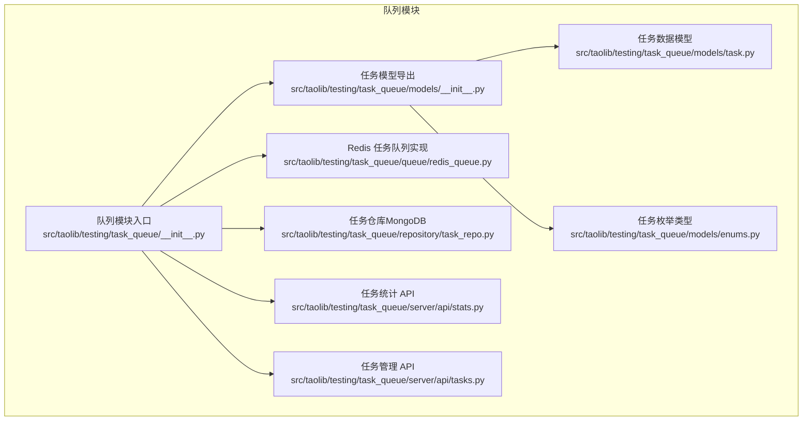
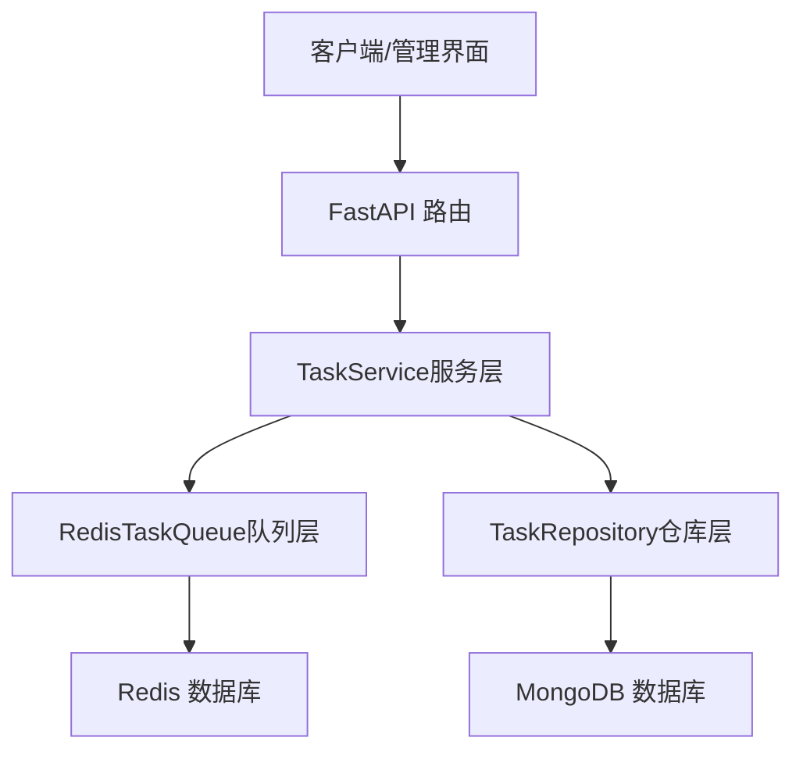
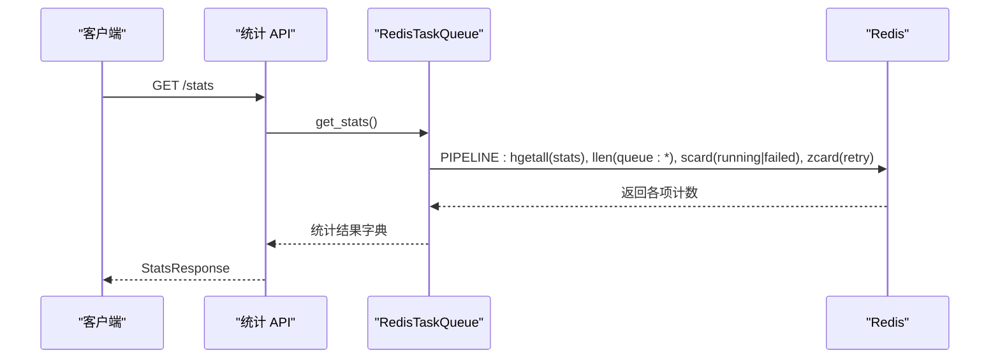
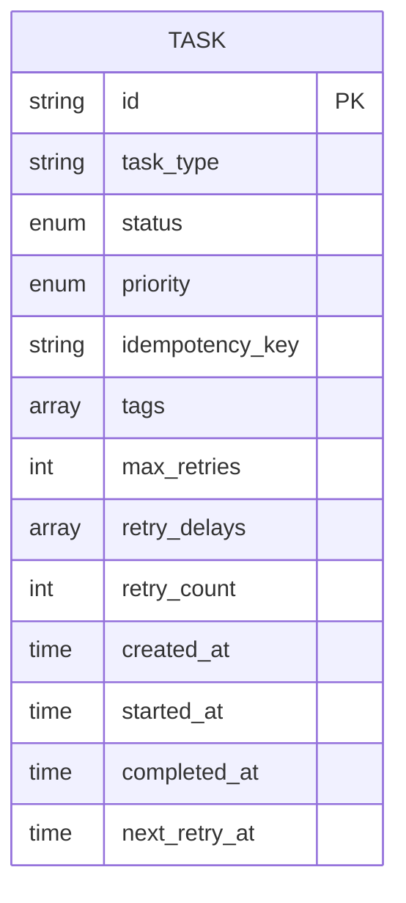
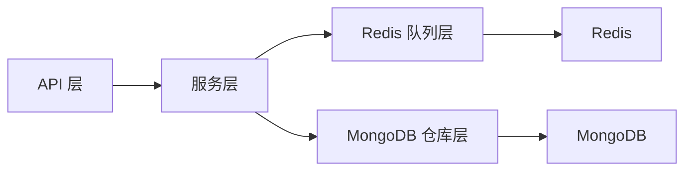

# 队列监控系统

<cite>
**本文引用的文件**
- [队列模块入口](file://src/taolib/testing/task_queue/__init__.py)
- [任务模型导出](file://src/taolib/testing/task_queue/models/__init__.py)
- [任务数据模型](file://src/taolib/testing/task_queue/models/task.py)
- [任务枚举类型](file://src/taolib/testing/task_queue/models/enums.py)
- [Redis 任务队列实现](file://src/taolib/testing/task_queue/queue/redis_queue.py)
- [任务仓库（MongoDB）](file://src/taolib/testing/task_queue/repository/task_repo.py)
- [任务统计 API](file://src/taolib/testing/task_queue/server/api/stats.py)
- [任务管理 API](file://src/taolib/testing/task_queue/server/api/tasks.py)
</cite>

## 目录
1. [简介](#简介)
2. [项目结构](#项目结构)
3. [核心组件](#核心组件)
4. [架构总览](#架构总览)
5. [详细组件分析](#详细组件分析)
6. [依赖分析](#依赖分析)
7. [性能考虑](#性能考虑)
8. [故障排查指南](#故障排查指南)
9. [结论](#结论)
10. [附录](#附录)

## 简介
本文件为“队列监控系统”的技术文档，聚焦于后台任务队列的统计信息采集、实时监控指标、数据存储与查询、告警机制、Web 管理界面、性能基准测试与导出能力，以及监控配置项。该系统基于 Redis 实现高性能的优先级队列与重试调度，并通过 FastAPI 提供统计与任务管理接口；任务持久化采用 MongoDB，支持按状态、类型、优先级等多维筛选与索引。

## 项目结构
围绕队列监控的关键目录与文件如下：
- 队列模块入口：对外暴露任务提交、注册处理器、启动 Web 服务等能力
- 模型层：统一的任务数据模型与枚举类型
- 队列层：基于 Redis 的优先级队列、重试调度与统计
- 仓库层：MongoDB 的任务持久化与索引
- 服务端 API：统计与任务管理接口

**图示来源**
- [队列模块入口:1-76](file://src/taolib/testing/task_queue/__init__.py#L1-L76)
- [任务模型导出:1-26](file://src/taolib/testing/task_queue/models/__init__.py#L1-L26)
- [任务数据模型:1-107](file://src/taolib/testing/task_queue/models/task.py#L1-L107)
- [任务枚举类型:1-28](file://src/taolib/testing/task_queue/models/enums.py#L1-L28)
- [Redis 任务队列实现:1-317](file://src/taolib/testing/task_queue/queue/redis_queue.py#L1-L317)
- [任务仓库（MongoDB）:1-169](file://src/taolib/testing/task_queue/repository/task_repo.py#L1-L169)
- [任务统计 API:1-65](file://src/taolib/testing/task_queue/server/api/stats.py#L1-L65)
- [任务管理 API:1-205](file://src/taolib/testing/task_queue/server/api/tasks.py#L1-L205)

**章节来源**
- [队列模块入口:1-76](file://src/taolib/testing/task_queue/__init__.py#L1-L76)
- [任务模型导出:1-26](file://src/taolib/testing/task_queue/models/__init__.py#L1-L26)

## 核心组件
- 任务模型与枚举：定义任务类型、优先级、状态等基础数据结构
- Redis 队列：实现高/普通/低三级优先级队列、运行中集合、失败集合、重试有序集合、任务元数据哈希、全局计数器等
- 任务仓库：封装 MongoDB 的任务持久化、查询与索引
- 统计 API：提供全局统计与队列深度查询
- 任务 API：提供任务提交、查询、重试、取消、删除等管理能力

**章节来源**
- [任务数据模型:1-107](file://src/taolib/testing/task_queue/models/task.py#L1-L107)
- [任务枚举类型:1-28](file://src/taolib/testing/task_queue/models/enums.py#L1-L28)
- [Redis 任务队列实现:1-317](file://src/taolib/testing/task_queue/queue/redis_queue.py#L1-L317)
- [任务仓库（MongoDB）:1-169](file://src/taolib/testing/task_queue/repository/task_repo.py#L1-L169)
- [任务统计 API:1-65](file://src/taolib/testing/task_queue/server/api/stats.py#L1-L65)
- [任务管理 API:1-205](file://src/taolib/testing/task_queue/server/api/tasks.py#L1-L205)

## 架构总览
系统采用“API 层—服务层—队列层—存储层”的分层设计：
- API 层：FastAPI 路由负责请求解析与响应封装
- 服务层：TaskService 聚合仓库与队列，协调任务生命周期
- 队列层：RedisTaskQueue 提供队列入出、重试调度与统计
- 存储层：TaskRepository 提供 MongoDB 的任务持久化与查询

**图示来源**
- [任务统计 API:37-62](file://src/taolib/testing/task_queue/server/api/stats.py#L37-L62)
- [任务管理 API:34-44](file://src/taolib/testing/task_queue/server/api/tasks.py#L34-L44)
- [Redis 任务队列实现:14-44](file://src/taolib/testing/task_queue/queue/redis_queue.py#L14-L44)
- [任务仓库（MongoDB）:15-24](file://src/taolib/testing/task_queue/repository/task_repo.py#L15-L24)

## 详细组件分析

### 统计信息采集机制
- 全局统计：通过 Redis 的全局计数器与集合/列表长度，汇总提交、完成、失败、重试、运行中、最近完成、重试中等指标
- 队列深度：分别统计高/普通/低优先级队列长度
- 采集方式：批量管道命令一次性获取多指标，减少往返开销

**图示来源**
- [任务统计 API:37-50](file://src/taolib/testing/task_queue/server/api/stats.py#L37-L50)
- [Redis 任务队列实现:226-271](file://src/taolib/testing/task_queue/queue/redis_queue.py#L226-L271)

**章节来源**
- [任务统计 API:1-65](file://src/taolib/testing/task_queue/server/api/stats.py#L1-L65)
- [Redis 任务队列实现:226-271](file://src/taolib/testing/task_queue/queue/redis_queue.py#L226-L271)

### 实时监控指标
- 队列长度：高/普通/低优先级队列当前积压
- 平均等待时间：可通过“最近完成列表长度”与“提交/完成计数”推导（需结合业务侧埋点）
- 处理吞吐量：单位时间内完成任务数（可基于时间窗口计算）
- 错误率：失败任务数 / 总完成数（或总提交数）

上述指标均可由 Redis 的计数器与集合/列表长度直接获得，便于前端实时展示。

**章节来源**
- [任务统计 API:11-27](file://src/taolib/testing/task_queue/server/api/stats.py#L11-L27)
- [Redis 任务队列实现:273-289](file://src/taolib/testing/task_queue/queue/redis_queue.py#L273-L289)

### 监控数据存储与查询
- Redis 结构要点
  - 队列键：高/普通/低优先级队列（LIST）
  - 运行中：运行中任务 ID（SET）
  - 最近完成：最近完成任务 ID（LIST，限制长度）
  - 失败：失败任务 ID（SET）
  - 重试：重试调度（ZSET，score 为下次重试时间）
  - 任务元数据：任务哈希（HASH）
  - 全局计数器：统计哈希（HASH）
- MongoDB 索引与 TTL
  - 任务类型、状态+优先级、幂等键（唯一）等索引
  - created_at 字段设置 TTL，自动清理历史任务

**图示来源**
- [任务数据模型:68-104](file://src/taolib/testing/task_queue/models/task.py#L68-L104)
- [任务仓库（MongoDB）:159-166](file://src/taolib/testing/task_queue/repository/task_repo.py#L159-L166)

**章节来源**
- [Redis 任务队列实现:19-29](file://src/taolib/testing/task_queue/queue/redis_queue.py#L19-L29)
- [任务仓库（MongoDB）:159-166](file://src/taolib/testing/task_queue/repository/task_repo.py#L159-L166)

### 告警机制实现
- 阈值设置：队列长度（高/普通/低）、失败率、重试堆积、运行中任务长时间未推进
- 告警规则：基于统计 API 返回的指标进行阈值判断
- 通知渠道：可扩展至邮件、Webhook 或消息队列推送（当前仓库未内置具体通知实现）

注：本节为概念性说明，不直接对应具体代码文件。

### Web 管理界面功能
- 实时状态展示：通过统计 API 获取全局统计与队列深度
- 图表可视化：前端可基于统计结果绘制队列长度、吞吐量、错误率等趋势图
- 手动操作：通过任务管理 API 支持重试、取消、删除终态任务

**章节来源**
- [任务统计 API:37-62](file://src/taolib/testing/task_queue/server/api/stats.py#L37-L62)
- [任务管理 API:117-203](file://src/taolib/testing/task_queue/server/api/tasks.py#L117-L203)

### 性能基准测试工具
- 建议场景：并发提交任务、不同优先级占比、失败重试策略、Worker 并发度
- 指标观测：队列长度、平均等待时间、吞吐量、错误率、Redis 命令耗时
- 工具建议：使用压力测试框架（如 Locust、JMeter）或自定义脚本调用任务 API

注：本节为通用实践指导，不直接对应具体代码文件。

### 监控数据导出
- CSV 导出：后端可提供导出接口，将任务列表与统计结果转为 CSV
- API 接口：通过任务管理 API 与统计 API 获取数据，前端或外部系统拉取
- 第三方集成：通过 Webhook 或消息队列事件流对接监控平台

注：本节为通用实践指导，不直接对应具体代码文件。

### 监控配置选项
- 采样频率：统计 API 的轮询间隔
- 保留周期：Redis 计数器与集合长度、MongoDB TTL
- 聚合策略：按时间窗口（分钟/小时）聚合统计，计算移动平均与峰值

注：本节为通用实践指导，不直接对应具体代码文件。

## 依赖分析
- 组件耦合
  - API 层依赖服务层；服务层依赖队列层与仓库层
  - 队列层与仓库层分别依赖 Redis 与 MongoDB
- 外部依赖
  - Redis：异步客户端、管道事务
  - MongoDB：Motor 异步驱动、索引与 TTL
  - FastAPI：路由与响应模型

**图示来源**
- [任务统计 API:37-50](file://src/taolib/testing/task_queue/server/api/stats.py#L37-L50)
- [任务管理 API:34-44](file://src/taolib/testing/task_queue/server/api/tasks.py#L34-L44)
- [Redis 任务队列实现:14-44](file://src/taolib/testing/task_queue/queue/redis_queue.py#L14-L44)
- [任务仓库（MongoDB）:15-24](file://src/taolib/testing/task_queue/repository/task_repo.py#L15-L24)

**章节来源**
- [任务统计 API:1-65](file://src/taolib/testing/task_queue/server/api/stats.py#L1-L65)
- [任务管理 API:1-205](file://src/taolib/testing/task_queue/server/api/tasks.py#L1-L205)
- [Redis 任务队列实现:1-317](file://src/taolib/testing/task_queue/queue/redis_queue.py#L1-L317)
- [任务仓库（MongoDB）:1-169](file://src/taolib/testing/task_queue/repository/task_repo.py#L1-L169)

## 性能考虑
- Redis 管道：批量获取统计指标，降低网络往返
- 队列结构：LIST 实现优先级队列，BRPOP 阻塞弹出，ZSET 实现重试调度
- 集合裁剪：最近完成列表限制长度，避免无限增长
- 索引优化：MongoDB 为高频查询字段建立复合索引与 TTL
- 并发与限流：Worker 并发度与速率限制需结合业务负载调整

**章节来源**
- [Redis 任务队列实现:75-79](file://src/taolib/testing/task_queue/queue/redis_queue.py#L75-L79)
- [Redis 任务队列实现:117-124](file://src/taolib/testing/task_queue/queue/redis_queue.py#L117-L124)
- [Redis 任务队列实现:126-156](file://src/taolib/testing/task_queue/queue/redis_queue.py#L126-L156)
- [Redis 任务队列实现:164-194](file://src/taolib/testing/task_queue/queue/redis_queue.py#L164-L194)
- [Redis 任务队列实现:279-289](file://src/taolib/testing/task_queue/queue/redis_queue.py#L279-L289)
- [任务仓库（MongoDB）:159-166](file://src/taolib/testing/task_queue/repository/task_repo.py#L159-L166)

## 故障排查指南
- 任务无法出队
  - 检查高/普通/低优先级队列长度与 BRPOP 配置
  - 确认队列键前缀与 Redis 连接
- 任务卡在运行中
  - 检查运行中集合是否正确移除
  - 确认 Worker 是否正常 ACK/NACK
- 重试未生效
  - 检查重试有序集合与到期查询逻辑
  - 确认任务优先级回填与重新入队流程
- 统计异常
  - 核对全局计数器与集合/列表长度的原子性更新
  - 确认管道命令执行结果

**章节来源**
- [Redis 任务队列实现:81-103](file://src/taolib/testing/task_queue/queue/redis_queue.py#L81-L103)
- [Redis 任务队列实现:105-124](file://src/taolib/testing/task_queue/queue/redis_queue.py#L105-L124)
- [Redis 任务队列实现:126-156](file://src/taolib/testing/task_queue/queue/redis_queue.py#L126-L156)
- [Redis 任务队列实现:158-194](file://src/taolib/testing/task_queue/queue/redis_queue.py#L158-L194)
- [Redis 任务队列实现:226-271](file://src/taolib/testing/task_queue/queue/redis_queue.py#L226-L271)

## 结论
该队列监控系统以 Redis 为核心实现高性能的优先级队列与重试调度，配合 MongoDB 完成任务持久化与高效查询。通过统计 API 与任务管理 API，系统具备完善的监控与运维能力。建议在生产环境中结合告警规则、导出与第三方集成，进一步完善可观测性与自动化运维。

## 附录
- 快速开始
  - 注册任务处理器
  - 提交任务
  - 启动 Web 服务器并访问统计与任务管理接口
- 关键接口路径
  - 统计接口：GET /stats、GET /stats/queue-depths
  - 任务接口：GET /tasks、GET /tasks/{task_id}、POST /tasks、POST /tasks/{task_id}/retry、POST /tasks/{task_id}/cancel、DELETE /tasks/{task_id}

**章节来源**
- [队列模块入口:27-33](file://src/taolib/testing/task_queue/__init__.py#L27-L33)
- [任务统计 API:37-62](file://src/taolib/testing/task_queue/server/api/stats.py#L37-L62)
- [任务管理 API:79-203](file://src/taolib/testing/task_queue/server/api/tasks.py#L79-L203)